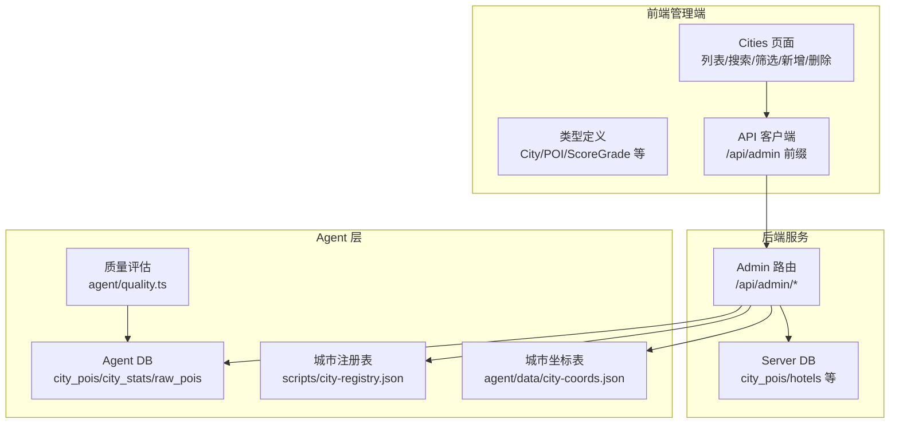
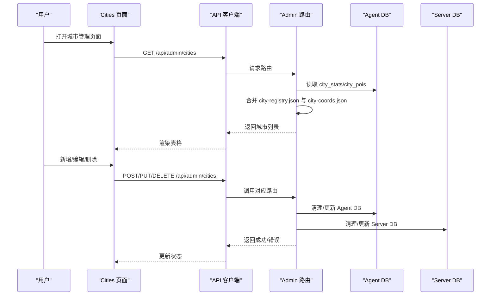
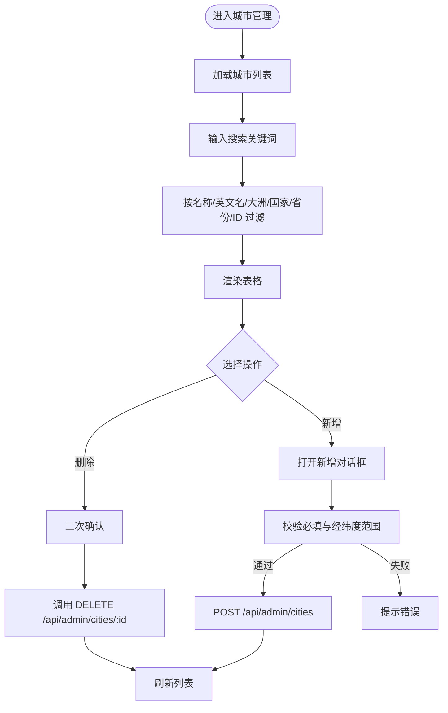
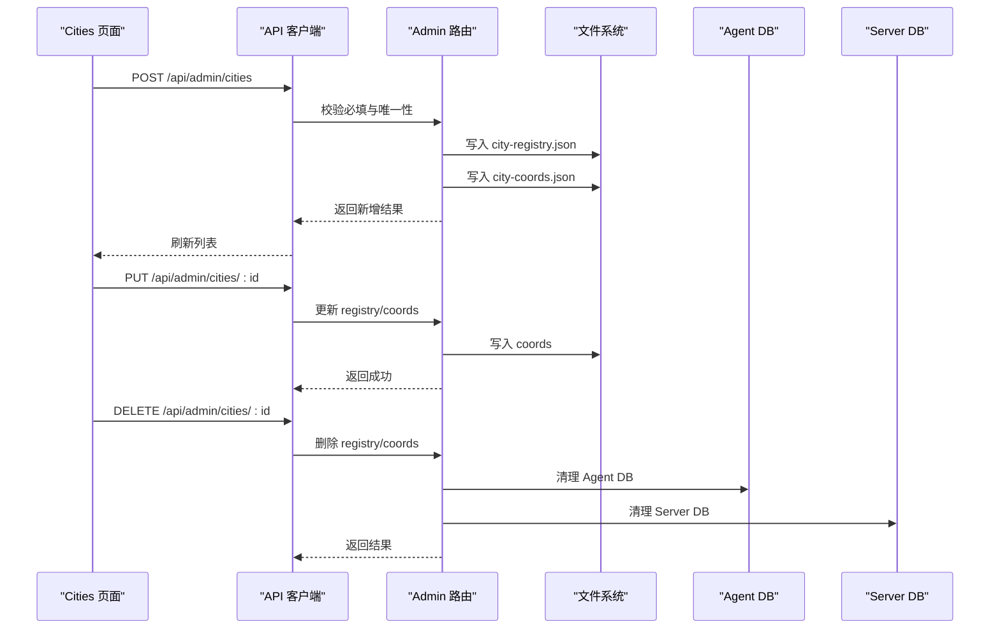
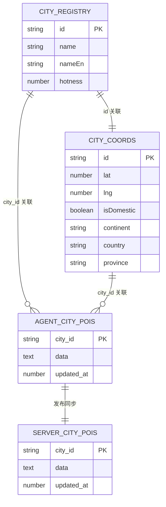
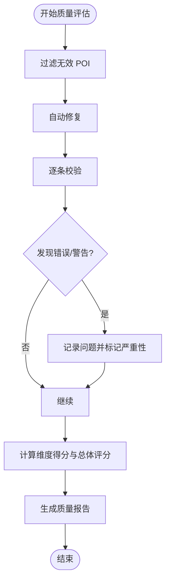
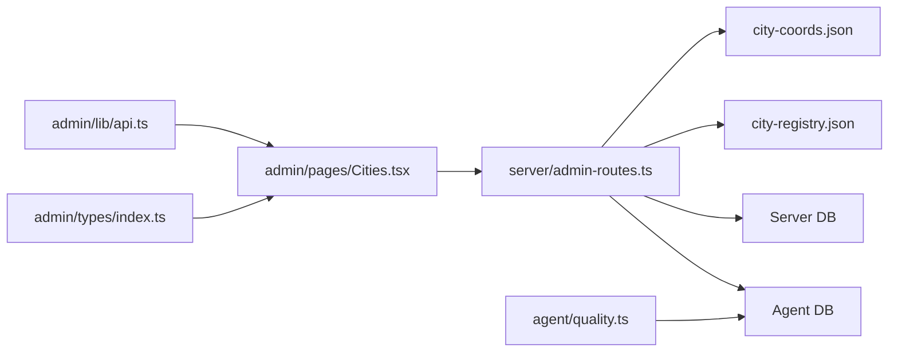

# 城市管理功能

<cite>
**本文档引用的文件**
- [admin/pages/Cities.tsx](file://admin/pages/Cities.tsx)
- [admin/types/index.ts](file://admin/types/index.ts)
- [admin/lib/api.ts](file://admin/lib/api.ts)
- [server/admin-routes.ts](file://server/admin-routes.ts)
- [server/db.ts](file://server/db.ts)
- [agent/data/city-coords.json](file://agent/data/city-coords.json)
- [scripts/city-registry.json](file://scripts/city-registry.json)
- [wiki/knowledge/city-data-kb.md](file://wiki/knowledge/city-data-kb.md)
- [agent/quality.ts](file://agent/quality.ts)
- [agent/index.ts](file://agent/index.ts)
</cite>

## 目录
1. [简介](#简介)
2. [项目结构](#项目结构)
3. [核心组件](#核心组件)
4. [架构总览](#架构总览)
5. [详细组件分析](#详细组件分析)
6. [依赖关系分析](#依赖关系分析)
7. [性能考虑](#性能考虑)
8. [故障排除指南](#故障排除指南)
9. [结论](#结论)

## 简介
本文件面向“城市管理”功能，系统化梳理城市数据的管理界面、编辑与更新机制、导入导出与批量处理、层级关系与关联、质量控制与验证、权限控制与操作日志，以及与系统其他模块的关联影响。目标是帮助产品、运营与开发人员快速理解并高效使用城市数据管理能力。

## 项目结构
- 前端管理端（admin）负责城市列表展示、搜索筛选、新增编辑、删除等操作，并通过统一的 admin API 与后端交互。
- 后端服务（server）提供 admin API，连接 Agent DB 与 Server DB，聚合城市与 POI 数据，支持城市维度的统计与发布流程。
- Agent 层负责城市与 POI 的采集、清洗、质量评估与存储，城市元数据由两个 JSON 文件维护。
- wiki 文档提供城市数据的双文件架构、字段规范与质量校验脚本。

**图表来源**
- [admin/pages/Cities.tsx:1-251](file://admin/pages/Cities.tsx#L1-L251)
- [admin/lib/api.ts:1-33](file://admin/lib/api.ts#L1-L33)
- [server/admin-routes.ts:1-800](file://server/admin-routes.ts#L1-L800)
- [server/db.ts:1-513](file://server/db.ts#L1-L513)
- [agent/data/city-coords.json:1-800](file://agent/data/city-coords.json#L1-L800)
- [scripts/city-registry.json:1-233](file://scripts/city-registry.json#L1-L233)
- [agent/quality.ts:1-327](file://agent/quality.ts#L1-L327)

**章节来源**
- [admin/pages/Cities.tsx:1-251](file://admin/pages/Cities.tsx#L1-L251)
- [server/admin-routes.ts:1-800](file://server/admin-routes.ts#L1-L800)

## 核心组件
- 城市管理页面（Cities 页面）
  - 功能：加载城市列表、搜索（按名称/英文名/大洲/国家/省份/ID）、分页、新增城市对话框、删除城市。
  - 数据来源：/api/admin/cities。
  - 表单校验：必填项校验、经纬度范围校验。
- 类型系统（admin/types/index.ts）
  - 定义 City 接口、评分等级、审查状态、API 响应等类型，支撑前端数据结构与校验。
- API 客户端（admin/lib/api.ts）
  - 统一封装 /api/admin 前缀请求，自动处理响应状态与错误。
- 后端路由（server/admin-routes.ts）
  - 提供城市增删改查、统计、POI 列表与搜索、发布与审查等接口。
  - 聚合 city-registry.json 与 city-coords.json，读取 Agent DB 与 Server DB。
- Server DB（server/db.ts）
  - 存放城市 POI 缓存、用户、行程、评论、酒店缓存等。
- 城市数据文件
  - scripts/city-registry.json：城市基础信息与采集优先级。
  - agent/data/city-coords.json：地理元数据与分类归属。
- 质量评估（agent/quality.ts）
  - 对 POI 数据进行清洗、校验与评分，输出质量报告。

**章节来源**
- [admin/pages/Cities.tsx:16-157](file://admin/pages/Cities.tsx#L16-L157)
- [admin/types/index.ts:52-65](file://admin/types/index.ts#L52-L65)
- [admin/lib/api.ts:10-32](file://admin/lib/api.ts#L10-L32)
- [server/admin-routes.ts:498-667](file://server/admin-routes.ts#L498-L667)
- [server/db.ts:47-147](file://server/db.ts#L47-L147)
- [scripts/city-registry.json:1-233](file://scripts/city-registry.json#L1-L233)
- [agent/data/city-coords.json:1-800](file://agent/data/city-coords.json#L1-L800)
- [agent/quality.ts:173-293](file://agent/quality.ts#L173-L293)

## 架构总览
城市管理功能采用“前端管理端 + 后端 Admin API + Agent/Server 数据层”的三层架构：
- 前端通过 admin API 获取/更新城市数据，调用 Cities 页面完成 CRUD。
- 后端 Admin 路由聚合两类城市元数据（注册表 + 坐标表），并从 Agent DB 读取城市统计与 POI，向 Server DB 写入发布结果。
- Agent 层负责城市与 POI 的采集、清洗与质量评估，产出可被后端使用的高质量数据。

**图表来源**
- [admin/pages/Cities.tsx:23-48](file://admin/pages/Cities.tsx#L23-L48)
- [admin/lib/api.ts:22-32](file://admin/lib/api.ts#L22-L32)
- [server/admin-routes.ts:500-667](file://server/admin-routes.ts#L500-L667)

## 详细组件分析

### 城市管理界面（Cities 页面）
- 列表展示
  - 字段：城市 ID、中文名、英文名、大洲、国家、省份、POI 数量、最近更新时间。
  - 加载状态：骨架屏占位，避免空列表闪烁。
- 搜索与筛选
  - 支持按名称（中/英）、大洲、国家、省份、ID 模糊搜索。
  - 结果计数实时更新。
- 操作按钮
  - 查看 POI：跳转至 POI 浏览器并附带城市参数。
  - 在地图中查看：打开外部地图链接。
  - 删除：二次确认弹窗，调用 DELETE /api/admin/cities/:id。
- 新增城市
  - 表单字段：id、name、nameEn、continent、country、province、lat、lng。
  - 必填校验：id/name/country 不能为空；经纬度需在有效范围内。
  - 成功后刷新列表。

**图表来源**
- [admin/pages/Cities.tsx:33-48](file://admin/pages/Cities.tsx#L33-L48)
- [admin/pages/Cities.tsx:159-196](file://admin/pages/Cities.tsx#L159-L196)

**章节来源**
- [admin/pages/Cities.tsx:16-157](file://admin/pages/Cities.tsx#L16-L157)

### 城市信息编辑与更新机制
- 新增城市
  - 写入 city-registry.json（id/name/nameEn/hotness）。
  - 写入 city-coords.json（lat/lng/isDomestic/continent/country/province）。
  - 返回新增成功的数据对象。
- 更新城市
  - 更新 city-registry.json 中的 name/nameEn。
  - 更新 city-coords.json 中的 continent/country/province/lat/lng/isDomestic。
- 删除城市
  - 从 registry 与 coords 移除。
  - 清理 Agent DB（city_pois/city_stats/raw_pois/collection_logs/pending_updates）。
  - 清理 Server DB（city_pois/hotels）。
  - 若均不存在则返回 404。

**图表来源**
- [server/admin-routes.ts:559-667](file://server/admin-routes.ts#L559-L667)
- [scripts/city-registry.json:1-233](file://scripts/city-registry.json#L1-L233)
- [agent/data/city-coords.json:1-800](file://agent/data/city-coords.json#L1-L800)

**章节来源**
- [server/admin-routes.ts:559-667](file://server/admin-routes.ts#L559-L667)

### 城市数据的导入导出与批量操作
- 导入
  - 通过新增接口批量导入城市：POST /api/admin/cities。
  - 也可直接编辑 city-registry.json 与 city-coords.json，后端读取生效。
- 导出
  - 后端提供 /api/admin/cities 返回当前城市集合，可用于导出。
  - 城市级统计与 POI 列表可用于进一步导出分析。
- 批量操作
  - Admin 路由支持批量触发更新与发布（/api/admin/updates/batch、/publish/city）。
  - Agent 层具备质量评估与清洗能力，可在批量更新前预检。

**章节来源**
- [server/admin-routes.ts:498-557](file://server/admin-routes.ts#L498-L557)
- [server/admin-routes.ts:16-24](file://server/admin-routes.ts#L16-L24)
- [agent/quality.ts:173-293](file://agent/quality.ts#L173-L293)

### 城市层级关系与关联
- 双文件架构
  - city-registry.json：城市基础信息与采集优先级。
  - city-coords.json：地理元数据（经纬度、是否国内、大洲、国家、省份）。
- 关联方式
  - 两者均以 city.id（全小写英文）为联结键，运行时合并生成城市视图。
- 与 POI 的关联
  - Agent DB 保存 city_pois（按城市聚合的 POI 数据）。
  - Server DB 保存 city_pois（发布后的 POI 缓存）。
  - Admin 路由在统计与发布流程中对比 Agent 与 Server 数据，识别新增/更新/已发布。

**图表来源**
- [scripts/city-registry.json:1-233](file://scripts/city-registry.json#L1-L233)
- [agent/data/city-coords.json:1-800](file://agent/data/city-coords.json#L1-L800)
- [server/db.ts:47-53](file://server/db.ts#L47-L53)
- [server/admin-routes.ts:500-557](file://server/admin-routes.ts#L500-L557)

**章节来源**
- [wiki/knowledge/city-data-kb.md:1-63](file://wiki/knowledge/city-data-kb.md#L1-L63)
- [server/admin-routes.ts:500-557](file://server/admin-routes.ts#L500-L557)

### 城市数据质量控制与验证
- 质量维度
  - 完整性、准确性、丰富度、多样性，综合评分与等级划分。
- 校验规则
  - 坐标有效性与与城市中心距离校验。
  - 名称/别名/地址/标签/分类路径等字段一致性与完整性检查。
  - 自动修复与问题记录。
- 报告输出
  - 输出整体评分、各维度得分、问题清单、按类目统计等。

**图表来源**
- [agent/quality.ts:173-293](file://agent/quality.ts#L173-L293)
- [agent/index.ts:470-501](file://agent/index.ts#L470-L501)

**章节来源**
- [agent/quality.ts:15-327](file://agent/quality.ts#L15-L327)
- [agent/index.ts:470-501](file://agent/index.ts#L470-L501)

### 权限控制与操作日志
- 权限控制
  - 认证中间件（requireAuth/optionalAuth）基于 JWT 实现，提取用户信息并注入请求上下文。
  - Admin API 路由建议配合 requireAuth 使用，确保仅授权用户可执行管理操作。
- 操作日志
  - Admin 路由在清理 Agent DB 与 Server DB 时打印错误日志，便于排查。
  - 建议在业务关键点（新增/更新/删除/发布）增加审计日志（当前实现未见专门的日志表，可扩展）。

**章节来源**
- [server/admin-routes.ts:636-660](file://server/admin-routes.ts#L636-L660)
- [server/auth.ts:87-113](file://server/auth.ts#L87-L113)

### 与其他模块的关联与影响
- 与 POI 模块
  - Admin 路由对比 Agent 与 Server 的 POI，识别新增/更新/已发布，支撑发布流程。
  - POI 列表与搜索接口支持按城市、分类、评分等条件过滤。
- 与旅行计划模块
  - Server DB 的 city_pois 用于行程规划与旅行笔记的 POI 数据来源。
- 与 Agent 采集模块
  - Agent DB 的 city_stats 提供城市维度的统计信息，辅助管理端了解数据新鲜度与质量。

**章节来源**
- [server/admin-routes.ts:81-99](file://server/admin-routes.ts#L81-L99)
- [server/admin-routes.ts:707-798](file://server/admin-routes.ts#L707-L798)
- [server/db.ts:237-261](file://server/db.ts#L237-L261)

## 依赖关系分析
- 前端依赖
  - admin/types/index.ts：类型约束与校验。
  - admin/lib/api.ts：统一请求封装。
  - admin/pages/Cities.tsx：UI 逻辑与交互。
- 后端依赖
  - server/admin-routes.ts：Admin API 实现，依赖 Agent DB、Server DB、文件系统。
  - server/db.ts：Server DB 初始化与 POI 缓存读写。
- 数据依赖
  - scripts/city-registry.json 与 agent/data/city-coords.json：城市元数据双文件架构。
  - agent/quality.ts：质量评估与清洗。

**图表来源**
- [admin/types/index.ts:52-65](file://admin/types/index.ts#L52-L65)
- [admin/lib/api.ts:22-32](file://admin/lib/api.ts#L22-L32)
- [admin/pages/Cities.tsx:16-157](file://admin/pages/Cities.tsx#L16-L157)
- [server/admin-routes.ts:500-667](file://server/admin-routes.ts#L500-L667)
- [server/db.ts:47-147](file://server/db.ts#L47-L147)
- [scripts/city-registry.json:1-233](file://scripts/city-registry.json#L1-L233)
- [agent/data/city-coords.json:1-800](file://agent/data/city-coords.json#L1-L800)
- [agent/quality.ts:173-293](file://agent/quality.ts#L173-L293)

**章节来源**
- [admin/types/index.ts:52-65](file://admin/types/index.ts#L52-L65)
- [server/admin-routes.ts:500-667](file://server/admin-routes.ts#L500-L667)

## 性能考虑
- 前端
  - 列表加载使用骨架屏提升感知性能；搜索采用客户端过滤，适合中小规模数据集。
- 后端
  - Admin 路由在合并 registry 与 coords 时使用 Map/查找，复杂度可控。
  - POI 列表与搜索支持分页与评分过滤，建议在大数据场景下合理设置分页大小。
- 数据层
  - Agent DB 与 Server DB 均使用 WAL 模式，提升并发读写稳定性。
  - 城市统计与 POI 缓存表设计简洁，查询成本较低。

## 故障排除指南
- 新增城市失败
  - 检查必填字段与经纬度范围；确认 id 是否重复。
  - 查看后端返回的错误码与消息。
- 删除城市后仍可见
  - 确认是否同时清理了 Agent DB 与 Server DB；查看后端清理日志。
- 城市列表为空
  - 检查 city-registry.json 与 city-coords.json 是否存在且格式正确。
  - 确认 Agent DB 中是否存在对应 city_pois 数据。
- 质量评估异常
  - 使用 agent/quality.ts 的评估函数定位具体 POI 问题；关注坐标与分类路径等关键字段。

**章节来源**
- [admin/pages/Cities.tsx:166-196](file://admin/pages/Cities.tsx#L166-L196)
- [server/admin-routes.ts:636-660](file://server/admin-routes.ts#L636-L660)
- [agent/quality.ts:173-293](file://agent/quality.ts#L173-L293)

## 结论
城市管理功能通过清晰的双文件架构与 Admin API，实现了城市数据的可视化管理、质量控制与与 POI/旅行计划模块的顺畅衔接。建议在生产环境中结合 requireAuth 强化权限控制，并在关键操作处补充审计日志，以满足合规与追踪需求。对于大规模数据，建议优化后端分页与索引策略，持续保障系统性能与稳定性。