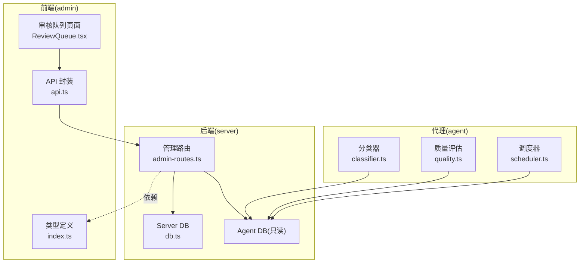
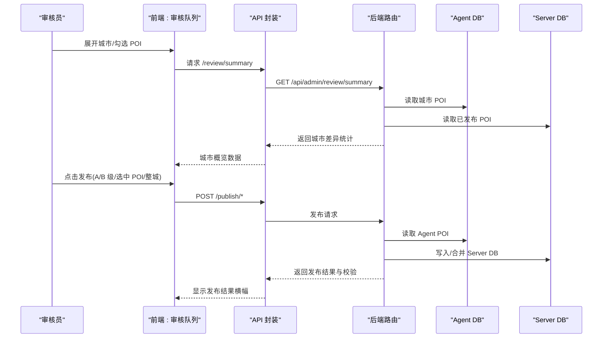
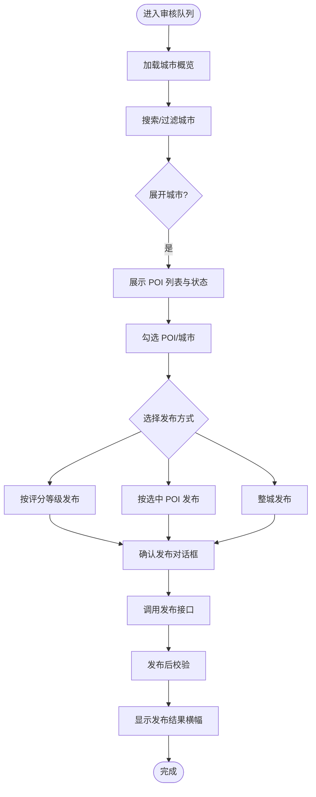
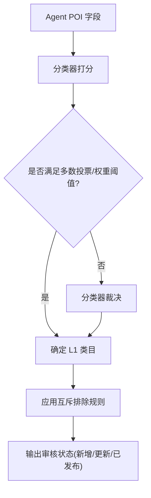
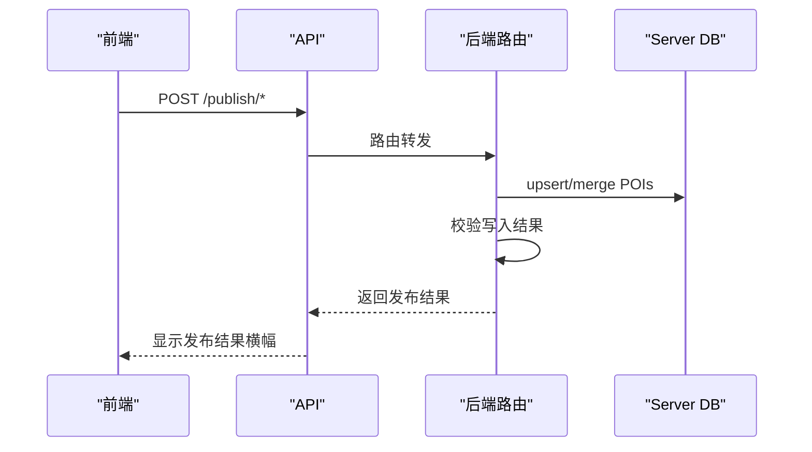
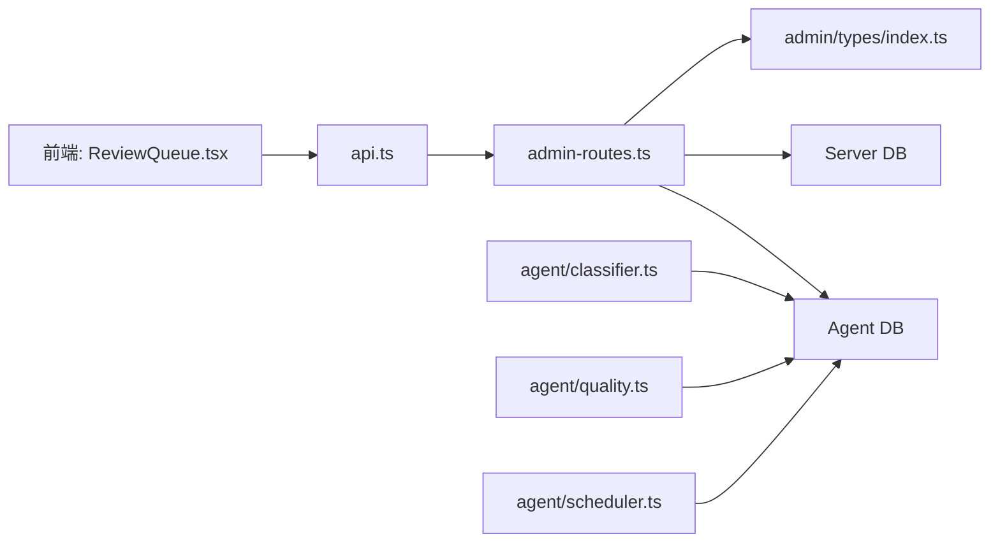

# 审核队列系统

<cite>
**本文档引用的文件**
- [ReviewQueue.tsx](file://admin/pages/ReviewQueue.tsx)
- [admin-routes.ts](file://server/admin-routes.ts)
- [db.ts](file://server/db.ts)
- [index.ts](file://admin/types/index.ts)
- [review-guide.md](file://wiki/review-guide.md)
- [classifier.ts](file://agent/classifier.ts)
- [scheduler.ts](file://agent/scheduler.ts)
- [quality.ts](file://agent/quality.ts)
- [api.ts](file://admin/lib/api.ts)
</cite>

## 目录
1. [简介](#简介)
2. [项目结构](#项目结构)
3. [核心组件](#核心组件)
4. [架构总览](#架构总览)
5. [详细组件分析](#详细组件分析)
6. [依赖关系分析](#依赖关系分析)
7. [性能考虑](#性能考虑)
8. [故障排查指南](#故障排查指南)
9. [结论](#结论)
10. [附录](#附录)

## 简介
本系统围绕“审核队列”构建，负责对 Agent 侧生成的 POI 数据与 Server 侧现有数据进行差异比对、状态标注、分级筛选与批量发布。前端提供城市维度的概览与 POI 细节视图，支持按评分等级、变更类型、全选/反选等策略进行高效审核；后端提供差异比较、发布校验、质量评估与调度能力，支撑自动化与人工审核的协同。

## 项目结构
- 前端（admin）：基于 React + Tailwind，核心页面为审核队列页，提供搜索、过滤、展开详情、批量选择与发布确认等交互。
- 后端（server）：Express 路由层，连接 Agent DB（只读）与 Server DB（读写），提供审核概览、城市详情、发布接口与校验接口。
- 代理与质量（agent）：分类器、质量评估、调度器等，用于生成与清洗数据，间接影响审核队列中的数据质量与评分分布。
- 类型定义（admin/types）：统一前后端数据模型与状态枚举，确保审核状态、评分等级、发布结果等字段一致。

**图表来源**
- [ReviewQueue.tsx:32-339](file://admin/pages/ReviewQueue.tsx#L32-L339)
- [admin-routes.ts:1-1476](file://server/admin-routes.ts#L1-L1476)
- [db.ts:1-513](file://server/db.ts#L1-L513)
- [index.ts:1-277](file://admin/types/index.ts#L1-L277)
- [classifier.ts:1-601](file://agent/classifier.ts#L1-L601)
- [quality.ts:1-344](file://agent/quality.ts#L1-L344)
- [scheduler.ts:1-98](file://agent/scheduler.ts#L1-L98)

**章节来源**
- [ReviewQueue.tsx:32-339](file://admin/pages/ReviewQueue.tsx#L32-L339)
- [admin-routes.ts:1-1476](file://server/admin-routes.ts#L1-L1476)
- [db.ts:1-513](file://server/db.ts#L1-L513)
- [index.ts:1-277](file://admin/types/index.ts#L1-L277)
- [classifier.ts:1-601](file://agent/classifier.ts#L1-L601)
- [quality.ts:1-344](file://agent/quality.ts#L1-L344)
- [scheduler.ts:1-98](file://agent/scheduler.ts#L1-L98)

## 核心组件
- 审核队列页面：城市概览、POI 列表、状态徽章、评分等级、差异对比、批量发布。
- 管理路由：城市级审核概览、POI 级别详情、按城市/按评分发布、发布后校验。
- 数据模型：POI、城市、评分等级、审核状态、发布结果等类型定义。
- 质量与分类：评分等级映射、评分区间、分类器规则与排除规则，支撑自动审核与人工复核的结合。

**章节来源**
- [ReviewQueue.tsx:24-28](file://admin/pages/ReviewQueue.tsx#L24-L28)
- [admin-routes.ts:964-1226](file://server/admin-routes.ts#L964-L1226)
- [index.ts:201-250](file://admin/types/index.ts#L201-L250)
- [classifier.ts:349-363](file://agent/classifier.ts#L349-L363)

## 架构总览
系统采用“前端展示 + 后端路由 + 两套数据库”的架构：
- 前端通过 api.ts 统一调用 /api/admin 下的路由。
- 后端路由同时访问 Agent DB（只读，存放 Agent 生成的 POI）与 Server DB（读写，存放已发布数据）。
- 审核状态通过比较 Agent 与 Server 的 POI 计算得出，支持“新增/更新/已发布”。

**图表来源**
- [ReviewQueue.tsx:54-109](file://admin/pages/ReviewQueue.tsx#L54-L109)
- [admin-routes.ts:1054-1194](file://server/admin-routes.ts#L1054-L1194)
- [api.ts:1-32](file://admin/lib/api.ts#L1-L32)

**章节来源**
- [ReviewQueue.tsx:54-109](file://admin/pages/ReviewQueue.tsx#L54-L109)
- [admin-routes.ts:1054-1194](file://server/admin-routes.ts#L1054-L1194)
- [api.ts:1-32](file://admin/lib/api.ts#L1-L32)

## 详细组件分析

### 审核界面设计与交互
- 城市概览卡片：显示待审核城市数、新增 POI 数、更新 POI 数，并以徽章标识待审核数量。
- 过滤与搜索：支持按“全部/有变更/仅新增”过滤，支持城市名关键字搜索。
- 城市行展开：点击展开后展示该城市下所有 POI，包含状态徽章、分类标签、评分等级、评分与操作按钮。
- 批量选择：支持全选/反选城市与 POI，支持按评分等级一键发布（如 A 级、A+B 级）。
- 差异对比：点击对比按钮弹出模态框，左右分别展示 Agent DB 与 Server DB 的字段差异，便于人工复核。

**图表来源**
- [ReviewQueue.tsx:112-146](file://admin/pages/ReviewQueue.tsx#L112-L146)
- [ReviewQueue.tsx:293-333](file://admin/pages/ReviewQueue.tsx#L293-L333)
- [ReviewQueue.tsx:553-618](file://admin/pages/ReviewQueue.tsx#L553-L618)

**章节来源**
- [ReviewQueue.tsx:112-146](file://admin/pages/ReviewQueue.tsx#L112-L146)
- [ReviewQueue.tsx:293-333](file://admin/pages/ReviewQueue.tsx#L293-L333)
- [ReviewQueue.tsx:553-618](file://admin/pages/ReviewQueue.tsx#L553-L618)

### 审核标准与规则实现
- 审核状态：根据 Agent 与 Server 的 POI 字段字符串对比决定“新增/更新/已发布”，避免重复发布。
- 评分等级：将总分映射为 A/B/C/D 等级，支持按等级筛选发布。
- 分类器与排除规则：分类器提供三层关键词打分与互斥排除规则，降低误判率，提升自动审核质量。
- 质量评估：对 POI 进行坐标、名称、描述、评分、费用、时长、月度指数等维度的质量检查与自动修正，辅助人工审核决策。

**图表来源**
- [admin-routes.ts:82-99](file://server/admin-routes.ts#L82-L99)
- [classifier.ts:489-552](file://agent/classifier.ts#L489-L552)
- [classifier.ts:347-374](file://agent/classifier.ts#L347-L374)

**章节来源**
- [admin-routes.ts:82-99](file://server/admin-routes.ts#L82-L99)
- [classifier.ts:489-552](file://agent/classifier.ts#L489-L552)
- [classifier.ts:347-374](file://agent/classifier.ts#L347-L374)
- [quality.ts:23-125](file://agent/quality.ts#L23-L125)

### 审核结果处理流程
- 发布接口：支持按城市、按 POI 列表、按评分等级三种方式发布。
- 发布校验：写入 Server DB 后进行数量与字段一致性校验，返回验证结果与消息。
- 发布结果横幅：根据验证结果展示成功/警告横幅，便于快速反馈。

**图表来源**
- [admin-routes.ts:1054-1194](file://server/admin-routes.ts#L1054-L1194)
- [db.ts:253-261](file://server/db.ts#L253-L261)

**章节来源**
- [admin-routes.ts:1054-1194](file://server/admin-routes.ts#L1054-L1194)
- [db.ts:253-261](file://server/db.ts#L253-L261)

### 审核效率优化策略
- 批量发布：支持按评分等级（A、A+B 等）批量发布，减少人工逐条操作。
- 全选/反选：支持整城与整页 POI 的快速选择，提升批量处理效率。
- 刷新与缓存：提供刷新按钮与加载骨架屏，避免频繁重复请求。
- 差异对比：通过字段对比模态框快速定位差异，减少重复核对成本。

**章节来源**
- [ReviewQueue.tsx:141-146](file://admin/pages/ReviewQueue.tsx#L141-L146)
- [ReviewQueue.tsx:415-425](file://admin/pages/ReviewQueue.tsx#L415-L425)
- [ReviewQueue.tsx:553-618](file://admin/pages/ReviewQueue.tsx#L553-L618)

### 审核过程的审计与追踪
- 发布校验：提供发布后校验接口，检查同步完整性与关键字段有效性。
- 问题汇总：校验阶段收集缺失名称、无效坐标等问题，便于后续修复与追踪。
- 城市级对比：支持对单个城市的新旧数据进行差异统计与可视化，辅助审计。

**章节来源**
- [admin-routes.ts:1196-1226](file://server/admin-routes.ts#L1196-L1226)
- [admin-routes.ts:1275-1327](file://server/admin-routes.ts#L1275-L1327)

### 审核员权限管理与工作负载分配
- 权限管理：当前代码库未发现显式的鉴权与角色权限控制逻辑，建议在路由层引入鉴权中间件与 RBAC。
- 工作负载分配：调度器根据城市热度、数据新鲜度、质量缺口、失败补偿等因素计算优先级，支持增量模式，便于分配审核资源。

**章节来源**
- [scheduler.ts:18-87](file://agent/scheduler.ts#L18-L87)

## 依赖关系分析
- 前端依赖后端路由与类型定义，确保数据结构一致。
- 后端路由依赖 Agent DB（只读）与 Server DB（读写），并使用评分等级与分类器规则辅助审核。
- 代理模块提供分类与质量评估，间接影响审核队列中的数据质量与评分分布。

**图表来源**
- [ReviewQueue.tsx:1-20](file://admin/pages/ReviewQueue.tsx#L1-L20)
- [admin-routes.ts:1-66](file://server/admin-routes.ts#L1-L66)
- [index.ts:1-50](file://admin/types/index.ts#L1-L50)
- [classifier.ts:1-11](file://agent/classifier.ts#L1-L11)
- [quality.ts:1-12](file://agent/quality.ts#L1-L12)
- [scheduler.ts:1-11](file://agent/scheduler.ts#L1-L11)

**章节来源**
- [ReviewQueue.tsx:1-20](file://admin/pages/ReviewQueue.tsx#L1-L20)
- [admin-routes.ts:1-66](file://server/admin-routes.ts#L1-L66)
- [index.ts:1-50](file://admin/types/index.ts#L1-L50)
- [classifier.ts:1-11](file://agent/classifier.ts#L1-L11)
- [quality.ts:1-12](file://agent/quality.ts#L1-L12)
- [scheduler.ts:1-11](file://agent/scheduler.ts#L1-L11)

## 性能考虑
- 数据库访问：Agent DB 采用 WAL 模式，减少锁竞争；Server DB 提供 upsert 能力，避免重复写入。
- 前端渲染：表格与模态框使用骨架屏与条件渲染，减少不必要的重绘。
- 批量操作：后端提供按评分等级批量发布，减少网络往返与数据库写入次数。
- 调度策略：调度器综合多维指标计算优先级，避免热点城市过度集中，提升整体吞吐。

[本节为通用指导，无需特定文件引用]

## 故障排查指南
- 发布失败：检查发布结果横幅与后端返回的验证消息，确认是否因数量不匹配或字段缺失导致。
- 数据不一致：使用发布后校验接口查看缺失 ID 与关键字段问题，定位异常数据。
- 无数据：确认 Agent DB 是否存在对应城市数据，以及 Server DB 是否成功写入。
- 性能问题：关注数据库 WAL 与索引使用情况，必要时对常用查询字段建立索引。

**章节来源**
- [ReviewQueue.tsx:190-204](file://admin/pages/ReviewQueue.tsx#L190-L204)
- [admin-routes.ts:1196-1226](file://server/admin-routes.ts#L1196-L1226)
- [db.ts:253-261](file://server/db.ts#L253-L261)

## 结论
本审核队列系统通过“自动分类 + 人工复核 + 批量发布 + 校验追踪”的闭环，实现了高效、可控的 POI 数据治理。前端提供直观的审核界面与批量操作能力，后端提供差异比较、评分等级与发布校验，代理模块则通过分类器与质量评估提升数据质量。建议后续增强鉴权与工作负载分配机制，进一步提升系统的安全性与可扩展性。

[本节为总结性内容，无需特定文件引用]

## 附录
- 审核指南：提供抽样策略、分类错误识别与错题本录入流程，帮助审核员高效判断。
- 分类器关键词与排除规则：明确三层关键词权重与互斥规则，降低误判风险。
- 调度器优先级：综合热度、新鲜度、质量缺口、季节相关度与失败补偿，计算城市采集优先级。

**章节来源**
- [review-guide.md:1-109](file://wiki/review-guide.md#L1-L109)
- [classifier.ts:33-160](file://agent/classifier.ts#L33-L160)
- [scheduler.ts:18-87](file://agent/scheduler.ts#L18-L87)