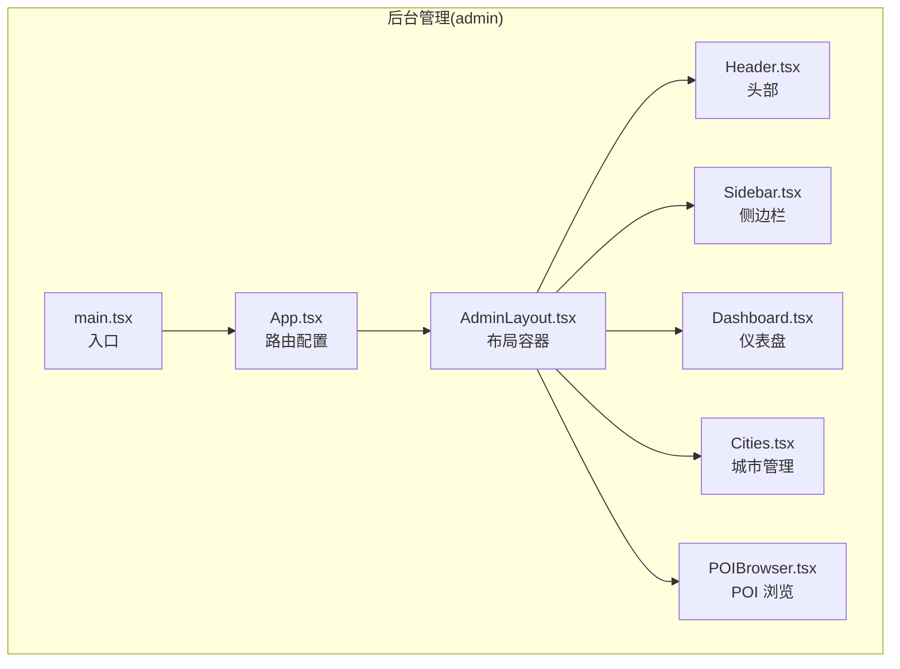
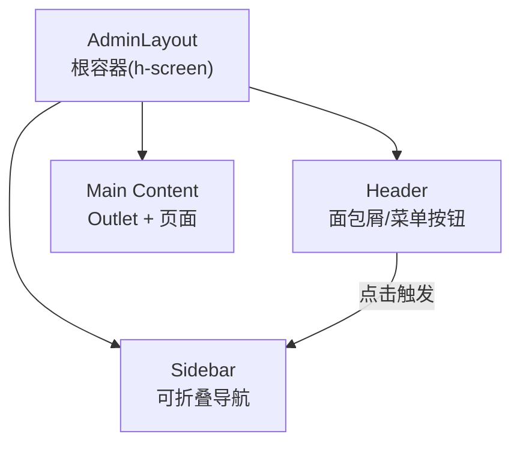
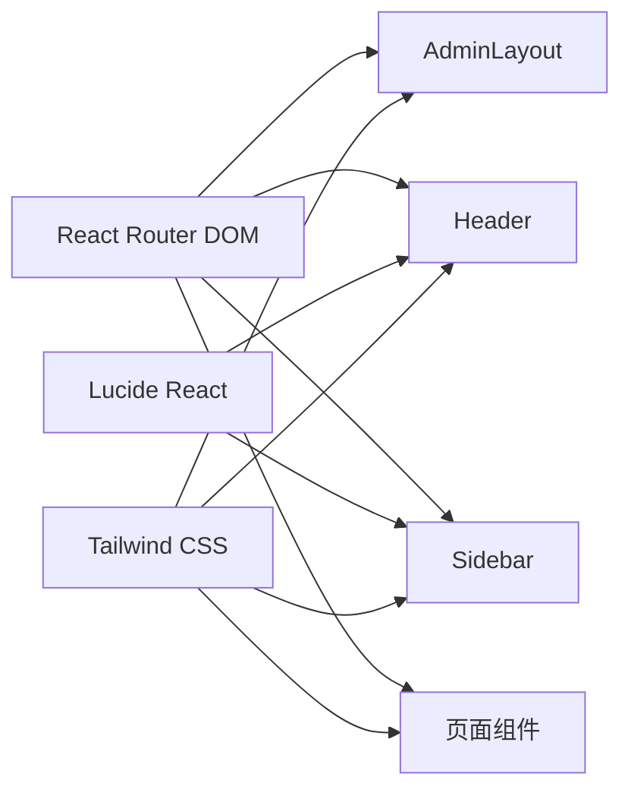

# 管理界面布局

<cite>
**本文引用的文件**
- [admin/components/layout/AdminLayout.tsx](file://admin/components/layout/AdminLayout.tsx)
- [admin/components/layout/Header.tsx](file://admin/components/layout/Header.tsx)
- [admin/components/layout/Sidebar.tsx](file://admin/components/layout/Sidebar.tsx)
- [admin/App.tsx](file://admin/App.tsx)
- [admin/main.tsx](file://admin/main.tsx)
- [admin/index.css](file://admin/index.css)
- [tailwind.config.ts](file://tailwind.config.ts)
- [admin/lib/utils.ts](file://admin/lib/utils.ts)
- [admin/pages/Dashboard.tsx](file://admin/pages/Dashboard.tsx)
- [admin/pages/Cities.tsx](file://admin/pages/Cities.tsx)
- [admin/pages/POIBrowser.tsx](file://admin/pages/POIBrowser.tsx)
- [admin/types/index.ts](file://admin/types/index.ts)
</cite>

## 目录
1. [简介](#简介)
2. [项目结构](#项目结构)
3. [核心组件](#核心组件)
4. [架构总览](#架构总览)
5. [组件详解](#组件详解)
6. [依赖关系分析](#依赖关系分析)
7. [性能考量](#性能考量)
8. [故障排查指南](#故障排查指南)
9. [结论](#结论)
10. [附录](#附录)

## 简介
本文件面向后台管理界面的布局与交互，系统性阐述 AdminLayout 的整体架构设计，包括 Header 头部区域、Sidebar 侧边栏导航与主内容区域的布局结构；详细说明响应式设计的实现方式（含移动端适配与屏幕尺寸变化时的布局调整）；解释导航菜单的组织结构与路由配置；说明 Header 区域的功能组件（用户信息、通知中心与系统设置入口）；提供布局自定义与主题切换的实现细节；并给出布局组件的使用示例与最佳实践。

## 项目结构
后台管理前端位于 admin 目录，采用分层模块化组织：
- 组件层：layout 子目录包含 AdminLayout、Header、Sidebar 三个核心布局组件
- 页面层：Dashboard、Cities、POIBrowser 等页面组件
- 路由层：App.tsx 定义路由与嵌套路由
- 样式层：index.css 定义设计系统变量与基础样式；tailwind.config.ts 扩展 Tailwind 主题
- 工具层：lib/utils.ts 提供工具函数（如 cn 合并类名）

图表来源
- [admin/main.tsx:1-14](file://admin/main.tsx#L1-L14)
- [admin/App.tsx:11-26](file://admin/App.tsx#L11-L26)
- [admin/components/layout/AdminLayout.tsx:6-22](file://admin/components/layout/AdminLayout.tsx#L6-L22)
- [admin/components/layout/Header.tsx:16-43](file://admin/components/layout/Header.tsx#L16-L43)
- [admin/components/layout/Sidebar.tsx:28-79](file://admin/components/layout/Sidebar.tsx#L28-L79)
- [admin/pages/Dashboard.tsx:12-181](file://admin/pages/Dashboard.tsx#L12-L181)
- [admin/pages/Cities.tsx:16-250](file://admin/pages/Cities.tsx#L16-L250)
- [admin/pages/POIBrowser.tsx:25-325](file://admin/pages/POIBrowser.tsx#L25-L325)

章节来源
- [admin/main.tsx:1-14](file://admin/main.tsx#L1-L14)
- [admin/App.tsx:11-26](file://admin/App.tsx#L11-L26)

## 核心组件
- AdminLayout：布局容器，负责整体三栏结构与 Outlet 内容渲染
- Header：面包屑导航与移动端侧栏开关按钮
- Sidebar：导航菜单、Logo、折叠/展开控制
- 路由：通过 HashRouter 与 React Router v6 的 Routes/Route 实现嵌套路由

章节来源
- [admin/components/layout/AdminLayout.tsx:6-22](file://admin/components/layout/AdminLayout.tsx#L6-L22)
- [admin/components/layout/Header.tsx:16-43](file://admin/components/layout/Header.tsx#L16-L43)
- [admin/components/layout/Sidebar.tsx:28-79](file://admin/components/layout/Sidebar.tsx#L28-L79)
- [admin/App.tsx:11-26](file://admin/App.tsx#L11-L26)

## 架构总览
AdminLayout 以 Flex 布局承载三部分：左侧 Sidebar、中间 Header、右侧主内容区。主内容区通过 Outlet 渲染当前路由页面组件。Header 在小屏设备显示“菜单”按钮用于切换 Sidebar 可见性；Sidebar 支持折叠/展开，折叠时仅保留图标与最小宽度。

图表来源
- [admin/components/layout/AdminLayout.tsx:10-21](file://admin/components/layout/AdminLayout.tsx#L10-L21)
- [admin/components/layout/Header.tsx:22-41](file://admin/components/layout/Header.tsx#L22-L41)
- [admin/components/layout/Sidebar.tsx:28-79](file://admin/components/layout/Sidebar.tsx#L28-L79)

## 组件详解

### AdminLayout 布局容器
- 结构要点
  - 外层 Flex 容器高度占满视口，溢出隐藏
  - 右侧容器 Flex-1 自动填充剩余空间，内部再分为 Header 与主内容区
  - 主内容区设置最大宽度并水平居中，保证在大屏下不无限拉伸
- 关键行为
  - 通过状态控制 Sidebar 折叠状态，并向子组件传递回调
  - 使用 Outlet 渲染当前路由页面

章节来源
- [admin/components/layout/AdminLayout.tsx:6-22](file://admin/components/layout/AdminLayout.tsx#L6-L22)

### Header 头部区域
- 功能
  - 面包屑导航：根据当前路由路径动态生成标题
  - 移动端菜单按钮：在小屏设备显示，用于切换 Sidebar
- 响应式
  - 使用 Tailwind 的 lg:hidden 控制移动端可见性
- 导航逻辑
  - 通过 useLocation 获取路径，映射到中文标题字典

章节来源
- [admin/components/layout/Header.tsx:16-43](file://admin/components/layout/Header.tsx#L16-L43)

### Sidebar 侧边栏导航
- 导航项
  - 仪表盘、城市管理、POI 浏览、数据更新、待确认更新、审核发布
- 交互
  - 折叠/展开：根据 collapsed 状态切换宽度与文本显示
  - 激活态：当前路由高亮
  - 折叠提示：在折叠模式下通过 title 展示标签
- 路由集成
  - 使用 NavLink 与路由路径对应，支持 end 精确匹配首页

章节来源
- [admin/components/layout/Sidebar.tsx:14-21](file://admin/components/layout/Sidebar.tsx#L14-L21)
- [admin/components/layout/Sidebar.tsx:28-79](file://admin/components/layout/Sidebar.tsx#L28-L79)

### 路由与页面
- 路由配置
  - HashRouter 根级路由
  - AdminLayout 作为父布局，内部嵌套多个页面路由
  - 通配符 * 重定向至首页
- 页面职责
  - Dashboard：统计卡片、新鲜度分布、最近更新任务等
  - Cities：城市列表、搜索、新增弹窗
  - POIBrowser：POI 列表、多级筛选、分页

章节来源
- [admin/App.tsx:11-26](file://admin/App.tsx#L11-L26)
- [admin/pages/Dashboard.tsx:12-181](file://admin/pages/Dashboard.tsx#L12-L181)
- [admin/pages/Cities.tsx:16-250](file://admin/pages/Cities.tsx#L16-L250)
- [admin/pages/POIBrowser.tsx:25-325](file://admin/pages/POIBrowser.tsx#L25-L325)

### 响应式设计与屏幕适配
- 移动端适配
  - Header 中的菜单按钮在 lg 以下尺寸显示，点击切换 Sidebar 可见性
  - Sidebar 折叠后仅保留图标与最小宽度，减少占用
- 容器与间距
  - Tailwind 容器在 2xl 屏幕下限制最大宽度，确保大屏阅读体验
  - 全局基础样式与滚动条样式统一

章节来源
- [admin/components/layout/Header.tsx:22-41](file://admin/components/layout/Header.tsx#L22-L41)
- [admin/components/layout/Sidebar.tsx:28-79](file://admin/components/layout/Sidebar.tsx#L28-L79)
- [tailwind.config.ts:13-19](file://tailwind.config.ts#L13-L19)
- [admin/index.css:13-19](file://admin/index.css#L13-L19)

### 导航菜单组织与路由配置
- 菜单组织
  - 仪表盘、城市管理、POI 浏览、数据更新、待确认更新、审核发布
  - 通过 NavLink 与路径一一对应，激活态高亮
- 路由配置
  - HashRouter 管理前端路由
  - AdminLayout 作为公共布局，内部嵌套各页面路由
  - 未匹配路由自动跳转首页

章节来源
- [admin/components/layout/Sidebar.tsx:14-21](file://admin/components/layout/Sidebar.tsx#L14-L21)
- [admin/App.tsx:11-26](file://admin/App.tsx#L11-L26)

### Header 区域功能组件
- 用户信息、通知中心、系统设置入口
  - 当前 Header 仅包含面包屑与移动端菜单按钮
  - 若需扩展用户头像、通知徽标、设置入口，可在 Header 内部增加相应组件并绑定交互事件
  - 建议保持与现有移动端交互一致（lg:hidden 控制显示）

章节来源
- [admin/components/layout/Header.tsx:16-43](file://admin/components/layout/Header.tsx#L16-L43)

### 布局自定义与主题切换
- 设计系统变量
  - 通过 CSS 变量定义背景、前景色、卡片、强调色等，形成统一的主题令牌
  - 支持成功、警告、信息等语义色
- Tailwind 扩展
  - 使用 hsl(var(--token)) 动态映射颜色
  - 圆角、阴影、动画等主题扩展
- 主题切换建议
  - 可通过切换 CSS 变量或引入不同 CSS 文件实现浅色/深色主题
  - 保持与现有设计令牌一致，避免破坏组件视觉一致性

章节来源
- [admin/index.css:5-39](file://admin/index.css#L5-L39)
- [tailwind.config.ts:24-80](file://tailwind.config.ts#L24-L80)

### 布局组件使用示例与最佳实践
- 使用示例
  - 在页面中直接使用 AdminLayout 包裹内容，即可获得统一的头部、侧边栏与主内容区
  - 通过路由配置将页面挂载到 AdminLayout 下，实现统一布局下的页面切换
- 最佳实践
  - 保持 Sidebar 折叠状态与 Header 菜单按钮联动
  - 页面内容区设置最大宽度，避免在超宽屏下过度拉伸
  - 使用 cn 工具函数合并类名，确保样式覆盖与条件样式的一致性
  - 在移动端优先展示关键信息，隐藏非必要文本，提升可读性

章节来源
- [admin/components/layout/AdminLayout.tsx:6-22](file://admin/components/layout/AdminLayout.tsx#L6-L22)
- [admin/App.tsx:11-26](file://admin/App.tsx#L11-L26)
- [admin/lib/utils.ts:4-6](file://admin/lib/utils.ts#L4-L6)

## 依赖关系分析
- 组件耦合
  - AdminLayout 向 Header/Sidebar 传递回调与状态，形成单向数据流
  - Header 依赖路由位置信息生成面包屑
  - Sidebar 依赖路由进行激活态判断
- 外部依赖
  - React Router DOM：HashRouter、Routes、Route、Outlet、NavLink、useLocation
  - Lucide React：图标库
  - Tailwind CSS：原子化样式与设计系统

图表来源
- [admin/main.tsx:3](file://admin/main.tsx#L3)
- [admin/App.tsx:1-26](file://admin/App.tsx#L1-L26)
- [admin/components/layout/AdminLayout.tsx:1-3](file://admin/components/layout/AdminLayout.tsx#L1-L3)
- [admin/components/layout/Header.tsx:1-2](file://admin/components/layout/Header.tsx#L1-L2)
- [admin/components/layout/Sidebar.tsx:1-2](file://admin/components/layout/Sidebar.tsx#L1-L2)

章节来源
- [admin/main.tsx:1-14](file://admin/main.tsx#L1-L14)
- [admin/App.tsx:11-26](file://admin/App.tsx#L11-L26)

## 性能考量
- 渲染优化
  - 使用 React Router 的 Outlet 按需渲染页面，避免全量刷新
  - Sidebar 折叠时减少文本渲染与宽度计算
- 样式优化
  - Tailwind 动态类名与 cn 工具函数合并，减少重复样式
  - 设计系统变量集中管理，降低样式维护成本
- 数据加载
  - 页面内使用异步请求与骨架屏提升首屏体验（如 Dashboard、POIBrowser）

## 故障排查指南
- 路由不生效
  - 确认 HashRouter 已包裹 App
  - 检查 AdminLayout 是否正确作为父路由元素
- 导航不激活
  - 确认 Sidebar 的 to 与路由 path 对应
  - end 属性仅在首页精确匹配时启用
- 移动端菜单无效
  - 检查 Header 中按钮的点击回调是否传递给 Sidebar
  - 确认 lg:hidden 在目标断点下生效
- 样式异常
  - 检查 CSS 变量是否正确声明
  - 确认 Tailwind 配置包含 admin 目录扫描

章节来源
- [admin/App.tsx:11-26](file://admin/App.tsx#L11-L26)
- [admin/components/layout/Sidebar.tsx:14-21](file://admin/components/layout/Sidebar.tsx#L14-L21)
- [admin/components/layout/Header.tsx:22-41](file://admin/components/layout/Header.tsx#L22-L41)
- [admin/index.css:5-39](file://admin/index.css#L5-L39)
- [tailwind.config.ts:5-10](file://tailwind.config.ts#L5-L10)

## 结论
该后台管理布局以简洁稳定的结构实现统一的头部、侧边栏与主内容区划分，结合响应式设计与设计系统变量，提供了良好的可维护性与扩展性。通过路由与组件的清晰分离，便于后续在 Header 中扩展用户信息与通知中心等能力，并支持主题切换与布局自定义。

## 附录
- 类型定义参考：POI、城市、分类树、评分等级等类型定义，支撑页面的数据结构与筛选逻辑
- 页面示例：Dashboard、Cities、POIBrowser 展示了布局容器与导航体系的实际应用

章节来源
- [admin/types/index.ts:1-277](file://admin/types/index.ts#L1-L277)
- [admin/pages/Dashboard.tsx:12-181](file://admin/pages/Dashboard.tsx#L12-L181)
- [admin/pages/Cities.tsx:16-250](file://admin/pages/Cities.tsx#L16-L250)
- [admin/pages/POIBrowser.tsx:25-325](file://admin/pages/POIBrowser.tsx#L25-L325)