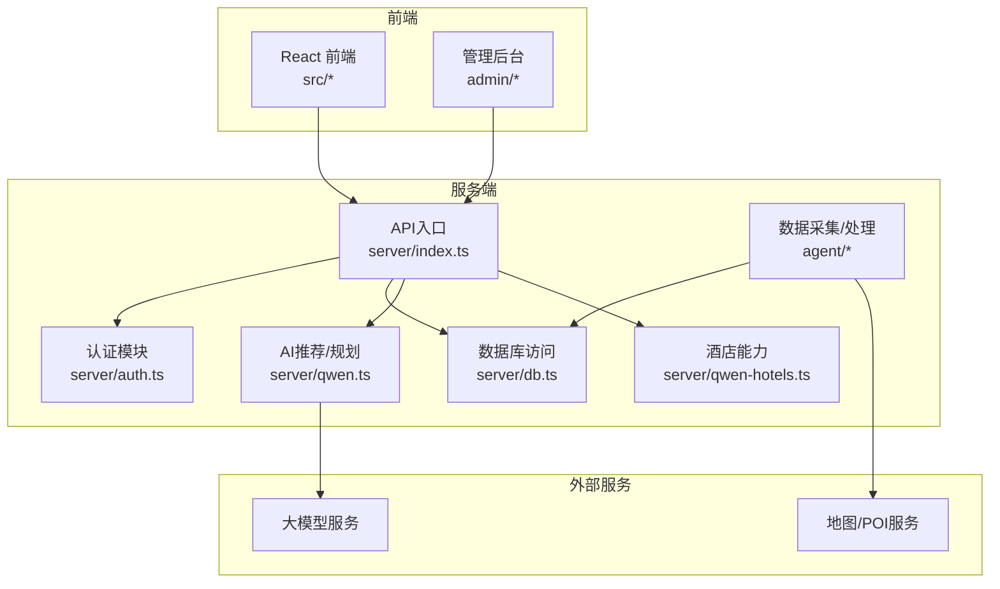
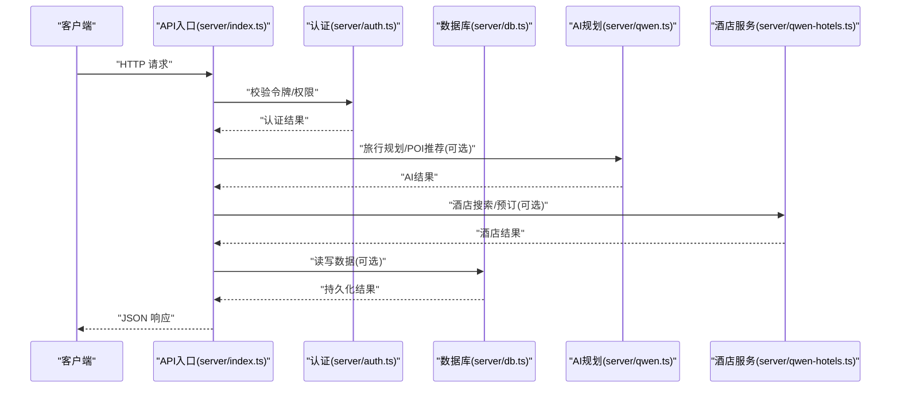
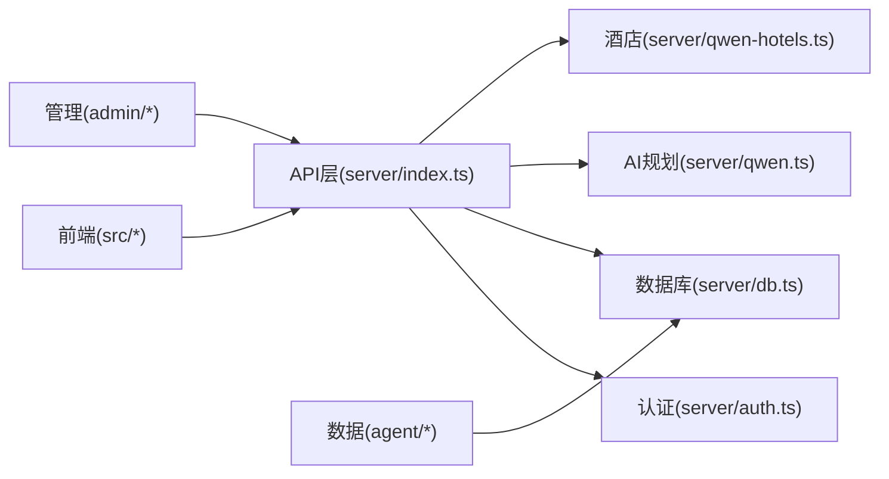
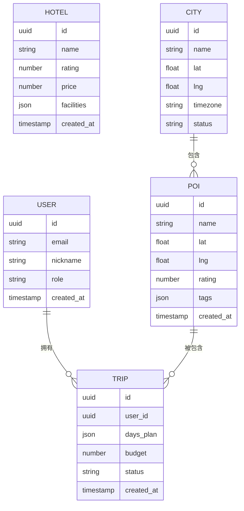

# API端点设计

<cite>
**本文档引用的文件**
- [server/index.ts](file://server/index.ts)
- [server/admin-routes.ts](file://server/admin-routes.ts)
- [server/auth.ts](file://server/auth.ts)
- [server/db.ts](file://server/db.ts)
- [server/qwen.ts](file://server/qwen.ts)
- [server/qwen-hotels.ts](file://server/qwen-hotels.ts)
- [api/index.ts](file://api/index.ts)
- [src/types/index.ts](file://src/types/index.ts)
- [src/utils/aiRecommend.ts](file://src/utils/aiRecommend.ts)
- [src/utils/routePlanner.ts](file://src/utils/routePlanner.ts)
- [src/utils/transport.ts](file://src/utils/transport.ts)
- [agent/index.ts](file://agent/index.ts)
- [agent/data/city-coords.json](file://agent/data/city-coords.json)
- [agent/scheduler.ts](file://agent/scheduler.ts)
- [agent/merger.ts](file://agent/merger.ts)
- [agent/rescore.ts](file://agent/rescore.ts)
- [admin/lib/api.ts](file://admin/lib/api.ts)
- [admin/pages/POIBrowser.tsx](file://admin/pages/POIBrowser.tsx)
- [admin/pages/POIDetail.tsx](file://admin/pages/POIDetail.tsx)
- [admin/pages/Dashboard.tsx](file://admin/pages/Dashboard.tsx)
- [admin/pages/ReviewQueue.tsx](file://admin/pages/ReviewQueue.tsx)
- [admin/pages/Updates.tsx](file://admin/pages/Updates.tsx)
- [admin/pages/Cities.tsx](file://admin/pages/Cities.tsx)
- [admin/pages/PendingUpdates.tsx](file://admin/pages/PendingUpdates.tsx)
- [src/pages/PlannerPage.tsx](file://src/pages/PlannerPage.tsx)
- [src/pages/CreateTripPage.tsx](file://src/pages/CreateTripPage.tsx)
- [src/pages/HotelStepPage.tsx](file://src/pages/HotelStepPage.tsx)
- [src/pages/HotelDetailPage.tsx](file://src/pages/HotelDetailPage.tsx)
- [src/pages/AttractionDetailPage.tsx](file://src/pages/AttractionDetailPage.tsx)
- [src/pages/JournalPage.tsx](file://src/pages/JournalPage.tsx)
- [src/pages/TravelNotesPage.tsx](file://src/pages/TravelNotesPage.tsx)
- [src/context/AppContext.tsx](file://src/context/AppContext.tsx)
- [src/context/AuthContext.tsx](file://src/context/AuthContext.tsx)
</cite>

## 目录
1. [简介](#简介)
2. [项目结构](#项目结构)
3. [核心组件](#核心组件)
4. [架构总览](#架构总览)
5. [详细组件分析](#详细组件分析)
6. [依赖关系分析](#依赖关系分析)
7. [性能考量](#性能考量)
8. [故障排除指南](#故障排除指南)
9. [结论](#结论)
10. [附录](#附录)

## 简介
本文件为“行程规划”系统的API端点设计文档，覆盖POI查询、旅行规划、用户认证、行程管理、酒店预订等核心功能。文档从系统架构、端点定义、数据模型、业务流程、错误处理与版本控制策略等方面进行系统化梳理，并提供可视化图示帮助理解。

## 项目结构
系统采用前后端分离架构：前端使用React应用（src/...），服务端使用Node/TypeScript（server/...），管理员后台（admin/...），以及数据采集与处理模块（agent/...）。API层通过server/index.ts统一对外暴露REST接口；admin与src前端通过各自封装的API模块调用后端接口。

图表来源
- [server/index.ts](file://server/index.ts)
- [server/auth.ts](file://server/auth.ts)
- [server/db.ts](file://server/db.ts)
- [server/qwen.ts](file://server/qwen.ts)
- [server/qwen-hotels.ts](file://server/qwen-hotels.ts)
- [agent/index.ts](file://agent/index.ts)

章节来源
- [server/index.ts](file://server/index.ts)
- [server/admin-routes.ts](file://server/admin-routes.ts)
- [admin/lib/api.ts](file://admin/lib/api.ts)
- [api/index.ts](file://api/index.ts)

## 核心组件
- API入口与路由：server/index.ts负责注册各类路由（用户、POI、规划、酒店、管理后台等）。
- 认证模块：server/auth.ts提供登录、令牌校验、权限控制等。
- 数据访问：server/db.ts封装数据库操作，支持POI、行程、用户、日志等表。
- AI与规划：server/qwen.ts提供旅行规划建议与POI推荐；server/qwen-hotels.ts提供酒店搜索与预订对接。
- 数据采集与处理：agent/*负责POI数据抓取、清洗、评分、合并与增量更新。
- 前端集成：src/*与admin/*通过各自API模块调用后端接口，实现用户交互与业务流程。

章节来源
- [server/index.ts](file://server/index.ts)
- [server/auth.ts](file://server/auth.ts)
- [server/db.ts](file://server/db.ts)
- [server/qwen.ts](file://server/qwen.ts)
- [server/qwen-hotels.ts](file://server/qwen-hotels.ts)
- [agent/index.ts](file://agent/index.ts)

## 架构总览
下图展示API端到端调用链路：客户端请求经由API入口分发至对应处理器，处理器可能调用认证模块、数据库、AI服务或酒店服务，最终返回JSON响应。

图表来源
- [server/index.ts](file://server/index.ts)
- [server/auth.ts](file://server/auth.ts)
- [server/db.ts](file://server/db.ts)
- [server/qwen.ts](file://server/qwen.ts)
- [server/qwen-hotels.ts](file://server/qwen-hotels.ts)

## 详细组件分析

### 用户认证与授权
- 终端点
  - POST /api/auth/login：用户名/密码登录，返回令牌与用户信息
  - POST /api/auth/logout：登出，使令牌失效
  - GET /api/auth/profile：获取当前用户资料
  - PUT /api/auth/profile：更新用户资料
- 数据模型
  - 用户实体包含标识、邮箱、昵称、角色、创建时间等字段
- 业务逻辑
  - 登录时校验凭据，签发短期令牌；后续请求需携带令牌
  - 权限控制：管理员后台端点仅管理员可访问
- 错误处理
  - 凭据无效、令牌过期、权限不足等返回相应状态码与错误消息
- 安全要点
  - 密码不回显；令牌存储于安全上下文；敏感操作二次确认

章节来源
- [server/auth.ts](file://server/auth.ts)
- [src/context/AuthContext.tsx](file://src/context/AuthContext.tsx)
- [admin/pages/Dashboard.tsx](file://admin/pages/Dashboard.tsx)

### POI查询与浏览
- 终端点
  - GET /api/poi/search：关键词/分类/区域搜索POI
  - GET /api/poi/:id：获取单个POI详情
  - GET /api/poi/:id/photos：获取POI图片列表
  - GET /api/poi/categories：获取POI分类体系
- 请求参数
  - 搜索：关键词、城市、分类、经纬度范围、分页参数
  - 详情：POI ID（路径参数）
  - 图片：POI ID（路径参数）、分页
  - 分类：可选过滤条件
- 响应格式
  - 列表：包含POI元数据、评分、位置、标签等
  - 详情：完整POI信息、开放时间、设施、周边信息
  - 图片：图片URL数组
  - 分类：分类树或列表
- 数据来源
  - agent/*聚合多源POI数据，server/db.ts持久化
- 错误处理
  - ID不存在、参数非法、无结果等返回对应状态码

章节来源
- [server/index.ts](file://server/index.ts)
- [server/db.ts](file://server/db.ts)
- [agent/index.ts](file://agent/index.ts)
- [admin/pages/POIBrowser.tsx](file://admin/pages/POIBrowser.tsx)
- [admin/pages/POIDetail.tsx](file://admin/pages/POIDetail.tsx)

### 旅行规划与路线生成
- 终端点
  - POST /api/planner/generate：基于偏好与约束生成行程
  - GET /api/planner/:tripId：获取行程详情
  - PUT /api/planner/:tripId：更新行程
  - DELETE /api/planner/:tripId：删除行程
  - POST /api/planner/:tripId/optimize：优化行程顺序
- 请求参数
  - 生成：出发地、目的地、日期范围、预算、兴趣标签、交通偏好
  - 优化：行程ID（路径参数）、优化目标（如时间最短/花费最少）
  - 更新/删除：行程ID（路径参数）
- 响应格式
  - 行程：包含天数计划、景点顺序、交通段、备注、预算统计
- 业务逻辑
  - 调用AI服务生成初稿，结合地图/POI数据计算路径与耗时，支持手动调整与再次优化
- 错误处理
  - 参数缺失、行程不存在、AI服务异常等

章节来源
- [server/index.ts](file://server/index.ts)
- [server/qwen.ts](file://server/qwen.ts)
- [src/utils/routePlanner.ts](file://src/utils/routePlanner.ts)
- [src/pages/PlannerPage.tsx](file://src/pages/PlannerPage.tsx)
- [src/pages/CreateTripPage.tsx](file://src/pages/CreateTripPage.tsx)

### 酒店搜索与预订
- 终端点
  - POST /api/hotels/search：酒店搜索（关键词/位置/价格/评分）
  - GET /api/hotels/:hotelId：酒店详情
  - POST /api/hotels/:hotelId/book：提交预订申请
  - GET /api/hotels/:hotelId/quotes：获取报价
- 请求参数
  - 搜索：城市/坐标、入住/退房日期、人数、价格区间、评分阈值
  - 预订：酒店ID（路径参数）、入住人信息、支付方式
  - 报价：酒店ID（路径参数）、日期范围
- 响应格式
  - 搜索：酒店列表（名称、评分、价格、设施、图片）
  - 详情：完整酒店信息（设施、政策、用户评价）
  - 预订：预订号、状态、支付链接或确认信息
  - 报价：价格明细、可用房型
- 业务逻辑
  - 调用酒店服务模块完成搜索与报价；预订流程对接支付网关
- 错误处理
  - 日期冲突、库存不足、支付失败等

章节来源
- [server/qwen-hotels.ts](file://server/qwen-hotels.ts)
- [src/pages/HotelStepPage.tsx](file://src/pages/HotelStepPage.tsx)
- [src/pages/HotelDetailPage.tsx](file://src/pages/HotelDetailPage.tsx)

### 用户行程管理
- 终端点
  - GET /api/trips：获取当前用户行程列表
  - POST /api/trips：创建新行程
  - GET /api/trips/:tripId：获取指定行程
  - PUT /api/trips/:tripId：更新行程
  - DELETE /api/trips/:tripId：删除行程
  - POST /api/trips/:tripId/share：分享行程
- 请求参数
  - 列表：分页、状态过滤
  - 创建/更新：行程基本信息、天数计划、预算、备注
  - 分享：行程ID（路径参数）、分享链接生成
- 响应格式
  - 列表：行程摘要（标题、创建时间、天数、状态）
  - 详情：完整行程内容（含POI、交通、预算统计）
- 错误处理
  - 权限不足、行程不存在、数据冲突等

章节来源
- [server/index.ts](file://server/index.ts)
- [src/pages/OverviewPage.tsx](file://src/pages/OverviewPage.tsx)
- [src/pages/JournalPage.tsx](file://src/pages/JournalPage.tsx)

### 管理后台API
- 终端点
  - GET /api/admin/dashboard/stats：仪表盘统计
  - GET /api/admin/poi/review-queue：POI审核队列
  - POST /api/admin/poi/review：POI审核操作
  - GET /api/admin/poi/updates：待处理更新
  - POST /api/admin/poi/apply-update：应用更新
  - GET /api/admin/cities：城市列表
  - POST /api/admin/cities：新增/编辑城市
- 请求参数
  - 审核：POI ID、审核意见、通过/拒绝
  - 更新：更新ID、应用/驳回
  - 城市：城市信息（名称、坐标、时区等）
- 响应格式
  - 统计：访客量、订单量、POI数量等指标
  - 列表：分页数据
- 错误处理
  - 权限不足、参数非法、操作冲突等

章节来源
- [server/admin-routes.ts](file://server/admin-routes.ts)
- [admin/pages/ReviewQueue.tsx](file://admin/pages/ReviewQueue.tsx)
- [admin/pages/Updates.tsx](file://admin/pages/Updates.tsx)
- [admin/pages/PendingUpdates.tsx](file://admin/pages/PendingUpdates.tsx)
- [admin/pages/Cities.tsx](file://admin/pages/Cities.tsx)

### 数据同步与导出
- 终端点
  - GET /api/data/export：导出POI/行程/用户数据
  - POST /api/data/import：导入数据（管理员）
  - POST /api/data/sync：触发数据同步任务
- 请求参数
  - 导出：类型、时间范围、格式
  - 导入：文件上传、映射配置
  - 同步：任务参数（如城市ID、增量标志）
- 响应格式
  - 导出：文件下载或任务ID
  - 导入/同步：任务状态与进度
- 错误处理
  - 文件格式不支持、任务执行失败等

章节来源
- [server/index.ts](file://server/index.ts)
- [agent/scheduler.ts](file://agent/scheduler.ts)
- [agent/merger.ts](file://agent/merger.ts)
- [agent/rescore.ts](file://agent/rescore.ts)

## 依赖关系分析
- 组件耦合
  - API层对认证、数据库、AI与酒店服务存在直接依赖
  - 前端通过各自API模块间接依赖API层
  - agent模块独立运行，通过数据库与外部服务交互
- 外部依赖
  - 地图/POI服务、大模型服务、支付网关
- 版本与兼容
  - API采用语义化版本控制，向后兼容策略：新增非必填字段、不破坏现有请求/响应结构

图表来源
- [server/index.ts](file://server/index.ts)
- [server/auth.ts](file://server/auth.ts)
- [server/db.ts](file://server/db.ts)
- [server/qwen.ts](file://server/qwen.ts)
- [server/qwen-hotels.ts](file://server/qwen-hotels.ts)
- [agent/index.ts](file://agent/index.ts)

章节来源
- [server/index.ts](file://server/index.ts)
- [agent/index.ts](file://agent/index.ts)

## 性能考量
- 缓存策略
  - 对高频查询（POI列表、城市信息）启用缓存，降低数据库与外部服务压力
- 分页与限制
  - 列表接口默认分页，限制每页最大条数，避免超大数据集传输
- 并发与队列
  - 数据同步与AI生成任务异步执行，支持重试与失败告警
- 网络优化
  - 图片懒加载、压缩传输、CDN加速

## 故障排除指南
- 常见错误与处理
  - 401 未认证：检查令牌是否有效、是否过期
  - 403 权限不足：确认用户角色与资源访问权限
  - 404 资源不存在：检查ID或路径参数
  - 422 参数校验失败：核对必填字段与格式
  - 5xx 服务器错误：查看服务日志与外部服务状态
- 排查步骤
  - 使用最小化请求复现问题
  - 检查认证头与请求体
  - 关注数据库与AI/酒店服务的错误日志

章节来源
- [server/auth.ts](file://server/auth.ts)
- [server/db.ts](file://server/db.ts)
- [server/index.ts](file://server/index.ts)

## 结论
本API设计以清晰的职责划分与稳定的契约为基础，覆盖旅行全链路核心能力。通过认证、数据模型、业务流程与错误处理的系统化设计，确保了易用性与可维护性。建议在生产环境中持续完善监控与灰度发布策略，保障向后兼容与平滑演进。

## 附录

### API版本控制与兼容性
- 版本策略
  - 采用URL前缀版本化（如 /v1/...），便于并行演进
  - 新增字段保持向后兼容，旧字段保留但标记废弃
- 兼容性原则
  - 不破坏现有请求/响应结构
  - 废弃字段在响应中标注并提供迁移指引
  - 重大变更通过新版本端点提供

### 数据模型概览
- 用户：标识、邮箱、昵称、角色、创建时间
- POI：标识、名称、坐标、评分、标签、图片、设施
- 行程：标识、用户ID、天数计划、预算、状态、创建时间
- 酒店：标识、名称、评分、价格、设施、政策、图片
- 城市：标识、名称、坐标、时区、状态

图表来源
- [src/types/index.ts](file://src/types/index.ts)
- [server/db.ts](file://server/db.ts)