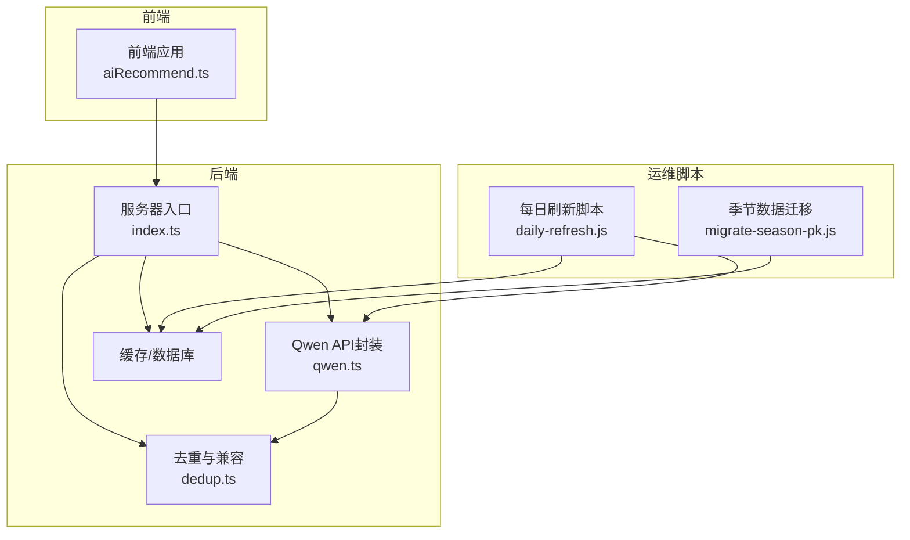
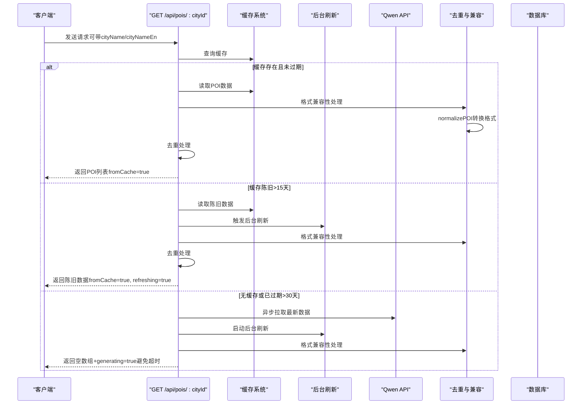
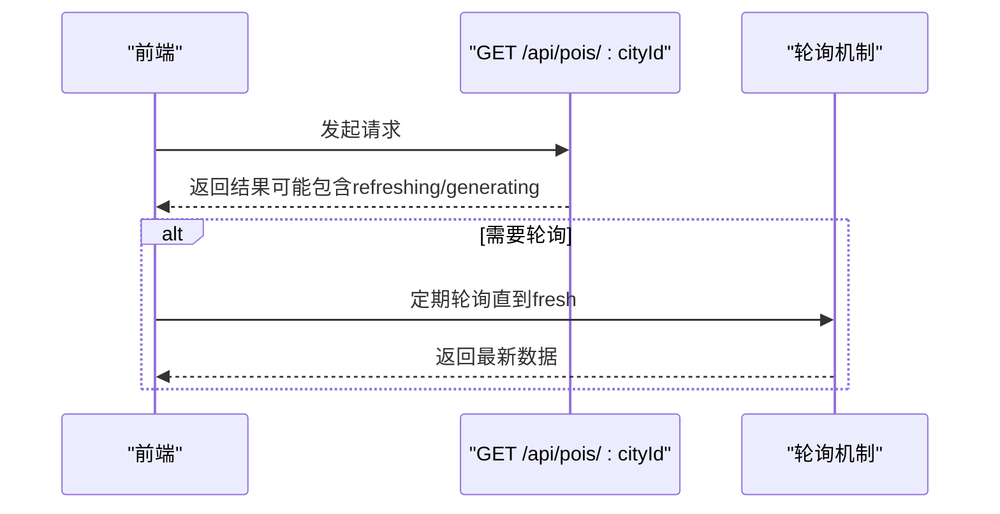
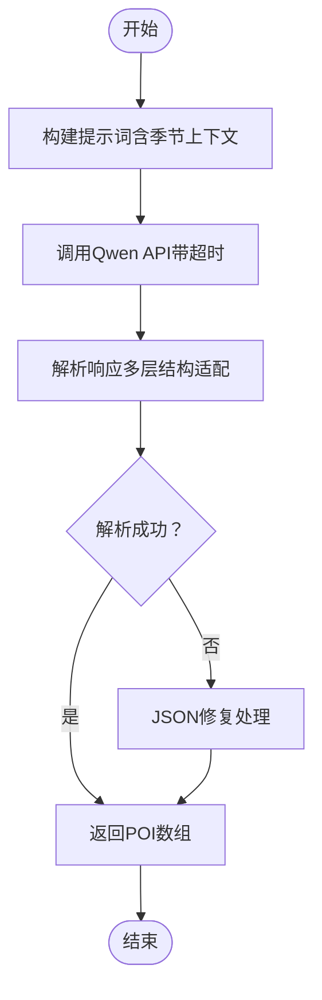
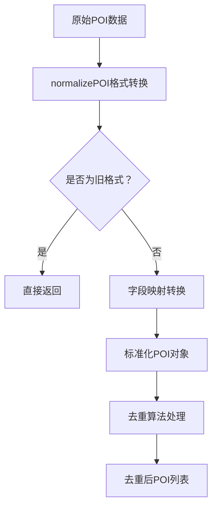
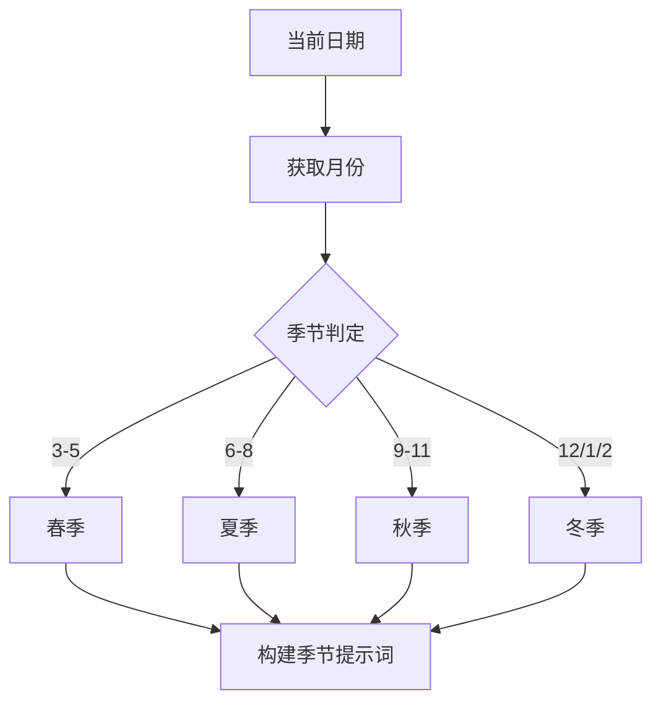
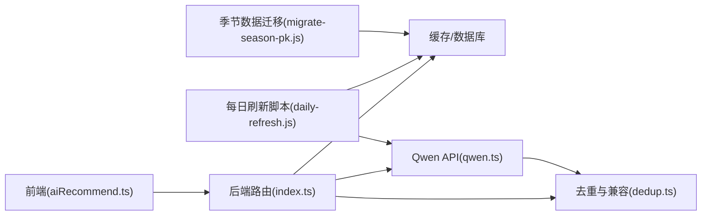

# POI数据接口

<cite>
**本文档引用的文件**
- [server/index.ts](file://server/index.ts)
- [src/utils/aiRecommend.ts](file://src/utils/aiRecommend.ts)
- [server/qwen.ts](file://server/qwen.ts)
- [server/dedup.ts](file://server/dedup.ts)
- [scripts/daily-refresh.js](file://scripts/daily-refresh.js)
- [scripts/migrate-season-pk.js](file://scripts/migrate-season-pk.js)
</cite>

## 更新摘要
**变更内容**
- 更新了POI数据格式兼容性处理机制，新增normalizePOI函数支持新旧格式数据转换
- 增强了去重算法的格式兼容性，确保新旧POI格式都能正确处理
- 完善了数据格式标准化流程，提升系统稳定性

## 目录
1. [简介](#简介)
2. [项目结构](#项目结构)
3. [核心组件](#核心组件)
4. [架构概览](#架构概览)
5. [详细组件分析](#详细组件分析)
6. [依赖分析](#依赖分析)
7. [性能考虑](#性能考虑)
8. [故障排除指南](#故障排除指南)
9. [结论](#结论)
10. [附录](#附录)

## 简介
本文件为POI（Point of Interest）数据接口的详细API文档，重点说明以下两个端点：
- GET /api/pois/:cityId：获取指定城市的POI列表
- POST /api/pois/:cityId/refresh：强制从Qwen API刷新指定城市的POI数据

该接口采用智能缓存策略（新鲜期15天，陈旧期30天），内置去重机制，并支持异步刷新以提升用户体验。同时提供季节性数据处理能力，确保不同季节的POI推荐符合实际。**新增**：系统现已具备完善的POI数据格式兼容性处理能力，能够自动识别并转换新旧格式的POI数据。

## 项目结构
与POI接口直接相关的模块包括：
- 服务器路由与业务逻辑：server/index.ts
- 前端调用封装：src/utils/aiRecommend.ts
- Qwen API调用与解析：server/qwen.ts
- 去重与格式兼容：server/dedup.ts
- 批量刷新与季节性处理脚本：scripts/daily-refresh.js、scripts/migrate-season-pk.js



**图表来源**
- [server/index.ts:108-155](file://server/index.ts#L108-L155)
- [src/utils/aiRecommend.ts:33-118](file://src/utils/aiRecommend.ts#L33-L118)
- [server/qwen.ts:361-384](file://server/qwen.ts#L361-L384)
- [server/dedup.ts:57-89](file://server/dedup.ts#L57-L89)
- [scripts/daily-refresh.js:210-243](file://scripts/daily-refresh.js#L210-L243)
- [scripts/migrate-season-pk.js:48-84](file://scripts/migrate-season-pk.js#L48-L84)

**章节来源**
- [server/index.ts:108-155](file://server/index.ts#L108-L155)
- [src/utils/aiRecommend.ts:33-118](file://src/utils/aiRecommend.ts#L33-L118)
- [server/qwen.ts:361-384](file://server/qwen.ts#L361-L384)
- [server/dedup.ts:57-89](file://server/dedup.ts#L57-L89)
- [scripts/daily-refresh.js:210-243](file://scripts/daily-refresh.js#L210-L243)
- [scripts/migrate-season-pk.js:48-84](file://scripts/migrate-season-pk.js#L48-L84)

## 核心组件
- 缓存策略：新鲜期15天（FRESH_TTL_MS），陈旧期30天（STALE_TTL_MS）。当缓存超过新鲜期时触发后台刷新；即使过期也优先返回旧数据，保证服务可用性。
- 异步刷新：通过backgroundRefresh函数在后台拉取最新数据并更新缓存，避免阻塞用户请求。
- 去重机制：对缓存中的POI进行去重处理，移除重复项并返回统计信息。**新增**：内置格式兼容性处理，支持新旧POI格式自动转换。
- 格式兼容性：通过normalizePOI函数将新格式POI（namePrimary、categoryL1等）转换为旧格式（name、type），确保系统一致性。
- 季节性数据：根据当前月份自动判断季节（春/夏/秋/冬），用于筛选和评分POI。
- 错误处理：当未配置API密钥且无缓存时返回503错误；其他异常会回退到缓存数据。

**章节来源**
- [server/index.ts:63-80](file://server/index.ts#L63-L80)
- [server/index.ts:108-155](file://server/index.ts#L108-L155)
- [server/index.ts:122-126](file://server/index.ts#L122-L126)
- [server/dedup.ts:57-89](file://server/dedup.ts#L57-L89)

## 架构概览
下图展示了POI接口的请求流程与各组件交互关系，包括新增的格式兼容性处理：



**图表来源**
- [server/index.ts:108-155](file://server/index.ts#L108-L155)
- [server/index.ts:82-98](file://server/index.ts#L82-L98)
- [server/qwen.ts:361-384](file://server/qwen.ts#L361-L384)
- [server/dedup.ts:57-89](file://server/dedup.ts#L57-L89)

## 详细组件分析

### GET /api/pois/:cityId
- 功能：获取指定城市的POI列表，支持按需传入城市名称参数。
- 请求参数：
  - 路径参数：cityId（必需）
  - 查询参数：cityName（可选）、cityNameEn（可选）
- 响应字段：
  - success：布尔值，请求是否成功
  - data：POI数组（若无缓存则为空数组）
  - fromCache：布尔值，是否来自缓存
  - refreshing：布尔值，缓存是否需要刷新
  - cacheAgeHours：数字，缓存年龄（小时）
  - dedupStats：对象（可选），去重统计信息
  - stale：布尔值，缓存是否陈旧（>15天）
  - currentSeason：字符串，当前季节（spring/summer/autumn/winter）

- 缓存策略与行为：
  - 新鲜期（≤15天）：直接返回缓存数据
  - 陈旧期（15-30天）：返回缓存数据并触发后台刷新
  - 过期货（>30天）：返回空数组并触发异步生成，避免Nginx超时
- 去重机制：对缓存数据执行去重处理，移除重复POI并返回统计信息。**新增**：内置格式兼容性处理，自动转换新旧格式数据。
- 季节性：响应中包含currentSeason字段，用于前端展示与筛选

- 请求示例：
  - GET /api/pois/101?cityName=北京&cityNameEn=Beijing

- 响应示例：
  - 成功（来自缓存）：{"success":true,"data":[],"fromCache":true,"refreshing":false,"cacheAgeHours":10,"stale":false,"currentSeason":"spring"}
  - 正在生成：{"success":true,"data":[],"fromCache":false,"refreshing":true,"generating":true,"currentSeason":"spring"}

**章节来源**
- [server/index.ts:108-155](file://server/index.ts#L108-L155)
- [server/index.ts:122-126](file://server/index.ts#L122-L126)

### POST /api/pois/:cityId/refresh
- 功能：强制从Qwen API刷新指定城市的POI数据。
- 请求参数：
  - 路径参数：cityId（必需）
  - 查询参数：cityName（可选）、cityNameEn（可选）
- 响应字段：
  - success：布尔值，请求是否成功
  - data：POI数组（新刷新的数据）
  - fromCache：布尔值，是否来自缓存
  - refreshing：布尔值，是否正在刷新
  - currentSeason：字符串，当前季节

- 行为说明：
  - 立即触发后台刷新，覆盖旧缓存
  - 返回新数据，fromCache=false，refreshing=false
  - 适用于用户手动刷新场景

- 请求示例：
  - POST /api/pois/101/refresh?cityName=北京&cityNameEn=Beijing

- 响应示例：
  - {"success":true,"data":[],"fromCache":false,"refreshing":false,"currentSeason":"spring"}

**章节来源**
- [server/index.ts:145-155](file://server/index.ts#L145-L155)

### 前端调用封装
- loadPOIRecommendations：获取POI推荐，内部处理轮询逻辑以等待后台刷新完成
- forceRefreshPOIs：强制刷新POI，适用于用户主动触发



**图表来源**
- [src/utils/aiRecommend.ts:44-94](file://src/utils/aiRecommend.ts#L44-L94)

**章节来源**
- [src/utils/aiRecommend.ts:33-118](file://src/utils/aiRecommend.ts#L33-L118)

### Qwen API调用与解析
- fetchPOIsFromQwen：按类别顺序调用Qwen API，最多请求200条POI（每类50条）
- 提供多种响应结构提取逻辑，增强鲁棒性
- 包含超时控制（120秒）与错误恢复机制



**图表来源**
- [server/qwen.ts:361-384](file://server/qwen.ts#L361-L384)
- [server/qwen.ts:318-353](file://server/qwen.ts#L318-L353)

**章节来源**
- [server/qwen.ts:361-384](file://server/qwen.ts#L361-L384)
- [server/qwen.ts:318-353](file://server/qwen.ts#L318-L353)

### 去重与格式兼容性处理
- deduplicatePOIs：对POI列表进行去重合并，支持新旧格式数据
- **新增**：normalizePOI函数负责POI数据格式标准化，支持新格式字段转换
- 格式兼容性：自动识别并转换namePrimary→name、categoryL1→type、visitDuration→duration等新格式字段



**图表来源**
- [server/dedup.ts:57-89](file://server/dedup.ts#L57-L89)
- [server/dedup.ts:628-633](file://server/dedup.ts#L628-L633)

**章节来源**
- [server/dedup.ts:57-89](file://server/dedup.ts#L57-L89)
- [server/dedup.ts:628-633](file://server/dedup.ts#L628-L633)

### 季节性数据处理
- 自动识别当前季节（春季3-5月，夏季6-8月，秋季9-11月，冬季12-2月）
- 在批量刷新脚本中为不同类别生成对应的季节标签
- 支持历史数据迁移，将旧表结构中的season列合并为统一的POI数据



**图表来源**
- [server/index.ts:68-74](file://server/index.ts#L68-L74)
- [scripts/daily-refresh.js:210-243](file://scripts/daily-refresh.js#L210-L243)
- [scripts/migrate-season-pk.js:48-84](file://scripts/migrate-season-pk.js#L48-L84)

**章节来源**
- [server/index.ts:68-74](file://server/index.ts#L68-L74)
- [scripts/daily-refresh.js:210-243](file://scripts/daily-refresh.js#L210-L243)
- [scripts/migrate-season-pk.js:48-84](file://scripts/migrate-season-pk.js#L48-L84)

## 依赖分析
- 前端依赖后端路由：通过URL路径与查询参数传递城市信息
- 后端依赖缓存系统与Qwen API：缓存决定响应速度与一致性，API提供数据源
- 后台任务依赖Qwen API：每日批量刷新与用户触发刷新均依赖此链路
- **新增**：去重模块依赖格式兼容性处理：所有POI数据在去重前必须经过格式标准化



**图表来源**
- [src/utils/aiRecommend.ts:33-118](file://src/utils/aiRecommend.ts#L33-L118)
- [server/index.ts:108-155](file://server/index.ts#L108-L155)
- [server/qwen.ts:361-384](file://server/qwen.ts#L361-L384)
- [server/dedup.ts:57-89](file://server/dedup.ts#L57-L89)
- [scripts/daily-refresh.js:210-243](file://scripts/daily-refresh.js#L210-L243)
- [scripts/migrate-season-pk.js:48-84](file://scripts/migrate-season-pk.js#L48-L84)

**章节来源**
- [src/utils/aiRecommend.ts:33-118](file://src/utils/aiRecommend.ts#L33-L118)
- [server/index.ts:108-155](file://server/index.ts#L108-L155)
- [server/qwen.ts:361-384](file://server/qwen.ts#L361-L384)
- [server/dedup.ts:57-89](file://server/dedup.ts#L57-L89)
- [scripts/daily-refresh.js:210-243](file://scripts/daily-refresh.js#L210-L243)
- [scripts/migrate-season-pk.js:48-84](file://scripts/migrate-season-pk.js#L48-L84)

## 性能考虑
- 缓存命中优先：优先返回缓存数据，减少API调用与延迟
- 异步刷新：后台刷新不会阻塞用户请求，避免Nginx超时
- 轮询机制：前端在refreshing/generating状态下定期轮询，直至数据新鲜
- 超时保护：Qwen API调用设置120秒超时，防止长时间挂起
- 去重优化：对缓存数据进行去重，降低重复渲染成本
- **新增**：格式兼容性处理优化：normalizePOI函数采用高效字段映射，减少格式转换开销

## 故障排除指南
- 503错误（NO_API_KEY）：服务端未配置Qwen API密钥且无缓存数据。请检查环境变量配置。
- 无缓存时的超时问题：首次生成或缓存过期时返回generating=true，前端应轮询至fresh。
- 缓存陈旧：stale=true表示缓存超过15天但未过期，系统仍会返回旧数据并触发后台刷新。
- 响应为空：fromCache=false且data=[]通常发生在无缓存且正在生成阶段。
- **新增**：格式兼容性问题：如遇POI字段显示异常，检查数据格式是否符合新格式规范。

**章节来源**
- [server/index.ts:128-131](file://server/index.ts#L128-L131)
- [server/index.ts:132-135](file://server/index.ts#L132-L135)
- [server/index.ts:126-127](file://server/index.ts#L126-L127)

## 结论
POI数据接口通过智能缓存、异步刷新与去重机制，实现了高可用与高性能的POI推荐服务。**新增的格式兼容性处理**进一步增强了系统的稳定性，能够自动识别并转换新旧格式的POI数据，确保服务的持续可用性。结合季节性数据处理，能够为用户提供及时、准确且富有时效性的旅游目的地信息。前端通过轮询机制无缝衔接后台刷新过程，显著改善用户体验。

## 附录

### 城市ID获取方法
- 通过城市名称参数cityName/cityNameEn辅助匹配，最终以cityId作为唯一标识
- 若仅提供cityId，系统将使用该ID进行查询与刷新

**章节来源**
- [server/index.ts:109-112](file://server/index.ts#L109-L112)

### 错误码定义
- NO_API_KEY：服务端未配置Qwen API密钥且无缓存数据
- HTTP_XXX：后端返回的HTTP状态码（如404、500等）
- 其他：未知服务器错误或网络错误

**章节来源**
- [server/index.ts:129-131](file://server/index.ts#L129-L131)
- [src/utils/aiRecommend.ts:54-59](file://src/utils/aiRecommend.ts#L54-L59)

### POI数据格式兼容性说明
**新增**：系统支持以下格式的POI数据：

**旧格式（标准格式）**：
```javascript
{
  id: "poi-001",
  name: "东京塔",
  type: "scenic",
  image: "https://example.com/tokyo-tower.jpg",
  rating: 4.5,
  duration: 120,
  cost: 50,
  description: "东京标志性铁塔",
  address: "东京都港区芝公园4-2-8",
  lat: 35.6586,
  lng: 139.7454,
  tags: ["景点", "地标"],
  openTime: "09:00",
  closeTime: "22:00",
  recommendReason: "必游景点",
  seasonScore: 8
}
```

**新格式（Spark采集管道）**：
```javascript
{
  id: "poi-001",
  namePrimary: "东京塔",
  categoryL1: "scenic",
  nameZh: "东京塔",
  image: "https://example.com/tokyo-tower.jpg",
  rating: 4.5,
  visitDuration: 120,
  cost: 50,
  description: "东京标志性铁塔",
  address: "东京都港区芝公园4-2-8",
  lat: 35.6586,
  lng: 139.7454,
  tags: ["景点", "地标"],
  operatingHours: "09:00-22:00",
  recommendReason: "必游景点",
  seasonScore: 8
}
```

**格式转换规则**：
- namePrimary → name
- categoryL1 → type  
- visitDuration → duration
- operatingHours → openTime/closeTime（解析时间范围）
- 未提供的字段使用默认值

**章节来源**
- [server/dedup.ts:57-89](file://server/dedup.ts#L57-L89)