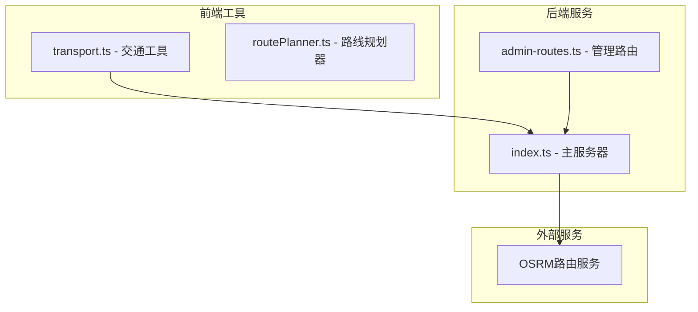
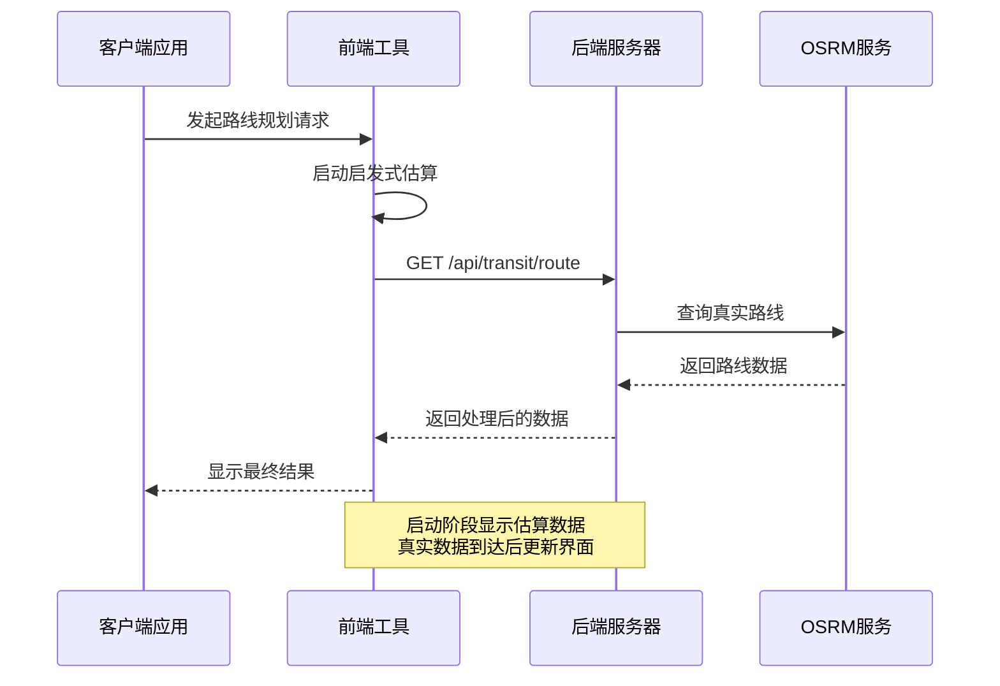
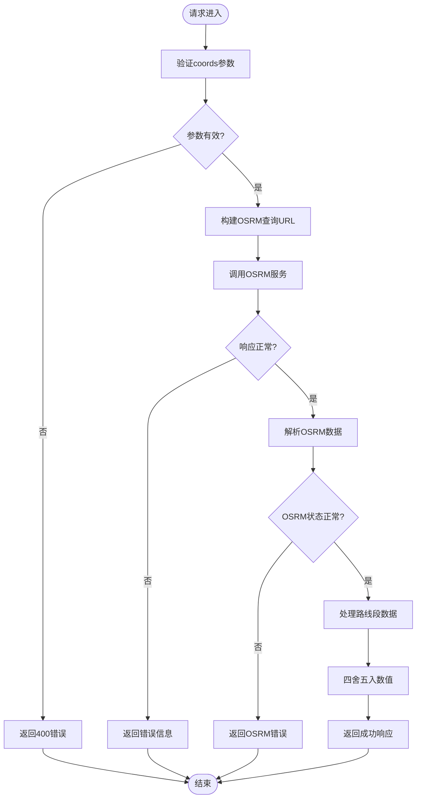
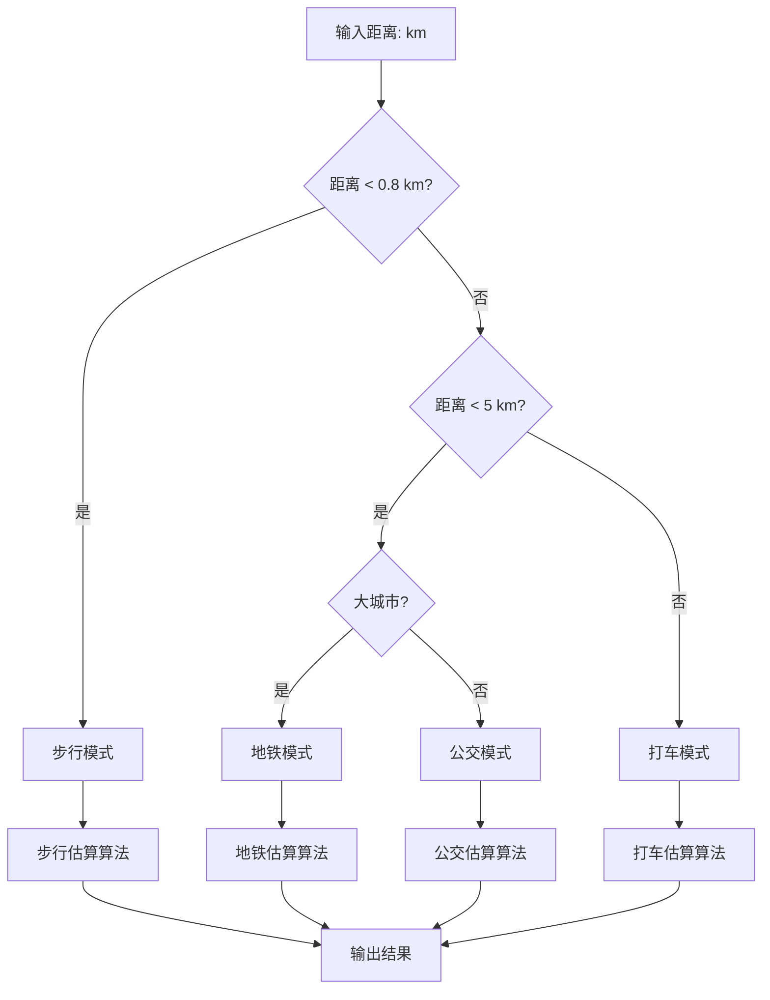
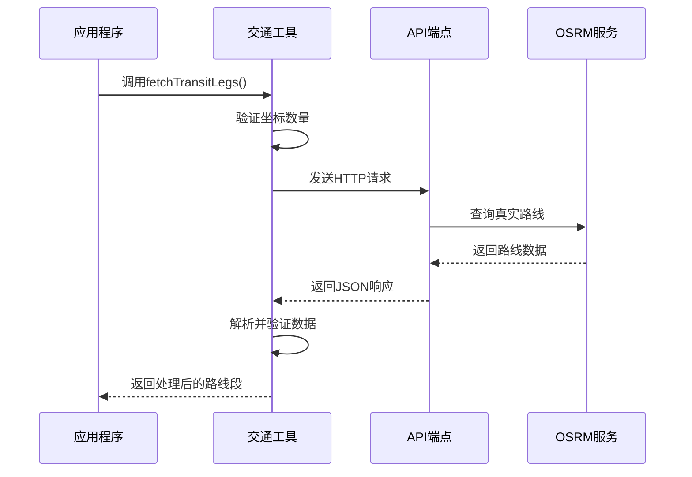
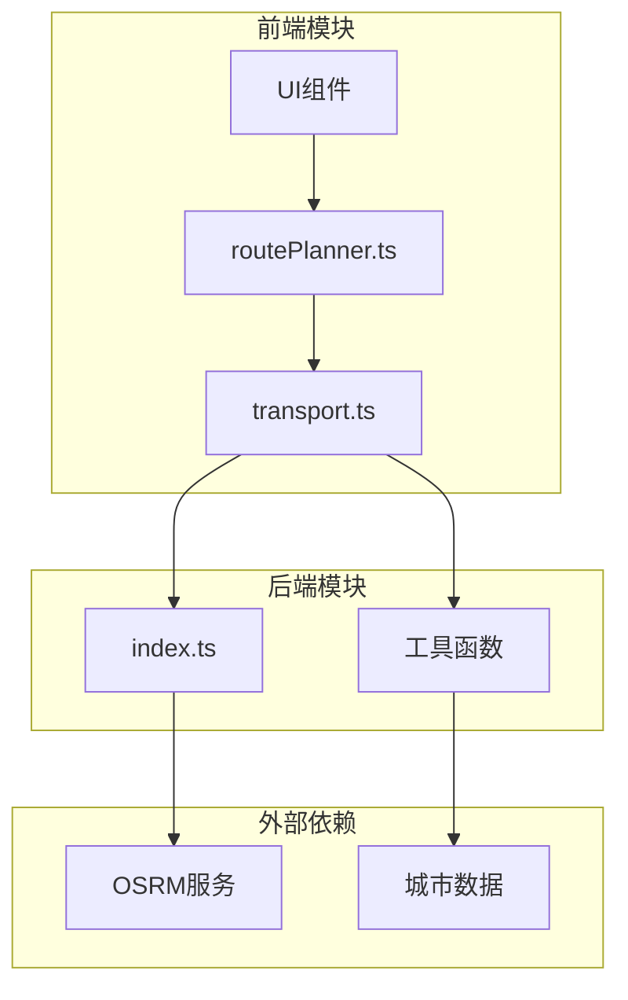

# 交通路线接口

<cite>
**本文档引用的文件**
- [server/index.ts](file://server/index.ts)
- [src/utils/transport.ts](file://src/utils/transport.ts)
</cite>

## 目录
1. [简介](#简介)
2. [项目结构](#项目结构)
3. [核心组件](#核心组件)
4. [架构概览](#架构概览)
5. [详细组件分析](#详细组件分析)
6. [依赖关系分析](#依赖关系分析)
7. [性能考虑](#性能考虑)
8. [故障排除指南](#故障排除指南)
9. [结论](#结论)

## 简介

本文档详细说明了交通路线规划API的实现，重点介绍GET /api/transit/route端点。该API集成了OSRM（Open Source Routing Machine）路线规划服务，为用户提供从起点到终点的最优路线规划。系统支持多种交通模式预测，包括步行、地铁、公交和打车，并提供精确的距离和时间估算。

该API采用双模式设计：启发式估算（无需API调用）和真实路由（通过OSRM API）。启发式模式用于即时渲染，真实路由模式则提供更准确的数据。

## 项目结构

交通路线规划功能主要分布在以下两个核心文件中：

**图表来源**
- [server/index.ts:285-308](file://server/index.ts#L285-L308)
- [src/utils/transport.ts:1-180](file://src/utils/transport.ts#L1-L180)

**章节来源**
- [server/index.ts:285-308](file://server/index.ts#L285-L308)
- [src/utils/transport.ts:1-180](file://src/utils/transport.ts#L1-L180)

## 核心组件

### API端点定义

GET /api/transit/route 是系统的核心端点，负责处理交通路线规划请求。该端点接受坐标参数并返回详细的路线信息。

**请求参数**
- **coords** (必需): 经度,纬度;经度,纬度 的字符串格式
- 支持多个坐标点，形成路线序列

**响应数据结构**
- **success**: 布尔值，表示请求是否成功
- **legs**: 数组，每个元素代表相邻两个坐标点之间的路线段
  - **driving.distance**: 开车距离（公里）
  - **driving.duration**: 开车时长（分钟）
  - **transit.mode**: 公共交通模式（walk/metro/bus/taxi）
  - **transit.modeLabel**: 模式标签（中文）
  - **transit.distance**: 公共交通距离（公里）
  - **transit.duration**: 公共交通时长（分钟）

**章节来源**
- [server/index.ts:287-308](file://server/index.ts#L287-L308)
- [src/utils/transport.ts:23-35](file://src/utils/transport.ts#L23-L35)

## 架构概览

系统采用分层架构设计，结合启发式估算和真实路由服务：

**图表来源**
- [server/index.ts:287-308](file://server/index.ts#L287-L308)
- [src/utils/transport.ts:142-162](file://src/utils/transport.ts#L142-L162)

## 详细组件分析

### 1. 后端服务器实现

后端服务器实现了核心的交通路线规划API，集成了OSRM服务进行真实路线计算。

#### API端点实现

**图表来源**
- [server/index.ts:287-308](file://server/index.ts#L287-L308)

#### 坐标格式规范

系统支持多种坐标格式输入，但内部统一转换为OSRM标准格式：

**输入格式要求**
- 经度,纬度;经度,纬度;经度,纬度
- 支持2个或更多坐标点
- 经度范围：-180到180
- 纬度范围：-90到90

**坐标转换过程**
- 前端传入：[lat, lng] 格式
- 内部转换：OSRM需要 [lng, lat] 格式
- 数据处理：距离单位转换（厘米到公里），时间单位转换（秒到分钟）

**章节来源**
- [server/index.ts:287-308](file://server/index.ts#L287-L308)
- [src/utils/transport.ts:142-162](file://src/utils/transport.ts#L142-L162)

### 2. 交通模式预测算法

系统实现了智能的交通模式预测算法，根据距离自动选择最适合的出行方式。

#### 距离分类策略

**图表来源**
- [src/utils/transport.ts:56-131](file://src/utils/transport.ts#L56-L131)

#### 步行模式估算

当距离小于0.8公里时，系统推荐步行模式：
- 时间估算：基于步行速度4.5公里/小时
- 距离保留一位小数
- 提供步行提示信息

#### 地铁/公交模式估算

对于0.8-5公里的距离：
- **地铁模式**：适用于东京、巴黎、曼谷、京都等大城市
  - 时间估算：距离/25公里+8分钟
  - 成本估算：根据城市不同而变化
- **公交模式**：适用于其他城市
  - 时间估算：距离/15公里+5分钟
  - 成本估算：根据城市不同而变化

#### 打车模式估算

对于超过5公里的距离：
- 时间估算：距离/30公里+5分钟
- 成本估算：根据城市采用不同的计费公式
  - 东京：8+6×距离
  - 巴黎：10+8×距离
  - 巴厘岛：3+2×距离
  - 其他城市：5+4×距离

**章节来源**
- [src/utils/transport.ts:56-131](file://src/utils/transport.ts#L56-L131)

### 3. 前端集成实现

前端提供了完整的工具集，用于处理交通路线规划的各种场景。

#### 路线段获取函数

fetchTransitLegs函数负责从后端获取真实的路线数据：

**图表来源**
- [src/utils/transport.ts:142-162](file://src/utils/transport.ts#L142-L162)

#### 路线构建工具

buildWaypoints函数用于构建完整的路线序列：
- 支持起点酒店、途经点、终点酒店的组合
- 自动处理坐标格式转换
- 确保路线的连续性和完整性

**章节来源**
- [src/utils/transport.ts:142-180](file://src/utils/transport.ts#L142-L180)

## 依赖关系分析

系统各组件之间的依赖关系如下：

**图表来源**
- [server/index.ts:285-308](file://server/index.ts#L285-L308)
- [src/utils/transport.ts:1-180](file://src/utils/transport.ts#L1-L180)

**章节来源**
- [server/index.ts:285-308](file://server/index.ts#L285-L308)
- [src/utils/transport.ts:1-180](file://src/utils/transport.ts#L1-L180)

## 性能考虑

### 1. 响应时间优化

系统采用了多层缓存和优化策略：
- **启发式估算**：立即返回基础数据，提升用户体验
- **超时控制**：OSRM请求设置10秒超时，防止阻塞
- **数据预处理**：在服务端进行必要的数据转换和格式化

### 2. 错误处理机制

系统实现了完善的错误处理：
- 参数验证：确保coords参数存在且格式正确
- 网络异常：捕获OSRM服务不可用情况
- 数据验证：检查OSRM返回数据的有效性
- 降级策略：在网络异常时返回可用的估算数据

### 3. 可扩展性设计

- **模块化架构**：清晰分离前端工具和后端服务
- **配置灵活**：支持不同城市的交通规则和成本估算
- **API标准化**：统一的响应格式便于客户端集成

## 故障排除指南

### 常见问题及解决方案

**1. 坐标参数错误**
- **症状**：返回400错误，提示缺少coords参数
- **原因**：未提供或格式不正确的coords参数
- **解决**：确保coords参数按照"经度,纬度;经度,纬度"格式提供

**2. OSRM服务不可用**
- **症状**：返回OSRM unavailable错误
- **原因**：外部OSRM服务暂时不可用
- **解决**：系统会返回估算数据，稍后重试

**3. 坐标格式不匹配**
- **症状**：OSRM返回错误或数据异常
- **原因**：坐标顺序或格式不符合要求
- **解决**：确保使用经度,纬度格式，且经度范围-180到180，纬度范围-90到90

**4. 响应超时**
- **症状**：请求处理时间过长
- **原因**：网络延迟或OSRM服务繁忙
- **解决**：系统已设置10秒超时，可稍后重试

**章节来源**
- [server/index.ts:287-308](file://server/index.ts#L287-L308)

## 结论

交通路线规划API提供了完整的路线规划解决方案，结合了启发式估算和真实路由服务的优势。系统具有以下特点：

**技术优势**
- 双模式设计：即时估算+真实路由
- 智能交通模式预测
- 多城市成本估算
- 完善的错误处理机制

**使用价值**
- 提升用户体验：快速响应和准确数据
- 降低开发复杂度：标准化API接口
- 增强功能完整性：支持多种交通方式
- 保证服务稳定性：健壮的错误处理

该API为旅行规划应用提供了可靠的路线规划基础，能够满足不同场景下的需求，从简单的地点导航到复杂的多日行程规划。