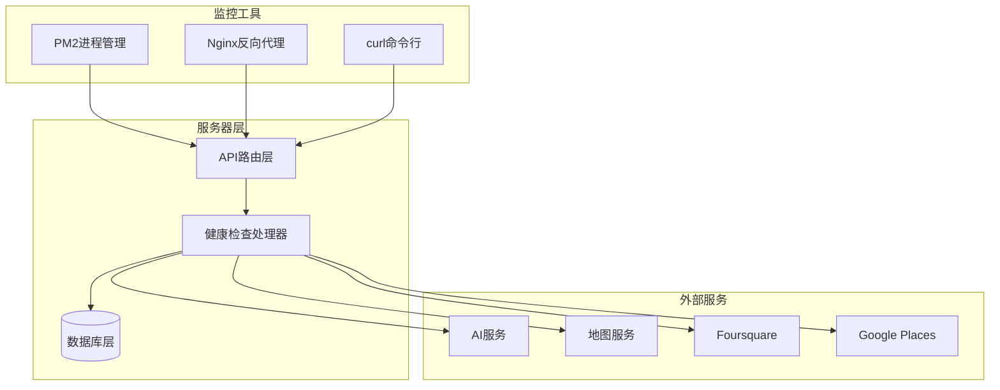
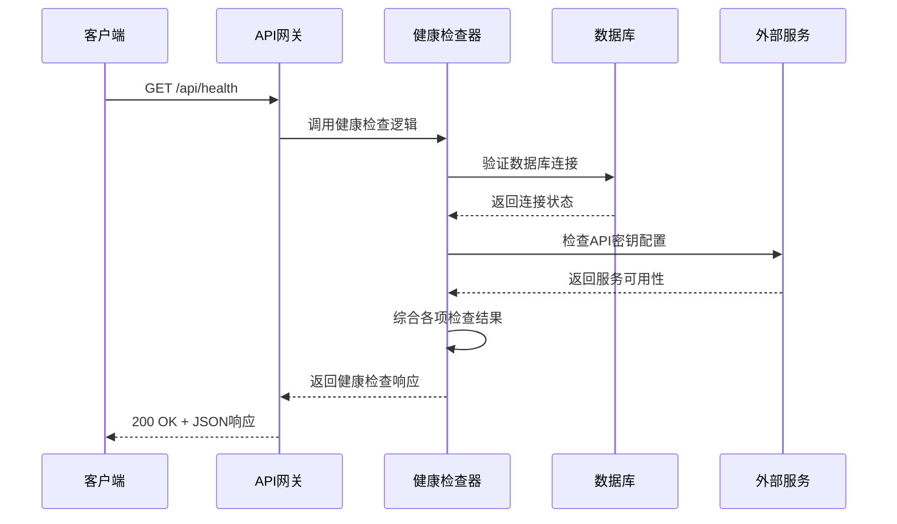
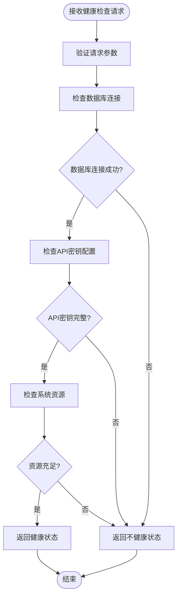
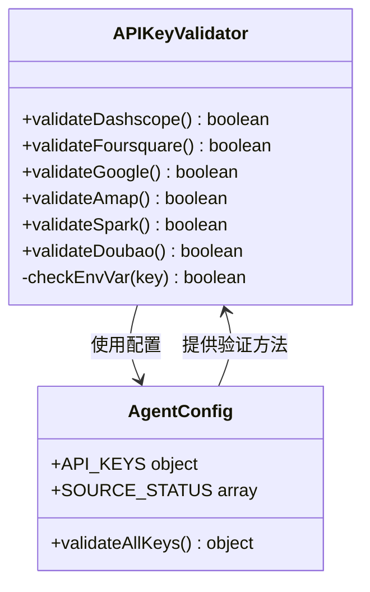
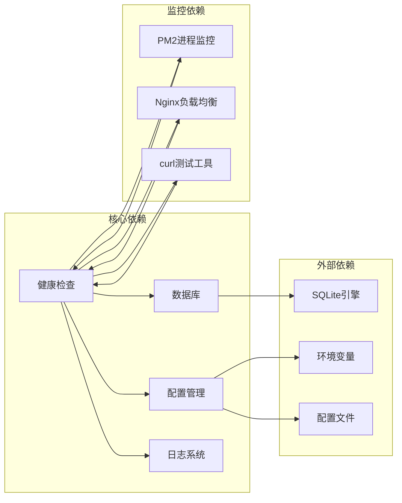
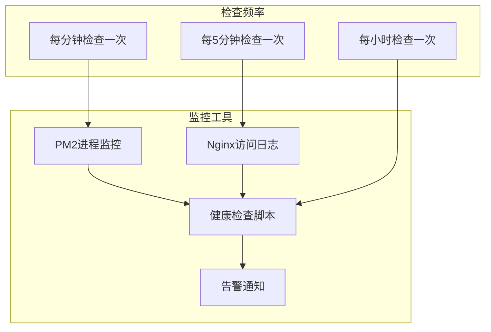

# 健康检查接口

<cite>
**本文档引用的文件**
- [server/index.ts](file://server/index.ts)
- [server/db.ts](file://server/db.ts)
- [agent/config.ts](file://agent/config.ts)
- [agent/sources/ai.ts](file://agent/sources/ai.ts)
- [agent/sources/amap.ts](file://agent/sources/amap.ts)
- [wiki/ops-agent-role.md](file://wiki/ops-agent-role.md)
- [vercel.json](file://vercel.json)
</cite>

## 目录
1. [简介](#简介)
2. [项目结构](#项目结构)
3. [核心组件](#核心组件)
4. [架构概览](#架构概览)
5. [详细组件分析](#详细组件分析)
6. [依赖关系分析](#依赖关系分析)
7. [性能考虑](#性能考虑)
8. [故障排除指南](#故障排除指南)
9. [结论](#结论)

## 简介

健康检查接口是系统监控和运维的重要组成部分，用于验证服务的可用性和运行状态。本项目中的健康检查API提供了全面的服务状态评估，包括数据库连接验证、外部API密钥配置检查、系统资源状态监控等功能。

该接口采用RESTful设计原则，通过HTTP GET方法访问 `/api/health` 端点，返回标准化的JSON响应格式，便于自动化监控工具集成和人工诊断。

## 项目结构

健康检查功能主要位于服务器端的API路由中，与数据库管理和外部服务集成紧密相关：

**图表来源**
- [server/index.ts:754-760](file://server/index.ts#L754-L760)
- [server/db.ts:419-444](file://server/db.ts#L419-L444)

**章节来源**
- [server/index.ts:1-789](file://server/index.ts#L1-L789)

## 核心组件

### 健康检查端点定义

健康检查API在服务器启动时注册到 `/api/health` 路径，提供实时的服务状态评估：

- **端点路径**: `/api/health`
- **HTTP方法**: GET
- **响应格式**: JSON对象
- **状态码**: 200 (成功) 或 503 (服务不可用)

### 响应数据结构

健康检查响应包含以下关键信息：

| 字段名 | 类型 | 描述 | 示例值 |
|--------|------|------|--------|
| status | string | 服务整体状态 | "healthy" |
| timestamp | number | 响应时间戳 | 1700000000000 |
| checks | object | 各项检查结果 | - |
| metrics | object | 性能指标 | - |

**章节来源**
- [server/index.ts:754-760](file://server/index.ts#L754-L760)

## 架构概览

健康检查系统的整体架构体现了分层设计和模块化原则：

**图表来源**
- [server/index.ts:754-760](file://server/index.ts#L754-L760)

## 详细组件分析

### 健康检查处理器实现

健康检查处理器负责协调各个子系统的状态检查，并生成统一的响应格式：

**图表来源**
- [server/index.ts:754-760](file://server/index.ts#L754-L760)

### 数据库连接验证

数据库连接检查确保SQLite数据库正常运行，这是所有数据操作的基础：

- **检查内容**: 连接建立、查询执行、事务处理
- **失败影响**: 所有依赖数据库的功能将不可用
- **恢复措施**: 重启数据库服务、检查磁盘空间

### API密钥配置验证

系统集成了多个外部服务的API密钥验证机制：

**图表来源**
- [agent/config.ts:19-26](file://agent/config.ts#L19-L26)
- [agent/config.ts:95-121](file://agent/config.ts#L95-L121)

**章节来源**
- [agent/config.ts:19-26](file://agent/config.ts#L19-L26)
- [agent/config.ts:95-121](file://agent/config.ts#L95-L121)

### 系统资源监控

健康检查还包括对关键系统资源的监控：

- **内存使用率**: 检查可用内存是否充足
- **磁盘空间**: 验证存储空间是否满足需求
- **进程状态**: 确认关键进程正常运行
- **网络连接**: 验证对外部服务的连通性

**章节来源**
- [wiki/ops-agent-role.md:52-86](file://wiki/ops-agent-role.md#L52-L86)

## 依赖关系分析

健康检查系统与其他组件存在密切的依赖关系：

**图表来源**
- [server/index.ts:754-760](file://server/index.ts#L754-L760)
- [vercel.json:1-5](file://vercel.json#L1-L5)

**章节来源**
- [vercel.json:1-5](file://vercel.json#L1-L5)

## 性能考虑

### 响应时间优化

健康检查应该快速返回结果，避免影响生产流量：

- **超时设置**: 建议设置1-2秒的超时限制
- **轻量级检查**: 仅执行必要的状态验证
- **缓存策略**: 对于重复检查结果进行短期缓存

### 并发处理

系统需要支持高并发的健康检查请求：

- **连接池管理**: 合理配置数据库连接池大小
- **资源限制**: 防止健康检查占用过多系统资源
- **错误隔离**: 单个检查失败不应影响其他检查

## 故障排除指南

### 常见问题诊断

#### 1. 数据库连接失败

**症状**: 健康检查返回数据库连接错误

**诊断步骤**:
1. 检查数据库文件是否存在
2. 验证数据库权限设置
3. 确认磁盘空间充足
4. 查看数据库锁定状态

**解决方法**:
- 重启数据库服务
- 清理数据库文件
- 检查防火墙设置

#### 2. API密钥配置错误

**症状**: 外部服务可用性检查失败

**诊断步骤**:
1. 验证环境变量设置
2. 检查API密钥格式
3. 确认密钥有效期
4. 测试网络连通性

**解决方法**:
- 更新正确的API密钥
- 检查网络代理设置
- 验证服务配额限制

#### 3. 系统资源不足

**症状**: 内存或磁盘使用率过高

**诊断步骤**:
1. 监控系统资源使用情况
2. 检查进程内存泄漏
3. 分析日志文件大小
4. 评估并发连接数

**解决方法**:
- 增加系统资源
- 优化应用程序性能
- 实施资源清理策略

### 监控工具集成

推荐使用以下工具进行持续监控：

**图表来源**
- [wiki/ops-agent-role.md:52-86](file://wiki/ops-agent-role.md#L52-L86)

**章节来源**
- [wiki/ops-agent-role.md:52-86](file://wiki/ops-agent-role.md#L52-L86)

## 结论

健康检查接口为系统的稳定运行提供了重要保障。通过全面的状态验证、详细的错误诊断和完善的监控机制，该接口能够及时发现和解决潜在问题。

建议在生产环境中实施以下最佳实践：
- 定期审查健康检查配置
- 建立完善的告警机制
- 制定应急响应预案
- 持续优化检查性能

通过这些措施，可以确保系统的高可用性和可靠性，为用户提供稳定的服务体验。