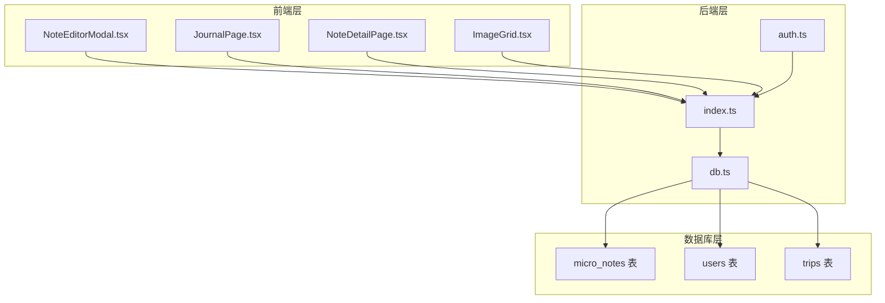
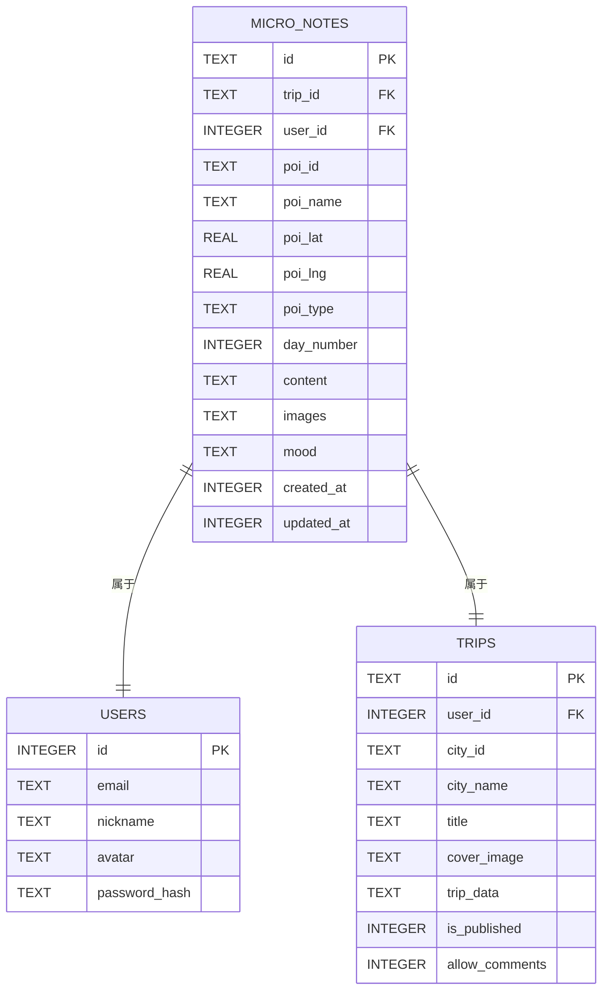
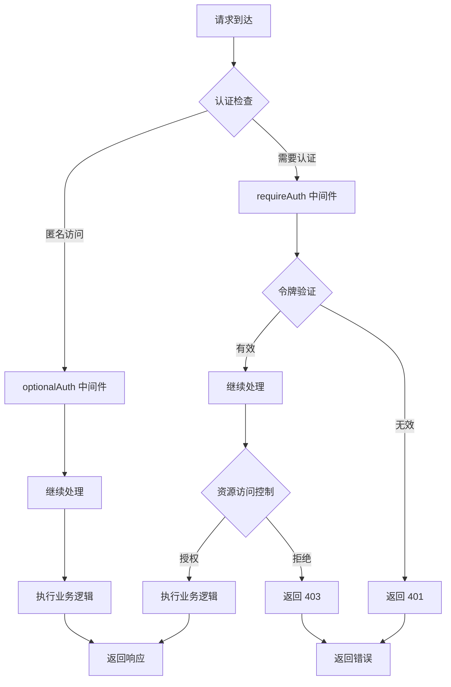
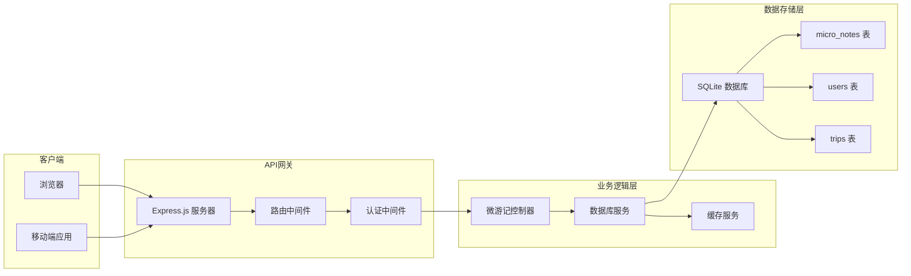
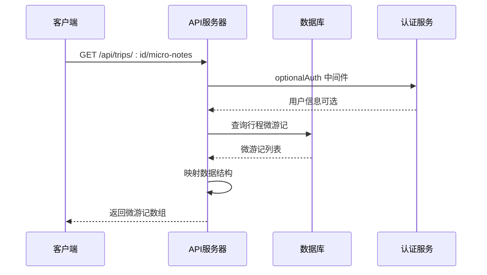
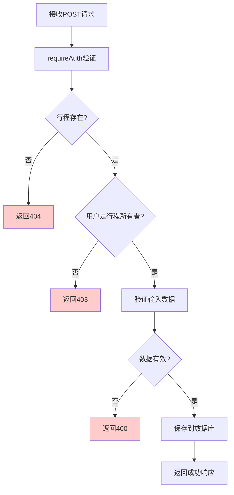
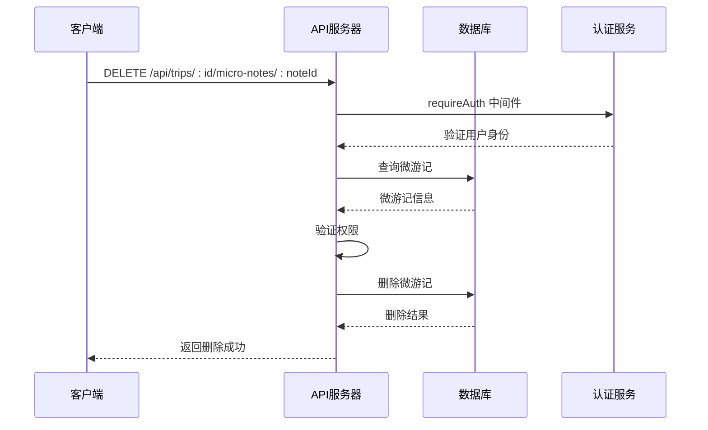
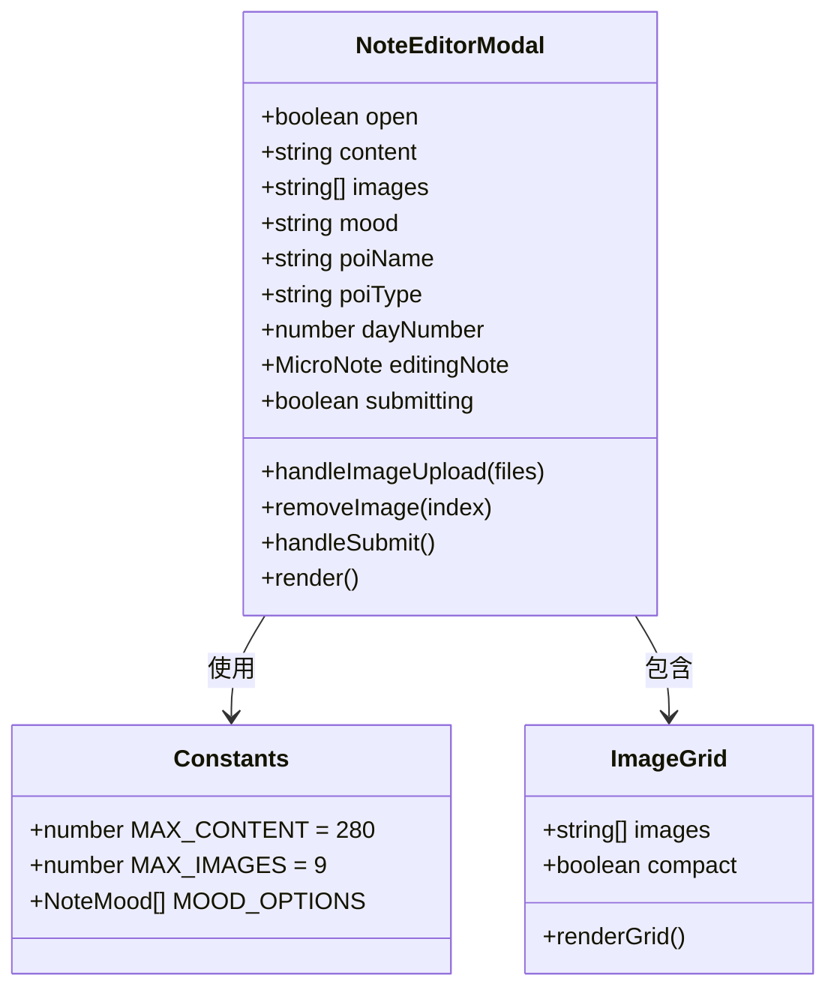
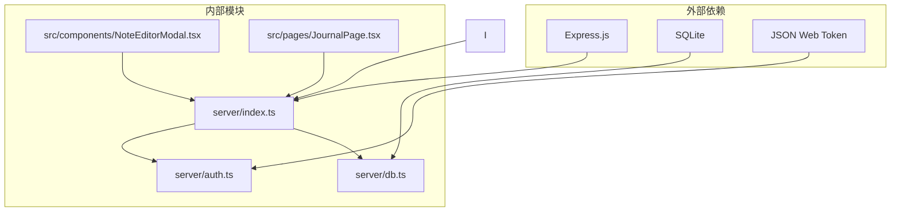
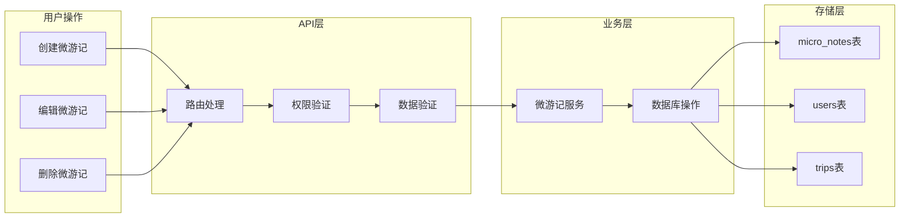

# 微游记接口

<cite>
**本文档引用的文件**
- [server/index.ts](file://server/index.ts)
- [server/db.ts](file://server/db.ts)
- [server/auth.ts](file://server/auth.ts)
- [src/components/NoteEditorModal.tsx](file://src/components/NoteEditorModal.tsx)
- [src/pages/JournalPage.tsx](file://src/pages/JournalPage.tsx)
- [src/pages/NoteDetailPage.tsx](file://src/pages/NoteDetailPage.tsx)
- [src/components/ImageGrid.tsx](file://src/components/ImageGrid.tsx)
</cite>

## 目录
1. [简介](#简介)
2. [项目结构](#项目结构)
3. [核心组件](#核心组件)
4. [架构概览](#架构概览)
5. [详细组件分析](#详细组件分析)
6. [依赖关系分析](#依赖关系分析)
7. [性能考虑](#性能考虑)
8. [故障排除指南](#故障排除指南)
9. [结论](#结论)

## 简介

微游记接口是行程规划系统中的核心功能模块，允许用户为旅行行程中的各个景点创建和管理微游记内容。该接口提供了完整的CRUD操作，包括获取微游记列表、创建或更新微游记、以及删除微游记等功能。

微游记功能集成了POI（兴趣点）关联机制，支持文本内容（280字符限制）、图片上传（最多9张）和情感标签等特性。所有操作都遵循严格的权限验证规则，确保只有行程的所有者才能进行相关操作。

## 项目结构

微游记功能在项目中采用分层架构设计，主要涉及以下层次：



**图表来源**
- [server/index.ts:667-774](file://server/index.ts#L667-L774)
- [server/db.ts:151-251](file://server/db.ts#L151-L251)
- [server/auth.ts:77-122](file://server/auth.ts#L77-L122)

**章节来源**
- [server/index.ts:667-774](file://server/index.ts#L667-L774)
- [server/db.ts:151-251](file://server/db.ts#L151-L251)
- [server/auth.ts:77-122](file://server/auth.ts#L77-L122)

## 核心组件

### 数据模型

微游记采用简洁而高效的数据模型设计，支持基本的文本、图片和情感表达需求：



**图表来源**
- [server/db.ts:151-218](file://server/db.ts#L151-L218)

### 权限验证机制

系统实现了多层次的权限控制机制：



**图表来源**
- [server/auth.ts:77-122](file://server/auth.ts#L77-L122)
- [server/index.ts:695-751](file://server/index.ts#L695-L751)

**章节来源**
- [server/db.ts:151-218](file://server/db.ts#L151-L218)
- [server/auth.ts:77-122](file://server/auth.ts#L77-L122)
- [server/index.ts:667-751](file://server/index.ts#L667-L751)

## 架构概览

微游记系统的整体架构采用RESTful API设计模式，结合了前后端分离的现代Web应用架构：



**图表来源**
- [server/index.ts:667-774](file://server/index.ts#L667-L774)
- [server/db.ts:151-251](file://server/db.ts#L151-L251)

## 详细组件分析

### GET /api/trips/:id/micro-notes - 获取微游记列表

此端点用于获取指定行程下的所有微游记条目，支持匿名访问但会返回作者信息。

#### 接口规范

| 属性 | 值 |
|------|-----|
| 方法 | GET |
| 路径 | `/api/trips/:id/micro-notes` |
| 认证 | 可选（optionalAuth） |
| 权限 | 无需特定权限 |

#### 请求参数

| 参数名 | 类型 | 必需 | 描述 |
|--------|------|------|------|
| id | string | 是 | 行程唯一标识符 |

#### 响应数据结构

```typescript
{
  success: boolean,
  data: MicroNote[]
}
```

其中 MicroNote 结构如下：

| 字段名 | 类型 | 描述 |
|--------|------|------|
| id | string | 微游记唯一标识符 |
| tripId | string | 关联的行程ID |
| poiId | string | POI唯一标识符 |
| poiName | string | POI名称 |
| poiLat | number | POI纬度 |
| poiLng | number | POI经度 |
| poiType | string | POI类型（scenic/food/hotel等） |
| dayNumber | number | 所属行程天数 |
| content | string | 微游记内容（最多280字符） |
| images | string[] | 图片URL数组（最多9张） |
| mood | string | 情感标签 |
| authorName | string | 作者昵称 |
| authorAvatar | string | 作者头像URL |
| authorId | number | 作者ID |
| createdAt | number | 创建时间戳 |
| updatedAt | number | 更新时间戳 |

#### 处理流程



**图表来源**
- [server/index.ts:669-693](file://server/index.ts#L669-L693)
- [server/db.ts:209-218](file://server/db.ts#L209-L218)

**章节来源**
- [server/index.ts:669-693](file://server/index.ts#L669-L693)
- [server/db.ts:209-218](file://server/db.ts#L209-L218)

### POST /api/trips/:id/micro-notes - 创建或更新微游记

此端点用于创建新的微游记或更新现有的微游记内容。

#### 接口规范

| 属性 | 值 |
|------|-----|
| 方法 | POST |
| 路径 | `/api/trips/:id/micro-notes` |
| 认证 | 必需（requireAuth） |
| 权限 | 行程所有者 |

#### 请求参数

| 参数名 | 类型 | 必需 | 描述 |
|--------|------|------|------|
| id | string | 是 | 行程唯一标识符 |

#### 请求体结构

```typescript
{
  id?: string,
  content: string,
  images: string[],
  mood: string,
  poiId: string,
  poiName: string,
  poiLat: number,
  poiLng: number,
  poiType: string,
  dayNumber: number
}
```

#### 业务规则

1. **内容长度限制**: 最多280个字符
2. **图片数量限制**: 最多9张图片
3. **POI关联**: 必须提供有效的POI信息
4. **权限验证**: 只有行程创建者才能操作

#### 处理流程



**图表来源**
- [server/index.ts:695-744](file://server/index.ts#L695-L744)
- [server/db.ts:192-207](file://server/db.ts#L192-L207)

**章节来源**
- [server/index.ts:695-744](file://server/index.ts#L695-L744)
- [server/db.ts:192-207](file://server/db.ts#L192-L207)

### DELETE /api/trips/:id/micro-notes/:noteId - 删除微游记

此端点用于删除指定的微游记条目。

#### 接口规范

| 属性 | 值 |
|------|-----|
| 方法 | DELETE |
| 路径 | `/api/trips/:id/micro-notes/:noteId` |
| 认证 | 必需（requireAuth） |
| 权限 | 微游记作者或行程所有者 |

#### 请求参数

| 参数名 | 类型 | 必需 | 描述 |
|--------|------|------|------|
| id | string | 是 | 行程唯一标识符 |
| noteId | string | 是 | 微游记唯一标识符 |

#### 处理流程



**图表来源**
- [server/index.ts:744-751](file://server/index.ts#L744-L751)
- [server/db.ts:230-233](file://server/db.ts#L230-L233)

**章节来源**
- [server/index.ts:744-751](file://server/index.ts#L744-L751)
- [server/db.ts:230-233](file://server/db.ts#L230-L233)

### 前端实现组件

#### NoteEditorModal 组件

NoteEditorModal 是微游记编辑的核心前端组件，提供了完整的编辑体验：



**图表来源**
- [src/components/NoteEditorModal.tsx:1-253](file://src/components/NoteEditorModal.tsx#L1-L253)
- [src/components/ImageGrid.tsx:42-82](file://src/components/ImageGrid.tsx#L42-L82)

#### 功能特性

1. **内容限制**: 自动限制文本长度为280字符
2. **图片管理**: 支持最多9张图片上传，每张图片转换为Base64格式
3. **情感选择**: 提供10种预设情感标签
4. **实时预览**: 实时显示剩余字符数
5. **拖拽上传**: 支持拖拽方式上传图片

**章节来源**
- [src/components/NoteEditorModal.tsx:1-253](file://src/components/NoteEditorModal.tsx#L1-L253)
- [src/components/ImageGrid.tsx:42-82](file://src/components/ImageGrid.tsx#L42-L82)

## 依赖关系分析

微游记接口的依赖关系体现了清晰的关注点分离：



**图表来源**
- [server/index.ts:667-774](file://server/index.ts#L667-L774)
- [server/db.ts:151-251](file://server/db.ts#L151-L251)
- [server/auth.ts:77-122](file://server/auth.ts#L77-L122)

### 数据流分析

微游记数据在系统中的流转过程：



**图表来源**
- [server/index.ts:667-751](file://server/index.ts#L667-L751)
- [server/db.ts:151-251](file://server/db.ts#L151-L251)

**章节来源**
- [server/index.ts:667-751](file://server/index.ts#L667-L751)
- [server/db.ts:151-251](file://server/db.ts#L151-L251)

## 性能考虑

### 数据库优化

1. **索引策略**: 在 `trip_id` 和 `user_id` 字段上建立索引以提高查询性能
2. **连接池**: 使用连接池管理数据库连接，避免频繁创建连接
3. **批量操作**: 对于大量微游记的场景，考虑使用批量插入操作

### 缓存策略

1. **查询缓存**: 对常用的微游记列表查询结果进行缓存
2. **图片缓存**: 图片内容可以考虑使用CDN进行缓存
3. **元数据缓存**: POI相关信息可以缓存以减少重复查询

### 前端性能

1. **虚拟滚动**: 对于大量微游记的场景，使用虚拟滚动技术提升渲染性能
2. **懒加载**: 图片采用懒加载策略，只在需要时加载
3. **状态管理**: 合理的状态管理避免不必要的组件重渲染

## 故障排除指南

### 常见错误及解决方案

#### 401 未授权错误
- **原因**: 缺少有效的认证令牌
- **解决方案**: 确保在请求头中包含有效的Bearer令牌

#### 403 禁止访问错误
- **原因**: 当前用户不是微游记的作者或行程所有者
- **解决方案**: 检查用户权限或联系管理员

#### 404 资源不存在错误
- **原因**: 指定的行程或微游记不存在
- **解决方案**: 验证ID的有效性并确保资源存在

#### 400 数据验证错误
- **原因**: 请求数据不符合要求（如内容为空、图片过多等）
- **解决方案**: 检查数据格式和大小限制

### 调试建议

1. **启用日志**: 在开发环境中启用详细的API日志
2. **单元测试**: 为关键业务逻辑编写单元测试
3. **集成测试**: 测试完整的用户操作流程
4. **性能监控**: 监控API响应时间和数据库查询性能

**章节来源**
- [server/index.ts:667-751](file://server/index.ts#L667-L751)
- [server/auth.ts:77-122](file://server/auth.ts#L77-L122)

## 结论

微游记接口设计合理，功能完整，满足了旅行行程中微游记管理的核心需求。系统采用了现代化的架构设计，具有良好的扩展性和维护性。

### 主要优势

1. **清晰的权限控制**: 通过多层次的权限验证确保数据安全
2. **简洁的数据模型**: 采用精简的数据结构，便于维护和扩展
3. **完善的前端体验**: 提供友好的用户界面和交互体验
4. **严格的数据限制**: 通过内容长度和图片数量限制保证数据质量

### 改进建议

1. **国际化支持**: 考虑添加多语言支持
2. **富文本编辑**: 允许更丰富的文本格式
3. **地理位置标记**: 添加更精确的位置信息
4. **分享功能**: 支持微游记的社交分享

该接口为整个行程规划系统提供了重要的社交化功能，用户可以通过微游记记录和分享旅行体验，增强了平台的互动性和用户粘性。