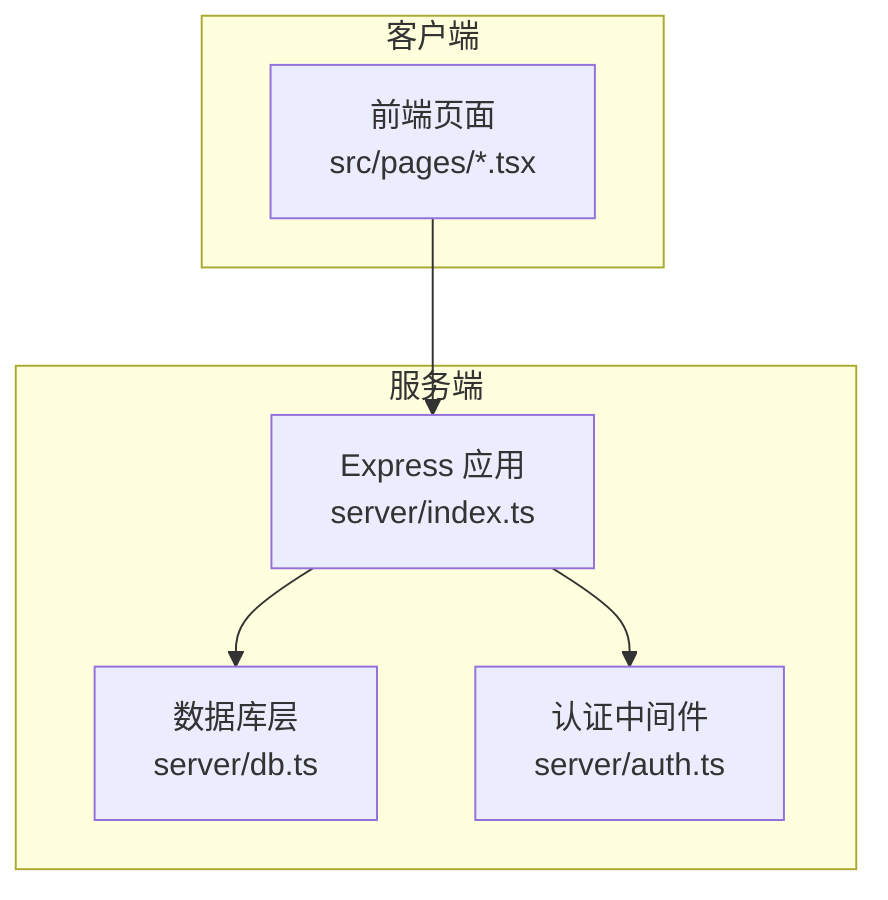
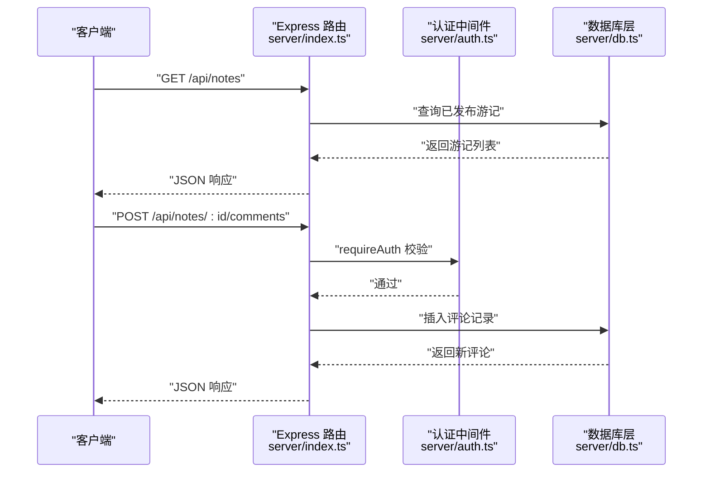
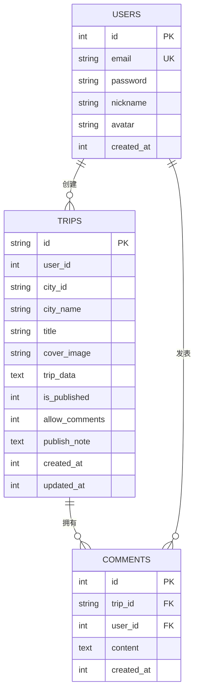
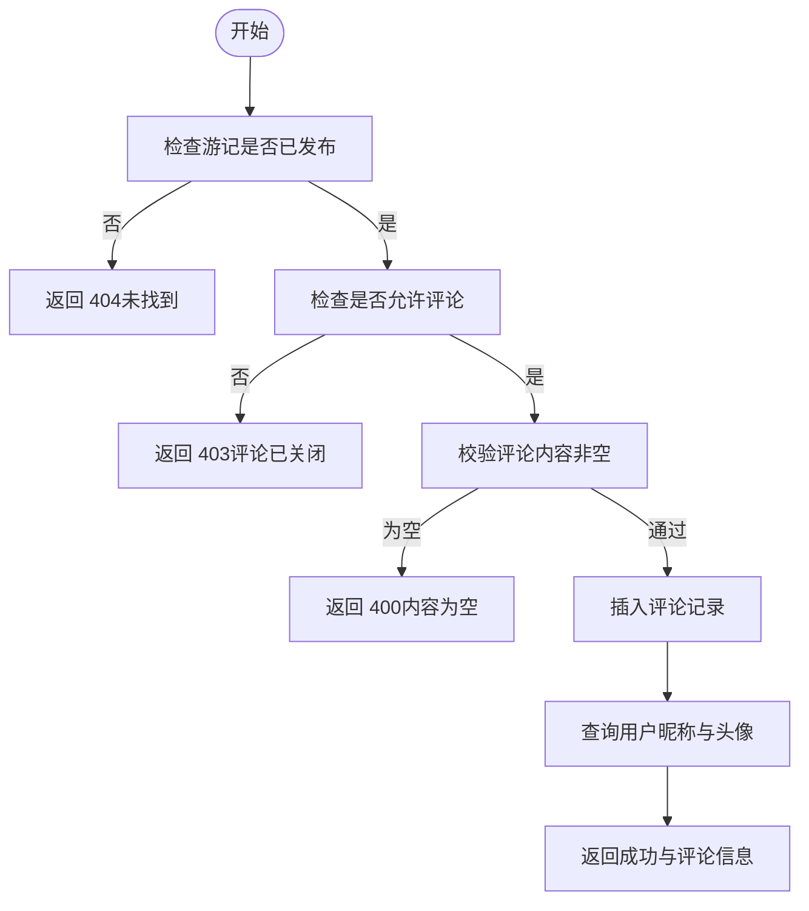
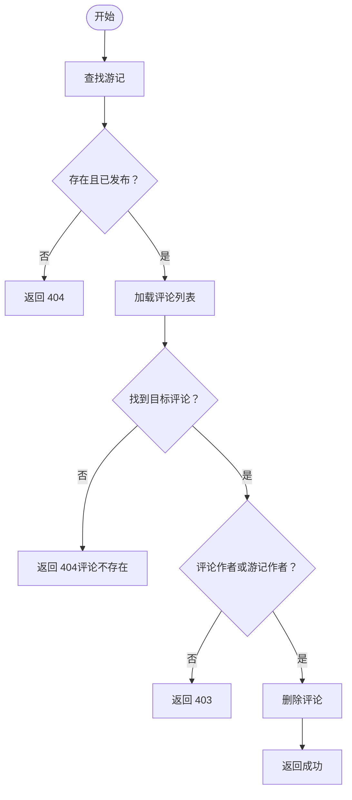
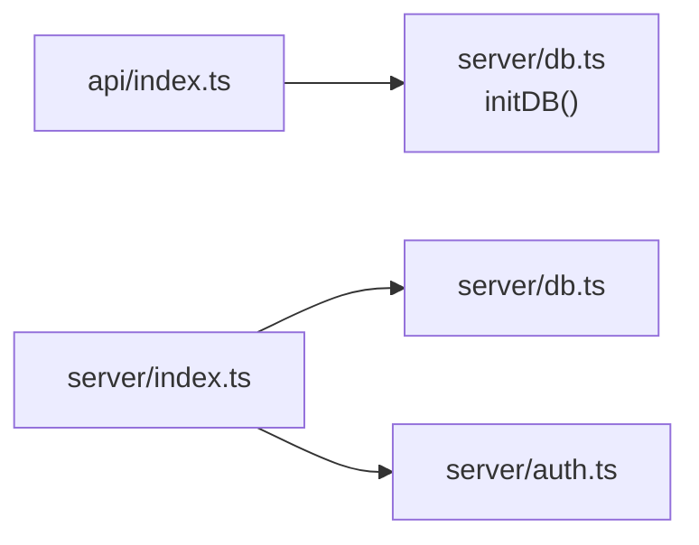

# 游记分享接口

<cite>
**本文档引用的文件**
- [server/index.ts](file://server/index.ts)
- [server/db.ts](file://server/db.ts)
- [server/auth.ts](file://server/auth.ts)
- [api/index.ts](file://api/index.ts)
</cite>

## 目录
1. [简介](#简介)
2. [项目结构](#项目结构)
3. [核心组件](#核心组件)
4. [架构总览](#架构总览)
5. [详细组件分析](#详细组件分析)
6. [依赖关系分析](#依赖关系分析)
7. [性能考虑](#性能考虑)
8. [故障排除指南](#故障排除指南)
9. [结论](#结论)

## 简介
本文件为“游记分享系统”的API文档，聚焦以下核心端点：
- 列出公开游记：GET /api/notes
- 获取单个游记：GET /api/notes/:id
- 获取游记评论列表：GET /api/notes/:id/comments
- 添加评论：POST /api/notes/:id/comments
- 删除评论：DELETE /api/notes/:id/comments/:cid

文档涵盖数据结构、权限控制、作者身份验证与游记内容管理机制，并提供可视化架构图与流程图帮助理解。

## 项目结构
后端采用Express + SQLite架构，核心入口在 server/index.ts，数据库层在 server/db.ts，认证相关在 server/auth.ts，生产环境通过 api/index.ts 初始化数据库并导出应用实例。

图表来源
- [server/index.ts:1-790](file://server/index.ts#L1-L790)
- [server/db.ts:1-200](file://server/db.ts#L1-L200)
- [server/auth.ts:1-132](file://server/auth.ts#L1-L132)

章节来源
- [server/index.ts:1-790](file://server/index.ts#L1-L790)
- [api/index.ts:1-8](file://api/index.ts#L1-L8)

## 核心组件
- 游记路由与业务逻辑：位于 server/index.ts 的“Public Notes Routes”区域，负责游记列表、详情、评论增删查等。
- 数据访问层：位于 server/db.ts，封装 trips、comments、users 等表的查询与更新。
- 认证中间件：位于 server/auth.ts，提供 optionalAuth（可选认证）与 requireAuth（必需认证）。

章节来源
- [server/index.ts:557-665](file://server/index.ts#L557-L665)
- [server/db.ts:340-408](file://server/db.ts#L340-L408)
- [server/auth.ts:87-113](file://server/auth.ts#L87-L113)

## 架构总览
下图展示游记相关请求从客户端到服务端的处理链路，包括认证、授权与数据库交互。

图表来源
- [server/index.ts:559-649](file://server/index.ts#L559-L649)
- [server/auth.ts:102-113](file://server/auth.ts#L102-L113)
- [server/db.ts:388-394](file://server/db.ts#L388-L394)

## 详细组件分析

### 游记数据模型
游记存储于 trips 表，评论存储于 comments 表，两者通过 trip_id 关联；用户信息用于显示作者头像与昵称。

图表来源
- [server/db.ts:67-97](file://server/db.ts#L67-L97)

章节来源
- [server/db.ts:67-97](file://server/db.ts#L67-L97)

### 权限与身份验证
- 可选认证（optionalAuth）：用于 GET /api/notes 与 GET /api/notes/:id，允许未登录用户访问公开资源。
- 必需认证（requireAuth）：用于评论相关操作（POST/DELETE /api/notes/:id/comments），确保只有登录用户可参与互动。
- 作者权限：删除评论时，仅游记作者或评论作者可删除。

章节来源
- [server/index.ts:598-665](file://server/index.ts#L598-L665)
- [server/auth.ts:87-113](file://server/auth.ts#L87-L113)

### API 定义与行为

#### GET /api/notes
- 功能：分页列出已发布的游记，支持 limit 与 offset 查询参数。
- 认证：optionalAuth（可匿名访问）。
- 返回字段：游记基础信息、作者信息、是否允许评论、时间戳等。
- 复杂度：O(n) 遍历游记并拼接作者信息。

章节来源
- [server/index.ts:559-595](file://server/index.ts#L559-L595)
- [server/db.ts:344-353](file://server/db.ts#L344-L353)

#### GET /api/notes/:id
- 功能：获取单个游记详情。
- 认证：optionalAuth（可匿名访问）。
- 权限：若游记未发布，仅作者本人可见。
- 返回字段：游记完整信息、作者信息、是否允许评论、是否为作者标记等。

章节来源
- [server/index.ts:597-626](file://server/index.ts#L597-L626)

#### GET /api/notes/:id/comments
- 功能：获取指定游记的评论列表。
- 认证：无需登录。
- 权限：仅对已发布的游记开放。

章节来源
- [server/index.ts:628-634](file://server/index.ts#L628-L634)
- [server/db.ts:396-404](file://server/db.ts#L396-L404)

#### POST /api/notes/:id/comments
- 功能：为已发布且允许评论的游记添加评论。
- 认证：requireAuth（必须登录）。
- 参数校验：content 非空。
- 返回：评论内容及作者昵称与头像。

章节来源
- [server/index.ts:636-649](file://server/index.ts#L636-L649)
- [server/db.ts:388-394](file://server/db.ts#L388-L394)

#### DELETE /api/notes/:id/comments/:cid
- 功能：删除评论。
- 认证：requireAuth（必须登录）。
- 权限：仅游记作者或评论作者可删除。
- 错误：找不到评论或权限不足返回相应状态码。

章节来源
- [server/index.ts:651-665](file://server/index.ts#L651-L665)
- [server/db.ts:406-408](file://server/db.ts#L406-L408)

### 评论权限控制流程

图表来源
- [server/index.ts:636-649](file://server/index.ts#L636-L649)
- [server/db.ts:388-394](file://server/db.ts#L388-L394)

### 删除评论权限流程

图表来源
- [server/index.ts:651-665](file://server/index.ts#L651-L665)
- [server/db.ts:406-408](file://server/db.ts#L406-L408)

## 依赖关系分析
- server/index.ts 依赖 server/db.ts 提供的数据访问函数与 server/auth.ts 提供的认证中间件。
- api/index.ts 在启动时初始化数据库，确保 server/db.ts 中的表结构可用。

图表来源
- [api/index.ts:1-8](file://api/index.ts#L1-L8)
- [server/index.ts:1-790](file://server/index.ts#L1-L790)
- [server/db.ts:37-147](file://server/db.ts#L37-L147)
- [server/auth.ts:87-113](file://server/auth.ts#L87-L113)

章节来源
- [api/index.ts:1-8](file://api/index.ts#L1-L8)
- [server/index.ts:1-790](file://server/index.ts#L1-L790)
- [server/db.ts:37-147](file://server/db.ts#L37-L147)

## 性能考虑
- 游记列表分页：通过 limit 与 offset 控制单页数量，默认最大 50，避免一次性返回过多数据。
- 评论查询：按时间倒序返回，减少前端排序开销。
- 数据库事务：新增评论与删除评论均为单条写入，复杂度 O(1)。
- 建议：在高并发场景下可考虑对 comments 表按 trip_id 建索引以优化查询性能。

章节来源
- [server/index.ts:560-564](file://server/index.ts#L560-L564)
- [server/db.ts:396-404](file://server/db.ts#L396-L404)

## 故障排除指南
- 401 未授权：POST/DELETE 评论前需登录，检查 Authorization 头与令牌有效性。
- 403 禁止访问：评论功能被关闭或删除权限不足（非作者）。
- 404 未找到：游记不存在或未发布；评论不存在。
- 400 请求错误：评论内容为空；注册/登录缺少必要字段。
- 500 服务器错误：游记数据解析失败或数据库异常。

章节来源
- [server/index.ts:598-665](file://server/index.ts#L598-L665)
- [server/auth.ts:102-113](file://server/auth.ts#L102-L113)

## 结论
本接口体系围绕“游记发布—评论互动—权限控制”形成闭环：通过 optionalAuth 放开公开浏览，通过 requireAuth 保障互动安全，通过作者权限细化删除控制。配合简洁的数据模型与清晰的路由设计，满足游记分享场景的核心需求。