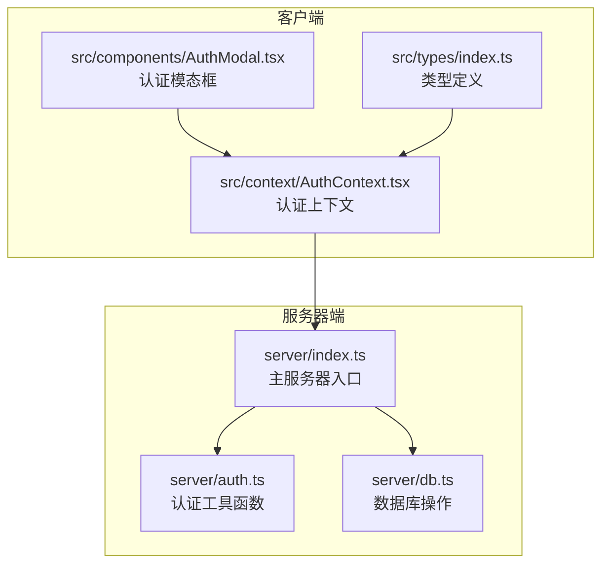
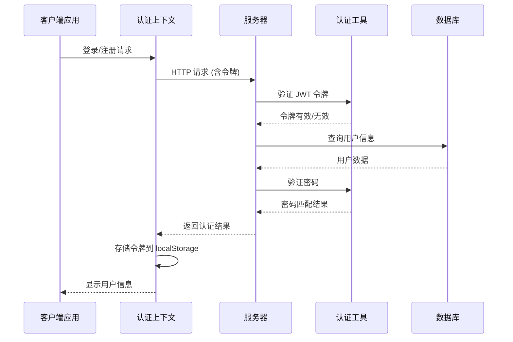
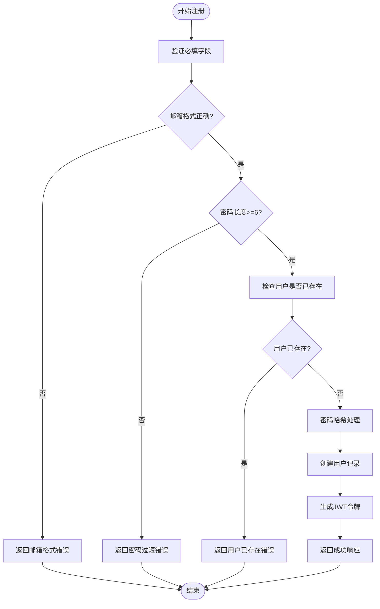
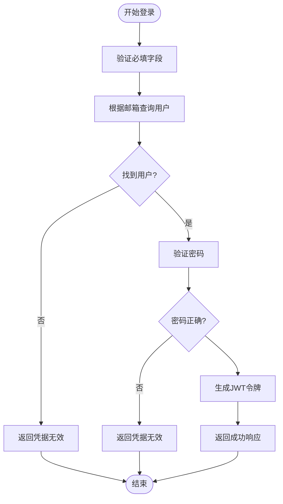
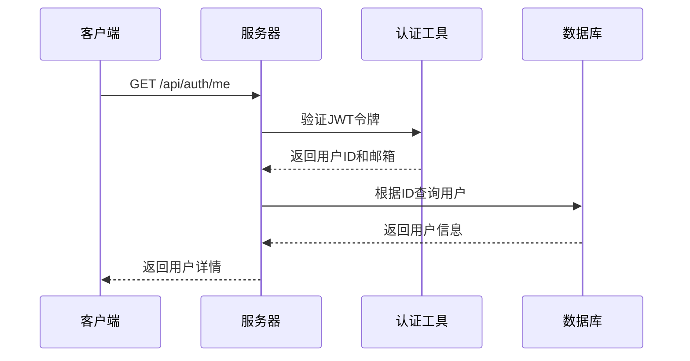
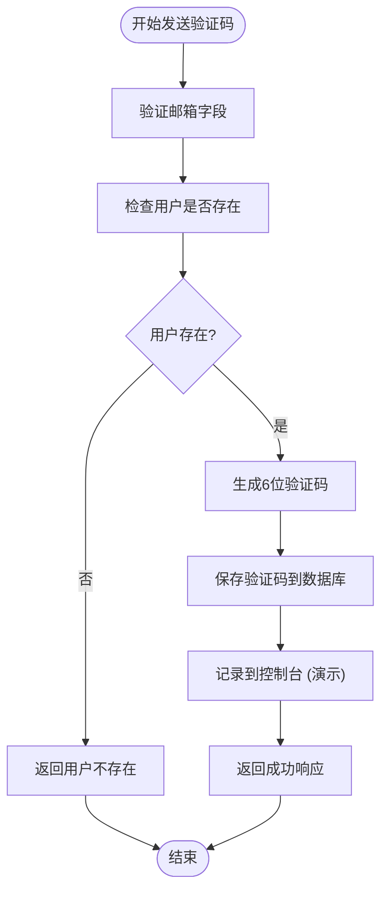
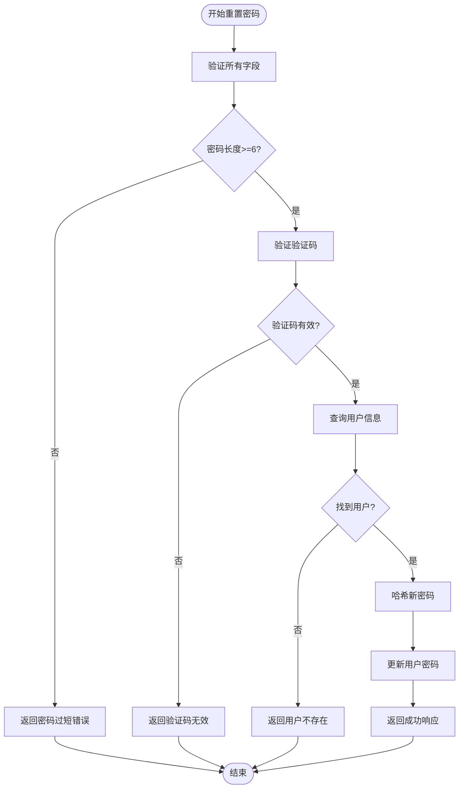
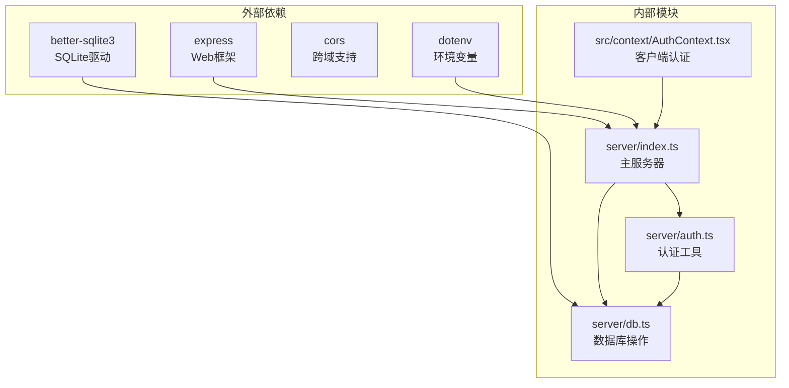

# 用户认证接口

<cite>
**本文档引用的文件**
- [server/auth.ts](file://server/auth.ts)
- [server/index.ts](file://server/index.ts)
- [server/db.ts](file://server/db.ts)
- [src/context/AuthContext.tsx](file://src/context/AuthContext.tsx)
- [src/components/AuthModal.tsx](file://src/components/AuthModal.tsx)
- [src/types/index.ts](file://src/types/index.ts)
- [package.json](file://package.json)
</cite>

## 目录
1. [简介](#简介)
2. [项目结构](#项目结构)
3. [核心组件](#核心组件)
4. [架构概览](#架构概览)
5. [详细组件分析](#详细组件分析)
6. [依赖关系分析](#依赖关系分析)
7. [性能考虑](#性能考虑)
8. [故障排除指南](#故障排除指南)
9. [结论](#结论)

## 简介

本项目是一个基于 Node.js 的行程规划应用，提供了完整的用户认证系统。认证系统采用 JWT（JSON Web Token）进行身份验证，使用 PBKDF2 算法对密码进行安全哈希处理，并实现了验证码验证机制。

主要特性包括：
- 基于 JWT 的无状态认证
- PBKDF2 密码哈希加密
- 验证码发送和验证
- 安全的会话管理
- 前后端分离的认证流程

## 项目结构

认证系统涉及以下关键文件：



**图表来源**
- [server/index.ts:1-790](file://server/index.ts#L1-L790)
- [server/auth.ts:1-133](file://server/auth.ts#L1-L133)
- [server/db.ts:1-513](file://server/db.ts#L1-L513)

**章节来源**
- [server/index.ts:1-790](file://server/index.ts#L1-L790)
- [package.json:1-59](file://package.json#L1-L59)

## 核心组件

### 认证工具模块 (server/auth.ts)

认证工具模块提供了以下核心功能：

#### JWT 令牌管理
- **令牌生成**: 使用 HS256 算法创建 JWT 令牌
- **令牌验证**: 验证令牌签名和过期时间
- **令牌配置**: 默认有效期为7天

#### 密码安全
- **PBKDF2 哈希**: 使用随机盐值和10000次迭代
- **密码验证**: 验证输入密码与存储哈希的匹配性

#### 验证码系统
- **6位数字验证码**: 生成随机验证码
- **验证码存储**: 存储10分钟有效期的验证码

**章节来源**
- [server/auth.ts:1-133](file://server/auth.ts#L1-L133)

### 数据库层 (server/db.ts)

数据库层负责用户认证相关的数据持久化：

#### 用户表结构
- **users 表**: 存储用户基本信息和密码哈希
- **verify_codes 表**: 存储邮箱验证码及其过期时间

#### 关键数据库操作
- **用户创建**: 注册新用户并存储加密密码
- **用户查询**: 通过邮箱或ID获取用户信息
- **密码更新**: 更新用户密码哈希
- **验证码管理**: 存储和验证验证码

**章节来源**
- [server/db.ts:1-513](file://server/db.ts#L1-L513)

### 客户端认证上下文 (src/context/AuthContext.tsx)

客户端认证上下文提供了完整的认证状态管理：

#### 认证状态管理
- **用户状态**: 当前登录用户的详细信息
- **令牌存储**: 使用 localStorage 存储 JWT 令牌
- **自动登录**: 应用启动时自动验证令牌有效性

#### API 调用封装
- **登录注册**: 处理认证相关的 HTTP 请求
- **令牌传递**: 自动在请求头中添加 Authorization 头
- **错误处理**: 统一处理认证相关的错误

**章节来源**
- [src/context/AuthContext.tsx:1-218](file://src/context/AuthContext.tsx#L1-L218)

## 架构概览

认证系统的整体架构如下：



**图表来源**
- [server/index.ts:318-401](file://server/index.ts#L318-L401)
- [server/auth.ts:47-113](file://server/auth.ts#L47-L113)
- [src/context/AuthContext.tsx:78-121](file://src/context/AuthContext.tsx#L78-L121)

## 详细组件分析

### 注册接口 (POST /api/auth/register)

注册接口负责新用户账户创建：

#### 请求参数
- **email**: 用户邮箱地址 (必需)
- **password**: 用户密码 (必需，至少6位)
- **nickname**: 用户昵称 (可选，默认使用邮箱用户名)

#### 处理流程


**图表来源**
- [server/index.ts:318-337](file://server/index.ts#L318-L337)
- [server/auth.ts:19-23](file://server/auth.ts#L19-L23)

#### 成功响应示例
```json
{
  "success": true,
  "token": "eyJhbGciOiJIUzI1NiIsInR5cCI6IkpXVCJ9.xxxxx",
  "user": {
    "id": 1,
    "email": "user@example.com",
    "nickname": "用户昵称",
    "avatar": ""
  }
}
```

**章节来源**
- [server/index.ts:318-337](file://server/index.ts#L318-L337)

### 登录接口 (POST /api/auth/login)

登录接口验证用户凭据并颁发访问令牌：

#### 请求参数
- **email**: 用户邮箱地址 (必需)
- **password**: 用户密码 (必需)

#### 处理流程


**图表来源**
- [server/index.ts:339-357](file://server/index.ts#L339-L357)
- [server/auth.ts:28-33](file://server/auth.ts#L28-L33)

#### 成功响应示例
```json
{
  "success": true,
  "token": "eyJhbGciOiJIUzI1NiIsInR5cCI6IkpXVCJ9.xxxxx",
  "user": {
    "id": 1,
    "email": "user@example.com",
    "nickname": "用户昵称",
    "avatar": ""
  }
}
```

**章节来源**
- [server/index.ts:339-357](file://server/index.ts#L339-L357)

### 用户信息接口 (GET /api/auth/me)

获取当前登录用户的信息：

#### 认证要求
- 需要有效的 Authorization 头 (Bearer 令牌)

#### 处理流程


**图表来源**
- [server/index.ts:359-367](file://server/index.ts#L359-L367)
- [server/auth.ts:102-113](file://server/auth.ts#L102-L113)

#### 成功响应示例
```json
{
  "success": true,
  "user": {
    "id": 1,
    "email": "user@example.com",
    "nickname": "用户昵称",
    "avatar": ""
  }
}
```

**章节来源**
- [server/index.ts:359-367](file://server/index.ts#L359-L367)

### 发送验证码接口 (POST /api/auth/send-code)

向指定邮箱发送6位数字验证码：

#### 请求参数
- **email**: 目标邮箱地址 (必需)

#### 处理流程


**图表来源**
- [server/index.ts:369-384](file://server/index.ts#L369-L384)
- [server/db.ts:412-417](file://server/db.ts#L412-L417)

#### 成功响应示例
```json
{
  "success": true,
  "message": "验证码已发送到邮箱"
}
```

**章节来源**
- [server/index.ts:369-384](file://server/index.ts#L369-L384)

### 重置密码接口 (POST /api/auth/reset-password)

使用验证码重置用户密码：

#### 请求参数
- **email**: 用户邮箱地址 (必需)
- **code**: 验证码 (必需)
- **newPassword**: 新密码 (必需，至少6位)

#### 处理流程


**图表来源**
- [server/index.ts:386-401](file://server/index.ts#L386-L401)
- [server/db.ts:419-426](file://server/db.ts#L419-L426)

#### 成功响应示例
```json
{
  "success": true,
  "message": "密码已重置"
}
```

**章节来源**
- [server/index.ts:386-401](file://server/index.ts#L386-L401)

### JWT 令牌验证中间件

系统提供了两种认证中间件：

#### 可选认证 (optionalAuth)
- 允许匿名访问
- 验证令牌有效性并设置 req.user
- 不会拒绝请求

#### 必需认证 (requireAuth)
- 要求必须提供有效的认证令牌
- 返回 401 状态码表示认证失败

**章节来源**
- [server/auth.ts:87-113](file://server/auth.ts#L87-L113)

## 依赖关系分析

认证系统的依赖关系如下：



**图表来源**
- [package.json:26-42](file://package.json#L26-L42)
- [server/index.ts:29-53](file://server/index.ts#L29-L53)

**章节来源**
- [package.json:1-59](file://package.json#L1-L59)
- [server/index.ts:29-53](file://server/index.ts#L29-L53)

## 性能考虑

### 密码哈希性能
- 使用 PBKDF2 算法，迭代次数为 10000 次
- 提供良好的安全性但会增加计算开销
- 建议在高并发场景下考虑性能优化

### 令牌有效期
- 默认令牌有效期为 7 天
- 可根据业务需求调整过期时间
- 短期令牌可以提高安全性但增加重新登录频率

### 数据库查询优化
- 用户查询使用邮箱索引
- 验证码查询包含过期时间过滤
- 建议在生产环境中添加适当的索引

## 故障排除指南

### 常见错误及解决方案

#### 认证相关错误
- **AUTH_REQUIRED (401)**: 检查 Authorization 头是否正确设置
- **TOKEN_INVALID (401)**: 令牌可能已过期或被篡改
- **INVALID_CREDENTIALS (401)**: 邮箱或密码不正确

#### 数据库相关错误
- **EMAIL_EXISTS (409)**: 邮箱已被注册
- **USER_NOT_FOUND (404)**: 用户不存在或已被删除

#### 参数验证错误
- **MISSING_FIELDS (400)**: 检查请求体中的必需字段
- **INVALID_EMAIL (400)**: 验证邮箱格式
- **WEAK_PASSWORD (400)**: 密码长度至少6位

### 调试建议

1. **检查环境变量**: 确保 JWT_SECRET 已正确设置
2. **验证数据库连接**: 确认数据库文件可读写
3. **监控令牌过期**: 定期检查令牌有效期
4. **日志分析**: 查看服务器日志中的认证相关信息

**章节来源**
- [server/index.ts:318-401](file://server/index.ts#L318-L401)
- [server/auth.ts:102-113](file://server/auth.ts#L102-L113)

## 结论

本认证系统提供了完整的用户身份验证解决方案，具有以下特点：

### 安全特性
- 使用 JWT 进行无状态认证
- PBKDF2 密码哈希提供强加密保护
- 验证码机制增强账户安全性
- CORS 支持防止跨域攻击

### 开发友好性
- 清晰的 API 设计和错误处理
- 完整的 TypeScript 类型定义
- 易于集成的客户端认证上下文
- 详细的文档和示例

### 扩展性
- 模块化的架构设计
- 易于添加新的认证方式
- 支持自定义令牌配置
- 可扩展的验证码系统

建议在生产环境中：
1. 设置更强的 JWT_SECRET
2. 实现更严格的密码策略
3. 添加速率限制和防暴力破解
4. 配置 HTTPS 和安全的 Cookie 设置
5. 实现账户锁定机制
6. 添加审计日志记录