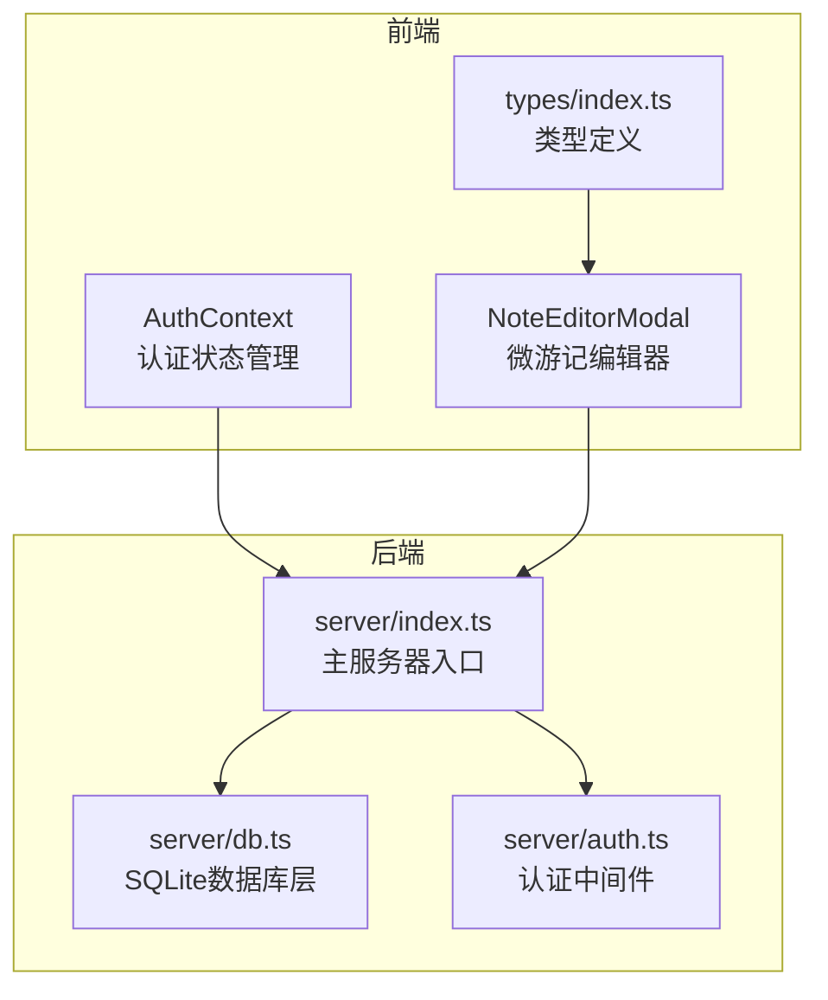
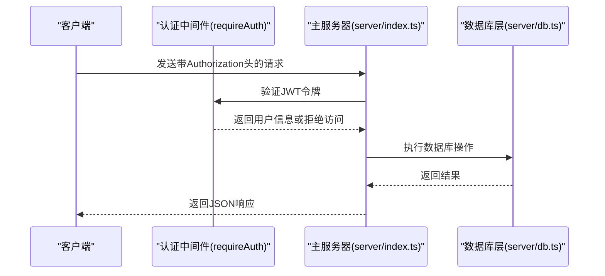
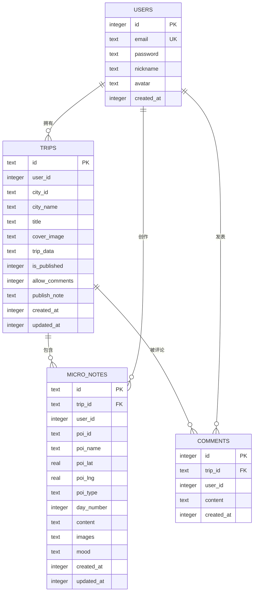
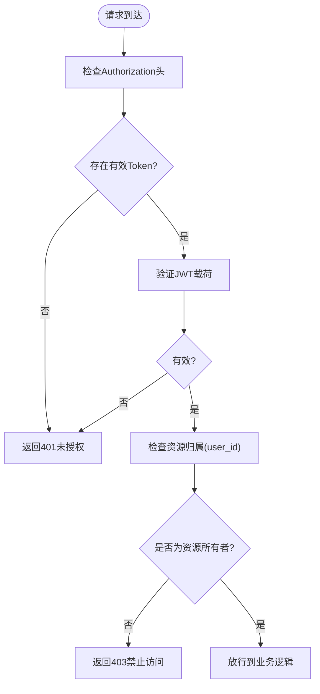
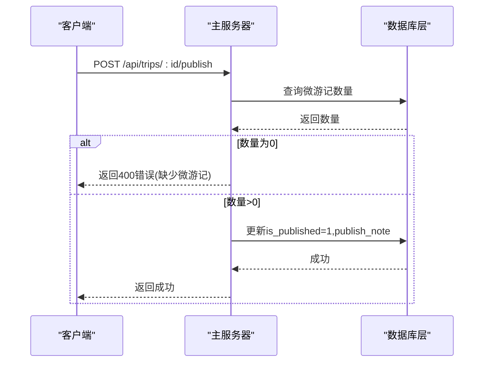
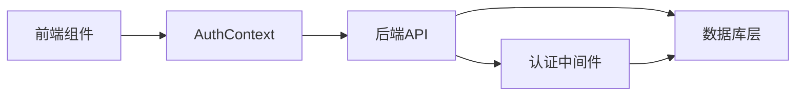

# 行程管理接口

<cite>
**本文档引用的文件**
- [server/index.ts](file://server/index.ts)
- [server/db.ts](file://server/db.ts)
- [server/auth.ts](file://server/auth.ts)
- [src/types/index.ts](file://src/types/index.ts)
- [src/components/NoteEditorModal.tsx](file://src/components/NoteEditorModal.tsx)
- [src/context/AuthContext.tsx](file://src/context/AuthContext.tsx)
</cite>

## 目录
1. [简介](#简介)
2. [项目结构](#项目结构)
3. [核心组件](#核心组件)
4. [架构概览](#架构概览)
5. [详细组件分析](#详细组件分析)
6. [依赖关系分析](#依赖关系分析)
7. [性能考虑](#性能考虑)
8. [故障排除指南](#故障排除指南)
9. [结论](#结论)

## 简介
本文件详细说明了行程管理API的设计与实现，涵盖以下核心端点：
- GET /api/trips：列出当前用户的行程摘要
- POST /api/trips：保存新的行程
- GET /api/trips/:id：按ID加载完整行程数据
- PUT /api/trips/:id：更新指定行程
- DELETE /api/trips/:id：删除指定行程
- POST /api/trips/:id/publish：将行程发布为游记
- POST /api/trips/:id/unpublish：取消游记发布
- PUT /api/trips/:id/comments-toggle：切换游记评论开关

同时，文档还解释了权限控制机制、发布流程以及从行程到游记的转换机制，并提供了数据模型、错误处理策略和最佳实践建议。

## 项目结构
该项目采用前后端分离架构，后端基于Express + SQLite，前端使用React + TypeScript。行程管理功能位于后端的server模块中，通过RESTful API提供服务；前端通过AuthContext进行认证状态管理，并在需要时自动拦截未授权请求。

**图表来源**
- [server/index.ts:1-790](file://server/index.ts#L1-L790)
- [server/db.ts:1-200](file://server/db.ts#L1-L200)
- [server/auth.ts:77-122](file://server/auth.ts#L77-L122)
- [src/context/AuthContext.tsx:1-217](file://src/context/AuthContext.tsx#L1-L217)
- [src/components/NoteEditorModal.tsx:1-135](file://src/components/NoteEditorModal.tsx#L1-L135)
- [src/types/index.ts:77-134](file://src/types/index.ts#L77-L134)

**章节来源**
- [server/index.ts:1-790](file://server/index.ts#L1-L790)
- [server/db.ts:1-200](file://server/db.ts#L1-L200)
- [server/auth.ts:77-122](file://server/auth.ts#L77-L122)
- [src/context/AuthContext.tsx:1-217](file://src/context/AuthContext.tsx#L1-L217)
- [src/components/NoteEditorModal.tsx:1-135](file://src/components/NoteEditorModal.tsx#L1-L135)
- [src/types/index.ts:77-134](file://src/types/index.ts#L77-L134)

## 核心组件
- 认证中间件：提供可选认证（optionalAuth）和强制认证（requireAuth），用于保护受保护的API端点。
- 数据库层：封装SQLite操作，包括行程、游记评论、微游记等表的CRUD操作。
- 前端认证上下文：负责用户登录状态、令牌存储与API请求头注入。
- 微游记编辑器：支持内容限制、图片上传、心情选择等功能，为发布游记提供基础素材。

**章节来源**
- [server/auth.ts:77-122](file://server/auth.ts#L77-L122)
- [server/db.ts:67-84](file://server/db.ts#L67-L84)
- [src/context/AuthContext.tsx:14-41](file://src/context/AuthContext.tsx#L14-L41)
- [src/components/NoteEditorModal.tsx:15-29](file://src/components/NoteEditorModal.tsx#L15-L29)

## 架构概览
后端通过Express路由暴露REST API，所有受保护端点均依赖requireAuth中间件进行身份验证。数据库层统一管理Schema与查询逻辑，前端通过AuthContext自动附加Authorization头，确保API调用的安全性。

**图表来源**
- [server/index.ts:413-555](file://server/index.ts#L413-L555)
- [server/auth.ts:102-113](file://server/auth.ts#L102-L113)
- [server/db.ts:315-386](file://server/db.ts#L315-L386)

**章节来源**
- [server/index.ts:413-555](file://server/index.ts#L413-L555)
- [server/auth.ts:102-113](file://server/auth.ts#L102-L113)
- [server/db.ts:315-386](file://server/db.ts#L315-L386)

## 详细组件分析

### 行程数据结构
- 行程实体（trips表）包含以下字段：
  - id：行程唯一标识符
  - user_id：所属用户ID
  - city_id / city_name：目的地城市信息
  - title / cover_image：标题与封面图
  - trip_data：完整行程JSON数据
  - is_published / allow_comments / publish_note：发布状态、评论开关与发布说明
  - created_at / updated_at：创建与更新时间戳

- 微游记实体（micro_notes表）包含以下字段：
  - id / trip_id / user_id：关联信息
  - poi_id / poi_name / poi_lat / poi_lng / poi_type：景点信息
  - day_number：所在天数
  - content / images / mood：内容、图片数组、心情
  - created_at / updated_at：时间戳

- 游记评论实体（comments表）包含以下字段：
  - id / trip_id / user_id / content：评论信息
  - created_at：创建时间

**图表来源**
- [server/db.ts:67-97](file://server/db.ts#L67-L97)
- [server/db.ts:151-173](file://server/db.ts#L151-L173)

**章节来源**
- [server/db.ts:67-97](file://server/db.ts#L67-L97)
- [server/db.ts:151-173](file://server/db.ts#L151-L173)

### 权限控制
- 受保护端点均使用requireAuth中间件，要求请求头携带有效的Bearer Token。
- optionalAuth允许匿名访问，常用于公开资源（如游记列表、详情）。
- 资源级权限校验：所有针对具体行程的操作都会检查user_id是否匹配当前登录用户，防止越权访问。

**图表来源**
- [server/auth.ts:102-113](file://server/auth.ts#L102-L113)
- [server/index.ts:460-466](file://server/index.ts#L460-L466)
- [server/index.ts:512-519](file://server/index.ts#L512-L519)

**章节来源**
- [server/auth.ts:102-113](file://server/auth.ts#L102-L113)
- [server/index.ts:460-466](file://server/index.ts#L460-L466)
- [server/index.ts:512-519](file://server/index.ts#L512-L519)

### 发布流程与游记转换机制
- 发布前提：必须为行程中的景点至少添加一条微游记，否则拒绝发布。
- 发布操作：将is_published设为1，并可附带publishNote说明。
- 取消发布：将is_published设为0。
- 游记可见性：未发布的游记仅作者可见；已发布的游记可在公共列表中查看。

**图表来源**
- [server/index.ts:522-535](file://server/index.ts#L522-L535)
- [server/db.ts:355-359](file://server/db.ts#L355-L359)

**章节来源**
- [server/index.ts:522-535](file://server/index.ts#L522-L535)
- [server/db.ts:355-359](file://server/db.ts#L355-L359)

### API端点详解

#### GET /api/trips
- 功能：列出当前用户的行程摘要（不含完整trip_data）
- 响应字段：id、cityId、cityName、title、coverImage、isPublished、allowComments、createdAt、updatedAt、startDate、endDate、dayCount、totalBudget
- 权限：requireAuth
- 错误：401未授权、404不存在

**章节来源**
- [server/index.ts:413-436](file://server/index.ts#L413-L436)

#### POST /api/trips
- 功能：保存新的行程
- 请求体：tripData（必需）、title、coverImage
- 行程默认状态：is_published=0、allow_comments=1、publish_note为空
- 响应：success、tripId
- 错误：400缺少数据、401未授权

**章节来源**
- [server/index.ts:438-458](file://server/index.ts#L438-L458)

#### GET /api/trips/:id
- 功能：按ID加载完整行程数据
- 权限：requireAuth + 资源归属校验
- 响应：id、cityId、cityName、title、coverImage、isPublished、tripData
- 错误：404不存在、403禁止访问、500数据损坏

**章节来源**
- [server/index.ts:460-486](file://server/index.ts#L460-L486)

#### PUT /api/trips/:id
- 功能：更新指定行程
- 请求体：tripData、title、coverImage
- 行为：保留现有发布状态与评论设置
- 响应：success
- 错误：404不存在、403禁止访问

**章节来源**
- [server/index.ts:488-510](file://server/index.ts#L488-L510)

#### DELETE /api/trips/:id
- 功能：删除指定行程
- 权限：requireAuth + 资源归属校验
- 行为：级联删除相关评论
- 响应：success
- 错误：404不存在、403禁止访问

**章节来源**
- [server/index.ts:512-520](file://server/index.ts#L512-L520)
- [server/db.ts:367-370](file://server/db.ts#L367-L370)

#### POST /api/trips/:id/publish
- 功能：将行程发布为游记
- 前置条件：至少有一条微游记
- 请求体：publishNote（可选）
- 行为：is_published=1、更新updated_at
- 响应：success
- 错误：400缺少微游记、404不存在、403禁止访问

**章节来源**
- [server/index.ts:522-535](file://server/index.ts#L522-L535)
- [server/db.ts:355-359](file://server/db.ts#L355-L359)

#### POST /api/trips/:id/unpublish
- 功能：取消游记发布
- 行为：is_published=0、更新updated_at
- 响应：success
- 错误：404不存在、403禁止访问

**章节来源**
- [server/index.ts:537-545](file://server/index.ts#L537-L545)
- [server/db.ts:361-365](file://server/db.ts#L361-L365)

#### PUT /api/trips/:id/comments-toggle
- 功能：切换游记评论开关
- 请求体：allow（布尔值）
- 行为：allow_comments=1或0、更新updated_at
- 响应：success
- 错误：404不存在、403禁止访问

**章节来源**
- [server/index.ts:547-555](file://server/index.ts#L547-L555)
- [server/db.ts:372-376](file://server/db.ts#L372-L376)

### 前端集成要点
- 认证上下文：通过AuthContext自动管理Token并在请求头中附加Authorization: Bearer。
- 微游记编辑：NoteEditorModal提供内容长度限制、图片上传与心情选择，确保符合后端约束（内容最多280字符、图片最多9张）。

**章节来源**
- [src/context/AuthContext.tsx:14-41](file://src/context/AuthContext.tsx#L14-L41)
- [src/components/NoteEditorModal.tsx:15-29](file://src/components/NoteEditorModal.tsx#L15-L29)

## 依赖关系分析
- server/index.ts依赖server/auth.ts进行认证，依赖server/db.ts进行数据持久化。
- 前端src/context/AuthContext.tsx依赖后端认证API，自动为每个请求添加Authorization头。
- 前端src/components/NoteEditorModal.tsx与后端微游记约束保持一致，确保用户体验与后端规则同步。

**图表来源**
- [server/index.ts:413-555](file://server/index.ts#L413-L555)
- [server/auth.ts:102-113](file://server/auth.ts#L102-L113)
- [server/db.ts:315-386](file://server/db.ts#L315-L386)
- [src/context/AuthContext.tsx:195-211](file://src/context/AuthContext.tsx#L195-L211)

**章节来源**
- [server/index.ts:413-555](file://server/index.ts#L413-L555)
- [server/auth.ts:102-113](file://server/auth.ts#L102-L113)
- [server/db.ts:315-386](file://server/db.ts#L315-L386)
- [src/context/AuthContext.tsx:195-211](file://src/context/AuthContext.tsx#L195-L211)

## 性能考虑
- 数据库事务与外键：启用WAL模式与外键约束，提升并发读写稳定性。
- 缓存策略：虽然行程API未直接实现缓存，但系统其他模块（如POI、酒店）采用多级缓存策略，可借鉴其经验优化行程列表的分页与排序。
- 请求大小限制：后端对JSON请求体设置了10MB上限，避免过大负载影响性能。
- 异步刷新：后台任务在无缓存时触发异步生成，避免Nginx超时，提升用户体验。

**章节来源**
- [server/db.ts:42-44](file://server/db.ts#L42-L44)
- [server/index.ts:60-61](file://server/index.ts#L60-L61)
- [server/index.ts:82-100](file://server/index.ts#L82-L100)

## 故障排除指南
- 401未授权：检查Authorization头是否正确、Token是否过期。
- 403禁止访问：确认请求的行程是否属于当前登录用户。
- 404不存在：确认行程ID是否正确，或行程是否已被删除。
- 500数据损坏：检查trip_data是否为合法JSON格式。
- 发布失败（缺少微游记）：在发布前为行程中的景点添加至少一条微游记。

**章节来源**
- [server/index.ts:460-466](file://server/index.ts#L460-L466)
- [server/index.ts:512-519](file://server/index.ts#L512-L519)
- [server/index.ts:528-532](file://server/index.ts#L528-L532)

## 结论
本API设计遵循RESTful原则，结合JWT认证与资源归属校验，确保了安全性与易用性。通过微游记作为发布前置条件，有效提升了游记质量与用户参与度。建议后续可扩展：
- 行程列表分页与筛选参数
- 行程模板与共享机制
- 更细粒度的权限控制（如协作编辑）