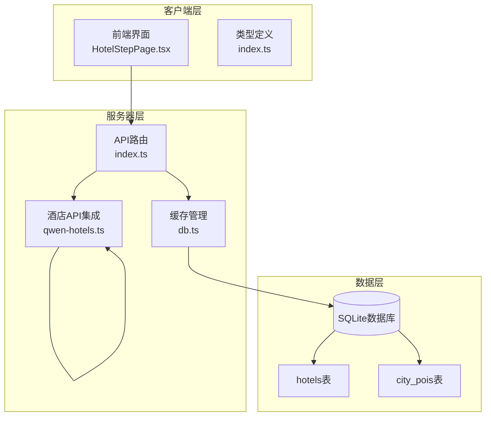
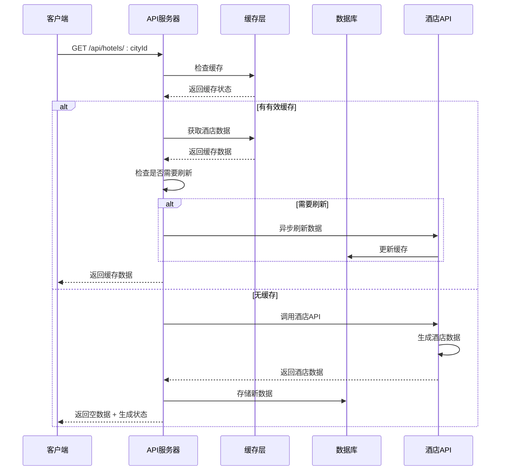
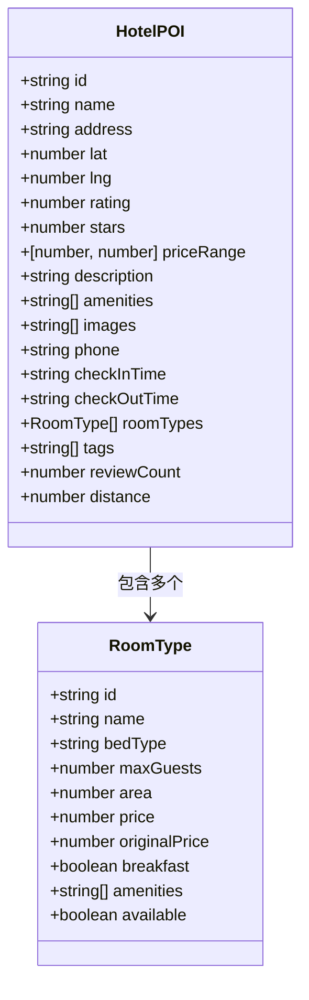
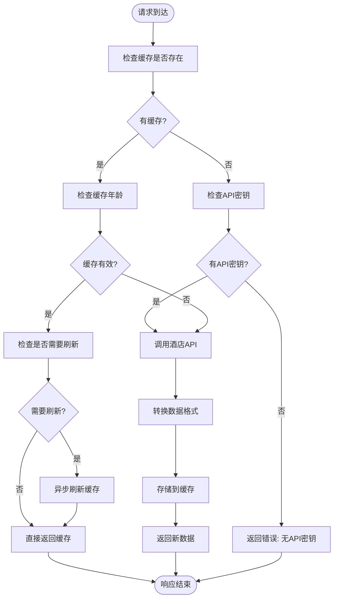
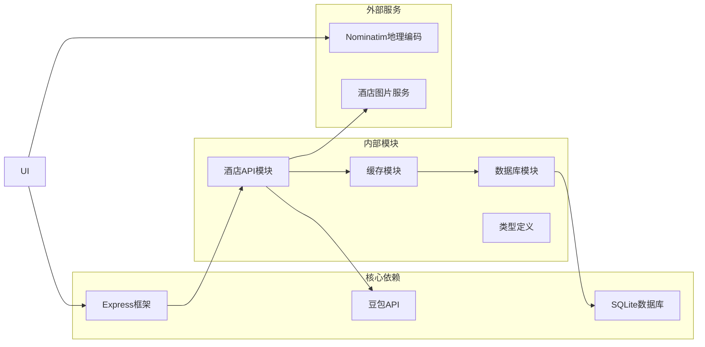

# 酒店数据接口

<cite>
**本文档引用的文件**
- [server/index.ts](file://server/index.ts)
- [server/qwen-hotels.ts](file://server/qwen-hotels.ts)
- [server/db.ts](file://server/db.ts)
- [src/pages/HotelStepPage.tsx](file://src/pages/HotelStepPage.tsx)
- [src/types/index.ts](file://src/types/index.ts)
- [scripts/import-cache.js](file://scripts/import-cache.js)
</cite>

## 目录
1. [简介](#简介)
2. [项目结构](#项目结构)
3. [核心组件](#核心组件)
4. [架构概览](#架构概览)
5. [详细组件分析](#详细组件分析)
6. [依赖关系分析](#依赖关系分析)
7. [性能考虑](#性能考虑)
8. [故障排除指南](#故障排除指南)
9. [结论](#结论)

## 简介

酒店数据接口是行程规划系统的重要组成部分，为用户提供基于AI生成的酒店推荐数据。该接口实现了智能缓存策略、异步刷新机制，并与POI接口采用相似的缓存管理模式。

本接口主要功能包括：
- 提供按城市ID查询酒店列表的REST API
- 实现三层缓存策略（新鲜、陈旧、过期）
- 支持异步后台刷新机制
- 提供丰富的酒店数据结构，包括房间类型、设施、价格等信息
- 与旅行行程系统深度集成

## 项目结构



**图表来源**
- [server/index.ts:185-212](file://server/index.ts#L185-L212)
- [server/db.ts:428-454](file://server/db.ts#L428-L454)
- [server/qwen-hotels.ts:208-283](file://server/qwen-hotels.ts#L208-L283)

**章节来源**
- [server/index.ts:1-790](file://server/index.ts#L1-L790)
- [server/db.ts:428-513](file://server/db.ts#L428-L513)

## 核心组件

### API端点定义

**GET /api/hotels/:cityId** - 获取指定城市的酒店列表

**请求参数:**
- 路径参数:
  - `cityId`: 城市标识符（必填）
- 查询参数:
  - `cityName`: 城市中文名称（可选，默认使用cityId）
  - `cityNameEn`: 城市英文名称（可选，默认使用cityId）

**响应格式:**
```typescript
{
  success: boolean,
  data: HotelPOI[],
  fromCache?: boolean,
  refreshing?: boolean,
  generating?: boolean,
  cacheAgeHours?: number,
  stale?: boolean,
  warning?: string,
  error?: string,
  message?: string
}
```

**章节来源**
- [server/index.ts:185-212](file://server/index.ts#L185-L212)

### 缓存策略实现

系统采用三层缓存策略：

1. **新鲜缓存 (FRESH_TTL_MS)**: 15天
2. **陈旧缓存 (STALE_TTL_MS)**: 30天  
3. **过期缓存**: 超过30天

**章节来源**
- [server/index.ts:64-65](file://server/index.ts#L64-L65)
- [server/index.ts:193-197](file://server/index.ts#L193-L197)

## 架构概览



**图表来源**
- [server/index.ts:185-212](file://server/index.ts#L185-L212)
- [server/db.ts:430-454](file://server/db.ts#L430-L454)
- [server/qwen-hotels.ts:208-283](file://server/qwen-hotels.ts#L208-L283)

## 详细组件分析

### 酒店数据结构

酒店数据采用统一的结构定义，支持丰富的扩展信息：



**图表来源**
- [src/types/index.ts:14-34](file://src/types/index.ts#L14-L34)
- [src/types/index.ts:1-12](file://src/types/index.ts#L1-L12)

### 缓存管理机制



**图表来源**
- [server/index.ts:185-212](file://server/index.ts#L185-L212)
- [server/db.ts:430-454](file://server/db.ts#L430-L454)

**章节来源**
- [src/types/index.ts:14-34](file://src/types/index.ts#L14-L34)
- [server/db.ts:428-454](file://server/db.ts#L428-L454)

### 异步刷新机制

系统实现了智能的异步刷新策略：

1. **并发控制**: 使用Set确保同一城市不会同时进行多次刷新
2. **后台执行**: 无缓存时立即返回客户端生成状态，后台异步处理
3. **错误处理**: 刷新失败不影响现有数据的返回
4. **状态跟踪**: 提供详细的刷新状态信息给客户端

**章节来源**
- [server/index.ts:164-183](file://server/index.ts#L164-L183)
- [server/index.ts:203-206](file://server/index.ts#L203-L206)

### 数据转换和验证

酒店API返回的数据经过严格的转换和验证过程：

1. **JSON修复**: 自动修复截断的JSON响应
2. **数据清洗**: 标准化字段格式和数据类型
3. **范围验证**: 确保数值在合理范围内
4. **默认值填充**: 为缺失字段提供合理的默认值

**章节来源**
- [server/qwen-hotels.ts:187-204](file://server/qwen-hotels.ts#L187-L204)
- [server/qwen-hotels.ts:142-184](file://server/qwen-hotels.ts#L142-L184)

## 依赖关系分析



**图表来源**
- [server/index.ts:29-53](file://server/index.ts#L29-L53)
- [server/qwen-hotels.ts:8-28](file://server/qwen-hotels.ts#L8-L28)

**章节来源**
- [server/index.ts:29-53](file://server/index.ts#L29-L53)
- [server/qwen-hotels.ts:8-28](file://server/qwen-hotels.ts#L8-L28)

## 性能考虑

### 缓存优化策略

1. **智能刷新**: 新鲜缓存过期时才触发后台刷新，避免频繁API调用
2. **并发限制**: 同一城市同时只能有一个刷新任务
3. **内存管理**: 定期清理过期缓存，控制内存使用
4. **响应时间**: 无缓存时立即返回状态，避免超时

### 数据传输优化

1. **增量更新**: 只更新变化的数据，减少数据库写入
2. **压缩存储**: 数据库中存储JSON字符串，便于快速序列化
3. **批量操作**: 支持批量导入导出缓存数据

## 故障排除指南

### 常见问题及解决方案

**API密钥配置错误**
- 症状: 返回"NO_API_KEY"错误
- 解决方案: 检查环境变量ARK_API_KEY配置

**缓存数据过期**
- 症状: 返回stale=true和warning信息
- 解决方案: 系统会自动刷新，等待几分钟后重试

**酒店API调用失败**
- 症状: 返回HOTEL_API_ERROR错误
- 解决方案: 检查网络连接和API配额限制

**客户端轮询超时**
- 症状: generating状态持续超过2分钟
- 解决方案: 检查服务器日志，重新发起请求

**章节来源**
- [server/index.ts:200-211](file://server/index.ts#L200-L211)
- [server/qwen-hotels.ts:241-247](file://server/qwen-hotels.ts#L241-L247)

## 结论

酒店数据接口通过智能缓存策略和异步刷新机制，为用户提供高效、可靠的酒店推荐服务。系统设计充分考虑了性能优化和用户体验，在保证数据新鲜度的同时最大化减少了API调用频率。

主要优势包括：
- **高性能**: 三层缓存策略显著减少API调用
- **可靠性**: 异步刷新机制避免请求阻塞
- **可扩展性**: 统一的数据结构支持未来功能扩展
- **易维护性**: 清晰的模块分离和错误处理机制

该接口与旅行行程系统的集成非常紧密，为用户提供了完整的旅行规划体验。