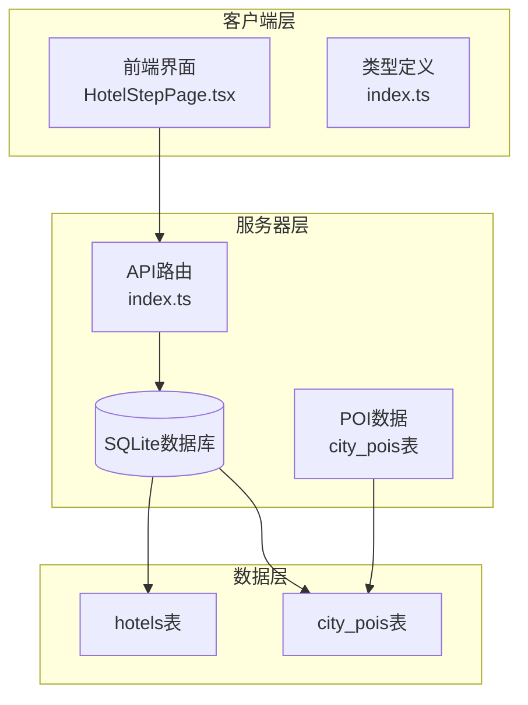
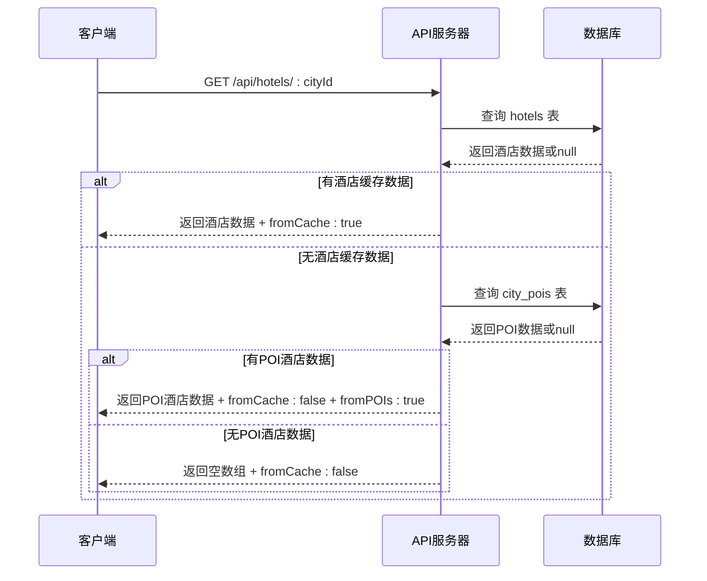
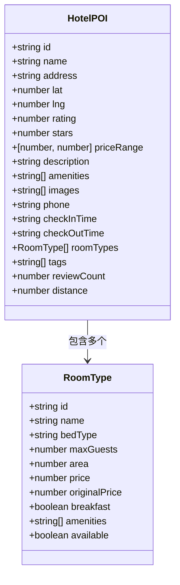
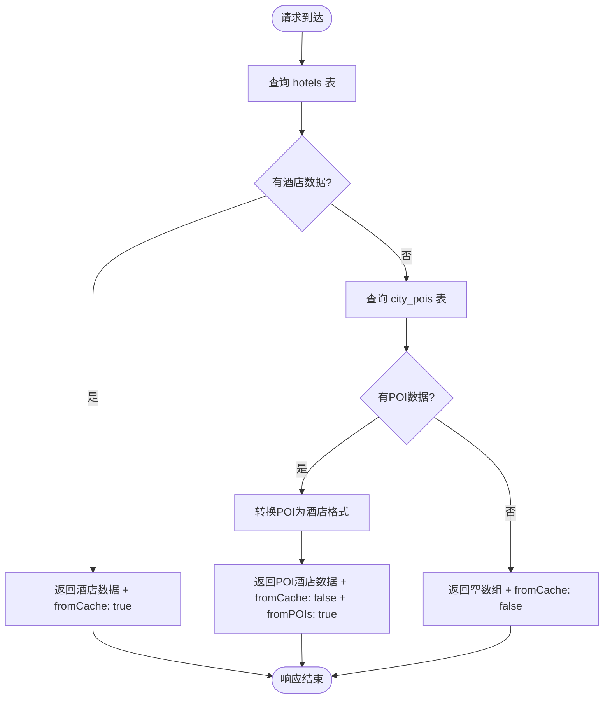
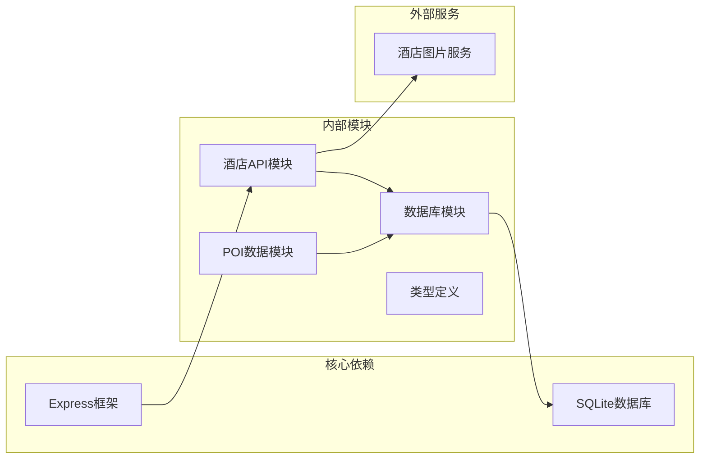

# 酒店数据接口

<cite>
**本文档引用的文件**
- [server/index.ts](file://server/index.ts)
- [server/db.ts](file://server/db.ts)
- [src/types/index.ts](file://src/types/index.ts)
</cite>

## 更新摘要
**变更内容**
- 酒店数据接口已从AI驱动的三层缓存系统简化为纯数据库只读模式
- 移除了后台刷新、轮询机制、AI生成状态管理等复杂功能
- 保留了POI数据回退机制，确保无缓存时的数据可用性
- 简化了API响应格式，移除了缓存状态和刷新相关字段

## 目录
1. [简介](#简介)
2. [项目结构](#项目结构)
3. [核心组件](#核心组件)
4. [架构概览](#架构概览)
5. [详细组件分析](#详细组件分析)
6. [依赖关系分析](#依赖关系分析)
7. [性能考虑](#性能考虑)
8. [故障排除指南](#故障排除指南)
9. [结论](#结论)

## 简介

酒店数据接口是行程规划系统的重要组成部分，为用户提供基于数据库的酒店推荐数据。该接口实现了简洁高效的数据库只读查询模式，与POI接口采用相似的缓存管理模式。

**更新** 酒店数据接口已从复杂的AI驱动三层缓存系统简化为纯数据库只读模式。移除了后台刷新、轮询机制、AI生成状态管理等复杂功能，现在仅提供直接的数据库查询接口。

本接口主要功能包括：
- 提供按城市ID查询酒店列表的REST API
- 实现数据库只读查询模式
- 支持POI数据回退机制，确保无缓存时的数据可用性
- 提供丰富的酒店数据结构，包括房间类型、设施、价格等信息
- 与旅行行程系统深度集成

## 项目结构



**图表来源**
- [server/index.ts:164-183](file://server/index.ts#L164-L183)
- [server/db.ts:430-476](file://server/db.ts#L430-L476)

**章节来源**
- [server/index.ts:164-183](file://server/index.ts#L164-L183)
- [server/db.ts:430-476](file://server/db.ts#L430-L476)

## 核心组件

### API端点定义

**GET /api/hotels/:cityId** - 获取指定城市的酒店列表

**请求参数:**
- 路径参数:
  - `cityId`: 城市标识符（必填）

**响应格式:**
```typescript
{
  success: boolean,
  data: HotelPOI[],
  fromCache?: boolean,
  fromPOIs?: boolean
}
```

**更新** 简化了响应格式，移除了缓存状态和刷新相关字段，仅保留基础的成功状态和数据字段。

**章节来源**
- [server/index.ts:164-183](file://server/index.ts#L164-L183)

### 数据库查询实现

系统采用简洁的数据库只读查询策略：

1. **优先查询酒店缓存**: 从 `hotels` 表获取缓存的酒店数据
2. **POI数据回退**: 当酒店缓存不存在时，从 `city_pois` 表提取酒店数据
3. **直接返回结果**: 无缓存时返回空数组，不进行AI生成

**更新** 移除了后台刷新机制，查询流程更加直接高效。

**章节来源**
- [server/index.ts:164-183](file://server/index.ts#L164-L183)

## 架构概览



**图表来源**
- [server/index.ts:164-183](file://server/index.ts#L164-L183)
- [server/db.ts:430-476](file://server/db.ts#L430-L476)

## 详细组件分析

### 酒店数据结构

酒店数据采用统一的结构定义，支持丰富的扩展信息：



**更新** 新增 `stars` 字段用于表示酒店星级，支持1-5星评级。

**图表来源**
- [src/types/index.ts:14-34](file://src/types/index.ts#L14-L34)

### 数据库查询机制



**图表来源**
- [server/index.ts:164-183](file://server/index.ts#L164-L183)
- [server/db.ts:430-476](file://server/db.ts#L430-L476)

**章节来源**
- [src/types/index.ts:14-34](file://src/types/index.ts#L14-L34)
- [server/db.ts:430-476](file://server/db.ts#L430-L476)

### POI数据回退机制

**更新** 系统实现了智能的酒店数据回退机制：

1. **POI数据提取**: 当酒店缓存不存在时，系统会从 `city_pois` 表中提取酒店数据
2. **数据转换**: 将POI格式的酒店数据转换为酒店接口所需的格式
3. **星级评级解析**: 解析POI的 `categoryL3` 字段中的星级信息
4. **成本字段映射**: 从POI的 `cost` 字段映射到酒店的 `priceRange`
5. **图片URL提取**: 从POI的 `image` 字段提取酒店图片URL

**章节来源**
- [server/db.ts:443-476](file://server/db.ts#L443-L476)

## 依赖关系分析



**图表来源**
- [server/index.ts:164-183](file://server/index.ts#L164-L183)
- [server/db.ts:430-476](file://server/db.ts#L430-L476)

**章节来源**
- [server/index.ts:164-183](file://server/index.ts#L164-L183)
- [server/db.ts:430-476](file://server/db.ts#L430-L476)

## 性能考虑

### 查询优化策略

1. **直接数据库查询**: 移除了复杂的缓存管理，查询路径更加直接
2. **POI回退机制**: 在无缓存时提供即时响应，无需等待AI生成
3. **内存开销降低**: 移除了缓存状态管理和后台刷新任务
4. **响应时间优化**: 查询流程简化，减少了不必要的处理步骤

### 数据传输优化

1. **直接返回数据**: 无缓存时直接返回空数组，避免无效数据传输
2. **POI数据复用**: 利用现有的POI数据，减少重复计算
3. **批量查询**: 支持批量查询城市酒店数据

## 故障排除指南

### 常见问题及解决方案

**数据库连接失败**
- 症状: 返回"DB_ERROR"错误
- 解决方案: 检查数据库连接配置和权限

**城市无酒店数据**
- 症状: 返回空数组
- 解决方案: 检查该城市是否已有POI数据，或等待AI数据生成

**POI数据格式错误**
- 症状: fromPOIs标志但数据格式不正确
- 解决方案: 检查POI数据完整性，确保包含必要的酒店字段

**章节来源**
- [server/index.ts:178-182](file://server/index.ts#L178-L182)

## 结论

酒店数据接口通过简化的数据库只读查询模式，为用户提供高效、可靠的酒店推荐服务。系统设计充分考虑了性能优化和用户体验，在保证数据可用性的前提下最大化简化了实现复杂度。

**更新** 新的纯数据库只读模式显著提升了系统的稳定性和可维护性，移除了复杂的缓存管理逻辑，使系统更加专注于核心的数据查询功能。POI数据回退机制确保了即使在没有AI生成数据的情况下，用户仍能获得基本的酒店信息。

主要优势包括：
- **高性能**: 直接数据库查询，无缓存管理开销
- **高可用**: POI数据回退机制确保无缓存时的数据可用性
- **高可靠**: 移除后台刷新任务，减少系统复杂度
- **易维护**: 简化的代码结构，便于维护和扩展
- **资源节约**: 减少内存和CPU使用，降低运行成本

该接口与旅行行程系统的集成非常紧密，为用户提供了完整的旅行规划体验。新的简化模式进一步增强了系统的鲁棒性，为用户提供了更加稳定和高效的酒店数据查询服务。