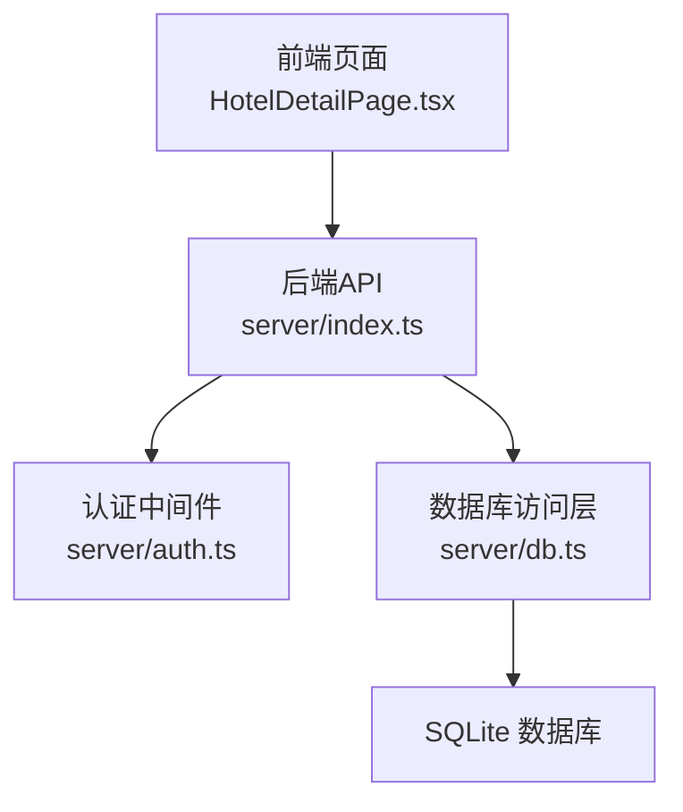
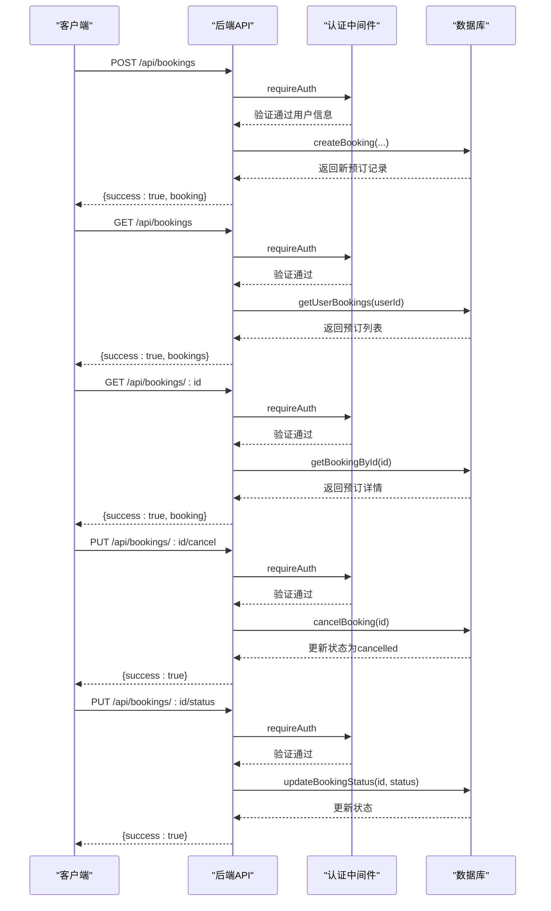
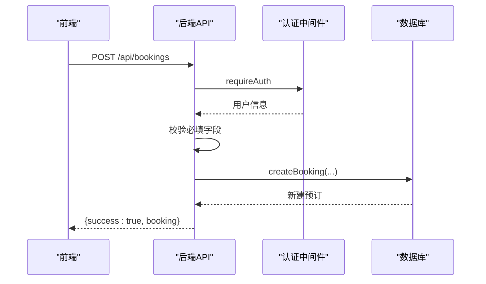
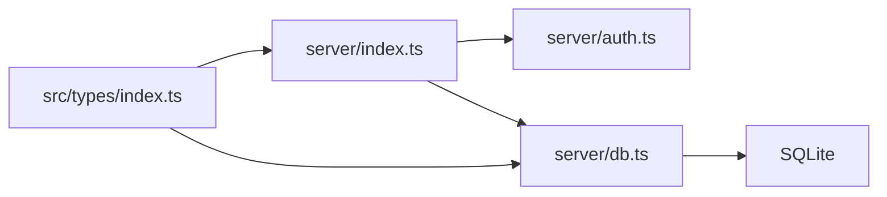

# 酒店预订接口

<cite>
**本文档引用的文件**
- [server/index.ts](file://server/index.ts)
- [server/db.ts](file://server/db.ts)
- [server/auth.ts](file://server/auth.ts)
- [src/types/index.ts](file://src/types/index.ts)
- [src/pages/HotelDetailPage.tsx](file://src/pages/HotelDetailPage.tsx)
- [api/index.ts](file://api/index.ts)
</cite>

## 目录
1. [简介](#简介)
2. [项目结构](#项目结构)
3. [核心组件](#核心组件)
4. [架构总览](#架构总览)
5. [详细组件分析](#详细组件分析)
6. [依赖关系分析](#依赖关系分析)
7. [性能考虑](#性能考虑)
8. [故障排除指南](#故障排除指南)
9. [结论](#结论)

## 简介
本文件为酒店预订系统的API文档，聚焦于以下核心端点：
- POST /api/bookings：创建预订
- GET /api/bookings：获取当前用户预订列表
- GET /api/bookings/:id：获取单个预订详情
- PUT /api/bookings/:id/cancel：取消预订
- PUT /api/bookings/:id/status：更新预订状态

文档涵盖数据结构、状态流转、权限验证机制以及取消政策说明，并提供可视化图表帮助理解系统交互流程。

## 项目结构
酒店预订功能位于后端Express服务器与SQLite数据库之间，前端通过浏览器直接调用后端API完成预订操作。核心文件包括：
- server/index.ts：路由定义与业务逻辑入口
- server/db.ts：数据库Schema与数据访问层
- server/auth.ts：认证中间件与JWT处理
- src/types/index.ts：类型定义（含预订状态枚举）
- src/pages/HotelDetailPage.tsx：前端预订表单与调用示例
- api/index.ts：应用启动与数据库初始化



**图表来源**
- [server/index.ts:214-283](file://server/index.ts#L214-L283)
- [server/auth.ts:87-113](file://server/auth.ts#L87-L113)
- [server/db.ts:120-144](file://server/db.ts#L120-L144)

**章节来源**
- [server/index.ts:1-790](file://server/index.ts#L1-L790)
- [server/db.ts:42-149](file://server/db.ts#L42-L149)
- [server/auth.ts:1-132](file://server/auth.ts#L1-L132)
- [src/types/index.ts:36-75](file://src/types/index.ts#L36-L75)
- [src/pages/HotelDetailPage.tsx:158-357](file://src/pages/HotelDetailPage.tsx#L158-L357)
- [api/index.ts:1-8](file://api/index.ts#L1-L8)

## 核心组件
- 认证中间件
  - requireAuth：强制要求携带有效Bearer Token，否则返回401
  - optionalAuth：可选认证，用于公开接口
- 数据模型
  - DBBooking：数据库层预订记录结构
  - Booking：前端类型定义（含状态枚举）
- 数据库表
  - bookings：存储预订信息，包含用户ID、酒店信息、房间类型、入住离店时间、价格、状态等字段

**章节来源**
- [server/auth.ts:87-113](file://server/auth.ts#L87-L113)
- [server/db.ts:458-512](file://server/db.ts#L458-L512)
- [src/types/index.ts:36-75](file://src/types/index.ts#L36-L75)

## 架构总览
后端采用Express + SQLite方案，所有预订相关请求均需通过requireAuth中间件进行身份验证。前端在酒店详情页弹出预订表单，收集入住人信息与日期后调用POST /api/bookings创建预订；随后可通过GET /api/bookings获取列表，GET /api/bookings/:id获取单条详情；管理员或系统可通过PUT /api/bookings/:id/status更新状态；用户可通过PUT /api/bookings/:id/cancel取消预订。



**图表来源**
- [server/index.ts:216-283](file://server/index.ts#L216-L283)
- [server/db.ts:480-512](file://server/db.ts#L480-L512)
- [server/auth.ts:87-113](file://server/auth.ts#L87-L113)

## 详细组件分析

### POST /api/bookings（创建预订）
- 请求方法与路径：POST /api/bookings
- 权限：requireAuth（必须登录）
- 请求体字段
  - hotelId：酒店ID（必填）
  - roomTypeId：房型ID（必填）
  - checkIn：入住日期（YYYY-MM-DD，必填）
  - checkOut：离店日期（YYYY-MM-DD，必填）
  - guestName：入住人姓名（必填）
  - guestPhone：联系电话（必填）
  - 其他可选字段：hotelName、hotelAddress、hotelImage、roomTypeName、nights、guestEmail、totalPrice、cityName
- 处理流程
  - 校验必填字段，缺失则返回400
  - 调用createBooking写入数据库，初始状态设为“confirmed”
  - 返回成功响应与新建预订对象
- 前端调用示例
  - 前端在酒店详情页弹出预订表单，收集入住人信息与日期后调用此接口



**图表来源**
- [server/index.ts:216-244](file://server/index.ts#L216-L244)
- [server/db.ts:480-492](file://server/db.ts#L480-L492)
- [src/pages/HotelDetailPage.tsx:187-231](file://src/pages/HotelDetailPage.tsx#L187-L231)

**章节来源**
- [server/index.ts:216-244](file://server/index.ts#L216-L244)
- [server/db.ts:480-492](file://server/db.ts#L480-L492)
- [src/pages/HotelDetailPage.tsx:187-231](file://src/pages/HotelDetailPage.tsx#L187-L231)

### GET /api/bookings（获取用户预订列表）
- 请求方法与路径：GET /api/bookings
- 权限：requireAuth
- 查询逻辑：根据当前用户ID查询其所有预订，按创建时间倒序排列
- 返回结构：{success:true, bookings:[...]}

**章节来源**
- [server/index.ts:246-250](file://server/index.ts#L246-L250)
- [server/db.ts:494-498](file://server/db.ts#L494-L498)

### GET /api/bookings/:id（获取单个预订）
- 请求方法与路径：GET /api/bookings/:id
- 权限：requireAuth
- 安全校验：仅允许预订所属用户访问，否则返回403
- 返回结构：{success:true, booking}

**章节来源**
- [server/index.ts:252-258](file://server/index.ts#L252-L258)
- [server/db.ts:500-502](file://server/db.ts#L500-L502)

### PUT /api/bookings/:id/cancel（取消预订）
- 请求方法与路径：PUT /api/bookings/:id/cancel
- 权限：requireAuth
- 业务规则
  - 仅允许当前用户取消自己的预订
  - 不允许取消已取消的预订
  - 不允许取消已入住或已完成的预订
  - 成功后将状态更新为“cancelled”
- 返回结构：{success:true}

**章节来源**
- [server/index.ts:260-271](file://server/index.ts#L260-L271)
- [server/db.ts:510-512](file://server/db.ts#L510-L512)

### PUT /api/bookings/:id/status（更新预订状态）
- 请求方法与路径：PUT /api/bookings/:id/status
- 权限：requireAuth
- 请求体参数：status（必填），支持值："pending" | "confirmed" | "checked-in" | "completed" | "cancelled"
- 业务规则
  - 仅允许当前用户更新自己的预订
  - 校验status合法性，非法则返回400
  - 成功后更新数据库状态字段

**章节来源**
- [server/index.ts:273-283](file://server/index.ts#L273-L283)
- [server/db.ts:504-508](file://server/db.ts#L504-L508)
- [src/types/index.ts:36-36](file://src/types/index.ts#L36-L36)

### 认证与权限
- JWT令牌
  - 生成：createToken(userId, email)，有效期7天
  - 验证：verifyToken，校验签名与过期时间
- 中间件
  - requireAuth：从Authorization头提取Bearer Token，验证失败返回401
  - optionalAuth：可选认证，不影响匿名访问
- 前端集成
  - 前端在调用受保护API时自动附加Authorization头

**章节来源**
- [server/auth.ts:47-81](file://server/auth.ts#L47-L81)
- [server/auth.ts:87-113](file://server/auth.ts#L87-L113)
- [src/pages/HotelDetailPage.tsx:187-231](file://src/pages/HotelDetailPage.tsx#L187-L231)

### 取消政策与状态流转
- 支持的状态
  - pending：待确认
  - confirmed：已确认
  - checked-in：已入住
  - completed：已完成
  - cancelled：已取消
- 状态流转图

```mermaid
stateDiagram-v2
[*] --> pending
pending --> confirmed : "系统确认"
confirmed --> checked-in : "用户入住"
checked-in --> completed : "离店完成"
confirmed --> cancelled : "用户取消"
checked-in --> cancelled : "不可取消"
completed --> cancelled : "不可取消"
```

**图表来源**
- [src/types/index.ts:36-36](file://src/types/index.ts#L36-L36)
- [server/index.ts:260-271](file://server/index.ts#L260-L271)

## 依赖关系分析
- 组件耦合
  - server/index.ts依赖server/auth.ts进行认证，依赖server/db.ts进行数据持久化
  - server/db.ts定义了bookings表结构与CRUD函数
  - src/types/index.ts定义了Booking与状态枚举，前后端共享类型
- 外部依赖
  - Express用于HTTP路由
  - better-sqlite3用于SQLite数据库访问
  - crypto用于密码哈希与JWT签名



**图表来源**
- [server/index.ts:29-53](file://server/index.ts#L29-L53)
- [server/db.ts:42-149](file://server/db.ts#L42-L149)
- [src/types/index.ts:36-75](file://src/types/index.ts#L36-L75)

**章节来源**
- [server/index.ts:29-53](file://server/index.ts#L29-L53)
- [server/db.ts:42-149](file://server/db.ts#L42-L149)
- [src/types/index.ts:36-75](file://src/types/index.ts#L36-L75)

## 性能考虑
- 数据库事务
  - 使用WAL模式提升并发读写性能
  - 外键约束启用保证数据一致性
- 缓存策略
  - POI与酒店数据采用三层缓存策略（新鲜/陈旧/过期），减少API调用压力
- 前端优化
  - 前端在提交预订前进行本地校验，减少无效请求
  - 使用节流/防抖避免重复提交

[本节为通用建议，无需特定文件引用]

## 故障排除指南
- 401 未授权
  - 检查Authorization头是否以Bearer开头，Token是否过期
  - 确认JWT_SECRET环境变量配置正确
- 403 禁止访问
  - 确认当前用户与预订所属用户一致
- 404 未找到
  - 检查预订ID是否存在
- 400 参数错误
  - 必填字段缺失或格式不正确（如入住/离店日期顺序）
  - 状态值不在允许范围内
- 400 已取消/不可取消
  - 已入住或已完成的订单无法取消

**章节来源**
- [server/auth.ts:102-113](file://server/auth.ts#L102-L113)
- [server/index.ts:218-221](file://server/index.ts#L218-L221)
- [server/index.ts:263-268](file://server/index.ts#L263-L268)
- [server/index.ts:276-277](file://server/index.ts#L276-L277)

## 结论
本系统提供了完整的酒店预订API，具备完善的认证与权限控制、清晰的状态管理与业务规则约束。前端通过直观的表单完成预订，后端通过严格的校验与数据库事务保障数据一致性。建议在生产环境中进一步完善错误日志、监控告警与安全审计，以提升系统的稳定性与可观测性。