# Express服务器配置

<cite>
**本文档引用的文件**
- [server/index.ts](file://server/index.ts)
- [server/admin-routes.ts](file://server/admin-routes.ts)
- [server/db.ts](file://server/db.ts)
- [server/auth.ts](file://server/auth.ts)
- [agent/sources/ai.ts](file://agent/sources/ai.ts)
- [agent/sources/doubao.ts](file://agent/sources/doubao.ts)
- [package.json](file://package.json)
- [ecosystem.config.cjs](file://ecosystem.config.cjs)
- [render.yaml](file://render.yaml)
- [vercel.json](file://vercel.json)
- [VERCEL_RAILWAY_DEPLOY.md](file://VERCEL_RAILWAY_DEPLOY.md)
</cite>

## 更新摘要
**变更内容**
- 新增AI数据源支持（通义千问和豆包AI）
- 增强管理员路由功能，提供完整的数据管理面板
- 改进服务器配置，支持AI驱动的数据采集和发布流程
- 新增背景数据刷新机制，提升数据时效性

## 目录
1. [简介](#简介)
2. [项目结构](#项目结构)
3. [核心组件](#核心组件)
4. [架构概览](#架构概览)
5. [详细组件分析](#详细组件分析)
6. [AI数据源集成](#ai数据源集成)
7. [管理员路由增强](#管理员路由增强)
8. [依赖关系分析](#依赖关系分析)
9. [性能考虑](#性能考虑)
10. [故障排除指南](#故障排除指南)
11. [结论](#结论)

## 简介

这是一个基于Express.js的API服务器，专门为行程规划应用提供后端服务。该服务器采用现代JavaScript技术栈，集成了SQLite数据库、JWT认证系统、智能缓存策略和AI数据源支持。项目支持多种部署方式，包括本地开发、Vercel Serverless和Railway云平台。

**更新** 新增了AI数据源支持，包括通义千问和豆包AI，提供智能化的POI数据采集和生成能力。

## 项目结构

该项目采用模块化的服务器架构，主要由以下核心部分组成：

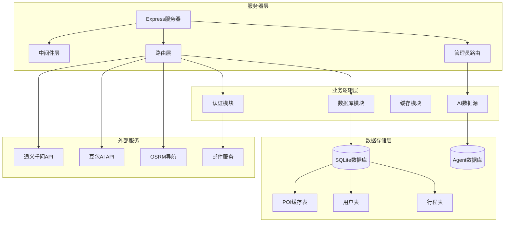

**图表来源**
- [server/index.ts:29-814](file://server/index.ts#L29-L814)
- [server/db.ts:1-513](file://server/db.ts#L1-L513)
- [agent/sources/ai.ts:1-365](file://agent/sources/ai.ts#L1-L365)
- [agent/sources/doubao.ts:1-200](file://agent/sources/doubao.ts#L1-L200)

**章节来源**
- [server/index.ts:1-814](file://server/index.ts#L1-L814)
- [package.json:1-59](file://package.json#L1-L59)

## 核心组件

### 服务器初始化与配置

Express服务器在启动时进行以下关键配置：

1. **环境变量加载**：通过dotenv从`.env.local`文件加载配置
2. **端口配置**：支持PORT和API_PORT环境变量
3. **中间件配置**：启用CORS和JSON解析器
4. **静态文件服务**：提供生产环境的静态资源

### 数据库初始化

服务器使用better-sqlite3作为ORM，支持多种部署环境：

- **Vercel环境**：使用/tmp目录作为临时存储
- **Railway环境**：支持/data/aitrip持久化目录
- **本地开发**：使用项目内的server/data目录

### 缓存策略

实现了三层缓存机制：
- **新鲜缓存**：15天内有效
- **陈旧缓存**：15-30天内有效
- **过期缓存**：超过30天

**更新** 新增AI数据源支持，包括通义千问和豆包AI的智能数据采集和生成能力。

**章节来源**
- [server/index.ts:55-62](file://server/index.ts#L55-L62)
- [server/db.ts:18-27](file://server/db.ts#L18-L27)
- [server/index.ts:64-66](file://server/index.ts#L64-L66)

## 架构概览

该Express服务器采用分层架构设计，清晰分离关注点：

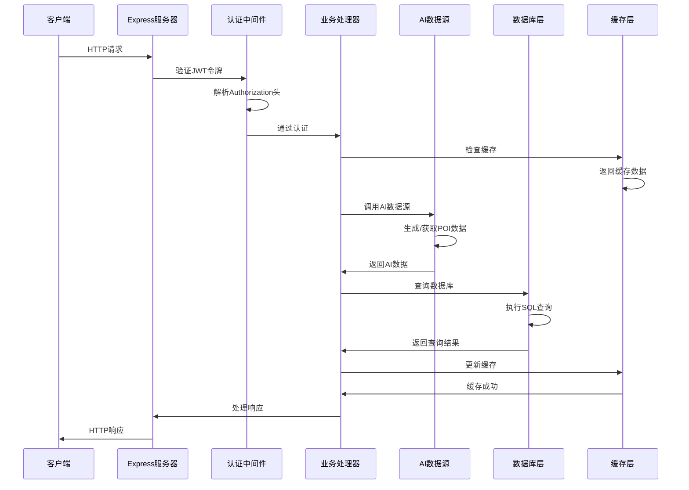

**图表来源**
- [server/index.ts:108-144](file://server/index.ts#L108-L144)
- [server/auth.ts:87-113](file://server/auth.ts#L87-L113)
- [agent/sources/ai.ts:269-365](file://agent/sources/ai.ts#L269-L365)

## 详细组件分析

### CORS配置

服务器使用默认的CORS配置，允许跨域请求：

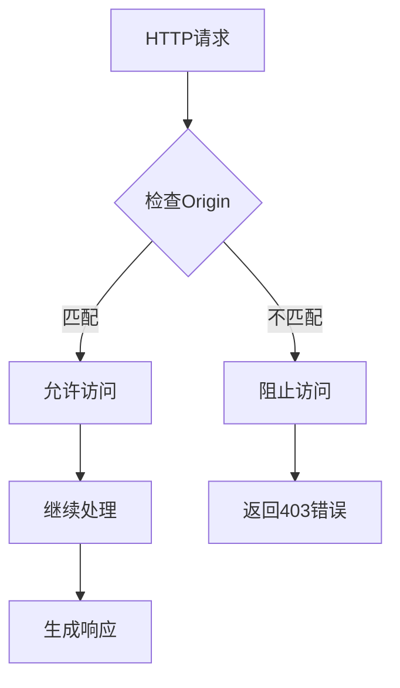

**图表来源**
- [server/index.ts:60-60](file://server/index.ts#L60-L60)

### JSON解析器设置

服务器配置了10MB的JSON解析限制：

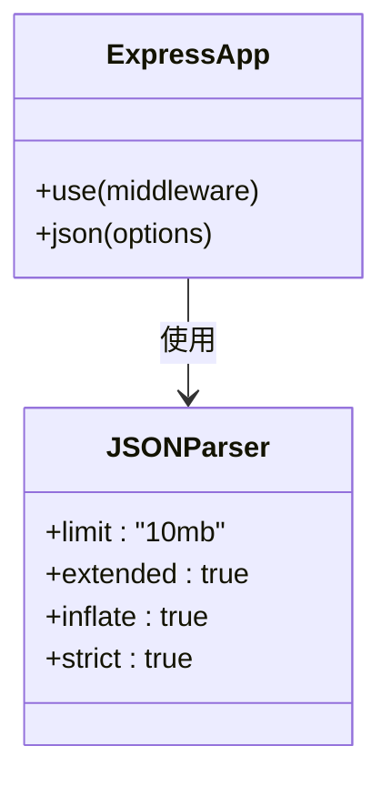

**图表来源**
- [server/index.ts:61-61](file://server/index.ts#L61-L61)

### 静态文件服务

生产环境配置了静态文件服务：

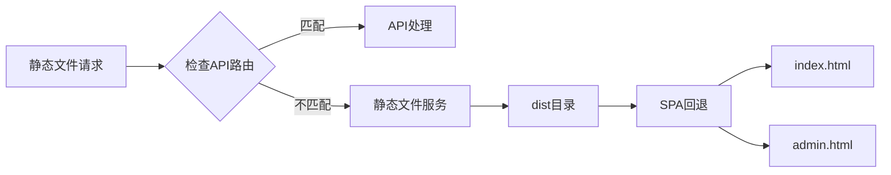

**图表来源**
- [server/index.ts:766-774](file://server/index.ts#L766-L774)

### 认证系统

实现了完整的JWT认证机制：

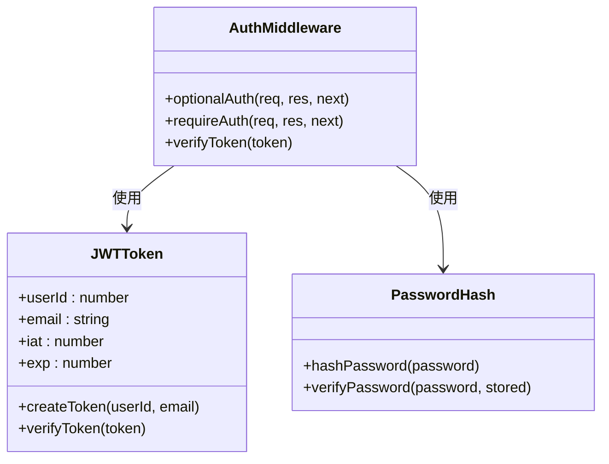

**图表来源**
- [server/auth.ts:87-113](file://server/auth.ts#L87-L113)
- [server/auth.ts:47-81](file://server/auth.ts#L47-L81)

### 数据库管理

使用better-sqlite3实现数据持久化：

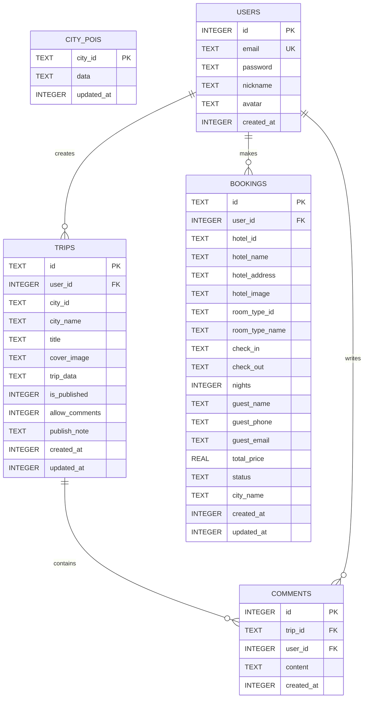

**图表来源**
- [server/db.ts:47-144](file://server/db.ts#L47-L144)

**章节来源**
- [server/auth.ts:1-133](file://server/auth.ts#L1-L133)
- [server/db.ts:1-513](file://server/db.ts#L1-L513)

### API路由组织

服务器提供了丰富的API端点：

#### POI相关路由
- `GET /api/pois/:cityId` - 获取城市POI列表
- `POST /api/pois/:cityId/refresh` - 强制刷新POI数据

#### 旅行行程路由
- `GET/POST/PUT/DELETE /api/trips` - 行程管理
- `POST /api/trips/:id/publish` - 发布为游记
- `GET /api/trips/:id/micro-notes` - 微游记管理

#### 用户认证路由
- `POST /api/auth/register` - 用户注册
- `POST /api/auth/login` - 用户登录
- `GET /api/auth/me` - 获取当前用户信息

#### 评论系统路由
- `GET/POST/DELETE /api/notes/:id/comments` - 评论管理

**更新** 新增AI数据源支持，包括通义千问和豆包AI的智能数据采集和生成能力。

**章节来源**
- [server/index.ts:108-757](file://server/index.ts#L108-L757)

## AI数据源集成

### 通义千问数据源

实现了基于阿里云DashScope的AI数据采集器：

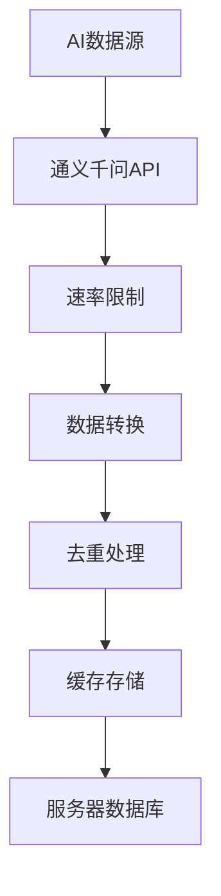

**图表来源**
- [agent/sources/ai.ts:121-187](file://agent/sources/ai.ts#L121-L187)
- [agent/sources/ai.ts:269-365](file://agent/sources/ai.ts#L269-L365)

### 豆包AI数据源

实现了基于火山引擎的AI数据采集器：

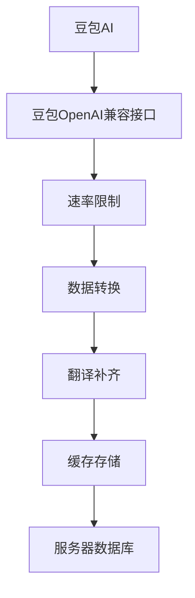

**图表来源**
- [agent/sources/doubao.ts:31-100](file://agent/sources/doubao.ts#L31-L100)
- [agent/sources/doubao.ts:104-199](file://agent/sources/doubao.ts#L104-L199)

### AI数据采集流程

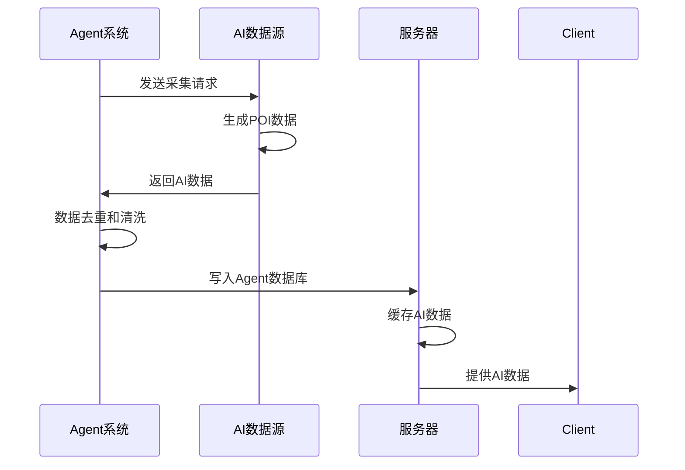

**图表来源**
- [agent/sources/ai.ts:276-363](file://agent/sources/ai.ts#L276-L363)
- [agent/sources/doubao.ts:111-198](file://agent/sources/doubao.ts#L111-L198)

**章节来源**
- [agent/sources/ai.ts:1-365](file://agent/sources/ai.ts#L1-L365)
- [agent/sources/doubao.ts:1-200](file://agent/sources/doubao.ts#L1-L200)

## 管理员路由增强

管理员面板提供了完整的数据管理功能：

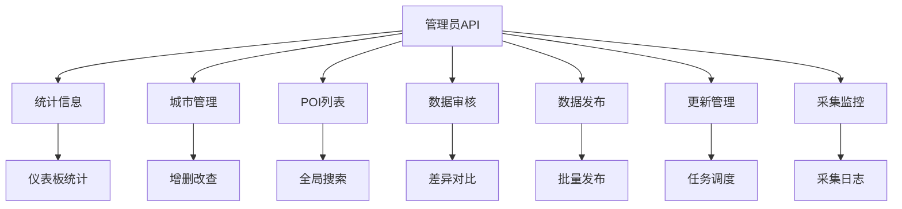

**图表来源**
- [server/admin-routes.ts:1-1756](file://server/admin-routes.ts#L1-L1756)

### 数据管理功能

管理员路由提供了以下核心功能：

1. **统计信息**：展示数据质量、更新频率等关键指标
2. **城市管理**：增删改查城市信息，管理城市坐标
3. **POI管理**：POI列表查看、搜索、分类筛选
4. **数据审核**：对比Agent数据和Server数据，支持差异对比
5. **数据发布**：支持批量发布、按评分发布等多种发布策略
6. **更新管理**：任务调度、进度监控、错误处理
7. **采集监控**：采集日志、批次管理、数据质量监控

### 发布流程

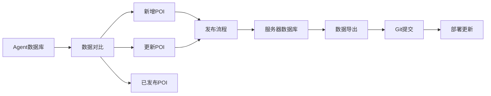

**图表来源**
- [server/admin-routes.ts:1088-1172](file://server/admin-routes.ts#L1088-L1172)
- [server/admin-routes.ts:1174-1213](file://server/admin-routes.ts#L1174-L1213)

**章节来源**
- [server/admin-routes.ts:1-1756](file://server/admin-routes.ts#L1-L1756)

## 依赖关系分析

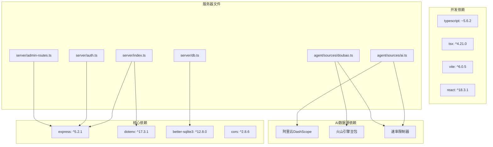

**图表来源**
- [package.json:26-57](file://package.json#L26-L57)

**章节来源**
- [package.json:1-59](file://package.json#L1-L59)

## 性能考虑

### 缓存优化策略

1. **智能缓存刷新**：后台异步刷新过期数据，避免Nginx超时
2. **缓存年龄监控**：实时跟踪缓存数据的新鲜度
3. **去重处理**：对缓存数据进行去重，提高数据质量

### 数据库优化

1. **WAL模式**：使用Write-Ahead Logging提高并发性能
2. **外键约束**：确保数据完整性
3. **索引策略**：合理使用索引提升查询性能

### AI数据源优化

1. **速率限制**：控制API调用频率，避免触发限流
2. **批量处理**：支持批量数据处理，提高效率
3. **错误恢复**：实现自动重试和降级机制
4. **模型降级**：根据使用情况自动选择合适的AI模型

### 部署优化

1. **多环境支持**：支持Vercel Serverless和传统部署
2. **环境变量配置**：灵活的配置管理
3. **静态资源优化**：生产环境的静态文件服务

## 故障排除指南

### 常见问题及解决方案

#### 数据库连接问题
- **症状**：启动时数据库初始化失败
- **原因**：权限不足或路径不存在
- **解决**：检查DB_DIR环境变量和目录权限

#### API密钥配置问题
- **症状**：POI数据获取失败
- **原因**：ARK_API_KEY未配置
- **解决**：在.env.local中设置API密钥

#### 认证失败问题
- **症状**：JWT令牌验证失败
- **原因**：JWT_SECRET配置错误
- **解决**：检查JWT_SECRET环境变量

#### 静态文件服务问题
- **症状**：SPA路由返回404
- **原因**：静态文件路径配置错误
- **解决**：检查distPath配置

#### AI数据源问题
- **症状**：AI数据采集失败
- **原因**：API密钥配置错误或网络问题
- **解决**：检查AI数据源配置和网络连接

#### 管理员路由问题
- **症状**：管理员面板功能异常
- **原因**：Agent数据库未初始化或权限不足
- **解决**：运行`npm run agent:init-db`初始化数据库

**章节来源**
- [server/db.ts:37-44](file://server/db.ts#L37-L44)
- [server/index.ts:755-757](file://server/index.ts#L755-L757)
- [server/auth.ts:10-11](file://server/auth.ts#L10-L11)

## 结论

该Express服务器配置展现了现代Web应用的最佳实践：

1. **模块化设计**：清晰的分层架构便于维护和扩展
2. **性能优化**：智能缓存和数据库优化策略
3. **安全考虑**：完整的认证授权机制
4. **AI集成**：先进的AI数据源支持，提供智能化的数据采集能力
5. **管理功能**：完善的管理员路由，支持数据管理和发布流程
6. **部署灵活性**：支持多种部署方式
7. **可维护性**：良好的代码组织和文档

通过合理的配置和优化，该服务器能够稳定支持行程规划应用的各种需求，并为未来的功能扩展奠定了坚实基础。新增的AI数据源支持和管理员路由增强了系统的智能化水平和管理能力，为用户提供更好的服务体验。