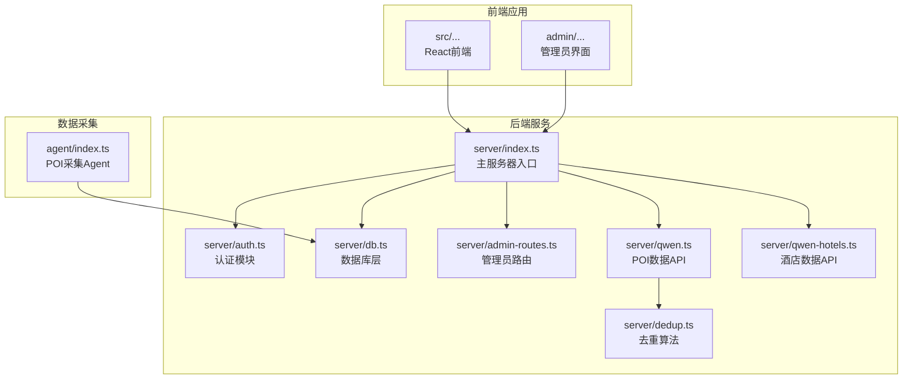
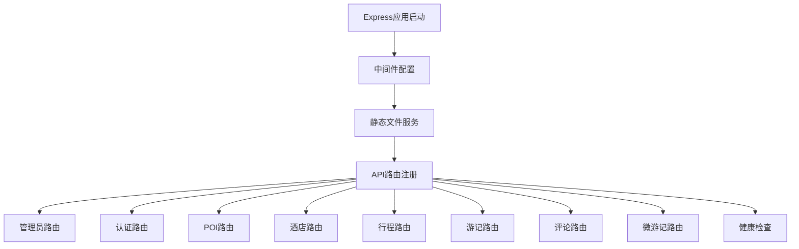
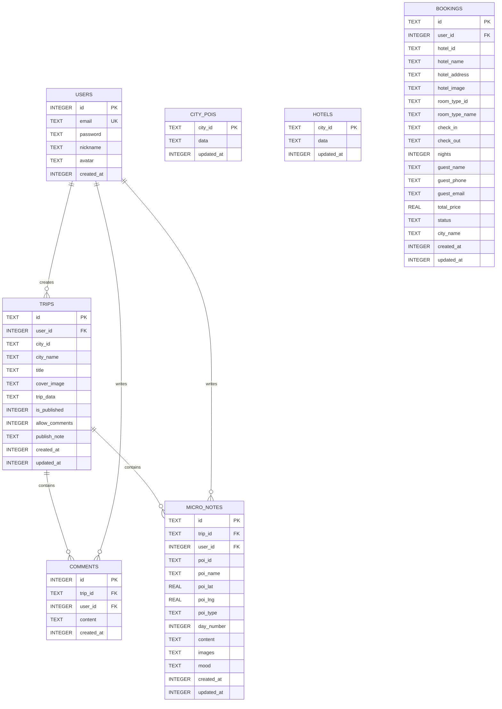
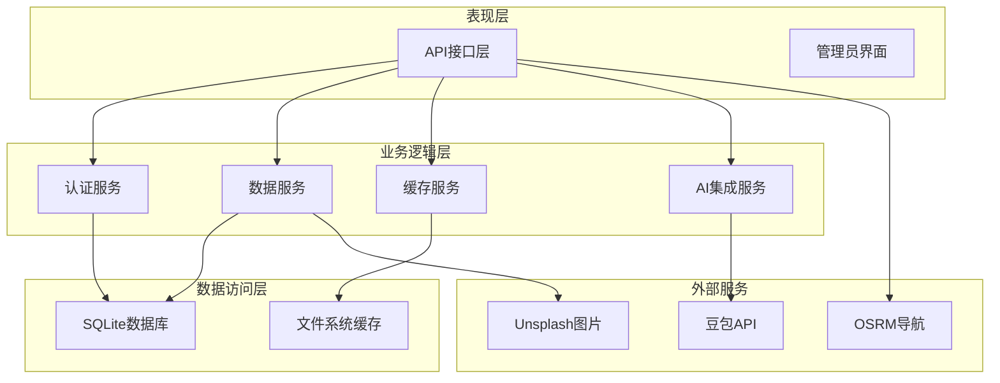
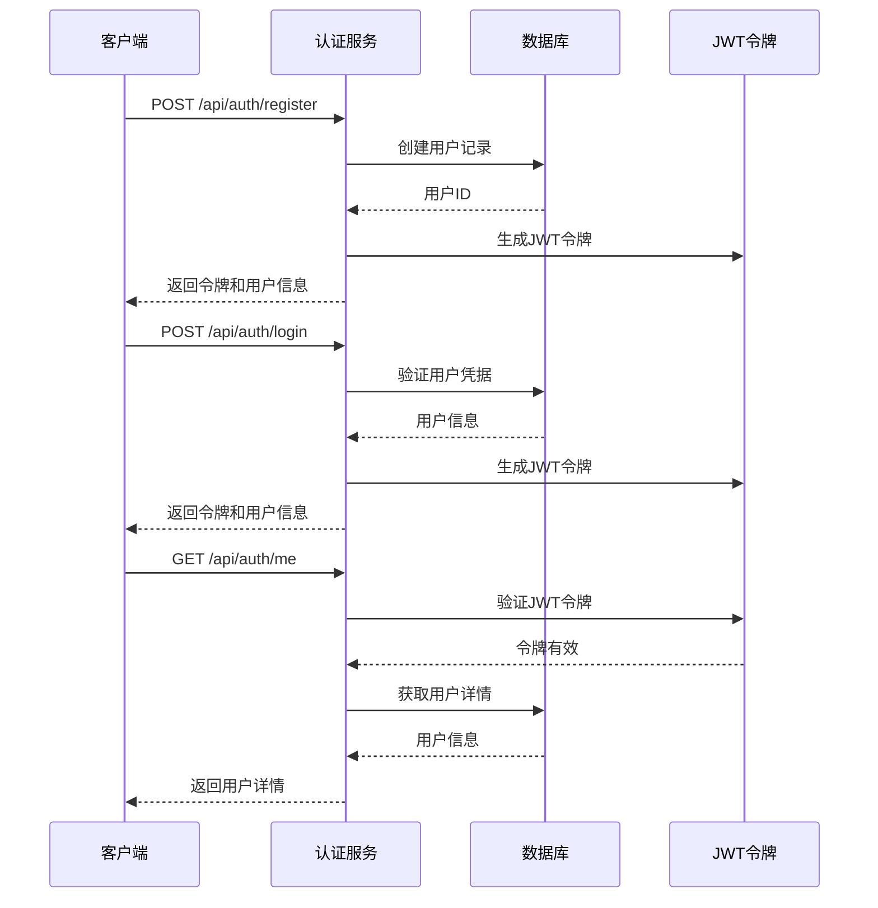
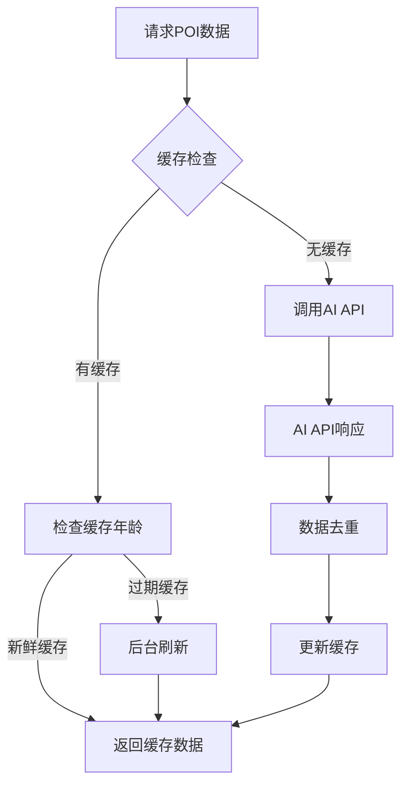
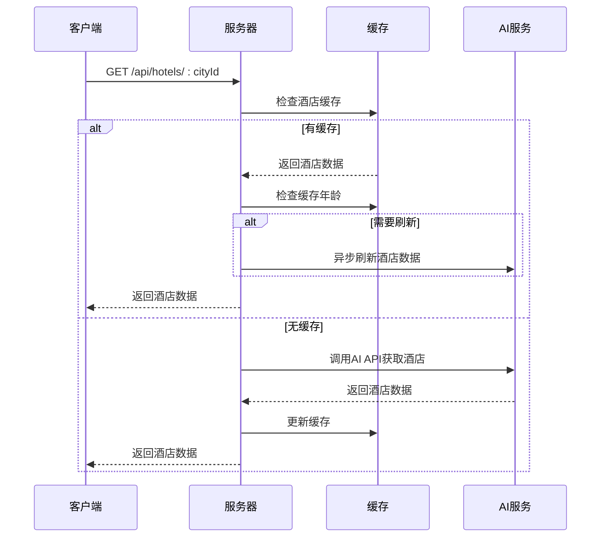
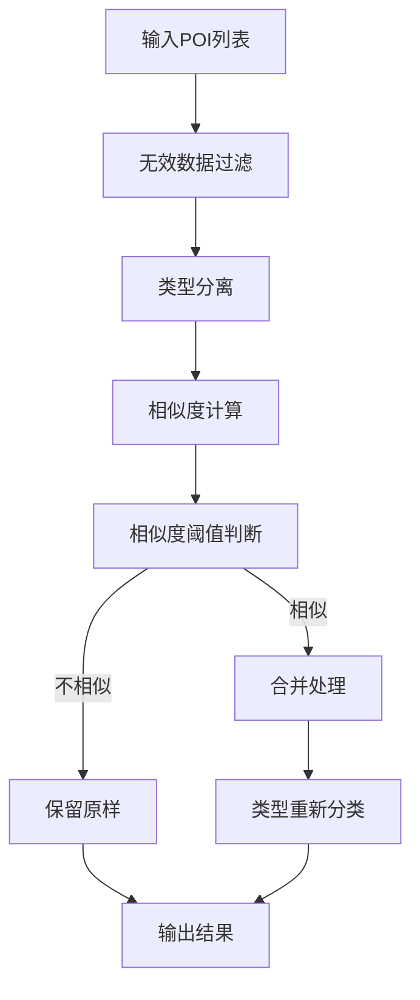
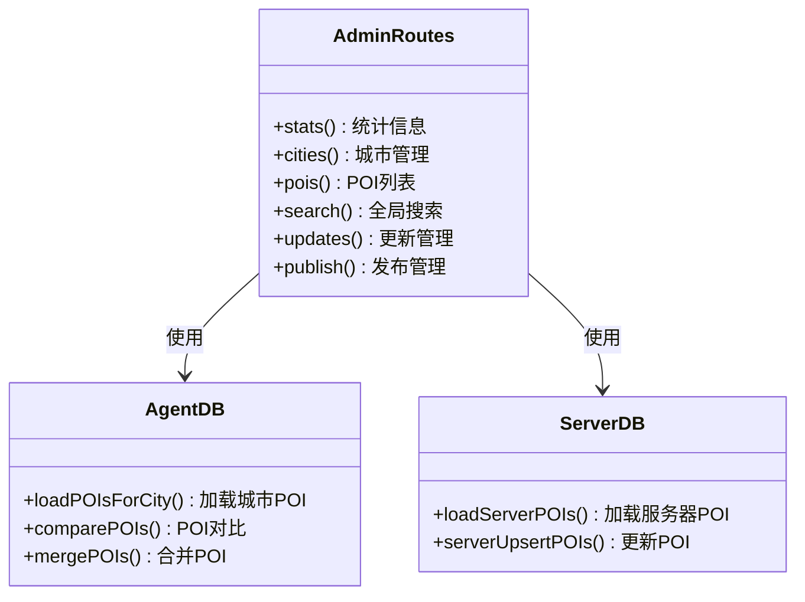
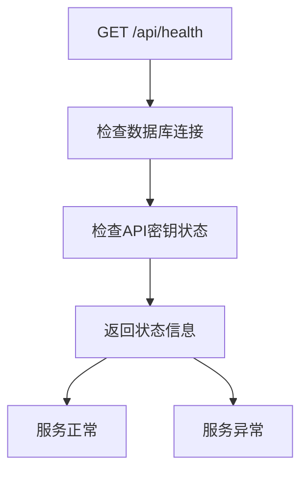

# 后端API架构

<cite>
**本文档引用的文件**
- [server/index.ts](file://server/index.ts)
- [server/auth.ts](file://server/auth.ts)
- [server/db.ts](file://server/db.ts)
- [server/admin-routes.ts](file://server/admin-routes.ts)
- [server/qwen.ts](file://server/qwen.ts)
- [server/qwen-hotels.ts](file://server/qwen-hotels.ts)
- [server/dedup.ts](file://server/dedup.ts)
- [agent/index.ts](file://agent/index.ts)
- [package.json](file://package.json)
</cite>

## 目录
1. [引言](#引言)
2. [项目结构](#项目结构)
3. [核心组件](#核心组件)
4. [架构概览](#架构概览)
5. [详细组件分析](#详细组件分析)
6. [依赖分析](#依赖分析)
7. [性能考虑](#性能考虑)
8. [故障排除指南](#故障排除指南)
9. [结论](#结论)
10. [附录](#附录)

## 引言

这是一个基于Express.js构建的旅行规划Demo后端API架构。系统采用Node.js + TypeScript + Express + SQLite的技术栈，提供了完整的旅行规划服务，包括POI数据管理、用户认证、行程规划、游记分享等功能。

系统的核心特点包括：
- **多层缓存策略**：实现POI数据的高效缓存和自动刷新
- **AI驱动的数据生成**：通过豆包（Doubao）API生成高质量的旅游数据
- **完整的用户管理体系**：支持用户注册、登录、权限验证
- **丰富的旅行相关功能**：包括行程规划、酒店预订、游记分享等
- **管理员后台系统**：提供POI数据管理和审核功能

## 项目结构



**图表来源**
- [server/index.ts:1-790](file://server/index.ts#L1-L790)
- [agent/index.ts:1-800](file://agent/index.ts#L1-L800)

**章节来源**
- [server/index.ts:1-790](file://server/index.ts#L1-L790)
- [package.json:1-59](file://package.json#L1-L59)

## 核心组件

### Express服务器架构

系统基于Express框架构建，采用模块化的路由组织方式：



**图表来源**
- [server/index.ts:106-790](file://server/index.ts#L106-L790)

### 数据库设计

系统使用SQLite作为主要数据存储，采用better-sqlite3库进行数据库操作：



**图表来源**
- [server/db.ts:46-147](file://server/db.ts#L46-L147)

**章节来源**
- [server/db.ts:1-513](file://server/db.ts#L1-L513)

## 架构概览

系统采用分层架构设计，各层职责清晰分离：



**图表来源**
- [server/index.ts:29-53](file://server/index.ts#L29-L53)
- [server/qwen.ts:10-11](file://server/qwen.ts#L10-L11)

## 详细组件分析

### 认证与授权机制

系统实现了完整的用户认证和授权体系：



**图表来源**
- [server/auth.ts:19-113](file://server/auth.ts#L19-L113)
- [server/index.ts:318-367](file://server/index.ts#L318-L367)

#### 认证中间件设计

系统提供了两种认证中间件：
- `optionalAuth`: 可选认证，允许匿名访问
- `requireAuth`: 必须认证，未认证时返回401错误

**章节来源**
- [server/auth.ts:87-113](file://server/auth.ts#L87-L113)
- [server/index.ts:318-410](file://server/index.ts#L318-L410)

### POI数据管理系统

系统实现了智能的POI数据管理，包含多层缓存策略：



**图表来源**
- [server/index.ts:108-144](file://server/index.ts#L108-L144)
- [server/qwen.ts:361-485](file://server/qwen.ts#L361-L485)

#### 缓存策略

系统采用三层缓存机制：
- **即时缓存**: 15天新鲜期，过期后立即返回旧数据并异步刷新
- **陈旧缓存**: 30天陈旧期，用于判断是否需要刷新
- **AI生成缓存**: 无缓存时立即返回生成状态，避免超时

**章节来源**
- [server/index.ts:64-100](file://server/index.ts#L64-L100)
- [server/index.ts:108-160](file://server/index.ts#L108-L160)

### 酒店数据管理

酒店数据同样采用缓存策略，支持独立的刷新机制：



**图表来源**
- [server/index.ts:186-212](file://server/index.ts#L186-L212)
- [server/qwen-hotels.ts:208-283](file://server/qwen-hotels.ts#L208-L283)

**章节来源**
- [server/index.ts:162-212](file://server/index.ts#L162-L212)
- [server/qwen-hotels.ts:1-284](file://server/qwen-hotels.ts#L1-284)

### 去重算法系统

系统实现了复杂的POI去重算法，解决AI生成数据中的重复问题：



**图表来源**
- [server/dedup.ts:587-752](file://server/dedup.ts#L587-L752)

#### 去重算法特性

- **多维度相似度计算**: 名称相似度、内容相似度、地理位置相似度
- **跨类型保护**: scenic和activity类型间的严格去重规则
- **内容验证**: 通过费用、标签、时长等维度验证内容一致性
- **Union-Find算法**: 处理传递性重复关系

**章节来源**
- [server/dedup.ts:27-753](file://server/dedup.ts#L27-L753)

### 管理员后台系统

管理员系统提供了完整的POI数据管理功能：



**图表来源**
- [server/admin-routes.ts:27-66](file://server/admin-routes.ts#L27-L66)

**章节来源**
- [server/admin-routes.ts:1-800](file://server/admin-routes.ts#L1-L800)

## 依赖分析

系统的主要依赖关系如下：

```mermaid
graph LR
subgraph "运行时依赖"
A[express] --> B[中间件支持]
C[better-sqlite3] --> D[SQLite数据库]
E[cors] --> F[跨域支持]
G[dotenv] --> H[环境变量]
end
subgraph "开发依赖"
I[typescript] --> J[类型检查]
K[@types/express] --> L[类型定义]
M[tsx] --> N[TypeScript运行]
end
subgraph "脚本命令"
O[server] --> P[启动服务器]
Q[agent:collect] --> R[采集POI数据]
S[agent:export] --> T[导出数据]
end
```

**图表来源**
- [package.json:26-57](file://package.json#L26-L57)

**章节来源**
- [package.json:1-59](file://package.json#L1-L59)

## 性能考虑

### 缓存策略优化

系统采用了多层次的缓存策略来提升性能：

1. **内存缓存**: 使用JavaScript Set跟踪正在刷新的城市，避免重复请求
2. **数据库缓存**: SQLite存储POI和酒店数据，支持快速查询
3. **异步刷新**: 缓存过期时后台异步刷新，避免阻塞用户请求

### 数据库优化

- **WAL模式**: 使用SQLite的WAL模式提升并发性能
- **索引优化**: 关键查询字段建立适当的索引
- **连接池**: better-sqlite3内置连接池管理

### API性能监控

系统提供了健康检查端点用于监控服务状态：



**图表来源**
- [server/index.ts:755-757](file://server/index.ts#L755-L757)

## 故障排除指南

### 常见问题及解决方案

#### 1. API密钥配置问题

**症状**: 请求POI数据时返回"NO_API_KEY"错误
**原因**: 未配置豆包API密钥
**解决方案**: 设置环境变量`ARK_API_KEY`

#### 2. 数据库连接问题

**症状**: 服务器启动时报数据库连接错误
**原因**: 数据库文件权限问题或路径不存在
**解决方案**: 检查数据库目录权限和路径配置

#### 3. 缓存数据过期

**症状**: POI数据长时间未更新
**原因**: 缓存策略导致的数据延迟
**解决方案**: 调用`/api/pois/:cityId/refresh`强制刷新

#### 4. AI API调用失败

**症状**: 酒店或POI数据获取失败
**原因**: 外部API限流或网络问题
**解决方案**: 检查网络连接和API配额

**章节来源**
- [server/index.ts:128-142](file://server/index.ts#L128-L142)
- [server/qwen.ts:400-411](file://server/qwen.ts#L400-L411)

## 结论

这个旅行规划Demo后端API架构展现了现代Web应用的最佳实践：

1. **模块化设计**: 清晰的分层架构和职责分离
2. **高性能缓存**: 多层次缓存策略确保响应速度
3. **AI集成**: 通过豆包API实现智能化数据生成
4. **完整功能**: 覆盖旅行规划的各个方面
5. **可扩展性**: 良好的架构设计便于功能扩展

系统为旅行相关的Web应用提供了一个完整的后端解决方案，展示了如何将AI技术、缓存策略和现代化的Web架构有机结合。

## 附录

### API端点参考

系统提供以下主要API端点：

#### 认证相关
- `POST /api/auth/register` - 用户注册
- `POST /api/auth/login` - 用户登录  
- `GET /api/auth/me` - 获取当前用户信息
- `POST /api/auth/send-code` - 发送验证码
- `POST /api/auth/reset-password` - 重置密码

#### POI数据相关
- `GET /api/pois/:cityId` - 获取城市POI数据
- `POST /api/pois/:cityId/refresh` - 强制刷新POI数据
- `GET /api/hotels/:cityId` - 获取酒店数据

#### 行程管理相关
- `GET /api/trips` - 获取用户行程列表
- `POST /api/trips` - 创建新行程
- `GET /api/trips/:id` - 获取特定行程
- `PUT /api/trips/:id` - 更新行程
- `DELETE /api/trips/:id` - 删除行程

#### 游记分享相关
- `GET /api/notes` - 获取公开游记列表
- `GET /api/notes/:id` - 获取特定游记
- `POST /api/trips/:id/publish` - 发布为游记
- `POST /api/trips/:id/unpublish` - 取消发布

#### 评论系统相关
- `GET /api/notes/:id/comments` - 获取评论列表
- `POST /api/notes/:id/comments` - 添加评论
- `DELETE /api/notes/:id/comments/:cid` - 删除评论

**章节来源**
- [server/index.ts:5-27](file://server/index.ts#L5-L27)