# 数据库层设计

<cite>
**本文档引用的文件**
- [server/db.ts](file://server/db.ts)
- [server/qwen-hotels.ts](file://server/qwen-hotels.ts)
- [agent/db.ts](file://agent/db.ts)
- [agent/categories.ts](file://agent/categories.ts)
- [agent/quality.ts](file://agent/quality.ts)
- [agent/init-db.ts](file://agent/init-db.ts)
- [scripts/migrate-season-pk.js](file://scripts/migrate-season-pk.js)
- [server/admin-routes.ts](file://server/admin-routes.ts)
- [agent/index.ts](file://agent/index.ts)
- [src/pages/HotelStepPage.tsx](file://src/pages/HotelStepPage.tsx)
- [miniprogram/src/pages/hotel-detail/index.tsx](file://miniprogram/src/pages/hotel-detail/index.tsx)
- [src/types/index.ts](file://src/types/index.ts)
</cite>

## 更新摘要
**变更内容**
- 新增酒店设施智能推断功能，基于星级、分类和标签自动推断酒店设施
- 扩展 HotelPOI 类型定义，支持 amenities 字段
- 增强酒店数据处理逻辑，提供更丰富的设施信息展示
- 优化酒店数据格式兼容性处理机制

## 目录
1. [简介](#简介)
2. [项目结构](#项目结构)
3. [核心组件](#核心组件)
4. [架构总览](#架构总览)
5. [详细组件分析](#详细组件分析)
6. [依赖关系分析](#依赖关系分析)
7. [性能考量](#性能考量)
8. [故障排查指南](#故障排查指南)
9. [结论](#结论)
10. [附录](#附录)

## 简介
本文件系统性梳理了本项目的数据库层设计，重点涵盖以下方面：
- SQLite 与 better-sqlite3 的集成与连接管理
- 数据表结构设计、索引策略与查询优化
- 数据访问层实现（CRUD、事务与并发控制）
- 缓存策略、数据同步与备份恢复机制
- 数据库迁移脚本与性能监控方案
- **新增**：酒店设施智能推断功能，基于星级、分类和标签自动推断酒店设施

项目包含两套独立的 SQLite 数据库：
- 服务端数据库（pois.db）：存放用户、行程、评论、验证码、酒店缓存等业务数据
- Agent 本地数据库（agent.db）：存放采集数据、日志、刷新周期、待确认更新等

两者均采用 better-sqlite3 作为驱动，并通过 WAL 日志模式提升并发写入性能。

## 项目结构
数据库相关文件分布如下：
- 服务端数据库层：server/db.ts
- 服务端酒店数据处理：server/qwen-hotels.ts
- Agent 本地数据库层：agent/db.ts
- Agent 类目定义：agent/categories.ts
- Agent 质量评估：agent/quality.ts
- Agent 初始化脚本：agent/init-db.ts
- 数据库迁移脚本：scripts/migrate-season-pk.js
- 管理后台路由（统计与对比）：server/admin-routes.ts
- Agent 主流程入口（调度与刷新）：agent/index.ts
- 酒店设施推断逻辑：server/db.ts 中的 inferAmenities 函数
- 酒店页面组件：src/pages/HotelStepPage.tsx
- 小程序酒店详情页：miniprogram/src/pages/hotel-detail/index.tsx
- 类型定义：src/types/index.ts

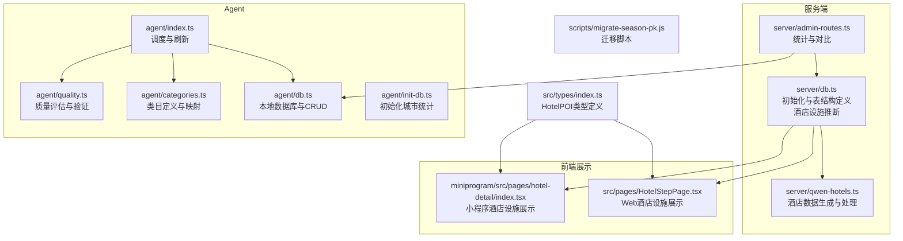

**图表来源**
- [server/db.ts:37-147](file://server/db.ts#L37-L147)
- [server/db.ts:459-485](file://server/db.ts#L459-L485)
- [server/qwen-hotels.ts:1-284](file://server/qwen-hotels.ts#L1-L284)
- [agent/db.ts:19-32](file://agent/db.ts#L19-L32)
- [agent/categories.ts:16-30](file://agent/categories.ts#L16-L30)
- [agent/quality.ts:69-72](file://agent/quality.ts#L69-L72)
- [agent/init-db.ts:10-16](file://agent/init-db.ts#L10-L16)
- [scripts/migrate-season-pk.js:23-26](file://scripts/migrate-season-pk.js#L23-L26)
- [server/admin-routes.ts:444-482](file://server/admin-routes.ts#L444-L482)
- [agent/index.ts:653-676](file://agent/index.ts#L653-L676)
- [src/pages/HotelStepPage.tsx:1139-1355](file://src/pages/HotelStepPage.tsx#L1139-L1355)
- [miniprogram/src/pages/hotel-detail/index.tsx:61-98](file://miniprogram/src/pages/hotel-detail/index.tsx#L61-L98)
- [src/types/index.ts:14-34](file://src/types/index.ts#L14-L34)

**章节来源**
- [server/db.ts:1-147](file://server/db.ts#L1-L147)
- [server/db.ts:459-485](file://server/db.ts#L459-L485)
- [server/qwen-hotels.ts:1-284](file://server/qwen-hotels.ts#L1-L284)
- [agent/db.ts:1-32](file://agent/db.ts#L1-L32)
- [agent/categories.ts:1-374](file://agent/categories.ts#L1-L374)
- [agent/quality.ts:60-150](file://agent/quality.ts#L60-L150)
- [agent/init-db.ts:1-41](file://agent/init-db.ts#L1-L41)
- [scripts/migrate-season-pk.js:1-125](file://scripts/migrate-season-pk.js#L1-L125)
- [server/admin-routes.ts:444-482](file://server/admin-routes.ts#L444-L482)
- [agent/index.ts:653-676](file://agent/index.ts#L653-L676)
- [src/pages/HotelStepPage.tsx:1139-1355](file://src/pages/HotelStepPage.tsx#L1139-L1355)
- [miniprogram/src/pages/hotel-detail/index.tsx:61-98](file://miniprogram/src/pages/hotel-detail/index.tsx#L61-L98)
- [src/types/index.ts:14-34](file://src/types/index.ts#L14-L34)

## 核心组件
- 服务端数据库（pois.db）
  - 初始化与连接管理：统一在模块级创建连接，设置 WAL 与外键约束
  - 表结构：city_pois、users、trips、comments、verify_codes、hotels、bookings
  - 数据访问层：POI 缓存、用户、行程、评论、验证码、酒店缓存、预订等 CRUD
  - **新增**：酒店设施智能推断，基于星级、分类和标签自动推断设施列表
  - **增强**：酒店数据格式兼容性处理，支持 categoryL1=hotel 和 type=hotel 两种格式
- Agent 本地数据库（agent.db）
  - 初始化与连接管理：按配置路径创建目录与连接，设置 WAL 与外键约束
  - 表结构：city_pois、collection_logs、refresh_cycles、raw_pois、pending_updates、city_stats
  - 数据访问层：POI 缓存、采集日志、刷新周期、原始采集数据、待确认更新、城市统计
- **新增**：Agent 类目系统，支持六大一级类目（含酒店）
- **新增**：酒店设施推断逻辑，支持 Wi-Fi、停车场、泳池、健身房等设施的智能推断
- **新增**：HotelPOI 类型定义，扩展 amenities 字段支持

**章节来源**
- [server/db.ts:37-147](file://server/db.ts#L37-L147)
- [server/db.ts:440-476](file://server/db.ts#L440-L476)
- [server/db.ts:459-485](file://server/db.ts#L459-L485)
- [agent/db.ts:19-32](file://agent/db.ts#L19-L32)
- [agent/db.ts:34-131](file://agent/db.ts#L34-L131)
- [agent/categories.ts:16-30](file://agent/categories.ts#L16-L30)
- [server/qwen-hotels.ts:142-184](file://server/qwen-hotels.ts#L142-L184)
- [src/types/index.ts:14-34](file://src/types/index.ts#L14-L34)

## 架构总览
服务端与 Agent 各自维护独立数据库，通过管理后台进行数据对比与同步。Agent 负责采集与质量评估，服务端负责用户与业务数据。**新增**的酒店设施智能推断功能为酒店数据提供更丰富的设施信息，提升用户体验。

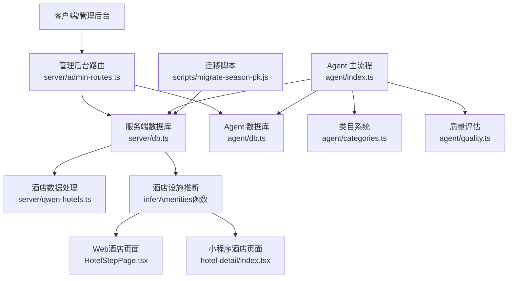

**图表来源**
- [server/admin-routes.ts:444-482](file://server/admin-routes.ts#L444-L482)
- [agent/index.ts:653-676](file://agent/index.ts#L653-L676)
- [scripts/migrate-season-pk.js:23-26](file://scripts/migrate-season-pk.js#L23-L26)
- [server/db.ts:440-476](file://server/db.ts#L440-L476)
- [server/db.ts:459-485](file://server/db.ts#L459-L485)
- [server/qwen-hotels.ts:142-184](file://server/qwen-hotels.ts#L142-L184)
- [src/pages/HotelStepPage.tsx:1139-1355](file://src/pages/HotelStepPage.tsx#L1139-L1355)
- [miniprogram/src/pages/hotel-detail/index.tsx:61-98](file://miniprogram/src/pages/hotel-detail/index.tsx#L61-L98)

## 详细组件分析

### 服务端数据库（pois.db）
- 连接与初始化
  - 依据环境变量与持久化目录确定数据库路径，自动创建目录
  - 设置 journal_mode=WAL 与 foreign_keys=ON
  - 定义并创建业务表（city_pois、users、trips、comments、verify_codes、hotels、bookings）
- 数据访问层
  - POI 缓存：upsertPOIs、getCachedPOIs、getCacheAge
  - 用户：createUser、getUserByEmail、getUserById、updateUserPassword、updateUserNickname
  - 行程：saveTrip、getUserTrips、getTripById、publish/unpublish、toggleComments、deleteTrip
  - 评论：addComment、getComments、deleteComment
  - 验证码：saveVerifyCode、verifyCode
  - **增强**：酒店缓存：upsertHotels、getCachedHotels、getHotelCacheAge、getHotelFallbackFromPOIs
  - **新增**：酒店设施推断：parseStars、inferAmenities 函数
  - 预订：createBooking、getUserBookings、getBookingById、updateBookingStatus、cancelBooking
- **新增**：酒店设施智能推断机制
  - parseStars：解析星级信息，支持 hotel.comfort.fourstar、hotel.luxury.fivestar 等格式
  - inferAmenities：根据星级、分类和标签智能推断设施列表
  - 支持 Wi-Fi、停车场、泳池、健身房等设施的自动推断
  - 统一酒店数据结构，提取关键字段并进行星级解析
  - 提供酒店降级提取功能，当 hotels 表无缓存时从 city_pois 中提取

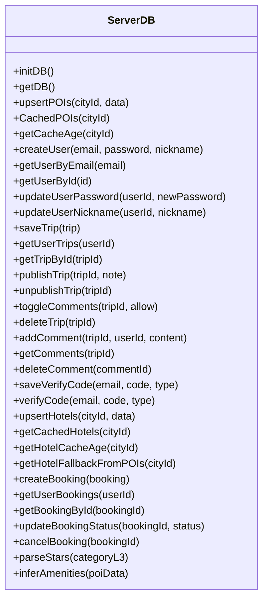

**图表来源**
- [server/db.ts:37-147](file://server/db.ts#L37-L147)
- [server/db.ts:440-476](file://server/db.ts#L440-L476)
- [server/db.ts:451-485](file://server/db.ts#L451-L485)
- [server/db.ts:487-505](file://server/db.ts#L487-L505)

**章节来源**
- [server/db.ts:37-147](file://server/db.ts#L37-L147)
- [server/db.ts:440-476](file://server/db.ts#L440-L476)
- [server/db.ts:451-485](file://server/db.ts#L451-L485)
- [server/db.ts:487-505](file://server/db.ts#L487-L505)

### Agent 本地数据库（agent.db）
- 连接与初始化
  - 从配置读取数据库路径，确保目录存在后创建连接
  - 设置 journal_mode=WAL 与 foreign_keys=ON
  - 初始化表结构（city_pois、collection_logs、refresh_cycles、raw_pois、pending_updates、city_stats）
- 数据访问层
  - POI 缓存：upsertPOIs、getCachedPOIs、getAllCityPOIs
  - 采集日志：logCollection
  - 城市统计：updateCityStats、getCityStats、getAllCityStats、getCityCount
  - 刷新周期：insertRefreshCycle、updateRefreshCycle、getLatestRefreshCycle、getRefreshHistory
  - 城市版本：incrementCityVersion、getCityVersion
  - 原始采集数据：saveRawPOIs、loadRawPOIs、loadRawPOIsBySource、getRawPOIsSummary
  - 待确认更新：upsertPendingUpdate、getPendingUpdates、getPendingUpdate、getPendingUpdateCount、deletePendingUpdate、applyPendingUpdate
- **新增**：类目系统支持酒店数据
  - 支持六大一级类目，其中酒店类目包含多个三级类目
  - 提供类目映射和转换功能
  - 支持外部数据源的类目映射

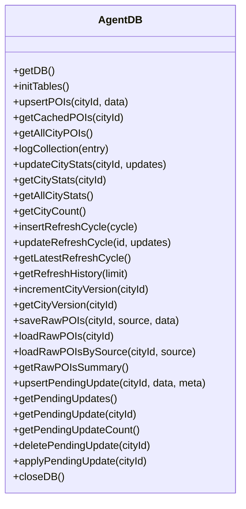

**图表来源**
- [agent/db.ts:19-32](file://agent/db.ts#L19-L32)
- [agent/db.ts:34-131](file://agent/db.ts#L34-L131)
- [agent/db.ts:135-155](file://agent/db.ts#L135-L155)
- [agent/db.ts:159-174](file://agent/db.ts#L159-L174)
- [agent/db.ts:178-232](file://agent/db.ts#L178-L232)
- [agent/db.ts:262-305](file://agent/db.ts#L262-L305)
- [agent/db.ts:309-321](file://agent/db.ts#L309-L321)
- [agent/db.ts:329-357](file://agent/db.ts#L329-L357)
- [agent/db.ts:379-448](file://agent/db.ts#L379-L448)
- [agent/db.ts:453-459](file://agent/db.ts#L453-L459)

**章节来源**
- [agent/db.ts:19-32](file://agent/db.ts#L19-L32)
- [agent/db.ts:34-131](file://agent/db.ts#L34-L131)
- [agent/db.ts:135-155](file://agent/db.ts#L135-L155)
- [agent/db.ts:159-174](file://agent/db.ts#L159-L174)
- [agent/db.ts:178-232](file://agent/db.ts#L178-L232)
- [agent/db.ts:262-305](file://agent/db.ts#L262-L305)
- [agent/db.ts:309-321](file://agent/db.ts#L309-L321)
- [agent/db.ts:329-357](file://agent/db.ts#L329-L357)
- [agent/db.ts:379-448](file://agent/db.ts#L379-L448)
- [agent/db.ts:453-459](file://agent/db.ts#L453-L459)

### 数据表结构与索引策略
- 服务端（pois.db）
  - city_pois：city_id 主键，JSON 存储 POI 列表，updated_at 记录更新时间
  - users：用户账户，email 唯一
  - trips：行程，user_id 外键
  - comments：评论，trip_id、user_id 外键
  - verify_codes：邮箱验证码
  - hotels：酒店缓存，city_id 主键，**新增**支持多种酒店数据格式和设施推断
  - bookings：预订，user_id 外键
- Agent（agent.db）
  - city_pois：city_id 主键，JSON 存储 POI 列表，updated_at，version 版本号
  - collection_logs：采集日志，复合索引（city_id, source）、created_at
  - refresh_cycles：刷新周期记录
  - raw_pois：原始采集数据，主键（city_id, source），索引 city_id
  - pending_updates：待确认更新
  - city_stats：城市统计

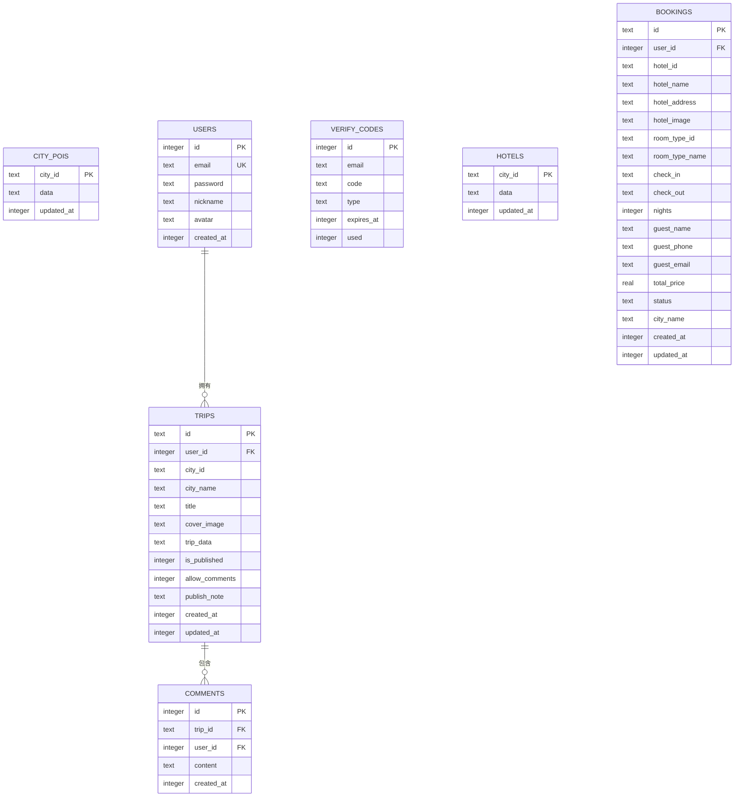

**图表来源**
- [server/db.ts:47-144](file://server/db.ts#L47-L144)

**章节来源**
- [server/db.ts:47-144](file://server/db.ts#L47-L144)

### 查询优化与并发控制
- 并发控制
  - WAL 模式：允许多个读事务与一个写事务并发，显著提升吞吐
  - 外键约束：foreign_keys=ON，保证参照完整性
- 查询优化
  - 使用 ON CONFLICT 子句进行 upsert，减少分支判断
  - JSON 字段存储复杂对象，避免频繁 JOIN
  - 为高频过滤字段建立索引（如 trips.user_id、comments.trip_id、collection_logs.created_at 等）
- **新增**：酒店设施推断优化
  - 使用 parseStars 函数提前解析星级信息，减少重复计算
  - inferAmenities 函数一次性推断所有设施，提高处理效率
  - 统一数据结构，减少转换开销
  - 支持 OR 条件过滤多种酒店数据格式

**章节来源**
- [server/db.ts:43-44](file://server/db.ts#L43-L44)
- [agent/db.ts:28-29](file://agent/db.ts#L28-L29)
- [agent/db.ts:59-66](file://agent/db.ts#L59-L66)
- [agent/db.ts:98-100](file://agent/db.ts#L98-L100)
- [server/db.ts:451-485](file://server/db.ts#L451-L485)

### 缓存策略、数据同步与备份恢复
- 缓存策略
  - 服务端与 Agent 均以 city_id 为主键缓存 JSON 数据，updated_at 记录缓存年龄
  - 酒店数据单独缓存表 hotels，便于独立更新与查询
  - **新增**：酒店设施推断缓存，星级解析结果和设施列表可重复利用
  - **新增**：酒店降级提取机制，当缓存为空时从 POI 数据中提取
- 数据同步
  - 管理后台对比 Agent 与服务端的 POI 数据，统计"待审核"城市数量与 POI 数量
  - Agent 支持将待确认更新应用到服务端缓存
- 备份与恢复
  - 通过导出/导入 JSON 文件实现数据备份与迁移
  - 提供迁移脚本对表结构进行演进（如将 city_pois 的主键从 (city_id, season) 改为 city_id）

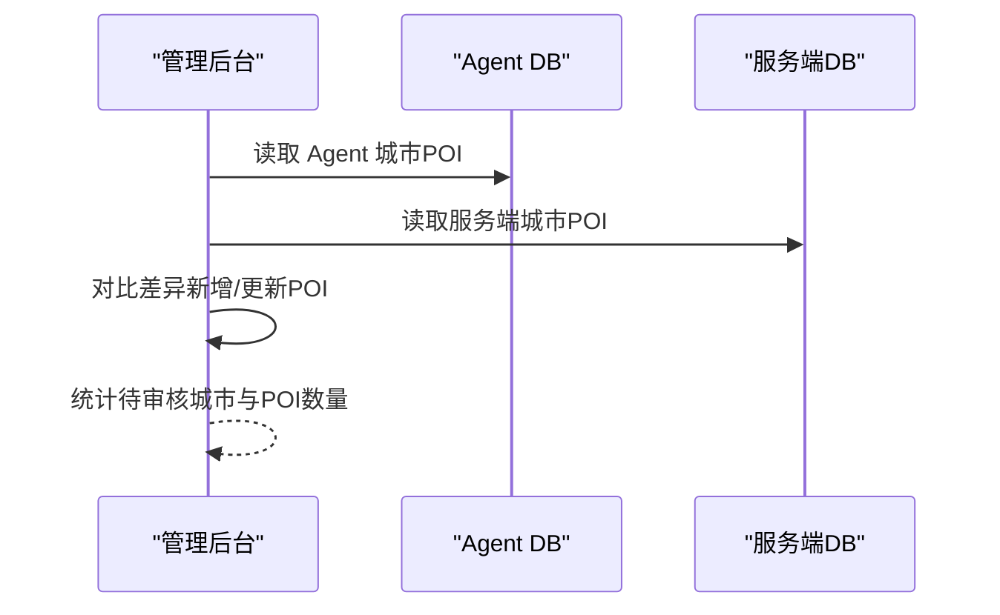

**图表来源**
- [server/admin-routes.ts:456-482](file://server/admin-routes.ts#L456-L482)

**章节来源**
- [server/admin-routes.ts:444-482](file://server/admin-routes.ts#L444-L482)
- [agent/db.ts:431-448](file://agent/db.ts#L431-L448)

### 数据库迁移脚本
- 目标：将 city_pois 表从 (city_id, season) 主键迁移到 city_id 单主键
- 步骤：检测旧结构、创建新表、合并同 city_id 的 POI、为 POI 补充季节评分字段、删除旧表并重命名新表
- 适用场景：表结构演进、字段废弃或合并

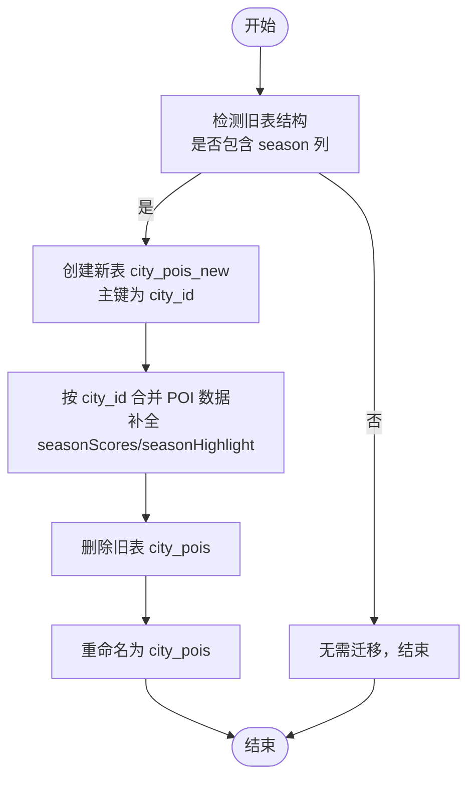

**图表来源**
- [scripts/migrate-season-pk.js:38-125](file://scripts/migrate-season-pk.js#L38-L125)

**章节来源**
- [scripts/migrate-season-pk.js:1-125](file://scripts/migrate-season-pk.js#L1-L125)

### 性能监控方案
- 缓存新鲜度统计：管理后台根据 last_collection_at 计算缓存年龄分布
- 城市覆盖率：统计 total 与 withPois 的数量差，识别未缓存城市
- 刷新周期跟踪：记录刷新类型、状态、结果，便于追踪性能与失败原因
- **新增**：酒店设施推断监控
  - 统计不同星级酒店的设施推断准确率
  - 监控 inferAmenities 函数的执行性能
  - 分析设施推断的覆盖率和用户反馈
- 建议指标：平均响应时间、QPS、WAL 文件大小、锁等待时间

**章节来源**
- [server/admin-routes.ts:444-482](file://server/admin-routes.ts#L444-L482)
- [agent/db.ts:254-305](file://agent/db.ts#L254-L305)

### **新增**：酒店设施智能推断功能

#### 推断算法设计
系统实现了智能的酒店设施推断算法，基于以下规则自动推断酒店设施：

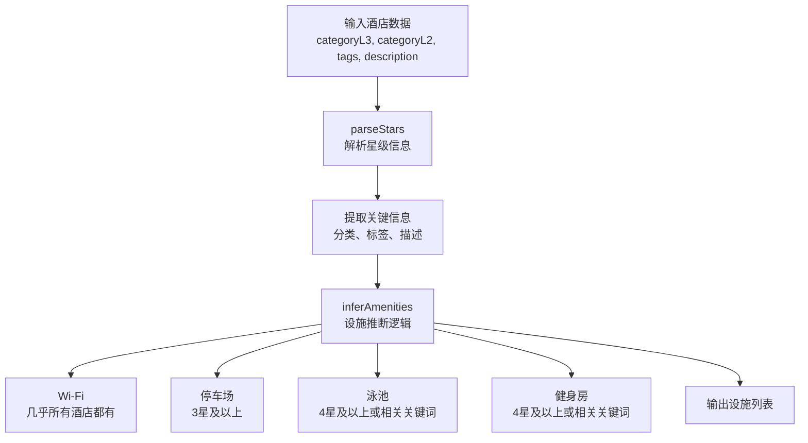

**图表来源**
- [server/db.ts:451-485](file://server/db.ts#L451-L485)

#### 推断规则详解
系统根据以下规则智能推断酒店设施：

1. **Wi-Fi（无线网络）**
   - 规则：几乎所有酒店都提供 Wi-Fi
   - 作用：作为基础设施，几乎总是包含在推断结果中

2. **停车场**
   - 规则：3星及以上酒店通常提供停车场
   - 依据：parseStars 函数解析的星级信息

3. **泳池**
   - 规则1：4星及以上酒店
   - 规则2：描述或标签中包含"泳池"、"游泳"、"pool"等关键词
   - 规则3：二级分类包含"luxury"（奢华类目）
   - 作用：高端酒店的标志性设施

4. **健身房**
   - 规则1：4星及以上酒店
   - 规则2：描述或标签中包含"健身"、"fitness"、"gym"等关键词
   - 作用：健康和健身设施

#### 设施推断实现
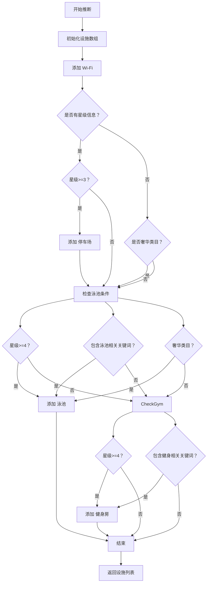

**图表来源**
- [server/db.ts:459-485](file://server/db.ts#L459-L485)

#### 星级解析机制
系统能够智能解析不同格式的星级信息：

- **新格式**：`hotel.comfort.fourstar` → 星级 4
- **奢华格式**：`hotel.luxury.fivestar` → 星级 5  
- **默认值**：无法解析时返回 undefined

#### 设施展示与图标映射
前端组件支持多种设施的可视化展示：

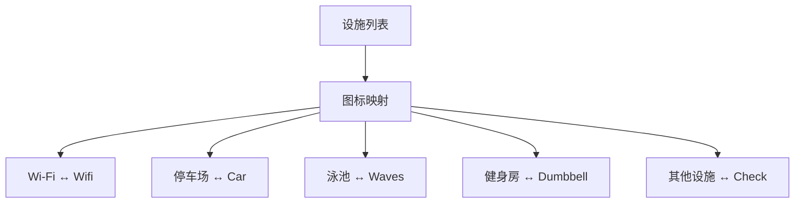

**图表来源**
- [src/pages/HotelStepPage.tsx:1140-1148](file://src/pages/HotelStepPage.tsx#L1140-L1148)
- [miniprogram/src/pages/hotel-detail/index.tsx:61-69](file://miniprogram/src/pages/hotel-detail/index.tsx#L61-L69)

**章节来源**
- [server/db.ts:451-485](file://server/db.ts#L451-L485)
- [server/db.ts:487-505](file://server/db.ts#L487-L505)
- [src/pages/HotelStepPage.tsx:1139-1355](file://src/pages/HotelStepPage.tsx#L1139-L1355)
- [miniprogram/src/pages/hotel-detail/index.tsx:61-98](file://miniprogram/src/pages/hotel-detail/index.tsx#L61-L98)

### **新增**：HotelPOI 类型定义扩展

#### 类型结构
HotelPOI 类型现在支持设施信息：

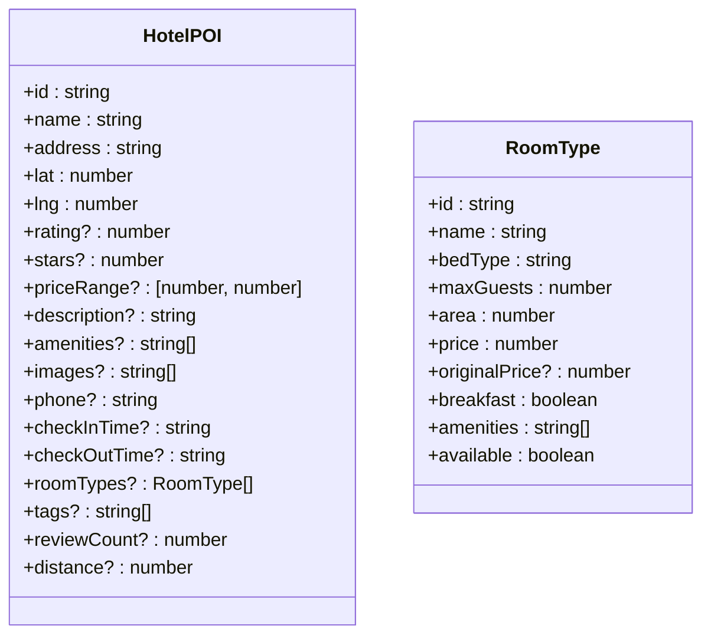

**图表来源**
- [src/types/index.ts:14-34](file://src/types/index.ts#L14-L34)
- [src/types/index.ts:1-12](file://src/types/index.ts#L1-L12)

#### 设施字段说明
- **amenities**：酒店设施列表，如 ["Wi-Fi", "停车场", "泳池", "健身房"]
- **支持的设施类型**：Wi-Fi、停车场、泳池、健身房、餐厅、SPA、商务中心等
- **图标映射**：前端组件提供对应的图标显示

**章节来源**
- [src/types/index.ts:14-34](file://src/types/index.ts#L14-L34)
- [src/types/index.ts:1-12](file://src/types/index.ts#L1-L12)

### **新增**：Agent 类目系统与酒店支持

#### 类目系统架构
Agent 系统现在完整支持六大一级类目，其中酒店类目具有详细的三级类目结构：

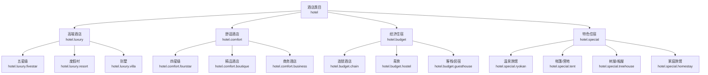

**图表来源**
- [agent/categories.ts:198-224](file://agent/categories.ts#L198-L224)

#### 酒店质量评估
Agent 系统对酒店数据有特殊的质量评估规则：

- **时长限制**：酒店类目的 visitDuration 可以为 0（表示无需停留）
- **特殊处理**：酒店类目不受常规时长限制影响
- **类目一致性**：酒店类目在质量评估中有特殊权重

**章节来源**
- [agent/categories.ts:16-30](file://agent/categories.ts#L16-L30)
- [agent/categories.ts:198-224](file://agent/categories.ts#L198-L224)
- [agent/quality.ts:69-72](file://agent/quality.ts#L69-L72)
- [agent/quality.ts:135-145](file://agent/quality.ts#L135-L145)

### **新增**：酒店数据生成与处理

#### 酒店数据生成流程
系统支持从多种数据源生成酒店数据，包括 AI 生成和外部 API：

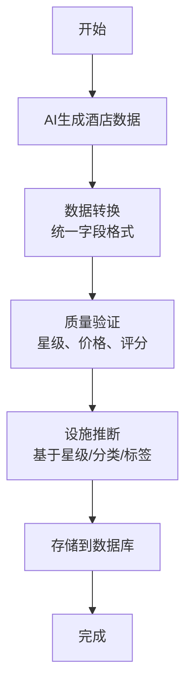

**图表来源**
- [server/qwen-hotels.ts:142-184](file://server/qwen-hotels.ts#L142-L184)

#### 酒店数据字段标准化
系统将不同来源的酒店数据转换为统一的标准格式：

- **基础字段**：id、name、address、coordinates
- **评价字段**：rating（1-5）、stars（1-5）、reviewCount
- **设施字段**：amenities、images、phone
- **价格字段**：priceRange、roomTypes
- **运营字段**：checkInTime、checkOutTime、distance

**章节来源**
- [server/qwen-hotels.ts:142-184](file://server/qwen-hotels.ts#L142-L184)
- [server/qwen-hotels.ts:186-204](file://server/qwen-hotels.ts#L186-L204)

## 依赖关系分析
- 模块耦合
  - 服务端与 Agent 各自持有独立连接实例，降低耦合
  - 管理后台通过各自 DB 层接口进行数据对比与统计
  - **新增**：酒店设施推断模块与前端展示组件的紧密集成
- 外部依赖
  - better-sqlite3：高性能 SQLite 驱动
  - better-sqlite3 PRAGMA：WAL 与外键配置
  - **新增**：Qwen API：用于生成酒店推荐数据
  - **新增**：前端图标库：支持设施图标的可视化展示
- 潜在风险
  - 多进程/多实例同时写入同一数据库需谨慎（建议 WAL 已缓解）
  - JSON 字段查询受限，复杂筛选建议引入额外索引或视图
  - **新增**：酒店设施推断的准确性依赖于输入数据的质量
  - **新增**：设施推断规则可能需要根据实际使用情况进行调整

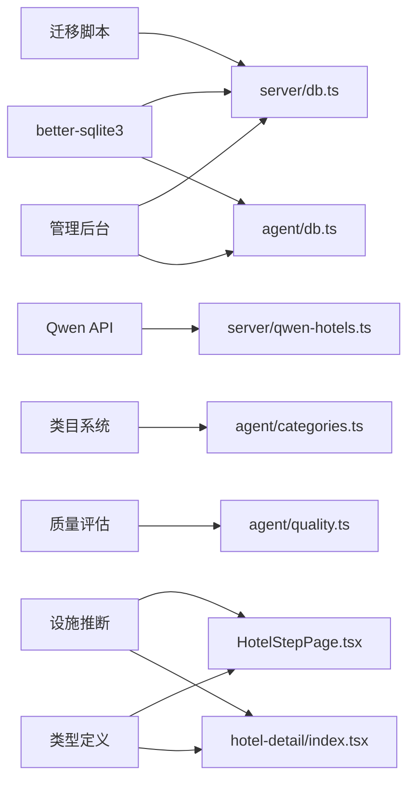

**图表来源**
- [server/db.ts:12-15](file://server/db.ts#L12-L15)
- [agent/db.ts:8-12](file://agent/db.ts#L8-L12)
- [server/qwen-hotels.ts:8-9](file://server/qwen-hotels.ts#L8-L9)
- [agent/categories.ts:16-30](file://agent/categories.ts#L16-L30)
- [agent/quality.ts:69-72](file://agent/quality.ts#L69-L72)
- [scripts/migrate-season-pk.js:16-19](file://scripts/migrate-season-pk.js#L16-L19)
- [server/admin-routes.ts:444-482](file://server/admin-routes.ts#L444-L482)
- [server/db.ts:459-485](file://server/db.ts#L459-L485)
- [src/pages/HotelStepPage.tsx:1139-1355](file://src/pages/HotelStepPage.tsx#L1139-L1355)
- [miniprogram/src/pages/hotel-detail/index.tsx:61-98](file://miniprogram/src/pages/hotel-detail/index.tsx#L61-L98)
- [src/types/index.ts:14-34](file://src/types/index.ts#L14-L34)

**章节来源**
- [server/db.ts:12-15](file://server/db.ts#L12-L15)
- [agent/db.ts:8-12](file://agent/db.ts#L8-L12)
- [server/qwen-hotels.ts:8-9](file://server/qwen-hotels.ts#L8-L9)
- [agent/categories.ts:16-30](file://agent/categories.ts#L16-L30)
- [agent/quality.ts:69-72](file://agent/quality.ts#L69-L72)
- [scripts/migrate-season-pk.js:16-19](file://scripts/migrate-season-pk.js#L16-L19)
- [server/admin-routes.ts:444-482](file://server/admin-routes.ts#L444-L482)
- [server/db.ts:459-485](file://server/db.ts#L459-L485)

## 性能考量
- WAL 模式显著提升并发写入能力，适合高并发写场景
- JSON 字段存储简化模型，但查询条件受限；可考虑在必要时拆分字段或增加索引
- 外键约束保障一致性，但会带来一定开销；仅在需要时启用
- **新增**：酒店设施推断的性能优化
  - parseStars 函数使用正则表达式快速解析星级
  - inferAmenities 函数一次性推断所有设施，避免重复计算
  - 使用字符串包含检查替代复杂的正则匹配
  - 统一数据结构减少转换开销
- 建议定期监控 WAL 文件大小与锁等待情况，防止磁盘空间与性能问题

## 故障排查指南
- 数据库路径与权限
  - 确认 DB_DIR 与 DB_PATH 是否正确，目录是否存在且具备读写权限
- WAL 与外键
  - 若出现写入阻塞或约束错误，检查 journal_mode=WAL 与 foreign_keys=ON 是否生效
- 迁移失败
  - 检查旧表结构是否包含 season 列，确认迁移脚本执行顺序与权限
- 缓存异常
  - 检查 updated_at 字段与 JSON 解析是否正常，必要时重建缓存
- **新增**：酒店设施推断问题
  - 检查 parseStars 函数是否能正确解析星级格式
  - 验证 inferAmenities 函数的推断逻辑是否符合预期
  - 确认前端设施图标映射是否完整
  - 检查 HotelPOI 类型定义是否包含 amenities 字段

**章节来源**
- [server/db.ts:18-27](file://server/db.ts#L18-L27)
- [agent/db.ts:22-25](file://agent/db.ts#L22-L25)
- [scripts/migrate-season-pk.js:28-31](file://scripts/migrate-season-pk.js#L28-L31)
- [server/db.ts:245-251](file://server/db.ts#L245-L251)
- [server/db.ts:451-485](file://server/db.ts#L451-L485)
- [src/types/index.ts:14-34](file://src/types/index.ts#L14-L34)

## 结论
本项目采用 better-sqlite3 与 WAL 模式构建高性能、低耦合的数据库层，服务端与 Agent 各自维护独立数据库，满足不同场景的数据需求。**最新的更新**引入了酒店设施智能推断功能，通过 parseStars 和 inferAmenities 函数实现了基于星级、分类和标签的自动化设施推断，显著提升了酒店数据的丰富度和用户体验。配合现有的酒店数据格式兼容性处理机制，系统现在能够更好地处理来自不同数据源的酒店信息，提供更全面的设施展示和更好的用户交互体验。

## 附录
- Agent 初始化脚本：初始化 agent.db 并预填充城市统计
- Agent 刷新流程：根据策略选择 baseline、incremental 或 full_refresh 模式
- 管理后台统计：对比 Agent 与服务端 POI 数据，统计待审核数量与缓存新鲜度
- **新增**：酒店设施推断测试：验证不同星级和类目的设施推断准确性
- **新增**：HotelPOI 类型文档：详细说明扩展的 amenities 字段和设施类型
- **新增**：前端设施展示：Web 和小程序端的设施图标映射和展示逻辑

**章节来源**
- [agent/init-db.ts:1-41](file://agent/init-db.ts#L1-L41)
- [agent/index.ts:653-676](file://agent/index.ts#L653-L676)
- [server/admin-routes.ts:444-482](file://server/admin-routes.ts#L444-L482)
- [server/db.ts:451-485](file://server/db.ts#L451-L485)
- [src/types/index.ts:14-34](file://src/types/index.ts#L14-L34)
- [src/pages/HotelStepPage.tsx:1139-1355](file://src/pages/HotelStepPage.tsx#L1139-L1355)
- [miniprogram/src/pages/hotel-detail/index.tsx:61-98](file://miniprogram/src/pages/hotel-detail/index.tsx#L61-L98)