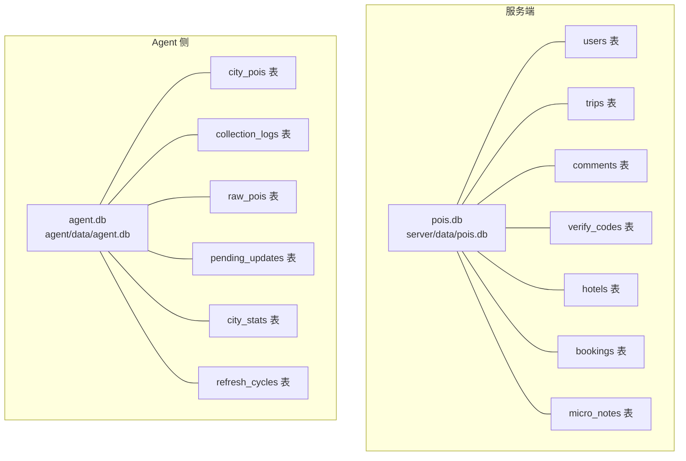
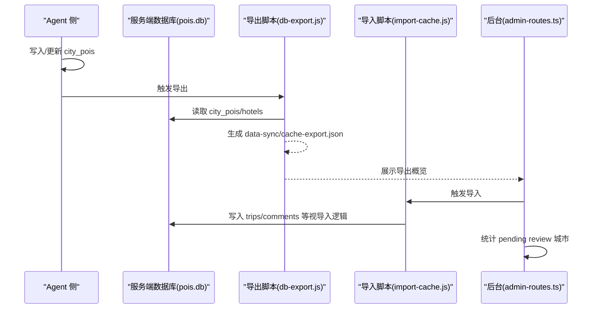
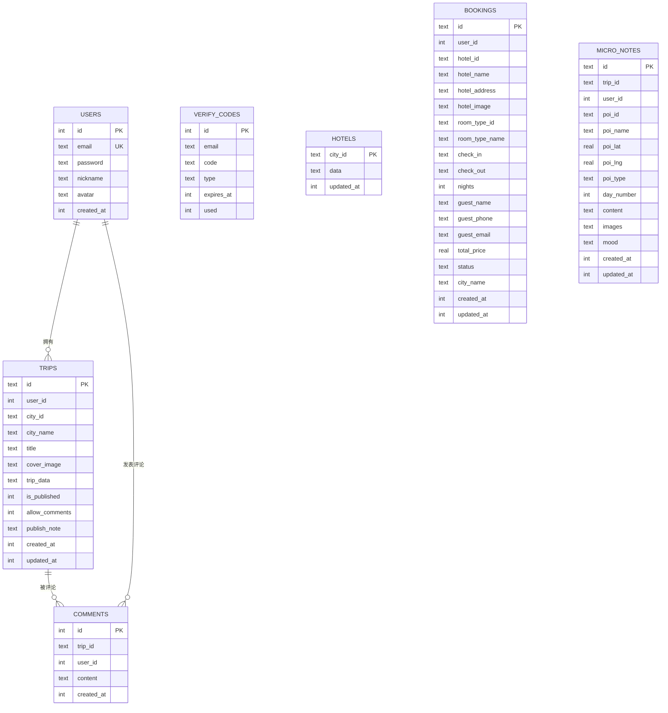
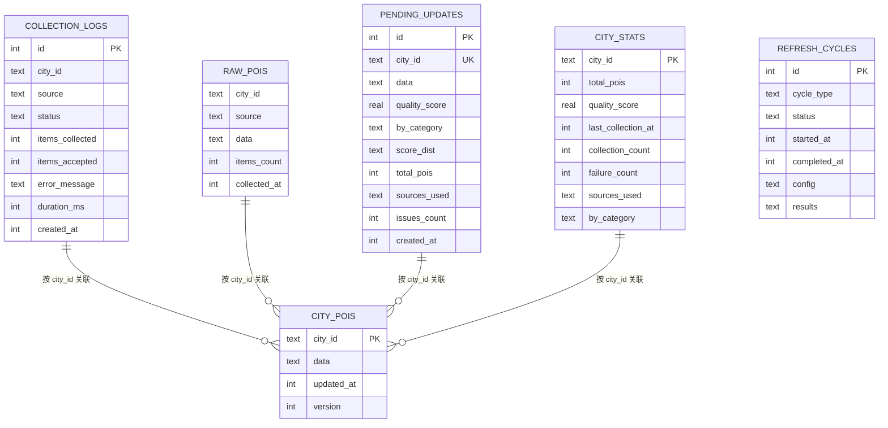
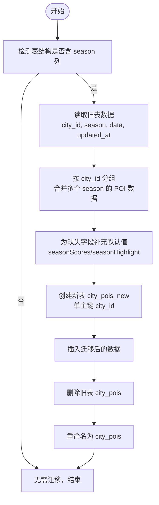
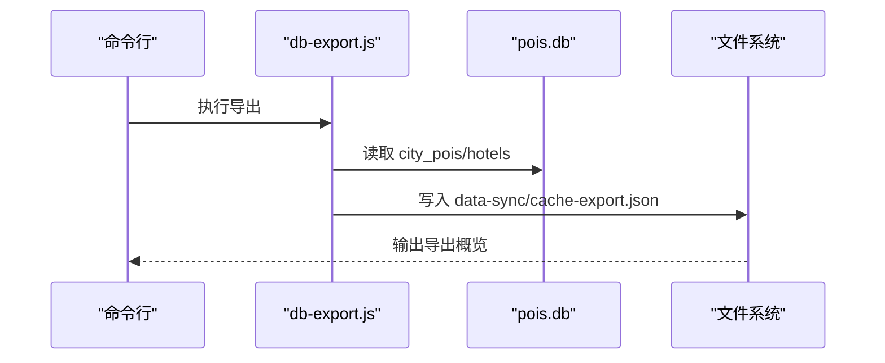
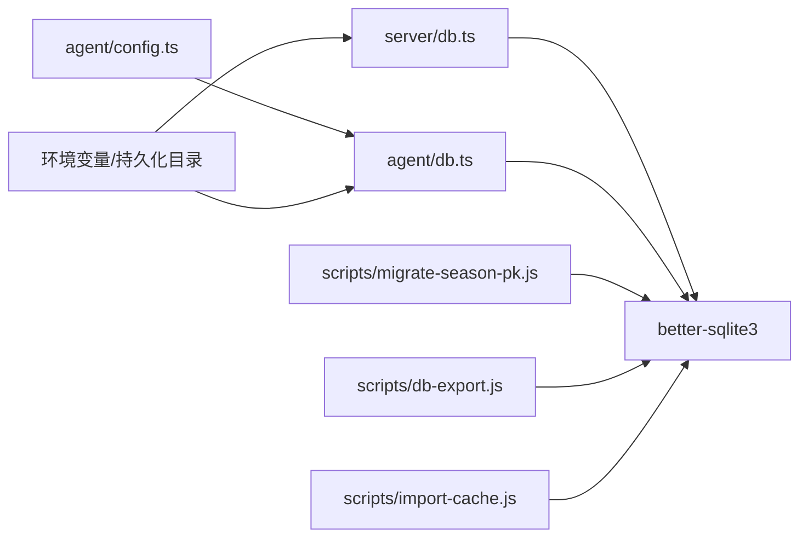

# 数据库操作与维护

<cite>
**本文引用的文件**
- [server/db.ts](file://server/db.ts)
- [agent/db.ts](file://agent/db.ts)
- [agent/init-db.ts](file://agent/init-db.ts)
- [scripts/migrate-season-pk.js](file://scripts/migrate-season-pk.js)
- [scripts/db-export.js](file://scripts/db-export.js)
- [scripts/import-cache.js](file://scripts/import-cache.js)
- [server/admin-routes.ts](file://server/admin-routes.ts)
- [agent/index.ts](file://agent/index.ts)
</cite>

## 目录
1. [简介](#简介)
2. [项目结构](#项目结构)
3. [核心组件](#核心组件)
4. [架构总览](#架构总览)
5. [详细组件分析](#详细组件分析)
6. [依赖关系分析](#依赖关系分析)
7. [性能考虑](#性能考虑)
8. [故障排查指南](#故障排查指南)
9. [结论](#结论)
10. [附录](#附录)

## 简介
本文件面向数据库操作与维护场景，系统性说明以下内容：
- 数据库初始化：表创建、索引建立、约束设置
- 数据库迁移与版本升级：schema 变更与数据迁移脚本
- 备份与恢复：数据导出与导入流程
- 性能监控与优化：查询分析与索引优化建议
- 连接管理与资源清理：连接池策略与资源回收
- 常见问题诊断与解决方案

## 项目结构
本项目采用“双数据库”架构：
- 服务端数据库（pois.db）：存放用户、行程、评论、验证码、酒店缓存、预订等业务数据
- Agent 本地数据库（agent.db）：存放采集数据、采集日志、待确认更新、城市统计等

图表来源
- [server/db.ts:37-147](file://server/db.ts#L37-L147)
- [agent/db.ts:34-131](file://agent/db.ts#L34-L131)

章节来源
- [server/db.ts:1-513](file://server/db.ts#L1-L513)
- [agent/db.ts:1-459](file://agent/db.ts#L1-L459)

## 核心组件
- 服务端数据库层（pois.db）
  - 初始化：自动创建表、启用 WAL、外键约束
  - 主要表：users、trips、comments、verify_codes、hotels、bookings、micro_notes
  - 提供用户、行程、评论、验证码、酒店缓存、预订、微游记等 CRUD 接口
- Agent 本地数据库层（agent.db）
  - 初始化：自动创建表、启用 WAL、外键约束
  - 主要表：city_pois、collection_logs、raw_pois、pending_updates、city_stats、refresh_cycles
  - 提供采集数据缓存、日志、原始数据、待确认更新、城市统计、刷新周期等接口
- 迁移与导出脚本
  - migrate-season-pk.js：将 city_pois 表从“复合主键（city_id, season）”迁移到“单主键（city_id）”
  - db-export.js：将本地数据库导出为 data-sync/cache-export.json
  - import-cache.js：从 data-sync/cache-export.json 导入缓存数据
- 管理与监控
  - admin-routes.ts：提供后台统计与对比 pending review 城市
  - agent/index.ts：提供 status 命令，输出覆盖率、质量分布、数据年龄分布等

章节来源
- [server/db.ts:37-147](file://server/db.ts#L37-L147)
- [agent/db.ts:34-131](file://agent/db.ts#L34-L131)
- [scripts/migrate-season-pk.js:1-126](file://scripts/migrate-season-pk.js#L1-L126)
- [scripts/db-export.js:1-75](file://scripts/db-export.js#L1-L75)
- [server/admin-routes.ts:448-486](file://server/admin-routes.ts#L448-L486)
- [agent/index.ts:536-578](file://agent/index.ts#L536-L578)

## 架构总览
服务端与 Agent 通过“缓存导出/导入”实现数据同步，迁移脚本保障 schema 版本演进。

图表来源
- [scripts/db-export.js:32-74](file://scripts/db-export.js#L32-L74)
- [server/admin-routes.ts:448-486](file://server/admin-routes.ts#L448-L486)
- [scripts/import-cache.js](file://scripts/import-cache.js)

## 详细组件分析

### 服务端数据库初始化与表结构
- 初始化流程
  - 自动创建目录与数据库文件
  - 启用 WAL 日志模式与外键约束
  - 创建并初始化核心业务表
- 表与约束
  - users：自增主键、email 唯一
  - trips：主键 id；外键 user_id 引用 users
  - comments：主键 id；外键 trip_id 引用 trips，user_id 引用 users
  - verify_codes：验证码表
  - hotels：按 city_id 缓存酒店数据
  - bookings：按 city_id 缓存预订数据
  - micro_notes：旅行微笔记，含外键约束
- 索引与查询
  - 通过外键约束保证参照完整性
  - 查询以条件过滤为主，未见显式二级索引

图表来源
- [server/db.ts:46-144](file://server/db.ts#L46-L144)

章节来源
- [server/db.ts:37-147](file://server/db.ts#L37-L147)
- [server/db.ts:235-261](file://server/db.ts#L235-L261)
- [server/db.ts:263-376](file://server/db.ts#L263-L376)
- [server/db.ts:378-408](file://server/db.ts#L378-L408)
- [server/db.ts:410-426](file://server/db.ts#L410-L426)
- [server/db.ts:428-454](file://server/db.ts#L428-L454)
- [server/db.ts:456-513](file://server/db.ts#L456-L513)

### Agent 本地数据库初始化与表结构
- 初始化流程
  - 自动创建目录与数据库文件
  - 启用 WAL 日志模式与外键约束
  - 创建采集、统计、日志、待确认更新等表
- 表与索引
  - city_pois：city_id 主键，version 列用于安全变更
  - collection_logs：按 (city_id, source) 与 created_at 建索引
  - raw_pois：(city_id, source) 复合主键
  - pending_updates：city_id 唯一键
  - city_stats：city_id 主键
  - refresh_cycles：记录刷新周期状态与结果
- 关键接口
  - upsertPOIs/getCachedPOIs：缓存写入与读取
  - logCollection：采集日志写入
  - updateCityStats：城市统计更新
  - upsertPendingUpdate/applyPendingUpdate：待确认更新的写入与应用
  - getRawPOIsSummary/loadRawPOIs：原始采集数据读取

图表来源
- [agent/db.ts:34-131](file://agent/db.ts#L34-L131)

章节来源
- [agent/db.ts:34-131](file://agent/db.ts#L34-L131)
- [agent/db.ts:135-155](file://agent/db.ts#L135-L155)
- [agent/db.ts:159-174](file://agent/db.ts#L159-L174)
- [agent/db.ts:178-232](file://agent/db.ts#L178-L232)
- [agent/db.ts:262-305](file://agent/db.ts#L262-L305)
- [agent/db.ts:309-321](file://agent/db.ts#L309-L321)
- [agent/db.ts:329-366](file://agent/db.ts#L329-L366)
- [agent/db.ts:379-448](file://agent/db.ts#L379-L448)
- [agent/db.ts:453-459](file://agent/db.ts#L453-L459)

### 数据库迁移与版本升级策略
- 迁移目标
  - 将 city_pois 表从“复合主键（city_id, season）”迁移到“单主键（city_id）”
  - 合并同 city_id 下多个 season 的 POI 数据
  - 为缺失字段补充默认值（seasonScores、seasonHighlight）
- 迁移流程
  - 检测旧表结构（存在 season 列）
  - 读取旧数据并按 city_id 分组合并
  - 为每个 POI 补充 seasonScores 与 seasonHighlight
  - 创建新表 city_pois_new，插入迁移后数据
  - 删除旧表，重命名新表
- 版本控制
  - 通过在 city_pois 表新增 version 列实现安全 ALTER
  - 迁移完成后，version 默认为 1，后续可递增

图表来源
- [scripts/migrate-season-pk.js:38-120](file://scripts/migrate-season-pk.js#L38-L120)
- [agent/db.ts:81-85](file://agent/db.ts#L81-L85)

章节来源
- [scripts/migrate-season-pk.js:1-126](file://scripts/migrate-season-pk.js#L1-L126)
- [agent/db.ts:81-85](file://agent/db.ts#L81-L85)

### 数据库备份与恢复机制
- 备份（导出）
  - db-export.js 读取 city_pois 与 hotels 表，统计各城市 POI 数量，生成 data-sync/cache-export.json
  - 包含版本号、导出时间、城市统计、POI 与酒店缓存
- 恢复（导入）
  - import-cache.js 从 data-sync/cache-export.json 导入缓存数据（具体导入逻辑在脚本中定义）
- 使用建议
  - 在 Agent 完成大规模更新后执行导出
  - 在需要快速恢复或批量部署时执行导入

图表来源
- [scripts/db-export.js:32-74](file://scripts/db-export.js#L32-L74)

章节来源
- [scripts/db-export.js:1-75](file://scripts/db-export.js#L1-L75)
- [scripts/import-cache.js](file://scripts/import-cache.js)

### 数据库连接管理与资源清理
- 连接策略
  - 服务端与 Agent 均采用 better-sqlite3，按需创建连接
  - 初始化时统一设置 journal_mode=WAL 与 foreign_keys=ON
- 资源清理
  - 提供 closeDB 接口用于关闭连接
  - 建议在进程退出或长时间无使用时调用关闭
- 并发与事务
  - 采用 WAL 模式提升并发读写能力
  - 未见显式事务封装，建议在批量写入时使用事务包裹

章节来源
- [server/db.ts:33-35](file://server/db.ts#L33-L35)
- [agent/db.ts:19-32](file://agent/db.ts#L19-L32)
- [agent/db.ts:453-459](file://agent/db.ts#L453-L459)

### 性能监控与优化建议
- 查询分析
  - 服务端：多处使用 JOIN（如 micro_notes 与 users），建议对关联字段建立索引
  - Agent：collection_logs 按 (city_id, source) 与 created_at 建有索引，有助于日志查询
- 索引优化
  - users.email 唯一索引已存在，建议对 trips.user_id、comments.trip_id、comments.user_id 建索引
  - 对 bookings.user_id 建索引以加速用户预订查询
- 缓存与分页
  - city_pois/hotels 采用 JSON 文本缓存，建议在高并发场景下增加读写锁或使用 WAL 的并发优势
  - 对高频查询（如分页、筛选）建议引入二级索引或物化视图
- 监控指标
  - Agent 提供覆盖率、质量分布、数据年龄分布等指标
  - 后台可统计 pending review 城市数量，辅助运维决策

章节来源
- [agent/db.ts:59-66](file://agent/db.ts#L59-L66)
- [agent/index.ts:536-578](file://agent/index.ts#L536-L578)
- [server/admin-routes.ts:448-486](file://server/admin-routes.ts#L448-L486)

## 依赖关系分析
- 服务端依赖
  - better-sqlite3：SQLite 客户端
  - 路径解析：根据环境变量与持久化目录确定 DB_DIR 与 DB_PATH
- Agent 依赖
  - better-sqlite3：SQLite 客户端
  - AGENT_CONFIG：配置项（含 dbPath）
- 脚本依赖
  - migrate-season-pk.js：读取/写入 pois.db，修改表结构
  - db-export.js：读取 pois.db，生成 data-sync/cache-export.json
  - import-cache.js：读取 data-sync/cache-export.json，写入数据库

图表来源
- [server/db.ts:12-27](file://server/db.ts#L12-L27)
- [agent/db.ts:8-12](file://agent/db.ts#L8-L12)
- [scripts/migrate-season-pk.js:16-26](file://scripts/migrate-season-pk.js#L16-L26)
- [scripts/db-export.js:11-19](file://scripts/db-export.js#L11-L19)
- [scripts/import-cache.js](file://scripts/import-cache.js)

章节来源
- [server/db.ts:12-27](file://server/db.ts#L12-L27)
- [agent/db.ts:8-12](file://agent/db.ts#L8-L12)
- [scripts/migrate-season-pk.js:16-26](file://scripts/migrate-season-pk.js#L16-L26)
- [scripts/db-export.js:11-19](file://scripts/db-export.js#L11-L19)
- [scripts/import-cache.js](file://scripts/import-cache.js)

## 性能考虑
- WAL 模式
  - 提升并发读写能力，减少写放大
- 索引策略
  - 已有部分索引（如 collection_logs），建议补齐业务常用查询字段索引
- 批处理与事务
  - 批量写入时使用事务，降低锁竞争与提交开销
- 缓存设计
  - JSON 文本缓存适合读多写少场景，注意序列化/反序列化成本
- 监控与告警
  - 结合 Agent 与后台统计，建立数据新鲜度与覆盖率阈值告警

## 故障排查指南
- 数据库文件不存在
  - 现象：脚本报错提示数据库不存在
  - 处理：确认 DB_DIR 与 DB_PATH 是否正确，确保目录存在且可写
- 表结构不一致
  - 现象：迁移失败或查询异常
  - 处理：运行 migrate-season-pk.js 检测并迁移；检查 city_pois 表结构
- 导出/导入失败
  - 现象：导出文件为空或导入报错
  - 处理：确认导出前已完成数据更新；检查 data-sync/cache-export.json 格式
- 性能下降
  - 现象：查询变慢、锁等待增多
  - 处理：检查索引覆盖情况；评估是否需要事务批处理；关注 WAL 文件大小

章节来源
- [scripts/migrate-season-pk.js:28-31](file://scripts/migrate-season-pk.js#L28-L31)
- [scripts/db-export.js:21-25](file://scripts/db-export.js#L21-L25)
- [agent/index.ts:536-578](file://agent/index.ts#L536-L578)

## 结论
本项目通过“服务端 + Agent”的双数据库架构，结合 WAL 模式、外键约束与导出/导入流程，实现了稳定的数据初始化、迁移与同步。建议在生产环境中进一步完善索引、事务批处理与监控告警体系，持续优化查询性能与运维效率。

## 附录
- 初始化脚本
  - Agent 初始化：agent/init-db.ts
- 运维脚本
  - 迁移：scripts/migrate-season-pk.js
  - 导出：scripts/db-export.js
  - 导入：scripts/import-cache.js
- 管理与监控
  - 后台统计：server/admin-routes.ts
  - Agent 状态：agent/index.ts