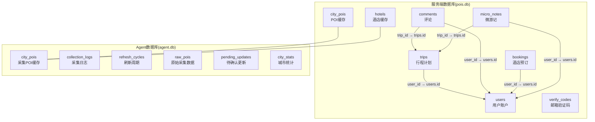
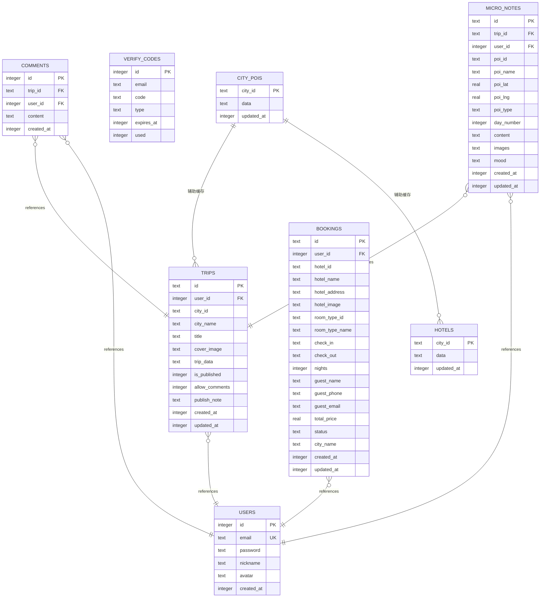
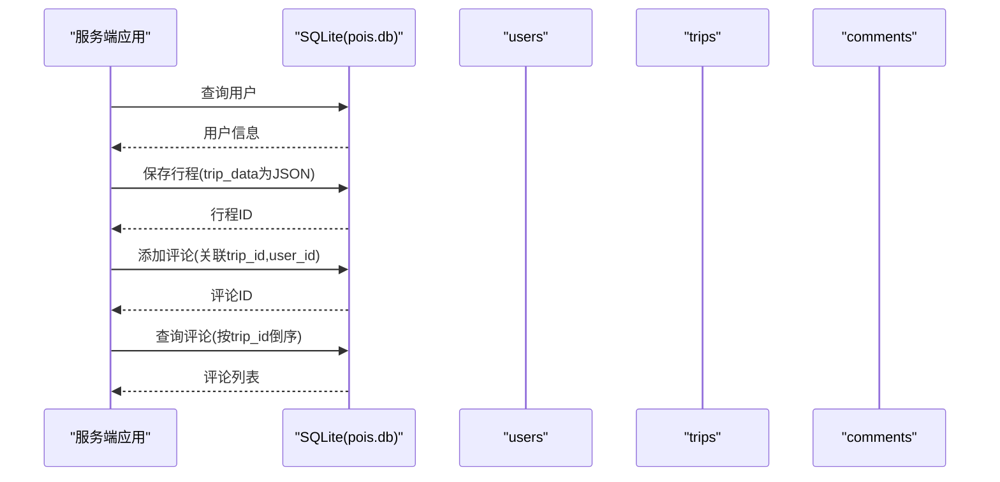

# 数据库表结构设计

<cite>
**本文档引用的文件**
- [server/db.ts](file://server/db.ts)
- [agent/db.ts](file://agent/db.ts)
- [agent/init-db.ts](file://agent/init-db.ts)
- [agent/config.ts](file://agent/config.ts)
- [admin/types/index.ts](file://admin/types/index.ts)
- [agent/sources/base.ts](file://agent/sources/base.ts)
- [scripts/migrate-season-pk.js](file://scripts/migrate-season-pk.js)
</cite>

## 目录
1. [引言](#引言)
2. [项目结构](#项目结构)
3. [核心组件](#核心组件)
4. [架构概览](#架构概览)
5. [详细组件分析](#详细组件分析)
6. [依赖分析](#依赖分析)
7. [性能考虑](#性能考虑)
8. [故障排除指南](#故障排除指南)
9. [结论](#结论)

## 引言
本文件系统性梳理了项目中涉及的数据库表结构设计，重点覆盖以下表：city_pois、users、trips、comments、verify_codes、hotels、bookings 和 micro_notes。文档从设计理念、字段定义、主外键关系与约束、JSON 字段使用与序列化策略、表间关联与引用完整性等方面进行深入分析，并结合实际代码实现给出可视化图表与最佳实践建议。

## 项目结构
数据库层由两套独立的 SQLite 实例构成：
- 服务端数据库（pois.db）：存放用户、行程、评论、验证码、酒店缓存、预订及微游记等业务数据。
- Agent 数据库（agent.db）：存放采集数据、日志、城市统计、待确认更新等采集侧数据。

**图表来源**
- [server/db.ts:46-144](file://server/db.ts#L46-L144)
- [agent/db.ts:34-131](file://agent/db.ts#L34-L131)

**章节来源**
- [server/db.ts:1-147](file://server/db.ts#L1-L147)
- [agent/db.ts:1-459](file://agent/db.ts#L1-L459)

## 核心组件
本节概述各表的设计理念与职责边界：
- city_pois：以城市维度缓存 POI 数据，采用 JSON 文本存储，支持按城市快速检索与版本控制。
- users：用户账户信息，唯一邮箱，包含密码、昵称、头像与创建时间。
- trips：行程计划，以 JSON 文本存储完整行程数据，支持发布状态与评论开关。
- comments：针对已发布行程的评论，支持用户与行程双向关联。
- verify_codes：邮箱验证码，支持类型、过期时间与使用标记。
- hotels：以城市维度缓存酒店数据，采用 JSON 文本存储。
- bookings：酒店预订，包含客人信息、房型、入住日期、价格与状态。
- micro_notes：微游记，记录用户在行程中对 POI 的短评、图片与心情等。

**章节来源**
- [server/db.ts:46-144](file://server/db.ts#L46-L144)
- [agent/db.ts:34-131](file://agent/db.ts#L34-L131)

## 架构概览
下图展示了服务端数据库中各表之间的引用关系与完整性约束：

**图表来源**
- [server/db.ts:46-144](file://server/db.ts#L46-L144)

**章节来源**
- [server/db.ts:46-144](file://server/db.ts#L46-L144)

## 详细组件分析

### city_pois 表
- 设计理念：以城市 ID 作为单主键，将整个城市的 POI 列表序列化为 JSON 存储，便于批量读写与版本控制。
- 字段定义
  - city_id：文本，主键，唯一标识城市。
  - data：文本，JSON 字符串，存储 POI 对象数组。
  - updated_at：整数，时间戳，记录最后更新时间。
- 约束与索引：主键约束；通过 city_id 快速检索。
- JSON 使用策略：读取时 JSON.parse，写入时 JSON.stringify；提供缓存年龄查询函数。
- 性能考量：单表单主键，避免复杂连接；适合按城市聚合的场景。

**章节来源**
- [server/db.ts:46-53](file://server/db.ts#L46-L53)
- [server/db.ts:237-261](file://server/db.ts#L237-L261)
- [scripts/migrate-season-pk.js:1-48](file://scripts/migrate-season-pk.js#L1-L48)

### users 表
- 设计理念：用户账户信息，邮箱唯一，便于登录与权限管理。
- 字段定义
  - id：整数，自增主键。
  - email：文本，唯一，登录凭据。
  - password：文本，密码哈希。
  - nickname：文本，默认空字符串。
  - avatar：文本，默认空字符串。
  - created_at：整数，默认当前 Unix 毫秒时间戳。
- 约束与索引：email 唯一约束；配合 trips、comments、bookings、micro_notes 的外键引用。
- JSON 使用策略：非 JSON 字段，直接存储与查询。
- 性能考量：唯一索引加速登录与查找。

**章节来源**
- [server/db.ts:55-65](file://server/db.ts#L55-L65)

### trips 表
- 设计理念：存储完整的行程计划数据，以 JSON 文本形式保存行程对象，支持发布状态与评论开关。
- 字段定义
  - id：文本，主键，行程唯一标识。
  - user_id：整数，外键 references users(id)，行程归属用户。
  - city_id、city_name：文本，城市信息。
  - title、cover_image：文本，标题与封面图。
  - trip_data：文本，JSON 字符串，完整行程数据。
  - is_published：整数（0/1），发布状态。
  - allow_comments：整数（0/1），允许评论。
  - publish_note：文本，发布说明。
  - created_at、updated_at：整数，默认当前时间戳。
- 约束与索引：外键 user_id；按更新时间排序查询常用。
- JSON 使用策略：trip_data 为 JSON 字符串，序列化/反序列化在应用层处理。
- 性能考量：JSON 文本大，查询时注意仅选择必要列；按 user_id 与 updated_at 排序。

**章节来源**
- [server/db.ts:67-84](file://server/db.ts#L67-L84)
- [server/db.ts:300-377](file://server/db.ts#L300-L377)

### comments 表
- 设计理念：对已发布行程的评论，支持用户与行程双向关联。
- 字段定义
  - id：整数，自增主键。
  - trip_id：文本，外键 references trips(id)。
  - user_id：整数，外键 references users(id)。
  - content：文本，评论内容。
  - created_at：整数，默认当前时间戳。
- 约束与索引：双外键；按创建时间倒序查询。
- JSON 使用策略：非 JSON 字段。
- 性能考量：评论量可能较大，建议按 trip_id 分页查询。

**章节来源**
- [server/db.ts:86-97](file://server/db.ts#L86-L97)
- [server/db.ts:378-408](file://server/db.ts#L378-L408)

### verify_codes 表
- 设计理念：邮箱验证码，支持类型、过期与使用标记。
- 字段定义
  - id：整数，自增主键。
  - email：文本，邮箱。
  - code：文本，验证码。
  - type：文本，默认 reset。
  - expires_at：整数，过期时间戳。
  - used：整数，默认 0，使用后置 1。
- 约束与索引：无显式唯一约束；按邮箱+验证码+类型+未使用+未过期查询。
- JSON 使用策略：非 JSON 字段。
- 性能考量：插入频繁但查询条件明确，可按邮箱与类型分组。

**章节来源**
- [server/db.ts:99-109](file://server/db.ts#L99-L109)
- [server/db.ts:410-427](file://server/db.ts#L410-L427)

### hotels 表
- 设计理念：以城市维度缓存酒店数据，结构与 city_pois 类似，便于按城市检索。
- 字段定义
  - city_id：文本，主键。
  - data：文本，JSON 字符串，酒店对象数组。
  - updated_at：整数，时间戳。
- 约束与索引：主键约束。
- JSON 使用策略：读取时 JSON.parse，写入时 JSON.stringify；提供缓存年龄查询。
- 性能考量：单表单主键，适合按城市检索。

**章节来源**
- [server/db.ts:111-118](file://server/db.ts#L111-L118)
- [server/db.ts:428-454](file://server/db.ts#L428-L454)

### bookings 表
- 设计理念：酒店预订记录，包含客人信息、房型、入住日期、价格与状态。
- 字段定义
  - id：文本，主键，预订唯一标识。
  - user_id：整数，外键 references users(id)。
  - hotel_id、hotel_name、hotel_address、hotel_image：文本，酒店信息。
  - room_type_id、room_type_name：文本，房型信息。
  - check_in、check_out：文本，入住/退房日期。
  - nights：整数，默认 1。
  - guest_name、guest_phone、guest_email：文本，客人信息。
  - total_price：实数，总价。
  - status：文本，默认 pending。
  - city_name：文本，默认空字符串。
  - created_at、updated_at：整数，默认当前时间戳。
- 约束与索引：外键 user_id；按创建时间倒序查询。
- JSON 使用策略：非 JSON 字段。
- 性能考量：预订状态变更频繁，建议按 user_id 与 status 查询。

**章节来源**
- [server/db.ts:120-144](file://server/db.ts#L120-L144)
- [server/db.ts:456-513](file://server/db.ts#L456-L513)

### micro_notes 表
- 设计理念：微游记，记录用户在行程中对 POI 的短评、图片与心情等，支持按天序与时间排序。
- 字段定义
  - id：文本，主键，微游记唯一标识。
  - trip_id：文本，外键 references trips(id)。
  - user_id：整数，外键 references users(id)。
  - poi_id、poi_name：文本，POI 信息。
  - poi_lat、poi_lng：实数，默认 0。
  - poi_type：文本，默认 scenic。
  - day_number：整数，默认 1。
  - content：文本，默认空字符串。
  - images：文本，默认空数组 JSON 字符串。
  - mood：文本，默认空字符串。
  - created_at、updated_at：整数，默认当前时间戳。
- 约束与索引：双外键；按 day_number 与 created_at 排序。
- JSON 使用策略：images 为 JSON 数组字符串；其他为普通字段。
- 性能考量：按 trip_id 查询微游记，按天序展示；images 字段可按需解析。

**章节来源**
- [server/db.ts:149-173](file://server/db.ts#L149-L173)
- [server/db.ts:174-234](file://server/db.ts#L174-L234)

### Agent 端表（补充说明）
Agent 端数据库用于采集与治理流程，包含以下关键表：
- city_pois：采集侧 POI 缓存，结构与服务端类似，支持 version 版本字段。
- collection_logs：采集日志，记录来源、状态、耗时等。
- refresh_cycles：刷新周期记录，包含类型、状态、配置与结果。
- raw_pois：原始采集数据，按 (city_id, source) 唯一，仅保留最新一次。
- pending_updates：待确认更新，每城市最多一条，包含质量评分与来源分布。
- city_stats：城市统计，包含 POI 数量、质量评分、来源使用情况等。

**章节来源**
- [agent/db.ts:34-131](file://agent/db.ts#L34-L131)
- [agent/init-db.ts:23-40](file://agent/init-db.ts#L23-L40)

## 依赖分析
- 引用完整性：trips.user_id → users.id；comments.trip_id → trips.id；comments.user_id → users.id；bookings.user_id → users.id；micro_notes.trip_id → trips.id；micro_notes.user_id → users.id。
- JSON 字段依赖：city_pois.data、hotels.data、trips.trip_data、micro_notes.images、pending_updates.meta 字段均采用 JSON 序列化，应用层负责解析与校验。
- 版本控制：city_pois 在 Agent 端新增 version 字段，支持增量更新与一致性保障。

**图表来源**
- [server/db.ts:67-97](file://server/db.ts#L67-L97)
- [server/db.ts:300-408](file://server/db.ts#L300-L408)

**章节来源**
- [server/db.ts:67-97](file://server/db.ts#L67-L97)

## 性能考虑
- 索引与查询优化
  - users.email 唯一索引，加速登录与查找。
  - trips.user_id + updated_at 排序查询常用。
  - comments.trip_id + created_at 倒序查询常用。
  - micro_notes.trip_id + day_number + created_at 排序展示。
- JSON 字段处理
  - 仅在需要时解析 JSON，避免不必要的 parse/stringify。
  - 对大体积 JSON（如 trip_data）建议分页或按需加载。
- 外键与事务
  - 开启外键约束，确保引用完整性；删除行程时先清理评论，再删除行程。
- 缓存策略
  - city_pois/hotels 提供缓存年龄查询，结合 TTL 控制刷新频率。

[本节为通用性能建议，不直接分析具体文件]

## 故障排除指南
- JSON 解析失败
  - 现象：读取 city_pois/hotels/trips/micro_notes 时 JSON.parse 抛错。
  - 排查：检查 data/images 是否为空或损坏；确认序列化/反序列化调用是否匹配。
  - 参考实现位置
    - [server/db.ts:237-261](file://server/db.ts#L237-L261)
    - [server/db.ts:428-454](file://server/db.ts#L428-L454)
    - [server/db.ts:237-261](file://server/db.ts#L237-L261)
    - [server/db.ts:174-234](file://server/db.ts#L174-L234)
- 外键约束错误
  - 现象：插入 comments/bookings/micro_notes 时报外键约束失败。
  - 排查：确认 trips.id 与 users.id 是否存在；检查 user_id 与 trip_id 是否匹配。
  - 参考实现位置
    - [server/db.ts:67-97](file://server/db.ts#L67-L97)
    - [server/db.ts:120-144](file://server/db.ts#L120-L144)
- Agent 表结构迁移
  - 现象：city_pois 原含 season 列导致迁移。
  - 处理：执行迁移脚本，合并同城市多季节数据，重命名表。
  - 参考实现位置
    - [scripts/migrate-season-pk.js:1-48](file://scripts/migrate-season-pk.js#L1-L48)

**章节来源**
- [server/db.ts:237-261](file://server/db.ts#L237-L261)
- [server/db.ts:428-454](file://server/db.ts#L428-L454)
- [server/db.ts:67-97](file://server/db.ts#L67-L97)
- [server/db.ts:120-144](file://server/db.ts#L120-L144)
- [scripts/migrate-season-pk.js:1-48](file://scripts/migrate-season-pk.js#L1-L48)

## 结论
本数据库设计围绕“城市维度缓存 + 用户/行程/评论/预订/微游记”的核心业务展开，采用 SQLite 与 JSON 文本相结合的方式，在保证灵活性的同时兼顾查询效率与引用完整性。通过外键约束、索引与缓存策略，系统能够支撑从 POI 缓存到用户交互的全链路需求。后续可在以下方面持续优化：
- 对大体积 JSON 字段增加压缩或分表策略；
- 引入更细粒度的索引覆盖常用查询模式；
- 在 Agent 端完善版本与一致性校验机制。