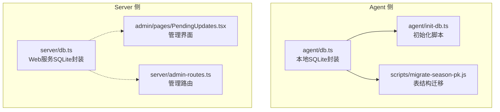
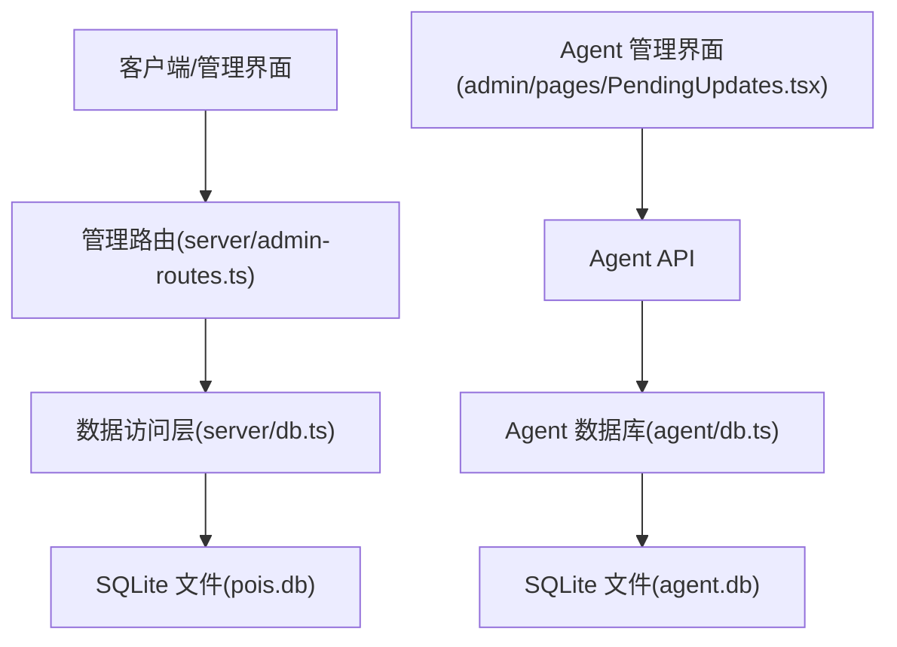
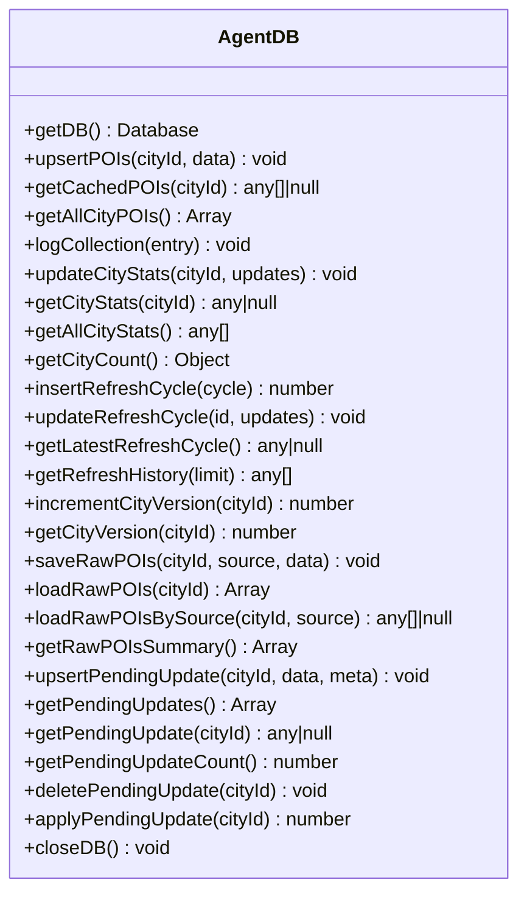
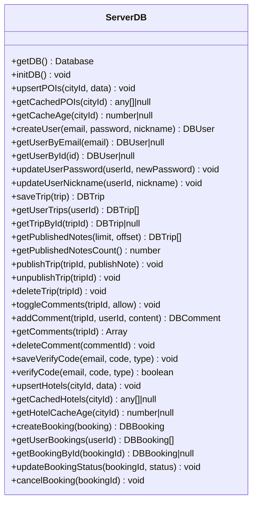
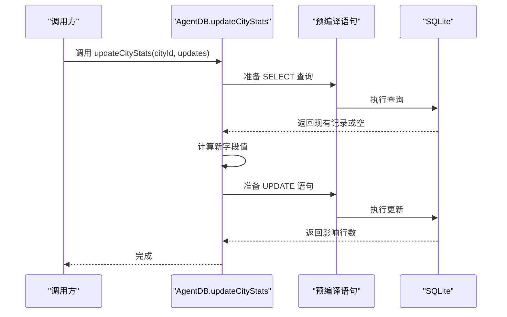
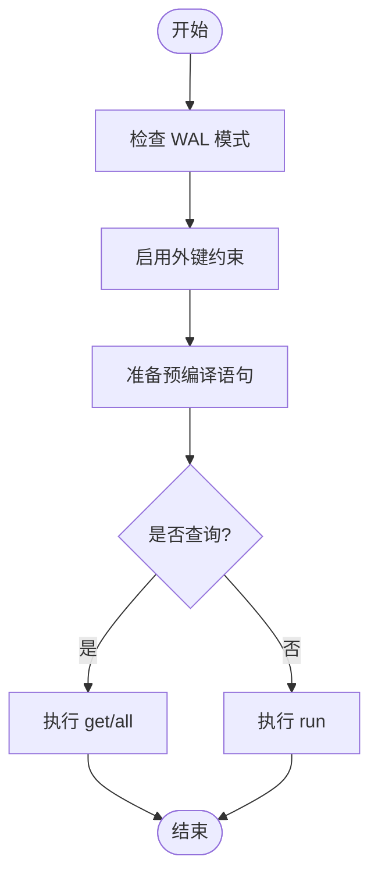
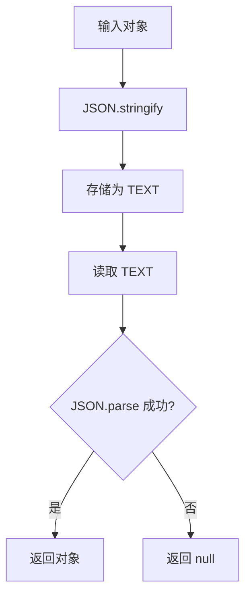
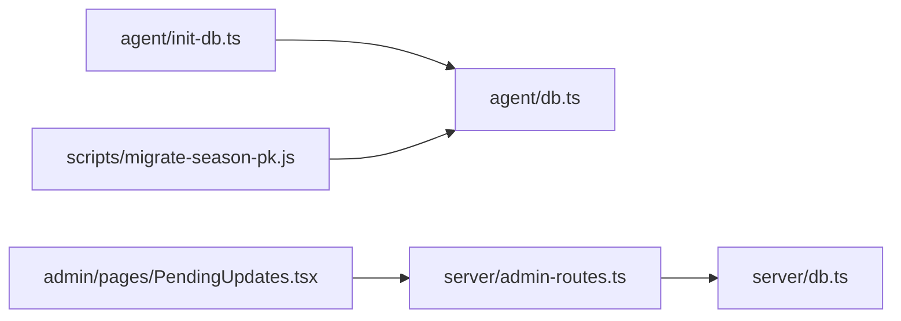

# 数据访问层实现

<cite>
**本文档引用的文件**
- [agent/db.ts](file://agent/db.ts)
- [server/db.ts](file://server/db.ts)
- [agent/init-db.ts](file://agent/init-db.ts)
- [scripts/migrate-season-pk.js](file://scripts/migrate-season-pk.js)
- [admin/pages/PendingUpdates.tsx](file://admin/pages/PendingUpdates.tsx)
- [server/admin-routes.ts](file://server/admin-routes.ts)
</cite>

## 目录
1. [简介](#简介)
2. [项目结构](#项目结构)
3. [核心组件](#核心组件)
4. [架构概览](#架构概览)
5. [详细组件分析](#详细组件分析)
6. [依赖关系分析](#依赖关系分析)
7. [性能考虑](#性能考虑)
8. [故障排除指南](#故障排除指南)
9. [结论](#结论)

## 简介
本文件系统性梳理了基于 better-sqlite3 的数据访问层实现，涵盖以下关键主题：
- better-sqlite3 集成与配置：连接池策略、WAL 模式、外键约束等
- 事务处理与并发控制：读写分离、锁竞争规避、批量操作优化
- CRUD 实现模式：预编译语句、参数绑定、SQL 注入防护
- 数据访问函数设计：错误处理、参数校验、返回值格式化
- 接口设计与使用示例：同步与异步调用、Promise 处理
- 序列化与反序列化最佳实践：JSON 存储、类型转换、容错处理

## 项目结构
数据访问层主要分布在两个模块：
- agent/db.ts：面向采集系统的本地 SQLite 数据库，负责 POI 缓存、采集日志、城市统计、待确认更新等
- server/db.ts：面向 Web 服务的 SQLite 数据库，负责用户、行程、评论、验证码、酒店缓存、预订等

**图表来源**
- [agent/db.ts:1-459](file://agent/db.ts#L1-L459)
- [server/db.ts:1-513](file://server/db.ts#L1-L513)
- [agent/init-db.ts:1-41](file://agent/init-db.ts#L1-L41)
- [scripts/migrate-season-pk.js:1-48](file://scripts/migrate-season-pk.js#L1-L48)
- [admin/pages/PendingUpdates.tsx:39-69](file://admin/pages/PendingUpdates.tsx#L39-L69)
- [server/admin-routes.ts:1408-1445](file://server/admin-routes.ts#L1408-L1445)

**章节来源**
- [agent/db.ts:1-459](file://agent/db.ts#L1-L459)
- [server/db.ts:1-513](file://server/db.ts#L1-L513)
- [agent/init-db.ts:1-41](file://agent/init-db.ts#L1-L41)
- [scripts/migrate-season-pk.js:1-48](file://scripts/migrate-season-pk.js#L1-L48)
- [admin/pages/PendingUpdates.tsx:39-69](file://admin/pages/PendingUpdates.tsx#L39-L69)
- [server/admin-routes.ts:1408-1445](file://server/admin-routes.ts#L1408-L1445)

## 核心组件
- better-sqlite3 集成
  - 初始化时设置 journal_mode=WAL、foreign_keys=ON，提升并发读写性能与一致性
  - 通过单例模式导出 getDB()，避免重复创建连接
- 表结构设计
  - agent/db.ts：city_pois、collection_logs、refresh_cycles、raw_pois、pending_updates、city_stats
  - server/db.ts：city_pois、users、trips、comments、verify_codes、hotels、bookings
- 预编译语句与参数绑定
  - 所有 SQL 使用 prepare + run/get/all 形式，参数通过占位符绑定，杜绝拼接
- 错误处理与返回值
  - JSON 解析失败时返回 null；查询无结果时返回 null 或空数组；成功时返回结构化对象
- 序列化策略
  - 复杂对象以 JSON 字符串形式存储，读取时再解析；对异常输入进行 try/catch 容错

**章节来源**
- [agent/db.ts:19-32](file://agent/db.ts#L19-L32)
- [server/db.ts:33-44](file://server/db.ts#L33-L44)
- [agent/db.ts:135-155](file://agent/db.ts#L135-L155)
- [server/db.ts:237-261](file://server/db.ts#L237-L261)

## 架构概览
数据访问层采用“单实例 + 预编译语句”的统一模式，结合 WAL 日志模式实现高并发读写。Agent 侧专注于采集与统计，Server 侧专注业务数据与用户交互。

**图表来源**
- [server/admin-routes.ts:1408-1445](file://server/admin-routes.ts#L1408-L1445)
- [admin/pages/PendingUpdates.tsx:39-69](file://admin/pages/PendingUpdates.tsx#L39-L69)
- [server/db.ts:1-513](file://server/db.ts#L1-L513)
- [agent/db.ts:1-459](file://agent/db.ts#L1-L459)

## 详细组件分析

### Agent 数据库组件分析
Agent 数据库负责采集数据与统计，核心职责包括：
- POI 缓存：upsertPOIs、getCachedPOIs、getAllCityPOIs
- 采集日志：logCollection
- 城市统计：updateCityStats、getCityStats、getAllCityStats、getCityCount
- 刷新周期：insertRefreshCycle、updateRefreshCycle、getLatestRefreshCycle、getRefreshHistory
- 城市版本：incrementCityVersion、getCityVersion
- 原始采集数据：saveRawPOIs、loadRawPOIs、loadRawPOIsBySource、getRawPOIsSummary
- 待确认更新：upsertPendingUpdate、getPendingUpdates、getPendingUpdate、getPendingUpdateCount、deletePendingUpdate、applyPendingUpdate
- 关闭数据库：closeDB

**图表来源**
- [agent/db.ts:19-459](file://agent/db.ts#L19-L459)

**章节来源**
- [agent/db.ts:135-155](file://agent/db.ts#L135-L155)
- [agent/db.ts:159-174](file://agent/db.ts#L159-L174)
- [agent/db.ts:178-232](file://agent/db.ts#L178-L232)
- [agent/db.ts:262-305](file://agent/db.ts#L262-L305)
- [agent/db.ts:309-321](file://agent/db.ts#L309-L321)
- [agent/db.ts:329-366](file://agent/db.ts#L329-L366)
- [agent/db.ts:379-448](file://agent/db.ts#L379-L448)
- [agent/db.ts:453-459](file://agent/db.ts#L453-L459)

### Server 数据库组件分析
Server 数据库负责用户、行程、评论、验证码、酒店缓存与预订等业务数据：
- POI 缓存：upsertPOIs、getCachedPOIs、getCacheAge
- 用户：createUser、getUserByEmail、getUserById、updateUserPassword、updateUserNickname
- 行程：saveTrip、getUserTrips、getTripById、getPublishedNotes、getPublishedNotesCount、publishTrip、unpublishTrip、deleteTrip、toggleComments
- 评论：addComment、getComments、deleteComment
- 验证码：saveVerifyCode、verifyCode
- 酒店缓存：upsertHotels、getCachedHotels、getHotelCacheAge
- 预订：createBooking、getUserBookings、getBookingById、updateBookingStatus、cancelBooking

**图表来源**
- [server/db.ts:33-513](file://server/db.ts#L33-L513)

**章节来源**
- [server/db.ts:237-261](file://server/db.ts#L237-L261)
- [server/db.ts:265-297](file://server/db.ts#L265-L297)
- [server/db.ts:301-376](file://server/db.ts#L301-L376)
- [server/db.ts:380-408](file://server/db.ts#L380-L408)
- [server/db.ts:412-426](file://server/db.ts#L412-L426)
- [server/db.ts:430-454](file://server/db.ts#L430-L454)
- [server/db.ts:458-513](file://server/db.ts#L458-L513)

### CRUD 流程与预编译语句使用
以“更新城市统计”为例，展示预编译语句与参数绑定的使用方式：

**图表来源**
- [agent/db.ts:178-232](file://agent/db.ts#L178-L232)

**章节来源**
- [agent/db.ts:178-232](file://agent/db.ts#L178-L232)

### 事务处理与并发控制
- WAL 模式：通过 db.pragma('journal_mode = WAL') 提升并发读性能，减少写阻塞
- 外键约束：db.pragma('foreign_keys = ON') 强制参照完整性
- 读写分离：查询使用 get/all，写入使用 run，避免在事务中长时间持有锁
- 批量操作：在需要时可组合多条语句，但应尽量保持原子性，必要时使用显式事务（当前实现未显式开启事务，建议在批量写入场景引入）

**图表来源**
- [agent/db.ts:28-29](file://agent/db.ts#L28-L29)
- [server/db.ts:43-44](file://server/db.ts#L43-L44)

**章节来源**
- [agent/db.ts:28-29](file://agent/db.ts#L28-L29)
- [server/db.ts:43-44](file://server/db.ts#L43-L44)

### 数据序列化与反序列化最佳实践
- JSON 存储：复杂对象以 JSON 字符串形式存储在 TEXT 列中
- 安全解析：读取后使用 try/catch 包裹 JSON.parse，失败时返回 null
- 类型转换：日期时间统一使用毫秒时间戳，便于跨语言处理
- 容错修复：针对 LLM 输出的不规范 JSON，提供修复工具（见 agent/utils.ts 中的 JSON 修复函数）

**图表来源**
- [agent/db.ts:135-155](file://agent/db.ts#L135-L155)
- [server/db.ts:237-261](file://server/db.ts#L237-L261)

**章节来源**
- [agent/db.ts:135-155](file://agent/db.ts#L135-L155)
- [server/db.ts:237-261](file://server/db.ts#L237-L261)

### 接口设计与使用示例
- 同步调用：直接调用 getDB() 获取连接，然后执行 CRUD 操作
- 异步与 Promise：better-sqlite3 默认同步，若需异步场景，可在 Worker 或子进程中使用，或通过队列包装为 Promise 风格
- 参数校验：对必填参数进行类型检查与长度限制，非法输入返回 null 或抛出错误
- 返回值格式化：统一返回结构化对象或数组，避免裸字符串

示例参考：
- 管理端应用待确认更新：[server/admin-routes.ts:1422-1445](file://server/admin-routes.ts#L1422-L1445)
- 管理界面列表加载：[admin/pages/PendingUpdates.tsx:60-67](file://admin/pages/PendingUpdates.tsx#L60-L67)

**章节来源**
- [server/admin-routes.ts:1422-1445](file://server/admin-routes.ts#L1422-L1445)
- [admin/pages/PendingUpdates.tsx:60-67](file://admin/pages/PendingUpdates.tsx#L60-L67)

## 依赖关系分析
- 组件耦合
  - agent/db.ts 与 agent/init-db.ts：初始化脚本依赖 agent/db.ts 的 getDB() 与表结构定义
  - server/db.ts 与其他模块：通过接口导出供路由与服务层使用
- 外部依赖
  - better-sqlite3：提供高性能 SQLite 绑定
  - better-sqlite3 迁移脚本：独立于主库，仅在需要时运行

**图表来源**
- [agent/init-db.ts:10-16](file://agent/init-db.ts#L10-L16)
- [scripts/migrate-season-pk.js:23-26](file://scripts/migrate-season-pk.js#L23-L26)
- [admin/pages/PendingUpdates.tsx:60-67](file://admin/pages/PendingUpdates.tsx#L60-L67)
- [server/admin-routes.ts:1422-1445](file://server/admin-routes.ts#L1422-L1445)
- [server/db.ts:1-513](file://server/db.ts#L1-L513)

**章节来源**
- [agent/init-db.ts:10-16](file://agent/init-db.ts#L10-L16)
- [scripts/migrate-season-pk.js:23-26](file://scripts/migrate-season-pk.js#L23-L26)
- [admin/pages/PendingUpdates.tsx:60-67](file://admin/pages/PendingUpdates.tsx#L60-L67)
- [server/admin-routes.ts:1422-1445](file://server/admin-routes.ts#L1422-L1445)
- [server/db.ts:1-513](file://server/db.ts#L1-L513)

## 性能考虑
- WAL 模式：显著提升并发读性能，适合高并发读写场景
- 预编译语句：减少 SQL 解析开销，提高重复执行效率
- 索引设计：为高频查询列建立索引（如 collection_logs 的复合索引、raw_pois 的 city_id 索引）
- 批量写入：在需要时合并多条写入，减少事务次数
- JSON 存储：避免复杂 JOIN，简化查询逻辑，但注意解析成本

## 故障排除指南
- 数据库初始化失败
  - 检查 DB_DIR 是否存在且可写
  - 确认 WAL 与外键 pragma 设置是否成功
- JSON 解析错误
  - 确保写入前已 JSON.stringify
  - 读取后使用 try/catch 包裹 JSON.parse
- 表结构变更
  - 使用迁移脚本（如 migrate-season-pk.js）进行结构升级
- 并发冲突
  - 避免长事务，拆分短事务
  - 对热点表增加索引，减少锁竞争

**章节来源**
- [agent/db.ts:28-29](file://agent/db.ts#L28-L29)
- [server/db.ts:43-44](file://server/db.ts#L43-L44)
- [scripts/migrate-season-pk.js:35-46](file://scripts/migrate-season-pk.js#L35-L46)

## 结论
本数据访问层以 better-sqlite3 为核心，通过单例连接、WAL 模式、预编译语句与严格的参数绑定，实现了高效、安全、易维护的数据访问。配合合理的表结构设计与序列化策略，满足了采集系统与 Web 服务的不同需求。建议在批量写入场景引入显式事务，并持续优化索引与查询计划，以进一步提升性能与稳定性。