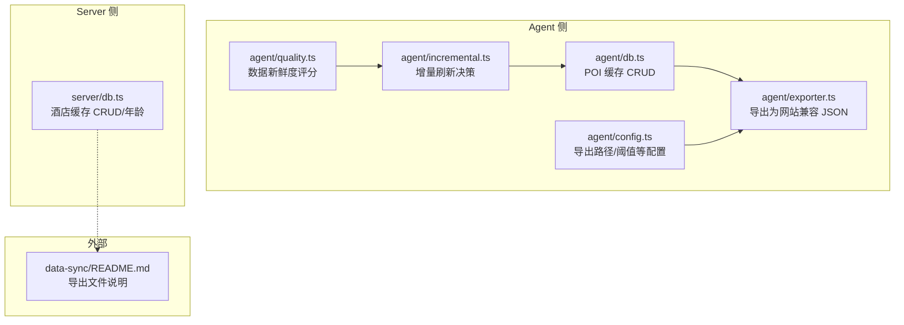
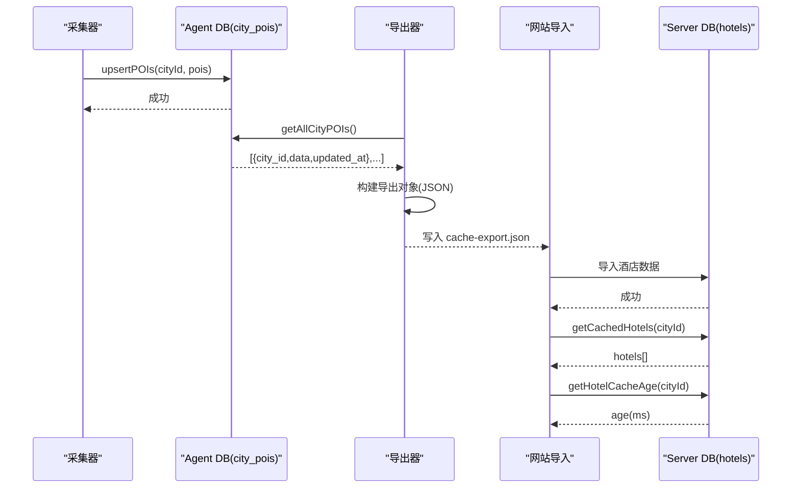
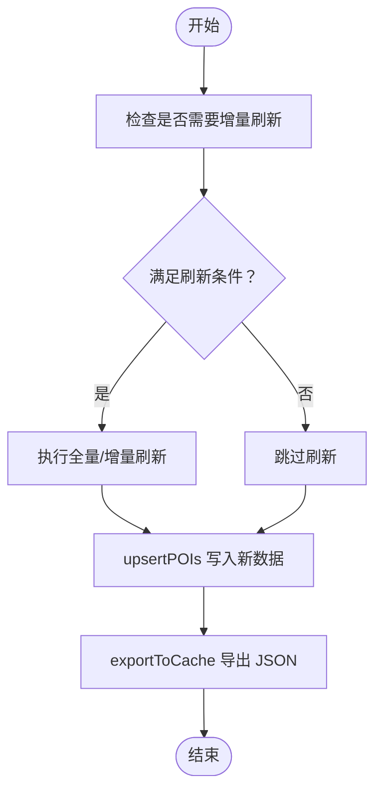
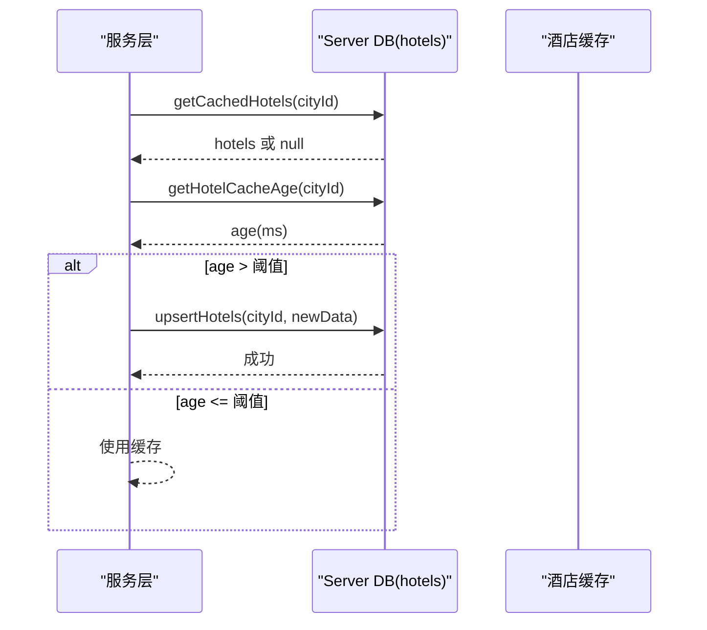
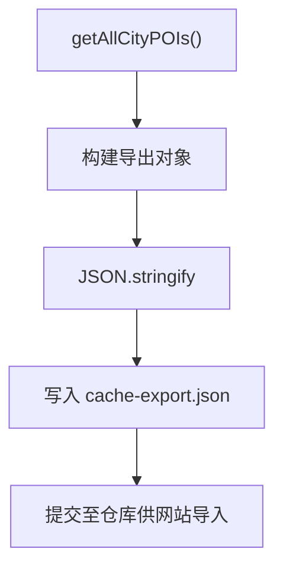
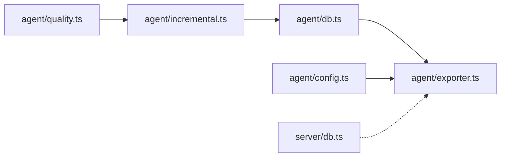

# 缓存策略设计

<cite>
**本文引用的文件**
- [agent/db.ts](file://agent/db.ts)
- [agent/config.ts](file://agent/config.ts)
- [agent/exporter.ts](file://agent/exporter.ts)
- [agent/incremental.ts](file://agent/incremental.ts)
- [agent/quality.ts](file://agent/quality.ts)
- [server/db.ts](file://server/db.ts)
- [data-sync/README.md](file://data-sync/README.md)
</cite>

## 目录
1. [引言](#引言)
2. [项目结构](#项目结构)
3. [核心组件](#核心组件)
4. [架构总览](#架构总览)
5. [详细组件分析](#详细组件分析)
6. [依赖关系分析](#依赖关系分析)
7. [性能考量](#性能考量)
8. [故障排查指南](#故障排查指南)
9. [结论](#结论)
10. [附录](#附录)

## 引言
本文件系统性阐述本项目的缓存策略设计，重点覆盖两类缓存：
- POI 缓存：以城市维度存储聚合后的 POI 数据，支持导出为网站可导入的 JSON 格式。
- 酒店缓存：以城市维度存储酒店数据，具备独立的更新时间戳与年龄计算。

内容涵盖缓存键设计、过期时间与更新策略、存储格式与 JSON 序列化、命中率优化与内存管理、失效与刷新机制（含年龄计算与自动更新逻辑），以及在不同环境（开发、测试、生产）下的行为差异与配置要点。

## 项目结构
与缓存直接相关的模块主要分布在以下位置：
- agent 层：负责采集、合并、质量评估、增量刷新、导出等；POI 缓存持久化在本地 SQLite。
- server 层：提供酒店缓存的读写接口与年龄查询。
- data-sync：存放导出的缓存数据文件，供网站侧导入。

图表来源
- [agent/db.ts:135-155](file://agent/db.ts#L135-L155)
- [agent/config.ts:32-36](file://agent/config.ts#L32-L36)
- [agent/exporter.ts:21-72](file://agent/exporter.ts#L21-L72)
- [agent/incremental.ts:49-78](file://agent/incremental.ts#L49-L78)
- [agent/quality.ts:329-343](file://agent/quality.ts#L329-L343)
- [server/db.ts:430-454](file://server/db.ts#L430-L454)
- [data-sync/README.md:1-6](file://data-sync/README.md#L1-L6)

章节来源
- [agent/db.ts:1-459](file://agent/db.ts#L1-L459)
- [agent/config.ts:1-182](file://agent/config.ts#L1-L182)
- [agent/exporter.ts:1-73](file://agent/exporter.ts#L1-L73)
- [agent/incremental.ts:1-120](file://agent/incremental.ts#L1-L120)
- [agent/quality.ts:329-343](file://agent/quality.ts#L329-L343)
- [server/db.ts:428-454](file://server/db.ts#L428-L454)
- [data-sync/README.md:1-6](file://data-sync/README.md#L1-L6)

## 核心组件
- POI 缓存（Agent 侧）
  - 存储表：city_pois（主表），包含 city_id、data（JSON 字符串）、updated_at、version。
  - 关键操作：upsertPOIs、getCachedPOIs、getAllCityPOIs、getCityVersion、incrementCityVersion。
  - 导出：exportToCache 将数据库中所有城市的 POI 数据导出为与网站兼容的 JSON 文件。
- 酒店缓存（Server 侧）
  - 存储表：hotels（主表），包含 city_id、data（JSON 字符串）、updated_at。
  - 关键操作：getCachedHotels、upsertHotels、getHotelCacheAge。
- 增量刷新与质量评估
  - 增量决策：shouldRunIncremental 基于城市数据新鲜度比例决定是否执行增量或全量刷新。
  - 质量评分：基于 updated_at 计算 ageDays，并进行线性衰减评分与分级。

章节来源
- [agent/db.ts:135-155](file://agent/db.ts#L135-L155)
- [agent/db.ts:309-321](file://agent/db.ts#L309-L321)
- [agent/exporter.ts:21-72](file://agent/exporter.ts#L21-L72)
- [server/db.ts:430-454](file://server/db.ts#L430-L454)
- [agent/incremental.ts:49-78](file://agent/incremental.ts#L49-L78)
- [agent/quality.ts:329-343](file://agent/quality.ts#L329-L343)

## 架构总览
下图展示了 POI 与酒店缓存的端到端流程：采集与合并生成 POI 数据，写入本地 SQLite；定时导出为网站可导入的 JSON；服务端读取酒店缓存并计算年龄。

图表来源
- [agent/db.ts:135-155](file://agent/db.ts#L135-L155)
- [agent/exporter.ts:30-56](file://agent/exporter.ts#L30-L56)
- [server/db.ts:430-454](file://server/db.ts#L430-L454)

## 详细组件分析

### POI 缓存（Agent 侧）
- 缓存键设计
  - 键：city_id（字符串）。每个城市一个键，避免跨城市污染。
  - 版本：表新增 version 字段，每次写入递增，便于下游感知变更。
- 过期时间与更新策略
  - 本地 SQLite 不内置 TTL；过期策略通过“增量刷新”与“全量刷新”控制。
  - 增量刷新阈值：staleThresholdDays（默认 30 天）；当超过 30 天的城市占比超过阈值时建议全量刷新。
  - 新鲜度评分：基于 updated_at 计算 ageDays，采用线性衰减评分，分级 fresh/recent/aging/stale/expired。
- 存储格式与 JSON 序列化
  - data 字段为 JSON 字符串，写入时 JSON.stringify，读取时 JSON.parse。
  - 导出格式包含版本、导出时间、城市数量、POI 总数与各城市条目（city_id、data、updated_at）。
- 命中率优化与内存管理
  - 读取：按 city_id 查询，命中后直接返回；未命中返回 null。
  - 内存：导出时遍历所有城市条目构建导出对象，注意大体量时的内存占用；可通过分批处理降低峰值。
- 失效与刷新机制
  - 自动更新：根据 shouldRunIncremental 决策执行增量/全量刷新。
  - 年龄计算：基于 updated_at 计算 ageDays，用于评分与决策。
  - 手动触发：导出命令会调用 exportToCache，生成 cache-export.json。

图表来源
- [agent/incremental.ts:49-78](file://agent/incremental.ts#L49-L78)
- [agent/db.ts:135-150](file://agent/db.ts#L135-L150)
- [agent/exporter.ts:21-72](file://agent/exporter.ts#L21-L72)

章节来源
- [agent/db.ts:135-155](file://agent/db.ts#L135-L155)
- [agent/db.ts:309-321](file://agent/db.ts#L309-L321)
- [agent/config.ts:67-77](file://agent/config.ts#L67-L77)
- [agent/incremental.ts:49-78](file://agent/incremental.ts#L49-L78)
- [agent/quality.ts:329-343](file://agent/quality.ts#L329-L343)
- [agent/exporter.ts:21-72](file://agent/exporter.ts#L21-L72)

### 酒店缓存（Server 侧）
- 缓存键设计
  - 键：city_id（字符串）。每个城市一个键。
- 过期时间与更新策略
  - 本地 SQLite 不内置 TTL；过期策略由业务逻辑控制。
  - 提供 getHotelCacheAge 计算缓存年龄（毫秒），用于上层策略判断。
- 存储格式与 JSON 序列化
  - data 字段为 JSON 字符串，写入时 JSON.stringify，读取时 JSON.parse。
- 命中率优化与内存管理
  - 读取：按 city_id 查询，命中后直接返回；未命中返回 null。
  - 内存：单次查询返回数组或 null，内存占用可控。
- 失效与刷新机制
  - 自动更新：上层根据 getHotelCacheAge 判断是否需要刷新。
  - 手动触发：调用 upsertHotels 写入新数据并更新 updated_at。

图表来源
- [server/db.ts:430-454](file://server/db.ts#L430-L454)

章节来源
- [server/db.ts:428-454](file://server/db.ts#L428-L454)

### 导出与导入（POI 缓存）
- 导出流程
  - 读取所有城市 POI 记录，构建导出对象，写入 JSON 文件。
  - 文件名与路径由 AGENT_CONFIG.exportPath 控制，默认位于 data-sync 目录。
- 导入流程（网站侧）
  - 仓库说明指出导出文件应被提交，以便网站导入。

图表来源
- [agent/exporter.ts:30-56](file://agent/exporter.ts#L30-L56)
- [agent/config.ts:32-36](file://agent/config.ts#L32-L36)
- [data-sync/README.md:1-6](file://data-sync/README.md#L1-L6)

章节来源
- [agent/exporter.ts:21-72](file://agent/exporter.ts#L21-L72)
- [agent/config.ts:32-36](file://agent/config.ts#L32-L36)
- [data-sync/README.md:1-6](file://data-sync/README.md#L1-L6)

## 依赖关系分析
- Agent 与 Server 的耦合点
  - POI 缓存：Agent 导出 JSON，Server 读取并使用。
  - 酒店缓存：Server 独立维护，与 Agent 无直接耦合。
- 关键依赖链
  - agent/db.ts 提供 POI 缓存 CRUD。
  - agent/exporter.ts 依赖 agent/db.ts 的查询接口。
  - server/db.ts 提供酒店缓存 CRUD 与年龄计算。
  - agent/incremental.ts 与 agent/quality.ts 为刷新策略提供决策依据。

图表来源
- [agent/db.ts:135-155](file://agent/db.ts#L135-L155)
- [agent/exporter.ts:30-56](file://agent/exporter.ts#L30-L56)
- [agent/config.ts:32-36](file://agent/config.ts#L32-L36)
- [agent/incremental.ts:49-78](file://agent/incremental.ts#L49-L78)
- [agent/quality.ts:329-343](file://agent/quality.ts#L329-L343)
- [server/db.ts:430-454](file://server/db.ts#L430-L454)

章节来源
- [agent/db.ts:135-155](file://agent/db.ts#L135-L155)
- [agent/exporter.ts:21-72](file://agent/exporter.ts#L21-L72)
- [agent/config.ts:32-36](file://agent/config.ts#L32-L36)
- [agent/incremental.ts:49-78](file://agent/incremental.ts#L49-L78)
- [agent/quality.ts:329-343](file://agent/quality.ts#L329-L343)
- [server/db.ts:428-454](file://server/db.ts#L428-L454)

## 性能考量
- 命中率优化
  - POI：按 city_id 查询，索引命中良好；建议在高并发场景下复用连接与事务。
  - 酒店：按 city_id 查询，索引命中良好；建议批量读取减少往返。
- 内存管理
  - 导出时遍历所有城市条目，注意大体量时的内存峰值；可考虑分批处理。
  - JSON 解析与序列化为热点操作，建议避免重复解析。
- I/O 与网络
  - Agent 侧导出为一次性写入，建议在空闲时段执行。
  - Server 侧酒店缓存读写为本地 SQLite，延迟低但需关注 WAL 模式下的磁盘占用。

## 故障排查指南
- POI 缓存
  - 读取为空：确认 city_id 是否正确，是否存在记录。
  - 导出失败：检查导出路径权限与目录是否存在。
  - 增量刷新未触发：检查 staleThresholdDays 与城市新鲜度分布。
- 酒店缓存
  - 读取为空：确认 city_id 是否正确，是否存在记录。
  - 年龄异常：检查 updated_at 是否正确写入，系统时间是否一致。
- 通用
  - JSON 解析错误：确认 data 字段为合法 JSON 字符串；必要时清理非法字符后重试。

章节来源
- [agent/db.ts:145-150](file://agent/db.ts#L145-L150)
- [agent/exporter.ts:21-72](file://agent/exporter.ts#L21-L72)
- [agent/incremental.ts:49-78](file://agent/incremental.ts#L49-L78)
- [server/db.ts:430-454](file://server/db.ts#L430-L454)

## 结论
本项目采用“本地 SQLite + 定时导出”的双层缓存方案：
- Agent 侧 POI 缓存：以城市为键，支持版本递增、导出为网站兼容 JSON。
- Server 侧酒店缓存：以城市为键，支持年龄计算与手动刷新。
- 刷新策略：基于城市数据新鲜度分布与阈值进行增量/全量决策，结合线性衰减评分与分级，确保数据新鲜度与成本平衡。

## 附录

### 环境差异与配置要点
- 开发环境
  - 导出路径：默认位于 data-sync/cache-export.json，便于本地调试。
  - 增量阈值：staleThresholdDays 默认 30 天，适合频繁刷新。
- 测试/生产环境
  - 导出路径：可通过 AGENT_EXPORT_PATH 覆盖，便于 CI/CD 自动化。
  - 增量阈值：可根据数据规模与更新频率调整，平衡成本与新鲜度。
- 配置项参考
  - AGENT_EXPORT_PATH：导出文件路径。
  - staleThresholdDays：全量刷新阈值（天）。
  - concurrentCities：并发城市数（影响导出与刷新的资源占用）。

章节来源
- [agent/config.ts:32-36](file://agent/config.ts#L32-L36)
- [agent/config.ts:67-77](file://agent/config.ts#L67-L77)
- [agent/config.ts:33](file://agent/config.ts#L33)