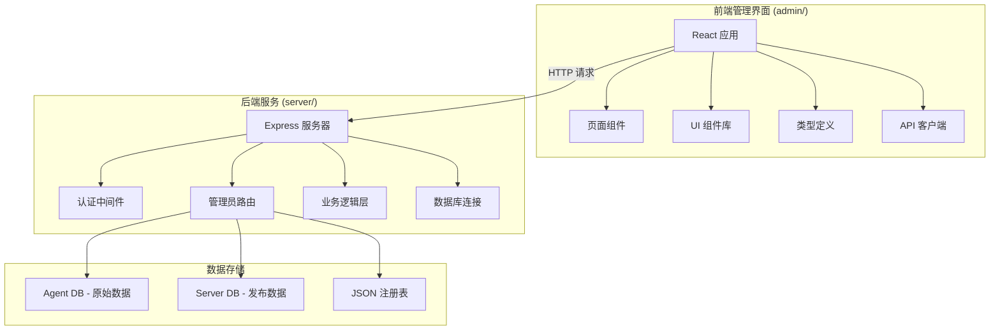
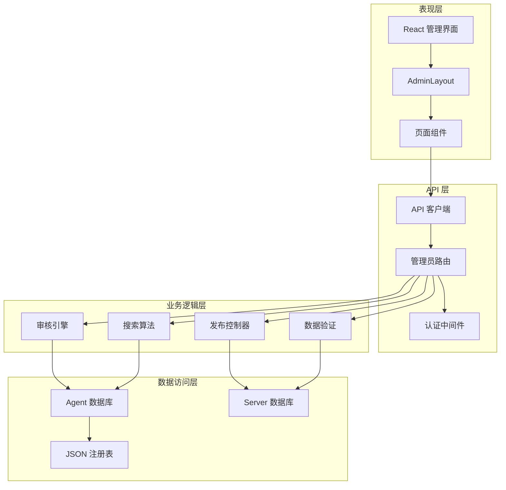
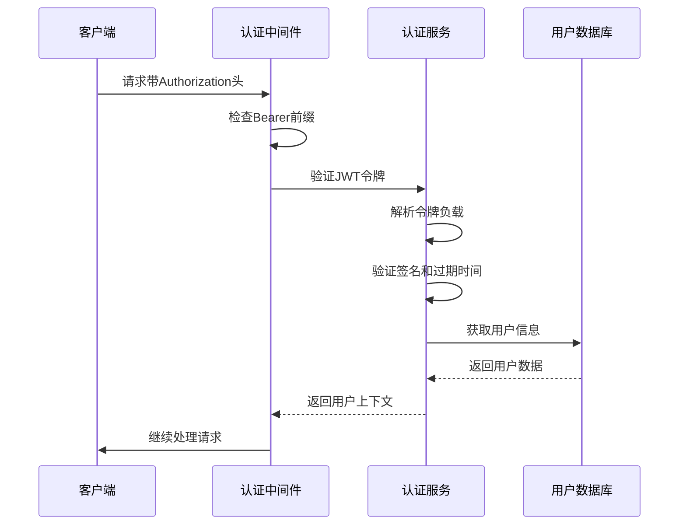
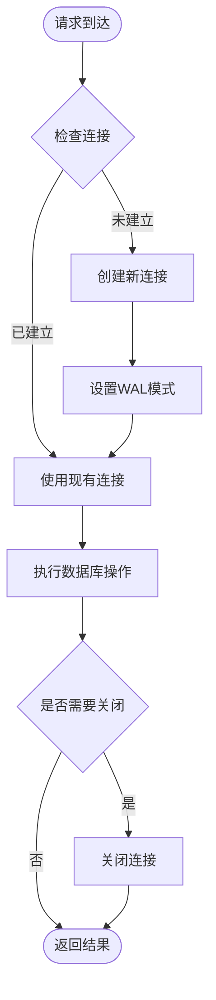
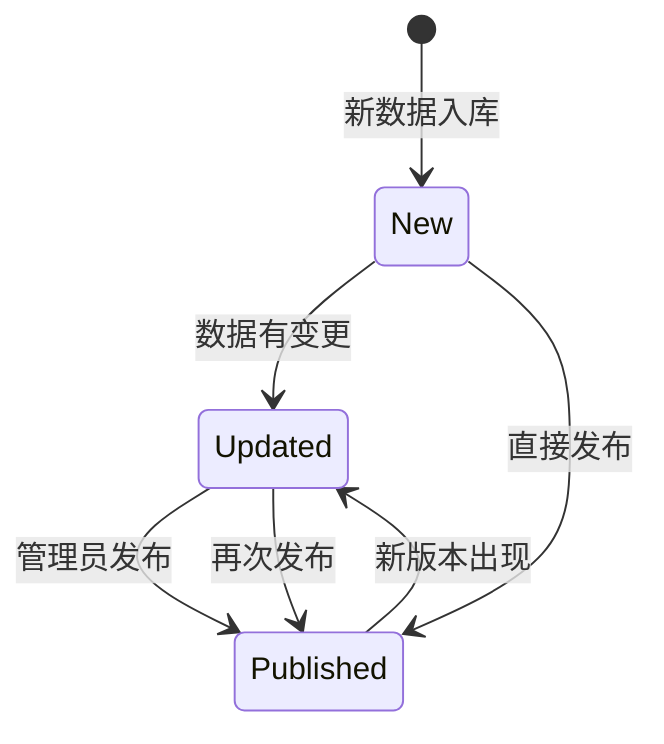
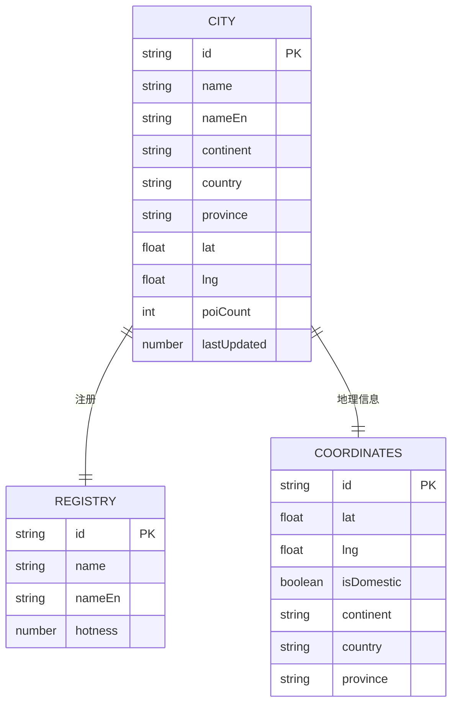
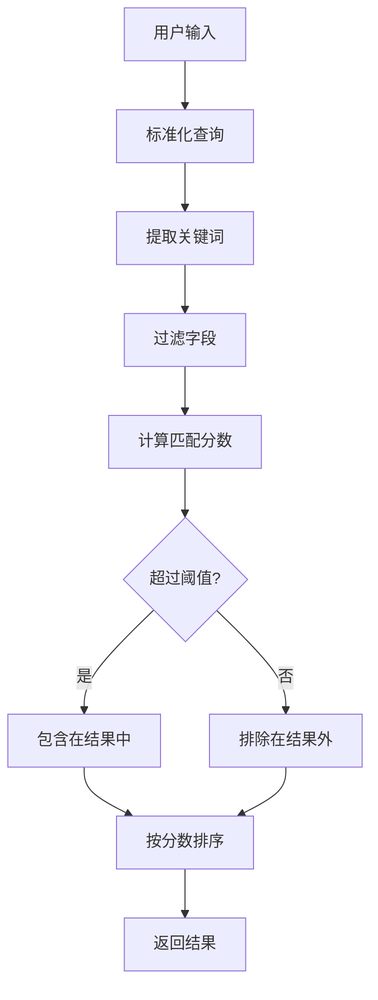
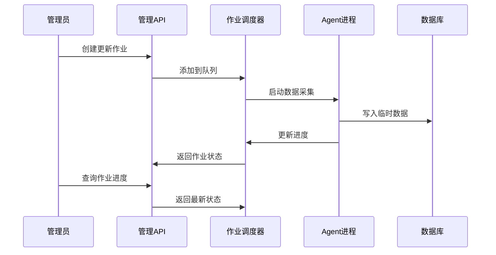
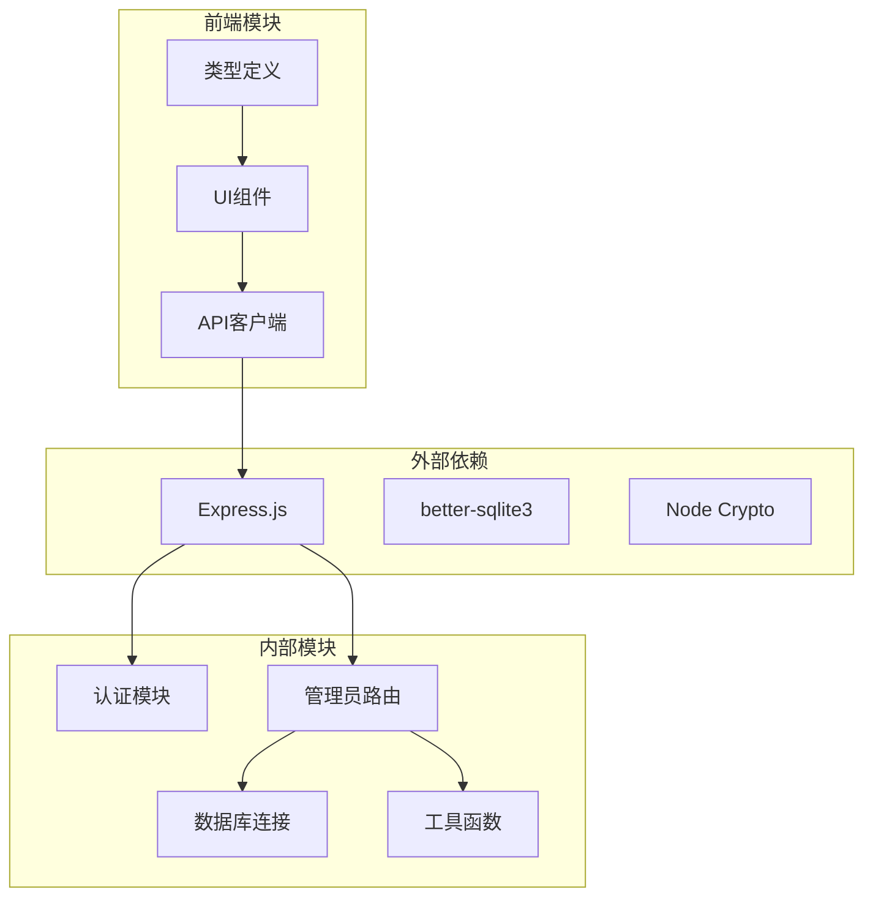

# 管理员路由系统

<cite>
**本文档引用的文件**
- [server/admin-routes.ts](file://server/admin-routes.ts)
- [server/auth.ts](file://server/auth.ts)
- [server/index.ts](file://server/index.ts)
- [admin/App.tsx](file://admin/App.tsx)
- [admin/main.tsx](file://admin/main.tsx)
- [admin/lib/api.ts](file://admin/lib/api.ts)
- [admin/pages/Dashboard.tsx](file://admin/pages/Dashboard.tsx)
- [admin/pages/Cities.tsx](file://admin/pages/Cities.tsx)
- [admin/pages/ReviewQueue.tsx](file://admin/pages/ReviewQueue.tsx)
- [admin/pages/PendingUpdates.tsx](file://admin/pages/PendingUpdates.tsx)
- [admin/types/index.ts](file://admin/types/index.ts)
- [admin/components/layout/AdminLayout.tsx](file://admin/components/layout/AdminLayout.tsx)
</cite>

## 目录
1. [简介](#简介)
2. [项目结构](#项目结构)
3. [核心组件](#核心组件)
4. [架构概览](#架构概览)
5. [详细组件分析](#详细组件分析)
6. [依赖关系分析](#依赖关系分析)
7. [性能考虑](#性能考虑)
8. [故障排除指南](#故障排除指南)
9. [结论](#结论)
10. [附录](#附录)

## 简介

管理员路由系统是一个专为旅行规划平台设计的后台管理系统，提供了完整的数据管理、内容审核和发布控制功能。该系统通过RESTful API接口和React前端界面，实现了对POI数据、城市信息、更新作业和发布流程的全面管理。

系统采用双数据库架构：Agent数据库存储原始采集数据，Server数据库存储最终发布数据。管理员可以通过直观的界面进行数据审核、批量发布和质量控制。

## 项目结构

项目采用前后端分离的架构设计，主要分为以下层次：

**图表来源**
- [server/index.ts:104](file://server/index.ts#L104)
- [admin/App.tsx:11](file://admin/App.tsx#L11)

**章节来源**
- [server/index.ts:1-790](file://server/index.ts#L1-L790)
- [admin/App.tsx:1-27](file://admin/App.tsx#L1-L27)

## 核心组件

### 管理员路由模块

管理员路由系统的核心是server/admin-routes.ts文件，它提供了完整的后台管理API：

#### 主要功能模块

1. **统计仪表板** - 提供系统整体运行状态和数据质量概览
2. **城市管理系统** - 支持城市信息的增删改查和地理坐标管理
3. **POI 浏览器** - 提供POI数据的查询、筛选和搜索功能
4. **审核队列** - 管理待审核的POI数据和发布流程
5. **更新作业** - 调度和监控数据采集任务
6. **发布控制系统** - 执行POI数据的发布和验证

#### 数据库架构

系统采用三层数据库架构：
- **Agent DB** - 存储原始采集数据和临时更新
- **Server DB** - 存储最终发布的生产数据
- **JSON 注册表** - 存储城市元数据和配置信息

**章节来源**
- [server/admin-routes.ts:1-800](file://server/admin-routes.ts#L1-L800)
- [server/admin-routes.ts:800-1476](file://server/admin-routes.ts#L800-L1476)

## 架构概览

管理员路由系统采用分层架构设计，确保了良好的可维护性和扩展性：

**图表来源**
- [server/admin-routes.ts:27](file://server/admin-routes.ts#L27)
- [server/auth.ts:87](file://server/auth.ts#L87)

**章节来源**
- [server/index.ts:102-105](file://server/index.ts#L102-L105)
- [admin/lib/api.ts:10](file://admin/lib/api.ts#L10)

## 详细组件分析

### 认证与授权机制

系统实现了基于JWT的认证机制，支持可选认证和强制认证两种模式：

#### 认证中间件设计

**图表来源**
- [server/auth.ts:87](file://server/auth.ts#L87)
- [server/auth.ts:102](file://server/auth.ts#L102)

#### 认证流程特点

1. **可选认证** - `optionalAuth`中间件允许匿名访问
2. **强制认证** - `requireAuth`中间件要求有效令牌
3. **令牌管理** - 支持7天有效期的JWT令牌
4. **密码安全** - 使用PBKDF2算法进行密码哈希

**章节来源**
- [server/auth.ts:1-133](file://server/auth.ts#L1-L133)

### 数据库连接管理

系统实现了智能的数据库连接策略，确保数据访问的可靠性和性能：

#### 数据库连接池

**图表来源**
- [server/admin-routes.ts:44](file://server/admin-routes.ts#L44)
- [server/admin-routes.ts:54](file://server/admin-routes.ts#L54)

#### 数据库特性

1. **只读连接** - Agent DB默认使用只读模式
2. **读写连接** - Server DB使用独立的读写连接
3. **WAL模式** - 启用Write-Ahead Logging提高并发性能
4. **自动清理** - 连接超时自动回收

**章节来源**
- [server/admin-routes.ts:38-62](file://server/admin-routes.ts#L38-L62)

### 审核队列系统

审核队列是管理员路由系统的核心功能之一，负责管理待审核的POI数据：

#### 审核状态管理

**图表来源**
- [admin/types/index.ts:201](file://admin/types/index.ts#L201)

#### 审核工作流

1. **数据比较** - 比较Agent DB和Server DB中的POI差异
2. **状态标记** - 标记新入库、更新和已发布状态
3. **批量处理** - 支持整城发布和按评分发布
4. **验证机制** - 发布后进行数据完整性验证

**章节来源**
- [server/admin-routes.ts:82](file://server/admin-routes.ts#L82)
- [admin/pages/ReviewQueue.tsx:1-619](file://admin/pages/ReviewQueue.tsx#L1-L619)

### 城市管理系统

城市管理系统提供了完整的城市信息管理功能：

#### 城市数据模型

**图表来源**
- [admin/types/index.ts:54](file://admin/types/index.ts#L54)
- [admin/types/index.ts:128](file://admin/types/index.ts#L128)

**章节来源**
- [server/admin-routes.ts:119-141](file://server/admin-routes.ts#L119-L141)
- [admin/pages/Cities.tsx:1-251](file://admin/pages/Cities.tsx#L1-L251)

### 搜索与过滤系统

系统实现了智能的POI搜索和过滤功能：

#### 搜索算法

**图表来源**
- [server/admin-routes.ts:406](file://server/admin-routes.ts#L406)

#### 搜索特性

1. **多语言支持** - 支持中文和英文搜索
2. **模糊匹配** - 支持前缀匹配和包含匹配
3. **权重计算** - 不同字段具有不同匹配权重
4. **实时过滤** - 支持分类、评分等多维度过滤

**章节来源**
- [server/admin-routes.ts:404-441](file://server/admin-routes.ts#L404-L441)

### 更新作业调度

系统提供了灵活的数据更新作业调度机制：

#### 作业生命周期

**图表来源**
- [server/admin-routes.ts:879](file://server/admin-routes.ts#L879)

#### 作业类型

1. **批量更新** - 针对特定地区或类目的大规模数据采集
2. **定向更新** - 针对特定POI的精确数据采集
3. **进度跟踪** - 实时监控数据采集进度
4. **错误处理** - 自动处理采集过程中的异常情况

**章节来源**
- [server/admin-routes.ts:858-961](file://server/admin-routes.ts#L858-L961)

## 依赖关系分析

管理员路由系统展现了清晰的依赖层次结构：

**图表来源**
- [server/index.ts:29](file://server/index.ts#L29)
- [admin/lib/api.ts:1](file://admin/lib/api.ts#L1)

**章节来源**
- [server/index.ts:49-53](file://server/index.ts#L49-L53)
- [admin/App.tsx:1](file://admin/App.tsx#L1)

## 性能考虑

管理员路由系统在设计时充分考虑了性能优化：

### 数据库优化策略

1. **连接池管理** - 智能复用数据库连接，减少连接开销
2. **WAL模式** - 启用Write-Ahead Logging提高并发性能
3. **索引优化** - 在常用查询字段上建立索引
4. **分页查询** - 默认限制每页50条记录，防止内存溢出

### 缓存策略

1. **只读连接** - Agent DB使用只读连接，提高查询性能
2. **批量操作** - 支持批量数据处理，减少数据库往返
3. **智能刷新** - 后台异步刷新，避免阻塞用户请求

### 前端性能优化

1. **懒加载** - 页面组件按需加载，减少初始加载时间
2. **虚拟滚动** - 大列表使用虚拟滚动技术
3. **状态缓存** - 关键数据在内存中缓存，减少网络请求

## 故障排除指南

### 常见问题及解决方案

#### 数据库连接问题

**问题症状**：API请求返回数据库连接错误
**可能原因**：
- Agent DB文件不存在
- 数据库文件损坏
- 权限不足

**解决步骤**：
1. 检查Agent DB文件是否存在
2. 验证数据库文件完整性
3. 确认文件权限设置

#### 认证失败问题

**问题症状**：管理员登录失败或令牌过期
**可能原因**：
- JWT密钥配置错误
- 令牌过期
- 网络时间不同步

**解决步骤**：
1. 检查JWT_SECRET环境变量
2. 验证系统时间同步
3. 重新生成管理员账户

#### 性能问题

**问题症状**：页面加载缓慢或API响应超时
**可能原因**：
- 数据库查询未优化
- 前端组件渲染过多
- 网络延迟过高

**解决步骤**：
1. 分析慢查询日志
2. 实施分页和缓存策略
3. 优化前端组件渲染

**章节来源**
- [server/admin-routes.ts:46](file://server/admin-routes.ts#L46)
- [server/auth.ts:10](file://server/auth.ts#L10)

## 结论

管理员路由系统是一个设计精良的后台管理解决方案，具有以下显著特点：

### 技术优势

1. **模块化设计** - 清晰的职责分离和依赖管理
2. **数据安全保障** - 双数据库架构确保数据完整性
3. **用户体验优秀** - 直观的界面和流畅的操作体验
4. **性能优化完善** - 多层次的性能优化策略

### 功能完整性

系统涵盖了现代旅行规划平台所需的所有管理功能：
- 数据采集和更新
- 内容审核和发布
- 用户管理和权限控制
- 系统监控和日志记录

### 扩展性考虑

系统设计充分考虑了未来的扩展需求：
- 插件化的数据源支持
- 可配置的审核流程
- 灵活的权限模型
- 可扩展的通知机制

## 附录

### API端点概览

管理员系统提供以下主要API端点：

| 功能类别 | HTTP方法 | 端点路径 | 功能描述 |
|---------|---------|----------|----------|
| 统计仪表板 | GET | `/api/admin/stats` | 获取系统统计数据 |
| 城市管理 | GET/POST/PUT/DELETE | `/api/admin/cities` | 城市信息管理 |
| 类目管理 | GET | `/api/admin/categories` | 获取类目树结构 |
| POI浏览 | GET | `/api/admin/pois` | POI列表查询 |
| POI搜索 | GET | `/api/admin/pois/search` | POI全局搜索 |
| POI详情 | GET | `/api/admin/pois/:id` | POI详细信息 |
| 更新作业 | POST/GET | `/api/admin/updates` | 作业调度和状态查询 |
| 审核队列 | GET | `/api/admin/review` | 审核数据查询 |
| 发布控制 | POST | `/api/admin/publish` | 数据发布操作 |

### 安全配置建议

1. **环境变量管理**
   - 设置强密码的JWT_SECRET
   - 配置HTTPS证书
   - 启用CORS白名单

2. **访问控制**
   - 实施IP白名单
   - 配置防火墙规则
   - 启用API速率限制

3. **数据保护**
   - 定期备份数据库
   - 实施审计日志
   - 加密敏感数据传输