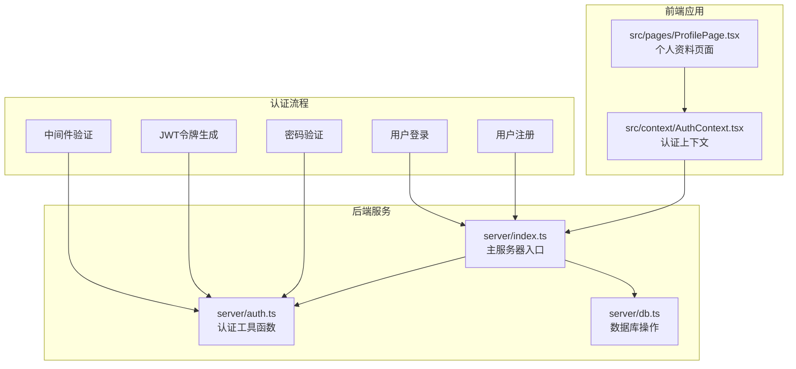
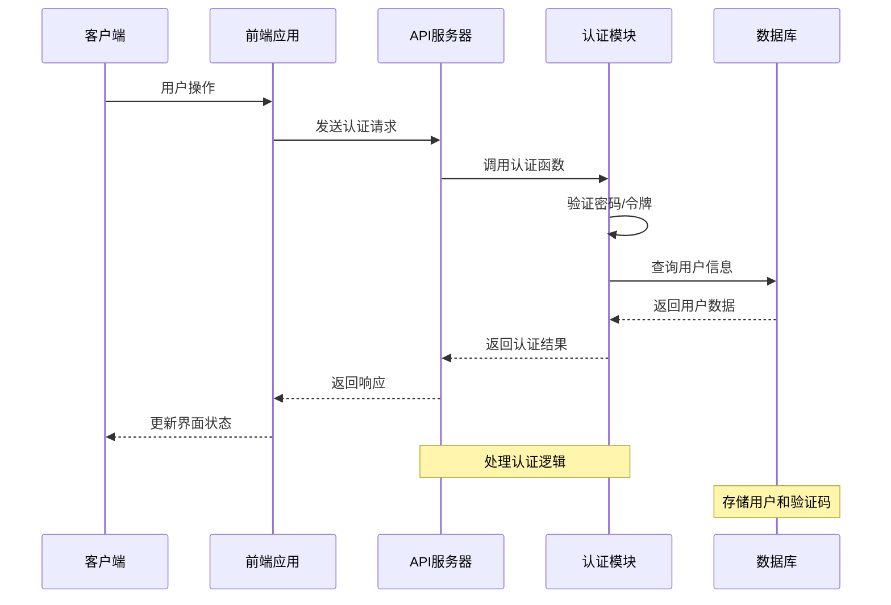
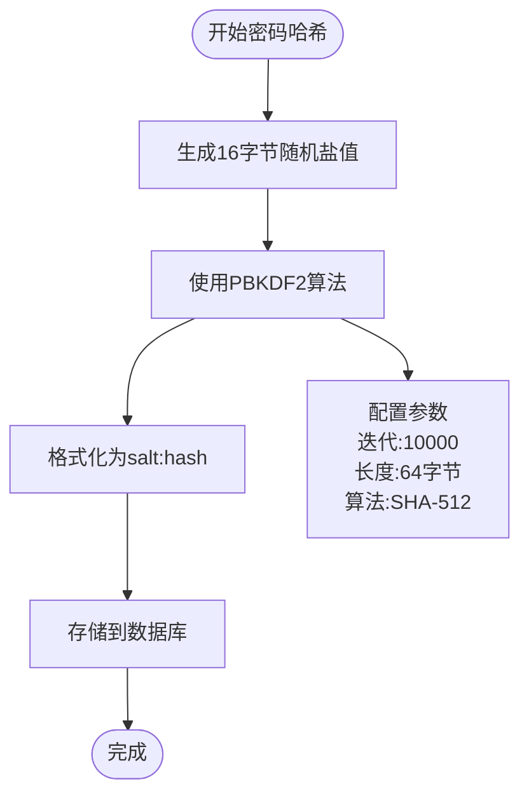
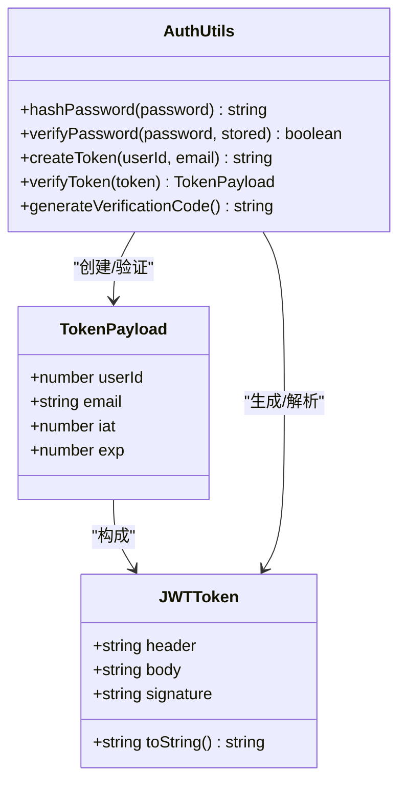
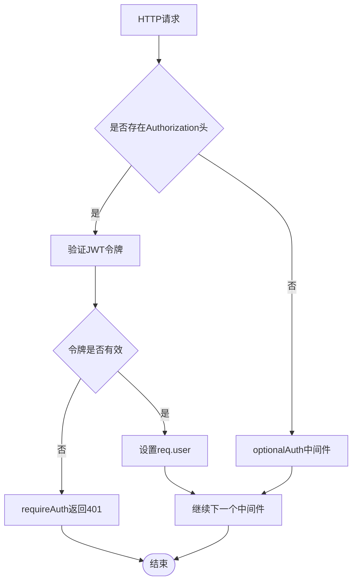
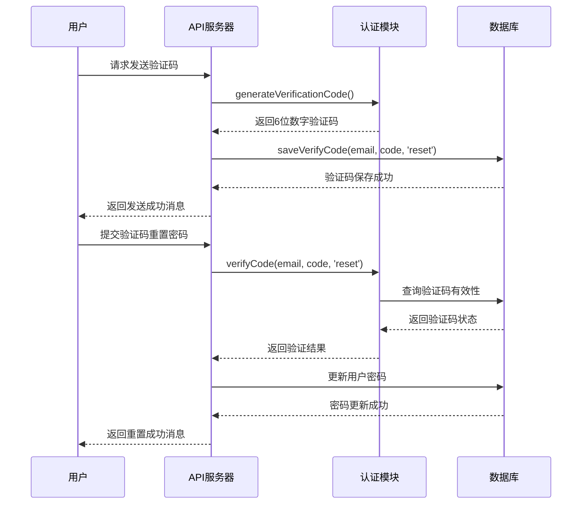
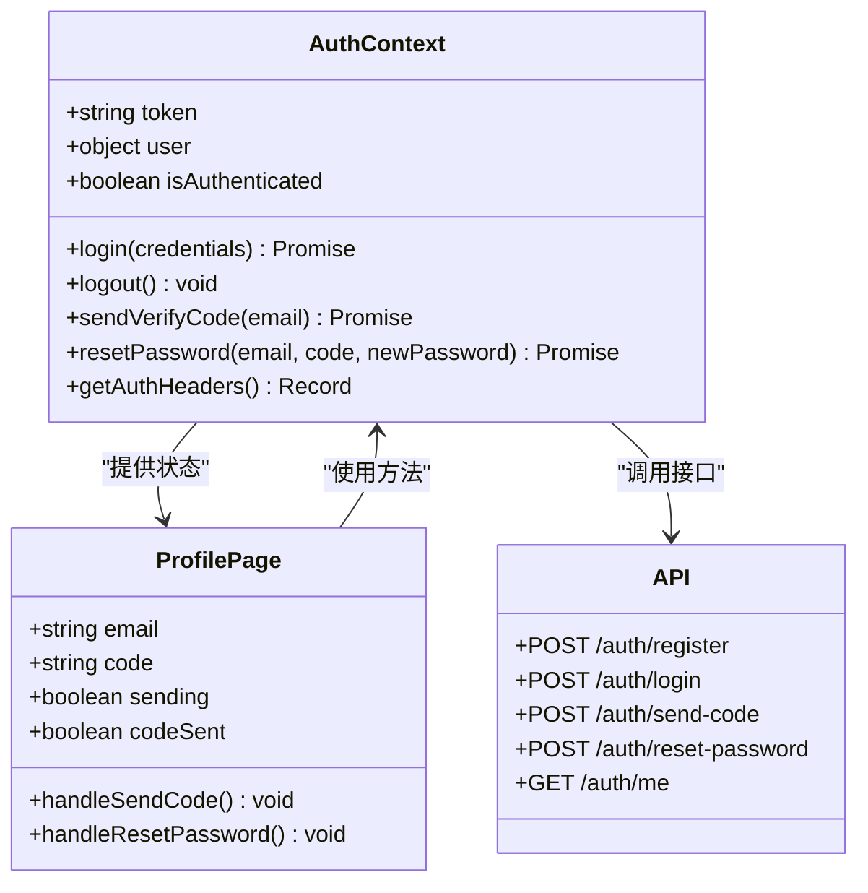
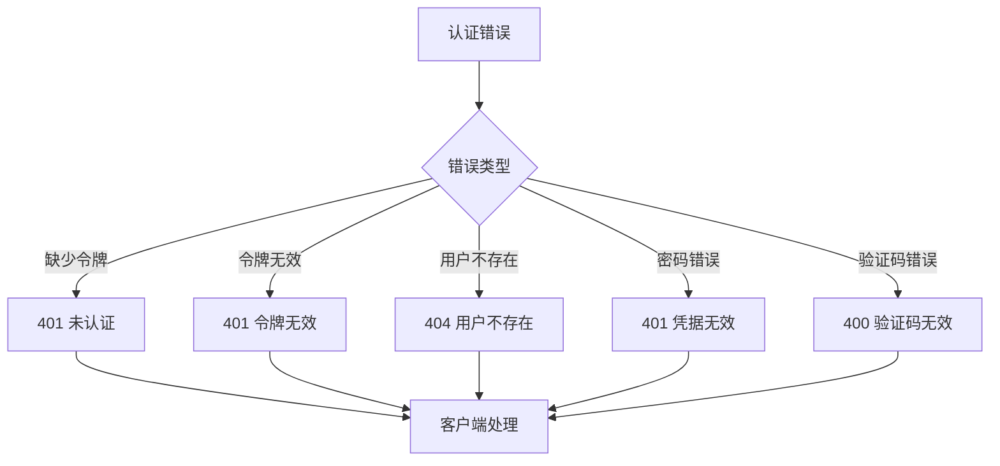

# 认证与授权系统

<cite>
**本文档引用的文件**
- [server/auth.ts](file://server/auth.ts)
- [server/index.ts](file://server/index.ts)
- [server/db.ts](file://server/db.ts)
- [src/context/AuthContext.tsx](file://src/context/AuthContext.tsx)
- [src/pages/ProfilePage.tsx](file://src/pages/ProfilePage.tsx)
</cite>

## 目录
1. [简介](#简介)
2. [项目结构](#项目结构)
3. [核心组件](#核心组件)
4. [架构概览](#架构概览)
5. [详细组件分析](#详细组件分析)
6. [依赖关系分析](#依赖关系分析)
7. [性能考虑](#性能考虑)
8. [故障排除指南](#故障排除指南)
9. [结论](#结论)
10. [附录](#附录)

## 简介

本项目实现了完整的认证与授权系统，基于JWT（JSON Web Token）技术构建。系统提供了用户注册、登录、密码加密和会话管理功能，并通过中间件实现访问控制。整个认证体系采用Node.js原生crypto模块实现，无需外部依赖，确保了系统的轻量化和安全性。

## 项目结构

认证与授权系统主要分布在以下目录中：



**图表来源**
- [server/index.ts:326-401](file://server/index.ts#L326-L401)
- [server/auth.ts:1-132](file://server/auth.ts#L1-L132)
- [server/db.ts:410-426](file://server/db.ts#L410-L426)

**章节来源**
- [server/index.ts:326-401](file://server/index.ts#L326-L401)
- [server/auth.ts:1-132](file://server/auth.ts#L1-L132)
- [server/db.ts:410-426](file://server/db.ts#L410-L426)

## 核心组件

### 密码哈希组件

系统使用PBKDF2算法配合随机盐值进行密码哈希，确保密码存储的安全性。

**章节来源**
- [server/auth.ts:15-33](file://server/auth.ts#L15-L33)

### JWT令牌组件

实现了完整的JWT令牌生成和验证机制，包括头部、载荷和签名的处理。

**章节来源**
- [server/auth.ts:35-81](file://server/auth.ts#L35-L81)

### 中间件组件

提供了两种认证中间件：requireAuth（强制认证）和optionalAuth（可选认证）。

**章节来源**
- [server/auth.ts:83-113](file://server/auth.ts#L83-L113)

### 验证码组件

实现了6位数字验证码的生成和验证功能，支持10分钟有效期。

**章节来源**
- [server/auth.ts:115-122](file://server/auth.ts#L115-L122)
- [server/db.ts:410-426](file://server/db.ts#L410-L426)

## 架构概览

认证系统的整体架构采用分层设计，从前端到后端形成完整的认证链路：



**图表来源**
- [server/index.ts:326-401](file://server/index.ts#L326-L401)
- [server/auth.ts:1-132](file://server/auth.ts#L1-L132)
- [server/db.ts:410-426](file://server/db.ts#L410-L426)

## 详细组件分析

### 密码哈希实现

系统采用PBKDF2算法进行密码哈希，具有以下特点：

- 使用16字节随机盐值
- 迭代次数：10000次
- 哈希长度：64字节
- 哈希算法：SHA-512
- 存储格式：`salt:hash`



**图表来源**
- [server/auth.ts:15-33](file://server/auth.ts#L15-L33)

**章节来源**
- [server/auth.ts:15-33](file://server/auth.ts#L15-L33)

### JWT令牌生成与验证

JWT令牌采用三段式结构：头部、载荷和签名。



**图表来源**
- [server/auth.ts:35-81](file://server/auth.ts#L35-L81)

**章节来源**
- [server/auth.ts:35-81](file://server/auth.ts#L35-L81)

### 认证中间件实现

系统提供两种中间件来处理不同的认证需求：

#### requireAuth中间件
- 强制要求有效的认证令牌
- 如果缺少令牌或令牌无效，返回401状态码
- 成功时在请求对象上设置用户信息

#### optionalAuth中间件
- 允许匿名访问
- 只有当存在有效令牌时才设置用户信息
- 不会阻止请求继续执行



**图表来源**
- [server/auth.ts:83-113](file://server/auth.ts#L83-L113)

**章节来源**
- [server/auth.ts:83-113](file://server/auth.ts#L83-L113)

### 验证码生成与验证流程

验证码系统支持用户密码重置功能：



**图表来源**
- [server/index.ts:369-401](file://server/index.ts#L369-L401)
- [server/auth.ts:115-122](file://server/auth.ts#L115-L122)
- [server/db.ts:410-426](file://server/db.ts#L410-L426)

**章节来源**
- [server/index.ts:369-401](file://server/index.ts#L369-L401)
- [server/auth.ts:115-122](file://server/auth.ts#L115-L122)
- [server/db.ts:410-426](file://server/db.ts#L410-L426)

### 前端认证集成

前端应用通过AuthContext提供统一的认证状态管理：



**图表来源**
- [src/context/AuthContext.tsx:143-174](file://src/context/AuthContext.tsx#L143-L174)
- [src/pages/ProfilePage.tsx:535-549](file://src/pages/ProfilePage.tsx#L535-L549)

**章节来源**
- [src/context/AuthContext.tsx:143-174](file://src/context/AuthContext.tsx#L143-L174)
- [src/pages/ProfilePage.tsx:535-549](file://src/pages/ProfilePage.tsx#L535-L549)

## 依赖关系分析

认证系统的依赖关系清晰明确，各组件职责分离：

```mermaid
graph LR
subgraph "认证核心"
A[hashPassword]
B[verifyPassword]
C[createToken]
D[verifyToken]
E[generateVerificationCode]
end
subgraph "中间件"
F[requireAuth]
G[optionalAuth]
end
subgraph "API路由"
H[/api/auth/register]
I[/api/auth/login]
J[/api/auth/me]
K[/api/auth/send-code]
L[/api/auth/reset-password]
end
subgraph "数据库"
M[users表]
N[verify_codes表]
end
A --> H
B --> I
C --> H
C --> I
C --> J
E --> K
F --> J
F --> H
F --> I
G --> J
H --> M
I --> M
J --> M
K --> N
L --> M
L --> N
```

**图表来源**
- [server/auth.ts:1-132](file://server/auth.ts#L1-L132)
- [server/index.ts:326-401](file://server/index.ts#L326-L401)
- [server/db.ts:410-426](file://server/db.ts#L410-L426)

**章节来源**
- [server/auth.ts:1-132](file://server/auth.ts#L1-L132)
- [server/index.ts:326-401](file://server/index.ts#L326-L401)
- [server/db.ts:410-426](file://server/db.ts#L410-L426)

## 性能考虑

### 密码哈希性能
- PBKDF2迭代次数：10000次，平衡了安全性与性能
- 建议在生产环境中根据硬件性能调整迭代次数
- 可考虑使用更现代的密码哈希算法如bcrypt或scrypt

### JWT令牌优化
- 令牌有效期：7天，可根据业务需求调整
- 建议实现令牌刷新机制，避免频繁重新登录
- 考虑使用短期访问令牌和长期刷新令牌的组合

### 数据库查询优化
- 验证码查询添加了索引条件（email, code, type）
- 建议为users表的email字段建立唯一索引
- 考虑实现验证码缓存机制减少数据库查询

## 故障排除指南

### 常见认证问题

#### 令牌过期问题
**症状**：用户登录后一段时间出现401错误
**解决方案**：
- 检查JWT_SECRET环境变量配置
- 验证系统时间同步
- 实现自动刷新令牌机制

#### 密码验证失败
**症状**：用户无法登录，提示密码错误
**排查步骤**：
1. 检查密码哈希存储格式
2. 验证PBKDF2参数一致性
3. 确认数据库连接正常

#### 验证码无效
**症状**：验证码发送成功但无法重置密码
**排查步骤**：
1. 验证验证码有效期（10分钟）
2. 检查验证码是否被标记为已使用
3. 确认数据库中验证码记录正确

### 错误处理最佳实践



**章节来源**
- [server/index.ts:326-401](file://server/index.ts#L326-L401)
- [server/auth.ts:83-113](file://server/auth.ts#L83-L113)

## 结论

本认证与授权系统实现了完整的用户身份验证和授权管理功能。系统采用JWT技术确保了无状态认证，结合PBKDF2密码哈希保证了密码存储安全。通过中间件机制实现了灵活的访问控制，支持强制认证和可选认证场景。

系统的主要优势包括：
- 基于Node.js原生模块，无需额外依赖
- 清晰的分层架构和职责分离
- 完整的错误处理和状态码定义
- 前后端一体化的认证状态管理

建议的改进方向：
- 实现更强大的密码哈希算法
- 添加令牌刷新和撤销机制
- 增强日志记录和监控能力
- 实现多因素认证支持

## 附录

### API接口规范

| 接口 | 方法 | 功能 | 认证要求 |
|------|------|------|----------|
| `/api/auth/register` | POST | 用户注册 | 无 |
| `/api/auth/login` | POST | 用户登录 | 无 |
| `/api/auth/me` | GET | 获取当前用户信息 | requireAuth |
| `/api/auth/send-code` | POST | 发送验证码 | 无 |
| `/api/auth/reset-password` | POST | 重置密码 | 无 |
| `/api/auth/nickname` | PUT | 修改昵称 | requireAuth |

### 安全最佳实践

1. **环境配置**
   - 设置强JWT_SECRET密钥
   - 启用HTTPS传输
   - 配置适当的CORS策略

2. **密码安全**
   - 定期更新PBKDF2参数
   - 实施密码强度检查
   - 添加账户锁定机制

3. **令牌管理**
   - 实现令牌刷新机制
   - 添加令牌撤销列表
   - 监控异常登录行为

4. **数据保护**
   - 加密敏感数据存储
   - 实施SQL注入防护
   - 定期备份和恢复测试