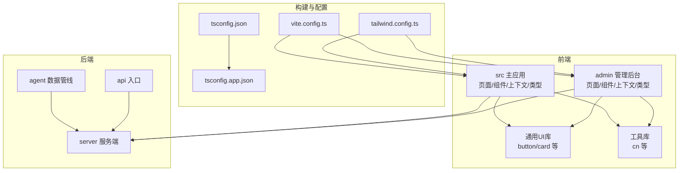
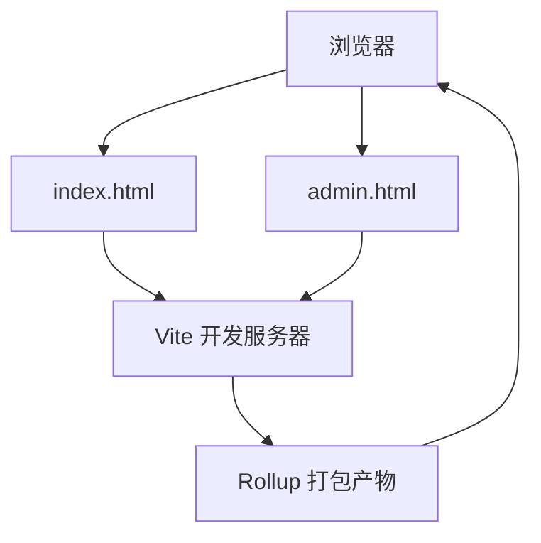
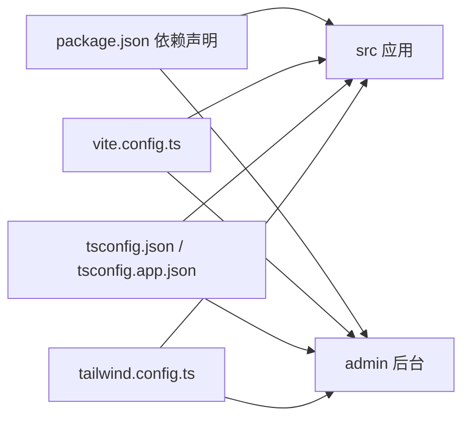

# 代码规范与风格

<cite>
**本文引用的文件**
- [package.json](file://package.json)
- [tsconfig.json](file://tsconfig.json)
- [tsconfig.app.json](file://tsconfig.app.json)
- [tailwind.config.ts](file://tailwind.config.ts)
- [vite.config.ts](file://vite.config.ts)
- [src/types/index.ts](file://src/types/index.ts)
- [admin/types/index.ts](file://admin/types/index.ts)
- [src/components/ui/button.tsx](file://src/components/ui/button.tsx)
- [admin/components/ui/button.tsx](file://admin/components/ui/button.tsx)
- [src/App.tsx](file://src/App.tsx)
- [admin/App.tsx](file://admin/App.tsx)
- [src/main.tsx](file://src/main.tsx)
- [admin/main.tsx](file://admin/main.tsx)
- [src/context/AppContext.tsx](file://src/context/AppContext.tsx)
- [src/context/AuthContext.tsx](file://src/context/AuthContext.tsx)
- [src/pages/HomePage.tsx](file://src/pages/HomePage.tsx)
- [admin/pages/Dashboard.tsx](file://admin/pages/Dashboard.tsx)
- [src/lib/utils.ts](file://src/lib/utils.ts)
- [admin/lib/utils.ts](file://admin/lib/utils.ts)
</cite>

## 目录
1. [引言](#引言)
2. [项目结构](#项目结构)
3. [核心组件](#核心组件)
4. [架构总览](#架构总览)
5. [详细组件分析](#详细组件分析)
6. [依赖分析](#依赖分析)
7. [性能考虑](#性能考虑)
8. [故障排查指南](#故障排查指南)
9. [结论](#结论)
10. [附录](#附录)

## 引言
本指南面向旅行规划Demo项目的前端与全栈团队，旨在统一TypeScript编码、React组件开发、文件组织与模块化、样式编写（含Tailwind CSS）、Git提交与分支管理、代码审查与质量门禁，以及自动化格式化与静态分析工具配置。目标是提升可读性、可维护性与协作效率。

## 项目结构
项目采用多包/多入口架构：主应用与管理后台分别在不同入口构建，共享类型定义与通用工具库。核心目录与职责如下：
- src：主应用（React + Vite），包含页面、组件、上下文、类型、工具等
- admin：管理后台（React + Vite），独立路由与页面
- server：后端服务（TypeScript + Express）
- agent：数据采集与处理流水线（TypeScript）
- api：API入口（TypeScript）
- 资源与脚本：public资源、数据库同步脚本、发布脚本等

图表来源
- [vite.config.ts:1-46](file://vite.config.ts#L1-L46)
- [tsconfig.json:1-6](file://tsconfig.json#L1-L6)
- [tsconfig.app.json](file://tsconfig.app.json)
- [tailwind.config.ts:1-139](file://tailwind.config.ts#L1-L139)

章节来源
- [vite.config.ts:1-46](file://vite.config.ts#L1-L46)
- [tsconfig.json:1-6](file://tsconfig.json#L1-L6)
- [tsconfig.app.json](file://tsconfig.app.json)
- [tailwind.config.ts:1-139](file://tailwind.config.ts#L1-L139)

## 核心组件
- 类型系统：在 src/types 与 admin/types 中集中定义业务模型与API响应类型，确保前后端一致
- UI组件：基于 Tailwind CSS 与 class-variance-authority 的变体模式，提供按钮、卡片等基础组件
- 上下文：AppContext 统一管理旅行行程状态；AuthContext 管理认证态与API头
- 页面：按功能拆分页面组件，Home、Planner、Overview、Journal 等
- 工具：cn 统一封装 clsx 与 tailwind-merge，避免重复类名冲突

章节来源
- [src/types/index.ts:1-239](file://src/types/index.ts#L1-L239)
- [admin/types/index.ts:1-277](file://admin/types/index.ts#L1-L277)
- [src/components/ui/button.tsx:1-51](file://src/components/ui/button.tsx#L1-L51)
- [admin/components/ui/button.tsx:1-43](file://admin/components/ui/button.tsx#L1-L43)
- [src/context/AppContext.tsx:1-234](file://src/context/AppContext.tsx#L1-L234)
- [src/context/AuthContext.tsx:1-218](file://src/context/AuthContext.tsx#L1-L218)
- [src/lib/utils.ts:1-6](file://src/lib/utils.ts#L1-L6)
- [admin/lib/utils.ts:1-7](file://admin/lib/utils.ts#L1-L7)

## 架构总览
应用通过 Vite 构建，主应用与管理后台分别打包；Tailwind CSS 提供原子化样式；React Router 控制页面导航；上下文与API交互贯穿前端与后端。

图表来源
- [vite.config.ts:20-45](file://vite.config.ts#L20-L45)
- [src/main.tsx:1-10](file://src/main.tsx#L1-L10)
- [admin/main.tsx:1-14](file://admin/main.tsx#L1-L14)

章节来源
- [vite.config.ts:1-46](file://vite.config.ts#L1-L46)
- [src/main.tsx:1-10](file://src/main.tsx#L1-L10)
- [admin/main.tsx:1-14](file://admin/main.tsx#L1-L14)

## 详细组件分析

### TypeScript 编码规范
- 类型定义
  - 使用接口描述对象结构，联合类型表达枚举值域
  - 可选字段使用 ? 后缀，避免冗余 null 判断
  - 示例路径：[src/types/index.ts:1-239](file://src/types/index.ts#L1-L239)、[admin/types/index.ts:1-277](file://admin/types/index.ts#L1-L277)
- 接口设计
  - 将“评分/状态”等语义化类型抽离为专用类型或常量，便于复用与校验
  - 示例路径：[src/types/index.ts:36-36](file://src/types/index.ts#L36-L36)、[admin/types/index.ts:101-102](file://admin/types/index.ts#L101-L102)
- 命名约定
  - 类型名首字母大写（Interface/Type）
  - 常量名全大写下划线分隔
  - 函数/变量名驼峰
  - 文件名与导出组件同名，便于IDE识别
- 泛型与工具
  - 使用 React.FC、React.PropsWithChildren 等明确组件签名
  - 使用 Partial、Pick、Omit 等映射类型减少样板代码

章节来源
- [src/types/index.ts:1-239](file://src/types/index.ts#L1-L239)
- [admin/types/index.ts:1-277](file://admin/types/index.ts#L1-L277)

### React 组件开发规范
- 函数组件优先，结合 Hooks 管理状态与副作用
  - 使用 useMemo/useCallback 缓存计算结果与回调，降低重渲染
  - 示例路径：[src/pages/HomePage.tsx:49-56](file://src/pages/HomePage.tsx#L49-L56)
- Props 传递
  - 明确子组件 Props 类型，避免 any
  - 使用解构默认值与可选链，提升健壮性
- 上下文使用
  - AppContext 管理行程全局状态；AuthContext 管理用户态与鉴权头
  - 示例路径：[src/context/AppContext.tsx:22-42](file://src/context/AppContext.tsx#L22-L42)、[src/context/AuthContext.tsx:25-41](file://src/context/AuthContext.tsx#L25-L41)
- 组件拆分
  - 将复杂页面拆分为多个子组件，保持单一职责
  - 示例路径：[src/pages/HomePage.tsx:495-688](file://src/pages/HomePage.tsx#L495-L688)

章节来源
- [src/pages/HomePage.tsx:1-688](file://src/pages/HomePage.tsx#L1-L688)
- [src/context/AppContext.tsx:1-234](file://src/context/AppContext.tsx#L1-L234)
- [src/context/AuthContext.tsx:1-218](file://src/context/AuthContext.tsx#L1-L218)

### 文件组织与模块化原则
- 按功能域划分：components、pages、context、types、lib
- 通用UI组件集中于 ui 子目录，避免重复实现
- 类型定义集中于 types/index.ts，避免跨模块重复
- 工具函数集中于 lib，统一导出与复用
- 示例路径：[src/components/ui/button.tsx:1-51](file://src/components/ui/button.tsx#L1-L51)、[src/lib/utils.ts:1-6](file://src/lib/utils.ts#L1-L6)

章节来源
- [src/components/ui/button.tsx:1-51](file://src/components/ui/button.tsx#L1-L51)
- [src/lib/utils.ts:1-6](file://src/lib/utils.ts#L1-L6)

### CSS 与 Tailwind CSS 规范
- 原子化优先：使用 Tailwind 原子类组合样式，减少自定义CSS
- 变体组件：通过 class-variance-authority 定义变体，统一风格
  - 示例路径：[src/components/ui/button.tsx:5-32](file://src/components/ui/button.tsx#L5-L32)、[admin/components/ui/button.tsx:5-29](file://admin/components/ui/button.tsx#L5-L29)
- 工具函数：cn 统一合并类名，避免冲突
  - 示例路径：[src/lib/utils.ts:4-6](file://src/lib/utils.ts#L4-L6)、[admin/lib/utils.ts:4-6](file://admin/lib/utils.ts#L4-L6)
- 主题与动画：在 tailwind.config.ts 中集中扩展颜色、圆角、阴影与动画
  - 示例路径：[tailwind.config.ts:20-134](file://tailwind.config.ts#L20-L134)

章节来源
- [src/components/ui/button.tsx:1-51](file://src/components/ui/button.tsx#L1-L51)
- [admin/components/ui/button.tsx:1-43](file://admin/components/ui/button.tsx#L1-L43)
- [src/lib/utils.ts:1-6](file://src/lib/utils.ts#L1-L6)
- [admin/lib/utils.ts:1-7](file://admin/lib/utils.ts#L1-L7)
- [tailwind.config.ts:1-139](file://tailwind.config.ts#L1-L139)

### Git 提交消息与分支命名
- 分支命名
  - 功能开发：feature/简要描述
  - 修复：fix/简要描述
  - 文档：docs/简要描述
  - 样式：style/简要描述
  - 重构：refactor/简要描述
- 提交信息
  - 类型: 简要描述
  - 正文: 背景/动机/变更点
  - 关联 Issue: closes #xxx

[本节为通用规范说明，不直接分析具体文件]

### 代码审查检查清单与质量门禁
- 类型安全
  - 是否存在 any 或 unknown 的滥用
  - Props 与状态是否具备完整类型约束
- 组件设计
  - 是否遵循单一职责
  - 是否过度渲染（缺少 useMemo/useCallback）
- 样式一致性
  - 是否使用 Tailwind 原子类
  - 是否复用 UI 组件而非重复实现
- 上下文与副作用
  - 是否正确使用上下文
  - 是否在 useEffect 中清理副作用
- 可测试性
  - 是否易于拆分与单元测试
- 文档与注释
  - 复杂逻辑是否有必要注释
  - 类型与接口是否有清晰注释

[本节为通用规范说明，不直接分析具体文件]

### 自动化代码格式化与静态分析
- 格式化
  - 使用 Prettier（建议）或 TSC 配置统一缩进与引号
- 类型检查
  - 在 CI 中执行 tsc --noEmit
- ESLint（建议）
  - 结合 @typescript-eslint 与 react-hooks 规则
- 依赖扫描
  - 使用 npm audit 或类似工具定期扫描安全风险

[本节为通用规范说明，不直接分析具体文件]

## 依赖分析
- 构建与运行
  - Vite 作为开发与打包工具，配置别名与代理
  - 示例路径：[vite.config.ts:20-45](file://vite.config.ts#L20-L45)
- 类型与TS
  - tsconfig.json 引用 tsconfig.app.json，隔离应用与服务端配置
  - 示例路径：[tsconfig.json:1-6](file://tsconfig.json#L1-L6)
- 样式与主题
  - Tailwind CSS 与插件，集中主题扩展
  - 示例路径：[tailwind.config.ts:1-139](file://tailwind.config.ts#L1-L139)
- 前端依赖
  - React、React Router、Framer Motion、Leaflet、Lucide 等
  - 示例路径：[package.json:26-58](file://package.json#L26-L58)

图表来源
- [package.json:1-59](file://package.json#L1-L59)
- [vite.config.ts:1-46](file://vite.config.ts#L1-L46)
- [tsconfig.json:1-6](file://tsconfig.json#L1-L6)
- [tailwind.config.ts:1-139](file://tailwind.config.ts#L1-L139)

章节来源
- [package.json:1-59](file://package.json#L1-L59)
- [vite.config.ts:1-46](file://vite.config.ts#L1-L46)
- [tsconfig.json:1-6](file://tsconfig.json#L1-L6)
- [tailwind.config.ts:1-139](file://tailwind.config.ts#L1-L139)

## 性能考虑
- 渲染优化
  - 使用 useMemo/useCallback 缓存昂贵计算与回调
  - 拆分子组件，避免无关重渲染
- 资源加载
  - 图片懒加载与尺寸适配
  - 路由级代码分割（Vite 支持）
- 状态管理
  - 将大对象拆分，避免整块替换
  - 使用上下文最小化订阅范围
- 样式
  - 避免动态拼接类名，优先使用变体组件
  - 合理使用动画与阴影，避免过度绘制

[本节提供通用指导，不直接分析具体文件]

## 故障排查指南
- 构建问题
  - 检查 vite.config.ts 中的别名与代理配置
  - 确认多入口输入与输出路径
- 类型错误
  - 在 tsconfig.app.json 中启用严格模式与合理规则
  - 确保类型文件被引用
- 样式异常
  - 检查 tailwind.config.ts 的 content 路径与主题扩展
  - 确认 cn 工具函数正确合并类名
- 认证与API
  - 检查 AuthContext 的 token 存储与请求头
  - 确认后端代理地址与跨域设置

章节来源
- [vite.config.ts:1-46](file://vite.config.ts#L1-L46)
- [tsconfig.app.json](file://tsconfig.app.json)
- [tailwind.config.ts:1-139](file://tailwind.config.ts#L1-L139)
- [src/lib/utils.ts:1-6](file://src/lib/utils.ts#L1-L6)
- [src/context/AuthContext.tsx:1-218](file://src/context/AuthContext.tsx#L1-L218)

## 结论
通过统一的TypeScript类型体系、React组件规范、Tailwind CSS样式策略、文件组织与模块化原则，以及完善的Git流程与质量门禁，旅行规划Demo项目可在保证开发效率的同时，持续提升代码质量与可维护性。建议在团队内定期回顾与更新本规范，确保与最佳实践同步。

## 附录
- 快速参考
  - 类型定义：src/types 与 admin/types
  - UI组件：src/components/ui 与 admin/components/ui
  - 上下文：src/context
  - 工具：src/lib 与 admin/lib
  - 构建：vite.config.ts、tsconfig.*、tailwind.config.ts
  - 运行：package.json scripts