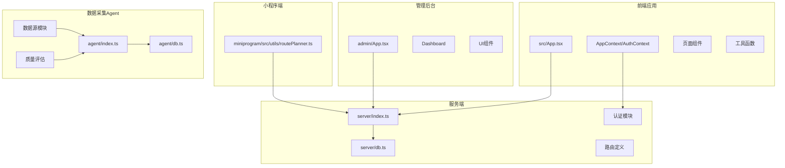
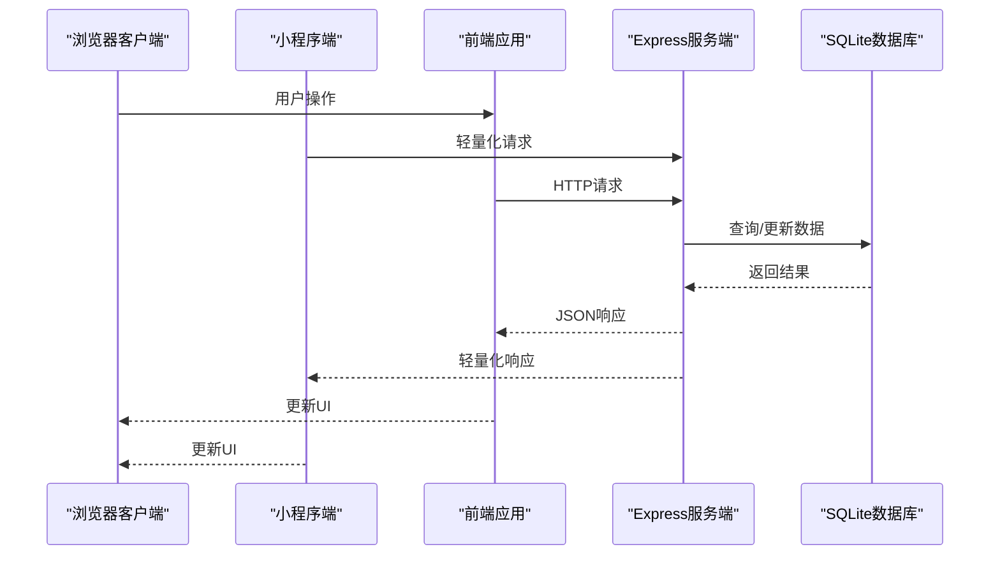
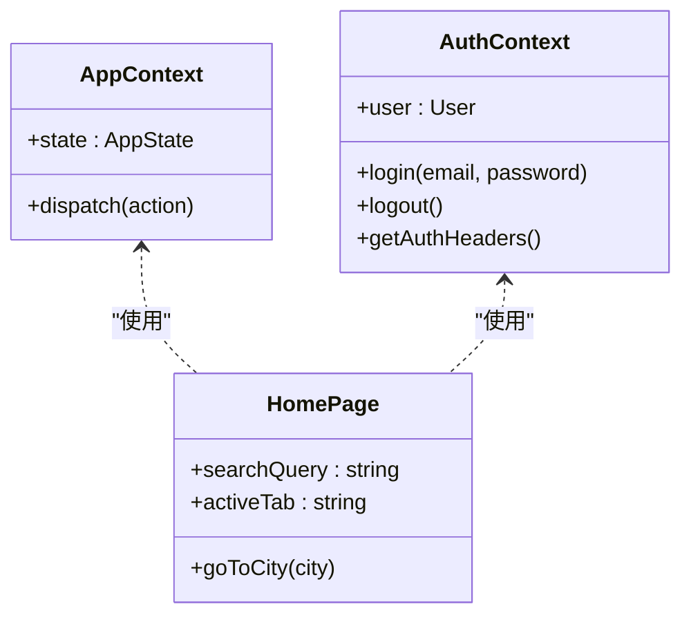
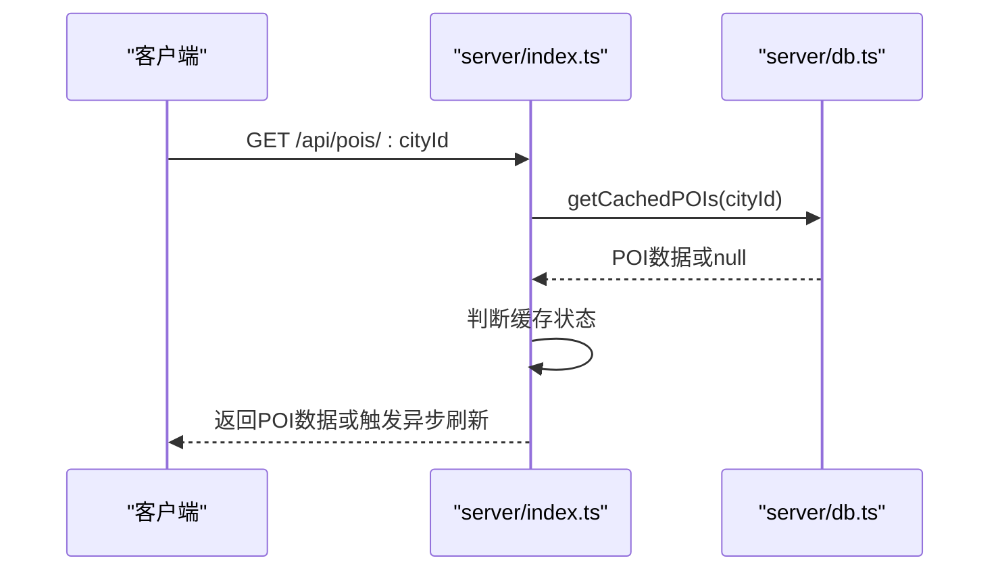
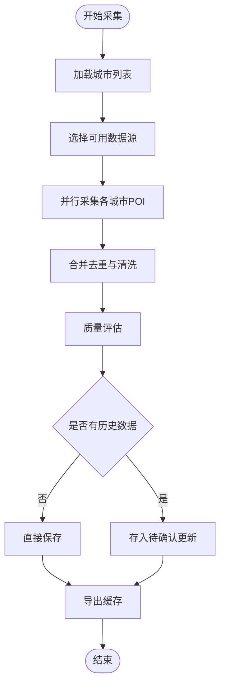
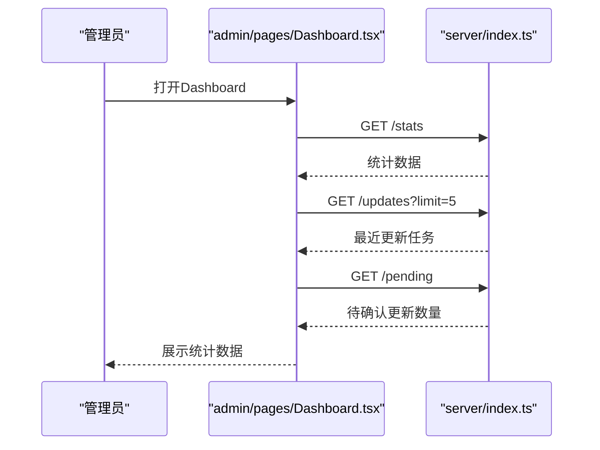
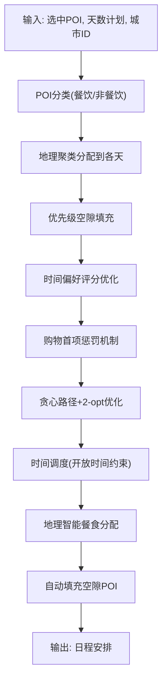
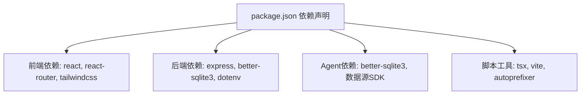

# 开发工作流程

<cite>
**本文档引用的文件**
- [package.json](file://package.json)
- [vite.config.ts](file://vite.config.ts)
- [server/index.ts](file://server/index.ts)
- [server/db.ts](file://server/db.ts)
- [agent/index.ts](file://agent/index.ts)
- [agent/db.ts](file://agent/db.ts)
- [api/index.ts](file://api/index.ts)
- [src/App.tsx](file://src/App.tsx)
- [src/context/AppContext.tsx](file://src/context/AppContext.tsx)
- [src/context/AuthContext.tsx](file://src/context/AuthContext.tsx)
- [src/types/index.ts](file://src/types/index.ts)
- [src/pages/HomePage.tsx](file://src/pages/HomePage.tsx)
- [src/utils/routePlanner.ts](file://src/utils/routePlanner.ts)
- [miniprogram/src/utils/routePlanner.ts](file://miniprogram/src/utils/routePlanner.ts)
- [admin/App.tsx](file://admin/App.tsx)
- [admin/pages/Dashboard.tsx](file://admin/pages/Dashboard.tsx)
- [wiki/principles.md](file://wiki/principles.md)
- [wiki/review-guide.md](file://wiki/review-guide.md)
</cite>

## 目录
1. [简介](#简介)
2. [项目结构](#项目结构)
3. [核心组件](#核心组件)
4. [架构概览](#架构概览)
5. [详细组件分析](#详细组件分析)
6. [依赖关系分析](#依赖关系分析)
7. [性能考虑](#性能考虑)
8. [故障排查指南](#故障排查指南)
9. [结论](#结论)
10. [附录](#附录)

## 简介
本文件为旅行规划Demo建立标准化的开发工作流程，覆盖从需求分析到代码交付的完整流程。文档详细说明任务分解、代码探索和方案设计的方法论，并提供日常开发的8步工作流程：接收需求→拆解任务→探索代码→方案设计→UI设计→编码实现→本地测试→代码提交。同时包含代码审查标准、版本控制策略、分支管理规范、持续集成与自动化测试配置方法，以及开发过程中的沟通协作规范与问题升级机制。

## 项目结构
该项目采用前后端分离架构，前端使用React + Vite，后端基于Express + SQLite，Agent负责POI数据采集与处理，Admin提供数据治理界面。项目采用Monorepo风格的多包组织，核心模块包括：
- 前端应用（src/）：用户交互界面、路由、上下文、页面组件
- 小程序端（miniprogram/）：移动端轻量化实现，复用核心算法
- 管理后台（admin/）：POI治理、数据审核、统计面板
- 服务端（server/）：REST API、数据库操作、认证授权
- 数据采集Agent（agent/）：多数据源采集、合并去重、质量评估
- 工具脚本（scripts/）：数据同步、导出、部署脚本
- 文档与规范（wiki/）：分类原则、审核指南、开发原则

**图表来源**
- [src/App.tsx:1-62](file://src/App.tsx#L1-L62)
- [miniprogram/src/utils/routePlanner.ts:207-238](file://miniprogram/src/utils/routePlanner.ts#L207-L238)
- [admin/App.tsx:1-27](file://admin/App.tsx#L1-L27)
- [server/index.ts:1-790](file://server/index.ts#L1-L790)
- [agent/index.ts:1-800](file://agent/index.ts#L1-L800)

**章节来源**
- [package.json:1-59](file://package.json#L1-L59)
- [vite.config.ts:1-46](file://vite.config.ts#L1-L46)

## 核心组件
- 应用入口与路由：前端通过App.tsx统一管理视图切换，结合React Router实现页面导航；管理后台独立路由体系，提供Dashboard等管理页面。
- 上下文系统：AppContext集中管理行程规划状态（当前视图、行程数据、选中地点等），AuthContext负责用户认证状态与API请求头管理。
- 服务端API：Express服务提供REST接口，支持POI查询、行程管理、用户认证、评论系统、酒店预订等功能；SQLite作为持久化存储。
- Agent数据管道：多数据源采集（OSM、Google、高德、AI等），合并去重，质量评估，增量更新，导出缓存。
- 路线规划算法：智能行程生成，包含POI分类、地理聚类、贪心路径搜索、2-opt优化、餐食插入与自动填充等核心算法。
- 工具函数：类型定义、UI工具类、路线规划算法等。

**章节来源**
- [src/App.tsx:1-62](file://src/App.tsx#L1-L62)
- [src/context/AppContext.tsx:1-234](file://src/context/AppContext.tsx#L1-L234)
- [src/context/AuthContext.tsx:1-218](file://src/context/AuthContext.tsx#L1-L218)
- [server/index.ts:1-790](file://server/index.ts#L1-L790)
- [agent/index.ts:1-800](file://agent/index.ts#L1-L800)
- [src/utils/routePlanner.ts:1-800](file://src/utils/routePlanner.ts#L1-L800)
- [miniprogram/src/utils/routePlanner.ts:207-238](file://miniprogram/src/utils/routePlanner.ts#L207-L238)

## 架构概览
系统采用分层架构：
- 表现层：React前端应用、小程序端与管理后台
- 业务层：Express服务端API，处理业务逻辑与数据访问
- 数据层：SQLite数据库，分别存储用户数据、行程数据、POI缓存、评论、预订等
- 数据采集层：Agent独立进程，负责POI数据的采集、清洗、合并与导出

**图表来源**
- [server/index.ts:108-144](file://server/index.ts#L108-L144)
- [server/db.ts:237-261](file://server/db.ts#L237-L261)
- [miniprogram/src/utils/routePlanner.ts:207-238](file://miniprogram/src/utils/routePlanner.ts#L207-L238)

## 详细组件分析

### 前端应用组件分析
前端应用通过App.tsx统一管理视图切换，结合AppContext与AuthContext实现状态管理与认证控制。页面组件负责具体的用户交互，工具函数提供通用能力。

**图表来源**
- [src/context/AppContext.tsx:1-234](file://src/context/AppContext.tsx#L1-L234)
- [src/context/AuthContext.tsx:1-218](file://src/context/AuthContext.tsx#L1-L218)
- [src/pages/HomePage.tsx:1-688](file://src/pages/HomePage.tsx#L1-L688)

**章节来源**
- [src/App.tsx:1-62](file://src/App.tsx#L1-L62)
- [src/context/AppContext.tsx:1-234](file://src/context/AppContext.tsx#L1-L234)
- [src/context/AuthContext.tsx:1-218](file://src/context/AuthContext.tsx#L1-L218)
- [src/pages/HomePage.tsx:1-688](file://src/pages/HomePage.tsx#L1-L688)

### 服务端API组件分析
服务端API基于Express，提供完整的REST接口，包括POI查询、行程管理、用户认证、评论系统、酒店预订等。数据库层封装了SQLite操作，提供统一的CRUD接口。

**图表来源**
- [server/index.ts:108-144](file://server/index.ts#L108-L144)
- [server/db.ts:237-261](file://server/db.ts#L237-L261)

**章节来源**
- [server/index.ts:1-790](file://server/index.ts#L1-L790)
- [server/db.ts:1-513](file://server/db.ts#L1-L513)

### Agent数据采集组件分析
Agent负责从多数据源采集POI数据，进行合并去重、质量评估与增量更新，最终导出到缓存文件。Agent拥有独立的SQLite数据库，存储采集日志、城市统计、待确认更新等。

**图表来源**
- [agent/index.ts:285-366](file://agent/index.ts#L285-L366)
- [agent/index.ts:218-281](file://agent/index.ts#L218-L281)
- [agent/db.ts:135-150](file://agent/db.ts#L135-L150)

**章节来源**
- [agent/index.ts:1-800](file://agent/index.ts#L1-L800)
- [agent/db.ts:1-459](file://agent/db.ts#L1-L459)

### 管理后台组件分析
管理后台提供Dashboard、城市列表、POI浏览器、待确认更新、审核队列等功能，支持管理员对POI数据进行治理与审核。

**图表来源**
- [admin/pages/Dashboard.tsx:19-30](file://admin/pages/Dashboard.tsx#L19-L30)
- [server/index.ts:1-790](file://server/index.ts#L1-L790)

**章节来源**
- [admin/App.tsx:1-27](file://admin/App.tsx#L1-L27)
- [admin/pages/Dashboard.tsx:1-182](file://admin/pages/Dashboard.tsx#L1-L182)

### 路线规划算法组件分析
路线规划算法基于地理距离与时间窗口，实现智能行程生成，包含POI分类、地理聚类、贪心路径搜索、2-opt优化、餐食插入与自动填充等。最新算法行为包括：

**地理智能餐食分配**：根据餐厅到各天路线的距离进行智能分配，而非简单的轮询分配，确保每餐更贴近当天的POI分布。

**优先级空隙填充**：在时间槽中优先填充高价值POI，避免低优先级POI占用黄金时间段。

**时间偏好评分优化**：针对不同POI类型设置特定的时间偏好惩罚，如景点避免傍晚安排、购物避免上午安排、夜间活动避免过早等。

**购物首项惩罚机制**：购物POI作为行程首个POI时给予额外惩罚，优先安排其他类型的POI，提升整体体验。

**图表来源**
- [src/utils/routePlanner.ts:840-865](file://src/utils/routePlanner.ts#L840-L865)
- [src/utils/routePlanner.ts:215-236](file://src/utils/routePlanner.ts#L215-L236)
- [src/utils/routePlanner.ts:221-223](file://src/utils/routePlanner.ts#L221-L223)

**章节来源**
- [src/utils/routePlanner.ts:1-800](file://src/utils/routePlanner.ts#L1-L800)
- [miniprogram/src/utils/routePlanner.ts:207-238](file://miniprogram/src/utils/routePlanner.ts#L207-L238)

## 依赖关系分析
项目采用模块化依赖管理，前端依赖React生态，服务端依赖Express与SQLite，Agent依赖better-sqlite3与各类数据源SDK。

**图表来源**
- [package.json:26-57](file://package.json#L26-L57)

**章节来源**
- [package.json:1-59](file://package.json#L1-L59)

## 性能考虑
- 前端性能：Vite提供快速开发与构建，代理配置指向本地服务端；TailwindCSS按需引入减少体积。
- 服务端性能：SQLite WAL模式提升并发读取性能；缓存策略（新鲜/陈旧阈值）减少API调用；异步刷新避免超时。
- Agent性能：并发采集与并行处理，增量更新减少全量处理成本；质量评估与清洗在本地数据库完成，降低网络开销。
- 算法性能：路线规划算法采用贪心策略与2-opt优化，在保证质量的同时控制计算复杂度。

**章节来源**
- [vite.config.ts:1-46](file://vite.config.ts#L1-L46)
- [server/index.ts:63-100](file://server/index.ts#L63-L100)
- [agent/index.ts:339-343](file://agent/index.ts#L339-L343)
- [src/utils/routePlanner.ts:273-290](file://src/utils/routePlanner.ts#L273-L290)

## 故障排查指南
- 前端调试：检查Vite代理配置是否正确指向服务端；确认API基础路径与认证头设置。
- 服务端调试：检查数据库初始化与连接；验证API端点返回状态与错误信息；查看缓存年龄与刷新状态。
- Agent调试：检查数据源可用性与API Key配置；查看采集日志与城市统计；确认待确认更新与增量合并结果。
- 管理后台：检查Dashboard数据获取与权限控制；验证POI审核流程与状态更新。
- 算法调试：检查POI分类与权重设置；验证地理聚类与时间偏好计算；确认餐食分配与空隙填充逻辑。

**章节来源**
- [vite.config.ts:37-44](file://vite.config.ts#L37-L44)
- [server/db.ts:37-147](file://server/db.ts#L37-L147)
- [agent/db.ts:34-131](file://agent/db.ts#L34-L131)
- [admin/pages/Dashboard.tsx:19-30](file://admin/pages/Dashboard.tsx#L19-L30)
- [src/utils/routePlanner.ts:840-865](file://src/utils/routePlanner.ts#L840-L865)

## 结论
本工作流程文档建立了从需求到交付的标准化流程，明确了任务分解、代码探索、方案设计、UI设计、编码实现、本地测试、代码提交的8步方法论。结合代码审查标准、版本控制与分支管理规范、持续集成与自动化测试配置，以及沟通协作与问题升级机制，能够确保旅行规划Demo项目的高质量交付与可持续维护。

## 附录

### 日常开发8步工作流程
1. **接收需求**：明确功能目标、用户场景与验收标准
2. **拆解任务**：将需求分解为具体的功能点与技术实现
3. **探索代码**：定位相关模块、接口与数据流，理解现有实现
4. **方案设计**：制定技术方案与接口设计，评估风险与影响
5. **UI设计**：设计用户界面与交互流程，产出设计稿
6. **编码实现**：按照设计方案编写代码，遵循代码规范
7. **本地测试**：单元测试、集成测试与手动测试，修复问题
8. **代码提交**：提交代码、创建Pull Request、进行代码审查

### 代码审查标准流程与检查要点
- 功能正确性：接口行为符合预期，边界条件处理完善
- 代码质量：命名规范、注释清晰、复杂度适中、可读性强
- 性能影响：避免性能瓶颈，合理使用缓存与异步处理
- 安全性：输入验证、权限控制、敏感信息保护
- 兼容性：向前兼容、跨平台支持、依赖版本管理
- 测试覆盖：单元测试、集成测试、端到端测试

### 版本控制策略与分支管理规范
- 分支策略：主分支（main）用于稳定发布，特性分支（feature/*）用于功能开发，修复分支（fix/*）用于紧急修复
- 提交规范：使用清晰的提交信息，描述变更内容与动机
- 合并与审查：通过Pull Request进行代码审查，确保质量与一致性

### 持续集成与自动化测试配置方法
- CI流水线：自动拉取代码、安装依赖、运行测试、构建产物
- 测试策略：单元测试、集成测试、端到端测试、性能测试
- 部署流程：构建产物上传、环境配置、服务重启、健康检查

### 开发过程中的沟通协作规范与问题升级机制
- 沟通渠道：每日站会、需求评审、技术讨论、问题跟踪
- 问题升级：问题分级（P0-P3），明确升级路径与责任人
- 文档与知识管理：Wiki维护、最佳实践总结、经验分享