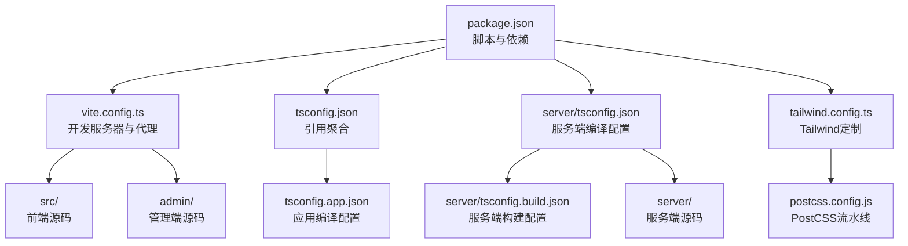
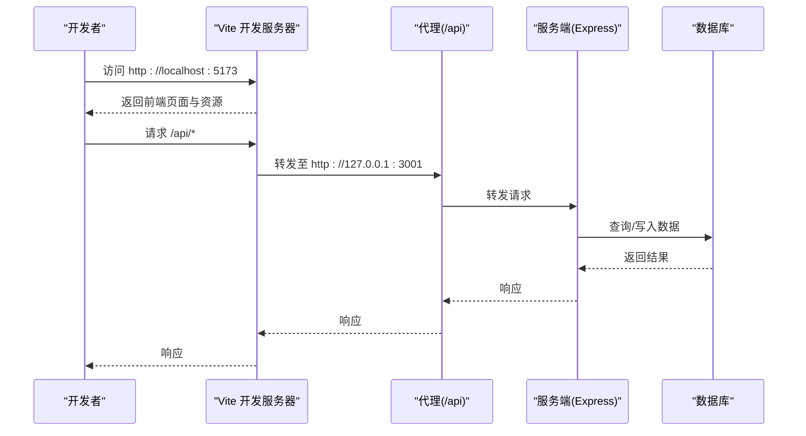
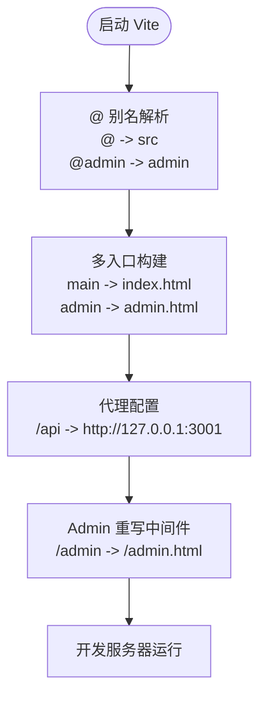
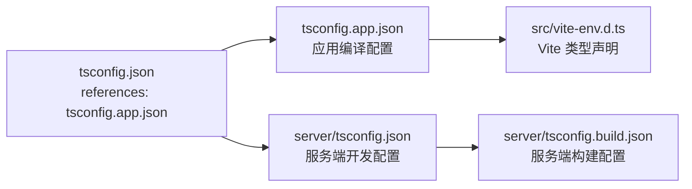
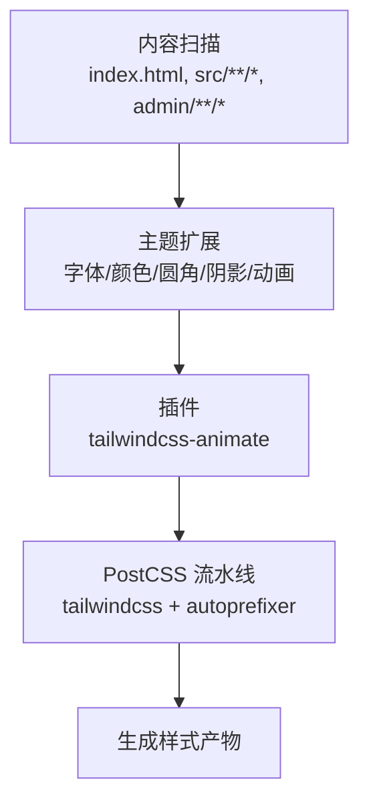
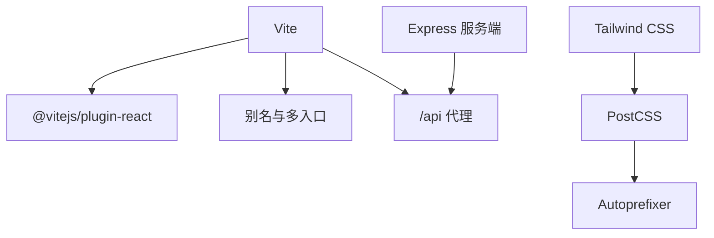

# 开发环境配置

<cite>
**本文引用的文件**
- [package.json](file://package.json)
- [vite.config.ts](file://vite.config.ts)
- [tsconfig.json](file://tsconfig.json)
- [tsconfig.app.json](file://tsconfig.app.json)
- [server/tsconfig.json](file://server/tsconfig.json)
- [server/tsconfig.build.json](file://server/tsconfig.build.json)
- [tailwind.config.ts](file://tailwind.config.ts)
- [.gitignore](file://.gitignore)
- [postcss.config.js](file://postcss.config.js)
- [src/vite-env.d.ts](file://src/vite-env.d.ts)
</cite>

## 目录
1. [简介](#简介)
2. [项目结构](#项目结构)
3. [核心组件](#核心组件)
4. [架构总览](#架构总览)
5. [详细组件分析](#详细组件分析)
6. [依赖关系分析](#依赖关系分析)
7. [性能考虑](#性能考虑)
8. [故障排除指南](#故障排除指南)
9. [结论](#结论)
10. [附录](#附录)

## 简介
本指南面向旅行规划Demo项目的开发者，提供从Node.js版本到构建与运行、TypeScript编译、Tailwind CSS定制、版本控制与环境变量、IDE与工具推荐，以及常见问题排查的完整开发环境配置说明。文档严格基于仓库中的实际配置文件进行分析与总结。

## 项目结构
该项目采用前后端一体化的多入口单体应用结构：
- 前端源码位于 src/，同时支持 admin/ 独立入口（通过 Vite 多入口构建）
- 服务端使用 TypeScript 编写，位于 server/，包含独立的 tsconfig 与构建配置
- 构建工具使用 Vite，前端产物与服务端产物分别输出
- 样式系统基于 Tailwind CSS，并通过 PostCSS流水线处理

图表来源
- [package.json:1-59](file://package.json#L1-L59)
- [vite.config.ts:1-46](file://vite.config.ts#L1-L46)
- [tsconfig.json:1-6](file://tsconfig.json#L1-L6)
- [tsconfig.app.json:1-27](file://tsconfig.app.json#L1-L27)
- [server/tsconfig.json:1-16](file://server/tsconfig.json#L1-L16)
- [server/tsconfig.build.json:1-19](file://server/tsconfig.build.json#L1-L19)
- [tailwind.config.ts:1-139](file://tailwind.config.ts#L1-L139)
- [postcss.config.js:1-6](file://postcss.config.js#L1-L6)

章节来源
- [package.json:1-59](file://package.json#L1-L59)
- [vite.config.ts:1-46](file://vite.config.ts#L1-L46)
- [tsconfig.json:1-6](file://tsconfig.json#L1-L6)
- [tsconfig.app.json:1-27](file://tsconfig.app.json#L1-L27)
- [server/tsconfig.json:1-16](file://server/tsconfig.json#L1-L16)
- [server/tsconfig.build.json:1-19](file://server/tsconfig.build.json#L1-L19)
- [tailwind.config.ts:1-139](file://tailwind.config.ts#L1-L139)
- [postcss.config.js:1-6](file://postcss.config.js#L1-L6)

## 核心组件
- Node.js与包管理
  - 使用 npm 进行包管理与脚本执行
  - 脚本涵盖前端开发、后端开发、前后端联调、构建与预览等
- Vite 构建与开发服务器
  - 多入口：主应用与管理后台
  - 代理配置指向本地服务端
  - 自定义插件实现 admin 访问重写
- TypeScript 编译
  - 根 tsconfig 引用 app 配置
  - 应用层与服务端层分别配置，确保严格模式与模块解析一致性
- Tailwind CSS
  - 内容扫描范围覆盖 src 与 admin
  - 主题扩展包含字体、颜色、圆角、阴影与动画
  - 通过 PostCSS 与 Autoprefixer 流水线处理

章节来源
- [package.json:6-25](file://package.json#L6-L25)
- [vite.config.ts:20-45](file://vite.config.ts#L20-L45)
- [tsconfig.json:1-6](file://tsconfig.json#L1-L6)
- [tsconfig.app.json:2-26](file://tsconfig.app.json#L2-L26)
- [server/tsconfig.json:1-16](file://server/tsconfig.json#L1-L16)
- [server/tsconfig.build.json:1-19](file://server/tsconfig.build.json#L1-L19)
- [tailwind.config.ts:3-137](file://tailwind.config.ts#L3-L137)
- [postcss.config.js:1-6](file://postcss.config.js#L1-L6)

## 架构总览
下图展示开发时的请求流与构建产物：

图表来源
- [vite.config.ts:36-44](file://vite.config.ts#L36-L44)

章节来源
- [vite.config.ts:20-45](file://vite.config.ts#L20-L45)

## 详细组件分析

### Node.js 与 npm 包管理
- 版本要求
  - 项目使用 ES 模块与现代语法，建议使用较新的 LTS Node.js 版本以获得稳定兼容性
- 依赖与脚本
  - 生产依赖包含 React、React Router、Tailwind 相关工具、Leaflet 地图库、Framer Motion 动画等
  - 开发依赖包含 Vite、React 插件、TypeScript、Tailwind CSS、PostCSS、Autoprefixer、tsx 等
  - 关键脚本：
    - dev：启动前端开发服务器
    - server：使用 tsx 启动服务端
    - dev:all：并行启动前端与服务端（进程管理）
    - build：构建前端与服务端
    - preview：预览构建产物
    - admin:dev：在 /admin/ 子路径启动前端开发服务器
    - agent:*：各类 Agent 的数据采集与处理命令

章节来源
- [package.json:26-57](file://package.json#L26-L57)
- [package.json:6-25](file://package.json#L6-L25)

### Vite 配置与开发服务器
- 多入口构建
  - 主入口：index.html
  - 管理端入口：admin.html
- 别名
  - @ 指向 src
  - @admin 指向 admin
- 开发服务器
  - 代理 /api → http://127.0.0.1:3001
  - 自定义中间件将 /admin 与 /admin/ 重写为 /admin.html，便于 SPA 访问
- 典型工作流
  - 前端开发：npm run dev 或 npm run admin:dev
  - 联调：npm run dev:all 同时启动前端与服务端

图表来源
- [vite.config.ts:20-45](file://vite.config.ts#L20-L45)

章节来源
- [vite.config.ts:1-46](file://vite.config.ts#L1-L46)

### TypeScript 编译配置
- 根配置
  - 通过 references 引用 tsconfig.app.json，形成复合项目结构
- 应用层配置（tsconfig.app.json）
  - 目标与模块：ES2020 + ESNext
  - 模块解析：bundler（与 Vite 协同）
  - 严格模式开启，禁用 emit，启用 JSX
  - 路径映射：@/*、@admin/*
- 服务端配置
  - 开发：noEmit，便于 tsx 直接运行
  - 构建：指定 outDir 为 dist-server，启用声明输出关闭，允许 emit
- 类型声明
  - src/vite-env.d.ts 引入 Vite 客户端类型

图表来源
- [tsconfig.json:1-6](file://tsconfig.json#L1-L6)
- [tsconfig.app.json:2-26](file://tsconfig.app.json#L2-L26)
- [server/tsconfig.json:1-16](file://server/tsconfig.json#L1-L16)
- [server/tsconfig.build.json:1-19](file://server/tsconfig.build.json#L1-L19)
- [src/vite-env.d.ts:1](file://src/vite-env.d.ts#L1)

章节来源
- [tsconfig.json:1-6](file://tsconfig.json#L1-L6)
- [tsconfig.app.json:1-27](file://tsconfig.app.json#L1-L27)
- [server/tsconfig.json:1-16](file://server/tsconfig.json#L1-L16)
- [server/tsconfig.build.json:1-19](file://server/tsconfig.build.json#L1-L19)
- [src/vite-env.d.ts:1](file://src/vite-env.d.ts#L1)

### Tailwind CSS 定制与设计系统
- 内容扫描
  - 覆盖 index.html、src/**/*.{ts,tsx}、admin.html、admin/**/*.{ts,tsx}
- 设计系统扩展
  - 字体族：Inter、Noto Sans SC 等
  - 颜色：基于 CSS 变量的主题色、辅助色、语义色与自定义品牌色（如 coral、sunset、ocean、sand、journal）
  - 圆角：基于 CSS 变量的容器化圆角
  - 阴影：优雅、发光、卡片、浮动等阴影变体
  - 动画：手风琴、淡入、滑入、缩放、脉冲、浮动等
- 插件
  - tailwindcss-animate 提供开箱即用的动画类
- 构建流程
  - 通过 PostCSS 加载 tailwindcss 与 autoprefixer

图表来源
- [tailwind.config.ts:5-137](file://tailwind.config.ts#L5-L137)
- [postcss.config.js:1-6](file://postcss.config.js#L1-L6)

章节来源
- [tailwind.config.ts:1-139](file://tailwind.config.ts#L1-L139)
- [postcss.config.js:1-6](file://postcss.config.js#L1-L6)

### .gitignore 与版本控制最佳实践
- 忽略项
  - node_modules、dist、dist-ssr、dist-server
  - 本地文件：*.local、.env、.env.local
  - 日志：*.log
  - 平台目录：.vercel、.vercel-tmp
  - 数据同步临时文件：data-sync/*.tmp、data-sync/*.log
  - 其他：.DS_Store、deploy-package.zip
- 特殊说明
  - data-sync/ 用于本地到服务器的数据同步，不忽略该目录本身，仅忽略其临时与日志文件

章节来源
- [.gitignore:1-17](file://.gitignore#L1-L17)

## 依赖关系分析
- 组件耦合
  - Vite 通过别名与多入口解耦前端与管理端
  - 服务端通过代理与前端解耦，便于并行开发
  - Tailwind 与 PostCSS 作为样式管线，与业务代码弱耦合
- 外部依赖
  - React 生态、Express、Leaflet、Tailwind 相关工具链
  - 开发工具：Vite、TypeScript、Tailwind CSS、PostCSS、Autoprefixer

图表来源
- [vite.config.ts:20-45](file://vite.config.ts#L20-L45)
- [postcss.config.js:1-6](file://postcss.config.js#L1-L6)

章节来源
- [package.json:26-57](file://package.json#L26-L57)
- [vite.config.ts:20-45](file://vite.config.ts#L20-L45)
- [postcss.config.js:1-6](file://postcss.config.js#L1-L6)

## 性能考虑
- Vite 多入口与按需加载可减少首屏体积
- Tailwind 建议在生产构建中配合 Purge/Tree-shaking（若使用默认 Tailwind 配置，已内置内容扫描）
- 代理仅在开发阶段生效，避免生产环境额外负担
- TypeScript 使用 bundler 模式与 noEmit，提升开发体验

## 故障排除指南
- 无法访问 /admin
  - 现象：直接访问 /admin 报 404
  - 解决：使用 /admin/ 子路径或通过 admin:dev 启动；开发服务器已配置中间件将 /admin 与 /admin/ 重写为 /admin.html
  - 参考：[vite.config.ts:5-18](file://vite.config.ts#L5-L18)
- 代理 /api 失败
  - 现象：前端请求 /api 无响应
  - 排查：确认服务端已在 http://127.0.0.1:3001 运行；检查代理配置是否正确
  - 参考：[vite.config.ts:36-44](file://vite.config.ts#L36-L44)
- 构建失败或类型错误
  - 现象：npm run build 报错
  - 排查：先确保应用层与服务端层编译配置一致；检查 tsconfig 引用与路径映射
  - 参考：[tsconfig.json:1-6](file://tsconfig.json#L1-L6)、[tsconfig.app.json:2-26](file://tsconfig.app.json#L2-L26)、[server/tsconfig.json:1-16](file://server/tsconfig.json#L1-L16)、[server/tsconfig.build.json:1-19](file://server/tsconfig.build.json#L1-L19)
- Tailwind 样式未生效
  - 现象：自定义颜色/动画无效
  - 排查：确认内容扫描路径包含对应文件；检查 PostCSS 流水线是否启用 tailwindcss 与 autoprefixer
  - 参考：[tailwind.config.ts:5-10](file://tailwind.config.ts#L5-L10)、[postcss.config.js:1-6](file://postcss.config.js#L1-L6)
- 本地环境变量未生效
  - 现象：.env 或 .env.local 未被读取
  - 排查：确认文件命名与位置；注意 .env 与 .env.local 已被 .gitignore 忽略，不应提交到版本库
  - 参考：[.gitignore:4-9](file://.gitignore#L4-L9)

章节来源
- [vite.config.ts:5-18](file://vite.config.ts#L5-L18)
- [vite.config.ts:36-44](file://vite.config.ts#L36-L44)
- [tsconfig.json:1-6](file://tsconfig.json#L1-L6)
- [tsconfig.app.json:2-26](file://tsconfig.app.json#L2-L26)
- [server/tsconfig.json:1-16](file://server/tsconfig.json#L1-L16)
- [server/tsconfig.build.json:1-19](file://server/tsconfig.build.json#L1-L19)
- [tailwind.config.ts:5-10](file://tailwind.config.ts#L5-L10)
- [postcss.config.js:1-6](file://postcss.config.js#L1-L6)
- [.gitignore:4-9](file://.gitignore#L4-L9)

## 结论
本项目采用现代化的前端工程化方案：Vite 多入口开发、TypeScript 严格编译、Tailwind CSS 设计系统与 PostCSS 流水线。通过合理的代理与别名配置，实现了前后端高效联调。遵循本文档的环境配置与故障排除建议，可快速搭建稳定一致的开发环境。

## 附录
- 环境变量配置建议
  - 在本地创建 .env.local（不会被版本控制跟踪），用于存放敏感或本地专用配置
  - 若需要全局变量注入，可在 Vite 中通过 define 或 dotenv 加载（当前仓库未显式配置）
- IDE 设置建议
  - VS Code：安装 Prettier、ESLint、Tailwind CSS IntelliSense 扩展
  - TypeScript：启用“在编辑器中编译”以获得即时类型反馈
- 开发工具推荐
  - 浏览器调试：React DevTools、Redux DevTools（如使用）
  - API 调试：Insomnia 或 Postman
  - Git：使用 .gitignore 规则，避免误提交敏感文件