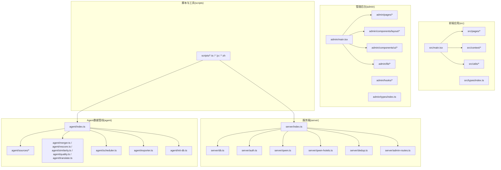
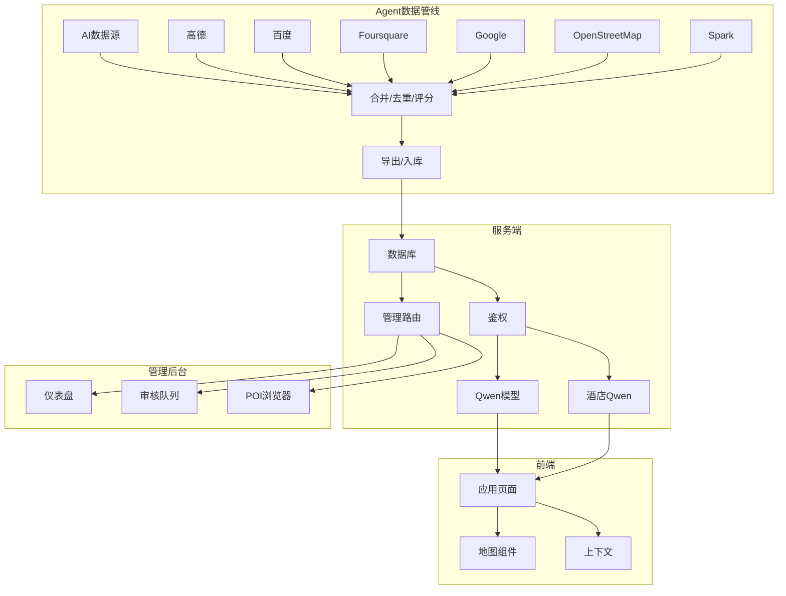
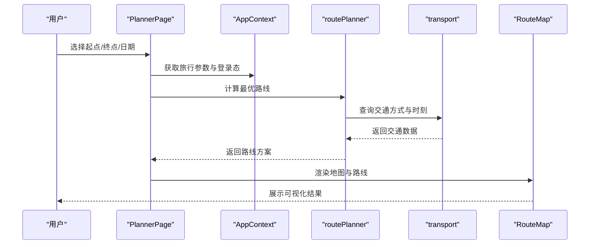
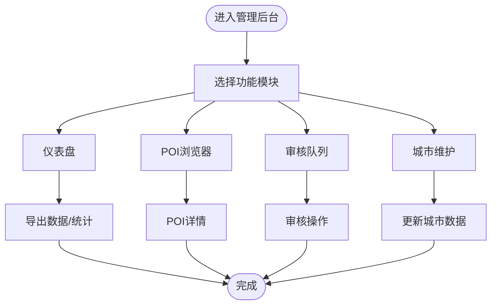
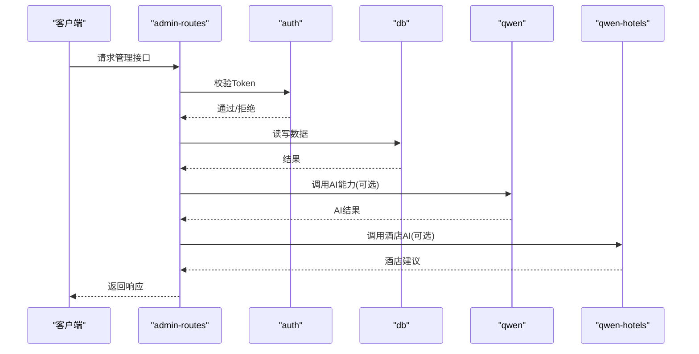
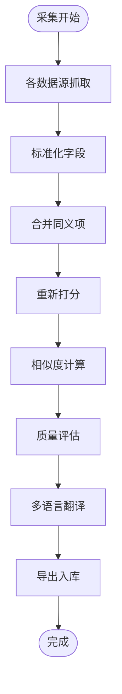
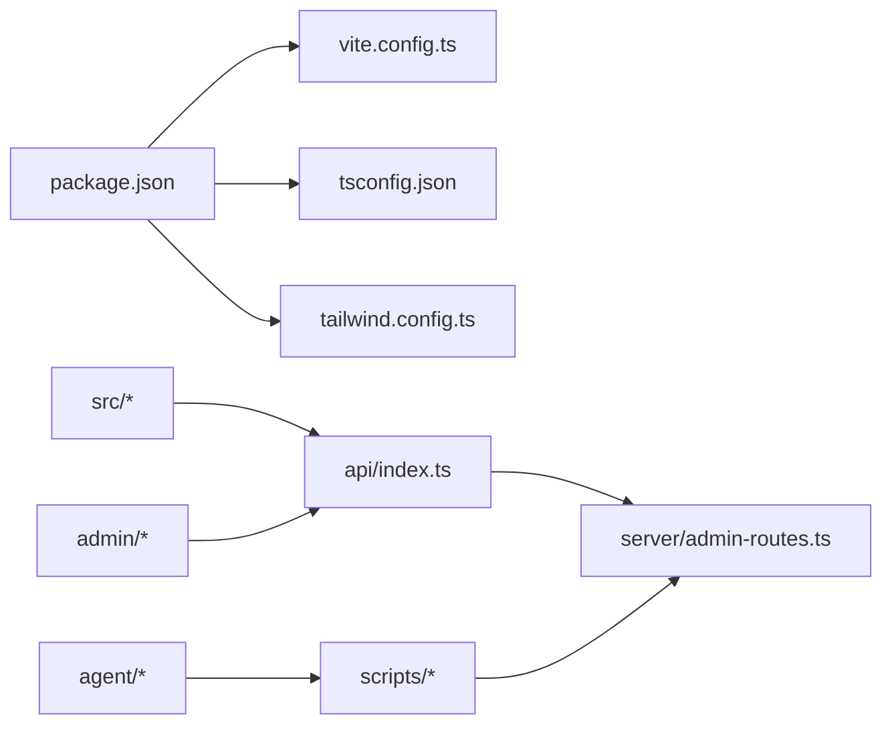
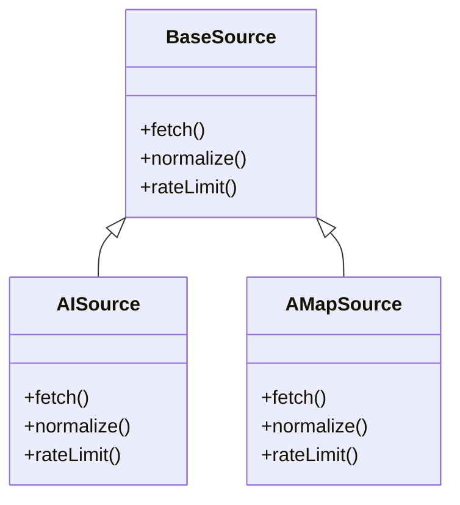

# 开发者指南

<cite>
**本文引用的文件**
- [package.json](file://package.json)
- [vite.config.ts](file://vite.config.ts)
- [tailwind.config.ts](file://tailwind.config.ts)
- [tsconfig.json](file://tsconfig.json)
- [src/main.tsx](file://src/main.tsx)
- [admin/main.tsx](file://admin/main.tsx)
- [server/index.ts](file://server/index.ts)
- [agent/index.ts](file://agent/index.ts)
- [src/utils/aiRecommend.ts](file://src/utils/aiRecommend.ts)
- [agent/data/city-coords.json](file://agent/data/city-coords.json)
- [agent/sources/base.ts](file://agent/sources/base.ts)
- [agent/sources/ai.ts](file://agent/sources/ai.ts)
- [agent/sources/amap.ts](file://agent/sources/amap.ts)
- [agent/sources/doubao.ts](file://agent/sources/doubao.ts)
- [agent/sources/foursquare.ts](file://agent/sources/foursquare.ts)
- [agent/sources/google.ts](file://agent/sources/google.ts)
- [agent/sources/osm.ts](file://agent/sources/osm.ts)
- [agent/sources/spark.ts](file://agent/sources/spark.ts)
- [agent/classifier.ts](file://agent/classifier.ts)
- [agent/merger.ts](file://agent/merger.ts)
- [agent/rescore.ts](file://agent/rescore.ts)
- [agent/similarity.ts](file://agent/similarity.ts)
- [agent/quality.ts](file://agent/quality.ts)
- [agent/translate.ts](file://agent/translate.ts)
- [agent/scheduler.ts](file://agent/scheduler.ts)
- [agent/exporter.ts](file://agent/exporter.ts)
- [agent/init-db.ts](file://agent/init-db.ts)
- [scripts/daily-refresh.js](file://scripts/daily-refresh.js)
- [scripts/db-export.js](file://scripts/db-export.js)
- [scripts/fetch-domestic-cities.ts](file://scripts/fetch-domestic-cities.ts)
- [scripts/fetch-domestic-extra.ts](file://scripts/fetch-domestic-extra.ts)
- [scripts/fetch-domestic-final.ts](file://scripts/fetch-domestic-final.ts)
- [scripts/fetch-cities-batch.ts](file://scripts/fetch-cities-batch.ts)
- [scripts/fetch-city-images.ts](file://scripts/fetch-city-images.ts)
- [scripts/merge-all-cities.ts](file://scripts/merge-all-cities.ts)
- [scripts/import-cache.js](file://scripts/import-cache.js)
- [scripts/local-daily-run.sh](file://scripts/local-daily-run.sh)
- [scripts/release.sh](file://scripts/release.sh)
- [scripts/server-pull.sh](file://scripts/server-pull.sh)
- [scripts/server-rollback.sh](file://scripts/server-rollback.sh)
- [VERCEL_RAILWAY_DEPLOY.md](file://VERCEL_RAILWAY_DEPLOY.md)
- [AGENTS.md](file://AGENTS.md)
- [wiki/principles.md](file://wiki/principles.md)
- [wiki/review-guide.md](file://wiki/review-guide.md)
- [wiki/webdev-agent-role.md](file://wiki/webdev-agent-role.md)
- [docs/webdev-agent-role.md](file://docs/webdev-agent-role.md)
- [server/admin-routes.ts](file://server/admin-routes.ts)
- [server/auth.ts](file://server/auth.ts)
- [server/db.ts](file://server/db.ts)
- [server/qwen.ts](file://server/qwen.ts)
- [server/qwen-hotels.ts](file://server/qwen-hotels.ts)
- [server/dedup.ts](file://server/dedup.ts)
- [api/index.ts](file://api/index.ts)
- [src/context/AppContext.tsx](file://src/context/AppContext.tsx)
- [src/context/AuthContext.tsx](file://src/context/AuthContext.tsx)
- [src/pages/PlannerPage.tsx](file://src/pages/PlannerPage.tsx)
- [src/components/RouteMap.tsx](file://src/components/RouteMap.tsx)
- [src/utils/routePlanner.ts](file://src/utils/routePlanner.ts)
- [src/utils/transport.ts](file://src/utils/transport.ts)
- [admin/pages/Dashboard.tsx](file://admin/pages/Dashboard.tsx)
- [admin/pages/PendingUpdates.tsx](file://admin/pages/PendingUpdates.tsx)
- [admin/pages/ReviewQueue.tsx](file://admin/pages/ReviewQueue.tsx)
- [admin/pages/POIBrowser.tsx](file://admin/pages/POIBrowser.tsx)
- [admin/pages/POIDetail.tsx](file://admin/pages/POIDetail.tsx)
- [admin/pages/Cities.tsx](file://admin/pages/Cities.tsx)
- [admin/pages/Updates.tsx](file://admin/pages/Updates.tsx)
- [admin/components/layout/AdminLayout.tsx](file://admin/components/layout/AdminLayout.tsx)
- [admin/components/ui/button.tsx](file://admin/components/ui/button.tsx)
- [admin/components/ui/input.tsx](file://admin/components/ui/input.tsx)
- [admin/lib/api.ts](file://admin/lib/api.ts)
- [admin/lib/formatters.ts](file://admin/lib/formatters.ts)
- [admin/lib/utils.ts](file://admin/lib/utils.ts)
- [admin/hooks/useDebounce.ts](file://admin/hooks/useDebounce.ts)
- [admin/types/index.ts](file://admin/types/index.ts)
- [src/types/index.ts](file://src/types/index.ts)
- [src/lib/utils.ts](file://src/lib/utils.ts)
- [src/data/mock-data.ts](file://src/data/mock-data.ts)
- [src/data/destinations.ts](file://src/data/destinations.ts)
- [src/utils/poiName.ts](file://src/utils/poiName.ts)
</cite>

## 目录
1. [简介](#简介)
2. [项目结构](#项目结构)
3. [核心组件](#核心组件)
4. [架构总览](#架构总览)
5. [详细组件分析](#详细组件分析)
6. [依赖分析](#依赖分析)
7. [性能考虑](#性能考虑)
8. [故障排查指南](#故障排查指南)
9. [结论](#结论)
10. [附录](#附录)

## 简介
本指南面向新加入的开发者，帮助你快速理解旅行规划Demo的架构、开发规范与最佳实践，掌握从本地开发到部署运维的全流程。内容涵盖：
- 开发规范、代码风格与最佳实践
- Git工作流程与代码审查标准
- 开发环境配置与调试技巧
- 新功能开发流程与注意事项
- AI数据采集与新数据源集成指南
- 测试策略与质量保证流程
- 性能优化与问题排查实用技巧
- 常见问题解决方案与经验总结

## 项目结构
项目采用多包/多入口组织方式：前端应用（src）、管理后台（admin）、服务端（server）、Agent数据管线（agent）、脚本工具（scripts）以及文档与知识库（docs、wiki）。TypeScript + Vite + TailwindCSS 构成前端技术栈；Node.js + TypeScript 作为后端与数据处理层。

**图表来源**
- [src/main.tsx:1-50](file://src/main.tsx#L1-L50)
- [admin/main.tsx:1-50](file://admin/main.tsx#L1-L50)
- [server/index.ts:1-50](file://server/index.ts#L1-L50)
- [agent/index.ts:1-50](file://agent/index.ts#L1-L50)

**章节来源**
- [package.json:1-100](file://package.json#L1-L100)
- [vite.config.ts:1-100](file://vite.config.ts#L1-L100)
- [tailwind.config.ts:1-100](file://tailwind.config.ts#L1-L100)
- [tsconfig.json:1-100](file://tsconfig.json#L1-L100)

## 核心组件
- 前端应用（src）
  - 应用入口与页面：src/main.tsx、src/pages/*
  - 上下文：src/context/*（应用状态与认证）
  - 工具函数：src/utils/*（路线规划、交通、AI推荐等）
  - 类型定义：src/types/index.ts
  - 组件与样式：src/components/*、src/lib/utils.ts、src/index.css
- 管理后台（admin）
  - 入口与页面：admin/main.tsx、admin/pages/*
  - 布局与UI：admin/components/layout/*、admin/components/ui/*
  - 工具库：admin/lib/*（API、格式化、通用工具）
  - 钩子与类型：admin/hooks/*、admin/types/index.ts
- 服务端（server）
  - 入口与路由：server/index.ts、server/admin-routes.ts
  - 数据库与鉴权：server/db.ts、server/auth.ts
  - AI能力：server/qwen.ts、server/qwen-hotels.ts
  - 去重与测试：server/dedup.ts、server/test-dedup.ts
- Agent数据管线（agent）
  - 入口与调度：agent/index.ts、agent/scheduler.ts
  - 数据源适配器：agent/sources/*（AI、高德、百度、Foursquare、Google、OSM、Spark）
  - 质量与评分：agent/merger.ts、agent/rescore.ts、agent/similarity.ts、agent/quality.ts、agent/translate.ts
  - 导出与初始化：agent/exporter.ts、agent/init-db.ts
- 脚本与工具（scripts）
  - 批量采集与合并：scripts/fetch-domestic-*.ts、scripts/fetch-cities-batch.ts、scripts/merge-all-cities.ts
  - 日常任务与导出：scripts/daily-refresh.js、scripts/db-export.js、scripts/import-cache.js
  - 部署与回滚：scripts/release.sh、scripts/server-pull.sh、scripts/server-rollback.sh、scripts/local-daily-run.sh
- 文档与知识库（docs、wiki）
  - 角色与原则：docs/webdev-agent-role.md、wiki/webdev-agent-role.md、wiki/principles.md
  - 审查与评审：wiki/review-guide.md

**章节来源**
- [src/main.tsx:1-50](file://src/main.tsx#L1-L50)
- [admin/main.tsx:1-50](file://admin/main.tsx#L1-L50)
- [server/index.ts:1-50](file://server/index.ts#L1-L50)
- [agent/index.ts:1-50](file://agent/index.ts#L1-L50)
- [scripts/daily-refresh.js:1-50](file://scripts/daily-refresh.js#L1-L50)
- [VERCEL_RAILWAY_DEPLOY.md:1-100](file://VERCEL_RAILWAY_DEPLOY.md#L1-L100)
- [wiki/principles.md:1-100](file://wiki/principles.md#L1-L100)
- [wiki/review-guide.md:1-100](file://wiki/review-guide.md#L1-L100)
- [docs/webdev-agent-role.md:1-100](file://docs/webdev-agent-role.md#L1-L100)

## 架构总览
系统由“前端应用 + 管理后台 + 服务端 + Agent数据管线 + 脚本工具”构成，数据流自下而上：Agent采集与清洗 -> 数据库 -> 服务端API -> 前端展示；管理后台用于数据治理与审核。

**图表来源**
- [agent/sources/ai.ts:1-50](file://agent/sources/ai.ts#L1-L50)
- [agent/sources/amap.ts:1-50](file://agent/sources/amap.ts#L1-L50)
- [agent/merger.ts:1-50](file://agent/merger.ts#L1-L50)
- [agent/exporter.ts:1-50](file://agent/exporter.ts#L1-L50)
- [server/qwen.ts:1-50](file://server/qwen.ts#L1-L50)
- [server/qwen-hotels.ts:1-50](file://server/qwen-hotels.ts#L1-L50)
- [server/admin-routes.ts:1-50](file://server/admin-routes.ts#L1-L50)
- [src/pages/PlannerPage.tsx:1-50](file://src/pages/PlannerPage.tsx#L1-L50)
- [src/components/RouteMap.tsx:1-50](file://src/components/RouteMap.tsx#L1-L50)

## 详细组件分析

### 前端应用（src）
- 页面与导航：src/pages/* 提供旅行计划、景点详情、酒店详情、日志等页面
- 地图与路线：src/components/RouteMap.tsx 与 src/utils/routePlanner.ts、src/utils/transport.ts 协作实现路径规划与交通方式计算
- 上下文：src/context/AppContext.tsx、src/context/AuthContext.tsx 管理全局状态与认证
- 类型与工具：src/types/index.ts、src/lib/utils.ts、src/utils/poiName.ts
- Mock数据：src/data/mock-data.ts、src/data/destinations.ts 支持本地开发与演示

**图表来源**
- [src/pages/PlannerPage.tsx:1-50](file://src/pages/PlannerPage.tsx#L1-L50)
- [src/context/AppContext.tsx:1-50](file://src/context/AppContext.tsx#L1-L50)
- [src/utils/routePlanner.ts:1-50](file://src/utils/routePlanner.ts#L1-L50)
- [src/utils/transport.ts:1-50](file://src/utils/transport.ts#L1-L50)
- [src/components/RouteMap.tsx:1-50](file://src/components/RouteMap.tsx#L1-L50)

**章节来源**
- [src/pages/PlannerPage.tsx:1-100](file://src/pages/PlannerPage.tsx#L1-L100)
- [src/context/AppContext.tsx:1-100](file://src/context/AppContext.tsx#L1-L100)
- [src/context/AuthContext.tsx:1-100](file://src/context/AuthContext.tsx#L1-L100)
- [src/utils/routePlanner.ts:1-100](file://src/utils/routePlanner.ts#L1-L100)
- [src/utils/transport.ts:1-100](file://src/utils/transport.ts#L1-L100)
- [src/components/RouteMap.tsx:1-100](file://src/components/RouteMap.tsx#L1-L100)
- [src/data/mock-data.ts:1-100](file://src/data/mock-data.ts#L1-L100)
- [src/data/destinations.ts:1-100](file://src/data/destinations.ts#L1-L100)

### 管理后台（admin）
- 页面与功能：Dashboard、PendingUpdates、ReviewQueue、POIBrowser、POIDetail、Cities、Updates
- 布局与UI：AdminLayout、Header、Sidebar；统一的button、input、table等组件
- 工具库：api.ts（统一请求封装）、formatters.ts（格式化工具）、utils.ts（通用工具）
- 钩子：useDebounce.ts 实现输入防抖
- 类型：index.ts 统一导出类型

**图表来源**
- [admin/pages/Dashboard.tsx:1-50](file://admin/pages/Dashboard.tsx#L1-L50)
- [admin/pages/PendingUpdates.tsx:1-50](file://admin/pages/PendingUpdates.tsx#L1-L50)
- [admin/pages/ReviewQueue.tsx:1-50](file://admin/pages/ReviewQueue.tsx#L1-L50)
- [admin/pages/POIBrowser.tsx:1-50](file://admin/pages/POIBrowser.tsx#L1-L50)
- [admin/pages/POIDetail.tsx:1-50](file://admin/pages/POIDetail.tsx#L1-L50)
- [admin/pages/Cities.tsx:1-50](file://admin/pages/Cities.tsx#L1-L50)
- [admin/pages/Updates.tsx:1-50](file://admin/pages/Updates.tsx#L1-L50)

**章节来源**
- [admin/main.tsx:1-100](file://admin/main.tsx#L1-L100)
- [admin/components/layout/AdminLayout.tsx:1-100](file://admin/components/layout/AdminLayout.tsx#L1-L100)
- [admin/components/ui/button.tsx:1-100](file://admin/components/ui/button.tsx#L1-L100)
- [admin/components/ui/input.tsx:1-100](file://admin/components/ui/input.tsx#L1-L100)
- [admin/lib/api.ts:1-100](file://admin/lib/api.ts#L1-L100)
- [admin/lib/formatters.ts:1-100](file://admin/lib/formatters.ts#L1-L100)
- [admin/lib/utils.ts:1-100](file://admin/lib/utils.ts#L1-L100)
- [admin/hooks/useDebounce.ts:1-100](file://admin/hooks/useDebounce.ts#L1-L100)
- [admin/types/index.ts:1-100](file://admin/types/index.ts#L1-L100)

### 服务端（server）
- 入口与路由：server/index.ts 汇聚所有路由与中间件；server/admin-routes.ts 管理后台专用路由
- 鉴权：server/auth.ts 提供认证逻辑
- 数据库：server/db.ts 封装数据库连接与事务
- AI能力：server/qwen.ts、server/qwen-hotels.ts 对接大模型服务
- 去重与测试：server/dedup.ts、server/test-dedup.ts 提供数据去重与测试辅助

**图表来源**
- [server/admin-routes.ts:1-50](file://server/admin-routes.ts#L1-L50)
- [server/auth.ts:1-50](file://server/auth.ts#L1-L50)
- [server/db.ts:1-50](file://server/db.ts#L1-L50)
- [server/qwen.ts:1-50](file://server/qwen.ts#L1-L50)
- [server/qwen-hotels.ts:1-50](file://server/qwen-hotels.ts#L1-L50)

**章节来源**
- [server/index.ts:1-100](file://server/index.ts#L1-L100)
- [server/admin-routes.ts:1-100](file://server/admin-routes.ts#L1-L100)
- [server/auth.ts:1-100](file://server/auth.ts#L1-L100)
- [server/db.ts:1-100](file://server/db.ts#L1-L100)
- [server/qwen.ts:1-100](file://server/qwen.ts#L1-L100)
- [server/qwen-hotels.ts:1-100](file://server/qwen-hotels.ts#L1-L100)

### Agent数据管线（agent）
- 数据源适配器：agent/sources/* 实现不同数据源的抓取与标准化
- 质量与评分：agent/merger.ts 合并同义项，agent/rescore.ts 重新打分，agent/similarity.ts 计算相似度，agent/quality.ts 评估质量，agent/translate.ts 多语言翻译
- 调度与导出：agent/scheduler.ts 控制采集节奏，agent/exporter.ts 导出至数据库或文件
- 初始化：agent/init-db.ts 初始化数据库结构

**图表来源**
- [agent/sources/base.ts:1-50](file://agent/sources/base.ts#L1-L50)
- [agent/merger.ts:1-50](file://agent/merger.ts#L1-L50)
- [agent/rescore.ts:1-50](file://agent/rescore.ts#L1-L50)
- [agent/similarity.ts:1-50](file://agent/similarity.ts#L1-L50)
- [agent/quality.ts:1-50](file://agent/quality.ts#L1-L50)
- [agent/translate.ts:1-50](file://agent/translate.ts#L1-L50)
- [agent/exporter.ts:1-50](file://agent/exporter.ts#L1-L50)

**章节来源**
- [agent/index.ts:1-100](file://agent/index.ts#L1-L100)
- [agent/sources/ai.ts:1-100](file://agent/sources/ai.ts#L1-L100)
- [agent/sources/amap.ts:1-100](file://agent/sources/amap.ts#L1-L100)
- [agent/sources/doubao.ts:1-100](file://agent/sources/doubao.ts#L1-L100)
- [agent/sources/foursquare.ts:1-100](file://agent/sources/foursquare.ts#L1-L100)
- [agent/sources/google.ts:1-100](file://agent/sources/google.ts#L1-L100)
- [agent/sources/osm.ts:1-100](file://agent/sources/osm.ts#L1-L100)
- [agent/sources/spark.ts:1-100](file://agent/sources/spark.ts#L1-L100)
- [agent/merger.ts:1-100](file://agent/merger.ts#L1-L100)
- [agent/rescore.ts:1-100](file://agent/rescore.ts#L1-L100)
- [agent/similarity.ts:1-100](file://agent/similarity.ts#L1-L100)
- [agent/quality.ts:1-100](file://agent/quality.ts#L1-L100)
- [agent/translate.ts:1-100](file://agent/translate.ts#L1-L100)
- [agent/scheduler.ts:1-100](file://agent/scheduler.ts#L1-L100)
- [agent/exporter.ts:1-100](file://agent/exporter.ts#L1-L100)
- [agent/init-db.ts:1-100](file://agent/init-db.ts#L1-L100)

### 脚本与工具（scripts）
- 批量采集：fetch-domestic-*.ts、fetch-cities-batch.ts、merge-all-cities.ts
- 日常任务：daily-refresh.js、db-export.js、import-cache.js
- 部署与回滚：release.sh、server-pull.sh、server-rollback.sh、local-daily-run.sh

**章节来源**
- [scripts/daily-refresh.js:1-100](file://scripts/daily-refresh.js#L1-L100)
- [scripts/db-export.js:1-100](file://scripts/db-export.js#L1-L100)
- [scripts/fetch-domestic-cities.ts:1-100](file://scripts/fetch-domestic-cities.ts#L1-L100)
- [scripts/fetch-domestic-extra.ts:1-100](file://scripts/fetch-domestic-extra.ts#L1-L100)
- [scripts/fetch-domestic-final.ts:1-100](file://scripts/fetch-domestic-final.ts#L1-L100)
- [scripts/fetch-cities-batch.ts:1-100](file://scripts/fetch-cities-batch.ts#L1-L100)
- [scripts/fetch-city-images.ts:1-100](file://scripts/fetch-city-images.ts#L1-L100)
- [scripts/merge-all-cities.ts:1-100](file://scripts/merge-all-cities.ts#L1-L100)
- [scripts/import-cache.js:1-100](file://scripts/import-cache.js#L1-L100)
- [scripts/local-daily-run.sh:1-100](file://scripts/local-daily-run.sh#L1-L100)
- [scripts/release.sh:1-100](file://scripts/release.sh#L1-L100)
- [scripts/server-pull.sh:1-100](file://scripts/server-pull.sh#L1-L100)
- [scripts/server-rollback.sh:1-100](file://scripts/server-rollback.sh#L1-L100)

## 依赖分析
- 包管理与构建
  - package.json 定义了依赖、脚本与构建配置
  - vite.config.ts 配置前端构建与开发服务器
  - tailwind.config.ts 配置样式工具类
  - tsconfig.json 统一TypeScript编译选项
- 前后端耦合点
  - 前端通过API接口与服务端交互（参考 api/index.ts 与 server/admin-routes.ts）
  - Agent导出的数据经由 scripts/db-export.js 或直接导入 server/db.ts 使用
- 管理后台与服务端
  - admin/lib/api.ts 统一封装HTTP请求，调用 server/admin-routes.ts 提供的接口

**图表来源**
- [package.json:1-100](file://package.json#L1-L100)
- [vite.config.ts:1-100](file://vite.config.ts#L1-L100)
- [tsconfig.json:1-100](file://tsconfig.json#L1-L100)
- [tailwind.config.ts:1-100](file://tailwind.config.ts#L1-L100)
- [api/index.ts:1-100](file://api/index.ts#L1-L100)
- [server/admin-routes.ts:1-100](file://server/admin-routes.ts#L1-L100)

**章节来源**
- [package.json:1-200](file://package.json#L1-L200)
- [vite.config.ts:1-200](file://vite.config.ts#L1-L200)
- [tsconfig.json:1-200](file://tsconfig.json#L1-L200)
- [tailwind.config.ts:1-200](file://tailwind.config.ts#L1-L200)

## 性能考虑
- 前端性能
  - 使用 React.memo 与 useMemo/useCallback 缓存计算结果，减少重渲染
  - 图片懒加载与骨架屏提升首屏体验
  - TailwindCSS 按需引入，避免打包冗余样式
- Agent采集
  - 限速与并发控制：在 agent/sources/* 中设置合理的延时与并发上限
  - 增量更新：利用 agent/scheduler.ts 的调度策略，仅对变更数据进行处理
- 服务端
  - 连接池与事务批处理：server/db.ts 中复用连接，批量写入
  - 缓存：对热点查询结果进行缓存（如城市坐标 agent/data/city-coords.json）
- 资源与网络
  - CDN与静态资源优化
  - 合理的超时与重试策略

[本节为通用指导，无需列出具体文件来源]

## 故障排查指南
- 前端
  - 路由与状态：检查 src/context/* 是否正确传递参数；确认 src/pages/* 页面是否按预期渲染
  - 地图与路线：核对 src/utils/routePlanner.ts 与 src/utils/transport.ts 的返回值；确认 src/components/RouteMap.tsx 的props
- 管理后台
  - 接口异常：检查 admin/lib/api.ts 的请求参数与错误处理；核对 server/admin-routes.ts 的路由与鉴权
- 服务端
  - 数据库连接：server/db.ts 的连接字符串与权限；事务失败时的回滚逻辑
  - AI接口：server/qwen.ts 与 server/qwen-hotels.ts 的超时与重试策略
- Agent
  - 数据源异常：agent/sources/* 的网络错误与解析异常；使用 agent/scheduler.ts 的重试机制
  - 导出失败：agent/exporter.ts 的目标路径与权限；scripts/db-export.js 的执行环境
- 脚本
  - 权限与环境变量：scripts/*.sh 与 *.js 的执行权限与环境变量；定时任务的crontab配置

**章节来源**
- [src/context/AppContext.tsx:1-100](file://src/context/AppContext.tsx#L1-L100)
- [src/context/AuthContext.tsx:1-100](file://src/context/AuthContext.tsx#L1-L100)
- [src/utils/routePlanner.ts:1-100](file://src/utils/routePlanner.ts#L1-L100)
- [src/utils/transport.ts:1-100](file://src/utils/transport.ts#L1-L100)
- [src/components/RouteMap.tsx:1-100](file://src/components/RouteMap.tsx#L1-L100)
- [admin/lib/api.ts:1-100](file://admin/lib/api.ts#L1-L100)
- [server/admin-routes.ts:1-100](file://server/admin-routes.ts#L1-L100)
- [server/db.ts:1-100](file://server/db.ts#L1-L100)
- [server/qwen.ts:1-100](file://server/qwen.ts#L1-L100)
- [server/qwen-hotels.ts:1-100](file://server/qwen-hotels.ts#L1-L100)
- [agent/exporter.ts:1-100](file://agent/exporter.ts#L1-L100)
- [scripts/db-export.js:1-100](file://scripts/db-export.js#L1-L100)

## 结论
本指南提供了从开发环境搭建到日常协作、从功能开发到数据采集与质量保障的完整路径。建议新同学优先阅读“开发规范与最佳实践”“Git工作流程与代码审查标准”“开发环境配置与调试技巧”，再深入任一模块进行实战。

[本节为总结性内容，无需列出具体文件来源]

## 附录

### 开发规范与最佳实践
- 代码风格
  - 使用 TypeScript，严格类型约束；遵循命名规范（PascalCase类/接口、camelCase变量/函数、UPPER_SNAKE_CASE常量）
  - 组件拆分：单一职责，尽量无状态组件 + Hooks组合
  - 前端样式：TailwindCSS原子类为主，必要时在 src/index.css 中扩展
- 文件与目录
  - 页面级组件放入 src/pages；通用UI组件放入 src/components；工具函数放入 src/utils
  - 管理后台同构目录结构：pages、components、hooks、lib、types
- 错误处理
  - 明确的错误边界与降级提示；统一的错误上报与日志记录
- 可测试性
  - 将可复用逻辑抽离为纯函数，便于单元测试
- 文档与注释
  - 关键流程与算法添加注释；公共API与组件提供简要说明

**章节来源**
- [src/types/index.ts:1-100](file://src/types/index.ts#L1-L100)
- [admin/types/index.ts:1-100](file://admin/types/index.ts#L1-L100)
- [tailwind.config.ts:1-100](file://tailwind.config.ts#L1-L100)

### Git工作流程与代码审查标准
- 分支策略
  - 主分支：main（受保护，仅允许合并请求）
  - 功能分支：feature/xxx
  - 修复分支：fix/xxx
  - 预发布：release/x.y.z
- 提交规范
  - type(scope): subject
  - 示例：feat(agent): 新增高德数据源适配
- 代码审查
  - 至少一名Reviewer同意；新增/修改Agent数据源需附带数据质量报告
  - 审查清单参考 wiki/review-guide.md

**章节来源**
- [wiki/review-guide.md:1-100](file://wiki/review-guide.md#L1-L100)

### 开发环境配置与调试技巧
- 本地启动
  - 安装依赖后分别启动前端与服务端；前端端口与后端端口需一致或配置代理
  - 环境变量：NODE_ENV、DATABASE_URL、AI_API_KEY 等
- 调试
  - 前端：React DevTools + VSCode断点；开启严格模式定位问题
  - 服务端：日志分级输出；对关键路径增加traceId
  - Agent：在 agent/scheduler.ts 中降低频率，逐步放量
- 数据准备
  - 使用 src/data/mock-data.ts 与 src/data/destinations.ts 快速验证UI
  - 使用 scripts/import-cache.js 导入缓存数据进行联调

**章节来源**
- [src/data/mock-data.ts:1-100](file://src/data/mock-data.ts#L1-L100)
- [src/data/destinations.ts:1-100](file://src/data/destinations.ts#L1-L100)
- [scripts/import-cache.js:1-100](file://scripts/import-cache.js#L1-L100)

### 新功能开发流程与注意事项
- 需求评审：与产品/运营确认需求背景与验收标准
- 设计与原型：UI/UX设计稿与交互说明
- 技术方案：前后端接口定义、Agent数据源对接方案
- 开发与测试：单元测试 + 集成测试；关注性能与兼容性
- 审查与上线：遵循审查清单；灰度发布与监控告警
- 注意事项
  - 不要直接修改生产数据；使用迁移脚本或只读导出
  - 对外API保持向后兼容；变更需同步文档

**章节来源**
- [wiki/principles.md:1-100](file://wiki/principles.md#L1-L100)
- [docs/webdev-agent-role.md:1-100](file://docs/webdev-agent-role.md#L1-L100)

### AI数据采集开发指南（含新数据源集成）
- Agent角色与职责
  - Agent负责数据采集、清洗、合并、评分与导出
  - 参考 AGENTS.md 与 wiki/webdev-agent-role.md
- 新数据源集成步骤
  - 在 agent/sources/ 下新建适配器，继承 agent/sources/base.ts 的接口
  - 实现 fetch、normalize、rateLimit 等方法
  - 在 agent/index.ts 中注册新适配器，并在 agent/scheduler.ts 中配置调度
  - 质量控制：在 agent/quality.ts 与 agent/rescore.ts 中补充评估与重打分逻辑
  - 导出：在 agent/exporter.ts 中映射字段并入库
- 数据坐标与缓存
  - 使用 agent/data/city-coords.json 缓存常用坐标，减少重复请求
- 调试与监控
  - 为新适配器添加日志；在 scripts/daily-refresh.js 中验证采集流程

**图表来源**
- [agent/sources/base.ts:1-50](file://agent/sources/base.ts#L1-L50)
- [agent/sources/ai.ts:1-50](file://agent/sources/ai.ts#L1-L50)
- [agent/sources/amap.ts:1-50](file://agent/sources/amap.ts#L1-L50)

**章节来源**
- [agent/index.ts:1-100](file://agent/index.ts#L1-L100)
- [agent/sources/base.ts:1-100](file://agent/sources/base.ts#L1-L100)
- [agent/sources/ai.ts:1-100](file://agent/sources/ai.ts#L1-L100)
- [agent/sources/amap.ts:1-100](file://agent/sources/amap.ts#L1-L100)
- [agent/data/city-coords.json:1-100](file://agent/data/city-coords.json#L1-L100)
- [AGENTS.md:1-100](file://AGENTS.md#L1-L100)
- [wiki/webdev-agent-role.md:1-100](file://wiki/webdev-agent-role.md#L1-L100)

### 测试策略与质量保证流程
- 单元测试
  - 对纯函数与工具方法编写测试；使用Jest或Vitest
- 集成测试
  - 前后端联调：admin/lib/api.ts 与 server/admin-routes.ts
  - Agent端到端：agent/scheduler.ts -> agent/exporter.ts -> server/db.ts
- 质量门禁
  - Lint与格式化：pre-commit钩子
  - 审查：至少一名Reviewer
  - 回归测试：关键路径自动化

**章节来源**
- [admin/lib/api.ts:1-100](file://admin/lib/api.ts#L1-L100)
- [server/admin-routes.ts:1-100](file://server/admin-routes.ts#L1-L100)
- [agent/scheduler.ts:1-100](file://agent/scheduler.ts#L1-L100)
- [agent/exporter.ts:1-100](file://agent/exporter.ts#L1-L100)

### 部署与运维
- 部署方式
  - 参考 VERCEL_RAILWAY_DEPLOY.md 的部署流程
- 回滚与发布
  - 使用 scripts/release.sh、scripts/server-pull.sh、scripts/server-rollback.sh
- 监控与日志
  - 服务端日志分级；Agent采集日志与指标埋点

**章节来源**
- [VERCEL_RAILWAY_DEPLOY.md:1-100](file://VERCEL_RAILWAY_DEPLOY.md#L1-L100)
- [scripts/release.sh:1-100](file://scripts/release.sh#L1-L100)
- [scripts/server-pull.sh:1-100](file://scripts/server-pull.sh#L1-L100)
- [scripts/server-rollback.sh:1-100](file://scripts/server-rollback.sh#L1-L100)