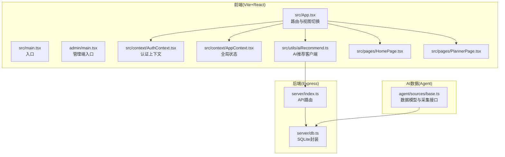
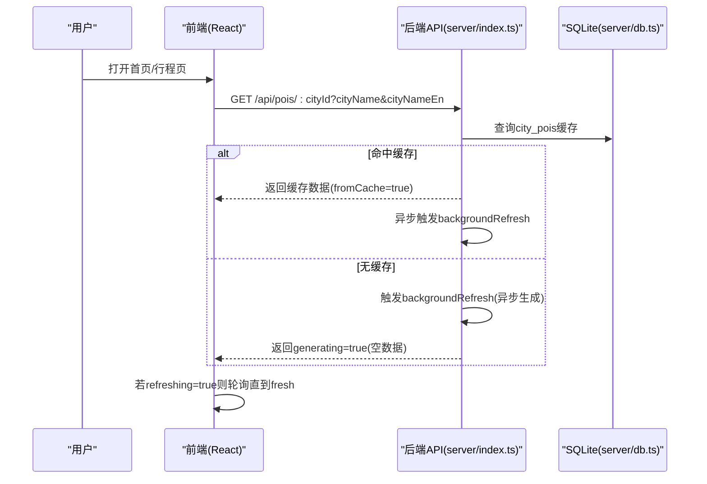
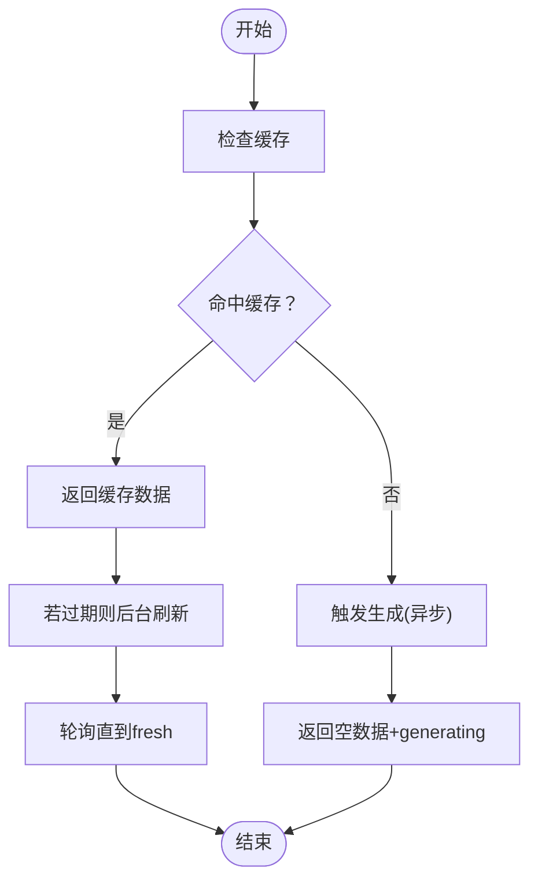
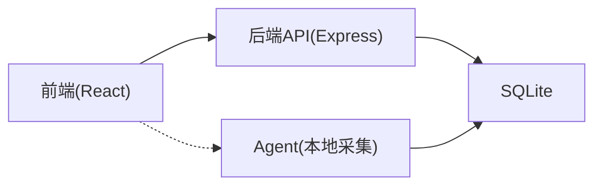

# 性能优化指南

<cite>
**本文档引用的文件**
- [package.json](file://package.json)
- [vite.config.ts](file://vite.config.ts)
- [src/App.tsx](file://src/App.tsx)
- [src/main.tsx](file://src/main.tsx)
- [admin/main.tsx](file://admin/main.tsx)
- [src/context/AppContext.tsx](file://src/context/AppContext.tsx)
- [src/context/AuthContext.tsx](file://src/context/AuthContext.tsx)
- [src/utils/aiRecommend.ts](file://src/utils/aiRecommend.ts)
- [server/db.ts](file://server/db.ts)
- [server/index.ts](file://server/index.ts)
- [agent/sources/base.ts](file://agent/sources/base.ts)
- [src/pages/HomePage.tsx](file://src/pages/HomePage.tsx)
- [src/pages/PlannerPage.tsx](file://src/pages/PlannerPage.tsx)
- [src/types/index.ts](file://src/types/index.ts)
- [src/lib/utils.ts](file://src/lib/utils.ts)
</cite>

## 目录
1. [简介](#简介)
2. [项目结构](#项目结构)
3. [核心组件](#核心组件)
4. [架构总览](#架构总览)
5. [详细组件分析](#详细组件分析)
6. [依赖关系分析](#依赖关系分析)
7. [性能考量](#性能考量)
8. [故障排查指南](#故障排查指南)
9. [结论](#结论)
10. [附录](#附录)

## 简介
本指南面向旅行规划Demo的前端、后端与AI数据采集链路，提供系统性的性能优化方案，涵盖前端代码分割与懒加载、缓存策略、React应用优化、AI API调用优化、数据库查询与索引、构建与打包优化、性能监控与指标收集，以及移动端性能优化建议。

## 项目结构
该项目采用前后端分离架构，前端基于Vite + React，后端基于Express + SQLite，AI数据通过Agent在本地采集并缓存，前端通过API层访问缓存数据。

**图表来源**
- [src/App.tsx:1-62](file://src/App.tsx#L1-L62)
- [src/main.tsx:1-10](file://src/main.tsx#L1-L10)
- [admin/main.tsx:1-14](file://admin/main.tsx#L1-L14)
- [src/context/AuthContext.tsx:1-218](file://src/context/AuthContext.tsx#L1-L218)
- [src/context/AppContext.tsx:1-234](file://src/context/AppContext.tsx#L1-L234)
- [src/utils/aiRecommend.ts:1-251](file://src/utils/aiRecommend.ts#L1-L251)
- [server/index.ts:1-790](file://server/index.ts#L1-L790)
- [server/db.ts:1-513](file://server/db.ts#L1-L513)
- [agent/sources/base.ts:1-252](file://agent/sources/base.ts#L1-L252)

**章节来源**
- [package.json:1-59](file://package.json#L1-L59)
- [vite.config.ts:1-46](file://vite.config.ts#L1-L46)

## 核心组件
- 前端应用入口与路由：通过App.tsx根据当前视图渲染不同页面，减少不必要的全量渲染。
- 全局状态管理：AppContext集中管理行程、视图切换、预算等状态，避免深层传递。
- 认证上下文：AuthContext负责登录态、令牌存储与鉴权头注入，减少重复请求。
- AI推荐客户端：封装POI推荐的拉取、强制刷新与轮询机制，前端仅负责UI展示。
- 后端API：提供POI/酒店缓存、用户、行程、评论等接口；内置三层缓存策略。
- Agent数据采集：多源采集、合并去重、质量评估与增量刷新，保障数据新鲜度。

**章节来源**
- [src/App.tsx:17-48](file://src/App.tsx#L17-L48)
- [src/context/AppContext.tsx:1-234](file://src/context/AppContext.tsx#L1-L234)
- [src/context/AuthContext.tsx:1-218](file://src/context/AuthContext.tsx#L1-L218)
- [src/utils/aiRecommend.ts:44-143](file://src/utils/aiRecommend.ts#L44-L143)
- [server/index.ts:108-160](file://server/index.ts#L108-L160)
- [server/db.ts:237-261](file://server/db.ts#L237-L261)
- [agent/sources/base.ts:1-252](file://agent/sources/base.ts#L1-L252)

## 架构总览
前端通过代理访问后端API，后端以SQLite作为缓存层，结合AI数据Agent进行周期性刷新。AI推荐流程采用“命中即返回+后台刷新”的策略，确保首屏快速响应与后续数据更新。

**图表来源**
- [src/utils/aiRecommend.ts:44-94](file://src/utils/aiRecommend.ts#L44-L94)
- [server/index.ts:108-144](file://server/index.ts#L108-L144)
- [server/db.ts:237-261](file://server/db.ts#L237-L261)

## 详细组件分析

### 前端性能优化策略
- 代码分割与懒加载
  - 使用动态导入按需加载页面组件，降低首屏体积与初次渲染时间。
  - 示例路径：[src/App.tsx:1-62](file://src/App.tsx#L1-L62) 中的视图切换逻辑可配合动态导入实现懒加载。
- 缓存策略
  - 利用浏览器缓存与CDN，静态资源设置长效缓存；对API响应进行内存缓存（如AI推荐结果）。
  - 建议：对图片与字体资源启用HTTP缓存头，对HTML与JS设置合理ETag/Last-Modified。
- React应用优化
  - 使用useMemo/useCallback稳定子组件输入，避免不必要重渲染。
  - 示例路径：[src/pages/HomePage.tsx:49-55](file://src/pages/HomePage.tsx#L49-L55) 中的搜索结果计算使用useMemo。
  - 使用AppContext集中状态，减少跨层级传递与重复订阅。
  - 示例路径：[src/context/AppContext.tsx:83-212](file://src/context/AppContext.tsx#L83-L212) 的reducer避免深拷贝风暴。
- 渲染性能提升
  - 列表虚拟化：对长列表（如城市卡片网格）采用虚拟滚动。
  - 图片懒加载：为城市卡片与POI图片设置loading="lazy"。
  - 示例路径：[src/pages/HomePage.tsx:517-518](file://src/pages/HomePage.tsx#L517-L518)。
- 组件优化
  - 将高频交互组件拆分为独立模块，使用React.memo或自定义比较函数。
  - 示例路径：[src/lib/utils.ts:4-6](file://src/lib/utils.ts#L4-L6) 的cn工具用于高效类名合并。

**章节来源**
- [src/App.tsx:17-48](file://src/App.tsx#L17-L48)
- [src/pages/HomePage.tsx:49-55](file://src/pages/HomePage.tsx#L49-L55)
- [src/pages/HomePage.tsx:517-518](file://src/pages/HomePage.tsx#L517-L518)
- [src/context/AppContext.tsx:83-212](file://src/context/AppContext.tsx#L83-L212)
- [src/lib/utils.ts:4-6](file://src/lib/utils.ts#L4-L6)

### AI API调用优化
- 请求合并与并发控制
  - 合并同一会话内的多次POI请求，避免重复触发后台刷新。
  - 控制并发：限制同时向后端发起的刷新请求数量，防止抖动。
- 结果缓存
  - 前端对首次生成的数据进行内存缓存，刷新期间显示旧数据并提示“后台刷新中”。
  - 示例路径：[src/utils/aiRecommend.ts:74-78](file://src/utils/aiRecommend.ts#L74-L78)。
- 轮询与超时
  - 后台刷新完成后轮询直至数据新鲜，设置最大尝试次数与间隔。
  - 示例路径：[src/utils/aiRecommend.ts:170-205](file://src/utils/aiRecommend.ts#L170-L205)。
- 强制刷新
  - 用户手动触发强制刷新时，直接走“生成新数据”流程，避免等待。
  - 示例路径：[src/utils/aiRecommend.ts:99-143](file://src/utils/aiRecommend.ts#L99-L143)。

**图表来源**
- [src/utils/aiRecommend.ts:44-94](file://src/utils/aiRecommend.ts#L44-L94)
- [server/index.ts:108-144](file://server/index.ts#L108-L144)

**章节来源**
- [src/utils/aiRecommend.ts:44-205](file://src/utils/aiRecommend.ts#L44-L205)
- [server/index.ts:82-100](file://server/index.ts#L82-L100)

### 数据库查询优化与索引策略
- 表设计与索引
  - city_pois/hotels表以city_id为主键，查询按城市维度进行，具备良好局部性。
  - 建议：为trip.user_id、comments.trip_id、comments.user_id建立索引，加速关联查询。
- 事务与一致性
  - 使用WAL模式提升并发读写性能；开启外键约束保证数据一致性。
  - 示例路径：[server/db.ts:43-44](file://server/db.ts#L43-L44)。
- 写入优化
  - 使用ON CONFLICT UPSERT减少重复查询；批量写入时合并SQL语句。
  - 示例路径：[server/db.ts:253-261](file://server/db.ts#L253-L261)。
- 查询优化
  - 分页查询限制条数与偏移；对高基数字段使用索引。
  - 示例路径：[server/db.ts:344-353](file://server/db.ts#L344-L353)。

**章节来源**
- [server/db.ts:43-44](file://server/db.ts#L43-L44)
- [server/db.ts:253-261](file://server/db.ts#L253-L261)
- [server/db.ts:344-353](file://server/db.ts#L344-L353)

### 构建优化与打包优化
- Vite配置
  - 使用别名缩短导入路径，减少解析成本。
  - 示例路径：[vite.config.ts:22-26](file://vite.config.ts#L22-L26)。
  - 开发代理与静态资源服务，减少跨域与额外请求。
  - 示例路径：[vite.config.ts:36-44](file://vite.config.ts#L36-L44)。
- 产物优化
  - 启用压缩与Tree Shaking；对第三方库进行外部化处理。
  - 生产环境设置合适的缓存头与资源指纹。
- 依赖管理
  - 合理拆分依赖，避免一次性引入大型库；使用轻量替代方案。
  - 示例路径：[package.json:26-42](file://package.json#L26-L42)。

**章节来源**
- [vite.config.ts:1-46](file://vite.config.ts#L1-L46)
- [package.json:26-42](file://package.json#L26-L42)

### 性能监控与指标收集
- 前端指标
  - 关键指标：FCP/LCP/FID/CLS/TTFB、首屏渲染耗时、路由切换耗时、图片加载失败率。
  - 工具：PerformanceObserver、Navigation Timing、Web Vitals集成。
- 后端指标
  - 关键指标：QPS、P95/P99延迟、缓存命中率、数据库慢查询、AI生成耗时。
  - 工具：Prometheus/Grafana、日志聚合与告警。
- 用户行为
  - 页面停留时长、关键按钮点击率、保存行程成功率、登录转化率。
- 实施建议
  - 在关键路径埋点，定期生成报表并设定阈值告警。
  - 对热点城市与时段进行专项监控。

[本节为通用指导，无需特定文件引用]

### 移动端性能优化
- 渲染与交互
  - 减少主线程阻塞：将复杂计算拆分到Web Worker或空闲时间。
  - 使用transform与opacity动画，避免触发布局与绘制。
- 网络与缓存
  - 启用HTTP/2与连接复用；对图片进行WebP格式与尺寸裁剪。
  - 使用Service Worker实现离线缓存与预缓存。
- 电池与流量
  - 降低后台刷新频率；在省电模式下降级动画与网络请求。
- 适配与测试
  - 针对低端设备优化图片与动画；使用真实设备进行性能测试。

[本节为通用指导，无需特定文件引用]

## 依赖关系分析
前端与后端通过REST API通信，后端依赖SQLite存储；Agent独立运行，负责数据采集与入库。

**图表来源**
- [server/index.ts:1-790](file://server/index.ts#L1-L790)
- [server/db.ts:1-513](file://server/db.ts#L1-L513)
- [agent/sources/base.ts:1-252](file://agent/sources/base.ts#L1-L252)

**章节来源**
- [server/index.ts:1-790](file://server/index.ts#L1-L790)
- [server/db.ts:1-513](file://server/db.ts#L1-L513)
- [agent/sources/base.ts:1-252](file://agent/sources/base.ts#L1-L252)

## 性能考量
- 首屏优化
  - 采用代码分割与懒加载，减少初始包体；关键路由预加载。
  - 使用骨架屏与占位符提升感知速度。
- 状态与渲染
  - 合理拆分状态，避免全局频繁重渲染；使用选择器提取最小化数据。
- 网络与缓存
  - 后端三层缓存策略：新鲜(15天)、陈旧(15-30天)、过期(>30天)；AI生成异步化，避免超时。
- 数据质量
  - Agent侧合并去重与质量评估，减少后端重复处理与前端二次渲染。

[本节为综合指导，无需特定文件引用]

## 故障排查指南
- 前端常见问题
  - 视图切换卡顿：检查AppContext状态规模与useMemo使用；确认组件是否过度重渲染。
  - 图片加载缓慢：检查CDN与缓存头；对大图进行懒加载与尺寸裁剪。
- 后端常见问题
  - 缓存未命中：检查city_id是否正确；确认backgroundRefresh是否触发。
  - 数据库锁冲突：检查事务粒度与并发写入；使用WAL模式与索引优化。
- AI数据问题
  - 生成超时：确认API Key配置；检查Agent与后端的异步生成流程。
  - 数据不一致：检查去重与合并策略；核对版本号与增量更新。

**章节来源**
- [src/context/AppContext.tsx:83-212](file://src/context/AppContext.tsx#L83-L212)
- [server/db.ts:237-261](file://server/db.ts#L237-L261)
- [server/index.ts:82-100](file://server/index.ts#L82-L100)

## 结论
通过前端懒加载与状态优化、后端三层缓存与异步生成、Agent侧高质量数据采集与增量更新，以及完善的监控与移动端适配，旅行规划Demo可在保证用户体验的同时显著提升整体性能与稳定性。

## 附录
- 关键类型与数据结构
  - 行程与日程：Trip、DayPlan、ItineraryItem
  - POI与酒店：Attraction、HotelPOI
  - 用户与社交：User、Comment、TravelNote
  - 参考路径：[src/types/index.ts:1-239](file://src/types/index.ts#L1-L239)

**章节来源**
- [src/types/index.ts:1-239](file://src/types/index.ts#L1-L239)