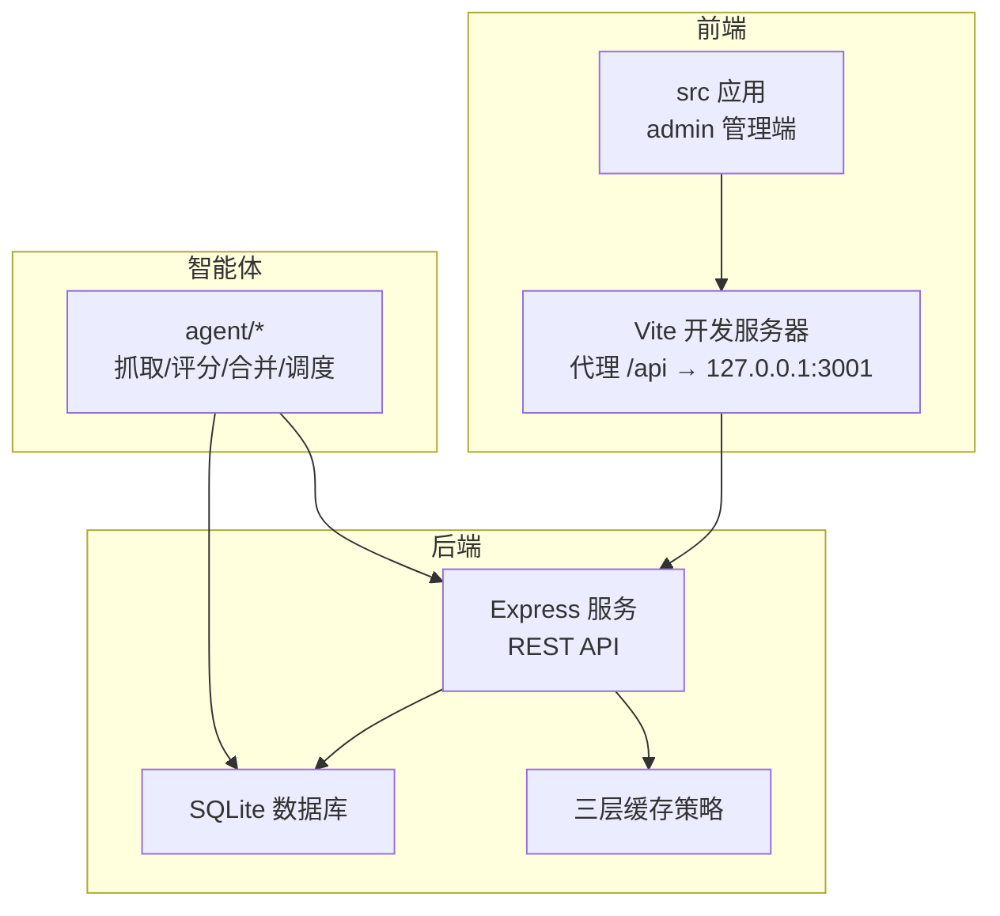
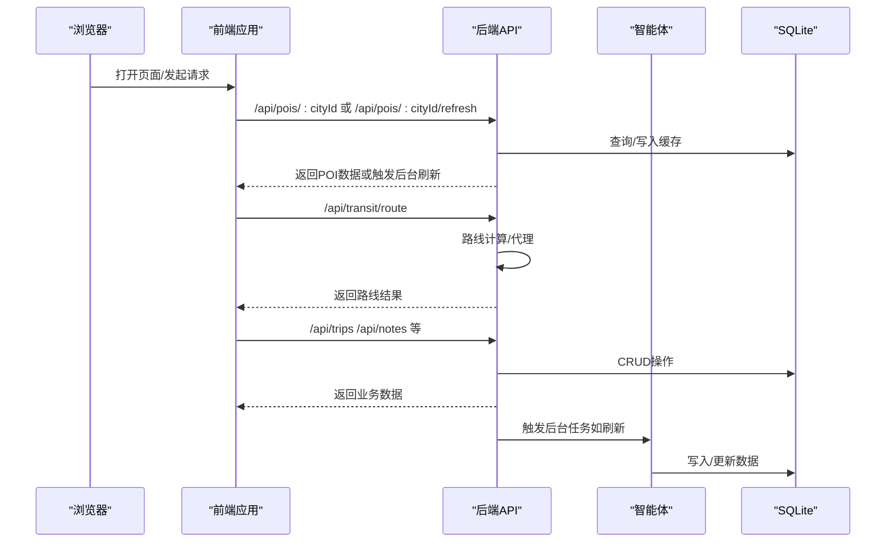
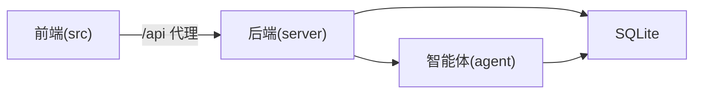

# 测试策略与质量保证

<cite>
**本文档引用的文件**
- [package.json](file://package.json)
- [vite.config.ts](file://vite.config.ts)
- [tsconfig.json](file://tsconfig.json)
- [tsconfig.app.json](file://tsconfig.app.json)
- [server/index.ts](file://server/index.ts)
- [server/admin-routes.ts](file://server/admin-routes.ts)
- [api/index.ts](file://api/index.ts)
- [src/pages/PlaceSelectionPage.tsx](file://src/pages/PlaceSelectionPage.tsx)
- [src/utils/aiRecommend.ts](file://src/utils/aiRecommend.ts)
- [src/utils/routePlanner.ts](file://src/utils/routePlanner.ts)
- [src/utils/transport.ts](file://src/utils/transport.ts)
- [src/lib/utils.ts](file://src/lib/utils.ts)
- [src/data/mock-data.ts](file://src/data/mock-data.ts)
- [src/context/AppContext.tsx](file://src/context/AppContext.tsx)
- [src/components/ui/button.tsx](file://src/components/ui/button.tsx)
- [src/components/ui/card.tsx](file://src/components/ui/card.tsx)
- [agent/sources/ai.ts](file://agent/sources/ai.ts)
- [agent/classifier.ts](file://agent/classifier.ts)
- [agent/merger.ts](file://agent/merger.ts)
- [agent/rescore.ts](file://agent/rescore.ts)
- [agent/scheduler.ts](file://agent/scheduler.ts)
- [agent/utils.ts](file://agent/utils.ts)
- [server/dedup.ts](file://server/dedup.ts)
- [scripts/test-merger.ts](file://scripts/test-merger.ts)
</cite>

## 更新摘要
**所做更改**
- 移除了已废弃的 server/test-dedup.ts 测试脚本引用
- 更新了测试脚本目录结构，反映新的测试流程
- 移除了过时的测试工具和配置引用
- 更新了测试策略以适应当前的开发工作模式

## 目录
1. [引言](#引言)
2. [项目结构](#项目结构)
3. [核心组件](#核心组件)
4. [架构总览](#架构总览)
5. [详细组件分析](#详细组件分析)
6. [依赖分析](#依赖分析)
7. [性能考虑](#性能考虑)
8. [故障排查指南](#故障排查指南)
9. [结论](#结论)
10. [附录](#附录)

## 引言
本文件为旅行规划Demo制定全面的测试策略与质量保证体系，覆盖单元测试、API测试、前端组件测试、AI调用链路测试、性能与压力测试、测试覆盖率与质量门禁、测试数据与环境配置、以及持续测试与自动化集成。目标是在不改变现有功能的前提下，确保系统在开发、集成与生产阶段的稳定性与可维护性。

**更新** 移除了不再使用的测试脚本引用，反映了新的测试流程和开发工作模式。

## 项目结构
该仓库采用前后端分离与多包组织方式：
- 前端应用位于 src/ 与 admin/，通过 Vite 构建，开发时通过代理转发 /api 到本地后端。
- 后端服务位于 server/，提供 REST API、认证、Trip/Note 管理、健康检查等。
- 智能体与数据处理位于 agent/，负责POI抓取、评分、合并、调度等。
- 资源与脚本位于根目录，包含构建、部署与数据库初始化脚本。

**图表来源**
- [vite.config.ts:36-44](file://vite.config.ts#L36-L44)
- [server/index.ts:5-26](file://server/index.ts#L5-L26)

**章节来源**
- [vite.config.ts:1-45](file://vite.config.ts#L1-L45)
- [server/index.ts:1-789](file://server/index.ts#L1-L789)

## 核心组件
- 前端页面与工具
  - PlaceSelectionPage：负责城市POI加载、AI推荐触发与刷新、选择交互。
  - 工具模块：aiRecommend（AI推荐）、routePlanner（路线规划）、transport（交通）、lib/utils（通用工具）。
  - Mock数据与上下文：mock-data、AppContext。
- 后端服务
  - REST API：POI查询、刷新、路线、认证、Trip/Note管理、健康检查。
  - 管理路由：作业创建与执行（CLI代理）。
- 智能体
  - 多数据源适配器（ai、amap、osm等）、分类器、合并器、重评分、调度器、工具集。
- 测试脚本
  - scripts/test-merger.ts：用于测试合并器功能的专用脚本。

**更新** 移除了已废弃的 server/test-dedup.ts 文件引用，更新了测试脚本目录结构。

**章节来源**
- [src/pages/PlaceSelectionPage.tsx:121-476](file://src/pages/PlaceSelectionPage.tsx#L121-L476)
- [src/utils/aiRecommend.ts](file://src/utils/aiRecommend.ts)
- [src/utils/routePlanner.ts](file://src/utils/routePlanner.ts)
- [src/utils/transport.ts](file://src/utils/transport.ts)
- [src/lib/utils.ts](file://src/lib/utils.ts)
- [src/data/mock-data.ts](file://src/data/mock-data.ts)
- [src/context/AppContext.tsx](file://src/context/AppContext.tsx)
- [server/index.ts:5-26](file://server/index.ts#L5-L26)
- [server/admin-routes.ts:867-909](file://server/admin-routes.ts#L867-L909)
- [agent/sources/ai.ts](file://agent/sources/ai.ts)
- [agent/classifier.ts](file://agent/classifier.ts)
- [agent/merger.ts](file://agent/merger.ts)
- [agent/rescore.ts](file://agent/rescore.ts)
- [agent/scheduler.ts](file://agent/scheduler.ts)
- [agent/utils.ts](file://agent/utils.ts)
- [scripts/test-merger.ts](file://scripts/test-merger.ts)

## 架构总览
下图展示从浏览器到后端再到智能体的数据流与职责边界：

**图表来源**
- [server/index.ts:5-26](file://server/index.ts#L5-L26)
- [src/pages/PlaceSelectionPage.tsx:121-476](file://src/pages/PlaceSelectionPage.tsx#L121-L476)

## 详细组件分析

### 单元测试策略
- 纯函数与算法测试
  - 目标：验证数学/逻辑函数的确定性行为，如距离计算、排序、过滤、格式化、类型转换等。
  - 建议测试点：
    - 输入边界与异常输入（空值、极值、非法格式）。
    - 输出一致性与幂等性。
    - 性能敏感路径的复杂度与时间上限。
  - 参考实现位置：
    - [src/lib/utils.ts](file://src/lib/utils.ts)
    - [src/utils/routePlanner.ts](file://src/utils/routePlanner.ts)
    - [src/utils/transport.ts](file://src/utils/transport.ts)
    - [agent/utils.ts](file://agent/utils.ts)
    - [agent/rescore.ts](file://agent/rescore.ts)

- AI推荐与数据处理
  - 目标：验证AI推荐流程、评分与合并逻辑的正确性与鲁棒性。
  - 建议测试点：
    - 分类器输出的合理性与稳定性。
    - 合并器对多源数据的去重与融合策略。
    - 重评分对权重参数的敏感性与收敛性。
  - 参考实现位置：
    - [src/utils/aiRecommend.ts](file://src/utils/aiRecommend.ts)
    - [agent/classifier.ts](file://agent/classifier.ts)
    - [agent/merger.ts](file://agent/merger.ts)
    - [agent/rescore.ts](file://agent/rescore.ts)

- Mock策略
  - 使用轻量级Mock（如jest.fn、fetch-mock）替代外部API，隔离网络波动。
  - 对于智能体模块，建议以接口抽象+工厂注入的方式替换真实适配器，便于单元测试。

**章节来源**
- [src/lib/utils.ts](file://src/lib/utils.ts)
- [src/utils/routePlanner.ts](file://src/utils/routePlanner.ts)
- [src/utils/transport.ts](file://src/utils/transport.ts)
- [agent/utils.ts](file://agent/utils.ts)
- [agent/rescore.ts](file://agent/rescore.ts)
- [src/utils/aiRecommend.ts](file://src/utils/aiRecommend.ts)
- [agent/classifier.ts](file://agent/classifier.ts)
- [agent/merger.ts](file://agent/merger.ts)

### API测试策略
- 端点测试
  - 覆盖范围：POI查询/刷新、路线代理、认证、Trip/Note管理、健康检查。
  - 断言要点：
    - 状态码与响应结构（含分页、字段完整性）。
    - 缓存命中/未命中路径的行为差异。
    - 错误场景（鉴权失败、参数缺失、资源不存在）。
  - 参考实现位置：
    - [server/index.ts:5-26](file://server/index.ts#L5-L26)

- 集成测试
  - 场景：前端通过代理访问后端，后端与SQLite交互；后端触发智能体后台任务。
  - 断言要点：
    - 请求链路完整（代理、鉴权、DB事务、缓存更新）。
    - 任务执行日志与进度上报（管理路由）。
  - 参考实现位置：
    - [vite.config.ts:36-44](file://vite.config.ts#L36-L44)
    - [server/admin-routes.ts:867-909](file://server/admin-routes.ts#L867-L909)

- 测试工具建议
  - 后端：Supertest（HTTP断言）、Jest（测试框架）、SQLite内存模式（快速回滚）。
  - 前端：Vitest（更快的单元/集成测试）、React Testing Library（组件渲染与交互）。

**章节来源**
- [server/index.ts:5-26](file://server/index.ts#L5-L26)
- [vite.config.ts:36-44](file://vite.config.ts#L36-L44)
- [server/admin-routes.ts:867-909](file://server/admin-routes.ts#L867-L909)

### 前端组件测试最佳实践
- 组件渲染与交互
  - 使用 React Testing Library 渲染组件树，模拟用户交互（点击、输入、滚动）。
  - 断言：DOM文本、属性、样式变化、事件回调是否被调用。
- 状态与副作用
  - 对异步逻辑（AI推荐、刷新）进行Mock，验证加载态、错误态、成功态的UI表现。
  - 参考实现位置：
    - [src/pages/PlaceSelectionPage.tsx:121-476](file://src/pages/PlaceSelectionPage.tsx#L121-L476)
    - [src/context/AppContext.tsx](file://src/context/AppContext.tsx)
    - [src/components/ui/button.tsx](file://src/components/ui/button.tsx)
    - [src/components/ui/card.tsx](file://src/components/ui/card.tsx)

- 工具函数测试
  - 对UI无关的工具函数进行纯函数测试，确保格式化、校验、转换逻辑稳定。
  - 参考实现位置：
    - [src/lib/utils.ts](file://src/lib/utils.ts)

- 测试数据与快照
  - 使用 mock-data 提供稳定的输入数据，避免第三方数据波动影响测试稳定性。
  - 参考实现位置：
    - [src/data/mock-data.ts](file://src/data/mock-data.ts)

**章节来源**
- [src/pages/PlaceSelectionPage.tsx:121-476](file://src/pages/PlaceSelectionPage.tsx#L121-L476)
- [src/context/AppContext.tsx](file://src/context/AppContext.tsx)
- [src/components/ui/button.tsx](file://src/components/ui/button.tsx)
- [src/components/ui/card.tsx](file://src/components/ui/card.tsx)
- [src/lib/utils.ts](file://src/lib/utils.ts)
- [src/data/mock-data.ts](file://src/data/mock-data.ts)

### AI API调用链路测试与Mock策略
- 调用链路
  - 前端触发AI推荐 → 后端接收/转发/缓存 → 智能体执行抓取/评分/合并 → 更新缓存/数据库。
- 测试策略
  - 分层Mock：前端Mock fetch → 后端Mock AI适配器 → 智能体Mock外部API。
  - 场景覆盖：首次生成、后台刷新、缓存命中、错误重试、超时与限流。
  - 参考实现位置：
    - [src/utils/aiRecommend.ts](file://src/utils/aiRecommend.ts)
    - [agent/sources/ai.ts](file://agent/sources/ai.ts)
    - [agent/classifier.ts](file://agent/classifier.ts)
    - [agent/merger.ts](file://agent/merger.ts)

- 进度与可观测性
  - 管理路由支持进度上报，可用于集成测试中验证后台任务状态。
  - 参考实现位置：
    - [server/admin-routes.ts:867-909](file://server/admin-routes.ts#L867-L909)

**章节来源**
- [src/utils/aiRecommend.ts](file://src/utils/aiRecommend.ts)
- [agent/sources/ai.ts](file://agent/sources/ai.ts)
- [agent/classifier.ts](file://agent/classifier.ts)
- [agent/merger.ts](file://agent/merger.ts)
- [server/admin-routes.ts:867-909](file://server/admin-routes.ts#L867-L909)

### 性能测试与压力测试
- 性能测试
  - 单元性能：对热点算法（排序、评分、合并）设定时间上限，使用基准测试工具。
  - 前端性能：测量组件渲染耗时、首屏时间、交互延迟。
- 压力测试
  - 后端：使用压测工具对高频端点（POI查询、刷新、路线）施压，观察吞吐、延迟、错误率。
  - 前端：模拟大量并发交互，检测内存泄漏与卡顿。
- 缓存与限流
  - 验证三层缓存策略在高并发下的命中率与一致性。
  - 参考实现位置：
    - [server/index.ts:5-26](file://server/index.ts#L5-L26)

**章节来源**
- [server/index.ts:5-26](file://server/index.ts#L5-L26)

### 测试覆盖率与质量门禁
- 覆盖率目标
  - 单元测试：核心算法与工具函数≥80%，UI组件≥60%。
  - 集成测试：关键API路径≥70%，AI链路≥60%。
- 质量门禁
  - 代码合并前必须通过CI流水线：语法检查、类型检查、单元测试、关键集成测试。
  - 低覆盖率或失败用例阻塞合流。
- 类型安全
  - TypeScript严格模式开启，禁止any，确保类型推导与接口契约清晰。
  - 参考配置：
    - [tsconfig.json](file://tsconfig.json)
    - [tsconfig.app.json:14-18](file://tsconfig.app.json#L14-L18)

**章节来源**
- [tsconfig.json](file://tsconfig.json)
- [tsconfig.app.json:1-26](file://tsconfig.app.json#L1-L26)

### 测试数据准备与测试环境配置
- 测试数据
  - 使用 mock-data 提供稳定输入，避免依赖外部服务。
  - 参考实现位置：
    - [src/data/mock-data.ts](file://src/data/mock-data.ts)
- 测试环境
  - 前端：Vite开发服务器 + 代理到本地后端。
  - 后端：SQLite内存库或专用测试库，关闭生产级日志，启用调试级别。
  - 智能体：禁用真实外部API，使用Mock适配器。
  - 参考实现位置：
    - [vite.config.ts:36-44](file://vite.config.ts#L36-L44)
    - [server/index.ts:778-787](file://server/index.ts#L778-L787)

**章节来源**
- [src/data/mock-data.ts](file://src/data/mock-data.ts)
- [vite.config.ts:36-44](file://vite.config.ts#L36-L44)
- [server/index.ts:778-787](file://server/index.ts#L778-L787)

### 持续测试与自动化集成
- CI流水线建议
  - 语法与类型检查、单元测试、集成测试、覆盖率统计、静态分析。
  - 前端构建与后端打包，产物上传Artifacts。
- 自动化触发
  - PR触发全量测试；主干推送触发冒烟测试与关键路径回归。
- 可观测性
  - 记录测试日志与覆盖率报告，失败告警。
- 参考实现位置：
  - [package.json](file://package.json)

**章节来源**
- [package.json](file://package.json)

## 依赖分析
- 前端与后端耦合
  - 前端通过 /api 代理访问后端，需保证端点稳定性与版本兼容。
- 智能体与后端协作
  - 后端可触发智能体任务，需监控任务状态与进度。
- 依赖可视化

**图表来源**
- [vite.config.ts:36-44](file://vite.config.ts#L36-L44)
- [server/index.ts:5-26](file://server/index.ts#L5-L26)

**章节来源**
- [vite.config.ts:36-44](file://vite.config.ts#L36-L44)
- [server/index.ts:5-26](file://server/index.ts#L5-L26)

## 性能考虑
- 前端性能
  - 图片懒加载与占位符、虚拟列表、防抖与节流。
  - 参考实现位置：
    - [src/pages/PlaceSelectionPage.tsx:286-287](file://src/pages/PlaceSelectionPage.tsx#L286-L287)
- 后端性能
  - 缓存策略（内存/文件/数据库）与失效策略；SQL索引与查询优化。
  - 参考实现位置：
    - [server/index.ts:5-26](file://server/index.ts#L5-L26)
- 智能体性能
  - 并发控制、重试与退避、批量处理与增量更新。
  - 参考实现位置：
    - [agent/scheduler.ts](file://agent/scheduler.ts)

**章节来源**
- [src/pages/PlaceSelectionPage.tsx:286-287](file://src/pages/PlaceSelectionPage.tsx#L286-L287)
- [server/index.ts:5-26](file://server/index.ts#L5-L26)
- [agent/scheduler.ts](file://agent/scheduler.ts)

## 故障排查指南
- 常见问题
  - 前端无法访问 /api：检查Vite代理配置与后端监听端口。
    - 参考实现位置：
      - [vite.config.ts:36-44](file://vite.config.ts#L36-L44)
  - AI推荐失败：检查API密钥、网络连通性、后端缓存状态。
    - 参考实现位置：
      - [src/pages/PlaceSelectionPage.tsx:121-476](file://src/pages/PlaceSelectionPage.tsx#L121-L476)
  - 后端任务未执行：检查管理路由的CLI代理与日志。
    - 参考实现位置：
      - [server/admin-routes.ts:867-909](file://server/admin-routes.ts#L867-L909)
  - 数据重复与一致性：运行去重测试用例，验证数据一致性。
    - 参考实现位置：
      - [server/dedup.ts](file://server/dedup.ts)
      - [scripts/test-merger.ts](file://scripts/test-merger.ts)

**更新** 移除了已废弃的 server/test-dedup.ts 文件引用，更新了测试脚本位置。

**章节来源**
- [vite.config.ts:36-44](file://vite.config.ts#L36-L44)
- [src/pages/PlaceSelectionPage.tsx:121-476](file://src/pages/PlaceSelectionPage.tsx#L121-L476)
- [server/admin-routes.ts:867-909](file://server/admin-routes.ts#L867-L909)
- [server/dedup.ts](file://server/dedup.ts)
- [scripts/test-merger.ts](file://scripts/test-merger.ts)

## 结论
通过分层测试策略（单元/集成/API/前端/智能体）、明确的Mock与覆盖率目标、完善的性能与压力测试方案，以及可落地的CI/CD集成，旅行规划Demo可在迭代过程中保持高质量与高稳定性。建议优先补齐AI链路与关键API的测试覆盖，并建立持续的质量门禁机制。

**更新** 移除了不再使用的测试脚本引用，反映了新的测试流程和开发工作模式。

## 附录
- 关键测试入口与参考
  - 前端页面与工具：PlaceSelectionPage、aiRecommend、routePlanner、transport、lib/utils、mock-data、AppContext、UI组件。
  - 后端API与管理路由：index.ts、admin-routes.ts、dedup。
  - 智能体模块：sources/ai、classifier、merger、rescore、scheduler、utils。
  - 测试脚本：scripts/test-merger.ts。
  - 构建与配置：package.json、vite.config.ts、tsconfig*.json。