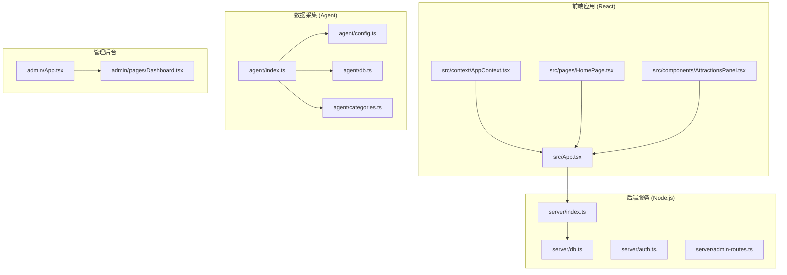
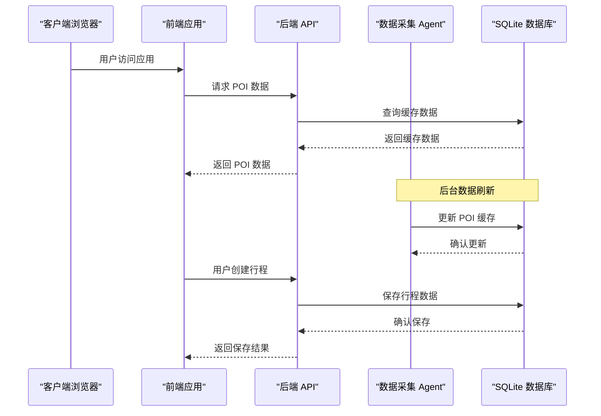
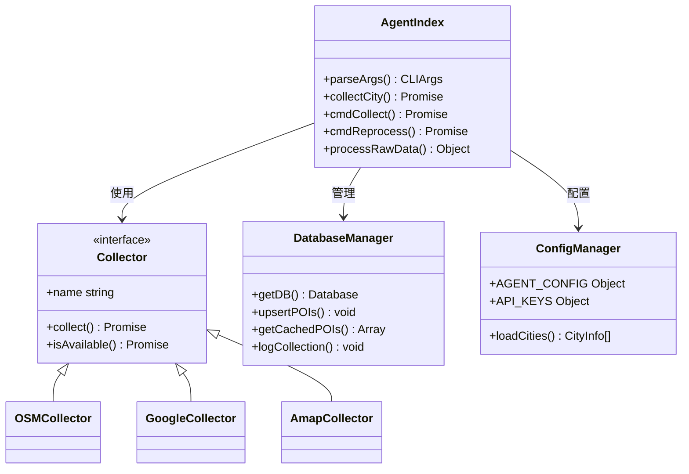
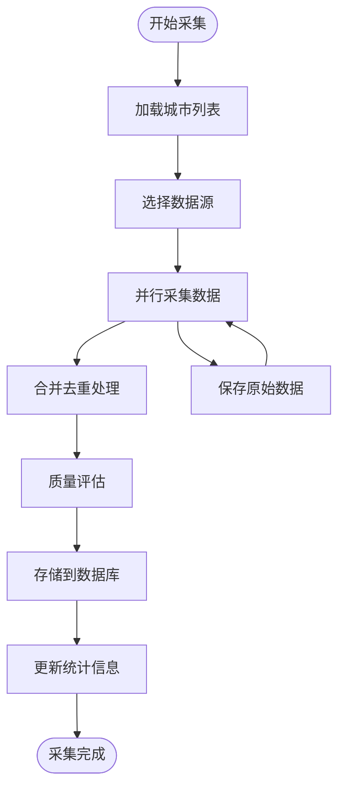
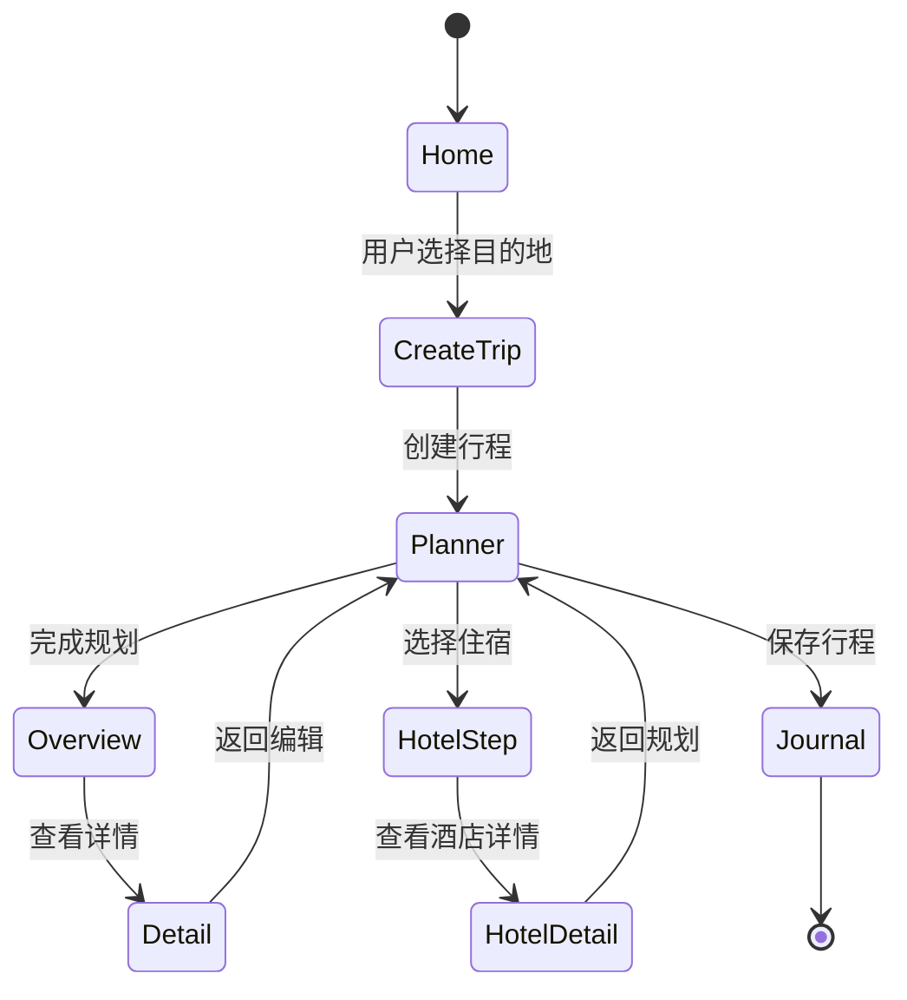
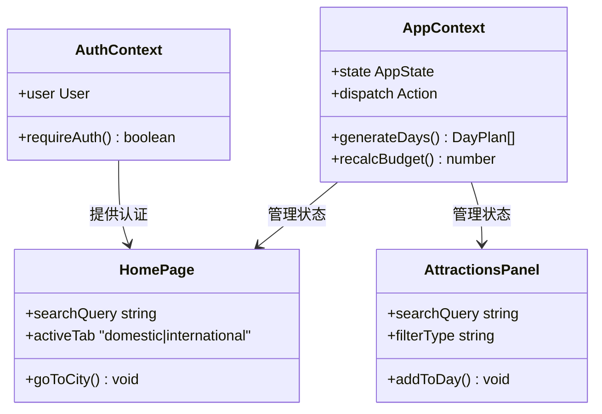
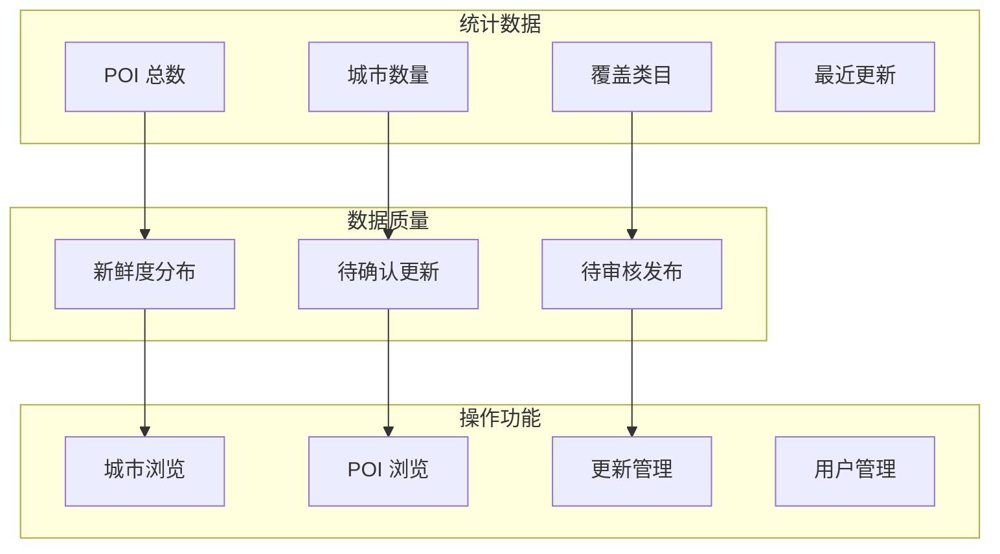
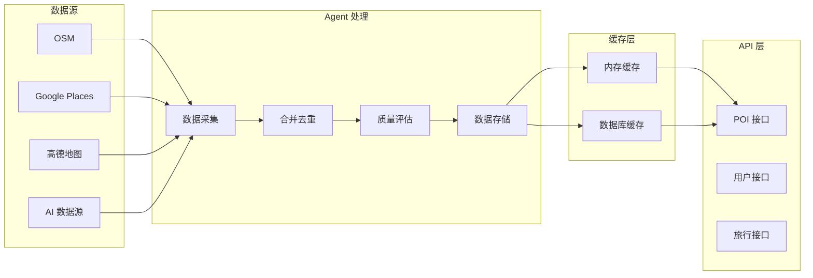
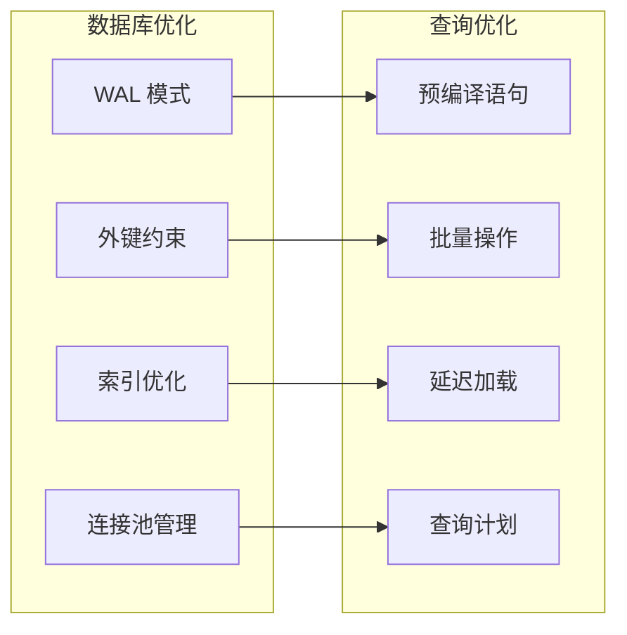

# 知识库文档

<cite>
**本文档引用的文件**
- [package.json](file://package.json)
- [agent/index.ts](file://agent/index.ts)
- [agent/config.ts](file://agent/config.ts)
- [agent/db.ts](file://agent/db.ts)
- [agent/categories.ts](file://agent/categories.ts)
- [agent/utils.ts](file://agent/utils.ts)
- [server/index.ts](file://server/index.ts)
- [server/db.ts](file://server/db.ts)
- [src/App.tsx](file://src/App.tsx)
- [src/context/AppContext.tsx](file://src/context/AppContext.tsx)
- [src/types/index.ts](file://src/types/index.ts)
- [src/pages/HomePage.tsx](file://src/pages/HomePage.tsx)
- [src/components/AttractionsPanel.tsx](file://src/components/AttractionsPanel.tsx)
- [admin/App.tsx](file://admin/App.tsx)
- [admin/pages/Dashboard.tsx](file://admin/pages/Dashboard.tsx)
- [wiki/knowledge/city-data-kb.md](file://wiki/knowledge/city-data-kb.md)
- [wiki/knowledge/scoring-kb.md](file://wiki/knowledge/scoring-kb.md)
</cite>

## 目录
1. [项目概述](#项目概述)
2. [项目结构](#项目结构)
3. [核心组件](#核心组件)
4. [架构概览](#架构概览)
5. [详细组件分析](#详细组件分析)
6. [依赖关系分析](#依赖关系分析)
7. [性能考虑](#性能考虑)
8. [故障排除指南](#故障排除指南)
9. [结论](#结论)

## 项目概述

这是一个基于 React 和 Node.js 的智能旅行规划系统，包含前端旅行规划应用、后端 API 服务、POI 数据采集 Agent 和管理后台。

### 主要功能特性

- **智能旅行规划**：AI 驱动的行程规划和景点推荐
- **多城市支持**：覆盖国内外主要旅游城市
- **实时数据缓存**：基于 SQLite 的高效数据缓存机制
- **多数据源集成**：整合多个 POI 数据源提供丰富信息
- **完整的旅行生态**：从规划到分享的一站式服务

## 项目结构



**图表来源**
- [src/App.tsx:1-62](file://src/App.tsx#L1-L62)
- [server/index.ts:1-790](file://server/index.ts#L1-L790)
- [agent/index.ts:1-800](file://agent/index.ts#L1-L800)
- [admin/App.tsx:1-27](file://admin/App.tsx#L1-L27)

**章节来源**
- [package.json:1-59](file://package.json#L1-L59)
- [src/App.tsx:1-62](file://src/App.tsx#L1-L62)
- [server/index.ts:1-790](file://server/index.ts#L1-L790)

## 核心组件

### 前端应用架构

前端采用 React + TypeScript 构建，使用 Context API 管理全局状态：

- **AppProvider**：管理旅行规划的全局状态
- **HomePage**：主页面，提供目的地搜索和推荐功能
- **AttractionsPanel**：景点推荐面板
- **AuthContext**：用户认证状态管理

### 后端服务架构

后端基于 Express.js 提供 RESTful API：

- **POI 缓存服务**：提供智能 POI 数据缓存和刷新
- **用户管理系统**：完整的用户认证和权限控制
- **旅行数据管理**：行程保存、分享和评论功能
- **酒店数据服务**：集成酒店预订和相关信息

### Agent 数据采集系统

独立的 CLI 工具，负责从多个数据源采集和处理 POI 数据：

- **多数据源支持**：OSM、Google、高德地图、AI 数据源
- **智能合并去重**：基于相似度算法的数据合并
- **质量评估**：自动质量评分和清洗
- **增量更新**：高效的增量数据更新机制

**章节来源**
- [src/context/AppContext.tsx:1-234](file://src/context/AppContext.tsx#L1-L234)
- [server/db.ts:1-513](file://server/db.ts#L1-L513)
- [agent/index.ts:1-800](file://agent/index.ts#L1-L800)

## 架构概览



**图表来源**
- [server/index.ts:108-144](file://server/index.ts#L108-L144)
- [server/db.ts:237-261](file://server/db.ts#L237-L261)
- [agent/index.ts:285-366](file://agent/index.ts#L285-L366)

## 详细组件分析

### Agent 数据采集系统

Agent 是整个系统的数据核心，负责从多个数据源收集和处理 POI 数据。

#### 核心功能模块



**图表来源**
- [agent/index.ts:70-130](file://agent/index.ts#L70-L130)
- [agent/db.ts:19-32](file://agent/db.ts#L19-L32)
- [agent/config.ts:32-77](file://agent/config.ts#L32-L77)

#### 数据采集流程



**图表来源**
- [agent/index.ts:134-208](file://agent/index.ts#L134-L208)
- [agent/index.ts:218-281](file://agent/index.ts#L218-L281)

**章节来源**
- [agent/index.ts:1-800](file://agent/index.ts#L1-L800)
- [agent/config.ts:1-182](file://agent/config.ts#L1-L182)
- [agent/db.ts:1-459](file://agent/db.ts#L1-L459)

### 后端 API 服务

后端提供完整的 RESTful API，支持旅行规划的所有核心功能。

#### API 端点设计

```mermaid
graph LR
subgraph "用户管理"
U1[/api/auth/register]
U2[/api/auth/login]
U3[/api/auth/me]
end
subgraph "POI 数据"
P1[/api/pois/:cityId]
P2[/api/pois/:cityId/refresh]
end
subgraph "旅行管理"
T1[/api/trips]
T2[/api/trips/:id]
T3[/api/trips/:id/publish]
end
subgraph "酒店服务"
H1[/api/hotels/:cityId]
H2[/api/bookings]
end
subgraph "评论系统"
C1[/api/notes/:id/comments]
end
```

**图表来源**
- [server/index.ts:5-27](file://server/index.ts#L5-L27)
- [server/index.ts:108-160](file://server/index.ts#L108-L160)

#### 缓存策略

后端实现了三层缓存机制来优化性能：

1. **内存缓存**：快速响应最近请求
2. **数据库缓存**：持久化存储 POI 数据
3. **异步刷新**：后台自动更新过期数据

**章节来源**
- [server/index.ts:1-790](file://server/index.ts#L1-L790)
- [server/db.ts:1-513](file://server/db.ts#L1-L513)

### 前端应用架构

前端采用现代化的 React 架构，使用 TypeScript 提供类型安全保障。

#### 状态管理



**图表来源**
- [src/App.tsx:17-48](file://src/App.tsx#L17-L48)
- [src/context/AppContext.tsx:83-212](file://src/context/AppContext.tsx#L83-L212)

#### 组件交互



**图表来源**
- [src/context/AppContext.tsx:1-234](file://src/context/AppContext.tsx#L1-L234)
- [src/pages/HomePage.tsx:26-80](file://src/pages/HomePage.tsx#L26-L80)
- [src/components/AttractionsPanel.tsx:23-113](file://src/components/AttractionsPanel.tsx#L23-L113)

**章节来源**
- [src/App.tsx:1-62](file://src/App.tsx#L1-L62)
- [src/context/AppContext.tsx:1-234](file://src/context/AppContext.tsx#L1-L234)
- [src/pages/HomePage.tsx:1-688](file://src/pages/HomePage.tsx#L1-L688)

### 管理后台系统

管理后台提供数据管理和监控功能：

#### 仪表板功能



**图表来源**
- [admin/pages/Dashboard.tsx:12-182](file://admin/pages/Dashboard.tsx#L12-L182)

**章节来源**
- [admin/App.tsx:1-27](file://admin/App.tsx#L1-L27)
- [admin/pages/Dashboard.tsx:1-182](file://admin/pages/Dashboard.tsx#L1-L182)

## 依赖关系分析

### 技术栈依赖

```mermaid
graph TD
subgraph "前端依赖"
R1[react@^18.3.1]
R2[react-dom@^18.3.1]
R3[react-router-dom@^7.1.1]
R4[framer-motion@^11.15.0]
R5[tailwindcss@^3.4.17]
end
subgraph "后端依赖"
N1[express@^5.2.1]
N2[better-sqlite3@^12.8.0]
N3[cors@^2.8.6]
N4[dotenv@^17.3.1]
end
subgraph "开发工具"
D1[vite@^6.0.5]
D2[typescript@~5.6.2]
D3[tsx@^4.21.0]
D4[@vitejs/plugin-react@^4.3.4]
end
R1 --> R2
N1 --> N2
N1 --> N3
N1 --> N4
```

**图表来源**
- [package.json:26-58](file://package.json#L26-L58)

### 数据流依赖



**图表来源**
- [agent/index.ts:115-130](file://agent/index.ts#L115-L130)
- [server/index.ts:108-144](file://server/index.ts#L108-L144)

**章节来源**
- [package.json:1-59](file://package.json#L1-L59)
- [agent/index.ts:1-800](file://agent/index.ts#L1-L800)
- [server/index.ts:1-790](file://server/index.ts#L1-L790)

## 性能考虑

### 缓存策略优化

系统采用了多层次的缓存策略来确保高性能：

1. **智能缓存过期**：POI 数据缓存 30 天，新鲜度检查 15 天
2. **并发控制**：Agent 支持多城市并发采集，可配置并发数量
3. **增量更新**：只更新变化的数据，减少全量处理开销
4. **内存优化**：前端使用 React.memo 和 useMemo 优化渲染性能

### 数据库优化



**图表来源**
- [server/db.ts:43-44](file://server/db.ts#L43-L44)
- [agent/db.ts:28-29](file://agent/db.ts#L28-L29)

## 故障排除指南

### 常见问题及解决方案

#### Agent 数据采集问题

| 问题类型 | 症状 | 解决方案 |
|---------|------|---------|
| API Key 缺失 | 数据源不可用 | 检查 .env.local 配置文件 |
| 并发超时 | 采集任务失败 | 调整 AGENT_CONCURRENT_CITIES 配置 |
| 数据质量差 | POI 评分低 | 检查数据源配置和合并策略 |
| 缓存失效 | 数据加载缓慢 | 清理缓存或手动触发刷新 |

#### 前端性能问题

| 问题类型 | 症状 | 解决方案 |
|---------|------|---------|
| 页面卡顿 | 渲染缓慢 | 检查 React 组件优化 |
| 内存泄漏 | 内存持续增长 | 检查事件监听器清理 |
| API 调用失败 | 数据加载错误 | 检查网络连接和 CORS 配置 |

#### 后端服务问题

| 问题类型 | 症状 | 解决方案 |
|---------|------|---------|
| 504 超时 | API 请求超时 | 检查数据库连接和查询优化 |
| 内存溢出 | 服务崩溃 | 检查大数据量处理逻辑 |
| 缓存异常 | 数据不一致 | 检查缓存同步机制 |

**章节来源**
- [agent/config.ts:79-125](file://agent/config.ts#L79-L125)
- [server/index.ts:136-143](file://server/index.ts#L136-L143)

## 结论

这个智能旅行规划系统展现了现代 Web 应用的最佳实践：

### 技术优势

1. **模块化架构**：清晰的前后端分离和职责划分
2. **高性能设计**：多层缓存和并发优化
3. **可扩展性**：插件化的数据源和功能模块
4. **用户体验**：流畅的交互和丰富的功能

### 未来发展方向

1. **AI 功能增强**：更智能的行程推荐和个性化定制
2. **实时协作**：多人行程规划和共享功能
3. **移动端优化**：原生移动应用开发
4. **国际化支持**：多语言和多币种支持

该系统为旅行规划领域提供了一个完整、可扩展的技术解决方案，具有良好的维护性和扩展性。