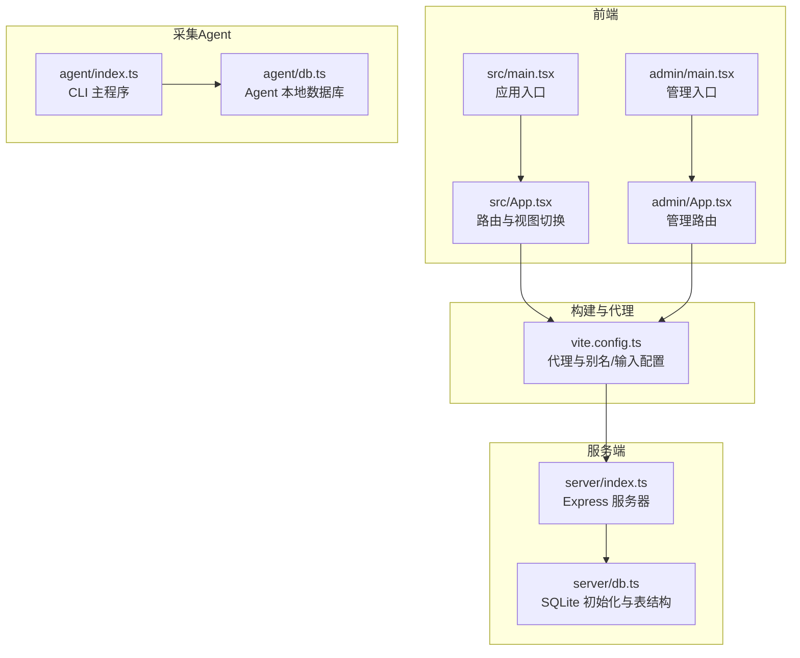
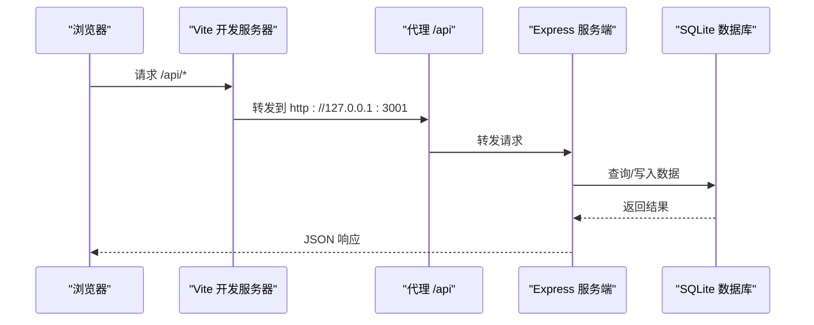
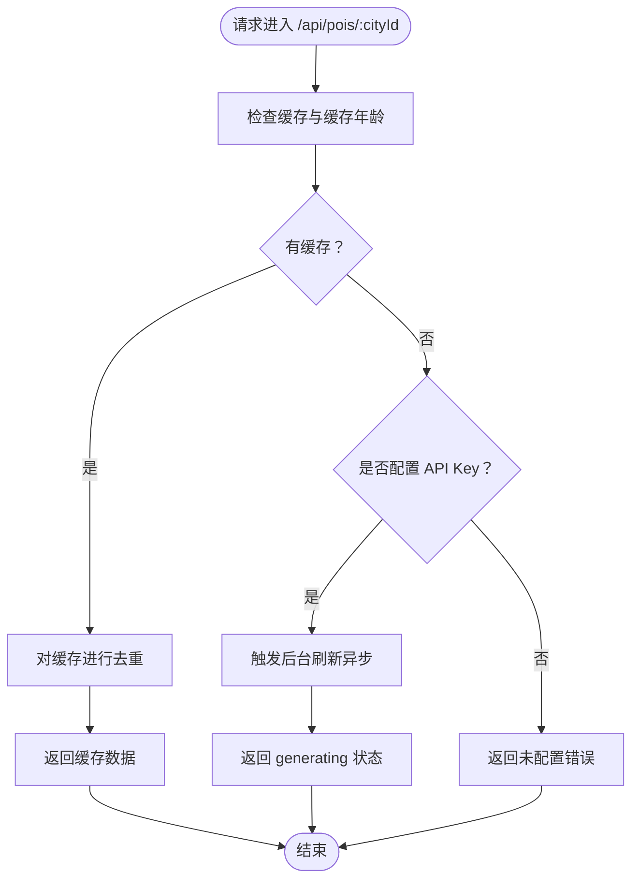
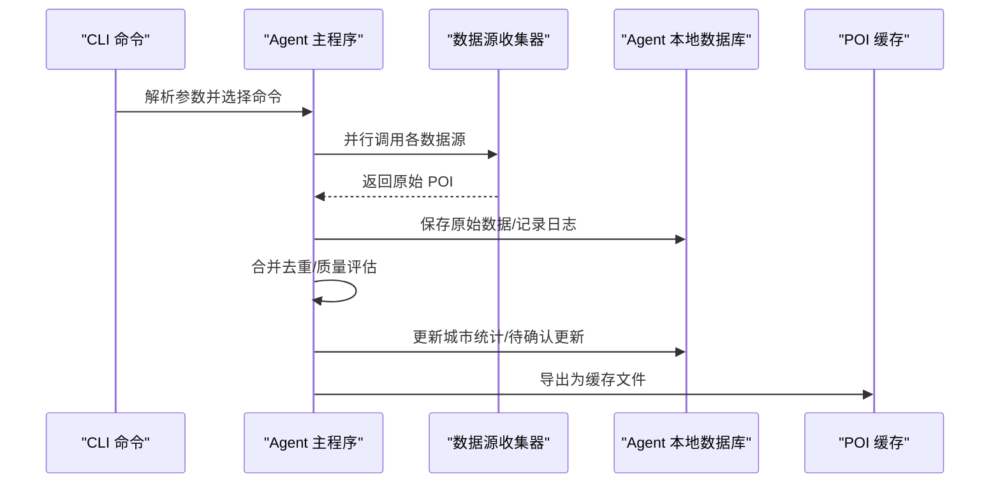
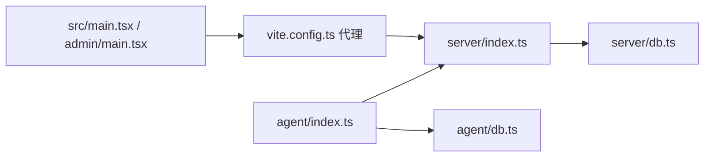

# 调试技巧与问题排查

<cite>
**本文引用的文件**
- [package.json](file://package.json)
- [vite.config.ts](file://vite.config.ts)
- [server/index.ts](file://server/index.ts)
- [server/db.ts](file://server/db.ts)
- [agent/index.ts](file://agent/index.ts)
- [agent/db.ts](file://agent/db.ts)
- [src/main.tsx](file://src/main.tsx)
- [admin/main.tsx](file://admin/main.tsx)
- [src/App.tsx](file://src/App.tsx)
- [admin/App.tsx](file://admin/App.tsx)
- [.env.local](file://.env.local)
</cite>

## 目录
1. [简介](#简介)
2. [项目结构](#项目结构)
3. [核心组件](#核心组件)
4. [架构总览](#架构总览)
5. [组件详解与调试要点](#组件详解与调试要点)
6. [依赖关系分析](#依赖关系分析)
7. [性能与稳定性建议](#性能与稳定性建议)
8. [故障排查手册](#故障排查手册)
9. [结论](#结论)
10. [附录：开发工具与流程规范](#附录开发工具与流程规范)

## 简介
本指南面向旅行规划Demo的开发者与运维人员，提供从前端到后端、从数据库到AI数据采集的系统性调试与问题排查方法。内容涵盖：
- 前端调试：React DevTools、网络请求监控、状态检查
- 后端调试：Express服务器、SQLite数据库、AI API调用
- 常见问题：编译错误、运行时错误、性能问题
- 日志与监控最佳实践
- 开发工具使用技巧：Chrome DevTools、VS Code调试器、Postman
- 问题上报与跟踪流程规范

## 项目结构
该项目采用多入口单仓库结构：
- 前端应用入口位于 src/main.tsx，路由由 src/App.tsx 控制
- 管理后台入口位于 admin/main.tsx，路由由 admin/App.tsx 控制
- 服务端位于 server/，提供REST API与静态资源托管
- 数据采集Agent位于 agent/，独立CLI工具，负责POI数据采集、清洗、合并与导出
- 构建与代理通过 Vite 配置，开发时将 /api 代理至本地服务端

图表来源
- [vite.config.ts:36-44](file://vite.config.ts#L36-L44)
- [server/index.ts:57-787](file://server/index.ts#L57-L787)
- [server/db.ts:37-147](file://server/db.ts#L37-L147)
- [agent/index.ts:1-120](file://agent/index.ts#L1-L120)
- [agent/db.ts:34-131](file://agent/db.ts#L34-L131)
- [src/main.tsx:1-10](file://src/main.tsx#L1-L10)
- [admin/main.tsx:1-14](file://admin/main.tsx#L1-L14)
- [src/App.tsx:17-48](file://src/App.tsx#L17-L48)
- [admin/App.tsx:11-26](file://admin/App.tsx#L11-L26)

章节来源
- [vite.config.ts:20-45](file://vite.config.ts#L20-L45)
- [package.json:6-25](file://package.json#L6-L25)

## 核心组件
- 前端应用与管理后台：基于 React + React Router，分别在不同入口启动
- 服务端API：Express + better-sqlite3，提供POI/酒店/用户/行程/游记等接口
- 采集Agent：独立CLI，负责从多数据源采集、合并、清洗、质量评估与导出
- 构建与代理：Vite 提供开发服务器、路由重写、代理与多入口打包

章节来源
- [src/main.tsx:1-10](file://src/main.tsx#L1-L10)
- [admin/main.tsx:1-14](file://admin/main.tsx#L1-L14)
- [server/index.ts:29-53](file://server/index.ts#L29-L53)
- [agent/index.ts:1-18](file://agent/index.ts#L1-L18)

## 架构总览
下图展示开发与运行时的关键交互：浏览器通过Vite代理访问服务端；服务端读写SQLite；Agent独立运行维护POI缓存。

图表来源
- [vite.config.ts:37-42](file://vite.config.ts#L37-L42)
- [server/index.ts:108-144](file://server/index.ts#L108-L144)
- [server/db.ts:37-147](file://server/db.ts#L37-L147)

## 组件详解与调试要点

### 前端调试：React DevTools、网络监控与状态检查
- React DevTools
  - 安装并启用浏览器扩展，定位组件树、Props与State变化
  - 关注页面切换逻辑：src/App.tsx 中根据状态切换视图，便于验证路由与上下文是否正确传递
- 网络请求监控
  - 使用浏览器 Network 面板观察 /api/* 请求，核对请求头、参数与响应体
  - 关注代理配置：确保 /api 前缀被转发到本地服务端
- 状态检查
  - 结合 React DevTools 的“Profiler”查看渲染热点
  - 检查全局上下文（如认证、应用状态）在页面间的一致性

章节来源
- [src/App.tsx:17-48](file://src/App.tsx#L17-L48)
- [vite.config.ts:36-44](file://vite.config.ts#L36-L44)

### 服务端调试：Express、SQLite与AI API
- Express 服务器
  - 启动方式：使用脚本启动服务端进程，或同时启动前后端（一键启动）
  - 健康检查：访问健康端点，确认服务端与数据库初始化状态
- SQLite 数据库
  - 初始化：首次运行会创建表结构与索引
  - 数据位置：优先使用环境变量指定目录，其次使用持久化路径，最后回退到项目内目录
- AI API 调用
  - 服务端在无缓存或缓存过期时触发后台刷新，打印日志便于追踪
  - 未配置API Key时返回明确错误，便于快速定位

图表来源
- [server/index.ts:108-144](file://server/index.ts#L108-L144)
- [server/index.ts:82-100](file://server/index.ts#L82-L100)
- [server/index.ts:76-78](file://server/index.ts#L76-L78)

章节来源
- [server/index.ts:57-787](file://server/index.ts#L57-L787)
- [server/db.ts:37-147](file://server/db.ts#L37-L147)

### Agent 调试：数据采集、合并与导出
- CLI 命令
  - 支持 collect、reprocess、export、quality、status、sources、refresh、validate 等命令
  - 可按城市、批次、并发度控制采集范围
- 数据流
  - 采集 → 原始数据落库 → 合并去重 → 质量评估 → 写入缓存/待确认更新
- 调试关注点
  - 数据源可用性与失败原因
  - 城市覆盖率、质量评分分布、待确认更新数量
  - 增量/全量刷新策略与结果

图表来源
- [agent/index.ts:285-366](file://agent/index.ts#L285-L366)
- [agent/index.ts:452-456](file://agent/index.ts#L452-L456)
- [agent/index.ts:653-800](file://agent/index.ts#L653-L800)
- [agent/db.ts:34-131](file://agent/db.ts#L34-L131)

章节来源
- [agent/index.ts:1-120](file://agent/index.ts#L1-L120)
- [agent/db.ts:34-131](file://agent/db.ts#L34-L131)

## 依赖关系分析
- 前端与服务端
  - Vite 将 /api 代理至本地服务端，开发时无需跨域
  - 前端入口分别指向主应用与管理后台
- 服务端与数据库
  - 服务端初始化SQLite并创建必要表
  - 通过统一的数据库层封装读写操作
- Agent 与服务端
  - Agent 独立运行，负责维护POI缓存；服务端读取缓存并对外提供接口

图表来源
- [vite.config.ts:36-44](file://vite.config.ts#L36-L44)
- [server/index.ts:57-787](file://server/index.ts#L57-L787)
- [server/db.ts:37-147](file://server/db.ts#L37-L147)
- [agent/index.ts:1-120](file://agent/index.ts#L1-L120)
- [agent/db.ts:34-131](file://agent/db.ts#L34-L131)

章节来源
- [package.json:6-25](file://package.json#L6-L25)
- [vite.config.ts:20-45](file://vite.config.ts#L20-L45)

## 性能与稳定性建议
- 前端
  - 合理拆分组件，减少不必要的重渲染
  - 使用浏览器性能面板识别长任务与内存增长
- 服务端
  - 缓存策略：利用三层缓存（新鲜/陈旧/异步刷新），避免超时与抖动
  - 数据库：WAL模式提升并发写入性能；为高频查询建立索引
- Agent
  - 并发控制与限速，避免对数据源造成压力
  - 增量刷新优先，降低全量采集频率

[本节为通用建议，不直接分析具体文件]

## 故障排查手册

### 常见编译错误
- 依赖缺失或版本冲突
  - 检查 package.json 中依赖与 devDependencies
  - 清理 node_modules 与 lock 文件后重装
- Vite 代理未生效
  - 确认 vite.config.ts 中代理配置与目标端口一致
- 路由重写异常
  - 确认 admin 重写插件已启用，且路径匹配规则正确

章节来源
- [package.json:26-57](file://package.json#L26-L57)
- [vite.config.ts:5-18](file://vite.config.ts#L5-L18)
- [vite.config.ts:36-44](file://vite.config.ts#L36-L44)

### 运行时错误
- 服务端未启动或端口占用
  - 查看服务端启动日志，确认端口与数据库路径
- 未配置 API Key
  - 访问健康端点检查 Key 状态；在 .env.local 中配置
- 数据库初始化失败
  - 检查 DB_DIR 与权限；确认目录存在且可写

章节来源
- [server/index.ts:780-787](file://server/index.ts#L780-L787)
- [server/index.ts:755-757](file://server/index.ts#L755-L757)
- [server/db.ts:37-44](file://server/db.ts#L37-L44)

### 网络与接口问题
- /api 请求失败
  - 使用浏览器 Network 面板查看状态码与响应体
  - 核对代理配置与服务端路由
- 跨域与鉴权
  - 确认服务端已启用 CORS；登录后携带有效 Token

章节来源
- [vite.config.ts:36-44](file://vite.config.ts#L36-L44)
- [server/index.ts:60-61](file://server/index.ts#L60-L61)

### 数据与缓存问题
- POI 缓存为空或过期
  - 强制刷新接口或等待后台异步刷新
  - 检查 Agent 是否正常导出缓存
- 酒店数据缓存
  - 同 POI 缓存策略，支持独立刷新

章节来源
- [server/index.ts:146-160](file://server/index.ts#L146-L160)
- [server/index.ts:185-212](file://server/index.ts#L185-L212)

### Agent 相关问题
- 数据源不可用
  - 使用 sources 命令查看可用性与原因
- 覆盖率低或质量差
  - 使用 quality/status 命令查看评分与分布
- 待确认更新过多
  - 通过 Admin UI 或命令 review/apply

章节来源
- [agent/index.ts:641-651](file://agent/index.ts#L641-L651)
- [agent/index.ts:536-639](file://agent/index.ts#L536-L639)

## 结论
通过结合浏览器与VS Code调试器、服务端日志与SQLite状态、Agent命令行输出与本地数据库，可以系统性地定位并解决旅行规划Demo在开发与运维过程中的各类问题。建议在日常工作中固化日志规范与监控指标，配合自动化脚本与CI流程，持续提升稳定性与可维护性。

[本节为总结，不直接分析具体文件]

## 附录：开发工具与流程规范

### Chrome DevTools 使用技巧
- Elements：检查DOM结构与样式
- Console：查看日志与错误堆栈
- Network：拦截与分析 /api 请求
- Performance/Profiler：识别渲染与计算瓶颈
- React DevTools：查看组件树、Props、State与渲染次数

[本节为通用指导，不直接分析具体文件]

### VS Code 调试器
- 前端：配置 Vite 启动配置，设置断点于入口与关键组件
- 服务端：配置 tsx 启动 server/index.ts，断点于路由与数据库操作
- Agent：配置 tsx 启动 agent/index.ts，断点于采集、合并与导出流程

[本节为通用指导，不直接分析具体文件]

### Postman API 测试
- 环境变量：设置基础URL与认证Token
- 鉴权：登录后获取Token并注入到后续请求
- 路由分类：按 POI/酒店/用户/行程/游记/预订等模块组织集合
- 响应校验：检查字段完整性与业务语义

[本节为通用指导，不直接分析具体文件]

### 日志记录与监控最佳实践
- 服务端：关键路径打印日志（如后台刷新、缓存命中/失效、AI调用）
- Agent：采集日志、质量评估报告、增量/全量刷新记录
- 数据库：初始化成功、表结构变更、索引使用情况
- 前端：关键事件与错误捕获，避免吞掉异常

章节来源
- [server/index.ts:89-99](file://server/index.ts#L89-L99)
- [server/index.ts:133-135](file://server/index.ts#L133-L135)
- [agent/index.ts:159-191](file://agent/index.ts#L159-L191)
- [agent/index.ts:686-727](file://agent/index.ts#L686-L727)

### 问题上报与跟踪流程规范
- 问题分类：编译错误、运行时错误、性能问题、数据问题
- 信息收集：日志片段、截图、复现步骤、环境信息（依赖版本、数据库路径）
- 跟踪闭环：分配责任人、设定修复时限、回归验证、文档更新

[本节为通用流程，不直接分析具体文件]