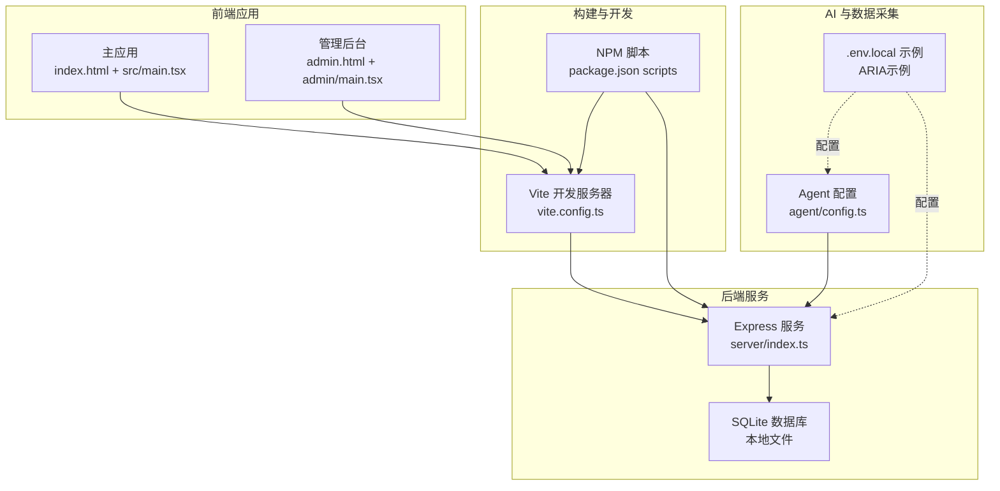
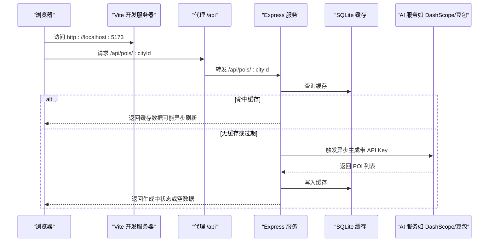
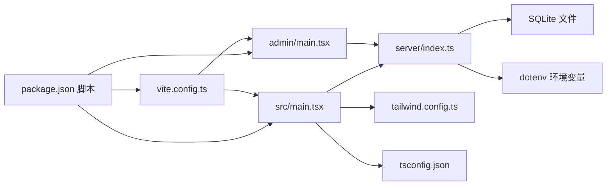

# 快速开始

<cite>
**本文引用的文件**
- [package.json](file://package.json)
- [vite.config.ts](file://vite.config.ts)
- [server/index.ts](file://server/index.ts)
- [agent/config.ts](file://agent/config.ts)
- [index.html](file://index.html)
- [admin.html](file://admin.html)
- [src/main.tsx](file://src/main.tsx)
- [admin/main.tsx](file://admin/main.tsx)
- [tsconfig.json](file://tsconfig.json)
- [tailwind.config.ts](file://tailwind.config.ts)
- [render.yaml](file://render.yaml)
- [ecosystem.config.cjs](file://ecosystem.config.cjs)
</cite>

## 目录
1. [简介](#简介)
2. [项目结构](#项目结构)
3. [核心组件](#核心组件)
4. [架构总览](#架构总览)
5. [详细组件分析](#详细组件分析)
6. [依赖关系分析](#依赖关系分析)
7. [性能注意事项](#性能注意事项)
8. [故障排除指南](#故障排除指南)
9. [结论](#结论)
10. [附录](#附录)

## 简介
本指南面向新开发者，帮助你在最短时间内成功运行旅行规划 Demo 项目。你将获得完整的环境准备、安装与配置步骤、开发服务器启动方式、AI 服务 API 密钥配置指引，以及首次运行验证与常见问题排查建议。

## 项目结构
该项目采用前后端一体化的单仓库结构，前端使用 Vite + React，后端使用 Express + SQLite，同时提供独立的管理员后台页面与数据采集 Agent 工具链。

图表来源
- [vite.config.ts:1-46](file://vite.config.ts#L1-L46)
- [server/index.ts:1-790](file://server/index.ts#L1-L790)
- [agent/config.ts:1-42](file://agent/config.ts#L1-L42)
- [index.html:1-17](file://index.html#L1-L17)
- [admin.html:1-18](file://admin.html#L1-L18)
- [src/main.tsx:1-10](file://src/main.tsx#L1-L10)
- [admin/main.tsx:1-14](file://admin/main.tsx#L1-L14)

章节来源
- [package.json:1-59](file://package.json#L1-L59)
- [vite.config.ts:1-46](file://vite.config.ts#L1-L46)
- [server/index.ts:1-790](file://server/index.ts#L1-L790)
- [agent/config.ts:1-42](file://agent/config.ts#L1-L42)
- [index.html:1-17](file://index.html#L1-L17)
- [admin.html:1-18](file://admin.html#L1-L18)
- [src/main.tsx:1-10](file://src/main.tsx#L1-L10)
- [admin/main.tsx:1-14](file://admin/main.tsx#L1-L14)

## 核心组件
- 前端主应用：基于 React 的 SPA，入口为 index.html，挂载在 #root 容器。
- 管理后台：独立的 SPA，入口为 admin.html，挂载在 #admin-root 容器。
- 开发服务器：Vite 提供热更新与代理，将 /api 代理至本地后端服务。
- 后端服务：Express + SQLite，提供旅行规划相关 API（POI、酒店、行程、游记、评论、认证等）。
- Agent 工具链：负责从多数据源采集、清洗、评分与导出，读取 .env.local 中的 API Key。
- 构建与脚本：通过 package.json 的 scripts 统一管理开发、构建、预览、服务端启动与 Agent 操作。

章节来源
- [package.json:6-25](file://package.json#L6-L25)
- [vite.config.ts:20-45](file://vite.config.ts#L20-L45)
- [server/index.ts:108-160](file://server/index.ts#L108-L160)
- [agent/config.ts:15-28](file://agent/config.ts#L15-L28)

## 架构总览
下图展示从浏览器请求到后端处理与缓存/外部 AI 服务的整体流程：

图表来源
- [vite.config.ts:36-44](file://vite.config.ts#L36-L44)
- [server/index.ts:108-160](file://server/index.ts#L108-L160)

## 详细组件分析

### 环境与依赖准备
- Node.js 版本：项目使用 TypeScript 与 Vite，建议使用当前 LTS 版本（如 18.x 或 20.x），以确保兼容性与性能。
- 包管理器：推荐使用 npm（与 package.json 脚本一致）。也可使用 pnpm/yarn，但需自行适配脚本。
- 依赖安装：在项目根目录执行安装命令，会拉取前端与后端所需依赖。

章节来源
- [package.json:26-57](file://package.json#L26-L57)

### 克隆与初始化
- 克隆仓库后，在项目根目录执行依赖安装。
- 初始化数据库：首次运行后端服务会自动初始化 SQLite 数据库文件；也可通过 Agent 初始化脚本进行数据库初始化（见“Agent 初始化”）。

章节来源
- [server/index.ts:780-787](file://server/index.ts#L780-L787)

### 环境变量与配置
- 后端 API Key（在线服务）：用于 POI/酒店的实时生成与刷新。后端通过环境变量读取，若未配置，部分接口会返回“未配置”的提示。
- Agent API Key（数据采集）：Agent 从 .env.local 读取多个数据源的 API Key，包括 DashScope、Spark、豆包等。未配置的源会被跳过。
- JWT 密钥：后端认证模块使用环境变量作为密钥，建议在生产环境设置。
- 示例环境变量（后端）：ARK_API_KEY（用于在线服务）、PORT/API_PORT（服务端口）。
- 示例环境变量（Agent）：VITE_DASHSCOPE_API_KEY/DASHSCOPE_API_KEY、SPARK_API_KEY、SPARK_API_SECRET、DOUBAO_API_KEY 等。

章节来源
- [server/index.ts:55](file://server/index.ts#L55)
- [server/index.ts:76](file://server/index.ts#L76)
- [agent/config.ts:15-28](file://agent/config.ts#L15-L28)

### 开发服务器启动
- 启动前端与后端联调：
  - 在项目根目录执行统一脚本，同时启动前端开发服务器与后端服务。
  - 前端默认端口：5173；后端默认端口：3001（可通过环境变量覆盖）。
  - 开发服务器会将 /api 代理到后端服务，便于前后端联调。
- 单独启动：
  - 前端：npm run dev
  - 后端：npm run server
  - 同时启动：npm run dev:all

章节来源
- [package.json:6-25](file://package.json#L6-L25)
- [vite.config.ts:36-44](file://vite.config.ts#L36-L44)

### 访问方式
- 主应用：http://localhost:5173
- 管理后台：http://localhost:5173/admin
- 后端健康检查：http://localhost:3001/api/health（可查看是否配置了 API Key）

章节来源
- [index.html:14](file://index.html#L14)
- [admin.html:14](file://admin.html#L14)
- [server/index.ts:755-757](file://server/index.ts#L755-L757)

### 首次运行验证
- 启动后端与前端，打开主应用首页，观察是否能正常渲染。
- 打开管理后台页面，确认路由与资源加载正常。
- 在浏览器控制台查看是否有跨域或代理失败的错误。
- 调用健康检查接口，确认后端已初始化数据库并识别到 API Key 配置状态。

章节来源
- [server/index.ts:780-787](file://server/index.ts#L780-L787)
- [server/index.ts:755-757](file://server/index.ts#L755-L757)

### Agent 初始化与数据采集
- 初始化数据库：执行 Agent 初始化脚本，确保本地数据库具备必要表结构。
- 配置 Agent API Key：在 .env.local 中设置所需的第三方 API Key（DashScope、Spark、豆包等）。
- 采集与导出：根据需要执行采集、重新处理、质量评估、导出等脚本。

章节来源
- [package.json:22](file://package.json#L22)
- [agent/config.ts:15-28](file://agent/config.ts#L15-L28)

## 依赖关系分析
- 前端与后端通过 /api 代理连接，开发阶段无需额外 CORS 配置。
- 后端依赖 SQLite 存储与 dotenv 环境变量加载。
- Tailwind CSS 与 PostCSS 用于样式构建，支持暗色模式与主题变量。
- TypeScript 与 Vite 提供类型安全与快速热更新。

图表来源
- [package.json:6-25](file://package.json#L6-L25)
- [vite.config.ts:20-45](file://vite.config.ts#L20-L45)
- [server/index.ts:29-53](file://server/index.ts#L29-L53)
- [tailwind.config.ts:1-139](file://tailwind.config.ts#L1-L139)
- [tsconfig.json:1-6](file://tsconfig.json#L1-L6)

章节来源
- [package.json:1-59](file://package.json#L1-L59)
- [vite.config.ts:1-46](file://vite.config.ts#L1-L46)
- [server/index.ts:1-790](file://server/index.ts#L1-L790)
- [tailwind.config.ts:1-139](file://tailwind.config.ts#L1-L139)
- [tsconfig.json:1-6](file://tsconfig.json#L1-L6)

## 性能注意事项
- 缓存策略：后端对 POI/酒店采用三层缓存策略（新鲜/陈旧/过期），首次无缓存时会异步触发生成，避免超时。
- 代理与并发：Vite 代理仅限开发环境；生产部署建议使用反向代理或平台提供的路由规则。
- 构建优化：生产构建会输出静态资源，后端在生产模式下直接提供静态文件并回退到 SPA 页面。

章节来源
- [server/index.ts:64-66](file://server/index.ts#L64-L66)
- [server/index.ts:108-160](file://server/index.ts#L108-L160)
- [server/index.ts:759-774](file://server/index.ts#L759-L774)

## 故障排除指南
- 无法访问管理后台
  - 确认开发服务器已启动并监听端口。
  - 确认 Vite 配置中的 /admin 重写逻辑生效。
- /api 请求失败或跨域
  - 检查 Vite 代理配置是否指向正确的后端地址。
  - 确认后端已启动且端口未被占用。
- 未配置 API Key
  - 后端健康检查接口会显示 API Key 配置状态。
  - 在 .env.local 中配置后端与 Agent 所需的 API Key。
- 数据库初始化异常
  - 首次运行后端服务会自动初始化数据库。
  - 若出现权限问题，请检查工作目录与数据库文件路径。
- 生产部署问题
  - Render 平台示例配置包含构建与启动命令及环境变量。
  - PM2 配置示例展示了生产环境的端口与环境变量设置。

章节来源
- [vite.config.ts:5-18](file://vite.config.ts#L5-L18)
- [vite.config.ts:36-44](file://vite.config.ts#L36-L44)
- [server/index.ts:755-757](file://server/index.ts#L755-L757)
- [server/index.ts:780-787](file://server/index.ts#L780-L787)
- [render.yaml:1-11](file://render.yaml#L1-L11)
- [ecosystem.config.cjs:1-16](file://ecosystem.config.cjs#L1-L16)

## 结论
按照本指南完成环境准备、依赖安装、API Key 配置与开发服务器启动后，你即可在本地运行旅行规划 Demo，并进行后续的功能探索与二次开发。遇到问题时，优先检查代理、端口、API Key 与数据库初始化状态。

## 附录

### 环境变量清单（示例）
- 后端（在线服务）：ARK_API_KEY、PORT/API_PORT、JWT_SECRET（建议）
- Agent（数据采集）：VITE_DASHSCOPE_API_KEY、DASHSCOPE_API_KEY、SPARK_API_KEY、SPARK_API_SECRET、DOUBAO_API_KEY、FOURSQUARE_API_KEY、GOOGLE_PLACES_API_KEY、AMAP_API_KEY
- 生产部署：NODE_ENV、DASHSCOPE_API_KEY（Render 示例）

章节来源
- [server/index.ts:55](file://server/index.ts#L55)
- [server/index.ts:76](file://server/index.ts#L76)
- [agent/config.ts:15-28](file://agent/config.ts#L15-L28)
- [render.yaml:7-10](file://render.yaml#L7-L10)