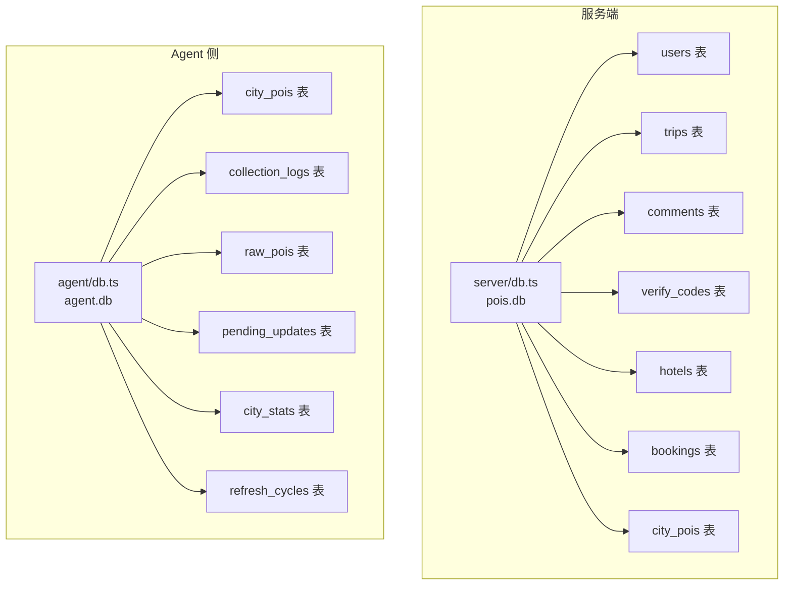
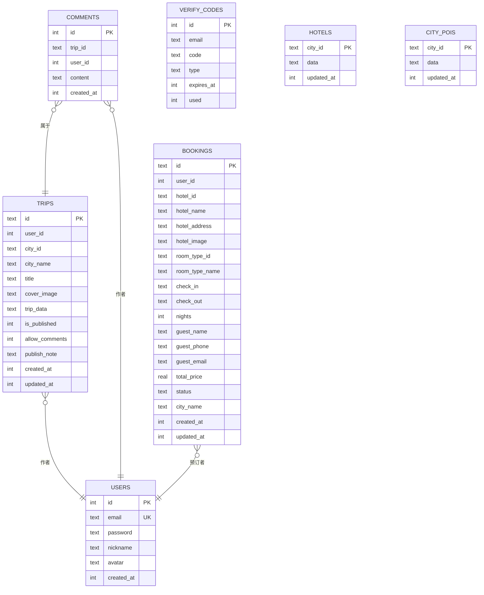
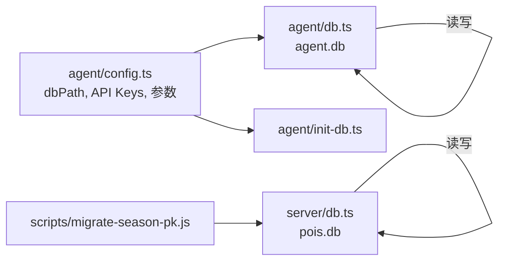

# 数据库设计

<cite>
**本文引用的文件**
- [server/db.ts](file://server/db.ts)
- [agent/db.ts](file://agent/db.ts)
- [agent/init-db.ts](file://agent/init-db.ts)
- [scripts/migrate-season-pk.js](file://scripts/migrate-season-pk.js)
- [agent/config.ts](file://agent/config.ts)
</cite>

## 目录
1. [简介](#简介)
2. [项目结构](#项目结构)
3. [核心组件](#核心组件)
4. [架构总览](#架构总览)
5. [详细组件分析](#详细组件分析)
6. [依赖分析](#依赖分析)
7. [性能考虑](#性能考虑)
8. [故障排查指南](#故障排查指南)
9. [结论](#结论)
10. [附录](#附录)

## 简介
本文件面向旅行规划Demo的数据库设计，聚焦于SQLite数据库在服务端与Agent侧的表结构、关系与约束，以及数据模型的设计原理、初始化与迁移策略、查询优化与性能调优、缓存与一致性保障、备份与维护最佳实践，并提供可直接定位到源码的SQL示例路径与数据操作指南。

## 项目结构
- 服务端数据库层位于 server/db.ts，负责用户、旅行计划、评论、验证码、酒店缓存、预订等核心业务表。
- Agent本地数据库位于 agent/db.ts，负责采集数据缓存、采集日志、刷新周期、原始采集数据、待确认更新、城市统计等。
- 数据库初始化与迁移脚本分别位于 agent/init-db.ts 与 scripts/migrate-season-pk.js。
- Agent配置文件 agent/config.ts 提供数据库路径、并发参数、来源可用性等，间接影响数据库行为。

图表来源
- [server/db.ts:46-144](file://server/db.ts#L46-L144)
- [agent/db.ts:34-131](file://agent/db.ts#L34-L131)

章节来源
- [server/db.ts:37-147](file://server/db.ts#L37-L147)
- [agent/db.ts:19-32](file://agent/db.ts#L19-L32)
- [agent/config.ts:32-36](file://agent/config.ts#L32-L36)

## 核心组件
- 服务端数据库（pois.db）
  - 用户表 users：邮箱唯一、密码、昵称、头像、创建时间。
  - 旅行计划表 trips：旅行计划全文JSON存储、发布状态、允许评论、作者外键。
  - 评论表 comments：旅行笔记评论、双外键关联 trips 与 users。
  - 验证码表 verify_codes：邮件验证码、类型、过期时间、使用标记。
  - 酒店缓存表 hotels：城市级酒店数据缓存。
  - 预订表 bookings：酒店预订记录、客人信息、价格、状态。
  - 城市POI缓存 city_pois：城市级POI数据缓存。
- Agent本地数据库（agent.db）
  - 城市POI缓存 city_pois：按城市分组的POI集合与更新时间。
  - 采集日志 collection_logs：采集来源、状态、耗时、错误信息等。
  - 原始采集 raw_pois：(城市, 来源) 唯一键，仅保留最新一次采集。
  - 待确认更新 pending_updates：每城市最多一条，聚合质量指标与问题计数。
  - 城市统计 city_stats：采集次数、失败次数、来源集合、分类分布、质量分数等。
  - 刷新周期 refresh_cycles：采集周期记录，支持运行中/完成/失败状态。

章节来源
- [server/db.ts:46-144](file://server/db.ts#L46-L144)
- [agent/db.ts:34-131](file://agent/db.ts#L34-L131)

## 架构总览
- 服务端与Agent各自独立的SQLite实例，通过不同的表结构满足不同职责：服务端关注用户与旅行计划，Agent关注采集与缓存。
- 两者均启用WAL模式与外键开关，提升并发与一致性。
- 迁移脚本确保服务端 city_pois 结构演进（单主键 city_id，季节信息内嵌POI对象）。

图表来源
- [server/db.ts:46-144](file://server/db.ts#L46-L144)

## 详细组件分析

### 服务端数据库（pois.db）
- 初始化与表结构
  - 启用WAL与外键检查。
  - 定义 users、trips、comments、verify_codes、hotels、bookings、city_pois 等表。
- 关系与约束
  - trips.user_id 外键指向 users.id。
  - comments.trip_id 外键指向 trips.id；comments.user_id 外键指向 users.id。
  - bookings.user_id 外键指向 users.id。
- 缓存与版本
  - city_pois 以 city_id 为主键，data 存储JSON，updated_at 记录更新时间。
  - 迁移脚本将旧的多列结构（含 season）简化为单主键，season信息内嵌POI对象。
- 查询与操作
  - POI缓存：Upsert、查询、计算缓存年龄。
  - 用户：创建、按邮箱/ID查询、修改密码/昵称。
  - 旅行计划：保存、查询用户行程、按发布状态查询、发布/取消发布、删除、切换评论权限。
  - 评论：新增、查询、删除。
  - 验证码：保存、验证并标记使用。
  - 酒店缓存：Upsert、查询、计算缓存年龄。
  - 预订：创建、查询用户预订、按ID查询、更新状态、取消。

章节来源
- [server/db.ts:37-147](file://server/db.ts#L37-L147)
- [server/db.ts:237-261](file://server/db.ts#L237-L261)
- [server/db.ts:263-297](file://server/db.ts#L263-L297)
- [server/db.ts:299-376](file://server/db.ts#L299-L376)
- [server/db.ts:378-408](file://server/db.ts#L378-L408)
- [server/db.ts:410-426](file://server/db.ts#L410-L426)
- [server/db.ts:428-454](file://server/db.ts#L428-L454)
- [server/db.ts:456-512](file://server/db.ts#L456-L512)

### Agent本地数据库（agent.db）
- 初始化与表结构
  - 启用WAL与外键检查。
  - 定义 city_pois、collection_logs、raw_pois、pending_updates、city_stats、refresh_cycles 等表。
- 关系与约束
  - raw_pois 主键为 (city_id, source)，确保每城市每来源仅保留最新一次采集。
  - city_pois.version 作为安全的版本号字段，支持增量更新与一致性判断。
- 采集与统计
  - upsertPOIs：按城市Upsert POI集合。
  - logCollection：记录采集日志（来源、状态、数量、耗时、错误）。
  - updateCityStats：累计采集次数、失败次数、来源集合、分类分布、质量分数。
  - saveRawPOIs/loadRawPOIs/loadRawPOIsBySource：保存与加载原始采集数据。
  - upsertPendingUpdate/getPendingUpdates/getPendingUpdate/deletePendingUpdate/applyPendingUpdate：待确认更新的增删改查与应用。
  - insertRefreshCycle/updateRefreshCycle/getLatestRefreshCycle/getRefreshHistory：刷新周期生命周期管理。
- 索引策略
  - collection_logs 上建立 (city_id, source) 与 created_at 索引，支撑按城市来源筛选与时间排序。
  - raw_pois 上建立 city_id 索引，支撑按城市检索。

章节来源
- [agent/db.ts:34-131](file://agent/db.ts#L34-L131)
- [agent/db.ts:135-155](file://agent/db.ts#L135-L155)
- [agent/db.ts:159-174](file://agent/db.ts#L159-L174)
- [agent/db.ts:178-232](file://agent/db.ts#L178-L232)
- [agent/db.ts:329-357](file://agent/db.ts#L329-L357)
- [agent/db.ts:379-448](file://agent/db.ts#L379-L448)
- [agent/db.ts:262-305](file://agent/db.ts#L262-L305)

### 数据模型设计原理
- 字段定义与数据类型
  - 文本型：邮箱、来源名、城市ID、标题、封面图、内容、状态、类型等。
  - 整型：ID、计数、布尔模拟（0/1）、时间戳（毫秒）。
  - 浮点型：价格、经纬度、质量分数。
  - JSON字符串：trip_data、data字段用于存储结构化数据，便于灵活扩展。
- 主外键约束
  - 服务端：trips.user_id 引用 users.id；comments.trip_id 引用 trips.id、comments.user_id 引用 users.id；bookings.user_id 引用 users.id。
  - Agent：raw_pois 主键 (city_id, source)。
- 业务规则
  - 邮箱唯一（users.email）。
  - 旅行计划发布状态与评论开关独立控制。
  - 验证码过期时间与使用标记防止复用。
  - 待确认更新每城市仅保留一条，避免冲突。
  - city_pois.version 支持幂等更新与版本递增。

章节来源
- [server/db.ts:56-144](file://server/db.ts#L56-L144)
- [agent/db.ts:88-100](file://agent/db.ts#L88-L100)

### 数据初始化与迁移策略
- 服务端初始化
  - 通过 initDB() 创建表结构，设置WAL与外键。
  - 位置优先级：环境变量 DB_DIR > 生产持久化目录 > 本地 server/data。
- Agent初始化
  - 通过 agent/init-db.ts 读取城市注册表，预填充 city_stats（INSERT OR IGNORE）。
  - 自动创建 agent.db 与所有表。
- 迁移策略（服务端 city_pois）
  - 检测旧表是否包含 season 列。
  - 若存在则迁移：按 city_id 合并多个 season 的 POI 数据，为缺失的 POI 补充 seasonScores 与 seasonHighlight。
  - 删除旧表，重命名新表，完成单主键改造。
  - 通过 PRAGMA table_info 检测列存在性，确保幂等执行。

章节来源
- [server/db.ts:37-147](file://server/db.ts#L37-L147)
- [agent/init-db.ts:13-40](file://agent/init-db.ts#L13-L40)
- [scripts/migrate-season-pk.js:38-125](file://scripts/migrate-season-pk.js#L38-L125)

### 查询优化与性能调优
- WAL模式
  - 服务端与Agent均启用 journal_mode=WAL，提升并发读写性能与崩溃恢复能力。
- 外键检查
  - 开启 foreign_keys=ON，确保参照完整性。
- 索引策略
  - collection_logs(idx_logs_city_source, idx_logs_created)：加速按城市来源过滤与按时间倒序。
  - raw_pois(idx_raw_city)：加速按城市检索原始采集数据。
- JSON字段访问
  - 使用JSON存储结构化数据，避免复杂JOIN；必要时在应用层进行JSON解析与聚合。
- 批量操作
  - 使用 INSERT OR REPLACE/INSERT OR IGNORE 与 ON CONFLICT DO UPDATE 减少条件分支与事务开销。
- 缓存与版本
  - city_pois.updated_at 与 version 字段用于缓存失效与幂等更新，降低重复写入。

章节来源
- [server/db.ts:43-44](file://server/db.ts#L43-L44)
- [agent/db.ts:28-29](file://agent/db.ts#L28-L29)
- [agent/db.ts:60-66](file://agent/db.ts#L60-L66)
- [agent/db.ts:98-100](file://agent/db.ts#L98-L100)

### 缓存策略与数据一致性
- 缓存策略
  - 服务端 city_pois/hotels：以城市为单位缓存JSON数据，提供 upsert 与查询接口，支持计算缓存年龄。
  - Agent city_pois：按城市Upsert POI集合，version 字段用于版本递增。
- 一致性保障
  - WAL模式减少写放大与锁竞争。
  - 外键约束确保引用关系正确。
  - 迁移脚本对旧schema进行结构化升级，保证数据内嵌字段的完整性。
  - 待确认更新（pending_updates）与城市统计（city_stats）配合，形成采集质量闭环。

章节来源
- [server/db.ts:237-261](file://server/db.ts#L237-L261)
- [server/db.ts:428-454](file://server/db.ts#L428-L454)
- [agent/db.ts:135-155](file://agent/db.ts#L135-L155)
- [agent/db.ts:309-321](file://agent/db.ts#L309-L321)
- [scripts/migrate-season-pk.js:70-97](file://scripts/migrate-season-pk.js#L70-L97)

### 备份、恢复与维护最佳实践
- 备份
  - 复制 pois.db 与 agent.db 文件至安全位置。
  - 在应用停机或低峰时段执行备份，避免WAL文件碎片化。
- 恢复
  - 将备份文件放回原位，重启服务后验证表结构与关键数据。
  - 如需回滚，先停止服务，再替换数据库文件并执行必要的迁移脚本。
- 维护
  - 定期清理过期验证码（verify_codes）与归档历史采集日志。
  - 监控 city_stats 中 failure_count 与 sources_used，评估采集健康度。
  - 使用 PRAGMA integrity_check 与 integrity_check_vtab 验证数据库完整性。

章节来源
- [server/db.ts:412-426](file://server/db.ts#L412-L426)
- [agent/db.ts:45-66](file://agent/db.ts#L45-L66)

## 依赖分析
- 组件耦合
  - 服务端与Agent数据库彼此独立，仅在数据同步（如导出/导入）场景产生间接依赖。
  - 服务端 trips.comments 与 users/comments 之间存在双向外键依赖。
- 外部依赖
  - better-sqlite3：SQLite驱动。
  - dotenv：加载 .env.local 中的API密钥与运行参数。
- 配置影响
  - Agent配置中的 dbPath 决定 agent.db 的存放路径。
  - 源可用性检测影响采集来源选择，进而影响 raw_pois 与 city_stats 的更新频率。

图表来源
- [agent/config.ts:32-36](file://agent/config.ts#L32-L36)
- [agent/init-db.ts:10-16](file://agent/init-db.ts#L10-L16)
- [scripts/migrate-season-pk.js:23-26](file://scripts/migrate-season-pk.js#L23-L26)
- [server/db.ts:22-27](file://server/db.ts#L22-L27)

章节来源
- [agent/config.ts:15-17](file://agent/config.ts#L15-L17)
- [agent/config.ts:32-36](file://agent/config.ts#L32-L36)
- [agent/init-db.ts:10-16](file://agent/init-db.ts#L10-L16)
- [scripts/migrate-season-pk.js:23-26](file://scripts/migrate-season-pk.js#L23-L26)

## 性能考虑
- 并发与锁
  - WAL模式显著提升读写并发，减少写锁阻塞。
- 索引与扫描
  - 为高频查询字段建立索引（如 collection_logs 的复合索引、raw_pois 的城市索引）。
- 事务与批量
  - 将相关写操作放入单个事务，减少提交次数。
- 缓存命中
  - 利用 city_pois/hotels 的缓存与版本字段，避免重复计算与网络请求。
- 清理策略
  - 定期清理过期验证码与历史日志，保持表规模可控。

章节来源
- [server/db.ts:43-44](file://server/db.ts#L43-L44)
- [agent/db.ts:28-29](file://agent/db.ts#L28-L29)
- [agent/db.ts:60-66](file://agent/db.ts#L60-L66)
- [agent/db.ts:98-100](file://agent/db.ts#L98-L100)

## 故障排查指南
- 表结构异常
  - 使用 PRAGMA table_info(table) 检查列定义，结合迁移脚本逻辑定位差异。
- 外键约束错误
  - 检查引用ID是否存在，确认插入顺序与事务边界。
- 缓存未命中或过期
  - 校验 city_pois/hotels 的 updated_at 与 JSON 数据格式，必要时重新生成缓存。
- 采集日志异常
  - 检查 collection_logs 的 created_at 排序与 (city_id, source) 组合，定位采集失败来源。
- 验证码无效
  - 确认验证码未过期且未被使用，检查 verify_codes 的 used 标记。

章节来源
- [scripts/migrate-season-pk.js:38-46](file://scripts/migrate-season-pk.js#L38-L46)
- [server/db.ts:82-96](file://server/db.ts#L82-L96)
- [server/db.ts:412-426](file://server/db.ts#L412-L426)
- [agent/db.ts:45-66](file://agent/db.ts#L45-L66)

## 结论
本设计以SQLite为核心，服务端与Agent侧分别承担用户/旅行计划与采集/缓存职责，通过WAL与外键保障一致性，借助索引与缓存提升性能。迁移脚本确保表结构随业务演进而平滑升级，初始化与维护流程清晰可操作。遵循本文的查询优化、缓存策略与运维最佳实践，可在保证数据一致性的前提下获得稳定高效的运行表现。

## 附录
- 实际SQL示例路径（仅提供路径，不展示具体代码）
  - 创建服务端表结构：[server/db.ts:46-144](file://server/db.ts#L46-L144)
  - 初始化Agent数据库并预填充城市统计：[agent/init-db.ts:23-31](file://agent/init-db.ts#L23-L31)
  - 迁移服务端 city_pois 表结构：[scripts/migrate-season-pk.js:99-120](file://scripts/migrate-season-pk.js#L99-L120)
  - 服务端POI缓存Upsert与查询：[server/db.ts:253-261](file://server/db.ts#L253-L261)
  - Agent采集日志记录：[agent/db.ts:169-174](file://agent/db.ts#L169-L174)
  - Agent原始采集数据保存与加载：[agent/db.ts:329-357](file://agent/db.ts#L329-L357)
  - Agent待确认更新应用：[agent/db.ts:431-448](file://agent/db.ts#L431-L448)
  - 服务端旅行计划保存与发布：[server/db.ts:316-365](file://server/db.ts#L316-L365)
  - 服务端评论新增与查询：[server/db.ts:388-404](file://server/db.ts#L388-L404)
  - 服务端预订创建与状态更新：[server/db.ts:480-512](file://server/db.ts#L480-L512)
  - Agent刷新周期生命周期管理：[agent/db.ts:262-305](file://agent/db.ts#L262-L305)