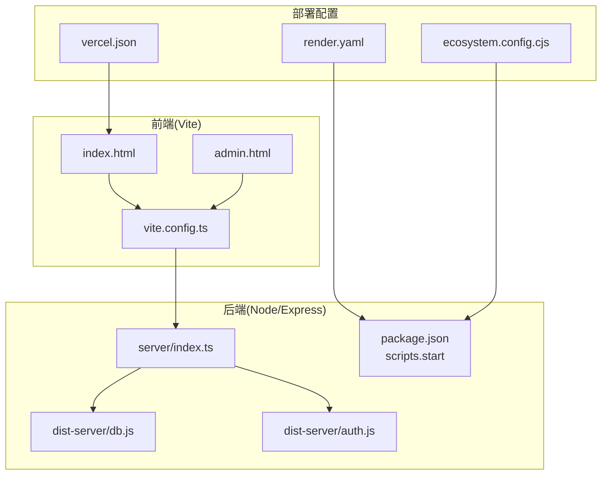
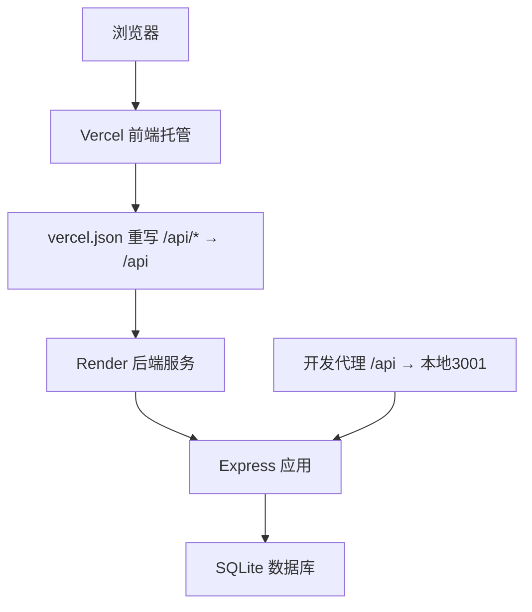
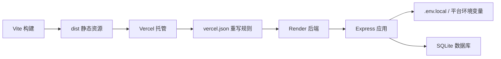
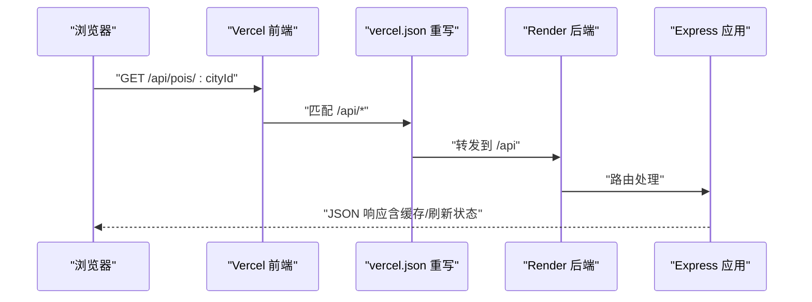
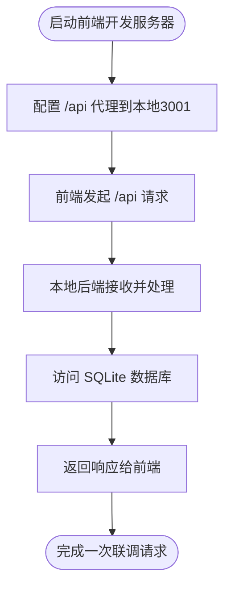

# 云平台部署

<cite>
**本文引用的文件**
- [vercel.json](file://vercel.json)
- [render.yaml](file://render.yaml)
- [ecosystem.config.cjs](file://ecosystem.config.cjs)
- [package.json](file://package.json)
- [VERCEL_RAILWAY_DEPLOY.md](file://VERCEL_RAILWAY_DEPLOY.md)
- [server/index.ts](file://server/index.ts)
- [vite.config.ts](file://vite.config.ts)
- [agent/config.ts](file://agent/config.ts)
- [dist-server/index.js](file://dist-server/index.js)
- [dist-server/db.js](file://dist-server/db.js)
- [dist-server/auth.js](file://dist-server/auth.js)
</cite>

## 目录
1. [简介](#简介)
2. [项目结构](#项目结构)
3. [核心组件](#核心组件)
4. [架构总览](#架构总览)
5. [详细组件分析](#详细组件分析)
6. [依赖关系分析](#依赖关系分析)
7. [性能考量](#性能考量)
8. [故障排除指南](#故障排除指南)
9. [结论](#结论)
10. [附录](#附录)

## 简介
本文件面向旅行规划Demo的云平台部署，覆盖以下目标：
- Vercel前端部署配置：vercel.json重写规则、环境变量与域名绑定
- Render后端部署流程：render.yaml配置与自动部署
- PM2进程管理：ecosystem.config.cjs部署参数与进程监控
- 多环境策略：开发、测试、生产差异配置
- 部署前准备、步骤与验证方法
- 故障排除与回滚策略

## 项目结构
该项目采用“前端Vite + 后端Express”的双层架构，前端通过Vite构建静态资源，后端提供REST API并内置SQLite数据库；同时支持在Render等平台以Node.js应用形式部署。

图表来源
- [vite.config.ts:1-46](file://vite.config.ts#L1-L46)
- [server/index.ts:1-790](file://server/index.ts#L1-L790)
- [vercel.json:1-6](file://vercel.json#L1-L6)
- [render.yaml:1-12](file://render.yaml#L1-L12)
- [ecosystem.config.cjs:1-17](file://ecosystem.config.cjs#L1-L17)
- [package.json:1-59](file://package.json#L1-L59)

章节来源
- [vite.config.ts:1-46](file://vite.config.ts#L1-L46)
- [server/index.ts:1-790](file://server/index.ts#L1-L790)
- [vercel.json:1-6](file://vercel.json#L1-L6)
- [render.yaml:1-12](file://render.yaml#L1-L12)
- [ecosystem.config.cjs:1-17](file://ecosystem.config.cjs#L1-L17)
- [package.json:1-59](file://package.json#L1-L59)

## 核心组件
- 前端构建与代理
  - Vite构建入口包含主站与管理页，开发模式下通过代理将/api转发至本地后端端口
  - 生产环境由后端统一托管静态资源并提供SPA回退
- 后端API与数据库
  - Express提供REST接口，内置SQLite数据库路径可按环境变量调整
  - 支持健康检查、鉴权、行程与游记管理、酒店与POI缓存等能力
- 部署配置
  - Vercel：通过重写规则将/api路由转发至后端
  - Render：声明Node运行时、构建与启动命令、环境变量
  - PM2：定义应用名称、工作目录、环境变量与启动参数

章节来源
- [vite.config.ts:1-46](file://vite.config.ts#L1-L46)
- [server/index.ts:1-790](file://server/index.ts#L1-L790)
- [vercel.json:1-6](file://vercel.json#L1-L6)
- [render.yaml:1-12](file://render.yaml#L1-L12)
- [ecosystem.config.cjs:1-17](file://ecosystem.config.cjs#L1-L17)
- [package.json:1-59](file://package.json#L1-L59)

## 架构总览
下图展示从前端到后端的关键交互与部署位置：

图表来源
- [vercel.json:1-6](file://vercel.json#L1-L6)
- [render.yaml:1-12](file://render.yaml#L1-L12)
- [server/index.ts:1-790](file://server/index.ts#L1-L790)
- [vite.config.ts:1-46](file://vite.config.ts#L1-L46)

## 详细组件分析

### Vercel 部署配置
- 重写规则
  - 将所有/api前缀请求重写到后端入口，确保前端静态站点能正确转发API请求
- 前端构建与输出
  - 框架预设：Vite
  - 构建命令：使用项目脚本进行打包
  - 输出目录：dist
  - 安装命令：npm install
- 域名绑定
  - 可在项目设置的Domains中绑定自定义域名
- 日志与更新
  - 部署日志可在项目页面的Deployments中查看
  - 推送GitHub后自动触发重新部署

章节来源
- [vercel.json:1-6](file://vercel.json#L1-L6)
- [VERCEL_RAILWAY_DEPLOY.md:7-31](file://VERCEL_RAILWAY_DEPLOY.md#L7-L31)
- [VERCEL_RAILWAY_DEPLOY.md:95-101](file://VERCEL_RAILWAY_DEPLOY.md#L95-L101)
- [VERCEL_RAILWAY_DEPLOY.md:103-104](file://VERCEL_RAILWAY_DEPLOY.md#L103-L104)

### Render 平台部署流程
- 项目导入
  - 使用GitHub仓库一键导入
- 服务配置
  - 运行时：Node
  - 构建命令：安装依赖并构建
  - 启动命令：启动生产服务
- 环境变量
  - NODE_ENV=production
  - DASHSCOPE_API_KEY（敏感变量，不进行同步）
- 域名与日志
  - 可在Networking中绑定自定义域名
  - 部署日志在Deployments中查看

章节来源
- [render.yaml:1-12](file://render.yaml#L1-L12)
- [VERCEL_RAILWAY_DEPLOY.md:33-66](file://VERCEL_RAILWAY_DEPLOY.md#L33-L66)
- [VERCEL_RAILWAY_DEPLOY.md:95-101](file://VERCEL_RAILWAY_DEPLOY.md#L95-L101)

### PM2 进程管理配置
- 应用定义
  - 名称：aitrip
  - 启动脚本：npm（参数为start）
  - 工作目录：/opt/aitrip
- 环境变量
  - NODE_ENV=production
  - PORT=3001
- 适用场景
  - 传统服务器或容器内常驻进程管理
  - 结合Nginx反向代理对外提供服务

章节来源
- [ecosystem.config.cjs:1-17](file://ecosystem.config.cjs#L1-L17)

### 多环境部署策略
- 开发环境
  - 前端：Vite开发服务器，代理/api到本地3001
  - 后端：本地直接启动，监听3001端口
  - 环境变量：通过.env.local注入，如API密钥、数据库路径等
- 测试环境
  - 建议使用Render的预览分支或独立分支部署，复用相同配置
  - 环境变量与生产一致，但数据库与第三方API配额需隔离
- 生产环境
  - 前端：Vercel托管，静态资源与SPA回退
  - 后端：Render托管，生产命令与环境变量
  - API密钥与数据库路径通过平台环境变量注入

章节来源
- [vite.config.ts:36-44](file://vite.config.ts#L36-L44)
- [server/index.ts:778-787](file://server/index.ts#L778-L787)
- [agent/config.ts:15-42](file://agent/config.ts#L15-L42)
- [render.yaml:7-12](file://render.yaml#L7-L12)

### 部署前准备
- 前端
  - 确认Vite构建产物输出到dist
  - 在vercel.json中保留/api重写规则
- 后端
  - 准备环境变量文件（.env.local），包含API密钥与数据库路径
  - 确保package.json的start命令可正常启动服务
- 平台
  - Vercel：关联GitHub仓库，设置框架与构建参数
  - Render：关联GitHub仓库，设置Node运行时与环境变量

章节来源
- [vercel.json:1-6](file://vercel.json#L1-L6)
- [package.json:6-25](file://package.json#L6-L25)
- [agent/config.ts:15-28](file://agent/config.ts#L15-L28)
- [VERCEL_RAILWAY_DEPLOY.md:3-26](file://VERCEL_RAILWAY_DEPLOY.md#L3-L26)

### 部署步骤
- Vercel前端部署
  - 登录Vercel，导入仓库，设置框架为Vite，构建命令与输出目录
  - 等待构建完成，获得Vercel域名
- Render后端部署
  - 登录Render，导入仓库，设置运行时与环境变量
  - 设置自定义启动命令，等待部署完成
- 前后端联调
  - 修改前端API地址为Render后端域名
  - 推送变更后，Vercel自动重新部署

章节来源
- [VERCEL_RAILWAY_DEPLOY.md:7-31](file://VERCEL_RAILWAY_DEPLOY.md#L7-L31)
- [VERCEL_RAILWAY_DEPLOY.md:33-66](file://VERCEL_RAILWAY_DEPLOY.md#L33-L66)
- [VERCEL_RAILWAY_DEPLOY.md:68-89](file://VERCEL_RAILWAY_DEPLOY.md#L68-L89)

### 验证方法
- 健康检查
  - 访问后端健康接口，确认服务可用与API密钥状态
- 功能验证
  - 前端访问首页与管理页，确认静态资源与SPA回退正常
  - 调用POI/酒店接口，确认缓存与异步刷新逻辑
- 日志与监控
  - 查看Vercel与Render的部署日志，定位异常

章节来源
- [server/index.ts:753-757](file://server/index.ts#L753-L757)
- [VERCEL_RAILWAY_DEPLOY.md:99-101](file://VERCEL_RAILWAY_DEPLOY.md#L99-L101)

## 依赖关系分析
- 前端对后端的依赖
  - 开发阶段通过代理将/api转发至本地后端
  - 生产阶段通过Vercel重写规则将/api转发至Render后端
- 后端对环境变量的依赖
  - API密钥、端口、数据库路径等通过环境变量注入
- 部署配置对运行时的依赖
  - Vercel与Render分别提供不同运行时与环境变量注入机制

图表来源
- [vite.config.ts:28-35](file://vite.config.ts#L28-L35)
- [vercel.json:2-4](file://vercel.json#L2-L4)
- [render.yaml:4-6](file://render.yaml#L4-L6)
- [server/index.ts:38-58](file://server/index.ts#L38-L58)
- [dist-server/db.js:24](file://dist-server/db.js#L24)

章节来源
- [vite.config.ts:28-35](file://vite.config.ts#L28-L35)
- [vercel.json:2-4](file://vercel.json#L2-L4)
- [render.yaml:4-6](file://render.yaml#L4-L6)
- [server/index.ts:38-58](file://server/index.ts#L38-L58)
- [dist-server/db.js:24](file://dist-server/db.js#L24)

## 性能考量
- 缓存策略
  - POI与酒店数据采用三层缓存策略，结合异步刷新避免超时
- 资源体积
  - 前端构建产物输出至dist，建议开启压缩与分包优化
- 代理与跨域
  - 开发代理简化联调，生产通过重写与CORS处理跨域

章节来源
- [server/index.ts:64-66](file://server/index.ts#L64-L66)
- [server/index.ts:108-144](file://server/index.ts#L108-L144)
- [server/index.ts:186-212](file://server/index.ts#L186-L212)
- [vite.config.ts:36-44](file://vite.config.ts#L36-L44)

## 故障排除指南
- 健康检查失败
  - 检查后端健康接口返回，确认API密钥是否配置
- 404或路由异常
  - 确认vercel.json重写规则存在且生效
  - 确认前端API地址已指向Render后端域名
- 数据库初始化问题
  - 确认数据库路径与权限，必要时在Render上设置DB_DIR
- 环境变量缺失
  - 在Render平台补充敏感变量（如DASHSCOPE_API_KEY），并在后端正确读取
- 日志定位
  - 在Vercel与Render的Deployments中查看部署日志，定位构建与启动异常

章节来源
- [server/index.ts:753-757](file://server/index.ts#L753-L757)
- [vercel.json:2-4](file://vercel.json#L2-L4)
- [VERCEL_RAILWAY_DEPLOY.md:68-89](file://VERCEL_RAILWAY_DEPLOY.md#L68-L89)
- [dist-server/db.js:22](file://dist-server/db.js#L22)
- [render.yaml:10-12](file://render.yaml#L10-L12)

## 结论
通过Vercel与Render的组合部署，可实现前端静态化与后端服务化的分离；配合vercel.json重写规则与Render的环境变量注入，能够快速完成多环境部署与运维。建议在生产环境中完善日志与监控，并根据流量与数据规模评估数据库与缓存策略。

## 附录

### API请求序列（前端到后端）

图表来源
- [vercel.json:2-4](file://vercel.json#L2-L4)
- [server/index.ts:108-144](file://server/index.ts#L108-L144)

### 开发代理流程（本地联调）

图表来源
- [vite.config.ts:36-44](file://vite.config.ts#L36-L44)
- [server/index.ts:778-787](file://server/index.ts#L778-L787)