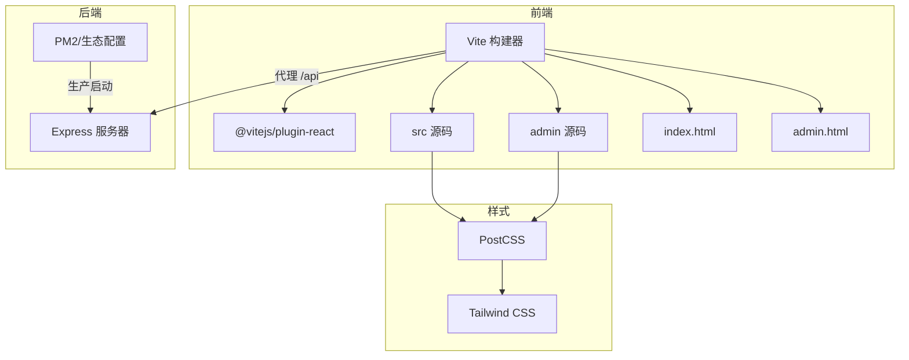
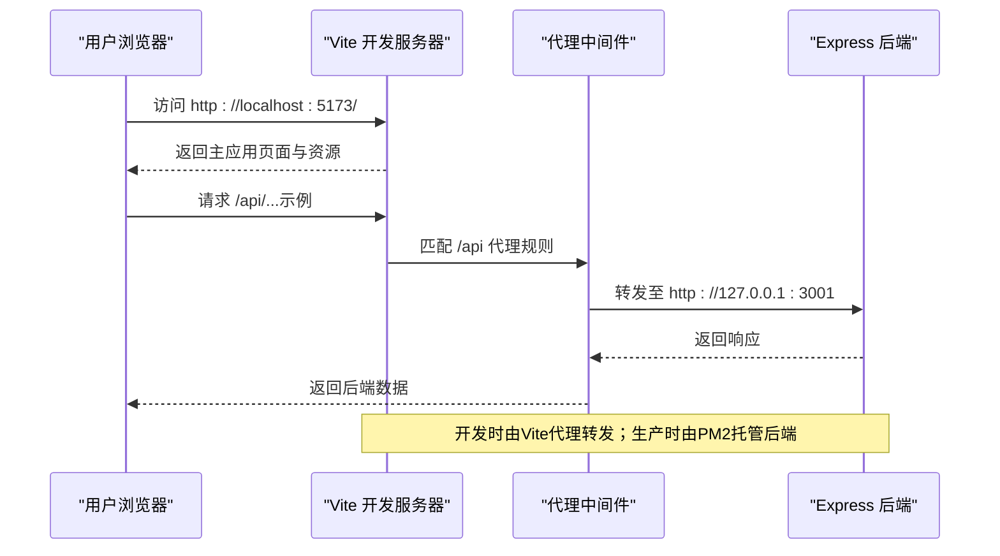
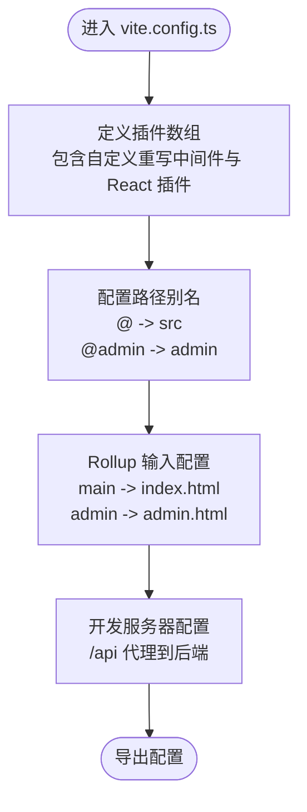
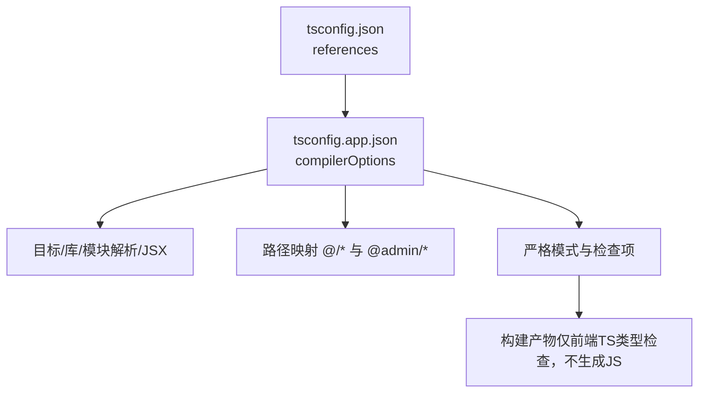
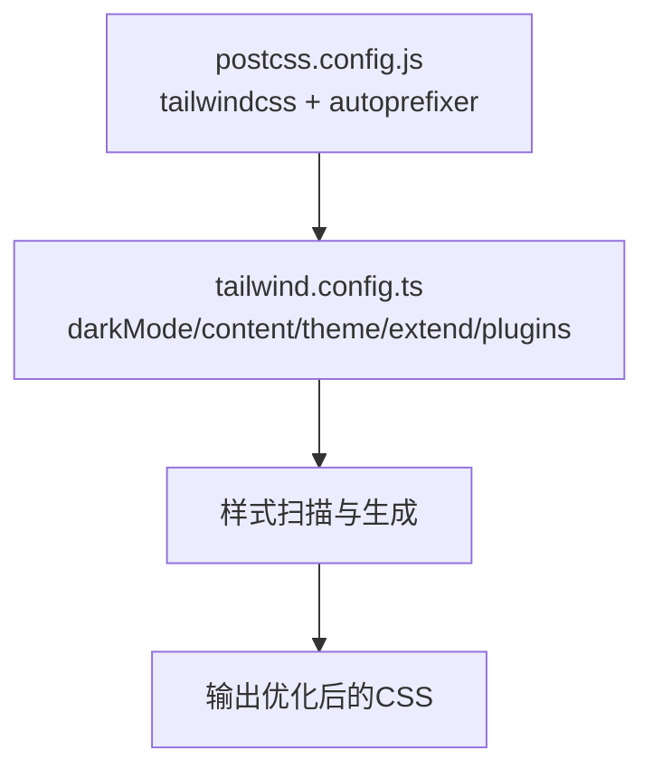
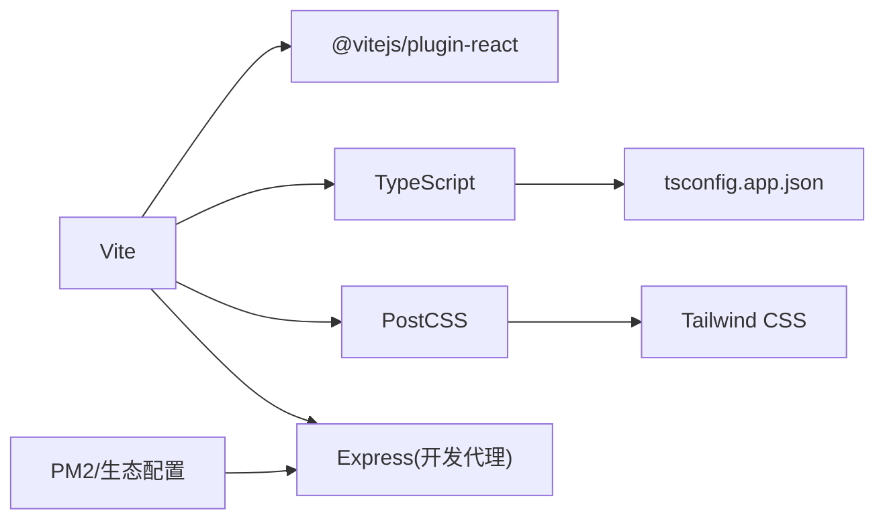

# 构建配置

<cite>
**本文引用的文件**
- [vite.config.ts](file://vite.config.ts)
- [package.json](file://package.json)
- [postcss.config.js](file://postcss.config.js)
- [tailwind.config.ts](file://tailwind.config.ts)
- [tsconfig.json](file://tsconfig.json)
- [tsconfig.app.json](file://tsconfig.app.json)
- [index.html](file://index.html)
- [admin.html](file://admin.html)
- [ecosystem.config.cjs](file://ecosystem.config.cjs)
</cite>

## 目录
1. [简介](#简介)
2. [项目结构](#项目结构)
3. [核心组件](#核心组件)
4. [架构总览](#架构总览)
5. [详细组件分析](#详细组件分析)
6. [依赖分析](#依赖分析)
7. [性能考虑](#性能考虑)
8. [故障排除指南](#故障排除指南)
9. [结论](#结论)
10. [附录](#附录)

## 简介
本文件面向旅行规划Demo项目的前端与全栈构建配置，系统性说明Vite多入口、代理、静态资源与代码分割策略；TypeScript编译配置（路径映射、模块解析、编译选项）；PostCSS与Tailwind CSS集成；以及开发与生产环境差异、构建优化技巧（Tree Shaking、压缩、Bundle分析）与常见问题排查。

## 项目结构
该仓库采用“前端双入口 + 后端服务”的混合架构：前端通过Vite构建两个独立入口（主应用与管理后台），后端使用Express运行在本地开发时由Vite代理转发API请求。Tailwind CSS与PostCSS负责样式管线，TypeScript提供类型安全与现代化编译能力。

图表来源
- [vite.config.ts:20-45](file://vite.config.ts#L20-L45)
- [postcss.config.js:1-6](file://postcss.config.js#L1-L6)
- [tailwind.config.ts:1-139](file://tailwind.config.ts#L1-L139)
- [package.json:6-25](file://package.json#L6-L25)
- [ecosystem.config.cjs:1-16](file://ecosystem.config.cjs#L1-L16)

章节来源
- [vite.config.ts:1-46](file://vite.config.ts#L1-L46)
- [package.json:1-59](file://package.json#L1-L59)

## 核心组件
- Vite 多入口与别名
  - 双入口：主应用与管理后台分别指向各自的HTML与入口文件。
  - 路径别名：@ 指向 src，@admin 指向 admin，便于跨目录引用。
- 开发服务器与代理
  - 本地开发时将 /api 前缀代理到后端服务地址，支持跨域与HTTPS校验关闭。
  - 自定义中间件重写 /admin 与 /admin/ 到 admin.html，提升开发体验。
- TypeScript 编译配置
  - 使用复合项目（references）组织 tsconfig，主应用配置启用 bundler 模块解析、严格模式与路径映射。
- PostCSS 与 Tailwind CSS
  - PostCSS加载 tailwindcss 与 autoprefixer 插件；Tailwind content 覆盖 src 与 admin 的模板与源码，确保按需生成样式。
- 构建脚本与产物
  - 前端构建：Vite 打包；后端构建：tsc 指定 server 子工程配置输出。
  - 生产部署：PM2/生态配置以生产模式启动后端服务。

章节来源
- [vite.config.ts:20-45](file://vite.config.ts#L20-L45)
- [tsconfig.json:1-6](file://tsconfig.json#L1-L6)
- [tsconfig.app.json:1-27](file://tsconfig.app.json#L1-L27)
- [postcss.config.js:1-6](file://postcss.config.js#L1-L6)
- [tailwind.config.ts:1-139](file://tailwind.config.ts#L1-L139)
- [package.json:6-25](file://package.json#L6-L25)
- [ecosystem.config.cjs:1-16](file://ecosystem.config.cjs#L1-L16)

## 架构总览
下图展示从浏览器到后端服务的请求链路，以及构建产物与部署流程的关键节点。

图表来源
- [vite.config.ts:36-44](file://vite.config.ts#L36-L44)
- [package.json:6-25](file://package.json#L6-L25)
- [ecosystem.config.cjs:1-16](file://ecosystem.config.cjs#L1-L16)

## 详细组件分析

### Vite 多入口与代码分割
- 多入口配置
  - 主入口：index.html
  - 管理入口：admin.html
  - 二者共享React插件与别名，实现独立路由与资源打包。
- 代码分割
  - Vite/Rollup默认对动态导入进行代码分割；结合路由级懒加载可进一步优化首屏体积。
  - 入口拆分天然形成多产物，避免交叉污染。
- 静态资源处理
  - 图片、字体等资源由Vite内置处理；可在构建后观察产物目录确认哈希命名与缓存策略。
- 开发中间件
  - 自定义中间件将 /admin 与 /admin/ 重写为 admin.html，避免刷新后404。

图表来源
- [vite.config.ts:1-46](file://vite.config.ts#L1-L46)

章节来源
- [vite.config.ts:20-45](file://vite.config.ts#L20-L45)
- [index.html](file://index.html)
- [admin.html](file://admin.html)

### TypeScript 编译配置
- 复合项目组织
  - 顶层 tsconfig.json 通过 references 引用子工程配置，保证IDE与构建一致性。
- 主应用编译选项
  - 目标与库：ES2020 + DOM
  - 模块解析：bundler（与Vite/Rollup配合更佳）
  - JSX：react-jsx
  - 路径映射：@/* 与 @admin/*
  - 严格性：开启严格模式，禁用未使用变量检查以适配现有代码风格
- 构建命令
  - 前端：vite build
  - 后端：tsc -p server/tsconfig.build.json

图表来源
- [tsconfig.json:1-6](file://tsconfig.json#L1-L6)
- [tsconfig.app.json:1-27](file://tsconfig.app.json#L1-L27)

章节来源
- [tsconfig.json:1-6](file://tsconfig.json#L1-L6)
- [tsconfig.app.json:1-27](file://tsconfig.app.json#L1-L27)

### PostCSS 与 Tailwind CSS 集成
- PostCSS 插件
  - tailwindcss：读取 tailwind.config.ts 生成所需样式
  - autoprefixer：自动添加厂商前缀
- Tailwind 配置
  - darkMode：class
  - content：覆盖 index.html、src/**/*.{ts,tsx}、admin.html、admin/**/*.{ts,tsx}，确保按需扫描
  - 主题扩展：字体、颜色、圆角、阴影、动画等
  - 插件：tailwindcss-animate
- 构建流程
  - 开发：PostCSS在Vite中自动处理
  - 生产：保持一致的按需生成策略

图表来源
- [postcss.config.js:1-6](file://postcss.config.js#L1-L6)
- [tailwind.config.ts:1-139](file://tailwind.config.ts#L1-L139)

章节来源
- [postcss.config.js:1-6](file://postcss.config.js#L1-L6)
- [tailwind.config.ts:1-139](file://tailwind.config.ts#L1-L139)

### 开发与生产环境差异
- 开发环境
  - Vite 提供快速热更新与源码映射
  - /api 代理到后端服务，便于前后端联调
  - 自定义中间件优化管理后台访问
- 生产环境
  - 前端：Vite 打包产物（含代码压缩与资源优化）
  - 后端：PM2/生态配置以生产模式启动，监听固定端口
  - 构建顺序：先前端再后端，最终统一部署

章节来源
- [vite.config.ts:36-44](file://vite.config.ts#L36-L44)
- [package.json:6-25](file://package.json#L6-L25)
- [ecosystem.config.cjs:1-16](file://ecosystem.config.cjs#L1-L16)

## 依赖分析
- 构建工具链
  - Vite：多入口、插件化、开发服务器与代理
  - PostCSS + Tailwind：原子化样式与按需生成
  - TypeScript：类型安全与现代编译
- 运行时依赖
  - React 生态、路由、地图、动画等UI与功能库
- 开发依赖
  - Vite 插件、TypeScript、PostCSS、Tailwind、Autoprefixer

图表来源
- [vite.config.ts:1-46](file://vite.config.ts#L1-L46)
- [tsconfig.app.json:1-27](file://tsconfig.app.json#L1-L27)
- [postcss.config.js:1-6](file://postcss.config.js#L1-L6)
- [tailwind.config.ts:1-139](file://tailwind.config.ts#L1-L139)
- [package.json:26-58](file://package.json#L26-L58)
- [ecosystem.config.cjs:1-16](file://ecosystem.config.cjs#L1-L16)

章节来源
- [package.json:1-59](file://package.json#L1-L59)

## 性能考虑
- Tree Shaking
  - 使用 ES 模块语法与打包器的副作用标记，减少无用代码进入产物
- 代码压缩
  - 生产构建默认启用压缩；如需进一步优化，可引入压缩器或调整Rollup选项
- 代码分割
  - 动态导入与路由懒加载可显著降低首屏体积
- 资源优化
  - 图片与字体交由Vite处理；建议在生产中启用长缓存与CDN
- Bundle 分析
  - 可安装可视化分析插件（如构建后分析产物大小与依赖关系），定位大体积模块
- 编译优化
  - 将模块解析设为 bundler，提升与Vite/Rollup的兼容性与打包效率

## 故障排除指南
- 管理后台访问 404
  - 症状：访问 /admin 或 /admin/ 返回 404
  - 解决：确认已启用自定义中间件重写规则，或使用 npm 脚本启动管理后台开发模式
  - 参考
    - [vite.config.ts:5-18](file://vite.config.ts#L5-L18)
    - [package.json:24](file://package.json#L24)
- /api 请求跨域或失败
  - 症状：前端请求 /api 报跨域或连接错误
  - 解决：确认代理目标地址与端口正确；必要时开启安全校验关闭或修正证书
  - 参考
    - [vite.config.ts:36-44](file://vite.config.ts#L36-L44)
- 样式未生效或未按需生成
  - 症状：Tailwind 类无效或样式过大
  - 解决：检查 tailwind.config.ts 的 content 路径是否覆盖到实际模板与组件；确认 PostCSS 插件顺序
  - 参考
    - [tailwind.config.ts:5-10](file://tailwind.config.ts#L5-L10)
    - [postcss.config.js:1-6](file://postcss.config.js#L1-L6)
- 构建后端失败
  - 症状：npm run build 后后端无法启动
  - 解决：确认 server 子工程 tsconfig 与输出目录；使用 npm run build:server 单独验证
  - 参考
    - [package.json:10-11](file://package.json#L10-L11)
- 生产部署端口冲突
  - 症状：PM2 启动后端占用端口
  - 解决：检查生态配置中的端口设置，或在部署环境中调整
  - 参考
    - [ecosystem.config.cjs:7-14](file://ecosystem.config.cjs#L7-L14)

章节来源
- [vite.config.ts:5-18](file://vite.config.ts#L5-L18)
- [vite.config.ts:36-44](file://vite.config.ts#L36-L44)
- [tailwind.config.ts:5-10](file://tailwind.config.ts#L5-L10)
- [postcss.config.js:1-6](file://postcss.config.js#L1-L6)
- [package.json:10-11](file://package.json#L10-L11)
- [ecosystem.config.cjs:7-14](file://ecosystem.config.cjs#L7-L14)

## 结论
本项目通过Vite实现双入口与高效开发体验，配合PostCSS/Tailwind完成现代化样式管线，TypeScript提供类型保障。开发与生产环境边界清晰，代理与部署脚本完善。建议持续关注代码分割与资源优化，并在生产中引入Bundle分析以指导进一步瘦身。

## 附录
- 关键文件清单
  - 构建配置：vite.config.ts、tsconfig.json、tsconfig.app.json、postcss.config.js、tailwind.config.ts
  - 入口页面：index.html、admin.html
  - 脚本与部署：package.json、ecosystem.config.cjs