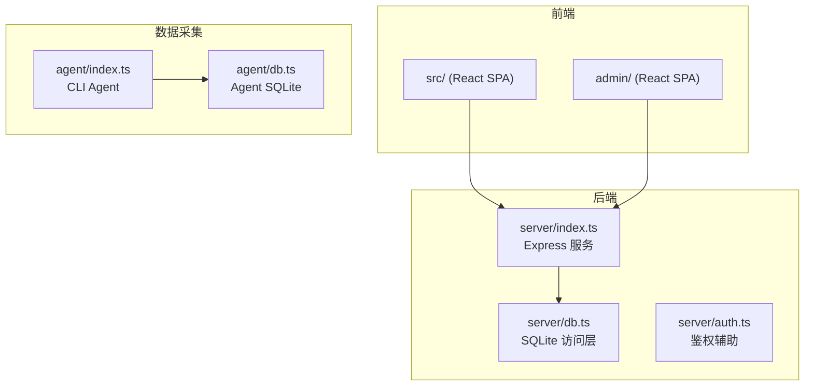
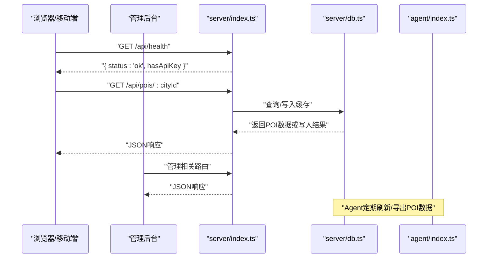
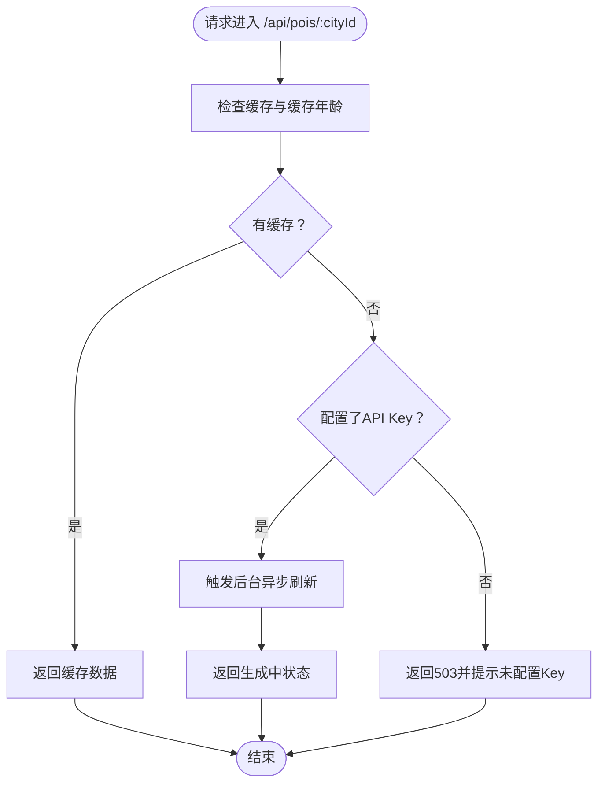
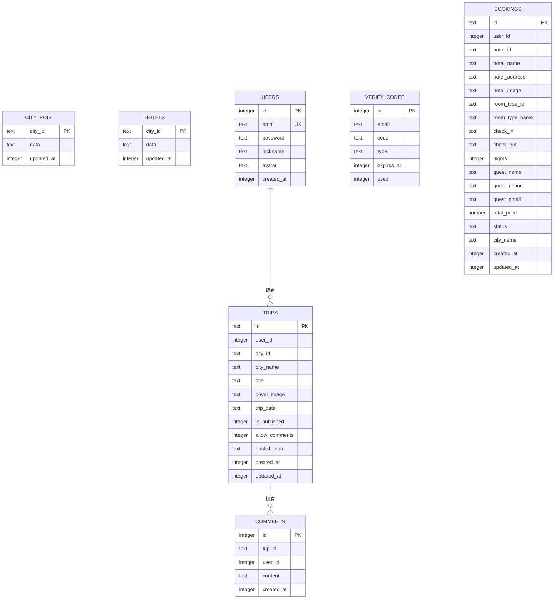
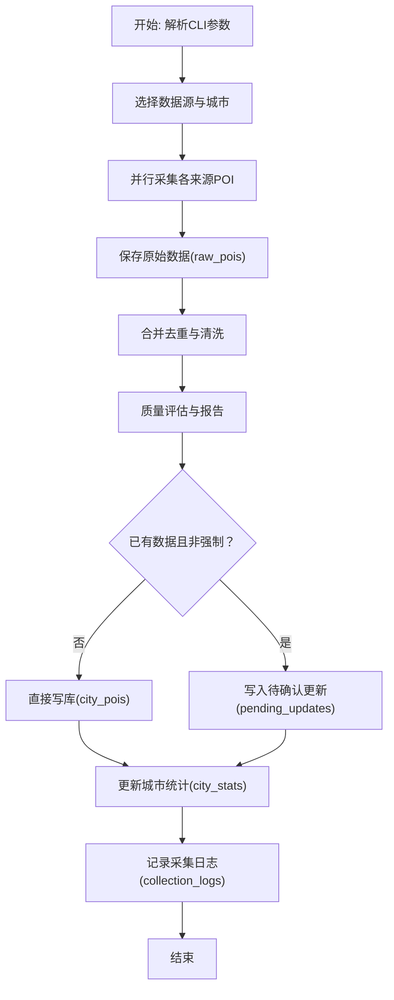
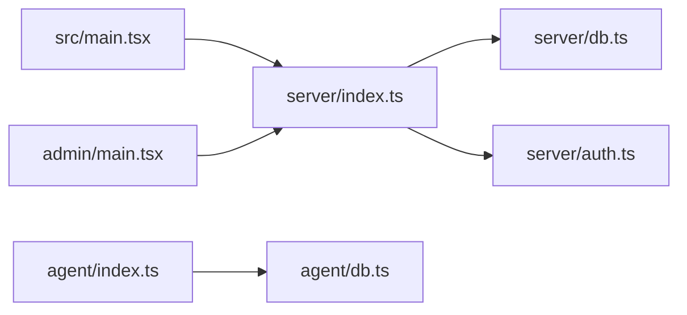

# 监控与日志

<cite>
**本文引用的文件**
- [package.json](file://package.json)
- [server/index.ts](file://server/index.ts)
- [server/db.ts](file://server/db.ts)
- [server/auth.ts](file://server/auth.ts)
- [agent/index.ts](file://agent/index.ts)
- [agent/db.ts](file://agent/db.ts)
- [src/main.tsx](file://src/main.tsx)
- [admin/main.tsx](file://admin/main.tsx)
- [src/App.tsx](file://src/App.tsx)
- [admin/App.tsx](file://admin/App.tsx)
</cite>

## 目录
1. [简介](#简介)
2. [项目结构](#项目结构)
3. [核心组件](#核心组件)
4. [架构总览](#架构总览)
5. [详细组件分析](#详细组件分析)
6. [依赖关系分析](#依赖关系分析)
7. [性能考量](#性能考量)
8. [故障排查指南](#故障排查指南)
9. [结论](#结论)
10. [附录](#附录)

## 简介
本文件面向旅行规划Demo的监控与日志体系，聚焦以下目标：
- 应用性能监控：关键指标采集、性能基线与告警建议
- 日志记录策略：前后端日志配置、日志级别与输出格式
- 错误追踪与异常处理：全局异常捕获与错误上报
- 健康检查与可用性监控：系统健康检查与可用性保障
- 数据库性能监控与查询优化：SQLite层监控与优化建议
- 监控仪表板与自定义指标：配置思路与扩展方法
- 监控数据分析与趋势预测：实用技巧与落地建议

当前仓库中未发现现成的监控与日志框架集成（如OpenTelemetry、Sentry、PM2等），但通过现有代码可清晰识别日志点、健康检查端点与数据库访问模式，便于在此基础上扩展监控与日志能力。

## 项目结构
项目采用前后端分离与独立Agent的数据采集流程：
- 前端应用：src/（React单页应用）
- 管理后台：admin/（React单页应用）
- 后端服务：server/（Express + better-sqlite3）
- 数据采集Agent：agent/（独立CLI工具，better-sqlite3）

图表来源
- [server/index.ts:1-790](file://server/index.ts#L1-L790)
- [server/db.ts:1-513](file://server/db.ts#L1-L513)
- [agent/index.ts:1-800](file://agent/index.ts#L1-L800)
- [agent/db.ts:1-459](file://agent/db.ts#L1-L459)

章节来源
- [package.json:1-59](file://package.json#L1-L59)
- [src/main.tsx:1-10](file://src/main.tsx#L1-L10)
- [admin/main.tsx:1-14](file://admin/main.tsx#L1-L14)

## 核心组件
- 后端API服务：提供POI、酒店、用户、行程、游记、评论等REST接口，并内置健康检查端点
- 数据库层：基于better-sqlite3的SQLite访问层，支持WAL模式与外键约束
- 鉴权模块：基于JWT的可选/必需认证中间件
- Agent采集器：独立CLI工具，负责多源POI采集、合并去重、质量评估与增量刷新
- 前端与管理后台：React应用，通过HTTP与后端交互

章节来源
- [server/index.ts:1-790](file://server/index.ts#L1-L790)
- [server/db.ts:1-513](file://server/db.ts#L1-L513)
- [server/auth.ts:1-133](file://server/auth.ts#L1-L133)
- [agent/index.ts:1-800](file://agent/index.ts#L1-L800)
- [agent/db.ts:1-459](file://agent/db.ts#L1-L459)

## 架构总览
下图展示请求在系统中的流转与关键监控点：

图表来源
- [server/index.ts:755-757](file://server/index.ts#L755-L757)
- [server/index.ts:108-144](file://server/index.ts#L108-L144)
- [server/db.ts:237-261](file://server/db.ts#L237-L261)
- [agent/index.ts:655-800](file://agent/index.ts#L655-L800)

## 详细组件分析

### 后端API服务与健康检查
- 健康检查端点：/api/health，返回服务状态与API Key可用性
- 关键路由：
  - POI列表与刷新：/api/pois/:cityId、/api/pois/:cityId/refresh
  - 酒店列表与刷新：/api/hotels/:cityId
  - 用户与鉴权：/api/auth/*
  - 行程与游记：/api/trips/*、/api/notes/*
  - 评论：/api/notes/:id/comments
  - 交通路线：/api/transit/route
- 异常处理：
  - 路由层对错误进行捕获与降级：优先返回缓存数据，必要时返回错误码
  - OSRM代理失败时记录警告并返回降级结果

图表来源
- [server/index.ts:108-144](file://server/index.ts#L108-L144)

章节来源
- [server/index.ts:26-27](file://server/index.ts#L26-L27)
- [server/index.ts:108-144](file://server/index.ts#L108-L144)
- [server/index.ts:186-212](file://server/index.ts#L186-L212)
- [server/index.ts:287-308](file://server/index.ts#L287-L308)
- [server/index.ts:755-757](file://server/index.ts#L755-L757)

### 数据库层与日志
- 初始化与表结构：初始化WAL模式、外键约束；创建city_pois、users、trips、comments、verify_codes、hotels、bookings等表
- POI/酒店缓存：upsertPOIs/getCachedPOIs/getCacheAge/upsertHotels/getCachedHotels/getHotelCacheAge
- 日志点：写入POI/酒店缓存时打印条目数量与城市ID
- Agent侧数据库：collection_logs、city_stats、raw_pois、pending_updates、refresh_cycles等表

图表来源
- [server/db.ts:47-144](file://server/db.ts#L47-L144)

章节来源
- [server/db.ts:37-147](file://server/db.ts#L37-L147)
- [server/db.ts:237-261](file://server/db.ts#L237-L261)
- [server/db.ts:429-454](file://server/db.ts#L429-L454)

### 鉴权与安全
- JWT密钥与过期时间配置
- optionalAuth/requireAuth中间件：从Authorization头提取并验证令牌
- 密码哈希与校验：PBKDF2+盐值

章节来源
- [server/auth.ts:10-133](file://server/auth.ts#L10-L133)

### Agent采集器与数据质量
- CLI命令：collect、reprocess、export、quality、status、sources、refresh、validate、init-db、rescore
- 数据流：并行采集→保存原始数据→合并去重→清洗→质量评估→写库/待确认更新
- 日志点：每个来源采集耗时、成功/失败计数、质量评分、问题数量、分数分布
- Agent数据库：collection_logs、city_stats、raw_pois、pending_updates、refresh_cycles

图表来源
- [agent/index.ts:134-281](file://agent/index.ts#L134-L281)
- [agent/db.ts:34-131](file://agent/db.ts#L34-L131)

章节来源
- [agent/index.ts:70-111](file://agent/index.ts#L70-L111)
- [agent/index.ts:285-366](file://agent/index.ts#L285-L366)
- [agent/index.ts:374-450](file://agent/index.ts#L374-L450)
- [agent/index.ts:538-639](file://agent/index.ts#L538-L639)
- [agent/db.ts:159-174](file://agent/db.ts#L159-L174)
- [agent/db.ts:178-232](file://agent/db.ts#L178-L232)

### 前端与管理后台
- 前端入口：src/main.tsx
- 管理后台入口：admin/main.tsx
- 路由组织：src/App.tsx与admin/App.tsx分别承载页面路由

章节来源
- [src/main.tsx:1-10](file://src/main.tsx#L1-L10)
- [admin/main.tsx:1-14](file://admin/main.tsx#L1-L14)
- [src/App.tsx:1-62](file://src/App.tsx#L1-L62)
- [admin/App.tsx:1-27](file://admin/App.tsx#L1-L27)

## 依赖关系分析
- server/index.ts依赖server/db.ts与server/auth.ts
- agent/index.ts依赖agent/db.ts与agent/config.ts等
- 前端与管理后台通过HTTP与后端交互

图表来源
- [server/index.ts:29-53](file://server/index.ts#L29-L53)
- [agent/index.ts:24-51](file://agent/index.ts#L24-L51)

章节来源
- [server/index.ts:29-53](file://server/index.ts#L29-L53)
- [agent/index.ts:24-51](file://agent/index.ts#L24-L51)

## 性能考量
- 缓存策略
  - POI与酒店均采用三态缓存：新鲜(FRESH_TTL_MS)、陈旧(STALE_TTL_MS)、过期
  - 无缓存时立即返回“生成中”状态，后台异步刷新，避免反向代理超时
- 数据库优化
  - WAL模式提升并发写入性能
  - 外键约束保证数据一致性
  - 建议在高频查询列上建立索引（如collection_logs的city_id/source、created_at）
- 网络与代理
  - OSRM代理设置10秒超时，失败时返回降级结果
- 前端与管理后台
  - 使用React Router进行SPA路由管理，减少全量页面刷新

章节来源
- [server/index.ts:64-65](file://server/index.ts#L64-L65)
- [server/index.ts:108-144](file://server/index.ts#L108-L144)
- [server/index.ts:186-212](file://server/index.ts#L186-L212)
- [server/index.ts:287-308](file://server/index.ts#L287-L308)
- [server/db.ts:43-44](file://server/db.ts#L43-L44)
- [agent/db.ts:60-66](file://agent/db.ts#L60-L66)

## 故障排查指南
- 健康检查
  - 访问/api/health，确认服务状态与API Key可用性
- 缓存与刷新
  - 若缓存陈旧或缺失，检查后台刷新任务是否触发
  - 查看Agent侧collection_logs与city_stats，定位采集失败与质量评分
- 数据库
  - 检查DB初始化日志与表结构
  - 关注POI/酒店upsert日志，确认写入数量与城市ID
- 鉴权
  - 确认Authorization头格式与JWT签名有效
- OSRM代理
  - 观察代理失败警告，确认网络连通性与超时设置

章节来源
- [server/index.ts:755-757](file://server/index.ts#L755-L757)
- [server/index.ts:82-100](file://server/index.ts#L82-L100)
- [agent/index.ts:150-191](file://agent/index.ts#L150-L191)
- [agent/db.ts:159-174](file://agent/db.ts#L159-L174)
- [server/db.ts:146](file://server/db.ts#L146)
- [server/db.ts:260](file://server/db.ts#L260)
- [server/db.ts:453](file://server/db.ts#L453)
- [server/auth.ts:87-113](file://server/auth.ts#L87-L113)
- [server/index.ts:305-306](file://server/index.ts#L305-L306)

## 结论
- 当前系统具备明确的日志点与健康检查端点，适合在此基础上引入标准化监控与日志框架
- 建议在现有日志基础上增加结构化日志、指标埋点与告警规则，覆盖关键业务路径与数据库性能
- Agent侧的采集日志与质量报告为监控提供了天然的数据基础

## 附录

### 监控与日志实施建议

- 关键指标采集
  - 后端API：请求量、成功率、P95/P99延迟、错误码分布、缓存命中率、数据库写入速率
  - Agent：采集耗时、成功/失败计数、质量评分、待确认更新数量、刷新周期时长
  - 健康检查：/api/health返回状态与API Key可用性
- 性能基线与告警
  - 设定阈值：请求延迟、错误率、缓存命中率、数据库写入延迟、Agent采集耗时
  - 告警渠道：邮件/IM通知，区分严重与一般级别
- 日志策略
  - 前端：控制台日志为主，生产环境避免敏感信息输出
  - 后端：结构化JSON日志，包含时间戳、级别、服务名、请求ID、路径、耗时、错误信息
  - Agent：CLI输出与SQLite日志结合，定期归档与轮转
- 错误追踪与异常处理
  - 全局异常捕获：统一包装错误响应，记录上下文与堆栈
  - 错误上报：接入轻量级错误追踪（如Sentry），屏蔽敏感字段
- 数据库性能监控
  - SQLite：关注写入延迟、锁等待、WAL文件大小；必要时拆分表或引入二级索引
  - 查询优化：对高频查询列建立索引，避免SELECT *，合理使用LIMIT/OFFSET
- 监控仪表板与自定义指标
  - 仪表板：展示API健康、缓存状态、Agent质量、数据库指标
  - 自定义指标：采集耗时、质量评分分布、待确认更新队列长度
- 监控数据分析与趋势预测
  - 趋势：观察每日/每周采集量与质量评分变化
  - 预测：基于历史数据预测缓存过期与刷新窗口