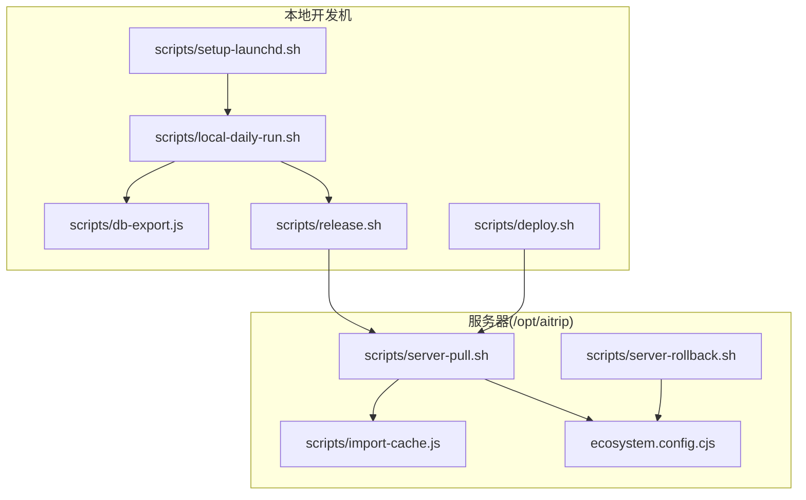
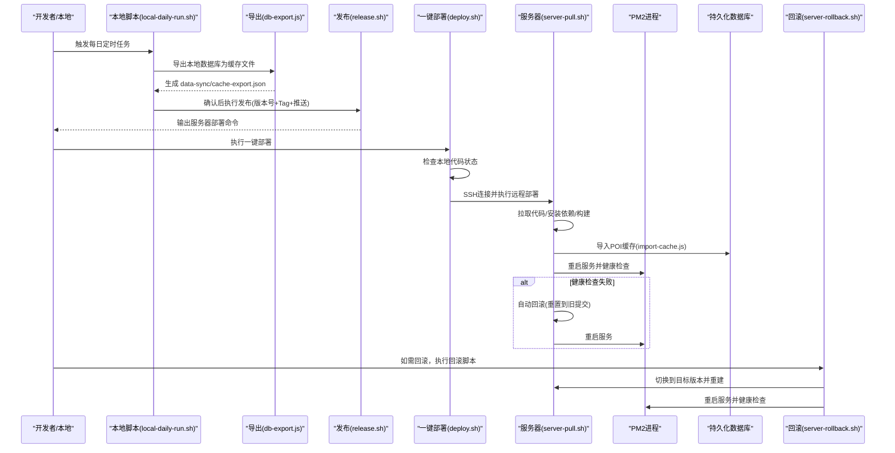
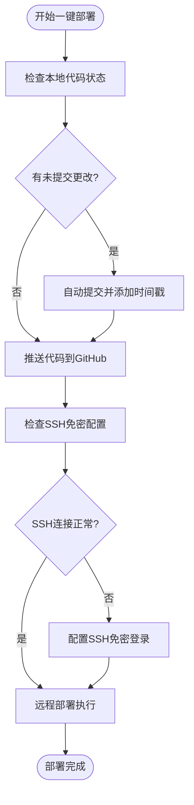
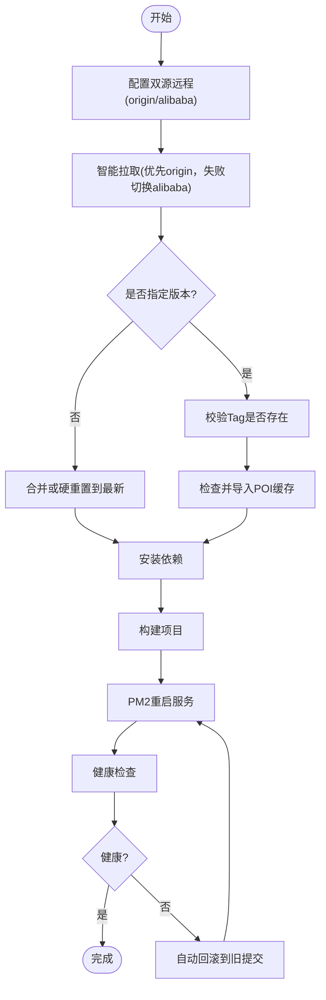
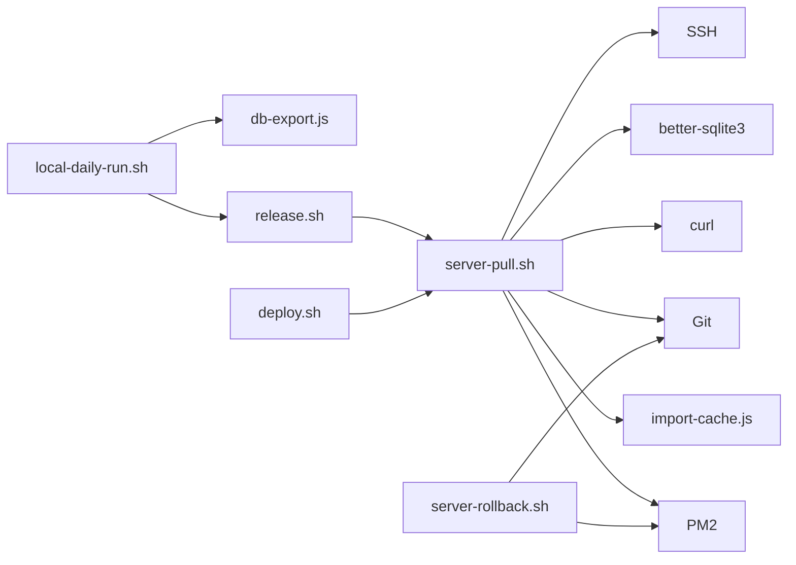

# 自动化脚本

<cite>
**本文引用的文件**
- [release.sh](file://scripts/release.sh)
- [server-pull.sh](file://scripts/server-pull.sh)
- [server-rollback.sh](file://scripts/server-rollback.sh)
- [setup-launchd.sh](file://scripts/setup-launchd.sh)
- [local-daily-run.sh](file://scripts/local-daily-run.sh)
- [db-export.js](file://scripts/db-export.js)
- [import-cache.js](file://scripts/import-cache.js)
- [deploy.sh](file://scripts/deploy.sh)
- [ecosystem.config.cjs](file://ecosystem.config.cjs)
- [package.json](file://package.json)
- [render.yaml](file://render.yaml)
- [vercel.json](file://vercel.json)
</cite>

## 目录
1. [简介](#简介)
2. [项目结构](#项目结构)
3. [核心组件](#核心组件)
4. [架构总览](#架构总览)
5. [详细组件分析](#详细组件分析)
6. [依赖关系分析](#依赖关系分析)
7. [性能与可靠性考量](#性能与可靠性考量)
8. [故障排除指南](#故障排除指南)
9. [结论](#结论)
10. [附录](#附录)

## 简介
本文件面向旅行规划Demo的自动化运维与开发团队，系统性梳理并说明五类自动化脚本：
- 发布脚本：用于本地版本号管理、Git标签打标、多远端推送以及输出服务器部署命令。
- 一键部署脚本：提供从本地开发到生产服务器的完整自动化部署流程，包括环境设置、SSH配置验证和远程服务器执行。
- 服务器部署脚本：在阿里云服务器上执行，支持双源自动寻优（GitHub/阿里云仓库）、健康检查与自动回滚。
- 服务器回滚脚本：在服务器侧对版本进行快速回滚，保障线上稳定性。
- 系统服务配置脚本：在macOS上安装Launchd定时任务，每日定时执行本地数据导出与发布流程。

同时提供脚本自定义与扩展的最佳实践、执行权限与环境要求、调试与故障排除指南，帮助团队安全高效地完成版本迭代与数据同步。

## 项目结构
本项目采用"前端+服务端+自动化脚本"的分层组织方式。自动化脚本集中位于 scripts/ 目录，配合 PM2 配置文件与部署配置文件共同构成完整的发布与运行体系。

**图表来源**
- [local-daily-run.sh:1-156](file://scripts/local-daily-run.sh#L1-L156)
- [db-export.js:1-75](file://scripts/db-export.js#L1-L75)
- [release.sh:1-168](file://scripts/release.sh#L1-L168)
- [setup-launchd.sh:1-113](file://scripts/setup-launchd.sh#L1-L113)
- [deploy.sh:1-56](file://scripts/deploy.sh#L1-L56)
- [server-pull.sh:1-198](file://scripts/server-pull.sh#L1-L198)
- [server-rollback.sh:1-127](file://scripts/server-rollback.sh#L1-L127)
- [import-cache.js:1-96](file://scripts/import-cache.js#L1-L96)
- [ecosystem.config.cjs:1-17](file://ecosystem.config.cjs#L1-L17)

**章节来源**
- [package.json:1-60](file://package.json#L1-L60)
- [render.yaml:1-12](file://render.yaml#L1-L12)
- [vercel.json:1-6](file://vercel.json#L1-L6)

## 核心组件
- 发布脚本（release.sh）：负责版本号计算、Git提交与Tag、推送至GitHub与阿里代码库，并输出服务器部署命令。
- 一键部署脚本（deploy.sh）：提供完整的端到端部署流程，包括本地代码检查、GitHub推送、SSH免密配置和远程服务器部署。
- 服务器部署脚本（server-pull.sh）：在服务器侧拉取代码、安装依赖、构建、导入POI缓存、PM2重启与健康检查；若失败自动回滚。
- 服务器回滚脚本（server-rollback.sh）：列出可用版本、切换到目标版本、重建并重启服务，最后健康检查。
- 系统服务配置脚本（setup-launchd.sh）：在macOS上安装Launchd定时任务，每日12:00执行本地数据导出与发布流程。
- 本地数据导出与发布（local-daily-run.sh）：导出本地数据库为缓存文件，弹窗确认后调用release.sh发布到GitHub，并提示服务器执行部署。
- 数据导入（import-cache.js）：将导出的缓存文件导入服务器持久化数据库。
- PM2配置（ecosystem.config.cjs）：定义生产环境PM2进程启动参数与环境变量。

**章节来源**
- [release.sh:1-168](file://scripts/release.sh#L1-L168)
- [deploy.sh:1-56](file://scripts/deploy.sh#L1-L56)
- [server-pull.sh:1-198](file://scripts/server-pull.sh#L1-L198)
- [server-rollback.sh:1-127](file://scripts/server-rollback.sh#L1-L127)
- [setup-launchd.sh:1-113](file://scripts/setup-launchd.sh#L1-L113)
- [local-daily-run.sh:1-156](file://scripts/local-daily-run.sh#L1-L156)
- [db-export.js:1-75](file://scripts/db-export.js#L1-L75)
- [import-cache.js:1-96](file://scripts/import-cache.js#L1-L96)
- [ecosystem.config.cjs:1-17](file://ecosystem.config.cjs#L1-L17)

## 架构总览
下图展示从本地导出、发布到服务器部署与回滚的完整链路，以及关键依赖关系，包括新增的一键部署流程。

**图表来源**
- [local-daily-run.sh:1-156](file://scripts/local-daily-run.sh#L1-L156)
- [db-export.js:1-75](file://scripts/db-export.js#L1-L75)
- [release.sh:1-168](file://scripts/release.sh#L1-L168)
- [deploy.sh:1-56](file://scripts/deploy.sh#L1-L56)
- [server-pull.sh:1-198](file://scripts/server-pull.sh#L1-L198)
- [import-cache.js:1-96](file://scripts/import-cache.js#L1-L96)
- [server-rollback.sh:1-127](file://scripts/server-rollback.sh#L1-L127)
- [ecosystem.config.cjs:1-17](file://ecosystem.config.cjs#L1-L17)

## 详细组件分析

### 发布脚本（release.sh）
- 功能概述
  - 版本管理：根据传参选择主/次/补丁版本或指定版本号，更新package.json并提交。
  - Git操作：创建带注释的Tag，推送至GitHub与阿里代码库。
  - 输出部署命令：打印服务器执行部署所需的命令，便于一键部署。
- 关键流程
  - 检查工作区状态，必要时提示提交。
  - 计算新版本号（支持major/minor/patch/指定版本）。
  - 提交版本变更与Tag。
  - 推送至origin（GitHub）与alibaba（阿里代码库）。
  - 输出服务器部署命令。
- 使用方法
  - 自动补丁版本：./scripts/release.sh
  - 次版本：./scripts/release.sh minor
  - 主版本：./scripts/release.sh major
  - 指定版本：./scripts/release.sh 1.2.3
- 注意事项
  - 若存在POI缓存导出文件，会一并提交以确保服务器部署时能同步缓存。
  - 推送阿里代码库失败不会阻断流程，建议后续手动补推。

**章节来源**
- [release.sh:1-168](file://scripts/release.sh#L1-L168)
- [package.json:1-60](file://package.json#L1-L60)

### 一键部署脚本（deploy.sh）
**新增** 一键部署脚本提供了从本地开发到生产服务器的完整自动化部署流程，简化了传统部署流程中的多个步骤。

- 功能概述
  - 自动化本地检查：检测并自动提交未提交的更改。
  - GitHub推送：将代码推送到GitHub主分支。
  - SSH免密配置：首次部署时自动配置SSH免密登录。
  - 远程部署执行：通过SSH连接服务器并执行部署脚本。
- 关键流程
  - 本地代码状态检查与自动提交。
  - 推送代码到GitHub主分支。
  - SSH免密登录验证与配置。
  - 远程服务器部署执行。
- 使用方法
  - 基本部署：bash scripts/deploy.sh
  - 首次部署：bash scripts/deploy.sh（会自动配置SSH免密）
- 配置参数
  - SERVER_IP：服务器IP地址，默认"8.130.215.28"
  - SERVER_USER：服务器用户名，默认"root"
  - SERVER_DIR：服务器项目目录，默认"/opt/aitrip"
- SSH配置流程
  - 首次运行时自动检测SSH免密配置。
  - 如果SSH连接失败，会提示输入服务器密码并执行ssh-copy-id配置。
  - 配置完成后下次运行将无需输入密码。

**图表来源**
- [deploy.sh:1-56](file://scripts/deploy.sh#L1-L56)

**章节来源**
- [deploy.sh:1-56](file://scripts/deploy.sh#L1-L56)

### 服务器部署脚本（server-pull.sh）
- 实现原理
  - 双源自动寻优：优先从origin（GitHub）拉取，失败则自动切换到alibaba（阿里代码库），提升国内部署成功率。
  - 版本控制：支持部署最新版本或指定版本Tag。
  - 依赖与构建：安装依赖（生产依赖与开发依赖均可），执行构建。
  - 数据同步：检测本地导出的缓存文件是否较新，若是则导入到持久化数据库。
  - 服务重启：通过PM2删除并重新启动应用，或直接重启已有应用。
  - 健康检查：访问本地健康接口，若失败则自动回滚到旧提交。
- 部署策略
  - 无参数：部署最新分支代码。
  - 指定版本：部署指定Tag，便于灰度或回溯。
  - 失败自动回滚：保证线上稳定。
- 使用方法
  - 在/opt/aitrip目录下执行：bash scripts/server-pull.sh
  - 指定版本：bash scripts/server-pull.sh v0.3.2

**图表来源**
- [server-pull.sh:1-198](file://scripts/server-pull.sh#L1-L198)
- [import-cache.js:1-96](file://scripts/import-cache.js#L1-L96)
- [ecosystem.config.cjs:1-17](file://ecosystem.config.cjs#L1-L17)

**章节来源**
- [server-pull.sh:1-198](file://scripts/server-pull.sh#L1-L198)
- [import-cache.js:1-96](file://scripts/import-cache.js#L1-L96)
- [ecosystem.config.cjs:1-17](file://ecosystem.config.cjs#L1-L17)

### 服务器回滚脚本（server-rollback.sh）
- 使用场景
  - 服务器部署后健康检查失败，需要快速回滚到上一个稳定版本。
  - 需要人工干预或审计时，先列出可用版本再进行精确回滚。
- 执行步骤
  - 无参数：列出最近版本并标注当前版本。
  - 指定版本：校验版本存在性，确认后切换到目标版本。
  - 重新安装依赖与构建，重启PM2服务。
  - 健康检查，失败则输出PM2日志供排查。
- 注意事项
  - 回滚前建议备份重要数据。
  - 回滚后如仍不健康，可再次执行回滚到更早版本。

**章节来源**
- [server-rollback.sh:1-127](file://scripts/server-rollback.sh#L1-L127)

### 系统服务配置脚本（setup-launchd.sh）
- 作用
  - 在macOS上安装Launchd定时任务，每天12:00自动执行本地数据导出与发布流程。
  - 支持卸载旧任务、加载新任务、输出日志路径与环境变量配置。
- 配置方法
  - 安装：bash scripts/setup-launchd.sh
  - 卸载：launchctl unload ~/Library/LaunchAgents/com.aitrip.daily.plist && rm ~/Library/LaunchAgents/com.aitrip.daily.plist
  - 立即测试：安装后可选择立即执行一次测试。
- 环境变量
  - 预设PATH包含用户本地Node路径与常用系统路径，确保脚本可正常调用Node。

**章节来源**
- [setup-launchd.sh:1-113](file://scripts/setup-launchd.sh#L1-L113)
- [local-daily-run.sh:1-156](file://scripts/local-daily-run.sh#L1-L156)

### 本地数据导出与发布（local-daily-run.sh）
- 流程
  - 导出本地数据库为data-sync/cache-export.json。
  - 解析导出结果，生成城市与POI统计摘要。
  - macOS弹窗确认，用户确认后调用release.sh发布到GitHub。
  - 输出服务器部署命令，提示运维在服务器执行部署。
- 自动确认
  - 设置AUTO_CONFIRM=1可跳过弹窗，直接发布。
- 依赖
  - Node.js环境与db-export.js导出脚本。
  - macOS系统通知与对话框支持。

**章节来源**
- [local-daily-run.sh:1-156](file://scripts/local-daily-run.sh#L1-L156)
- [db-export.js:1-75](file://scripts/db-export.js#L1-L75)

### 数据导入（import-cache.js）
- 功能
  - 将本地导出的缓存文件导入服务器持久化数据库，支持POI与酒店两类缓存。
  - 自动创建缺失的表结构，使用UPSERT策略避免重复导入。
- 路径
  - 默认从/data/aitrip/pois.db读写，也可通过DB_DIR环境变量覆盖。
- 失败处理
  - 若缓存文件不存在，直接退出错误码；导入过程中的异常不影响服务继续运行。

**章节来源**
- [import-cache.js:1-96](file://scripts/import-cache.js#L1-L96)

## 依赖关系分析
- 脚本间依赖
  - local-daily-run.sh 依赖 db-export.js 生成缓存文件。
  - local-daily-run.sh 调用 release.sh 完成发布。
  - deploy.sh 作为一键部署入口，最终调用 server-pull.sh 执行实际部署。
  - release.sh 输出服务器部署命令，供 server-pull.sh 执行。
  - server-pull.sh 依赖 import-cache.js 导入缓存数据。
  - server-pull.sh 与 server-rollback.sh 共同依赖 PM2 与健康检查接口。
- 外部依赖
  - Node.js与npm（用于构建与导入）。
  - Git（用于版本控制与远程仓库交互）。
  - curl（用于健康检查）。
  - PM2（用于进程管理与重启）。
  - better-sqlite3（用于数据库读写）。
  - SSH（用于远程部署）。

**图表来源**
- [local-daily-run.sh:1-156](file://scripts/local-daily-run.sh#L1-L156)
- [db-export.js:1-75](file://scripts/db-export.js#L1-L75)
- [release.sh:1-168](file://scripts/release.sh#L1-L168)
- [deploy.sh:1-56](file://scripts/deploy.sh#L1-L56)
- [server-pull.sh:1-198](file://scripts/server-pull.sh#L1-L198)
- [import-cache.js:1-96](file://scripts/import-cache.js#L1-L96)
- [server-rollback.sh:1-127](file://scripts/server-rollback.sh#L1-L127)

**章节来源**
- [ecosystem.config.cjs:1-17](file://ecosystem.config.cjs#L1-L17)
- [package.json:1-60](file://package.json#L1-L60)

## 性能与可靠性考量
- 双源自动寻优
  - 服务器部署脚本优先从origin拉取，失败自动切换alibaba，减少网络波动带来的部署失败率。
- 健康检查与自动回滚
  - 部署后访问本地健康接口，失败即回滚到旧提交，降低线上风险。
- 缓存增量导入
  - 仅当导出文件更新时间晚于数据库时才导入，避免重复导入造成资源浪费。
- 日志与可观测性
  - Launchd任务输出标准日志路径，便于问题定位。
  - PM2日志可通过回滚脚本输出，辅助排障。
- SSH免密配置优化
  - 一键部署脚本提供自动SSH配置功能，减少手动配置的复杂性和错误率。

## 故障排除指南
- 发布脚本常见问题
  - 工作区未提交：脚本会提示并允许提交，完成后继续发布。
  - 推送失败：GitHub推送失败会报错；阿里代码库推送失败会提示稍后手动推送。
- 一键部署脚本常见问题
  - SSH免密配置失败：检查SSH公钥文件是否存在，确认服务器SSH服务正常。
  - 远程部署超时：检查网络连接和服务器可达性。
  - 本地代码状态检查失败：确保git命令可用且仓库配置正确。
- 服务器部署脚本常见问题
  - 无法连接远程仓库：检查网络与远程仓库配置，确认origin与alibaba均可用。
  - 依赖安装失败：自动回滚到旧提交并重试安装与构建。
  - 构建失败：自动回滚并重试安装与构建。
  - 健康检查失败：自动回滚并重启服务；如仍失败，查看PM2日志。
- 服务器回滚脚本常见问题
  - 指定版本不存在：列出可用版本并提示重新输入。
  - 回滚后仍不健康：查看PM2日志，确认环境变量与端口配置。
- 系统服务配置脚本常见问题
  - Launchd任务未生效：检查plist路径与加载状态，必要时卸载后重新加载。
  - Node路径问题：确保PATH包含本地Node可执行路径。
- 数据导入常见问题
  - 缓存文件不存在：确认本地导出流程是否成功。
  - 数据库路径不一致：通过DB_DIR环境变量覆盖默认路径。

**章节来源**
- [release.sh:1-168](file://scripts/release.sh#L1-L168)
- [deploy.sh:1-56](file://scripts/deploy.sh#L1-L56)
- [server-pull.sh:1-198](file://scripts/server-pull.sh#L1-L198)
- [server-rollback.sh:1-127](file://scripts/server-rollback.sh#L1-L127)
- [setup-launchd.sh:1-113](file://scripts/setup-launchd.sh#L1-L113)
- [import-cache.js:1-96](file://scripts/import-cache.js#L1-L96)

## 结论
本自动化脚本体系覆盖了从本地数据导出、发布、一键部署到服务器部署与回滚的全链路，结合双源自动寻优、健康检查与自动回滚机制，显著提升了版本发布的安全性与效率。通过Launchd定时任务，实现了数据同步的自动化与可视化确认，降低了人为疏漏的风险。新增的一键部署脚本进一步简化了部署流程，提供了从本地到服务器的端到端自动化解决方案。建议在生产环境中严格遵循权限与环境要求，并定期演练回滚流程，确保在异常情况下能够快速恢复。

## 附录

### 脚本执行权限与环境要求
- 执行权限
  - 确保脚本具备可执行权限：chmod +x scripts/*.sh
- 环境要求
  - Node.js与npm：用于构建与导入。
  - Git：用于版本控制与远程仓库交互。
  - PM2：用于进程管理与重启。
  - better-sqlite3：用于数据库读写。
  - curl：用于健康检查。
  - SSH：用于远程部署。
  - macOS系统：用于Launchd定时任务与通知。
- 环境变量
  - DB_DIR：覆盖数据库目录路径（默认/data/aitrip或server/data）。
  - PATH：包含本地Node可执行路径，确保脚本可调用Node。

**章节来源**
- [setup-launchd.sh:1-113](file://scripts/setup-launchd.sh#L1-L113)
- [import-cache.js:1-96](file://scripts/import-cache.js#L1-L96)
- [ecosystem.config.cjs:1-17](file://ecosystem.config.cjs#L1-L17)

### 脚本自定义与扩展最佳实践
- 版本管理
  - 使用语义化版本，明确major/minor/patch含义，避免频繁破坏性升级。
  - 在release.sh中增加预发布标记或构建元数据，便于追踪。
- 部署策略
  - 引入蓝绿部署或金丝雀发布，逐步扩大流量，降低风险。
  - 在server-pull.sh中增加构建产物校验与缓存清理逻辑。
  - deploy.sh中增加部署前的环境检查和预检清单。
- 健康检查
  - 增加更多维度的健康检查（数据库连通性、第三方API可用性等）。
  - 将健康检查结果上报监控系统，实现告警联动。
- 日志与可观测性
  - 为每个阶段输出结构化日志，便于检索与分析。
  - 在PM2中启用日志轮转，避免磁盘占用过大。
- 安全与合规
  - 对敏感信息（如API密钥）进行加密存储与最小暴露原则。
  - 在发布前增加安全扫描与合规检查步骤。
  - deploy.sh中增加SSH密钥管理和访问控制检查。
- 用户体验优化
  - 为一键部署脚本增加进度指示和错误提示。
  - 提供详细的部署日志和回滚记录，便于问题追踪。