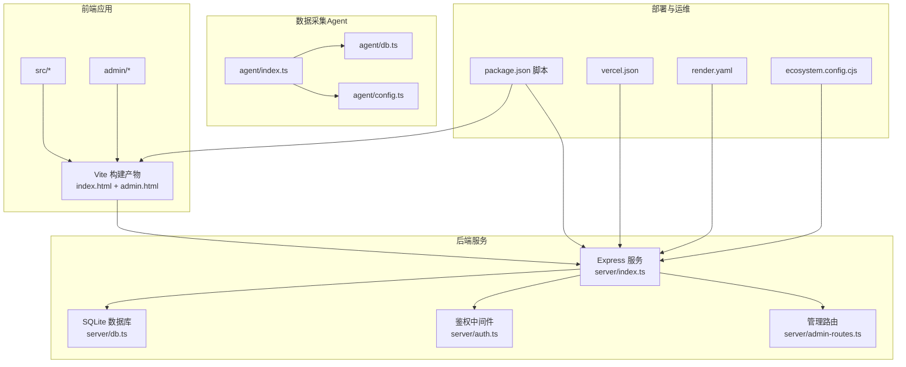
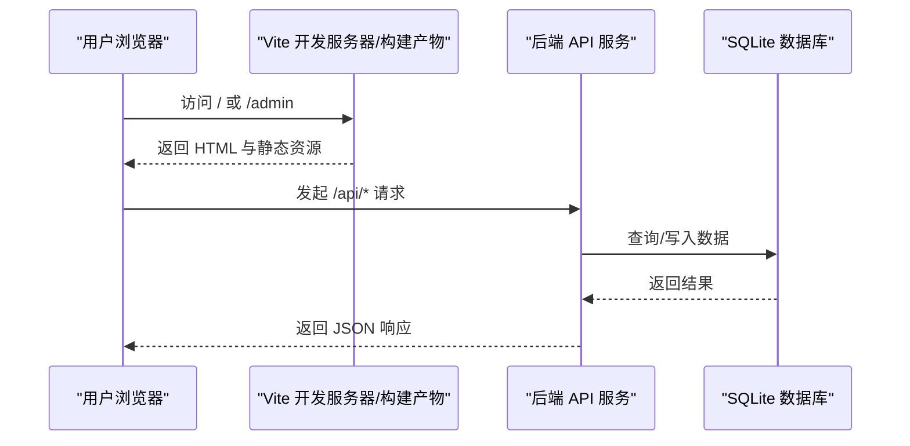
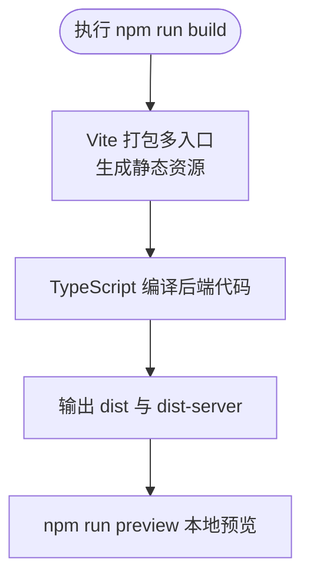
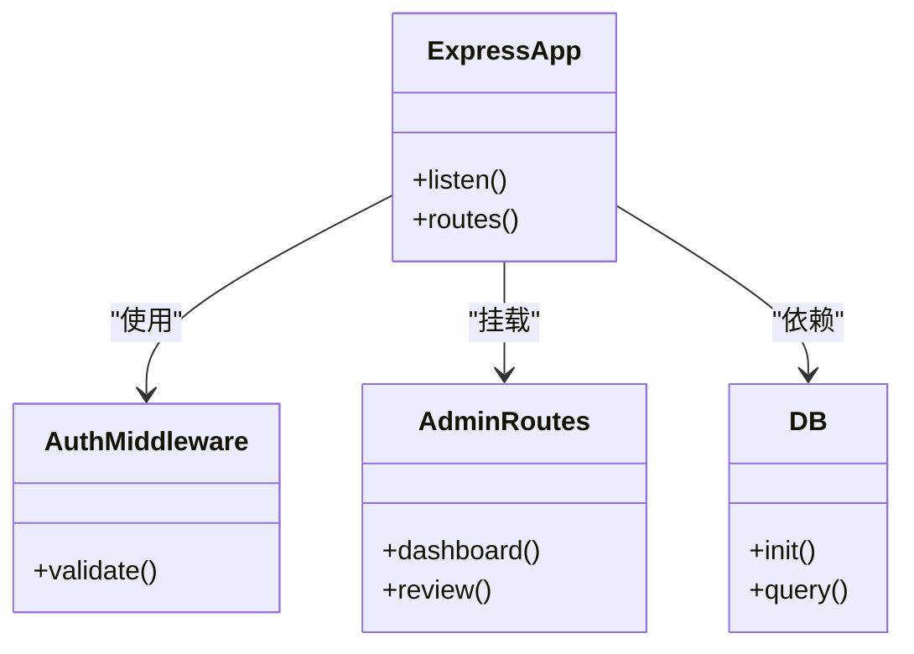
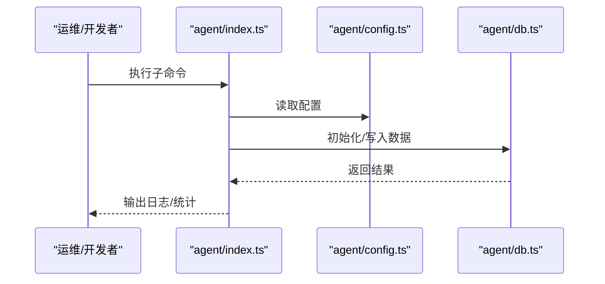
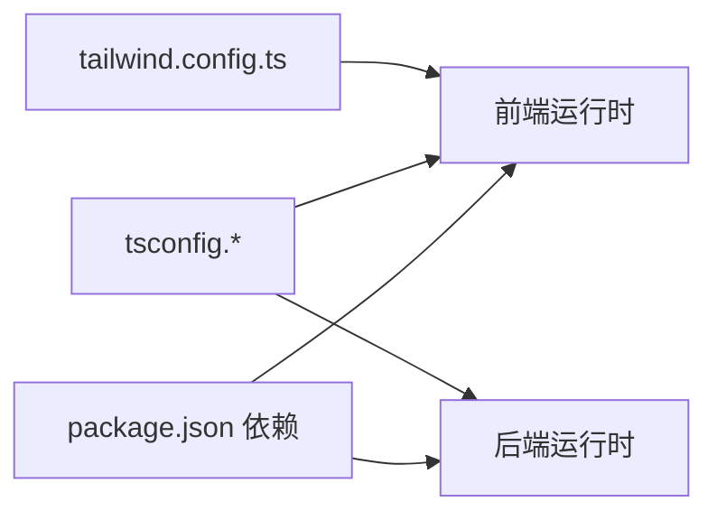

# 部署与运维

<cite>
**本文引用的文件**
- [package.json](file://package.json)
- [vite.config.ts](file://vite.config.ts)
- [vercel.json](file://vercel.json)
- [render.yaml](file://render.yaml)
- [ecosystem.config.cjs](file://ecosystem.config.cjs)
- [tsconfig.json](file://tsconfig.json)
- [tsconfig.app.json](file://tsconfig.app.json)
- [tailwind.config.ts](file://tailwind.config.ts)
- [server/index.ts](file://server/index.ts)
- [server/db.ts](file://server/db.ts)
- [server/admin-routes.ts](file://server/admin-routes.ts)
- [server/auth.ts](file://server/auth.ts)
- [agent/index.ts](file://agent/index.ts)
- [agent/config.ts](file://agent/config.ts)
- [agent/db.ts](file://agent/db.ts)
- [scripts/release.sh](file://scripts/release.sh)
- [scripts/server-pull.sh](file://scripts/server-pull.sh)
- [scripts/server-rollback.sh](file://scripts/server-rollback.sh)
- [scripts/local-daily-run.sh](file://scripts/local-daily-run.sh)
- [VERCEL_RAILWAY_DEPLOY.md](file://VERCEL_RAILWAY_DEPLOY.md)
</cite>

## 目录
1. [简介](#简介)
2. [项目结构](#项目结构)
3. [核心组件](#核心组件)
4. [架构总览](#架构总览)
5. [详细组件分析](#详细组件分析)
6. [依赖关系分析](#依赖关系分析)
7. [性能考量](#性能考量)
8. [故障排除指南](#故障排除指南)
9. [结论](#结论)
10. [附录](#附录)

## 简介
本文件面向旅行规划Demo项目的部署与运维团队，系统性阐述前端构建与打包、后端服务部署、多云平台（Vercel、Render）部署配置、CI/CD与自动化脚本、环境变量与生产优化、监控与日志、负载均衡与缓存策略、性能优化、故障排除与应急响应，以及运维最佳实践与安全加固建议。目标是帮助开发团队高效完成上线与日常维护。

## 项目结构
该项目采用前后端分离架构：前端基于 Vite + React，后端基于 Node.js + Express；同时包含独立的 Agent 数据采集与处理模块，以及若干运维脚本与部署配置文件。

图表来源
- [vite.config.ts:1-46](file://vite.config.ts#L1-L46)
- [server/index.ts](file://server/index.ts)
- [server/db.ts](file://server/db.ts)
- [server/auth.ts](file://server/auth.ts)
- [server/admin-routes.ts](file://server/admin-routes.ts)
- [agent/index.ts](file://agent/index.ts)
- [agent/config.ts](file://agent/config.ts)
- [agent/db.ts](file://agent/db.ts)
- [vercel.json:1-6](file://vercel.json#L1-L6)
- [render.yaml:1-12](file://render.yaml#L1-L12)
- [ecosystem.config.cjs:1-17](file://ecosystem.config.cjs#L1-L17)
- [package.json:6-25](file://package.json#L6-L25)

章节来源
- [package.json:6-25](file://package.json#L6-L25)
- [vite.config.ts:20-46](file://vite.config.ts#L20-L46)
- [vercel.json:1-6](file://vercel.json#L1-L6)
- [render.yaml:1-12](file://render.yaml#L1-L12)
- [ecosystem.config.cjs:1-17](file://ecosystem.config.cjs#L1-L17)

## 核心组件
- 前端构建与代理
  - Vite 多入口（主站与管理页），路径别名与开发代理到后端 API。
- 后端服务
  - Express 应用，数据库初始化与连接，鉴权中间件，管理端路由。
- Agent 数据采集
  - 统一入口与配置、数据库封装、质量评估与导出等子命令。
- 部署配置
  - Vercel 重写规则、Render 构建与启动命令、PM2 生态配置。

章节来源
- [vite.config.ts:20-46](file://vite.config.ts#L20-L46)
- [server/index.ts](file://server/index.ts)
- [server/db.ts](file://server/db.ts)
- [server/auth.ts](file://server/auth.ts)
- [server/admin-routes.ts](file://server/admin-routes.ts)
- [agent/index.ts](file://agent/index.ts)
- [agent/config.ts](file://agent/config.ts)
- [agent/db.ts](file://agent/db.ts)
- [vercel.json:1-6](file://vercel.json#L1-L6)
- [render.yaml:1-12](file://render.yaml#L1-L12)
- [ecosystem.config.cjs:1-17](file://ecosystem.config.cjs#L1-L17)

## 架构总览
下图展示从浏览器到后端 API 的请求链路，以及静态资源与管理页的访问路径。

图表来源
- [vite.config.ts:36-44](file://vite.config.ts#L36-L44)
- [vercel.json:2-4](file://vercel.json#L2-L4)
- [server/index.ts](file://server/index.ts)
- [server/db.ts](file://server/db.ts)

## 详细组件分析

### 前端构建与打包（Vite）
- 多入口与别名
  - 主入口与管理页入口分别指向不同 HTML 文件，便于独立路由与资源组织。
  - 路径别名 @ 与 @admin 指向 src 与 admin 目录，提升导入可读性。
- 插件与开发代理
  - React 插件启用按需编译与热更新。
  - 自定义插件对 /admin 与 /admin/ 进行开发时重写，保证管理页单页路由正常工作。
  - 本地开发代理将 /api 前缀转发至后端服务地址，避免跨域并统一调试体验。
- 构建产物与预览
  - 构建脚本同时产出前端产物与后端编译产物，预览用于本地验证。

图表来源
- [package.json:10-13](file://package.json#L10-L13)
- [vite.config.ts:28-35](file://vite.config.ts#L28-L35)

章节来源
- [vite.config.ts:6-18](file://vite.config.ts#L6-L18)
- [vite.config.ts:20-46](file://vite.config.ts#L20-L46)
- [package.json:10-13](file://package.json#L10-L13)

### 后端服务（Express）
- 入口与路由
  - 服务监听固定端口，提供业务路由与管理端路由。
- 数据库
  - 初始化 SQLite 并提供查询接口，支持 Agent 侧数据写入与合并。
- 鉴权中间件
  - 提供通用鉴权逻辑，保护受控路由。
- 管理端路由
  - 独立的管理端 API，与前端管理页配合。

图表来源
- [server/index.ts](file://server/index.ts)
- [server/auth.ts](file://server/auth.ts)
- [server/admin-routes.ts](file://server/admin-routes.ts)
- [server/db.ts](file://server/db.ts)

章节来源
- [server/index.ts](file://server/index.ts)
- [server/db.ts](file://server/db.ts)
- [server/auth.ts](file://server/auth.ts)
- [server/admin-routes.ts](file://server/admin-routes.ts)

### Agent 数据采集与处理
- 统一入口
  - 通过命令子集支持收集、重处理、导出、质量评估、状态查看、数据源刷新、校验、初始化数据库、重新打分等。
- 配置与数据库
  - Agent 使用独立配置与数据库封装，便于离线或定时任务运行。
- 与后端协作
  - Agent 可将清洗后的数据写入后端数据库，支撑前端展示与推荐。

图表来源
- [agent/index.ts](file://agent/index.ts)
- [agent/config.ts](file://agent/config.ts)
- [agent/db.ts](file://agent/db.ts)

章节来源
- [agent/index.ts](file://agent/index.ts)
- [agent/config.ts](file://agent/config.ts)
- [agent/db.ts](file://agent/db.ts)

### 部署配置与平台适配

#### Vercel 部署
- 重写规则
  - 将 /api/* 重写到后端 API，确保前端请求在边缘网络中正确转发。
- 建议
  - 在 Vercel 控制台设置环境变量（如 DASHSCOPE_API_KEY），并开启生产模式。

章节来源
- [vercel.json:1-6](file://vercel.json#L1-L6)

#### Render 部署
- 构建与启动
  - 构建命令安装依赖并执行构建脚本，启动命令运行生产服务。
- 环境变量
  - 设置 NODE_ENV=production，并注入第三方 API 密钥。
- 建议
  - 使用 Render 的环境变量同步功能，确保密钥不泄露。

章节来源
- [render.yaml:1-12](file://render.yaml#L1-L12)

#### PM2（自管服务器）
- 应用配置
  - 以 npm start 方式启动，设置工作目录、端口与环境变量。
- 廫议
  - 结合 systemd 或容器编排，实现自动重启与健康检查。

章节来源
- [ecosystem.config.cjs:1-17](file://ecosystem.config.cjs#L1-L17)

### CI/CD 流程与自动化脚本
- 发布脚本
  - 提供一键发布脚本，便于版本打包与部署。
- 服务器侧脚本
  - 包含拉取代码、回滚、本地每日运行等脚本，支持快速恢复与例行任务。
- 建议
  - 在 CI 中集成构建与测试步骤，成功后再触发部署钩子。

章节来源
- [scripts/release.sh](file://scripts/release.sh)
- [scripts/server-pull.sh](file://scripts/server-pull.sh)
- [scripts/server-rollback.sh](file://scripts/server-rollback.sh)
- [scripts/local-daily-run.sh](file://scripts/local-daily-run.sh)

## 依赖关系分析
- 前端依赖
  - React、TailwindCSS、Leaflet 等，构建时由 Vite 与 TypeScript 处理。
- 后端依赖
  - Express、better-sqlite3、dotenv 等，运行时由 Node.js 加载。
- 类型与路径
  - tsconfig 引用 app 配置，启用严格类型与路径别名，提升开发体验与可维护性。

图表来源
- [package.json:26-57](file://package.json#L26-L57)
- [tsconfig.json:1-6](file://tsconfig.json#L1-L6)
- [tsconfig.app.json:1-27](file://tsconfig.app.json#L1-L27)
- [tailwind.config.ts:1-139](file://tailwind.config.ts#L1-L139)

章节来源
- [package.json:26-57](file://package.json#L26-L57)
- [tsconfig.json:1-6](file://tsconfig.json#L1-L6)
- [tsconfig.app.json:1-27](file://tsconfig.app.json#L1-L27)
- [tailwind.config.ts:1-139](file://tailwind.config.ts#L1-L139)

## 性能考量
- 构建优化
  - 使用 Vite 的按需编译与 React 插件，减少打包体积与编译时间。
  - 多入口拆分主站与管理页，降低首屏无关资源加载。
- 静态资源处理
  - Tailwind 内容扫描覆盖 src 与 admin，避免无用样式进入产物。
- 代理与缓存
  - 开发代理统一转发 /api，生产环境由平台反向代理或 CDN 缓存静态资源。
- 数据层优化
  - SQLite 适合中小规模数据，建议在 Agent 层做增量更新与索引设计，减少查询开销。
- 建议
  - 生产环境启用 Gzip/Brotli 压缩与长期缓存策略；对敏感 API 接口增加限流与鉴权。

## 故障排除指南
- 常见问题
  - 管理页 404：确认开发代理已将 /admin 重写为 /admin.html，或生产环境静态托管正确配置。
  - API 500：检查后端数据库初始化是否成功、连接字符串与权限。
  - 环境变量缺失：确认平台控制台或配置文件中的密钥已注入。
- 快速恢复
  - 使用回滚脚本恢复至上一个稳定版本。
  - 通过本地预览验证构建产物与关键路由。
- 日志与监控
  - 后端服务打印请求日志与错误堆栈；平台侧查看访问日志与错误率。
  - 对关键接口埋点，结合 APM 工具定位性能瓶颈。

章节来源
- [vite.config.ts:6-18](file://vite.config.ts#L6-L18)
- [server/index.ts](file://server/index.ts)
- [scripts/server-rollback.sh](file://scripts/server-rollback.sh)

## 结论
本项目具备清晰的前后端分离架构与完善的部署配置文件。通过 Vite 多入口与代理、Express 后端、Agent 数据采集与运维脚本，形成可扩展的交付体系。建议在生产环境中完善环境变量管理、监控与日志、缓存与限流策略，并建立标准化的 CI/CD 流程，以保障持续稳定交付。

## 附录

### 环境变量清单（示例）
- NODE_ENV：production
- PORT：3001
- DASHSCOPE_API_KEY：第三方大模型服务密钥
- DATABASE_URL：SQLite 文件路径或连接串（如需）

章节来源
- [render.yaml:7-12](file://render.yaml#L7-L12)
- [ecosystem.config.cjs:7-14](file://ecosystem.config.cjs#L7-L14)

### 生产环境优化要点
- 构建产物压缩与缓存：启用长期缓存与 ETag/Cache-Control。
- 反向代理与 CDN：静态资源走 CDN，API 走平台边缘网络。
- 安全加固：强制 HTTPS、CORS 白名单、鉴权与速率限制。
- 监控与告警：接入平台日志与指标，设置错误率与延迟阈值告警。

### 运维最佳实践
- 版本化发布：使用语义化版本与变更日志。
- 权限最小化：密钥与证书仅授予必要进程与账户。
- 审计与备份：定期备份数据库，保留部署历史与回滚点。
- 应急预案：明确故障分级、责任分工与恢复步骤。