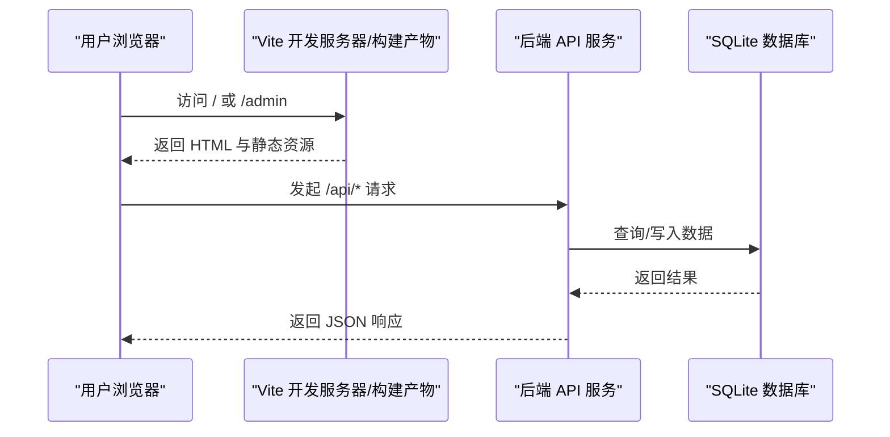
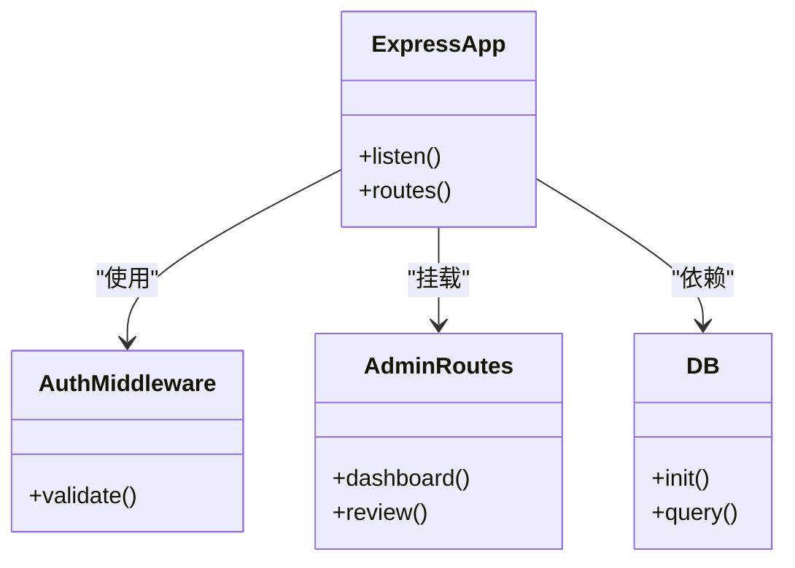
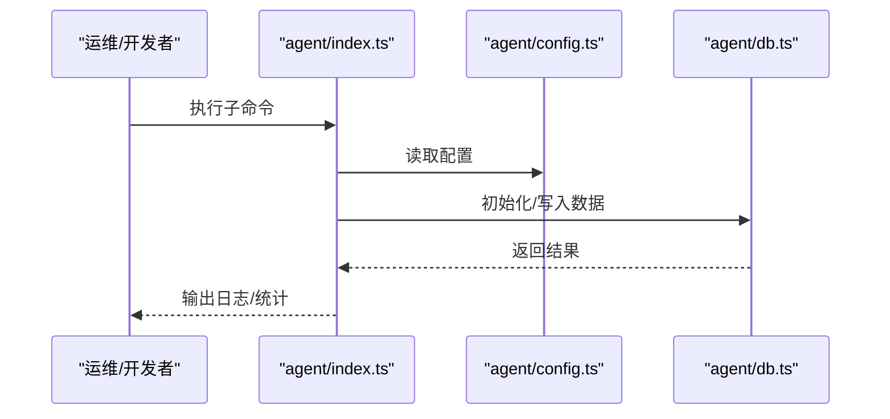
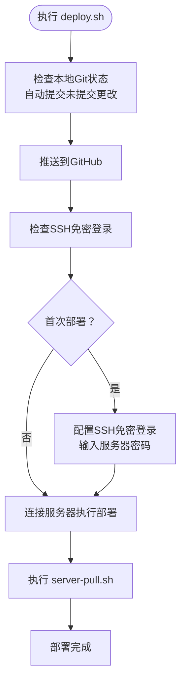
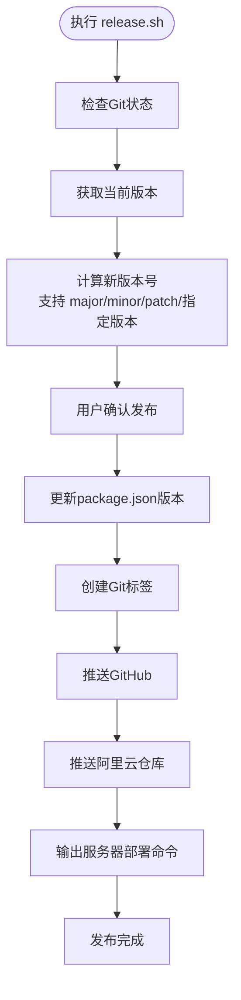
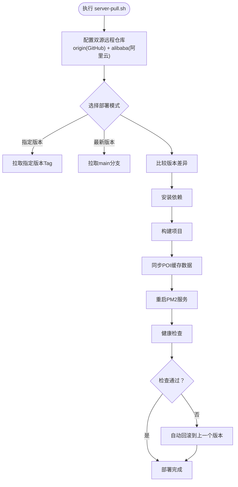
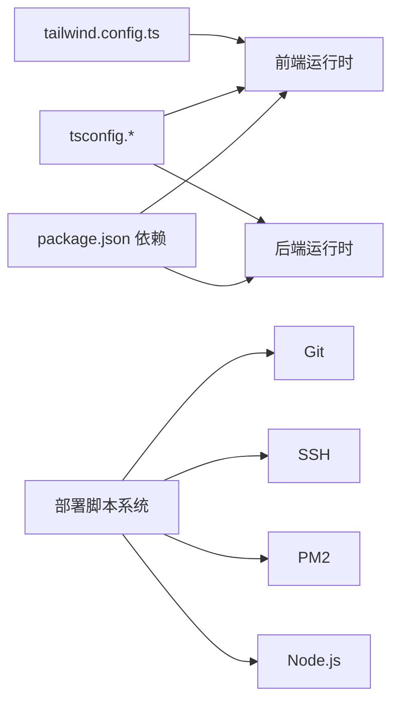

# 部署与运维

<cite>
**本文引用的文件**
- [package.json](file://package.json)
- [vite.config.ts](file://vite.config.ts)
- [vercel.json](file://vercel.json)
- [render.yaml](file://render.yaml)
- [ecosystem.config.cjs](file://ecosystem.config.cjs)
- [tsconfig.json](file://tsconfig.json)
- [tsconfig.app.json](file://tsconfig.app.json)
- [tailwind.config.ts](file://tailwind.config.ts)
- [server/index.ts](file://server/index.ts)
- [server/db.ts](file://server/db.ts)
- [server/admin-routes.ts](file://server/admin-routes.ts)
- [server/auth.ts](file://server/auth.ts)
- [agent/index.ts](file://agent/index.ts)
- [agent/config.ts](file://agent/config.ts)
- [agent/db.ts](file://agent/db.ts)
- [scripts/release.sh](file://scripts/release.sh)
- [scripts/server-pull.sh](file://scripts/server-pull.sh)
- [scripts/server-rollback.sh](file://scripts/server-rollback.sh)
- [scripts/local-daily-run.sh](file://scripts/local-daily-run.sh)
- [scripts/deploy.sh](file://scripts/deploy.sh)
- [scripts/setup-launchd.sh](file://scripts/setup-launchd.sh)
- [scripts/import-cache.js](file://scripts/import-cache.js)
- [scripts/db-export.js](file://scripts/db-export.js)
- [VERCEL_RAILWAY_DEPLOY.md](file://VERCEL_RAILWAY_DEPLOY.md)
</cite>

## 目录
1. [简介](#简介)
2. [项目结构](#项目结构)
3. [核心组件](#核心组件)
4. [架构总览](#架构总览)
5. [详细组件分析](#详细组件分析)
6. [依赖关系分析](#依赖关系分析)
7. [性能考量](#性能考量)
8. [故障排除指南](#故障排除指南)
9. [结论](#结论)
10. [附录](#附录)

## 简介
本文件面向旅行规划Demo项目的部署与运维团队，系统性阐述前端构建与打包、后端服务部署、多云平台（Vercel、Render）部署配置、CI/CD与自动化脚本、环境变量与生产优化、监控与日志、负载均衡与缓存策略、性能优化、故障排除与应急响应，以及运维最佳实践与安全加固建议。目标是帮助开发团队高效完成上线与日常维护。

**更新** 本版本新增了一键部署脚本系统，提供了更加完善的自动化部署解决方案，包括本地发布、服务器部署、版本回滚和定时任务管理等功能。

## 项目结构
该项目采用前后端分离架构：前端基于 Vite + React，后端基于 Node.js + Express；同时包含独立的 Agent 数据采集与处理模块，以及完整的自动化部署脚本系统。

```mermaid
graph TB
subgraph "前端应用"
FE["Vite 构建产物<br/>index.html + admin.html"]
SRC["src/*"]
ADMIN["admin/*"]
end
subgraph "后端服务"
API["Express 服务<br/>server/index.ts"]
DB["SQLite 数据库<br/>server/db.ts"]
AUTH["鉴权中间件<br/>server/auth.ts"]
ADMINS["管理路由<br/>server/admin-routes.ts"]
end
subgraph "数据采集Agent"
AGENT["agent/index.ts"]
AGCONF["agent/config.ts"]
AGDB["agent/db.ts"]
end
subgraph "部署与运维脚本"
DEPLOY["一键部署脚本<br/>scripts/deploy.sh"]
RELEASE["发布脚本<br/>scripts/release.sh"]
PULL["服务器部署脚本<br/>scripts/server-pull.sh"]
ROLLBACK["回滚脚本<br/>scripts/server-rollback.sh"]
LOCAL["本地定时发布脚本<br/>scripts/local-daily-run.sh"]
LAUNCHD["macOS定时任务<br/>scripts/setup-launchd.sh"]
IMPORT["缓存导入脚本<br/>scripts/import-cache.js"]
END
subgraph "平台配置"
VC["vercel.json"]
RD["render.yaml"]
ECOSYS["ecosystem.config.cjs"]
PKG["package.json 脚本"]
end
SRC --> FE
ADMIN --> FE
FE --> API
API --> DB
API --> AUTH
API --> ADMINS
AGENT --> AGDB
AGENT --> AGCONF
PKG --> FE
PKG --> API
DEPLOY --> PULL
RELEASE --> DEPLOY
PULL --> IMPORT
LOCAL --> RELEASE
LAUNCHD --> LOCAL
VC --> API
RD --> API
ECOSYS --> API
```

**图表来源**
- [vite.config.ts:1-46](file://vite.config.ts#L1-L46)
- [server/index.ts](file://server/index.ts)
- [server/db.ts](file://server/db.ts)
- [server/auth.ts](file://server/auth.ts)
- [server/admin-routes.ts](file://server/admin-routes.ts)
- [agent/index.ts](file://agent/index.ts)
- [agent/config.ts](file://agent/config.ts)
- [agent/db.ts](file://agent/db.ts)
- [scripts/deploy.sh:1-56](file://scripts/deploy.sh#L1-L56)
- [scripts/release.sh:1-168](file://scripts/release.sh#L1-L168)
- [scripts/server-pull.sh:1-198](file://scripts/server-pull.sh#L1-L198)
- [scripts/server-rollback.sh:1-127](file://scripts/server-rollback.sh#L1-L127)
- [scripts/local-daily-run.sh:1-156](file://scripts/local-daily-run.sh#L1-L156)
- [scripts/setup-launchd.sh:1-113](file://scripts/setup-launchd.sh#L1-L113)
- [scripts/import-cache.js:1-96](file://scripts/import-cache.js#L1-L96)

**章节来源**
- [package.json:6-25](file://package.json#L6-L25)
- [vite.config.ts:20-46](file://vite.config.ts#L20-L46)
- [vercel.json:1-6](file://vercel.json#L1-L6)
- [render.yaml:1-12](file://render.yaml#L1-L12)
- [ecosystem.config.cjs:1-17](file://ecosystem.config.cjs#L1-L17)

## 核心组件
- 前端构建与代理
  - Vite 多入口（主站与管理页），路径别名与开发代理到后端 API。
- 后端服务
  - Express 应用，数据库初始化与连接，鉴权中间件，管理端路由。
- Agent 数据采集
  - 统一入口与配置、数据库封装、质量评估与导出等子命令。
- **一键部署系统**
  - 本地一键部署脚本，支持自动提交、推送、SSH免密配置和服务器部署。
  - 完整的发布流程，包括版本管理、Git标签、多仓库推送。
  - 服务器端部署脚本，支持双源自动寻优、健康检查和自动回滚。
  - 版本回滚脚本，提供安全的版本切换能力。
  - 本地定时发布脚本，支持macOS确认对话框和自动发布流程。
  - 定时任务管理脚本，支持Launchd定时任务安装和管理。

**章节来源**
- [vite.config.ts:20-46](file://vite.config.ts#L20-L46)
- [server/index.ts](file://server/index.ts)
- [server/db.ts](file://server/db.ts)
- [server/auth.ts](file://server/auth.ts)
- [server/admin-routes.ts](file://server/admin-routes.ts)
- [agent/index.ts](file://agent/index.ts)
- [agent/config.ts](file://agent/config.ts)
- [agent/db.ts](file://agent/db.ts)
- [scripts/deploy.sh:1-56](file://scripts/deploy.sh#L1-L56)
- [scripts/release.sh:1-168](file://scripts/release.sh#L1-L168)
- [scripts/server-pull.sh:1-198](file://scripts/server-pull.sh#L1-L198)
- [scripts/server-rollback.sh:1-127](file://scripts/server-rollback.sh#L1-L127)
- [scripts/local-daily-run.sh:1-156](file://scripts/local-daily-run.sh#L1-L156)
- [scripts/setup-launchd.sh:1-113](file://scripts/setup-launchd.sh#L1-L113)
- [scripts/import-cache.js:1-96](file://scripts/import-cache.js#L1-L96)

## 架构总览
下图展示从浏览器到后端 API 的请求链路，以及静态资源与管理页的访问路径。



**图表来源**
- [vite.config.ts:36-44](file://vite.config.ts#L36-L44)
- [vercel.json:2-4](file://vercel.json#L2-L4)
- [server/index.ts](file://server/index.ts)
- [server/db.ts](file://server/db.ts)

## 详细组件分析

### 前端构建与打包（Vite）
- 多入口与别名
  - 主入口与管理页入口分别指向不同 HTML 文件，便于独立路由与资源组织。
  - 路径别名 @ 与 @admin 指向 src 与 admin 目录，提升导入可读性。
- 插件与开发代理
  - React 插件启用按需编译与热更新。
  - 自定义插件对 /admin 与 /admin/ 进行开发时重写，保证管理页单页路由正常工作。
  - 本地开发代理将 /api 前缀转发至后端服务地址，避免跨域并统一调试体验。
- 构建产物与预览
  - 构建脚本同时产出前端产物与后端编译产物，预览用于本地验证。


**图表来源**
- [package.json:10-13](file://package.json#L10-L13)
- [vite.config.ts:28-35](file://vite.config.ts#L28-L35)

**章节来源**
- [vite.config.ts:6-18](file://vite.config.ts#L6-L18)
- [vite.config.ts:20-46](file://vite.config.ts#L20-L46)
- [package.json:10-13](file://package.json#L10-L13)

### 后端服务（Express）
- 入口与路由
  - 服务监听固定端口，提供业务路由与管理端路由。
- 数据库
  - 初始化 SQLite 并提供查询接口，支持 Agent 侧数据写入与合并。
- 鉴权中间件
  - 提供通用鉴权逻辑，保护受控路由。
- 管理端路由
  - 独立的管理端 API，与前端管理页配合。



**图表来源**
- [server/index.ts](file://server/index.ts)
- [server/auth.ts](file://server/auth.ts)
- [server/admin-routes.ts](file://server/admin-routes.ts)
- [server/db.ts](file://server/db.ts)

**章节来源**
- [server/index.ts](file://server/index.ts)
- [server/db.ts](file://server/db.ts)
- [server/auth.ts](file://server/auth.ts)
- [server/admin-routes.ts](file://server/admin-routes.ts)

### Agent 数据采集与处理
- 统一入口
  - 通过命令子集支持收集、重处理、导出、质量评估、状态查看、数据源刷新、校验、初始化数据库、重新打分等。
- 配置与数据库
  - Agent 使用独立配置与数据库封装，便于离线或定时任务运行。
- 与后端协作
  - Agent 可将清洗后的数据写入后端数据库，支撑前端展示与推荐。



**图表来源**
- [agent/index.ts](file://agent/index.ts)
- [agent/config.ts](file://agent/config.ts)
- [agent/db.ts](file://agent/db.ts)

**章节来源**
- [agent/index.ts](file://agent/index.ts)
- [agent/config.ts](file://agent/config.ts)
- [agent/db.ts](file://agent/db.ts)

### 一键部署系统

#### 本地一键部署脚本（deploy.sh）
**新增** 一键部署脚本提供了完整的本地到服务器部署流程，简化了部署操作。

- 自动化流程
  - 检查本地Git状态，自动提交未提交的更改
  - 推送到GitHub主分支
  - 检查SSH免密登录配置，首次部署时自动配置
  - 通过SSH连接服务器执行部署脚本
- 服务器配置
  - 默认服务器IP: 8.130.215.28
  - 用户: root
  - 工作目录: /opt/aitrip
- 安全特性
  - 首次部署时提示输入服务器密码进行SSH配置
  - 配置完成后下次运行无需输入密码



**图表来源**
- [scripts/deploy.sh:15-50](file://scripts/deploy.sh#L15-L50)

**章节来源**
- [scripts/deploy.sh:1-56](file://scripts/deploy.sh#L1-L56)

#### 发布脚本系统（release.sh）
**更新** 发布脚本提供了完整的版本管理和多仓库推送功能。

- 版本管理
  - 支持自动补丁版本、次版本、主版本升级
  - 支持指定版本号发布
  - 自动更新package.json版本号
- Git标签管理
  - 创建Git标签并添加注释
  - 支持多仓库推送（GitHub和阿里云）
- 交互式确认
  - 显示当前版本和目标版本
  - 用户确认后才执行发布
- 服务器部署指令
  - 自动输出服务器部署命令



**图表来源**
- [scripts/release.sh:93-165](file://scripts/release.sh#L93-L165)

**章节来源**
- [scripts/release.sh:1-168](file://scripts/release.sh#L1-L168)

#### 服务器部署脚本（server-pull.sh）
**更新** 服务器部署脚本提供了双源自动寻优和完整的部署流程。

- 双源自动寻优
  - 优先使用GitHub，失败自动切换阿里云仓库
  - 支持指定版本部署和最新版本部署
- 完整部署流程
  - 显示版本变更日志
  - 安装依赖（支持失败回滚）
  - 构建项目（支持失败回滚）
  - 同步POI缓存数据
  - 重启PM2服务
  - 健康检查（失败自动回滚）
- 数据同步
  - 自动检测POI缓存文件更新
  - 支持导入缓存数据到数据库
- 回滚机制
  - 健康检查失败时自动回滚到上一个版本
  - 详细的回滚命令输出



**图表来源**
- [scripts/server-pull.sh:48-195](file://scripts/server-pull.sh#L48-L195)

**章节来源**
- [scripts/server-pull.sh:1-198](file://scripts/server-pull.sh#L1-L198)

#### 版本回滚脚本（server-rollback.sh）
**新增** 专门的版本回滚脚本，提供安全的版本切换能力。

- 版本管理
  - 列出可用版本（支持排序和筛选）
  - 支持指定版本回滚
  - 显示版本详细信息（日期、注释）
- 安全回滚
  - 用户确认回滚操作
  - 自动构建和重启服务
  - 健康检查确保回滚成功
- 错误处理
  - 回滚失败时提供PM2日志
  - 支持手动排查问题

**章节来源**
- [scripts/server-rollback.sh:1-127](file://scripts/server-rollback.sh#L1-L127)

#### 本地定时发布系统（local-daily-run.sh）
**新增** 本地定时发布脚本，支持macOS确认对话框和自动发布流程。

- 数据导出
  - 自动导出本地SQLite数据库到JSON格式
  - 解析导出结果生成统计摘要
- 用户交互
  - macOS确认对话框显示导出详情
  - 支持自动确认模式（AUTO_CONFIRM=1）
- 发布流程
  - 用户确认后自动执行release.sh
  - 输出服务器部署命令
- 定时任务集成
  - 与setup-launchd.sh配合使用
  - 支持每天12:00自动执行

**章节来源**
- [scripts/local-daily-run.sh:1-156](file://scripts/local-daily-run.sh#L1-L156)

#### 定时任务管理（setup-launchd.sh）
**新增** macOS Launchd定时任务管理脚本。

- 任务安装
  - 自动创建Launchd plist文件
  - 每天12:00自动执行本地发布脚本
  - 支持卸载旧任务
- 环境配置
  - 设置PATH环境变量包含Node.js路径
  - 配置标准输出和错误日志
- 测试功能
  - 支持立即测试执行
  - 自动检查脚本路径有效性

**章节来源**
- [scripts/setup-launchd.sh:1-113](file://scripts/setup-launchd.sh#L1-L113)

#### 缓存数据导入（import-cache.js）
**新增** 缓存数据导入脚本，支持POI和酒店数据的批量导入。

- 数据库操作
  - 支持WAL模式和外键约束
  - 自动创建city_pois和hotels表
  - 使用UPSERT操作避免重复插入
- 数据处理
  - 支持JSON数据和字符串数据
  - 自动计算数据大小并显示进度
  - 支持不同数据库目录配置
- 错误处理
  - 缓存文件不存在时优雅退出
  - 数据库连接失败时提供错误信息

**章节来源**
- [scripts/import-cache.js:1-96](file://scripts/import-cache.js#L1-L96)

### 部署配置与平台适配

#### Vercel 部署
- 重写规则
  - 将 /api/* 重写到后端 API，确保前端请求在边缘网络中正确转发。
- 建议
  - 在 Vercel 控制台设置环境变量（如 DASHSCOPE_API_KEY），并开启生产模式。

**章节来源**
- [vercel.json:1-6](file://vercel.json#L1-L6)

#### Render 部署
- 构建与启动
  - 构建命令安装依赖并执行构建脚本，启动命令运行生产服务。
- 环境变量
  - 设置 NODE_ENV=production，并注入第三方 API 密钥。
- 建议
  - 使用 Render 的环境变量同步功能，确保密钥不泄露。

**章节来源**
- [render.yaml:1-12](file://render.yaml#L1-L12)

#### PM2（自管服务器）
- 应用配置
  - 以 npm start 方式启动，设置工作目录、端口与环境变量。
- 廫议
  - 结合 systemd 或容器编排，实现自动重启与健康检查。

**章节来源**
- [ecosystem.config.cjs:1-17](file://ecosystem.config.cjs#L1-L17)

### CI/CD 流程与自动化脚本
**更新** 自动化部署系统提供了完整的CI/CD解决方案。

- 一键部署流程
  - deploy.sh：本地一键部署到服务器
  - 支持自动提交、推送、SSH配置和服务器部署
- 发布管理
  - release.sh：完整的版本发布流程
  - 支持多仓库推送和版本控制
- 服务器部署
  - server-pull.sh：服务器端部署脚本
  - 双源自动寻优、健康检查和自动回滚
- 版本控制
  - server-rollback.sh：版本回滚脚本
  - 安全的版本切换和恢复
- 本地定时发布
  - local-daily-run.sh：本地定时发布脚本
  - 支持macOS确认对话框和自动发布
  - 与setup-launchd.sh配合实现定时任务
- 建议
  - 在CI中集成构建与测试步骤，成功后再触发部署钩子
  - 使用server-pull.sh作为生产环境的标准部署流程

**章节来源**
- [scripts/deploy.sh:1-56](file://scripts/deploy.sh#L1-L56)
- [scripts/release.sh:1-168](file://scripts/release.sh#L1-L168)
- [scripts/server-pull.sh:1-198](file://scripts/server-pull.sh#L1-L198)
- [scripts/server-rollback.sh:1-127](file://scripts/server-rollback.sh#L1-L127)
- [scripts/local-daily-run.sh:1-156](file://scripts/local-daily-run.sh#L1-L156)
- [scripts/setup-launchd.sh:1-113](file://scripts/setup-launchd.sh#L1-L113)

## 依赖关系分析
- 前端依赖
  - React、TailwindCSS、Leaflet 等，构建时由 Vite 与 TypeScript 处理。
- 后端依赖
  - Express、better-sqlite3、dotenv 等，运行时由 Node.js 加载。
- **部署脚本依赖**
  - Bash脚本依赖Git、SSH、PM2等系统工具
  - Node.js脚本依赖better-sqlite3、fs、path等模块
  - macOS定时任务依赖Launchd和osascript
- 类型与路径
  - tsconfig 引用 app 配置，启用严格类型与路径别名，提升开发体验与可维护性。



**图表来源**
- [package.json:26-57](file://package.json#L26-L57)
- [tsconfig.json:1-6](file://tsconfig.json#L1-L6)
- [tsconfig.app.json:1-27](file://tsconfig.app.json#L1-L27)
- [tailwind.config.ts:1-139](file://tailwind.config.ts#L1-L139)

**章节来源**
- [package.json:26-57](file://package.json#L26-L57)
- [tsconfig.json:1-6](file://tsconfig.json#L1-L6)
- [tsconfig.app.json:1-27](file://tsconfig.app.json#L1-L27)
- [tailwind.config.ts:1-139](file://tailwind.config.ts#L1-L139)

## 性能考量
- 构建优化
  - 使用 Vite 的按需编译与 React 插件，减少打包体积与编译时间。
  - 多入口拆分主站与管理页，降低首屏无关资源加载。
- 静态资源处理
  - Tailwind 内容扫描覆盖 src 与 admin，避免无用样式进入产物。
- 代理与缓存
  - 开发代理统一转发 /api，生产环境由平台反向代理或 CDN 缓存静态资源。
- 数据层优化
  - SQLite 适合中小规模数据，建议在 Agent 层做增量更新与索引设计，减少查询开销。
- **部署性能优化**
  - 双源自动寻优减少部署等待时间
  - 健康检查确保部署成功率
  - 缓存数据导入优化POI查询性能
- 建议
  - 生产环境启用 Gzip/Brotli 压缩与长期缓存策略；对敏感 API 接口增加限流与鉴权。

## 故障排除指南
- 常见问题
  - 管理页 404：确认开发代理已将 /admin 重写为 /admin.html，或生产环境静态托管正确配置。
  - API 500：检查后端数据库初始化是否成功、连接字符串与权限。
  - 环境变量缺失：确认平台控制台或配置文件中的密钥已注入。
  - **部署失败**：检查Git配置、SSH免密登录、服务器磁盘空间和内存。
  - **回滚问题**：使用server-rollback.sh进行版本回滚，检查PM2日志。
- 快速恢复
  - 使用回滚脚本恢复至上一个稳定版本。
  - 通过本地预览验证构建产物与关键路由。
  - 使用server-pull.sh的自动回滚功能。
- 日志与监控
  - 后端服务打印请求日志与错误堆栈；平台侧查看访问日志与错误率。
  - 对关键接口埋点，结合 APM 工具定位性能瓶颈。
  - **部署脚本**：查看各脚本的详细输出和错误信息。
- **应急响应**
  - 一键部署失败：检查deploy.sh的SSH配置和server-pull.sh的健康检查。
  - 版本回滚：使用server-rollback.sh，确保服务可用性。
  - 数据同步问题：检查import-cache.js的数据库连接和文件权限。

**章节来源**
- [vite.config.ts:6-18](file://vite.config.ts#L6-L18)
- [server/index.ts](file://server/index.ts)
- [scripts/server-rollback.sh](file://scripts/server-rollback.sh)
- [scripts/deploy.sh:29-45](file://scripts/deploy.sh#L29-L45)
- [scripts/server-pull.sh:169-194](file://scripts/server-pull.sh#L169-L194)

## 结论
本项目具备清晰的前后端分离架构与完善的部署配置文件。通过 Vite 多入口与代理、Express 后端、Agent 数据采集与运维脚本，形成可扩展的交付体系。

**更新** 新增的一键部署系统提供了更加完善的自动化部署解决方案，包括：
- 一键部署脚本，简化本地到服务器的部署流程
- 完整的发布管理系统，支持版本控制和多仓库推送
- 服务器端部署脚本，具备双源自动寻优和健康检查
- 版本回滚机制，确保部署安全性
- 本地定时发布系统，支持macOS确认对话框
- 完整的CI/CD流程，从本地开发到生产部署的全流程自动化

建议在生产环境中完善环境变量管理、监控与日志、缓存与限流策略，并建立标准化的 CI/CD 流程，以保障持续稳定交付。

## 附录

### 环境变量清单（示例）
- NODE_ENV：production
- PORT：3001
- DASHSCOPE_API_KEY：第三方大模型服务密钥
- DATABASE_URL：SQLite 文件路径或连接串（如需）
- **SSH配置**：用于deploy.sh的服务器访问
- **Git配置**：用于release.sh的多仓库推送

**章节来源**
- [render.yaml:7-12](file://render.yaml#L7-L12)
- [ecosystem.config.cjs:7-14](file://ecosystem.config.cjs#L7-L14)

### 生产环境优化要点
- 构建产物压缩与缓存：启用长期缓存与 ETag/Cache-Control。
- 反向代理与 CDN：静态资源走 CDN，API 走平台边缘网络。
- 安全加固：强制 HTTPS、CORS 白名单、鉴权与速率限制。
- 监控与告警：接入平台日志与指标，设置错误率与延迟阈值告警。
- **部署优化**：使用双源自动寻优减少部署时间，实施健康检查确保服务可用性。

### 运维最佳实践
- 版本化发布：使用语义化版本与变更日志。
- 权限最小化：密钥与证书仅授予必要进程与账户。
- 审计与备份：定期备份数据库，保留部署历史与回滚点。
- 应急预案：明确故障分级、责任分工与恢复步骤。
- **自动化部署**：使用一键部署脚本减少人为错误，提高部署效率。
- **定时任务**：使用setup-launchd.sh管理本地定时发布任务。
- **数据同步**：定期使用local-daily-run.sh同步POI缓存数据。

### 部署脚本使用指南
- **一键部署**：`bash scripts/deploy.sh` - 本地一键部署到服务器
- **版本发布**：`bash scripts/release.sh [patch|minor|major|version]` - 发布新版本
- **服务器部署**：`bash scripts/server-pull.sh [version]` - 部署到服务器
- **版本回滚**：`bash scripts/server-rollback.sh [version]` - 回滚到指定版本
- **本地发布**：`bash scripts/local-daily-run.sh` - 本地定时发布流程
- **定时任务**：`bash scripts/setup-launchd.sh` - 安装macOS定时任务
- **缓存导入**：`node scripts/import-cache.js` - 导入POI和酒店缓存数据