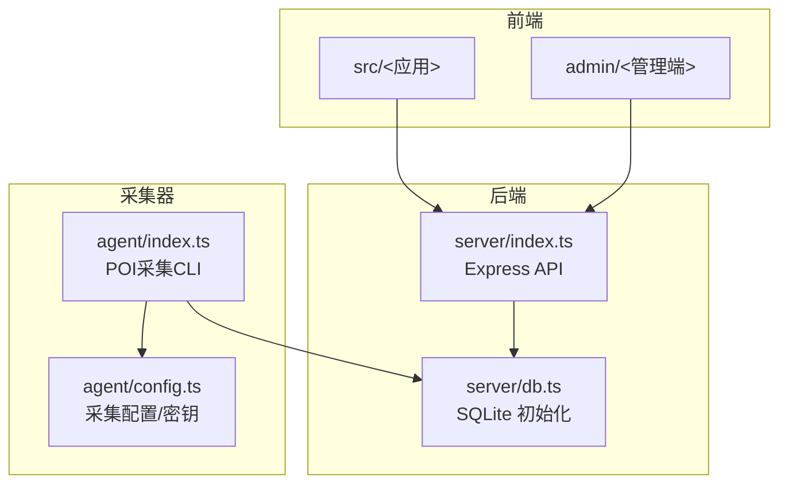
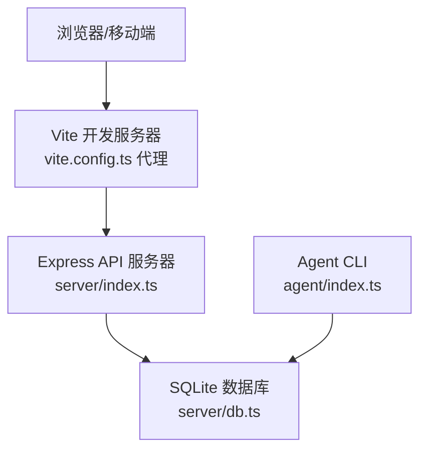
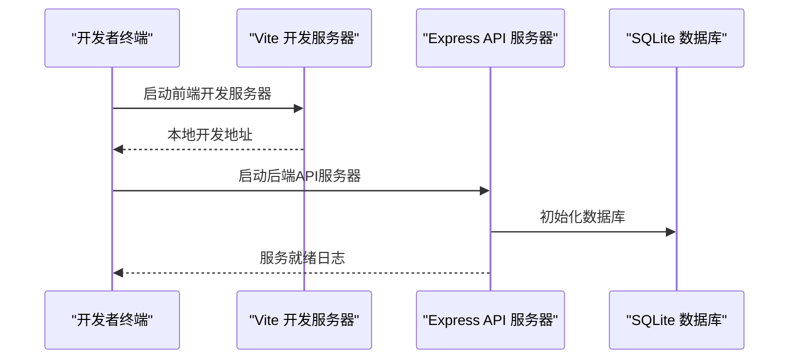
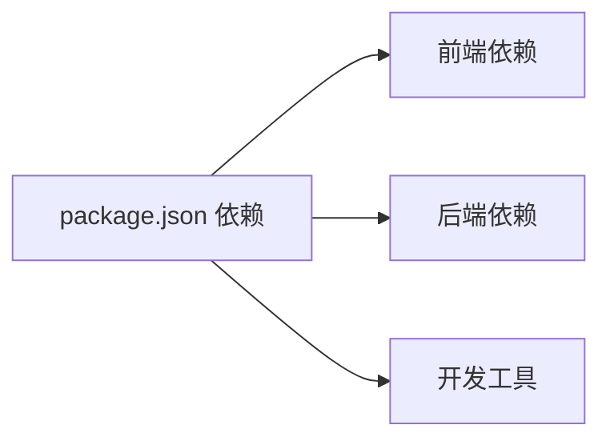

# 开发环境搭建

<cite>
**本文引用的文件**
- [package.json](file://package.json)
- [vite.config.ts](file://vite.config.ts)
- [tsconfig.json](file://tsconfig.json)
- [server/index.ts](file://server/index.ts)
- [server/db.ts](file://server/db.ts)
- [agent/index.ts](file://agent/index.ts)
- [agent/config.ts](file://agent/config.ts)
- [admin/main.tsx](file://admin/main.tsx)
</cite>

## 目录
1. [简介](#简介)
2. [项目结构](#项目结构)
3. [核心组件](#核心组件)
4. [架构总览](#架构总览)
5. [详细组件分析](#详细组件分析)
6. [依赖分析](#依赖分析)
7. [性能考虑](#性能考虑)
8. [故障排查指南](#故障排查指南)
9. [结论](#结论)
10. [附录](#附录)

## 简介
本指南面向新加入的开发者，帮助你在本地快速搭建并运行旅行规划Demo项目的完整开发环境。你将学会：
- 环境要求与前置条件（Node.js版本、操作系统兼容性）
- 项目克隆、依赖安装与配置
- 启动前端开发服务器、后端API服务器与AI数据采集器
- 配置文件作用与可自定义项（环境变量、数据库位置、API密钥等）
- 常见问题与调试技巧
- 推荐开发工具与IDE配置

## 项目结构
该项目采用前后端分离与独立子系统并行的组织方式：
- 前端应用位于 src/，管理行程规划与游记功能
- 管理端应用位于 admin/，独立打包与路由
- 后端API服务器位于 server/，基于Express + SQLite
- AI数据采集器位于 agent/，独立CLI工具，负责POI采集、清洗与导出
- 构建与开发工具通过Vite、TypeScript与脚本统一管理

图表来源
- [server/index.ts:1-790](file://server/index.ts#L1-L790)
- [server/db.ts:1-200](file://server/db.ts#L1-L200)
- [agent/index.ts:1-800](file://agent/index.ts#L1-L800)
- [agent/config.ts:1-182](file://agent/config.ts#L1-L182)

章节来源
- [package.json:1-59](file://package.json#L1-L59)
- [vite.config.ts:1-46](file://vite.config.ts#L1-L46)
- [tsconfig.json:1-6](file://tsconfig.json#L1-L6)

## 核心组件
- 前端应用（src/）与管理端（admin/）通过Vite进行开发构建，支持热更新与代理转发
- 后端API服务器（server/index.ts）提供REST接口，内置CORS与JSON解析，集成SQLite数据库
- 采集器（agent/index.ts）作为独立CLI，负责多源POI采集、合并去重、质量评估与导出
- 配置与密钥管理：通过dotenv加载环境变量；数据库路径按环境自动选择

章节来源
- [server/index.ts:1-790](file://server/index.ts#L1-L790)
- [agent/index.ts:1-800](file://agent/index.ts#L1-L800)
- [agent/config.ts:1-182](file://agent/config.ts#L1-L182)

## 架构总览
下图展示开发环境中的关键交互：前端通过Vite代理访问后端API；采集器独立运行，将处理后的POI写入SQLite；管理端独立开发与预览。

图表来源
- [vite.config.ts:36-44](file://vite.config.ts#L36-L44)
- [server/index.ts:57-790](file://server/index.ts#L57-L790)
- [server/db.ts:37-147](file://server/db.ts#L37-L147)
- [agent/index.ts:1-800](file://agent/index.ts#L1-L800)

## 详细组件分析

### 环境要求与前置条件
- Node.js 版本
  - 项目使用模块化导入与TypeScript，建议使用稳定版Node.js LTS（如18.x或20.x），以获得最佳兼容性
- 操作系统
  - 支持macOS/Linux；Windows需注意路径分隔符与权限差异
- 其他依赖
  - Git（用于克隆仓库）
  - npm（随Node.js提供）

章节来源
- [package.json:1-59](file://package.json#L1-L59)

### 项目克隆与依赖安装
- 克隆仓库
  - 使用Git克隆项目至本地目录
- 安装依赖
  - 在项目根目录执行依赖安装命令
  - 注意：项目使用TypeScript与Vite，安装过程会编译类型与构建工具
- 配置文件
  - 创建并配置环境变量文件（见“配置文件与自定义选项”）

章节来源
- [package.json:6-25](file://package.json#L6-L25)

### 开发服务器启动方式
- 启动前端开发服务器
  - 运行开发命令，打开浏览器访问默认地址
  - Vite开发服务器同时支持主应用与管理端入口
- 启动后端API服务器
  - 运行后端脚本，监听本地端口（默认3001）
  - 服务器会自动初始化SQLite数据库文件
- 启动AI数据采集器
  - 运行采集器CLI，支持多种子命令（采集、重处理、导出、质量评估、状态查询等）
  - 采集器会根据配置加载API密钥与运行参数

图表来源
- [package.json:7-13](file://package.json#L7-L13)
- [server/index.ts:780-787](file://server/index.ts#L780-L787)
- [server/db.ts:37-147](file://server/db.ts#L37-L147)

章节来源
- [package.json:7-13](file://package.json#L7-L13)
- [vite.config.ts:20-46](file://vite.config.ts#L20-L46)
- [server/index.ts:57-790](file://server/index.ts#L57-L790)

### 配置文件与自定义选项
- 环境变量（.env.local）
  - 后端API服务器通过dotenv加载，读取API密钥与端口等
  - 采集器同样通过dotenv加载密钥与运行参数
- 数据库位置
  - 后端数据库路径按环境变量与目录存在性自动选择，支持本地开发与生产部署
- API密钥
  - 采集器支持多源API密钥（如DashScope、高德、四维图新、Spark、豆包等）
  - 未配置的密钥会被自动跳过
- Vite代理
  - 开发环境下，Vite将/api前缀代理到后端API服务器

章节来源
- [server/index.ts:55](file://server/index.ts#L55)
- [agent/config.ts:15-28](file://agent/config.ts#L15-L28)
- [agent/config.ts:32-77](file://agent/config.ts#L32-L77)
- [server/db.ts:18-27](file://server/db.ts#L18-L27)
- [vite.config.ts:36-44](file://vite.config.ts#L36-L44)

### 开发工具与IDE配置建议
- 推荐编辑器
  - VS Code（支持TypeScript、Tailwind CSS、ESLint/Prettier扩展）
- 关键设置
  - 启用TypeScript自动编译与检查
  - Tailwind CSS IntelliSense以获得样式提示
  - ESLint与Prettier保持代码风格一致
- 调试建议
  - 在VS Code中为前端与后端分别配置调试任务（使用相应脚本）
  - 采集器可通过命令行参数控制并发、批大小与数据源

章节来源
- [package.json:44-57](file://package.json#L44-L57)
- [vite.config.ts:20-46](file://vite.config.ts#L20-L46)

## 依赖分析
- 前端依赖
  - React、React Router、Framer Motion、Tailwind CSS等
- 后端依赖
  - Express、CORS、better-sqlite3、dotenv等
- 开发工具
  - Vite、TypeScript、tsx、PostCSS、Tailwind CSS等

图表来源
- [package.json:26-57](file://package.json#L26-L57)

章节来源
- [package.json:26-57](file://package.json#L26-L57)

## 性能考虑
- 前端
  - Vite提供快速冷启动与热更新；合理拆分路由与组件以减少初始包体
- 后端
  - SQLite适合开发与小规模数据；生产建议迁移至关系型数据库
  - 合理设置请求体大小与超时时间，避免大请求阻塞
- 采集器
  - 控制并发与速率限制，避免触发第三方API限流
  - 增量更新策略减少重复采集

## 故障排查指南
- 启动后端失败（数据库初始化异常）
  - 检查数据库目录权限与环境变量DB_DIR
  - 确认SQLite文件可写
- 前端无法访问后端接口
  - 检查Vite代理配置是否指向正确的后端地址
  - 确认后端服务已启动且端口未被占用
- 采集器无数据或报错
  - 检查对应API密钥是否配置
  - 查看采集器输出日志，确认可用数据源列表
- 管理端页面空白
  - 确认Vite开发服务器已启动
  - 检查/admin路由重写中间件是否生效

章节来源
- [server/db.ts:37-147](file://server/db.ts#L37-L147)
- [vite.config.ts:5-18](file://vite.config.ts#L5-L18)
- [agent/config.ts:87-125](file://agent/config.ts#L87-L125)
- [admin/main.tsx:1-14](file://admin/main.tsx#L1-L14)

## 结论
按照本指南完成环境准备与启动后，你将具备运行前端、后端与采集器的完整能力。建议在开发过程中：
- 优先配置必要的API密钥，确保采集器正常工作
- 使用Vite代理与本地数据库，提升开发效率
- 遇到问题时结合日志与配置文件定位原因

## 附录
- 常用脚本
  - 前端开发：npm run dev
  - 后端开发：npm run server
  - 同时启动：npm run dev:all
  - 采集器常用命令：collect、reprocess、export、quality、status、refresh、validate、init-db、rescore
- 管理端开发
  - npm run admin:dev

章节来源
- [package.json:6-25](file://package.json#L6-L25)