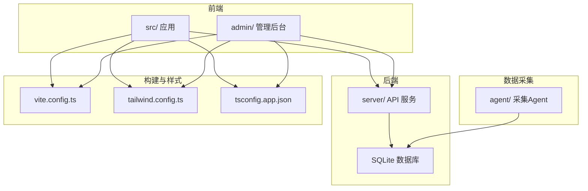
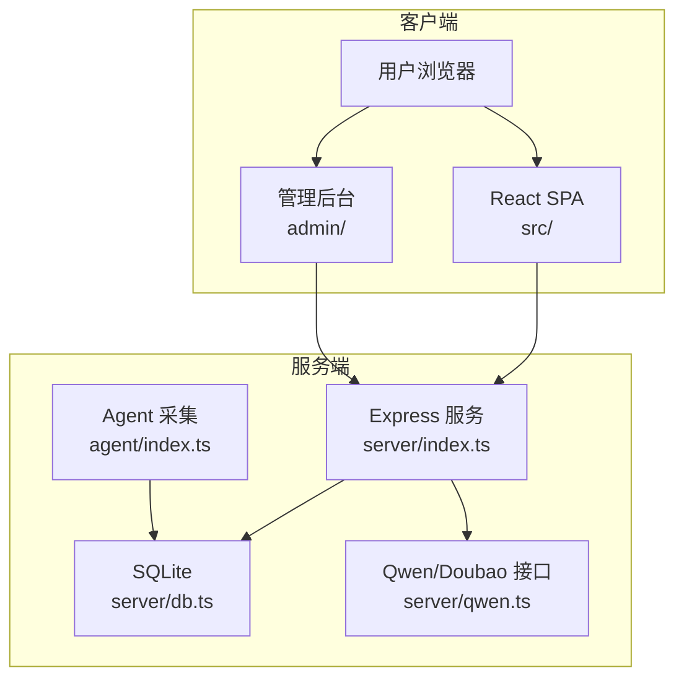
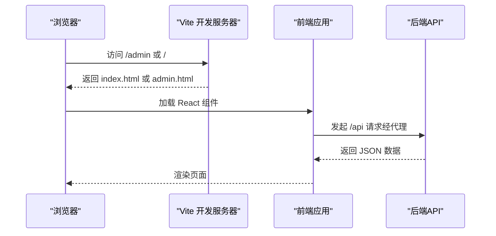
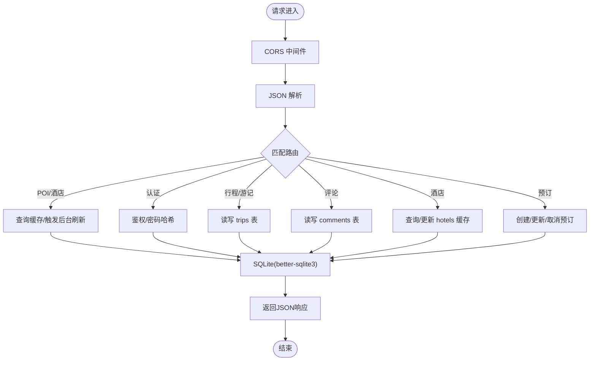
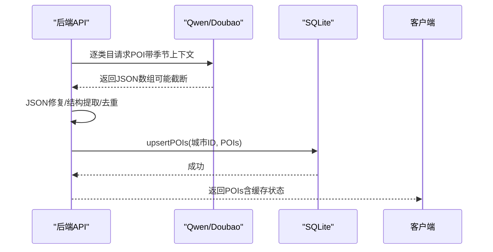
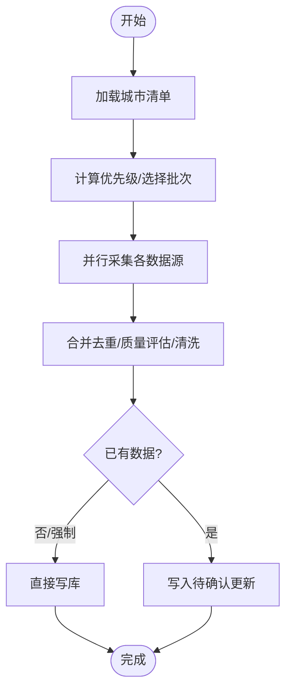
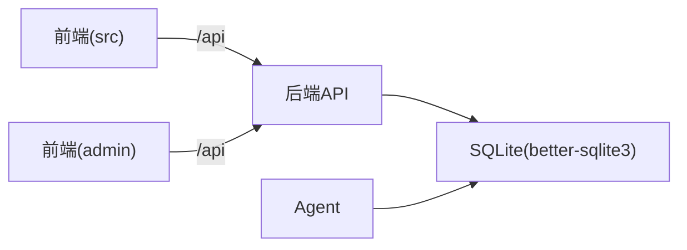

# 技术栈概览

<cite>
**本文档引用的文件**
- [package.json](file://package.json)
- [vite.config.ts](file://vite.config.ts)
- [tailwind.config.ts](file://tailwind.config.ts)
- [tsconfig.json](file://tsconfig.json)
- [tsconfig.app.json](file://tsconfig.app.json)
- [postcss.config.js](file://postcss.config.js)
- [server/index.ts](file://server/index.ts)
- [server/db.ts](file://server/db.ts)
- [server/qwen.ts](file://server/qwen.ts)
- [agent/index.ts](file://agent/index.ts)
- [agent/sources/ai.ts](file://agent/sources/ai.ts)
- [src/App.tsx](file://src/App.tsx)
- [src/main.tsx](file://src/main.tsx)
- [admin/App.tsx](file://admin/App.tsx)
- [admin/main.tsx](file://admin/main.tsx)
</cite>

## 目录
1. [引言](#引言)
2. [项目结构](#项目结构)
3. [核心组件](#核心组件)
4. [架构总览](#架构总览)
5. [详细组件分析](#详细组件分析)
6. [依赖关系分析](#依赖关系分析)
7. [性能考量](#性能考量)
8. [故障排查指南](#故障排查指南)
9. [结论](#结论)
10. [附录](#附录)

## 引言
本技术栈概览面向旅行规划Demo项目，系统梳理前后端技术选型、AI集成方式、开发工具链与部署要点。文档兼顾不同技术背景读者，既提供架构视图，也给出可操作的优化建议与升级路径。

## 项目结构
项目采用“前端单页应用 + 管理后台 + 后端API + 数据采集Agent”的多模块布局：
- 前端应用位于 src/，管理后台位于 admin/，二者共享UI组件与工具库
- 后端API位于 server/，提供REST接口与数据库访问层
- 数据采集Agent位于 agent/，负责从多数据源抓取、清洗、合并POI并写入缓存
- 构建与样式配置位于根目录的Vite、Tailwind、PostCSS与TypeScript配置中

图表来源
- [vite.config.ts:20-46](file://vite.config.ts#L20-L46)
- [tailwind.config.ts:1-139](file://tailwind.config.ts#L1-L139)
- [tsconfig.app.json:1-27](file://tsconfig.app.json#L1-L27)
- [server/index.ts:1-790](file://server/index.ts#L1-L790)
- [server/db.ts:1-513](file://server/db.ts#L1-L513)
- [agent/index.ts:1-1132](file://agent/index.ts#L1-L1132)

章节来源
- [vite.config.ts:1-46](file://vite.config.ts#L1-L46)
- [tailwind.config.ts:1-139](file://tailwind.config.ts#L1-L139)
- [tsconfig.app.json:1-27](file://tsconfig.app.json#L1-L27)

## 核心组件
- 前端技术栈
  - React 18：组件化UI与路由驱动，支持严格模式与并发特性
  - TypeScript：类型安全与工程化保障
  - Tailwind CSS：原子化样式与主题定制，配合插件增强动画与过渡
  - Vite：快速开发与构建，支持多入口与代理
- 后端技术栈
  - Express.js：轻量Web框架，提供REST API与中间件生态
  - better-sqlite3：高性能SQLite驱动，WAL模式与外键约束提升可靠性
  - Node.js：运行时环境，配合TypeScript编译
- AI集成
  - Qwen/Doubao API：通过Ark API接口生成POI推荐，带JSON修复与去重策略
  - 通义千问（DashScope）：作为补充数据源，多轮增量采集并进行去重与归一化
- 开发工具链
  - Vite：开发服务器、热更新、构建打包
  - PostCSS/Autoprefixer：自动前缀与样式管线
  - TypeScript：严格的类型检查与模块路径别名
  - 脚本命令：统一的开发、构建、启动与Agent任务入口

章节来源
- [package.json:1-59](file://package.json#L1-L59)
- [server/index.ts:1-790](file://server/index.ts#L1-L790)
- [server/db.ts:1-513](file://server/db.ts#L1-L513)
- [server/qwen.ts:1-486](file://server/qwen.ts#L1-L486)
- [agent/sources/ai.ts:1-342](file://agent/sources/ai.ts#L1-L342)

## 架构总览
整体架构分为三层：前端SPA/管理后台、后端API、SQLite数据库；Agent独立运行于后端之外，负责离线数据采集与缓存更新。

图表来源
- [server/index.ts:1-790](file://server/index.ts#L1-L790)
- [server/db.ts:1-513](file://server/db.ts#L1-L513)
- [server/qwen.ts:1-486](file://server/qwen.ts#L1-L486)
- [agent/index.ts:1-1132](file://agent/index.ts#L1-L1132)

## 详细组件分析

### 前端技术栈（React 18 + TypeScript + Tailwind CSS + Vite）
- React 18
  - 使用StrictMode与并发特性，结合上下文与路由实现页面切换
  - 主入口分别在 src/main.tsx 与 admin/main.tsx，分别挂载SPA与管理后台
- TypeScript
  - 通过 tsconfig.app.json 配置模块解析、路径别名与编译目标
  - 支持严格模式与无副作用导入，减少运行时风险
- Tailwind CSS
  - tailwind.config.ts 定义主题、颜色、圆角、阴影与动画，覆盖 src 与 admin
  - 结合 postcss.config.js 自动注入Tailwind与Autoprefixer
- Vite
  - 多入口构建：主应用与管理后台分别指向 index.html 与 admin.html
  - 代理转发：开发时将 /api 代理至本地后端服务端口
  - 别名：@ 指向 src，@admin 指向 admin

图表来源
- [vite.config.ts:36-44](file://vite.config.ts#L36-L44)
- [src/main.tsx:1-10](file://src/main.tsx#L1-L10)
- [admin/main.tsx:1-14](file://admin/main.tsx#L1-L14)
- [server/index.ts:108-144](file://server/index.ts#L108-L144)

章节来源
- [src/App.tsx:1-62](file://src/App.tsx#L1-L62)
- [admin/App.tsx:1-27](file://admin/App.tsx#L1-L27)
- [src/main.tsx:1-10](file://src/main.tsx#L1-L10)
- [admin/main.tsx:1-14](file://admin/main.tsx#L1-L14)
- [vite.config.ts:1-46](file://vite.config.ts#L1-L46)
- [tailwind.config.ts:1-139](file://tailwind.config.ts#L1-L139)
- [postcss.config.js:1-6](file://postcss.config.js#L1-L6)
- [tsconfig.app.json:1-27](file://tsconfig.app.json#L1-L27)

### 后端技术栈（Express.js + better-sqlite3 + Node.js）
- Express.js
  - 提供认证、行程、游记、评论、酒店、预订等REST接口
  - 中间件：CORS、JSON解析、静态文件与SPA回退
- better-sqlite3
  - WAL模式与外键约束，确保事务一致性与完整性
  - 表结构覆盖用户、行程、评论、验证码、酒店缓存、预订等
- Node.js
  - 通过 tsx 运行TypeScript后端文件，开发与本地启动一体化

图表来源
- [server/index.ts:108-160](file://server/index.ts#L108-L160)
- [server/index.ts:186-212](file://server/index.ts#L186-L212)
- [server/index.ts:318-410](file://server/index.ts#L318-L410)
- [server/index.ts:413-555](file://server/index.ts#L413-L555)
- [server/index.ts:558-665](file://server/index.ts#L558-L665)
- [server/db.ts:235-261](file://server/db.ts#L235-L261)
- [server/db.ts:428-454](file://server/db.ts#L428-L454)

章节来源
- [server/index.ts:1-790](file://server/index.ts#L1-L790)
- [server/db.ts:1-513](file://server/db.ts#L1-L513)

### AI集成（Qwen API + 通义千问）
- Qwen/Doubao集成
  - 逐类目顺序调用Ark API，每类目请求固定数量POI
  - JSON修复与结构提取，应对截断与嵌套差异
  - 去重合并策略，消除scenic与activity间的重复
- 通义千问（DashScope）
  - 作为补充数据源，多轮增量采集，带去重与名称归一化
  - 支持体验类目扩展字段（experienceItems）

图表来源
- [server/qwen.ts:361-485](file://server/qwen.ts#L361-L485)
- [server/index.ts:108-160](file://server/index.ts#L108-L160)
- [server/db.ts:253-261](file://server/db.ts#L253-L261)

章节来源
- [server/qwen.ts:1-486](file://server/qwen.ts#L1-L486)
- [agent/sources/ai.ts:1-342](file://agent/sources/ai.ts#L1-L342)

### 数据采集Agent（独立CLI）
- 多源采集：OSM、Foursquare、Google、高德、AI、Spark、豆包
- 并发控制与重试：按优先级选择城市，限制并发，失败重试
- 合并与去重：合并去重、质量评估、清洗与写库
- 增量刷新：根据数据新鲜度与策略决定全量或增量

图表来源
- [agent/index.ts:285-366](file://agent/index.ts#L285-L366)
- [agent/index.ts:212-281](file://agent/index.ts#L212-L281)
- [agent/index.ts:655-800](file://agent/index.ts#L655-L800)

章节来源
- [agent/index.ts:1-1132](file://agent/index.ts#L1-L1132)

### 开发工具链
- 构建与脚本
  - Vite：开发、预览、多入口构建
  - 脚本命令：dev、build、server、agent:*、admin:dev
- 类型与样式
  - TypeScript：严格模式、路径别名、ESNext模块解析
  - Tailwind：主题扩展、动画、暗色模式、插件
  - PostCSS：自动前缀与Tailwind注入

章节来源
- [package.json:6-25](file://package.json#L6-L25)
- [tsconfig.json:1-6](file://tsconfig.json#L1-L6)
- [tsconfig.app.json:1-27](file://tsconfig.app.json#L1-L27)
- [postcss.config.js:1-6](file://postcss.config.js#L1-L6)

## 依赖关系分析
- 前端对后端的依赖
  - 前端通过 /api 前缀调用后端REST接口，开发时由Vite代理转发
- 后端对数据库的依赖
  - 所有业务表通过better-sqlite3访问，WAL与外键保证一致性
- Agent对后端的依赖
  - Agent直接写库，不依赖后端API；后端POI缓存来源于Agent写入

图表来源
- [vite.config.ts:36-44](file://vite.config.ts#L36-L44)
- [server/index.ts:1-790](file://server/index.ts#L1-L790)
- [server/db.ts:1-513](file://server/db.ts#L1-L513)
- [agent/index.ts:1-1132](file://agent/index.ts#L1-L1132)

章节来源
- [vite.config.ts:1-46](file://vite.config.ts#L1-L46)
- [server/index.ts:1-790](file://server/index.ts#L1-L790)
- [server/db.ts:1-513](file://server/db.ts#L1-L513)
- [agent/index.ts:1-1132](file://agent/index.ts#L1-L1132)

## 性能考量
- 前端
  - Vite多入口与按需构建，减少首屏体积
  - Tailwind原子类减少自定义样式开销，主题变量集中管理
- 后端
  - SQLite WAL模式提升并发写入能力；外键约束保证数据一致性
  - POI/酒店缓存策略：命中即返回，过期异步刷新，避免Nginx超时
- AI集成
  - 分类逐调用，带超时与限流；JSON修复与去重降低无效流量
- Agent
  - 并发与重试策略平衡吞吐与稳定性；增量刷新减少全量成本

## 故障排查指南
- 常见问题定位
  - API密钥缺失：后端健康检查返回密钥状态；POI/酒店接口在未配置密钥时返回明确错误
  - 缓存异常：检查缓存年龄与刷新标志；必要时强制刷新
  - 数据库路径：根据环境变量与部署位置确定DB_DIR与DB_PATH
- 日志与可观测性
  - 后端打印关键事件（采集、去重、刷新、错误）
  - Agent输出采集统计、质量报告与待确认更新
- 建议排查步骤
  - 确认 .env.local 配置与密钥可用
  - 查看后端启动日志与数据库路径
  - 使用Agent status/quality命令检查覆盖率与质量分布

章节来源
- [server/index.ts:755-757](file://server/index.ts#L755-L757)
- [server/index.ts:128-131](file://server/index.ts#L128-L131)
- [server/db.ts:18-27](file://server/db.ts#L18-L27)
- [agent/index.ts:538-639](file://agent/index.ts#L538-L639)

## 结论
本项目以React 18 + TypeScript + Tailwind + Vite构建现代化前端，以Express + better-sqlite3提供稳定后端，结合Qwen/DashScope实现智能POI推荐，并通过Agent实现离线数据治理。整体架构清晰、边界明确，具备良好的可维护性与扩展性。

## 附录

### 技术选型与替代方案对比
- 前端
  - React 18 vs Vue 3：React生态成熟、TypeScript支持完善；Vue在模板与组合式API上各有优势
  - Vite vs Webpack：Vite冷启更快、热更新更优；Webpack生态更广
  - Tailwind vs Ant Design：Tailwind原子类与主题定制灵活；Ant Design组件丰富但体积较大
- 后端
  - Express vs Koa/NestJS：Express简单易用；NestJS提供架构分层与依赖注入
  - better-sqlite3 vs PostgreSQL：SQLite轻量、部署简单；PostgreSQL功能更强、并发更好
- AI集成
  - Doubao/Qwen vs Gemini/OpenAI：模型适配与成本差异；本项目采用Ark兼容接口
  - DashScope vs 其他大模型：按需选择，本项目用于补充数据源

### 版本兼容性与升级路径
- Node.js与Vite
  - 保持与当前版本兼容，逐步升级Vite以获得更好的ESM与构建性能
- React与TypeScript
  - 逐步迁移至更高版本TS与React特性，关注严格模式变更
- Express与better-sqlite3
  - 关注Express新特性与安全补丁；SQLite驱动按需升级
- Tailwind
  - 按官方发布节奏升级，注意新版本对插件与配置的影响

### 学习资源与参考资料
- React 18官方文档与TypeScript手册
- Vite官方指南与插件生态
- Express中间件与路由最佳实践
- better-sqlite3文档与WAL模式说明
- Tailwind原子类与主题定制指南
- 通义千问与Doubao API对接文档