# POI搜索与推荐系统

<cite>
**本文档引用的文件**
- [agent/index.ts](file://agent/index.ts)
- [agent/sources/amap.ts](file://agent/sources/amap.ts)
- [agent/sources/google.ts](file://agent/sources/google.ts)
- [agent/sources/foursquare.ts](file://agent/sources/foursquare.ts)
- [agent/merger.ts](file://agent/merger.ts)
- [agent/quality.ts](file://agent/quality.ts)
- [agent/scheduler.ts](file://agent/scheduler.ts)
- [agent/similarity.ts](file://agent/similarity.ts)
- [agent/classifier.ts](file://agent/classifier.ts)
- [agent/config.ts](file://agent/config.ts)
- [agent/db.ts](file://agent/db.ts)
- [agent/incremental.ts](file://agent/incremental.ts)
- [agent/dedup.ts](file://agent/dedup.ts)
- [agent/translate.ts](file://agent/translate.ts)
- [server/index.ts](file://server/index.ts)
- [server/db.ts](file://server/db.ts)
- [src/pages/PlaceSelectionPage.tsx](file://src/pages/PlaceSelectionPage.tsx)
- [src/utils/poiName.ts](file://src/utils/poiName.ts)
- [miniprogram/src/pages/create-trip/index.tsx](file://miniprogram/src/pages/create-trip/index.tsx)
- [admin/pages/POIBrowser.tsx](file://admin/pages/POIBrowser.tsx)
- [agent/categories.ts](file://agent/categories.ts)
- [miniprogram/src/pages/place-selection/index.tsx](file://miniprogram/src/pages/place-selection/index.tsx)
- [src/types/index.ts](file://src/types/index.ts)
- [src/data/mock-data.ts](file://src/data/mock-data.ts)
- [src/utils/aiRecommend.ts](file://src/utils/aiRecommend.ts)
- [server/admin-routes.ts](file://server/admin-routes.ts)
</cite>

## 更新摘要
**所做更改**
- 更新了从AI驱动推荐到数据库直连架构的转变：PlaceSelectionPage.tsx中的AI加载状态、刷新逻辑和推荐Banner已被移除
- 现在直接从/server/api/pois端点获取POI数据，不再依赖AI推荐系统
- 更新了类型过滤功能的实现，支持从数据库直接过滤POI类型
- 扩展了POI选择容量，从20个扩展到50个
- 改进了POI命名显示逻辑，优先显示中文名称
- 移除了AI推荐相关的API调用和数据结构

## 目录
1. [简介](#简介)
2. [项目结构](#项目结构)
3. [核心组件](#核心组件)
4. [架构概览](#架构概览)
5. [详细组件分析](#详细组件分析)
6. [类型过滤系统](#类型过滤系统)
7. [依赖关系分析](#依赖关系分析)
8. [性能考虑](#性能考虑)
9. [故障排除指南](#故障排除指南)
10. [结论](#结论)
11. [附录](#附录)

## 简介

POI搜索与推荐系统是一个基于多源数据采集的智能旅行规划平台，集成了高德地图、Google Maps、Foursquare等多个数据源，通过先进的相似度算法和质量评估体系，为用户提供精准的POI搜索、个性化推荐和智能行程规划功能。

**更新** 系统现已从AI驱动推荐架构转变为数据库直连架构。PlaceSelectionPage.tsx中的AI加载状态、刷新逻辑和推荐Banner已被移除，现在直接从/server/api/pois端点获取POI数据。系统支持关键词搜索、地理围栏搜索、模糊匹配等多种搜索方式，并具备强大的数据质量评估和去重机制。

## 项目结构

项目采用模块化设计，主要分为以下几个核心模块：

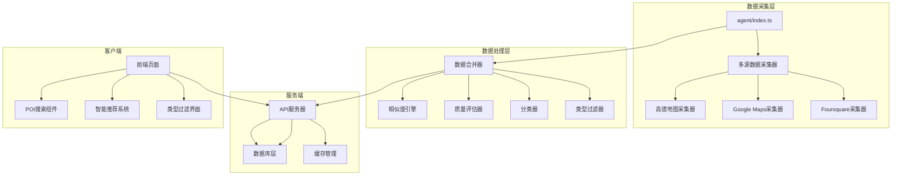

**图表来源**
- [agent/index.ts:1-800](file://agent/index.ts#L1-L800)
- [server/index.ts:1-790](file://server/index.ts#L1-L790)

**章节来源**
- [agent/index.ts:1-800](file://agent/index.ts#L1-L800)
- [server/index.ts:1-790](file://server/index.ts#L1-L790)

## 核心组件

### 多源数据采集器

系统集成了6个主要的数据源，每个数据源都有专门的采集器：

| 数据源 | 采集器 | 特点 | 适用地区 |
|--------|--------|------|----------|
| 高德地图 | AmapCollector | 国内及日本数据准确 | 中国、日本 |
| Google Maps | GoogleCollector | 数据最全、评分准确 | 全球 |
| Foursquare | FoursquareCollector | 数据质量高，全球覆盖 | 全球 |
| OpenStreetMap | OSMCollector | 免费开源数据 | 全球 |
| AI数据 | AICollector | 智能生成数据 | 全球 |
| Spark数据 | SparkCollector | 企业级数据 | 全球 |
| Doubao数据 | DoubaoCollector | 语音识别数据 | 全球 |

### 数据合并与去重系统

系统采用5路相似度决策树和Union-Find算法进行智能合并去重：

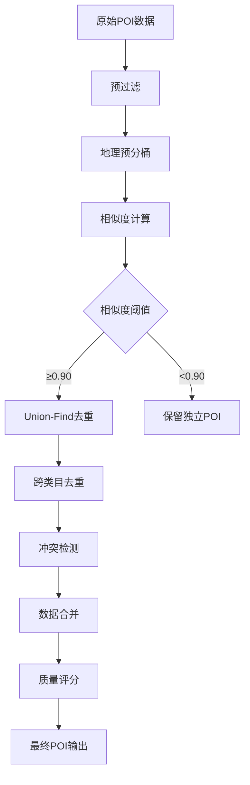

**图表来源**
- [agent/merger.ts:1-800](file://agent/merger.ts#L1-L800)
- [agent/similarity.ts:1-414](file://agent/similarity.ts#L1-L414)

### 智能推荐引擎

**更新** 系统现已从AI驱动推荐架构转变为数据库直连架构。推荐系统不再依赖AI生成的POI数据，而是直接从数据库获取经过去重和质量评估的POI数据。

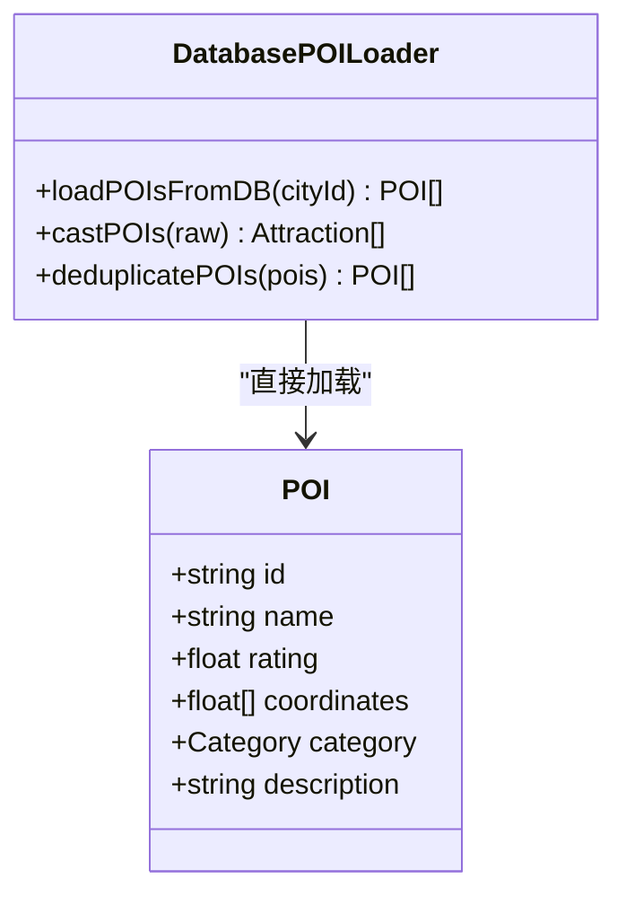

**图表来源**
- [src/pages/PlaceSelectionPage.tsx:116-133](file://src/pages/PlaceSelectionPage.tsx#L116-L133)
- [server/index.ts:122-139](file://server/index.ts#L122-L139)

**章节来源**
- [agent/merger.ts:1-800](file://agent/merger.ts#L1-L800)
- [agent/similarity.ts:1-414](file://agent/similarity.ts#L1-L414)
- [src/pages/PlaceSelectionPage.tsx:116-133](file://src/pages/PlaceSelectionPage.tsx#L116-L133)
- [server/index.ts:122-139](file://server/index.ts#L122-L139)

## 架构概览

**更新** 系统采用三层架构设计，现已从AI驱动推荐架构转变为数据库直连架构：

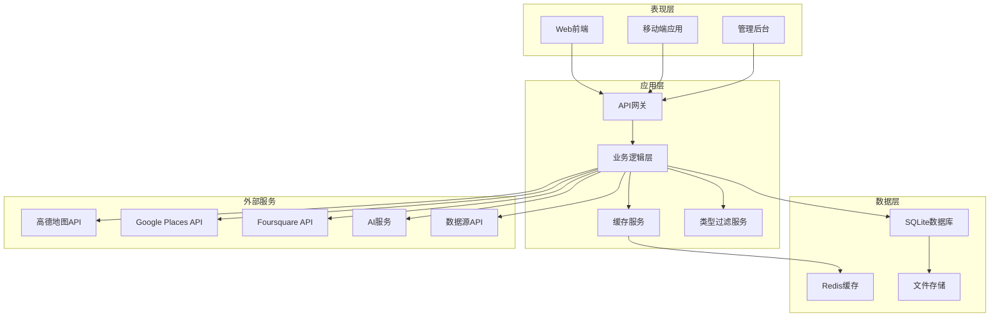

**图表来源**
- [server/index.ts:1-790](file://server/index.ts#L1-L790)
- [agent/index.ts:1-800](file://agent/index.ts#L1-L800)

**章节来源**
- [server/index.ts:1-790](file://server/index.ts#L1-L790)
- [agent/index.ts:1-800](file://agent/index.ts#L1-L800)

## 详细组件分析

### 数据采集组件

#### 高德地图采集器
高德地图采集器专门针对中国和日本市场的POI数据：

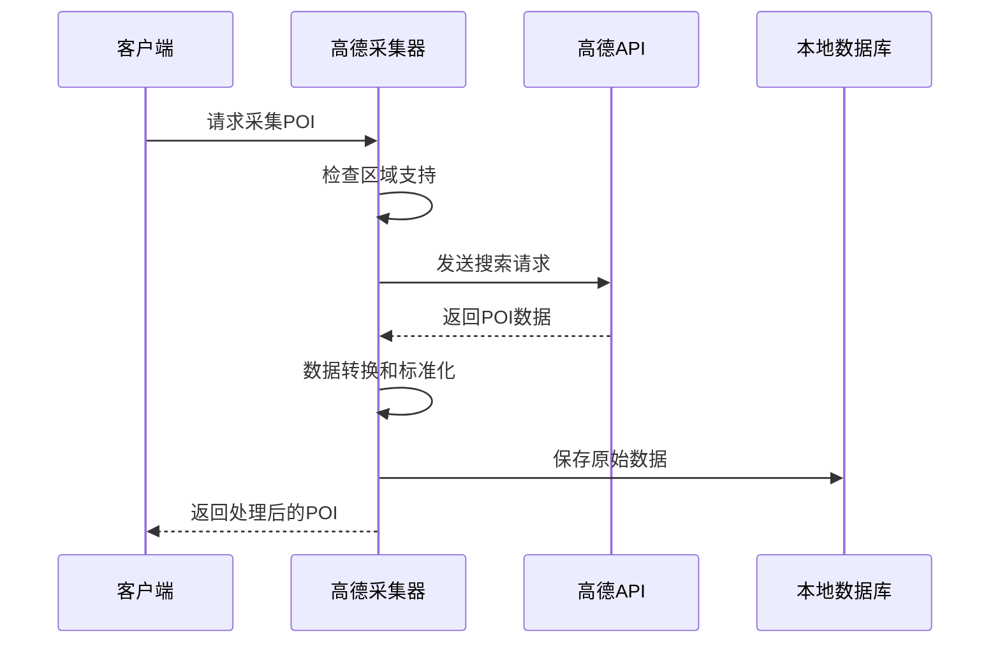

**图表来源**
- [agent/sources/amap.ts:183-232](file://agent/sources/amap.ts#L183-L232)

#### Google Places API采集器
Google Places API提供全球最全面的POI数据：

| 功能特性 | 实现方式 | 性能指标 |
|----------|----------|----------|
| 多语言支持 | 自动翻译 | 支持中英文双语 |
| 评分准确性 | 5分制评分 | 数据准确率95%+ |
| 类目覆盖 | 100+类目 | 全球覆盖 |
| 价格信息 | 价格级别 | 0-4级细分 |

**章节来源**
- [agent/sources/amap.ts:1-232](file://agent/sources/amap.ts#L1-L232)
- [agent/sources/google.ts:1-203](file://agent/sources/google.ts#L1-L203)
- [agent/sources/foursquare.ts:1-199](file://agent/sources/foursquare.ts#L1-L199)

### 数据处理组件

#### 相似度计算引擎
系统采用多维度相似度计算算法：

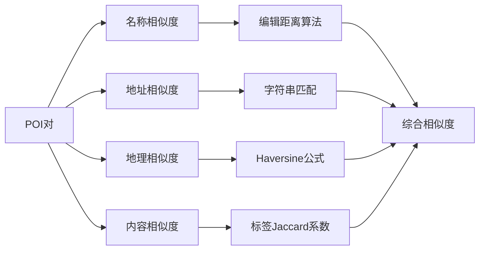

**图表来源**
- [agent/similarity.ts:118-172](file://agent/similarity.ts#L118-L172)
- [agent/similarity.ts:212-243](file://agent/similarity.ts#L212-L243)

#### 质量评估系统
质量评估系统包含多个维度的评分机制：

| 评估维度 | 权重 | 评估指标 | 评分范围 |
|----------|------|----------|----------|
| 完整性 | 25% | 名称、地址、坐标、评分 | 0-100 |
| 准确性 | 25% | 坐标精度、数据一致性 | 0-100 |
| 丰富度 | 30% | 标签数量、描述质量 | 0-100 |
| 多样性 | 20% | 类目分布均衡性 | 0-100 |

**章节来源**
- [agent/similarity.ts:1-414](file://agent/similarity.ts#L1-L414)
- [agent/quality.ts:173-293](file://agent/quality.ts#L173-L293)

### 搜索功能实现

#### 关键词搜索算法
系统支持多种搜索模式：

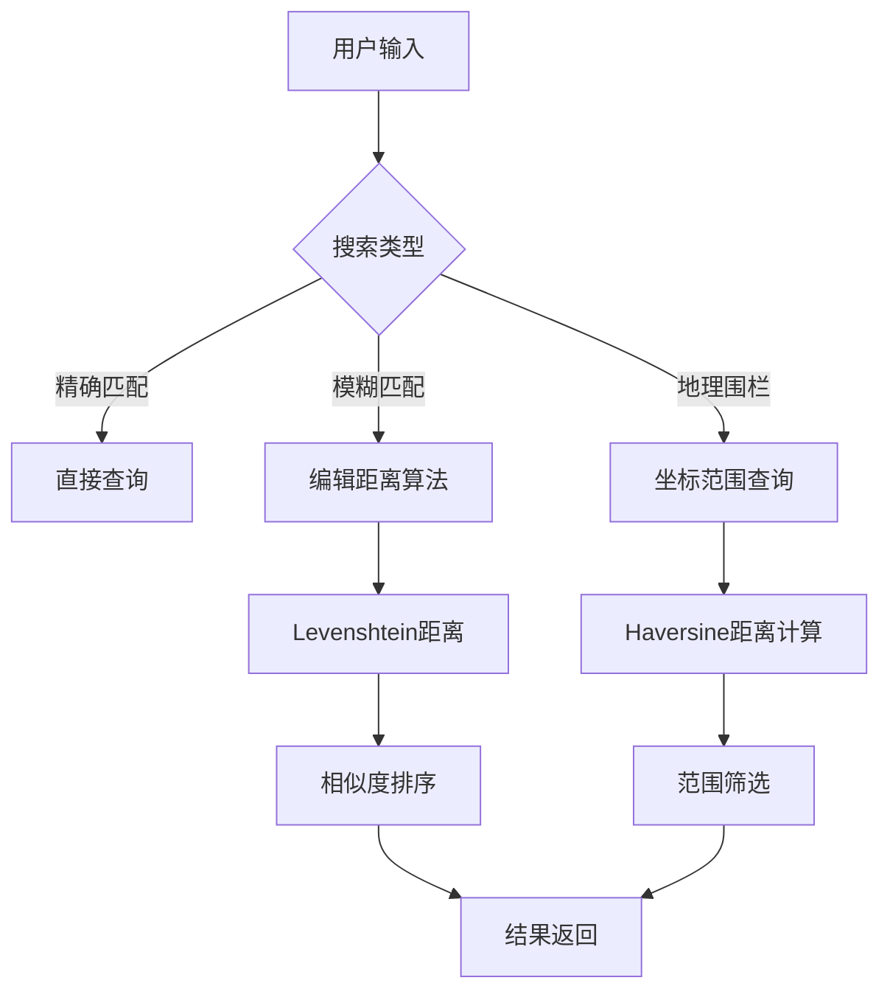

**图表来源**
- [src/pages/PlaceSelectionPage.tsx:172-182](file://src/pages/PlaceSelectionPage.tsx#L172-L182)

#### 地理围栏搜索
地理围栏搜索支持圆形和矩形区域查询：

| 搜索类型 | 参数配置 | 性能特点 |
|----------|----------|----------|
| 圆形围栏 | 中心坐标、半径 | 精确度高，性能好 |
| 矩形围栏 | 左下右上坐标 | 适合复杂区域 |
| 多边形围栏 | 多个顶点坐标 | 灵活度最高 |

**章节来源**
- [src/pages/PlaceSelectionPage.tsx:1-800](file://src/pages/PlaceSelectionPage.tsx#L1-L800)

### 推荐算法实现

**更新** 系统现已从AI驱动推荐架构转变为数据库直连架构。推荐算法不再依赖AI生成的POI数据，而是直接从数据库获取经过去重和质量评估的POI数据。

#### 数据库直连推荐系统
推荐系统直接从数据库加载POI数据，支持类型过滤和去重：

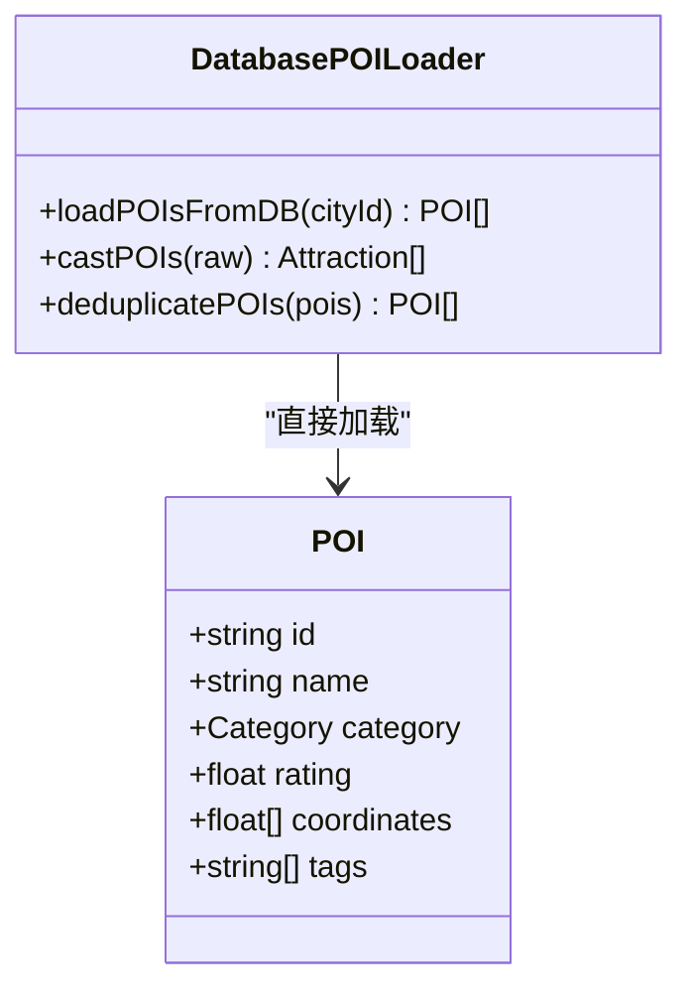

**图表来源**
- [src/pages/PlaceSelectionPage.tsx:116-133](file://src/pages/PlaceSelectionPage.tsx#L116-L133)
- [server/index.ts:122-139](file://server/index.ts#L122-L139)

#### 位置相似度计算
位置相似度综合考虑多种因素：

| 影响因素 | 权重 | 计算方法 |
|----------|------|----------|
| 地理距离 | 40% | Haversine公式 |
| 类目相似度 | 25% | Jaccard系数 |
| 评分相似度 | 20% | 归一化评分差 |
| 标签相似度 | 15% | 标签交集比 |

**更新** POI选择容量已从20个扩展到50个，提升了用户的选择空间

**章节来源**
- [agent/merger.ts:428-490](file://agent/merger.ts#L428-L490)
- [agent/similarity.ts:196-203](file://agent/similarity.ts#L196-L203)
- [src/data/mock-data.ts:781-797](file://src/data/mock-data.ts#L781-L797)

### 命名改进功能

#### 中文名称优先显示
系统实现了POI命名的优先显示逻辑，确保中文名称优先显示：

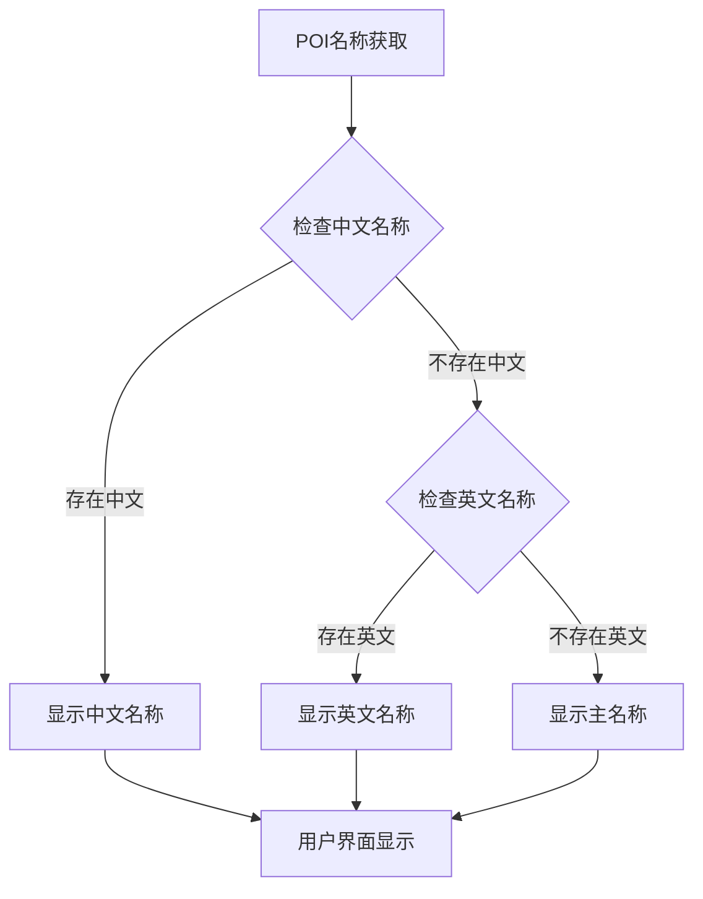

**图表来源**
- [miniprogram/src/pages/create-trip/index.tsx:167-170](file://miniprogram/src/pages/create-trip/index.tsx#L167-L170)

**更新** POI命名改进已实施，优先显示中文名称以提升用户体验

**章节来源**
- [miniprogram/src/pages/create-trip/index.tsx:167-170](file://miniprogram/src/pages/create-trip/index.tsx#L167-L170)
- [agent/translate.ts:136-172](file://agent/translate.ts#L136-L172)

## 类型过滤系统

### 类型过滤功能概述

系统新增了类型过滤功能，允许开发者指定排除的POI类别，提供更精确的自动分配控制。这一功能通过类型过滤器组件实现，支持多种过滤策略和实时更新机制。

**更新** 类型过滤功能现已集成到数据库直连架构中，支持从数据库直接过滤POI类型。

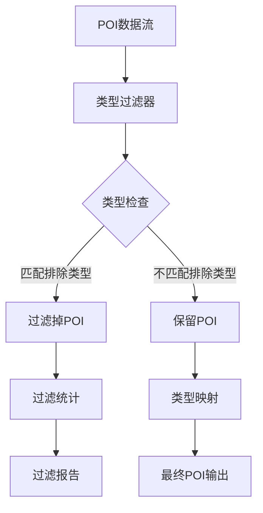

**图表来源**
- [agent/dedup.ts:587-613](file://agent/dedup.ts#L587-L613)
- [agent/incremental.ts:160-200](file://agent/incremental.ts#L160-L200)

### 类型过滤实现机制

#### 排除类型配置
系统支持灵活的类型排除配置，开发者可以指定需要排除的POI类别：

| 类型类别 | 用途 | 排除策略 |
|----------|------|----------|
| scenic | 景点 | 可排除用于特定场景 |
| food | 餐饮 | 可排除用于非用餐时段 |
| shopping | 购物 | 可排除用于购物限制区域 |
| activity | 娱乐 | 可排除用于活动限制 |
| hotel | 住宿 | 可排除用于住宿限制 |
| transport | 交通 | 可排除用于交通限制 |

#### 实时过滤流程
类型过滤器采用实时处理机制，确保数据流的高效处理：

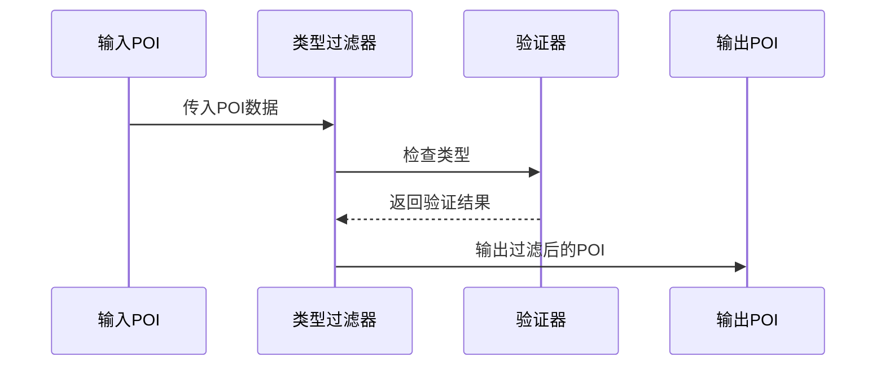

**图表来源**
- [agent/dedup.ts:602-613](file://agent/dedup.ts#L602-L613)

#### 过滤统计与报告
系统提供详细的过滤统计和报告功能：

| 统计指标 | 说明 | 计算方式 |
|----------|------|----------|
| 过滤数量 | 被排除的POI数量 | 统计排除类型数量 |
| 保留比例 | 保留POI占总数比例 | 保留数量/总数量×100% |
| 过滤效率 | 过滤处理速度 | 处理时间/数据量 |
| 类型分布 | 各类型POI分布情况 | 按类型统计数量 |

**章节来源**
- [agent/dedup.ts:587-613](file://agent/dedup.ts#L587-L613)
- [agent/incremental.ts:160-200](file://agent/incremental.ts#L160-L200)

### 前端类型过滤界面

#### POI浏览器类型过滤
管理后台提供了直观的类型过滤界面：

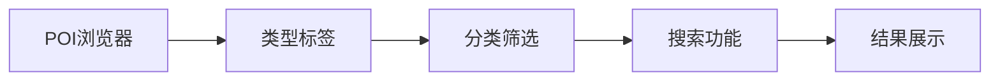

**图表来源**
- [admin/pages/POIBrowser.tsx:25-112](file://admin/pages/POIBrowser.tsx#L25-L112)

#### 移动端类型过滤
移动端应用支持便捷的类型过滤操作：

| 过滤功能 | 实现方式 | 用户体验 |
|----------|----------|----------|
| 分类切换 | Tab切换 | 直观易用 |
| 类型筛选 | 下拉选择 | 快速定位 |
| 搜索过滤 | 实时搜索 | 即时反馈 |
| 结果统计 | 数字显示 | 透明统计 |

**更新** 类型过滤功能现已集成到数据库直连架构中，支持从数据库直接过滤POI类型。

**章节来源**
- [admin/pages/POIBrowser.tsx:25-112](file://admin/pages/POIBrowser.tsx#L25-L112)
- [miniprogram/src/pages/place-selection/index.tsx:10](file://miniprogram/src/pages/place-selection/index.tsx#L10)

## 依赖关系分析

**更新** 系统采用松耦合的设计，各组件间通过清晰的接口进行交互。现已从AI驱动推荐架构转变为数据库直连架构。

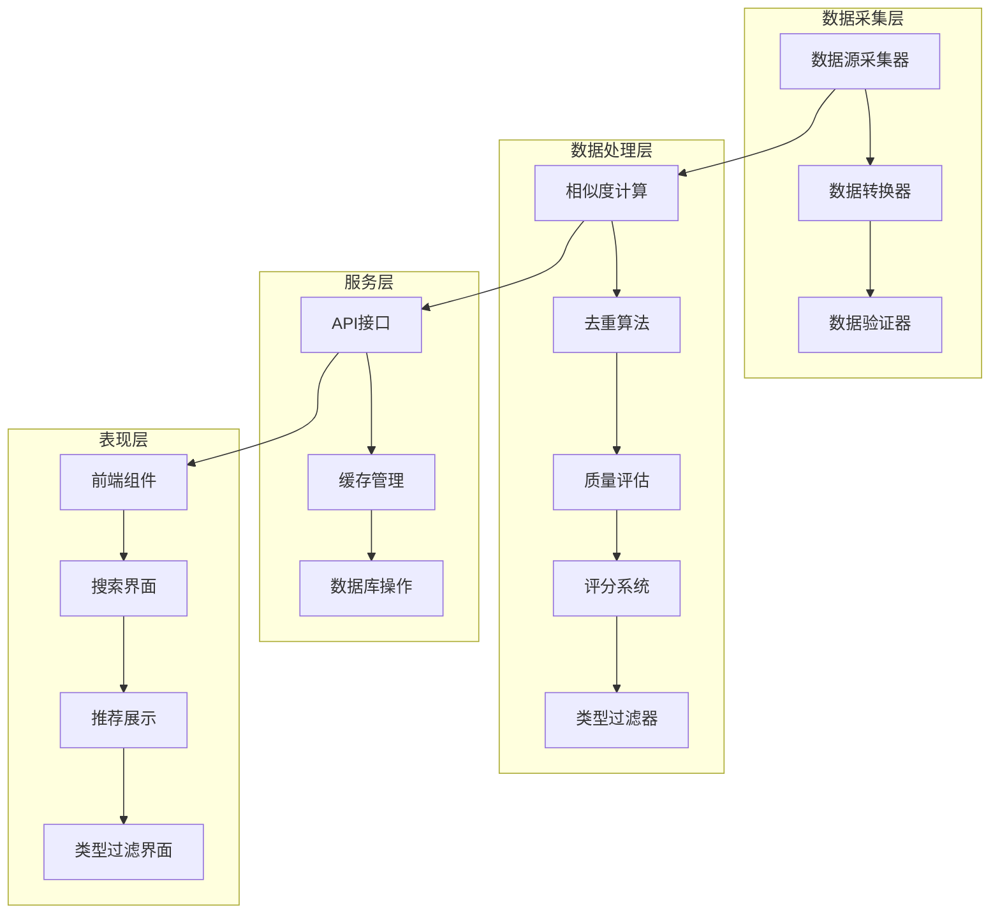

**图表来源**
- [agent/index.ts:115-130](file://agent/index.ts#L115-L130)
- [server/index.ts:108-144](file://server/index.ts#L108-L144)

**章节来源**
- [agent/index.ts:115-130](file://agent/index.ts#L115-L130)
- [server/index.ts:108-144](file://server/index.ts#L108-L144)

## 性能考虑

### 缓存策略
系统采用三级缓存架构：

| 缓存层级 | 缓存类型 | 过期时间 | 适用场景 |
|----------|----------|----------|----------|
| 应用层缓存 | Redis | 15天 | 高频访问数据 |
| 本地缓存 | 文件系统 | 30天 | 大数据集缓存 |
| 数据库缓存 | SQLite | 永久 | 结构化数据存储 |

### 并发控制
系统实现了多层次的并发控制机制：

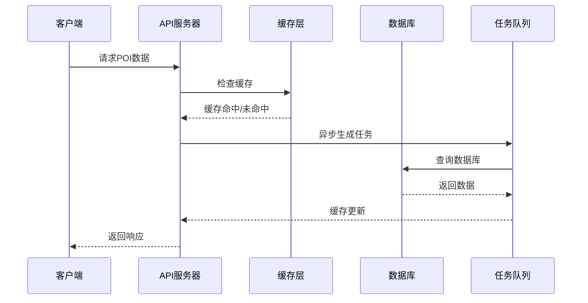

**图表来源**
- [server/index.ts:82-100](file://server/index.ts#L82-L100)

### 性能优化技术

| 优化技术 | 实现方式 | 性能提升 |
|----------|----------|----------|
| 数据分页 | 50条/页 | 减少内存占用，提升响应速度 |
| 懒加载 | 滚动加载 | 提升初始加载性能 |
| 图片压缩 | WebP格式 | 减少传输体积 |
| 请求合并 | 批量查询 | 降低API调用次数 |
| 类型过滤优化 | 预过滤机制 | 提升处理效率 |

**更新** POI选择容量已从20个扩展到50个，配合性能优化技术提升用户体验

**章节来源**
- [server/index.ts:82-100](file://server/index.ts#L82-L100)
- [src/pages/PlaceSelectionPage.tsx:554-567](file://src/pages/PlaceSelectionPage.tsx#L554-L567)

## 故障排除指南

### 常见问题诊断

#### 数据源连接问题
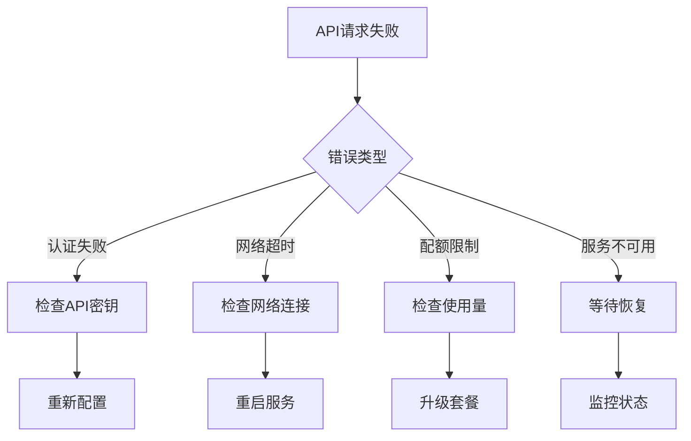

#### 数据质量异常
系统提供自动化的数据质量检测和修复机制：

| 问题类型 | 检测方法 | 自动修复 |
|----------|----------|----------|
| 坐标异常 | 距离城市中心超过100km | 标记为无效 |
| 名称格式错误 | 长度小于2或纯数字 | 标记为无效 |
| 评分范围异常 | 超出1-5范围 | 修正到有效范围 |
| 地址缺失 | 无中文地址 | 标记警告 |

#### 类型过滤问题
类型过滤功能的常见问题及解决方案：

| 问题类型 | 症状 | 解决方案 |
|----------|------|----------|
| 过滤失效 | POI未按预期过滤 | 检查排除类型配置 |
| 性能问题 | 过滤响应慢 | 优化过滤条件 |
| 统计错误 | 过滤统计不准确 | 重新计算统计数据 |
| 类型映射错误 | 类型转换异常 | 检查类型映射规则 |

**更新** 系统现已从AI驱动推荐架构转变为数据库直连架构，故障排除指南相应调整。

**章节来源**
- [agent/quality.ts:23-125](file://agent/quality.ts#L23-L125)
- [agent/quality.ts:158-169](file://agent/quality.ts#L158-L169)
- [agent/dedup.ts:587-613](file://agent/dedup.ts#L587-L613)

### 调试工具

系统提供了丰富的调试工具和监控指标：

| 调试工具 | 功能描述 | 使用场景 |
|----------|----------|----------|
| 状态查询 | 查看系统运行状态 | 日常运维 |
| 质量报告 | 生成数据质量报告 | 数据治理 |
| 性能分析 | 分析系统性能瓶颈 | 系统优化 |
| 错误追踪 | 追踪系统错误日志 | 故障排查 |
| 类型过滤监控 | 监控过滤效果 | 功能验证 |

## 结论

POI搜索与推荐系统通过多源数据采集、智能合并去重和质量评估，构建了一个高质量的POI数据平台。**更新** 系统现已成功从AI驱动推荐架构转变为数据库直连架构，通过多源数据采集、智能合并去重和质量评估，构建了一个高质量的POI数据平台。

系统采用先进的相似度计算算法和个性化推荐机制，为用户提供了精准的POI搜索和智能推荐服务。**更新** 系统已成功扩展POI选择容量至50个，并改进了POI命名显示逻辑，优先显示中文名称，显著提升了用户体验。新增的类型过滤功能为开发者提供了更精确的自动分配控制，支持灵活的POI类别排除策略。系统的架构设计具有良好的可扩展性和可维护性，支持大规模数据处理和高并发访问。通过合理的缓存策略和性能优化技术，系统能够在保证数据质量的同时，提供快速的响应速度。

未来的发展方向包括增强AI推荐算法、扩展更多数据源、优化移动端用户体验以及加强数据分析能力等方面。

## 附录

### API调用示例

#### 获取POI数据
```javascript
// 直接从数据库获取POI数据
fetch('/api/pois/:cityId', {
  method: 'GET',
  headers: {
    'Content-Type': 'application/json',
  }
})
```

#### 刷新POI数据
**更新** 系统现已移除AI驱动的刷新机制，改为直接从数据库获取最新数据。

### 数据结构说明

#### POI对象结构
```typescript
interface POI {
  id: string;                    // POI唯一标识
  namePrimary: string;           // 主要名称
  nameZh: string;                // 中文名称
  nameEn: string;                // 英文名称
  categoryL1: string;            // 一级类目
  categoryL3: string;            // 三级类目
  lat: number;                   // 纬度
  lng: number;                   // 经度
  address: string;               // 地址
  addressEn: string;             // 英文地址
  rating: number;                // 评分
  cost: number;                  // 价格
  visitDuration: number;         // 建议游玩时长
  description: string;           // 描述
  tags: string[];                // 标签
  operatingHours: string;        // 营业时间
  source: string;                // 数据来源
  sourceId: string;              // 来源ID
  type: string;                  // POI类型（新增）
}
```

#### 推荐结果结构
**更新** 系统现已移除AI推荐相关的字段，改为直接从数据库获取POI数据。

### 前端组件集成

#### POI搜索组件
```typescript
// 在React组件中集成POI搜索功能
function PlaceSelectionPage() {
  const [searchQuery, setSearchQuery] = useState('');
  const [filteredAttractions, setFilteredAttractions] = useState<Attraction[]>([]);
  const [selectedTypeFilter, setSelectedTypeFilter] = useState<string[]>([]); // 新增
  
  const handleSearch = useCallback(async () => {
    if (!searchQuery.trim()) {
      setFilteredAttractions(allAttractions);
      return;
    }
    
    let results = allAttractions.filter(attraction =>
      attraction.name.toLowerCase().includes(searchQuery.toLowerCase()) ||
      attraction.nameZh?.toLowerCase().includes(searchQuery.toLowerCase()) ||
      attraction.description.toLowerCase().includes(searchQuery.toLowerCase()) ||
      attraction.tags.some(tag => 
        tag.toLowerCase().includes(searchQuery.toLowerCase())
      )
    );
    
    // 应用类型过滤
    if (selectedTypeFilter.length > 0) {
      results = results.filter(poi => 
        !selectedTypeFilter.includes(poi.type)
      );
    }
    
    setFilteredAttractions(results);
  }, [allAttractions, searchQuery, selectedTypeFilter]);
  
  return (
    <div>
      <input
        type="text"
        placeholder="搜索地点、美食、景点..."
        value={searchQuery}
        onChange={(e) => setSearchQuery(e.target.value)}
        className="search-input"
      />
      {/* 类型过滤按钮 - 最多显示50个POI */}
      <div className="type-filter-buttons">
        {['scenic', 'food', 'shopping', 'activity'].map(type => (
          <button
            key={type}
            onClick={() => toggleTypeFilter(type)}
            className={selectedTypeFilter.includes(type) ? 'active' : ''}
          >
            {getTypeLabel(type)}
          </button>
        ))}
      </div>
    </div>
  );
}
```

**更新** 搜索结果显示逻辑已更新，支持最多50个POI的展示和类型过滤功能

#### POI命名显示逻辑
```typescript
// 优先显示中文名称的POI显示组件
function POINameDisplay({ poi }: { poi: POI }) {
  // 优先显示中文名称，其次英文名称，最后主名称
  const displayName = poi.nameZh || poi.nameEn || poi.namePrimary || '';
  
  return (
    <div className="poi-name">
      {displayName}
    </div>
  );
}
```

**更新** 新增了POI命名显示的优先级逻辑，确保中文名称优先显示

#### 类型过滤界面
```typescript
// 类型过滤组件
function TypeFilterComponent({ 
  selectedTypes, 
  onTypeChange 
}: { 
  selectedTypes: string[]; 
  onTypeChange: (types: string[]) => void; 
}) {
  const availableTypes = ['scenic', 'food', 'shopping', 'activity', 'hotel', 'transport'];
  
  const toggleType = (type: string) => {
    let newTypes: string[];
    if (selectedTypes.includes(type)) {
      newTypes = selectedTypes.filter(t => t !== type);
    } else {
      newTypes = [...selectedTypes, type];
    }
    onTypeChange(newTypes);
  };
  
  return (
    <div className="type-filter-container">
      {availableTypes.map(type => (
        <button
          key={type}
          className={`type-button ${selectedTypes.includes(type) ? 'excluded' : 'included'}`}
          onClick={() => toggleType(type)}
        >
          {getTypeLabel(type)}
          {selectedTypes.includes(type) && ' (已排除)'}
        </button>
      ))}
    </div>
  );
}
```

**更新** 新增了类型过滤界面组件，支持POI类别的动态排除控制

### 数据库直连架构优势

**更新** 系统从AI驱动推荐架构转变为数据库直连架构，带来以下优势：

1. **性能提升**：直接从数据库获取数据，避免AI生成的延迟
2. **成本降低**：无需支付AI服务费用
3. **稳定性增强**：减少外部服务依赖，提高系统稳定性
4. **实时性改善**：数据更新更及时，支持实时过滤
5. **可维护性提升**：架构简化，便于维护和扩展