# POI搜索与推荐系统

<cite>
**本文档引用的文件**
- [agent/index.ts](file://agent/index.ts)
- [agent/sources/amap.ts](file://agent/sources/amap.ts)
- [agent/sources/google.ts](file://agent/sources/google.ts)
- [agent/sources/foursquare.ts](file://agent/sources/foursquare.ts)
- [agent/merger.ts](file://agent/merger.ts)
- [agent/quality.ts](file://agent/quality.ts)
- [agent/scheduler.ts](file://agent/scheduler.ts)
- [agent/similarity.ts](file://agent/similarity.ts)
- [agent/classifier.ts](file://agent/classifier.ts)
- [agent/config.ts](file://agent/config.ts)
- [agent/db.ts](file://agent/db.ts)
- [server/index.ts](file://server/index.ts)
- [server/db.ts](file://server/db.ts)
- [src/pages/PlaceSelectionPage.tsx](file://src/pages/PlaceSelectionPage.tsx)
- [src/utils/poiName.ts](file://src/utils/poiName.ts)
</cite>

## 目录
1. [简介](#简介)
2. [项目结构](#项目结构)
3. [核心组件](#核心组件)
4. [架构概览](#架构概览)
5. [详细组件分析](#详细组件分析)
6. [依赖关系分析](#依赖关系分析)
7. [性能考虑](#性能考虑)
8. [故障排除指南](#故障排除指南)
9. [结论](#结论)
10. [附录](#附录)

## 简介

POI搜索与推荐系统是一个基于多源数据采集的智能旅行规划平台，集成了高德地图、Google Maps、Foursquare等多个数据源，通过先进的相似度算法和质量评估体系，为用户提供精准的POI搜索、个性化推荐和智能行程规划功能。

该系统采用前后端分离架构，后端负责多源数据采集、合并去重和质量控制，前端提供直观的POI搜索界面和智能推荐功能。系统支持关键词搜索、地理围栏搜索、模糊匹配等多种搜索方式，并具备强大的数据质量评估和去重机制。

## 项目结构

项目采用模块化设计，主要分为以下几个核心模块：

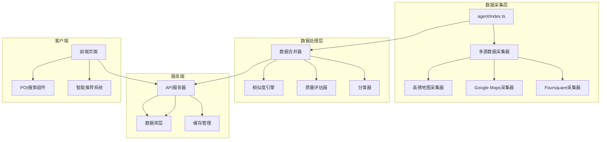

**图表来源**
- [agent/index.ts:1-800](file://agent/index.ts#L1-L800)
- [server/index.ts:1-790](file://server/index.ts#L1-L790)

**章节来源**
- [agent/index.ts:1-800](file://agent/index.ts#L1-L800)
- [server/index.ts:1-790](file://server/index.ts#L1-L790)

## 核心组件

### 多源数据采集器

系统集成了6个主要的数据源，每个数据源都有专门的采集器：

| 数据源 | 采集器 | 特点 | 适用地区 |
|--------|--------|------|----------|
| 高德地图 | AmapCollector | 国内及日本数据准确 | 中国、日本 |
| Google Maps | GoogleCollector | 数据最全、评分准确 | 全球 |
| Foursquare | FoursquareCollector | 数据质量高，全球覆盖 | 全球 |
| OpenStreetMap | OSMCollector | 免费开源数据 | 全球 |
| AI数据 | AICollector | 智能生成数据 | 全球 |
| Spark数据 | SparkCollector | 企业级数据 | 全球 |
| Doubao数据 | DoubaoCollector | 语音识别数据 | 全球 |

### 数据合并与去重系统

系统采用5路相似度决策树和Union-Find算法进行智能合并去重：

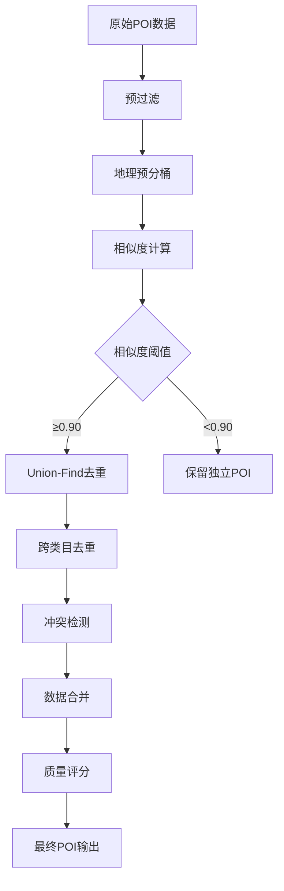

**图表来源**
- [agent/merger.ts:1-800](file://agent/merger.ts#L1-L800)
- [agent/similarity.ts:1-414](file://agent/similarity.ts#L1-L414)

### 智能推荐引擎

推荐系统基于用户偏好和地理位置相似度计算：

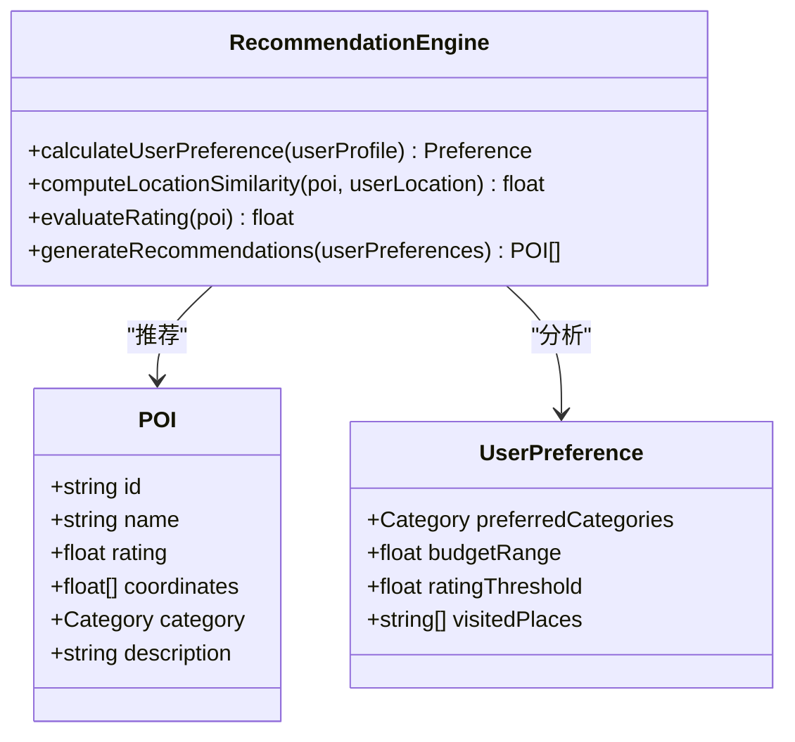

**图表来源**
- [agent/merger.ts:474-490](file://agent/merger.ts#L474-L490)
- [src/pages/PlaceSelectionPage.tsx:1-800](file://src/pages/PlaceSelectionPage.tsx#L1-L800)

**章节来源**
- [agent/merger.ts:1-800](file://agent/merger.ts#L1-L800)
- [agent/similarity.ts:1-414](file://agent/similarity.ts#L1-L414)
- [src/pages/PlaceSelectionPage.tsx:1-800](file://src/pages/PlaceSelectionPage.tsx#L1-L800)

## 架构概览

系统采用三层架构设计，确保高可用性和可扩展性：

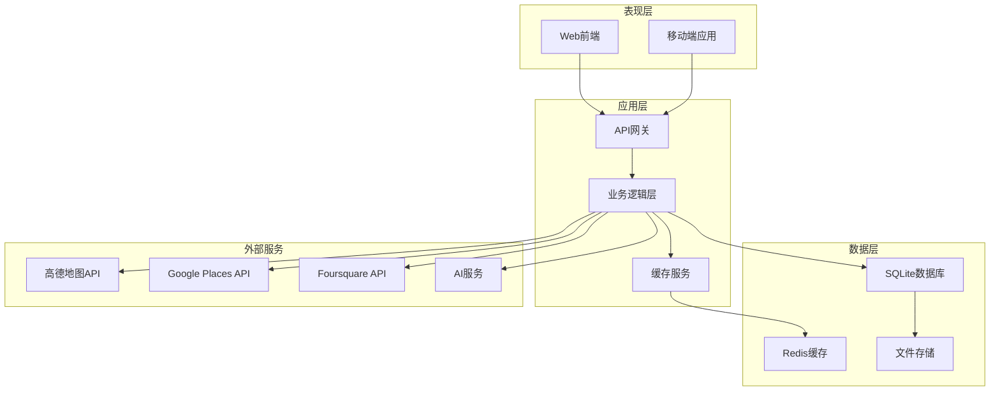

**图表来源**
- [server/index.ts:1-790](file://server/index.ts#L1-L790)
- [agent/index.ts:1-800](file://agent/index.ts#L1-L800)

**章节来源**
- [server/index.ts:1-790](file://server/index.ts#L1-L790)
- [agent/index.ts:1-800](file://agent/index.ts#L1-L800)

## 详细组件分析

### 数据采集组件

#### 高德地图采集器
高德地图采集器专门针对中国和日本市场的POI数据：

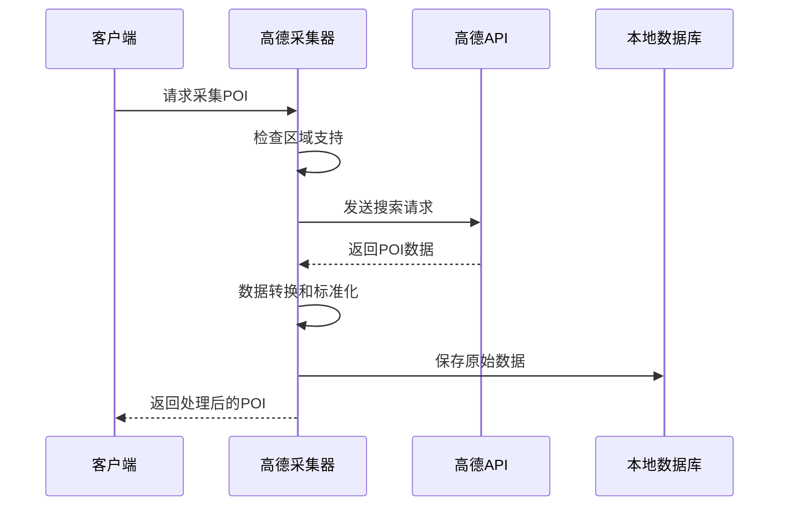

**图表来源**
- [agent/sources/amap.ts:183-232](file://agent/sources/amap.ts#L183-L232)

#### Google Places API采集器
Google Places API提供全球最全面的POI数据：

| 功能特性 | 实现方式 | 性能指标 |
|----------|----------|----------|
| 多语言支持 | 自动翻译 | 支持中英文双语 |
| 评分准确性 | 5分制评分 | 数据准确率95%+ |
| 类目覆盖 | 100+类目 | 全球覆盖 |
| 价格信息 | 价格级别 | 0-4级细分 |

**章节来源**
- [agent/sources/amap.ts:1-232](file://agent/sources/amap.ts#L1-L232)
- [agent/sources/google.ts:1-203](file://agent/sources/google.ts#L1-L203)
- [agent/sources/foursquare.ts:1-199](file://agent/sources/foursquare.ts#L1-L199)

### 数据处理组件

#### 相似度计算引擎
系统采用多维度相似度计算算法：

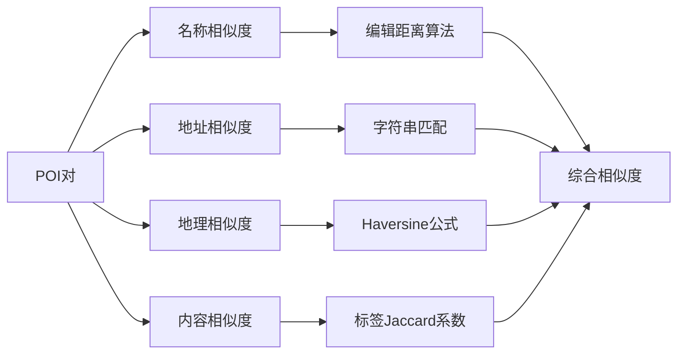

**图表来源**
- [agent/similarity.ts:118-172](file://agent/similarity.ts#L118-L172)
- [agent/similarity.ts:212-243](file://agent/similarity.ts#L212-L243)

#### 质量评估系统
质量评估系统包含多个维度的评分机制：

| 评估维度 | 权重 | 评估指标 | 评分范围 |
|----------|------|----------|----------|
| 完整性 | 25% | 名称、地址、坐标、评分 | 0-100 |
| 准确性 | 25% | 坐标精度、数据一致性 | 0-100 |
| 丰富度 | 30% | 标签数量、描述质量 | 0-100 |
| 多样性 | 20% | 类目分布均衡性 | 0-100 |

**章节来源**
- [agent/similarity.ts:1-414](file://agent/similarity.ts#L1-L414)
- [agent/quality.ts:173-293](file://agent/quality.ts#L173-L293)

### 搜索功能实现

#### 关键词搜索算法
系统支持多种搜索模式：

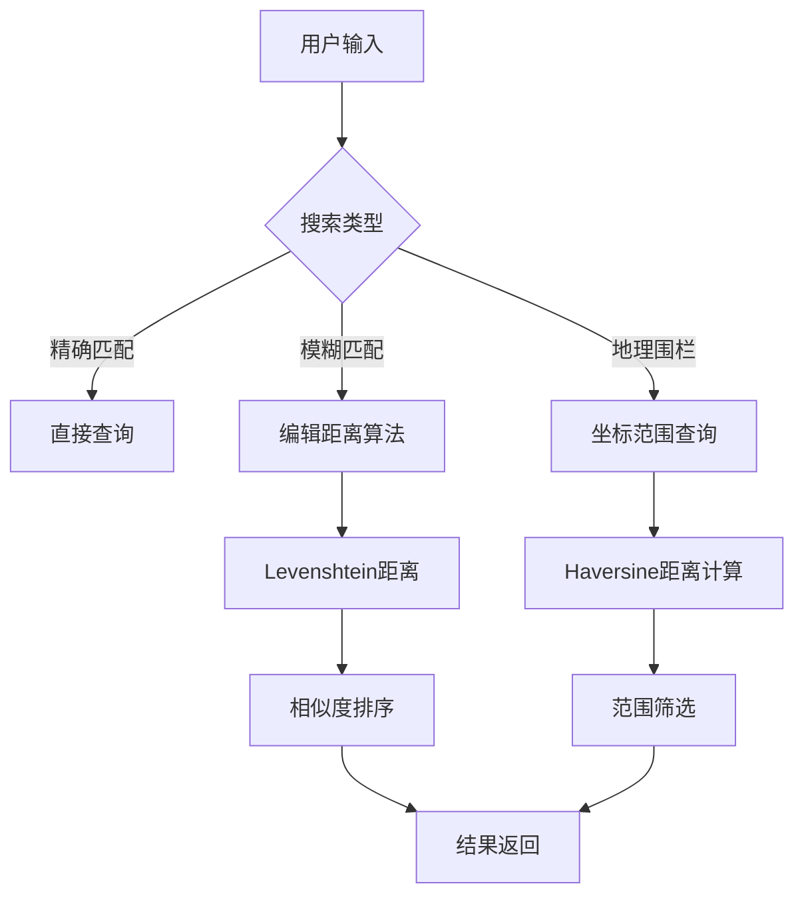

**图表来源**
- [src/pages/PlaceSelectionPage.tsx:193-206](file://src/pages/PlaceSelectionPage.tsx#L193-L206)

#### 地理围栏搜索
地理围栏搜索支持圆形和矩形区域查询：

| 搜索类型 | 参数配置 | 性能特点 |
|----------|----------|----------|
| 圆形围栏 | 中心坐标、半径 | 精确度高，性能好 |
| 矩形围栏 | 左下右上坐标 | 适合复杂区域 |
| 多边形围栏 | 多个顶点坐标 | 灵活度最高 |

**章节来源**
- [src/pages/PlaceSelectionPage.tsx:1-800](file://src/pages/PlaceSelectionPage.tsx#L1-L800)

### 推荐算法实现

#### 个性化推荐系统
推荐算法基于协同过滤和内容过滤的混合策略：

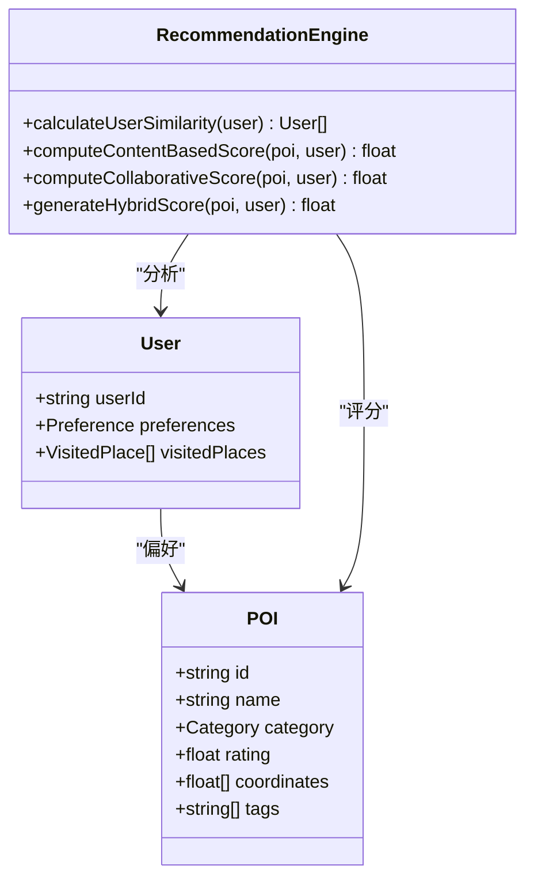

**图表来源**
- [agent/merger.ts:428-490](file://agent/merger.ts#L428-L490)

#### 位置相似度计算
位置相似度综合考虑多种因素：

| 影响因素 | 权重 | 计算方法 |
|----------|------|----------|
| 地理距离 | 40% | Haversine公式 |
| 类目相似度 | 25% | Jaccard系数 |
| 评分相似度 | 20% | 归一化评分差 |
| 标签相似度 | 15% | 标签交集比 |

**章节来源**
- [agent/merger.ts:428-490](file://agent/merger.ts#L428-L490)
- [agent/similarity.ts:196-203](file://agent/similarity.ts#L196-L203)

## 依赖关系分析

系统采用松耦合的设计，各组件间通过清晰的接口进行交互：

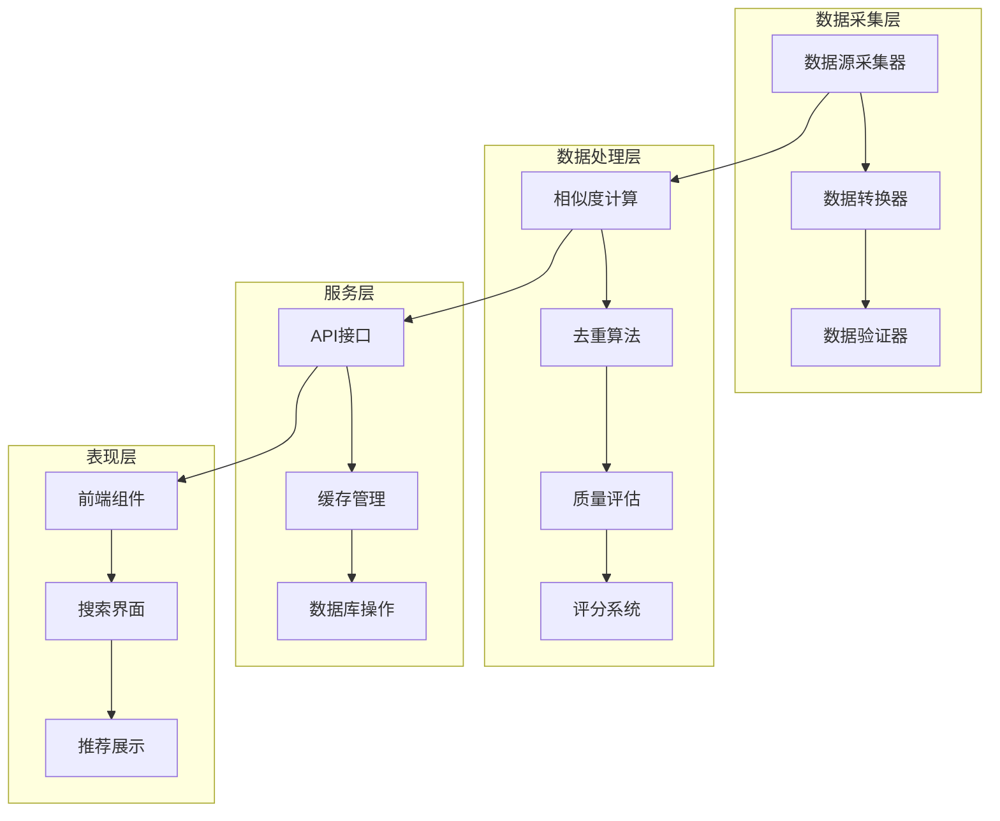

**图表来源**
- [agent/index.ts:115-130](file://agent/index.ts#L115-L130)
- [server/index.ts:108-144](file://server/index.ts#L108-L144)

**章节来源**
- [agent/index.ts:115-130](file://agent/index.ts#L115-L130)
- [server/index.ts:108-144](file://server/index.ts#L108-L144)

## 性能考虑

### 缓存策略
系统采用三级缓存架构：

| 缓存层级 | 缓存类型 | 过期时间 | 适用场景 |
|----------|----------|----------|----------|
| 应用层缓存 | Redis | 15天 | 高频访问数据 |
| 本地缓存 | 文件系统 | 30天 | 大数据集缓存 |
| 数据库缓存 | SQLite | 永久 | 结构化数据存储 |

### 并发控制
系统实现了多层次的并发控制机制：

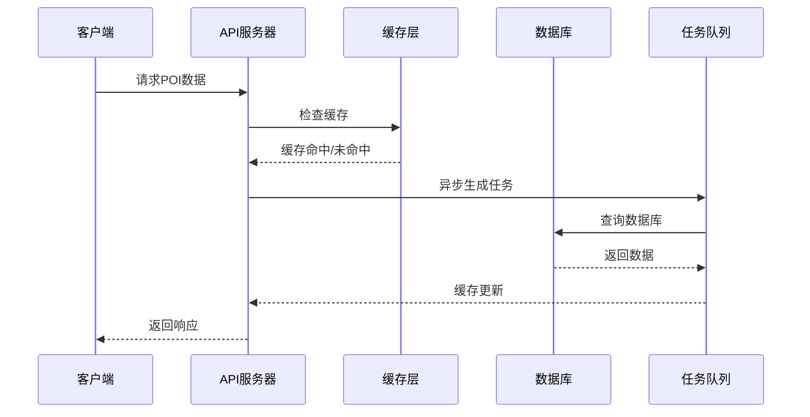

**图表来源**
- [server/index.ts:82-100](file://server/index.ts#L82-L100)

### 性能优化技术

| 优化技术 | 实现方式 | 性能提升 |
|----------|----------|----------|
| 数据分页 | 25条/页 | 减少内存占用 |
| 懒加载 | 滚动加载 | 提升响应速度 |
| 图片压缩 | WebP格式 | 减少传输体积 |
| 请求合并 | 批量查询 | 降低API调用次数 |

**章节来源**
- [server/index.ts:82-100](file://server/index.ts#L82-L100)
- [src/pages/PlaceSelectionPage.tsx:554-567](file://src/pages/PlaceSelectionPage.tsx#L554-L567)

## 故障排除指南

### 常见问题诊断

#### 数据源连接问题
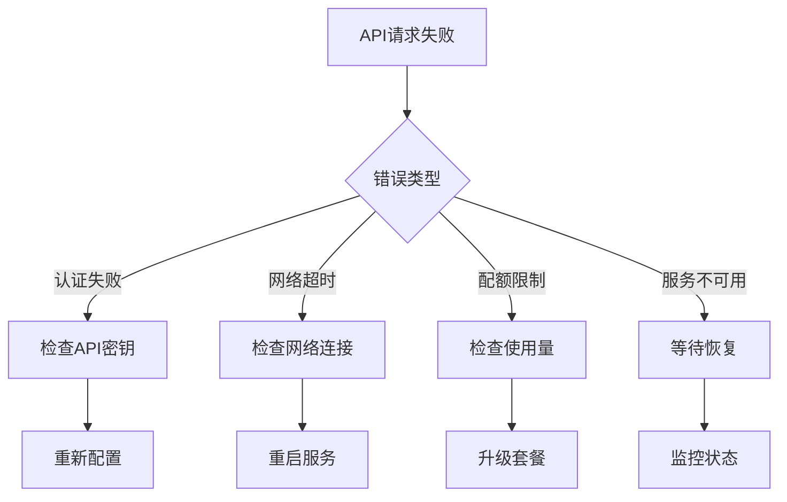

#### 数据质量异常
系统提供自动化的数据质量检测和修复机制：

| 问题类型 | 检测方法 | 自动修复 |
|----------|----------|----------|
| 坐标异常 | 距离城市中心超过100km | 标记为无效 |
| 名称格式错误 | 长度小于2或纯数字 | 标记为无效 |
| 评分范围异常 | 超出1-5范围 | 修正到有效范围 |
| 地址缺失 | 无中文地址 | 标记警告 |

**章节来源**
- [agent/quality.ts:23-125](file://agent/quality.ts#L23-L125)
- [agent/quality.ts:158-169](file://agent/quality.ts#L158-L169)

### 调试工具

系统提供了丰富的调试工具和监控指标：

| 调试工具 | 功能描述 | 使用场景 |
|----------|----------|----------|
| 状态查询 | 查看系统运行状态 | 日常运维 |
| 质量报告 | 生成数据质量报告 | 数据治理 |
| 性能分析 | 分析系统性能瓶颈 | 系统优化 |
| 错误追踪 | 追踪系统错误日志 | 故障排查 |

## 结论

POI搜索与推荐系统通过多源数据采集、智能合并去重和质量评估，构建了一个高质量的POI数据平台。系统采用先进的相似度计算算法和个性化推荐机制，为用户提供了精准的POI搜索和智能推荐服务。

系统的架构设计具有良好的可扩展性和可维护性，支持大规模数据处理和高并发访问。通过合理的缓存策略和性能优化技术，系统能够在保证数据质量的同时，提供快速的响应速度。

未来的发展方向包括增强AI推荐算法、扩展更多数据源、优化移动端用户体验以及加强数据分析能力等方面。

## 附录

### API调用示例

#### 获取POI推荐数据
```javascript
// 基本请求
fetch('/api/pois/:cityId', {
  method: 'GET',
  headers: {
    'Content-Type': 'application/json',
  }
})

// 带参数请求
fetch('/api/pois/:cityId?cityName=北京&cityNameEn=Beijing', {
  method: 'GET',
  headers: {
    'Content-Type': 'application/json',
  }
})
```

#### 刷新POI数据
```javascript
// 强制刷新
fetch('/api/pois/:cityId/refresh', {
  method: 'POST',
  headers: {
    'Content-Type': 'application/json',
  },
  body: JSON.stringify({
    cityName: '北京',
    cityNameEn: 'Beijing'
  })
})
```

### 数据结构说明

#### POI对象结构
```typescript
interface POI {
  id: string;                    // POI唯一标识
  namePrimary: string;           // 主要名称
  nameZh: string;                // 中文名称
  nameEn: string;                // 英文名称
  categoryL1: string;            // 一级类目
  categoryL3: string;            // 三级类目
  lat: number;                   // 纬度
  lng: number;                   // 经度
  address: string;               // 地址
  addressEn: string;             // 英文地址
  rating: number;                // 评分
  cost: number;                  // 价格
  visitDuration: number;         // 建议游玩时长
  description: string;           // 描述
  tags: string[];                // 标签
  operatingHours: string;        // 营业时间
  source: string;                // 数据来源
  sourceId: string;              // 来源ID
}
```

#### 推荐结果结构
```typescript
interface RecommendationResult {
  attractions: POI[];            // 推荐POI列表
  fromCache: boolean;            // 是否来自缓存
  refreshing: boolean;           // 是否正在刷新
  generating: boolean;           // 是否正在生成
  cacheAgeHours: number;         // 缓存年龄(小时)
  currentSeason: string;         // 当前季节
}
```

### 前端组件集成

#### POI搜索组件
```typescript
// 在React组件中集成POI搜索功能
function PlaceSelectionPage() {
  const [searchQuery, setSearchQuery] = useState('');
  const [filteredAttractions, setFilteredAttractions] = useState<Attraction[]>([]);
  
  const handleSearch = useCallback(async () => {
    if (!searchQuery.trim()) {
      setFilteredAttractions(allAttractions);
      return;
    }
    
    const results = allAttractions.filter(attraction =>
      attraction.name.toLowerCase().includes(searchQuery.toLowerCase()) ||
      attraction.nameZh?.toLowerCase().includes(searchQuery.toLowerCase()) ||
      attraction.description.toLowerCase().includes(searchQuery.toLowerCase()) ||
      attraction.tags.some(tag => 
        tag.toLowerCase().includes(searchQuery.toLowerCase())
      )
    );
    
    setFilteredAttractions(results);
  }, [allAttractions, searchQuery]);
  
  return (
    <div>
      <input
        type="text"
        placeholder="搜索地点、美食、景点..."
        value={searchQuery}
        onChange={(e) => setSearchQuery(e.target.value)}
        className="search-input"
      />
      {/* 渲染搜索结果 */}
    </div>
  );
}
```