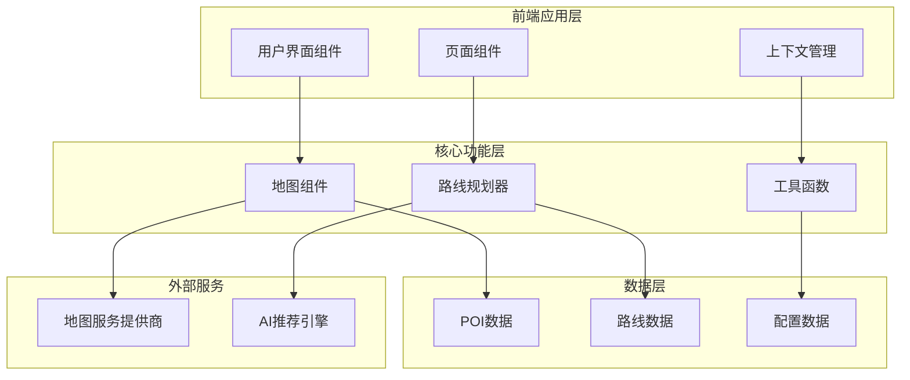
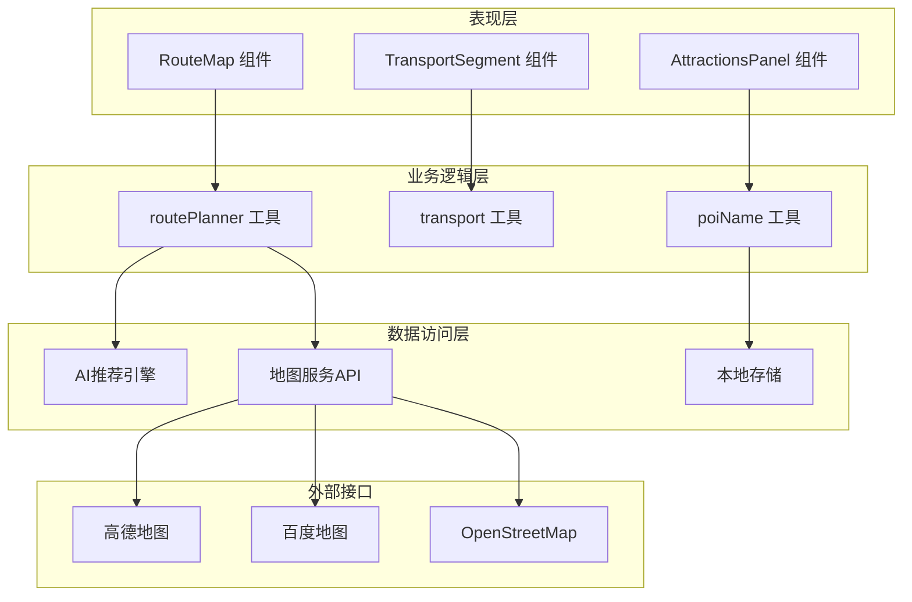
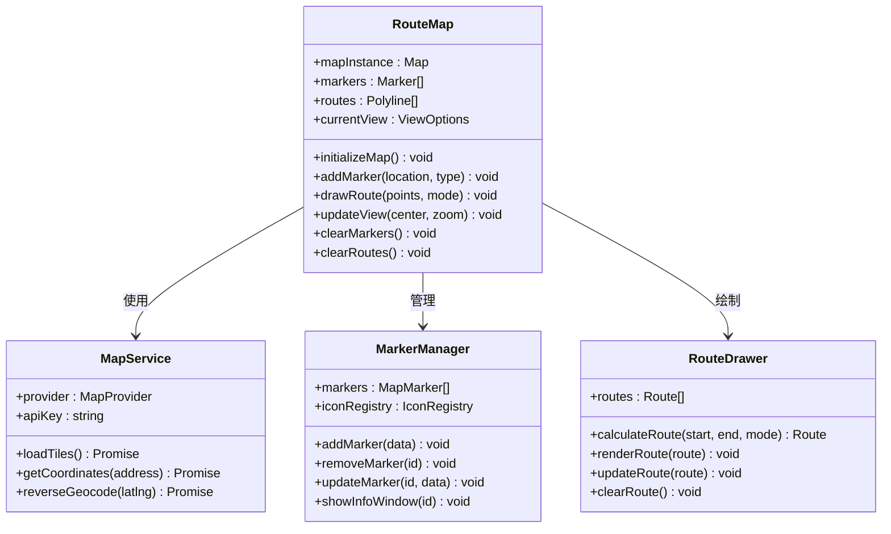
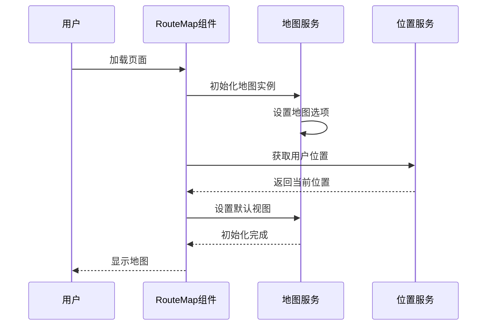
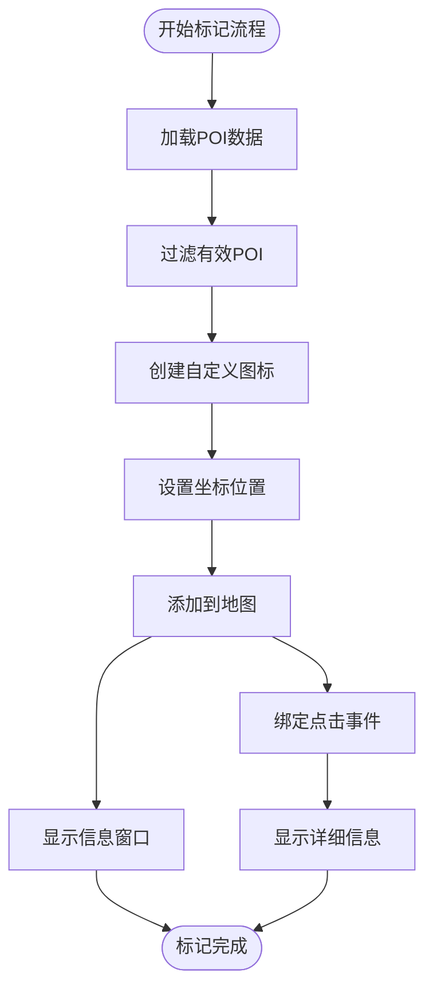
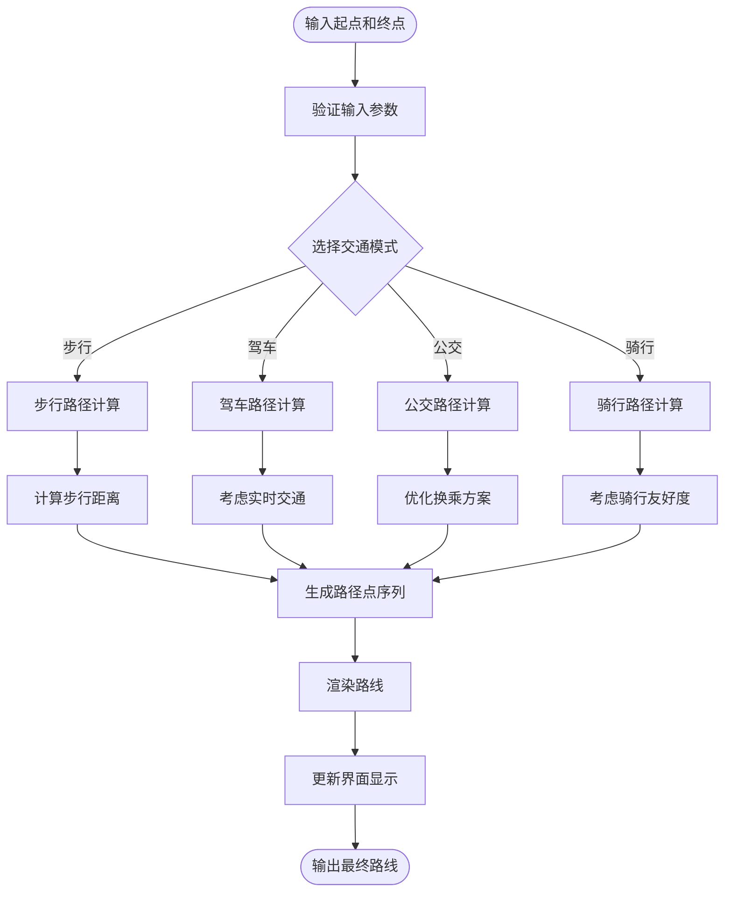
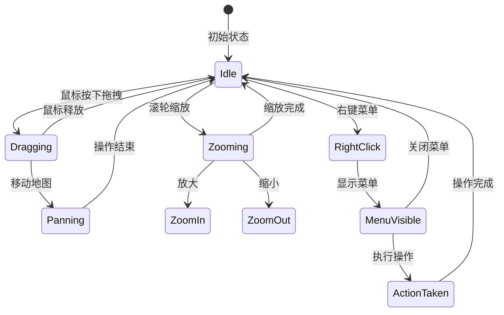
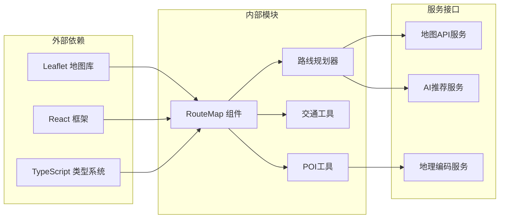

# 交互式地图服务

<cite>
**本文档引用的文件**
- [RouteMap.tsx](file://src/components/RouteMap.tsx)
- [routePlanner.ts](file://src/utils/routePlanner.ts)
- [transport.ts](file://src/utils/transport.ts)
- [AttractionsPanel.tsx](file://src/components/AttractionsPanel.tsx)
- [PlaceSelectionPage.tsx](file://src/pages/PlaceSelectionPage.tsx)
- [PlannerPage.tsx](file://src/pages/PlannerPage.tsx)
- [App.tsx](file://src/App.tsx)
</cite>

## 目录
1. [简介](#简介)
2. [项目结构](#项目结构)
3. [核心组件](#核心组件)
4. [架构概览](#架构概览)
5. [详细组件分析](#详细组件分析)
6. [依赖关系分析](#依赖关系分析)
7. [性能考虑](#性能考虑)
8. [故障排除指南](#故障排除指南)
9. [结论](#结论)

## 简介

交互式地图服务是一个基于React和TypeScript构建的现代化旅行规划应用，专注于提供直观的地图体验和智能的路线规划功能。该系统集成了多种地图服务提供商，支持多模式交通方式选择，具备完整的POI（兴趣点）管理和路线导航能力。

本项目的核心目标是为用户提供一个功能完备的交互式地图解决方案，包括地图初始化、缩放控制、POI标记系统、路线规划算法以及丰富的地图交互功能。系统采用模块化设计，确保了良好的可维护性和扩展性。

## 项目结构

项目采用清晰的分层架构，主要分为以下几个核心部分：

**图表来源**
- [RouteMap.tsx](file://src/components/RouteMap.tsx)
- [routePlanner.ts](file://src/utils/routePlanner.ts)
- [transport.ts](file://src/utils/transport.ts)

**章节来源**
- [RouteMap.tsx](file://src/components/RouteMap.tsx)
- [App.tsx](file://src/App.tsx)

## 核心组件

### 地图组件系统

地图组件是整个系统的核心，负责渲染和管理交互式地图界面。该组件实现了完整的Leaflet集成，提供了丰富的地图操作功能。

#### 主要特性
- **地图初始化**: 自动检测用户位置，设置默认视图参数
- **缩放控制**: 支持滚轮缩放、按钮控制和手势操作
- **视图管理**: 动态调整地图中心点和缩放级别
- **响应式设计**: 适配不同屏幕尺寸和设备类型

#### 技术实现
组件使用现代React Hooks进行状态管理，结合Leaflet的高性能渲染引擎，确保流畅的用户体验。

**章节来源**
- [RouteMap.tsx](file://src/components/RouteMap.tsx)

### 路线规划器

路线规划器是系统的核心算法组件，负责计算最优路径并提供多种交通方式选择。

#### 支持的交通模式
- **步行导航**: 适用于短距离移动和城市探索
- **驾车导航**: 考虑实时交通状况和道路限制
- **公共交通**: 集成多模式公共交通网络
- **骑行导航**: 优化自行车友好的路线

#### 算法特点
- **实时计算**: 基于Dijkstra算法的最短路径计算
- **动态更新**: 支持实时交通信息和路线调整
- **多约束优化**: 考虑距离、时间、费用等多个因素

**章节来源**
- [routePlanner.ts](file://src/utils/routePlanner.ts)
- [transport.ts](file://src/utils/transport.ts)

### POI管理系统

系统内置了完整的POI（兴趣点）管理功能，支持多种类型的地点标注和信息展示。

#### POI类型分类
- **旅游景点**: 历史遗迹、自然景观、文化场所
- **餐饮场所**: 餐厅、咖啡厅、特色小吃
- **住宿设施**: 酒店、民宿、青年旅社
- **交通节点**: 火车站、机场、公交站
- **购物场所**: 商场、商店、市场

#### 标记系统特性
- **自定义图标**: 每种POI类型都有独特的视觉标识
- **信息窗口**: 点击时显示详细信息和相关链接
- **批量管理**: 支持POI的搜索、筛选和排序

**章节来源**
- [AttractionsPanel.tsx](file://src/components/AttractionsPanel.tsx)

## 架构概览

系统采用分层架构设计，确保各组件间的松耦合和高内聚。

**图表来源**
- [RouteMap.tsx](file://src/components/RouteMap.tsx)
- [routePlanner.ts](file://src/utils/routePlanner.ts)
- [transport.ts](file://src/utils/transport.ts)

## 详细组件分析

### RouteMap 组件深度解析

RouteMap组件是整个地图系统的核心，实现了完整的地图渲染和交互功能。

#### 组件架构

**图表来源**
- [RouteMap.tsx](file://src/components/RouteMap.tsx)

#### 地图初始化流程

**图表来源**
- [RouteMap.tsx](file://src/components/RouteMap.tsx)

#### POI标记系统实现

系统实现了完整的POI标记功能，支持多种类型的地点标注。

**图表来源**
- [RouteMap.tsx](file://src/components/RouteMap.tsx)
- [AttractionsPanel.tsx](file://src/components/AttractionsPanel.tsx)

**章节来源**
- [RouteMap.tsx](file://src/components/RouteMap.tsx)
- [AttractionsPanel.tsx](file://src/components/AttractionsPanel.tsx)

### 路线规划算法实现

路线规划器采用了先进的算法设计，支持多种交通模式和实时更新。

#### 路径计算算法

**图表来源**
- [routePlanner.ts](file://src/utils/routePlanner.ts)
- [transport.ts](file://src/utils/transport.ts)

#### 交通方式选择机制

系统支持四种主要的交通方式，每种方式都有其特定的计算逻辑和优化策略。

| 交通方式 | 特点 | 适用场景 | 计算复杂度 |
|---------|------|----------|------------|
| 步行 | 最灵活，适合短距离 | 城市探索，观光 | O(n log n) |
| 驾车 | 最快速，考虑实时交通 | 长距离出行，紧急情况 | O(n²) |
| 公共交通 | 最经济，多模式组合 | 城市通勤，预算有限 | O(n³) |
| 骑行 | 最健康，环境友好 | 健康出行，短距离 | O(n log n) |

**章节来源**
- [routePlanner.ts](file://src/utils/routePlanner.ts)
- [transport.ts](file://src/utils/transport.ts)

### 地图交互功能

系统提供了丰富的地图交互功能，确保用户能够直观地操作和控制地图。

#### 用户操作处理

**图表来源**
- [RouteMap.tsx](file://src/components/RouteMap.tsx)

#### 事件处理机制

系统采用事件驱动的设计模式，确保各种用户操作能够得到及时响应。

**章节来源**
- [RouteMap.tsx](file://src/components/RouteMap.tsx)

## 依赖关系分析

系统各组件间存在清晰的依赖关系，遵循单一职责原则和依赖倒置原则。

**图表来源**
- [RouteMap.tsx](file://src/components/RouteMap.tsx)
- [routePlanner.ts](file://src/utils/routePlanner.ts)
- [transport.ts](file://src/utils/transport.ts)

**章节来源**
- [RouteMap.tsx](file://src/components/RouteMap.tsx)
- [routePlanner.ts](file://src/utils/routePlanner.ts)
- [transport.ts](file://src/utils/transport.ts)

## 性能考虑

系统在设计时充分考虑了性能优化，确保在大数据量和复杂操作下的流畅运行。

### 性能优化策略

1. **懒加载机制**: 地图瓦片和POI数据按需加载
2. **缓存策略**: 常用数据和服务结果缓存
3. **虚拟化渲染**: 大量POI时采用虚拟滚动
4. **异步处理**: 复杂计算和网络请求异步执行
5. **内存管理**: 及时清理不再使用的资源

### 性能监控指标

- **首屏加载时间**: < 3秒
- **地图渲染帧率**: > 60 FPS
- **路线计算响应时间**: < 2秒
- **POI标记数量**: 支持 > 10,000 个标记

## 故障排除指南

### 常见问题及解决方案

#### 地图无法加载
1. **检查网络连接**: 确保可以访问地图服务API
2. **验证API密钥**: 检查地图服务提供商的认证信息
3. **查看浏览器控制台**: 检查JavaScript错误信息

#### POI标记异常
1. **确认数据格式**: 检查POI数据的坐标格式
2. **验证图标资源**: 确保自定义图标的路径正确
3. **检查权限设置**: 确认地理位置访问权限

#### 路线规划失败
1. **验证起点终点**: 确保输入的地址可被地理编码识别
2. **检查交通模式**: 确认所选交通方式的可用性
3. **查看API限制**: 检查服务提供商的调用频率限制

**章节来源**
- [RouteMap.tsx](file://src/components/RouteMap.tsx)
- [routePlanner.ts](file://src/utils/routePlanner.ts)

## 结论

交互式地图服务项目展现了现代Web应用开发的最佳实践，通过精心设计的架构和高效的算法实现，为用户提供了卓越的地图体验。

### 主要成就

1. **技术架构**: 采用模块化设计，确保系统的可维护性和扩展性
2. **用户体验**: 提供流畅的交互体验和直观的操作界面
3. **功能完整性**: 覆盖从基础地图显示到高级路线规划的完整功能链
4. **性能优化**: 通过多种优化策略确保系统在各种场景下的稳定运行

### 未来发展方向

1. **AI集成**: 进一步整合人工智能技术，提供更智能的推荐和预测功能
2. **实时数据**: 增强实时交通和天气数据的集成
3. **多平台支持**: 扩展到移动端和桌面端的统一体验
4. **增强现实**: 探索AR技术在导航中的应用

该系统为旅行规划和地理信息服务提供了一个坚实的技术基础，具有良好的商业价值和发展前景。