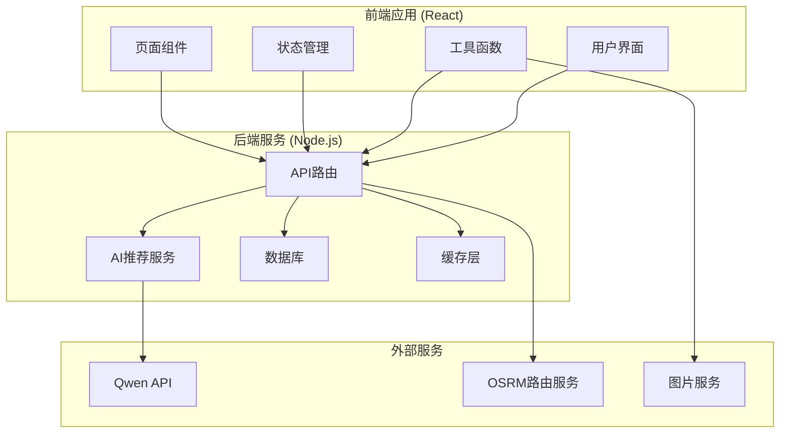
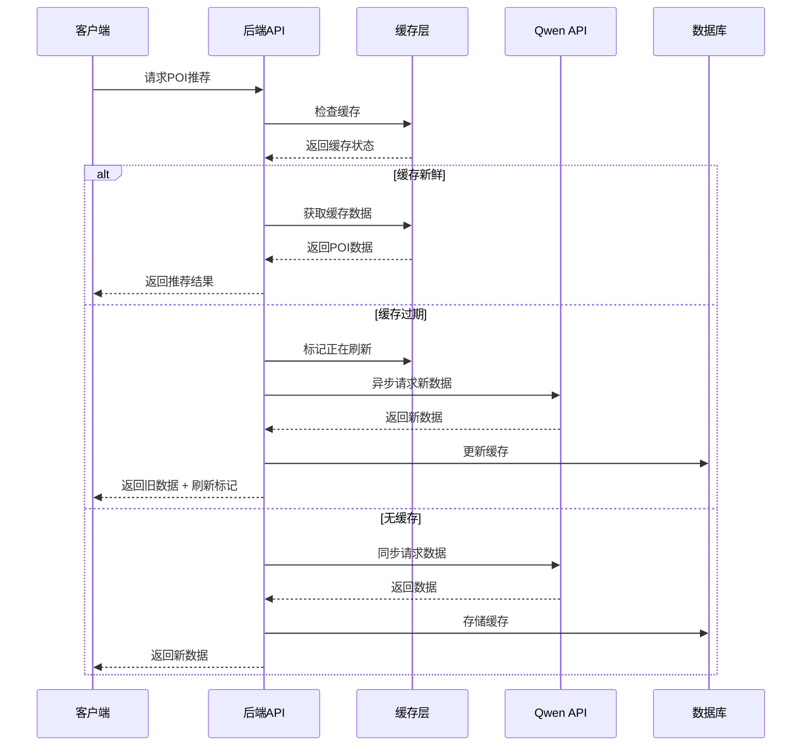
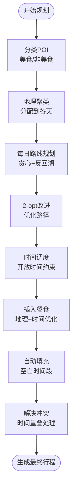
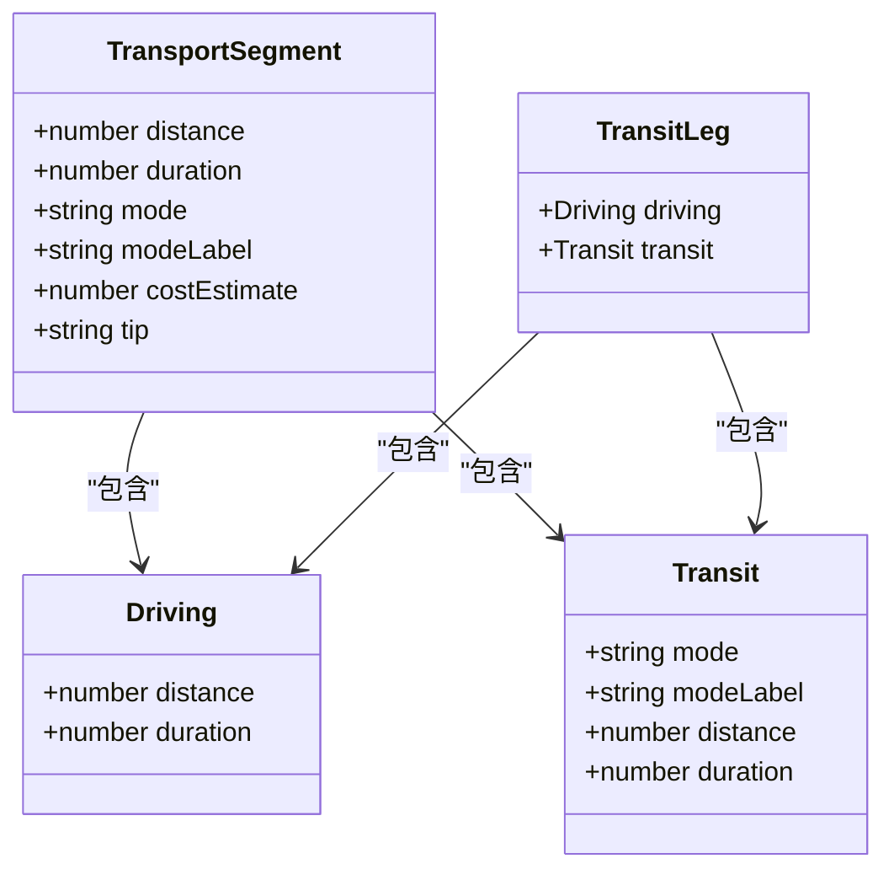
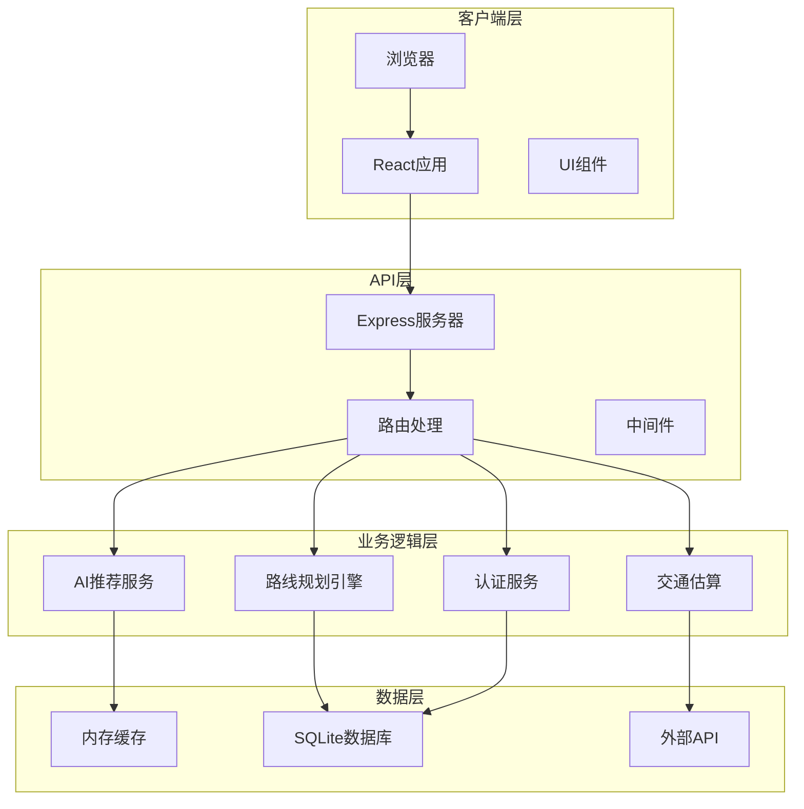
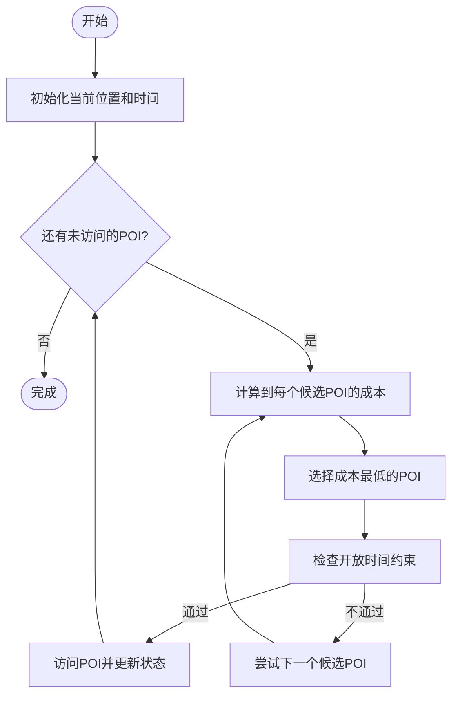
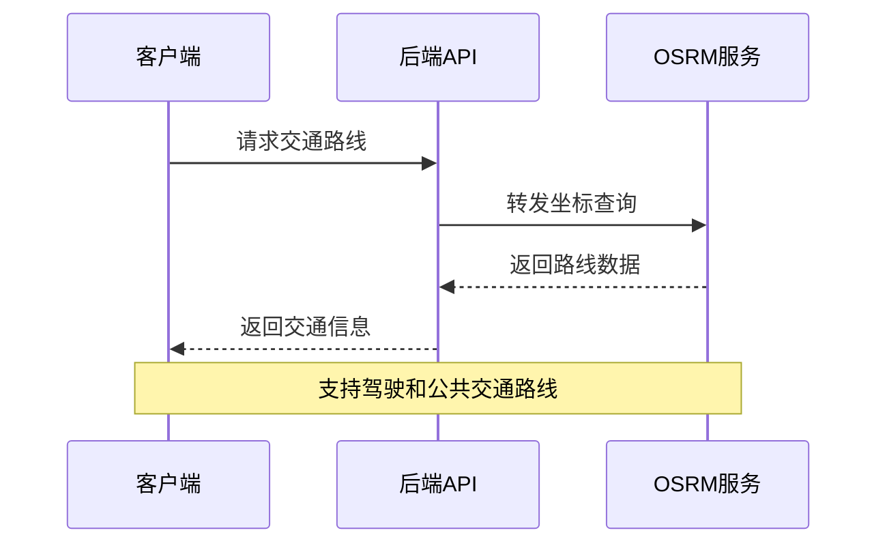

# 智能旅行规划引擎

<cite>
**本文档引用的文件**
- [aiRecommend.ts](file://src/utils/aiRecommend.ts)
- [routePlanner.ts](file://src/utils/routePlanner.ts)
- [transport.ts](file://src/utils/transport.ts)
- [qwen.ts](file://server/qwen.ts)
- [server/index.ts](file://server/index.ts)
- [AppContext.tsx](file://src/context/AppContext.tsx)
- [PlannerPage.tsx](file://src/pages/PlannerPage.tsx)
- [AttractionsPanel.tsx](file://src/components/AttractionsPanel.tsx)
- [mock-data.ts](file://src/data/mock-data.ts)
- [types/index.ts](file://src/types/index.ts)
- [package.json](file://package.json)
</cite>

## 目录
1. [项目概述](#项目概述)
2. [项目结构](#项目结构)
3. [核心组件](#核心组件)
4. [架构概览](#架构概览)
5. [详细组件分析](#详细组件分析)
6. [依赖关系分析](#依赖关系分析)
7. [性能考虑](#性能考虑)
8. [故障排除指南](#故障排除指南)
9. [结论](#结论)

## 项目概述

智能旅行规划引擎是一个基于人工智能的旅行规划系统，集成了AI推荐、智能路线规划和行程管理功能。该系统通过调用Qwen API获取智能推荐，结合地理算法生成最优旅行路线，并提供完整的行程管理功能。

### 主要特性
- AI智能推荐系统：基于Qwen API的个性化景点推荐
- 智能路线规划：最短路径计算和时间优化算法
- 行程时间安排：自动化的日程优化策略
- 实时交通估算：基于OSRM的实时路线规划
- React Context状态管理：完整的前端状态管理

## 项目结构



**图表来源**
- [package.json:1-59](file://package.json#L1-L59)
- [server/index.ts:1-790](file://server/index.ts#L1-L790)

**章节来源**
- [package.json:1-59](file://package.json#L1-L59)

## 核心组件

### AI推荐系统

AI推荐系统负责从Qwen API获取智能推荐的旅游景点数据，支持缓存策略和实时刷新功能。



**图表来源**
- [server/index.ts:108-144](file://server/index.ts#L108-L144)
- [server/qwen.ts:361-485](file://server/qwen.ts#L361-L485)

### 路线规划引擎

路线规划引擎实现了复杂的多目标优化算法，包括地理聚类、最短路径计算和时间窗口约束。



**图表来源**
- [src/utils/routePlanner.ts:672-851](file://src/utils/routePlanner.ts#L672-L851)

### 交通估算系统

交通估算系统提供了两种模式：启发式估算和真实路由数据。



**图表来源**
- [src/utils/transport.ts:13-35](file://src/utils/transport.ts#L13-L35)

**章节来源**
- [src/utils/aiRecommend.ts:1-251](file://src/utils/aiRecommend.ts#L1-L251)
- [src/utils/routePlanner.ts:1-800](file://src/utils/routePlanner.ts#L1-L800)
- [src/utils/transport.ts:1-181](file://src/utils/transport.ts#L1-L181)

## 架构概览

系统采用前后端分离架构，前端使用React构建用户界面，后端使用Node.js提供RESTful API服务。



**图表来源**
- [server/index.ts:1-790](file://server/index.ts#L1-L790)
- [src/context/AppContext.tsx:1-234](file://src/context/AppContext.tsx#L1-L234)

## 详细组件分析

### AI推荐模块 (aiRecommend.ts)

AI推荐模块负责与后端API交互，获取智能推荐的旅游景点数据。

#### 核心功能
- **缓存策略管理**：实现三层缓存策略（新鲜、陈旧、过期）
- **轮询机制**：后台刷新时的轮询更新
- **数据类型转换**：将服务器响应转换为前端可用的数据结构

#### 关键接口
```typescript
// 加载POI推荐数据
async function loadPOIRecommendations(
  cityName: string,
  cityNameEn: string,
  cityId: string,
  onBackgroundRefresh?: (attractions: Attraction[]) => void
): Promise<AIRecommendResult>

// 强制刷新POI数据
async function forceRefreshPOIs(
  cityName: string,
  cityNameEn: string,
  cityId: string
): Promise<AIRecommendResult>
```

#### 缓存策略
- **15天内**：直接返回缓存数据
- **15-30天**：返回缓存数据，同时触发后台刷新
- **30天以上**：立即触发API调用获取新数据

**章节来源**
- [src/utils/aiRecommend.ts:1-251](file://src/utils/aiRecommend.ts#L1-L251)

### 路线规划模块 (routePlanner.ts)

路线规划模块实现了复杂的多目标优化算法，确保生成高质量的旅行行程。

#### 核心算法

##### 地理聚类分配
使用地理聚类算法将景点分配到不同的旅行天数，确保每天的活动集中在地理上相邻的区域。


**图表来源**
- [src/utils/routePlanner.ts:685-764](file://src/utils/routePlanner.ts#L685-L764)

##### 贪心路线规划
实现带有反回溯偏置的最近邻算法，避免路线出现不必要的回转。



**图表来源**
- [src/utils/routePlanner.ts:169-236](file://src/utils/routePlanner.ts#L169-L236)

##### 2-opt局部搜索
使用2-opt算法优化路线，减少总旅行距离。

##### 餐食插入策略
根据地理位置和时间窗口智能插入餐食POI，确保合理的用餐安排。

#### 时间约束处理
- **开放时间约束**：确保POI在开放时间内访问
- **每日窗口**：08:00-21:00的时间限制
- **反回溯偏置**：优先选择向终点方向移动的POI

**章节来源**
- [src/utils/routePlanner.ts:1-800](file://src/utils/routePlanner.ts#L1-L800)

### 交通估算模块 (transport.ts)

交通估算模块提供了两种交通方式的估算策略。

#### 启发式估算
基于距离的启发式方法，提供即时的交通估算：

- **步行**：< 0.8公里
- **地铁/公交**：0.8-5公里  
- **出租车**：> 5公里

#### OSRM真实路由
通过OSRM API获取真实的路线数据，包括驾驶时间和距离。



**图表来源**
- [src/utils/transport.ts:142-162](file://src/utils/transport.ts#L142-L162)

**章节来源**
- [src/utils/transport.ts:1-181](file://src/utils/transport.ts#L1-L181)

### 状态管理系统 (AppContext.tsx)

React Context提供了全局状态管理，支持旅行规划的完整生命周期。

#### 状态结构
```typescript
interface AppState {
  currentView: AppView
  previousView: AppView | null
  currentTrip: Trip | null
  selectedDayIndex: number
  showAttractionPanel: boolean
  selectedPlaceIds: string[]
  detailAttractionId: string | null
  preSelectedCityId: string | null
  detailHotelData: string | null
  savedTripId: string | null
}
```

#### 核心操作
- **旅行创建**：生成多日行程计划
- **日程管理**：添加、删除、重新排列行程项目
- **酒店管理**：设置每日住宿地点
- **预算计算**：自动计算总预算

**章节来源**
- [src/context/AppContext.tsx:1-234](file://src/context/AppContext.tsx#L1-L234)

### 页面组件 (PlannerPage.tsx)

PlannerPage是旅行规划的核心页面，集成了所有规划功能。

#### 主要功能
- **行程概览**：显示完整的旅行计划
- **日程编辑**：支持拖拽和手动调整
- **保存功能**：将规划保存到服务器
- **响应式设计**：支持桌面和移动端

**章节来源**
- [src/pages/PlannerPage.tsx:1-388](file://src/pages/PlannerPage.tsx#L1-L388)

### 数据模型 (types/index.ts)

系统定义了完整的数据模型，确保前后端数据的一致性。

#### 核心数据类型
- **Attraction**：景点信息（名称、评分、位置、开放时间等）
- **ItineraryItem**：行程项目（开始时间、结束时间、费用等）
- **DayPlan**：每日计划（日期、项目列表、备注等）
- **Trip**：完整旅行计划（城市、日期范围、预算等）

**章节来源**
- [src/types/index.ts:1-239](file://src/types/index.ts#L1-L239)

## 依赖关系分析

系统使用现代化的技术栈，确保良好的性能和可维护性。

```mermaid
graph TB
subgraph "前端依赖"
React[react@18.3.1]
Router[react-router-dom@7.1.1]
UI[lucide-react@0.468.0]
Tailwind[tailwindcss@3.4.17]
Motion[framer-motion@11.15.0]
end
subgraph "后端依赖"
Express[express@5.2.1]
Cors[cors@2.8.6]
Dotenv[dotenv@17.3.1]
BetterSqlite[better-sqlite3@12.8.0]
end
subgraph "开发工具"
Vite[vite@6.0.5]
TypeScript[typescript@5.6.2]
TSX[tsx@4.21.0]
end
React --> UI
Express --> Cors
Express --> Dotenv
BetterSqlite --> SQLite[SQLite数据库]
```

**图表来源**
- [package.json:26-58](file://package.json#L26-L58)

**章节来源**
- [package.json:1-59](file://package.json#L1-L59)

## 性能考虑

### 缓存策略
系统实现了多层次的缓存策略，平衡数据新鲜度和性能：

1. **内存缓存**：热点数据的快速访问
2. **数据库缓存**：持久化存储和重启恢复
3. **API缓存**：减少对外部服务的调用频率

### 异步处理
- **后台刷新**：避免阻塞用户界面
- **轮询机制**：渐进式数据更新
- **超时控制**：防止长时间挂起

### 算法优化
- **贪心算法**：快速生成初始解
- **2-opt改进**：局部搜索优化
- **地理索引**：加速距离计算

## 故障排除指南

### 常见问题及解决方案

#### AI推荐数据加载失败
**症状**：POI推荐无法加载或显示错误
**原因**：
- API密钥配置错误
- 网络连接问题
- 缓存数据损坏

**解决方案**：
1. 检查环境变量中的API密钥
2. 验证网络连接
3. 清除缓存并重新加载

#### 路线规划异常
**症状**：生成的路线不合理或时间冲突
**原因**：
- POI数据缺失
- 时间窗口设置不当
- 地理距离计算错误

**解决方案**：
1. 验证POI数据的完整性
2. 检查开放时间设置
3. 确认坐标数据的准确性

#### 交通估算不准确
**症状**：显示的交通时间与实际不符
**原因**：
- OSRM服务不可用
- 坐标数据错误
- 交通状况变化

**解决方案**：
1. 检查OSRM服务状态
2. 验证起点终点坐标
3. 使用启发式估算作为后备方案

**章节来源**
- [server/index.ts:753-757](file://server/index.ts#L753-L757)
- [src/utils/aiRecommend.ts:85-93](file://src/utils/aiRecommend.ts#L85-L93)

## 结论

智能旅行规划引擎是一个功能完整、架构清晰的旅行规划系统。通过AI推荐、智能路线规划和完善的前端状态管理，为用户提供了优质的旅行规划体验。

### 技术优势
- **AI集成**：深度整合Qwen API，提供个性化的智能推荐
- **算法优化**：高效的路线规划算法，确保生成高质量的旅行行程
- **用户体验**：直观的界面设计和流畅的交互体验
- **可扩展性**：模块化的架构设计，便于功能扩展和维护

### 未来发展方向
- **机器学习增强**：基于用户行为的个性化推荐
- **实时数据集成**：天气、交通状况等实时信息
- **多语言支持**：国际化旅行规划服务
- **移动端优化**：原生移动应用开发

该系统为智能旅行规划领域提供了一个优秀的技术参考，展示了现代Web应用开发的最佳实践。