# 智能旅行规划引擎

<cite>
**本文档引用的文件**
- [aiRecommend.ts](file://src/utils/aiRecommend.ts)
- [routePlanner.ts](file://src/utils/routePlanner.ts)
- [transport.ts](file://src/utils/transport.ts)
- [scheduler.ts](file://agent/scheduler.ts)
- [qwen.ts](file://server/qwen.ts)
- [dedup.ts](file://server/dedup.ts)
- [index.ts](file://server/index.ts)
- [AppContext.tsx](file://src/context/AppContext.tsx)
- [PlannerPage.tsx](file://src/pages/PlannerPage.tsx)
- [AttractionsPanel.tsx](file://src/components/AttractionsPanel.tsx)
- [mock-data.ts](file://src/data/mock-data.ts)
- [types/index.ts](file://src/types/index.ts)
- [package.json](file://package.json)
</cite>

## 更新摘要
**所做更改**
- 更新强制访问点调度算法以反映从两阶段调度系统到单阶段顺序调度系统的重大重构
- 新增单阶段顺序调度系统，简化重叠解决机制，增强must-visit POI的duration调整能力
- 移除Pass1/Pass2阶段划分，采用统一的调度流程
- 优化强制访问点优先级处理，确保必游地点的优先安排
- 增强时间窗口冲突解决机制，支持动态duration调整

## 目录
1. [项目概述](#项目概述)
2. [项目结构](#项目结构)
3. [核心组件](#核心组件)
4. [架构概览](#架构概览)
5. [详细组件分析](#详细组件分析)
6. [算法改进分析](#算法改进分析)
7. [依赖关系分析](#依赖关系分析)
8. [性能考虑](#性能考虑)
9. [故障排除指南](#故障排除指南)
10. [结论](#结论)

## 项目概述

智能旅行规划引擎是一个基于人工智能的旅行规划系统，集成了AI推荐、智能路线规划和行程管理功能。该系统通过调用Qwen API获取智能推荐，结合地理算法生成最优旅行路线，并提供完整的行程管理功能。

### 主要特性
- **AI智能推荐系统**：基于Qwen API的个性化景点推荐，支持类型多样性和时间偏好评分
- **智能路线规划**：最短路径计算和时间优化算法，包含跳过POIs机制和地理智能餐食分配
- **行程时间安排**：自动化的单阶段顺序调度系统，支持强制访问点优先级和动态duration调整
- **实时交通估算**：基于OSRM的实时路线规划
- **React Context状态管理**：完整的前端状态管理
- **类型多样性管理**：确保旅行行程中景点类型的均衡分布
- **智能餐食规划**：自动识别和插入合适的餐食POI，支持地理智能分配
- **强制访问点调度系统**：全新的单阶段顺序调度系统，确保必游地点的优先安排
- **两-opt路径优化**：集成的局部搜索算法，提升路径质量
- **购物POI数量约束**：系统性限制购物POI的数量，确保旅行体验的多样性

## 项目结构

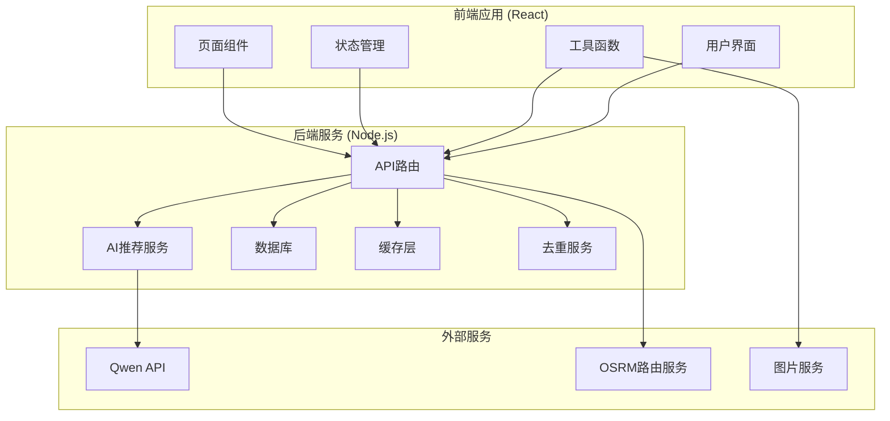

**图表来源**
- [package.json:1-59](file://package.json#L1-L59)
- [server/index.ts:1-790](file://server/index.ts#L1-L790)

**章节来源**
- [package.json:1-59](file://package.json#L1-L59)

## 核心组件

### AI推荐系统

AI推荐系统负责从Qwen API获取智能推荐的旅游景点数据，支持缓存策略、类型多样性和时间偏好评分功能。

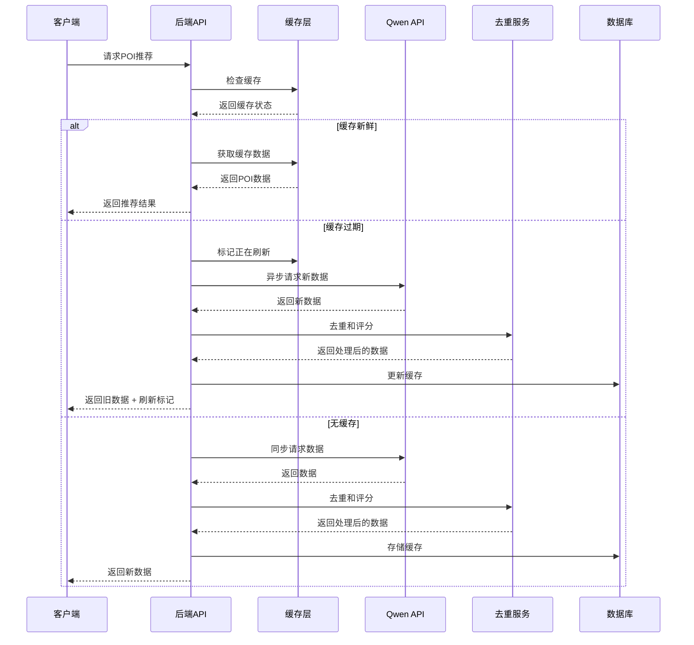

**图表来源**
- [server/index.ts:108-144](file://server/index.ts#L108-L144)
- [server/qwen.ts:361-485](file://server/qwen.ts#L361-L485)
- [server/dedup.ts:492](file://server/dedup.ts#L492)

### 路线规划引擎

路线规划引擎实现了复杂的多目标优化算法，包括地理聚类、最短路径计算、时间窗口约束和智能餐食规划。**更新**：采用全新的单阶段顺序调度系统，移除了两阶段调度的复杂性，简化了强制访问点的处理机制。

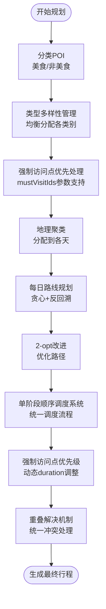

**图表来源**
- [src/utils/routePlanner.ts:794-852](file://src/utils/routePlanner.ts#L794-L852)
- [src/utils/routePlanner.ts:1004-1050](file://src/utils/routePlanner.ts#L1004-L1050)

### 交通估算系统

交通估算系统提供了两种模式：启发式估算和真实路由数据。

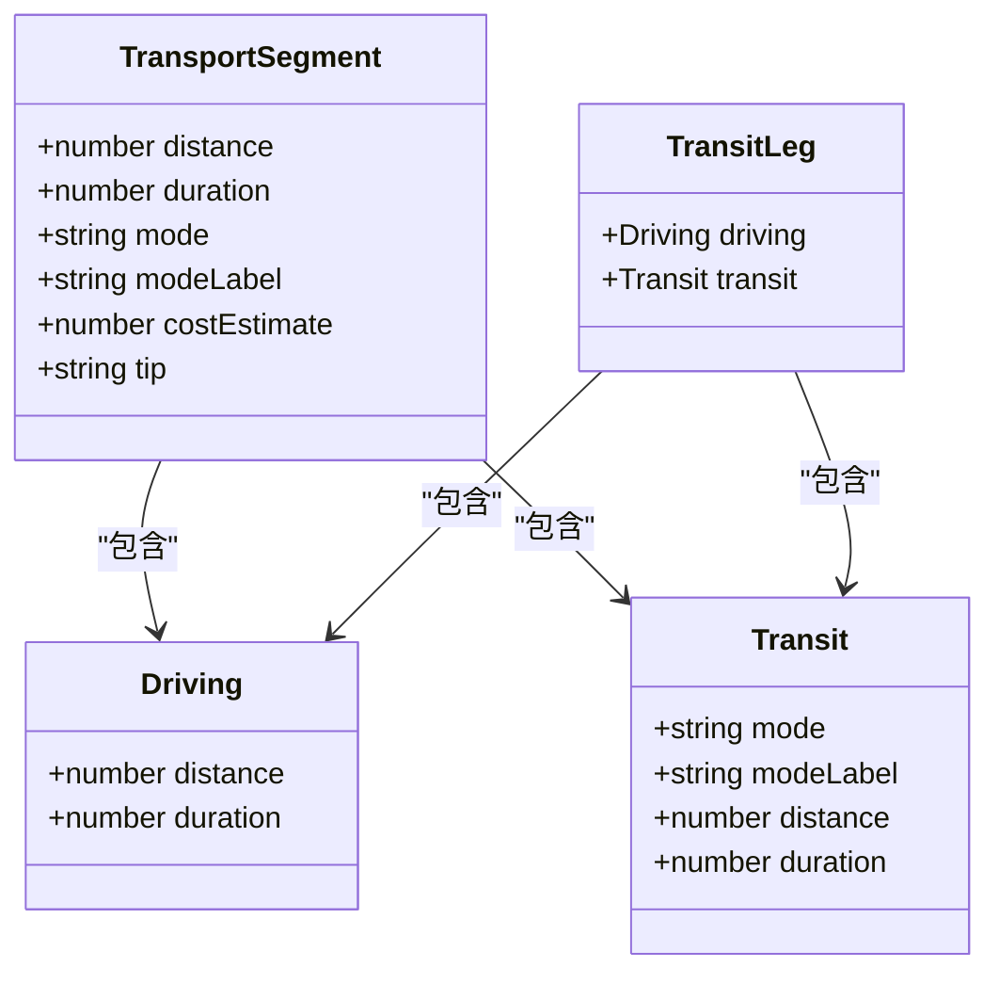

**图表来源**
- [src/utils/transport.ts:13-35](file://src/utils/transport.ts#L13-L35)

**章节来源**
- [src/utils/aiRecommend.ts:1-251](file://src/utils/aiRecommend.ts#L1-L251)
- [src/utils/routePlanner.ts:1-1317](file://src/utils/routePlanner.ts#L1-L1317)
- [src/utils/transport.ts:1-181](file://src/utils/transport.ts#L1-L181)

## 架构概览

系统采用前后端分离架构，前端使用React构建用户界面，后端使用Node.js提供RESTful API服务。

```mermaid
graph TB
subgraph "客户端层"
Browser[浏览器]
React[React应用]
Components[UI组件]
end
subgraph "API层"
Express[Express服务器]
Routes[路由处理]
Middleware[中间件]
end
subgraph "业务逻辑层"
AI[AI推荐服务]
Planner[路线规划引擎]
Transport[交通估算]
Auth[认证服务]
Dedup[去重服务]
Scheduler[调度系统]
End
subgraph "数据层"
Cache[内存缓存]
Database[SQLite数据库]
External[外部API]
```

**图表来源**
- [server/index.ts:1-790](file://server/index.ts#L1-L790)
- [src/context/AppContext.tsx:1-234](file://src/context/AppContext.tsx#L1-L234)

## 详细组件分析

### AI推荐模块 (aiRecommend.ts)

AI推荐模块负责与后端API交互，获取智能推荐的旅游景点数据，支持类型多样性和时间偏好评分功能。

#### 核心功能
- **缓存策略管理**：实现三层缓存策略（新鲜、陈旧、过期）
- **轮询机制**：后台刷新时的轮询更新
- **数据类型转换**：将服务器响应转换为前端可用的数据结构
- **类型多样性保证**：确保推荐结果包含多种类型的景点
- **时间偏好评分**：根据时间段偏好优化推荐结果

#### 关键接口
```typescript
// 加载POI推荐数据
async function loadPOIRecommendations(
  cityName: string,
  cityNameEn: string,
  cityId: string,
  onBackgroundRefresh?: (attractions: Attraction[]) => void
): Promise<AIRecommendResult>

// 强制刷新POI数据
async function forceRefreshPOIs(
  cityName: string,
  cityNameEn: string,
  cityId: string
): Promise<AIRecommendResult>
```

#### 缓存策略
- **15天内**：直接返回缓存数据
- **15-30天**：返回缓存数据，同时触发后台刷新
- **30天以上**：立即触发API调用获取新数据

**章节来源**
- [src/utils/aiRecommend.ts:1-251](file://src/utils/aiRecommend.ts#L1-L251)

### 路线规划模块 (routePlanner.ts)

路线规划模块实现了复杂的多目标优化算法，确保生成高质量的旅行行程。**更新**：采用全新的单阶段顺序调度系统，移除了两阶段调度的复杂性，简化了强制访问点的处理机制。

#### 核心算法

##### 单阶段顺序调度系统

系统现在实现了简化的单阶段顺序调度系统，将强制访问点和普通POI统一处理：

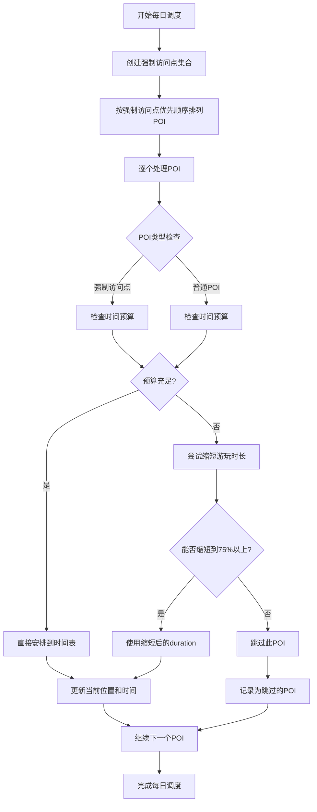

**图表来源**
- [src/utils/routePlanner.ts:1004-1050](file://src/utils/routePlanner.ts#L1004-L1050)

##### 强制访问点优先级系统

新的强制访问点优先级系统确保必游地点在任何情况下都能得到优先安排：

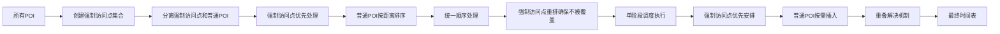

**图表来源**
- [src/utils/routePlanner.ts:794-806](file://src/utils/routePlanner.ts#L794-L806)

##### 增强的duration调整能力

系统现在支持动态duration调整，特别是针对强制访问点的优化：

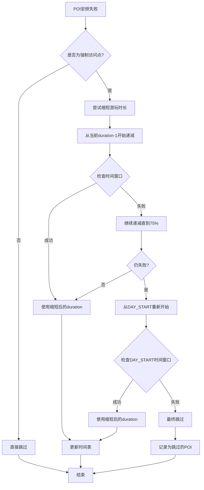

**图表来源**
- [src/utils/routePlanner.ts:1012-1040](file://src/utils/routePlanner.ts#L1012-L1040)

##### 两-opt优化过程集成

两-opt局部搜索算法与单阶段调度系统深度集成，确保优化后的路径能够适配强制访问点的优先安排：

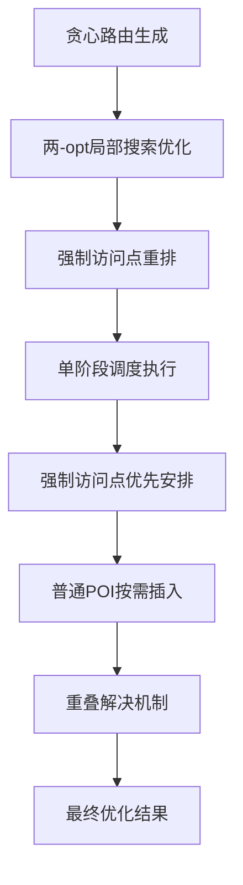

**图表来源**
- [src/utils/routePlanner.ts:981-986](file://src/utils/routePlanner.ts#L981-L986)

##### 购物POI数量约束系统

系统实现了严格的购物POI数量约束机制，确保旅行体验的多样性：

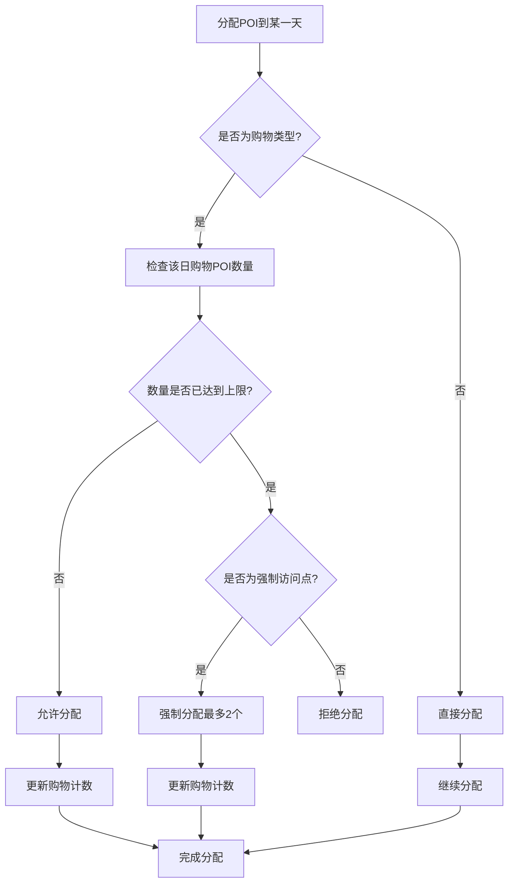

**图表来源**
- [src/utils/routePlanner.ts:826-830](file://src/utils/routePlanner.ts#L826-L830)

##### 类型多样性管理
系统现在包含专门的类型多样性管理机制，确保旅行行程中包含多种类型的景点，避免单一类型的过度集中。

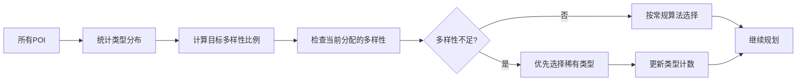

**图表来源**
- [src/utils/routePlanner.ts:814-819](file://src/utils/routePlanner.ts#L814-L819)

##### 时间偏好评分
引入时间偏好评分算法，根据用户的偏好时间段对POI进行评分调整，优化行程的时间安排。

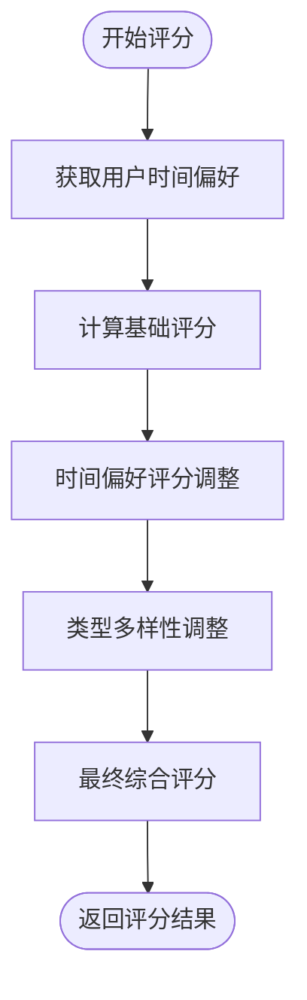

**图表来源**
- [src/utils/routePlanner.ts:215-236](file://src/utils/routePlanner.ts#L215-L236)

##### 自动填充晚餐功能
系统现在具备自动填充晚餐功能，智能识别用户行程中的晚餐时间窗口并插入合适的餐食POI。**更新**：晚餐时间调整为18:00，日程窗口扩展为14小时。

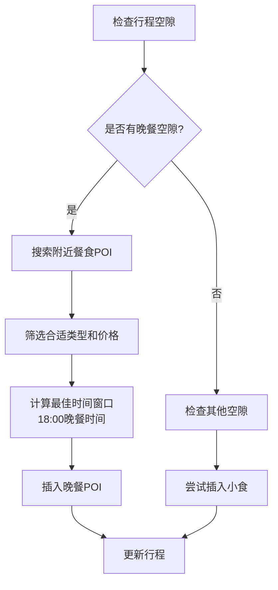

**图表来源**
- [src/utils/routePlanner.ts:1138-1199](file://src/utils/routePlanner.ts#L1138-L1199)

##### 步骤索引跟踪机制
新增步骤索引跟踪机制，防止购物作为行程的首项，确保合理的行程开始顺序。

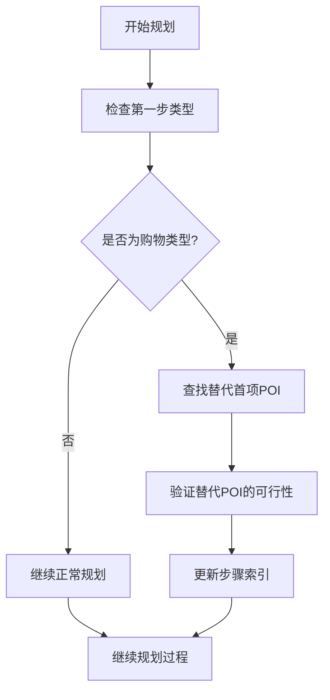

**图表来源**
- [src/utils/routePlanner.ts:219-222](file://src/utils/routePlanner.ts#L219-L222)

##### 优先级空隙填充算法
引入优先级空隙填充算法，智能填补行程中的时间空隙，提高行程利用效率。

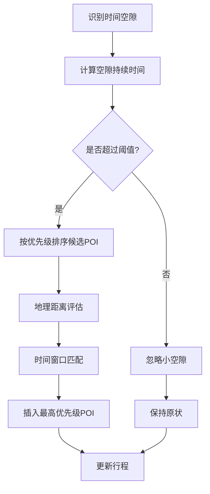

**图表来源**
- [src/utils/routePlanner.ts:1064-1116](file://src/utils/routePlanner.ts#L1064-L1116)

##### 时间预算优化
时间预算配置从70%调整为85%，提供更宽松的时间安排空间。

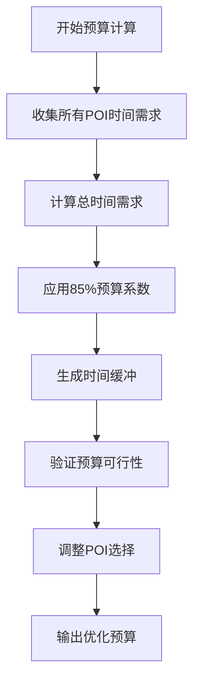

**图表来源**
- [src/utils/routePlanner.ts:792-793](file://src/utils/routePlanner.ts#L792-L793)

#### 强制访问点处理流程

系统现在支持mustVisitIds参数，实现以下处理流程：

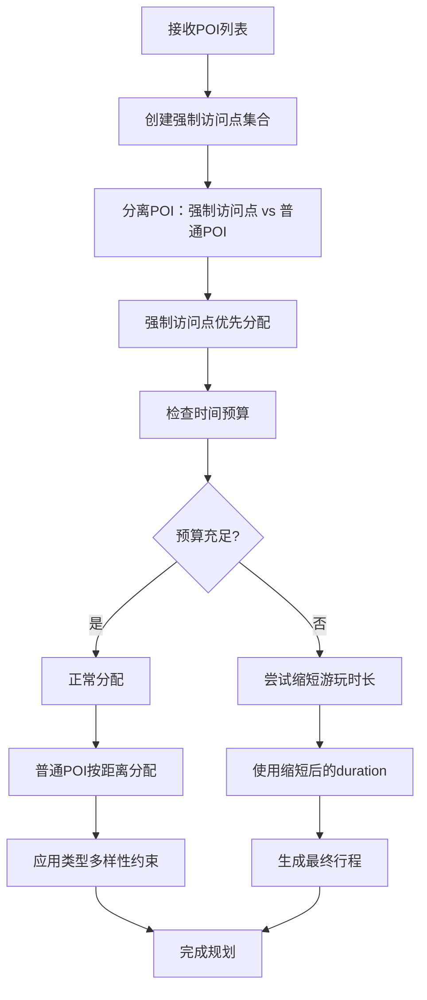

**图表来源**
- [src/utils/routePlanner.ts:796-806](file://src/utils/routePlanner.ts#L796-L806)

#### 时间约束处理
- **开放时间约束**：确保POI在开放时间内访问
- **扩展日程窗口**：08:00-22:00的14小时时间限制（原9小时）
- **反回溯偏置**：优先选择向终点方向移动的POI
- **时间偏好评分**：根据时间段偏好调整POI评分
- **强制访问点优先级**：强制访问点可绕过时间预算限制

**章节来源**
- [src/utils/routePlanner.ts:1-1317](file://src/utils/routePlanner.ts#L1-L1317)

### 交通估算模块 (transport.ts)

交通估算模块提供了两种交通方式的估算策略。

#### 启发式估算
基于距离的启发式方法，提供即时的交通估算：

- **步行**：< 0.8公里
- **地铁/公交**：0.8-5公里  
- **出租车**：> 5公里

#### OSRM真实路由
通过OSRM API获取真实的路线数据，包括驾驶时间和距离。

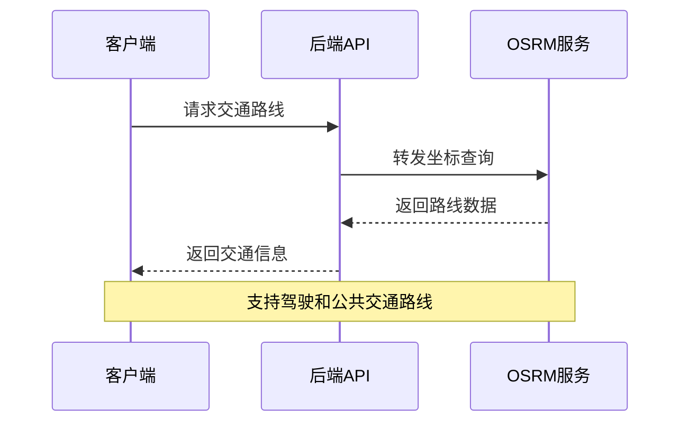

**图表来源**
- [src/utils/transport.ts:142-162](file://src/utils/transport.ts#L142-L162)

**章节来源**
- [src/utils/transport.ts:1-181](file://src/utils/transport.ts#L1-L181)

### 状态管理系统 (AppContext.tsx)

React Context提供了全局状态管理，支持旅行规划的完整生命周期。

#### 状态结构
```typescript
interface AppState {
  currentView: AppView
  previousView: AppView | null
  currentTrip: Trip | null
  selectedDayIndex: number
  showAttractionPanel: boolean
  selectedPlaceIds: string[]
  detailAttractionId: string | null
  preSelectedCityId: string | null
  detailHotelData: string | null
  savedTripId: string | null
}
```

#### 核心操作
- **旅行创建**：生成多日行程计划
- **日程管理**：添加、删除、重新排列行程项目
- **酒店管理**：设置每日住宿地点
- **预算计算**：自动计算总预算
- **类型多样性监控**：跟踪和管理行程中的类型分布
- **强制访问点管理**：支持用户指定必游地点

**章节来源**
- [src/context/AppContext.tsx:1-234](file://src/context/AppContext.tsx#L1-L234)

### 页面组件 (PlannerPage.tsx)

PlannerPage是旅行规划的核心页面，集成了所有规划功能。

#### 主要功能
- **行程概览**：显示完整的旅行计划
- **日程编辑**：支持拖拽和手动调整
- **保存功能**：将规划保存到服务器
- **响应式设计**：支持桌面和移动端
- **类型多样性指示器**：显示当前行程的类型分布情况
- **强制访问点标记**：高亮显示用户指定的必游地点

**章节来源**
- [src/pages/PlannerPage.tsx:1-388](file://src/pages/PlannerPage.tsx#L1-L388)

### 数据模型 (types/index.ts)

系统定义了完整的数据模型，确保前后端数据的一致性。

#### 核心数据类型
- **Attraction**：景点信息（名称、评分、位置、开放时间等）
- **ItineraryItem**：行程项目（开始时间、结束时间、费用等）
- **DayPlan**：每日计划（日期、项目列表、备注等）
- **Trip**：完整旅行计划（城市、日期范围、预算等）
- **POI**：增强的POI数据结构，包含mealType和seasonScore字段
- **PlanOptions**：规划选项，包含mustVisitIds参数

**章节来源**
- [src/types/index.ts:1-239](file://src/types/index.ts#L1-L239)

## 算法改进分析

### 单阶段顺序调度系统

系统现在实现了简化的单阶段顺序调度系统，移除了两阶段调度的复杂性：

#### 统一调度流程

强制访问点和普通POI现在在同一个调度流程中处理：

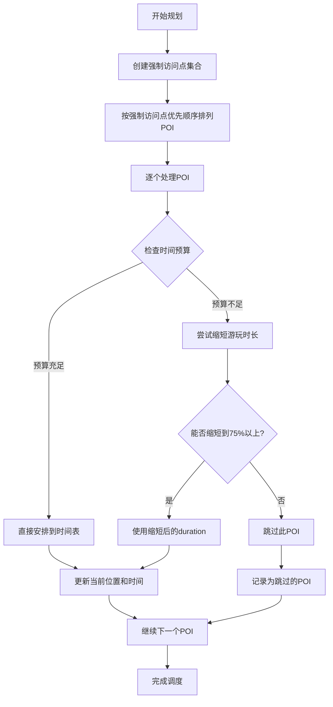

**图表来源**
- [src/utils/routePlanner.ts:1004-1050](file://src/utils/routePlanner.ts#L1004-L1050)

#### 强制访问点优先级系统

新的强制访问点优先级系统确保必游地点在任何情况下都能得到优先安排：

#### 实现原理
- **强制访问点集合**：将mustVisitIds转换为Set数据结构，提供O(1)查找性能
- **POI分离**：将POI分为强制访问点和普通POI两类
- **优先分配策略**：强制访问点优先分配到最佳日期，即使超出时间预算
- **购物限制**：强制访问点不受购物类POI每天最多1个的限制

#### 算法流程
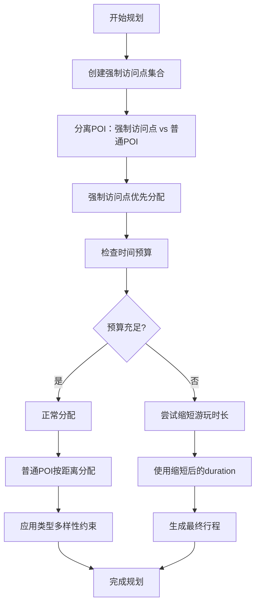

**图表来源**
- [src/utils/routePlanner.ts:796-806](file://src/utils/routePlanner.ts#L796-L806)

### 增强的duration调整能力

系统现在支持动态duration调整，特别是针对强制访问点的优化：

#### 动态调整策略

```mermaid
flowchart TD
A[POI安排失败] --> B{是否为强制访问点?}
B --> |否| C[直接跳过]
B --> |是| D[尝试缩短游玩时长]
D --> E[从当前duration-1开始递减]
E --> F{检查时间窗口}
F --> |成功| G[使用缩短后的duration]
F --> |失败| H[继续递减直到75%]
H --> I{仍失败?}
I --> |是| J[从DAY_START重新开始]
I --> |否| G
J --> K{检查DAY_START时间窗口}
K --> |成功| L[使用缩短后的duration]
K --> |失败| M[最终跳过]
G --> N[更新时间表]
L --> N
M --> O[记录为跳过的POI]
C --> P[结束]
N --> P
O --> P
```

**图表来源**
- [src/utils/routePlanner.ts:1012-1040](file://src/utils/routePlanner.ts#L1012-L1040)

### 两-opt优化过程集成

两-opt局部搜索算法现在与单阶段调度系统深度集成，确保优化后的路径能够适配强制访问点的优先安排：

#### 集成策略
- **路径优化后重排**：两-opt优化完成后，强制访问点被移动到序列前面
- **调度兼容性**：确保强制访问点在优化后的路径中仍能优先安排
- **时间约束保持**：优化过程保持原有的时间窗口约束

#### 实现细节
```mermaid
flowchart TD
A[贪心路由生成] --> B[两-opt局部搜索优化]
B --> C[强制访问点重排]
C --> D[单阶段调度执行]
D --> E[强制访问点优先安排]
E --> F[普通POI按需插入]
F --> G[重叠解决机制]
G --> H[最终优化结果]
```

**图表来源**
- [src/utils/routePlanner.ts:981-986](file://src/utils/routePlanner.ts#L981-L986)

### 购物POI数量约束系统

系统实现了严格的购物POI数量约束机制，确保旅行体验的多样性。这是本次更新的重要改进之一。

#### 实现原理
- **每日上限**：每个旅行日最多只能包含1个购物POI
- **强制访问点例外**：强制访问点的购物POI可以被分配，但最多2个
- **类型惩罚**：即使强制访问点，购物类型也会受到严重的类型多样性惩罚
- **分配优先级**：购物POI的分配优先级低于其他类型的POI

#### 约束规则
- **普通购物POI**：每天最多1个，超过则拒绝分配
- **强制访问点购物POI**：每天最多2个，超过则拒绝分配
- **类型多样性惩罚**：购物POI会被严重惩罚，避免过度集中在购物上
- **预算豁免**：强制访问点购物POI可绕过时间预算限制

#### 实现细节
```mermaid
flowchart TD
A[尝试分配POI] --> B{POI类型是否为购物?}
B --> |否| C[直接分配]
B --> |是| D{是否为强制访问点?}
D --> |否| E{该日购物数量是否已达上限?}
D --> |是| F{该日购物数量是否已达到强制访问点上限?}
E --> |是| G[拒绝分配]
E --> |否| H[允许分配]
F --> |是| I[拒绝分配]
F --> |否| J[允许分配最多2个]
C --> K[更新分配]
H --> K
I --> K
J --> K
G --> L[记录拒绝原因]
```

**图表来源**
- [src/utils/routePlanner.ts:826-830](file://src/utils/routePlanner.ts#L826-L830)

### 类型多样性管理机制

系统现在实现了智能的类型多样性管理，确保旅行行程中包含多种类型的景点，避免单一类型的过度集中。

#### 实现原理
- **类型统计**：实时跟踪当前行程中各类别的数量
- **目标分配**：根据旅行天数和总POI数量计算每类别的目标数量
- **优先级调整**：当某类别数量不足时，提高该类别的选择优先级
- **强制访问点保护**：强制访问点不会被计入类型多样性计算

#### 算法流程
```mermaid
flowchart TD
A[开始规划] --> B[统计现有类型分布]
B --> C[计算目标多样性比例]
C --> D[检查当前分配]
D --> E{是否达到多样性目标?}
E --> |是| F[按常规算法继续]
E --> |否| G[优先选择稀有类型]
G --> H[更新类型计数]
H --> D
F --> I[继续规划过程]
```

**图表来源**
- [src/utils/routePlanner.ts:814-819](file://src/utils/routePlanner.ts#L814-L819)

### 时间偏好评分算法

引入时间偏好评分算法，根据用户的偏好时间段对POI进行评分调整，优化行程的时间安排。

#### 评分机制
- **时间段匹配**：根据POI的开放时间与用户偏好的时间段匹配程度评分
- **时间窗口优化**：优先选择符合用户时间偏好的POI
- **强制访问点保护**：强制访问点不受时间偏好的限制

#### 实现细节
- **时间偏好权重**：用户可以设置不同时间段的偏好权重
- **评分衰减**：远离用户偏好的时间段评分会相应降低
- **平衡机制**：在时间偏好和地理距离之间找到平衡点

### 自动填充晚餐功能

系统现在具备智能的自动填充晚餐功能，能够识别用户行程中的晚餐时间窗口并插入合适的餐食POI。

#### 功能特性
- **时间窗口检测**：自动识别用户行程中的晚餐时间段（通常在18:00-21:00之间，现已扩展为14小时窗口）
- **餐食POI搜索**：在检测到的时间窗口附近搜索合适的餐食POI
- **类型和价格筛选**：根据用户的饮食偏好和预算筛选合适的餐食选项
- **智能插入**：将晚餐POI智能地插入到行程中，避免与其他活动冲突

#### 实现策略
- **地理 proximity**：优先选择距离用户当前位置较近的餐食POI
- **开放时间匹配**：确保餐食POI在晚餐时间段内开放
- **用户历史偏好**：考虑用户之前的选择偏好进行个性化推荐

### 步骤索引跟踪机制

新增步骤索引跟踪机制，防止购物作为行程的首项，确保合理的行程开始顺序。

#### 机制设计
- **首项验证**：检查行程的第一项是否为购物类型
- **智能替换**：如果发现购物作为首项，自动寻找替代的非购物POI
- **优先级评估**：评估替代POI的地理距离、开放时间和用户偏好
- **索引更新**：更新步骤索引以确保合理的行程顺序

#### 实现流程
```mermaid
flowchart TD
A[开始规划] --> B[检查第一步类型]
B --> C{是否为购物类型?}
C --> |是| D[查找替代首项POI]
C --> |否| E[继续正常规划]
D --> F[评估替代POI优先级]
F --> G[验证地理位置合理性]
G --> H[检查开放时间匹配]
H --> I[更新步骤索引]
E --> J[继续规划过程]
I --> J
```

**图表来源**
- [src/utils/routePlanner.ts:219-222](file://src/utils/routePlanner.ts#L219-L222)

### 优先级空隙填充算法

引入优先级空隙填充算法，智能填补行程中的时间空隙，提高行程利用效率。

#### 算法设计
- **空隙检测**：识别行程中的时间空隙，通常指两个连续活动之间的间隔
- **阈值评估**：只有超过预设阈值的空隙才会被填充
- **优先级排序**：根据地理距离、用户偏好和开放时间对候选POI进行排序
- **智能插入**：将最高优先级的POI插入到最合适的时间窗口

#### 实现策略
- **地理距离优化**：优先选择距离当前位置较近的POI
- **时间窗口匹配**：确保插入的POI在空隙时间段内可访问
- **用户偏好融合**：考虑用户的兴趣偏好和历史选择模式

### 时间预算优化

时间预算配置从70%调整为85%，提供更宽松的时间安排空间。

#### 配置调整
- **预算系数提升**：从70%增加到85%，提供更大的时间缓冲
- **行程灵活性增强**：允许更多的意外停留和交通等待时间
- **强制访问点保护**：强制访问点可绕过时间预算限制

#### 实现影响
- **POI选择策略**：在预算宽松的情况下，可以考虑更多样化的POI
- **路径优化**：允许更灵活的路线规划，减少严格的时间约束
- **冲突处理**：在时间冲突时有更大的调整空间

### AI推荐系统增强

AI推荐系统现在支持新的POI属性和增强的评分机制。

#### 新增功能
- **mealType字段**：支持早餐、午餐、晚餐和小食的分类
- **seasonScore字段**：基于季节因素的评分机制
- **类型多样性保证**：确保推荐结果包含多种类型的景点
- **时间偏好评分**：根据时间段偏好优化推荐结果
- **强制访问点支持**：支持用户指定必游地点

#### 推荐流程
```mermaid
flowchart TD
A[用户输入] --> B[生成推荐请求]
B --> C[调用Qwen API]
C --> D[接收原始POI数据]
D --> E[类型多样性检查]
E --> F[时间偏好评分]
F --> G[mealType分类]
G --> H[seasonScore评分]
H --> I[强制访问点标记]
I --> J[去重和合并]
J --> K[返回最终推荐]
```

**图表来源**
- [server/qwen.ts:257-264](file://server/qwen.ts#L257-L264)
- [server/dedup.ts:492](file://server/dedup.ts#L492)

**章节来源**
- [server/qwen.ts:164-264](file://server/qwen.ts#L164-L264)
- [server/dedup.ts:492](file://server/dedup.ts#L492)

## 依赖关系分析

系统使用现代化的技术栈，确保良好的性能和可维护性。

```mermaid
graph TB
subgraph "前端依赖"
React[react@18.3.1]
Router[react-router-dom@7.1.1]
UI[lucide-react@0.468.0]
Tailwind[tailwindcss@3.4.17]
Motion[framer-motion@11.15.0]
end
subgraph "后端依赖"
Express[express@5.2.1]
Cors[cors@2.8.6]
Dotenv[dotenv@17.3.1]
BetterSqlite[better-sqlite3@12.8.0]
end
subgraph "开发工具"
Vite[vite@6.0.5]
TypeScript[typescript@5.6.2]
TSX[tsx@4.21.0]
end
React --> UI
Express --> Cors
Express --> Dotenv
BetterSqlite --> SQLite[SQLite数据库]
```

**图表来源**
- [package.json:26-58](file://package.json#L26-L58)

**章节来源**
- [package.json:1-59](file://package.json#L1-L59)

## 性能考虑

### 缓存策略
系统实现了多层次的缓存策略，平衡数据新鲜度和性能：

1. **内存缓存**：热点数据的快速访问
2. **数据库缓存**：持久化存储和重启恢复
3. **API缓存**：减少对外部服务的调用频率

### 异步处理
- **后台刷新**：避免阻塞用户界面
- **轮询机制**：渐进式数据更新
- **超时控制**：防止长时间挂起

### 算法优化
- **贪心算法**：快速生成初始解
- **两-opt改进**：局部搜索优化
- **地理索引**：加速距离计算
- **类型多样性优化**：减少重复计算
- **时间偏好评分缓存**：避免重复计算
- **优先级空隙填充**：智能填补时间空隙
- **步骤索引跟踪**：防止不合理行程开始
- **强制访问点集合查找**：使用Set数据结构提供O(1)查找性能
- **购物POI约束检查**：使用计数器避免重复扫描
- **单阶段调度系统**：简化强制访问点处理流程
- **动态duration调整**：增强must-visit POI的适应性
- **两-opt优化集成**：提升路径质量与调度兼容性

### 内存管理
- **智能去重**：使用去重服务避免重复数据
- **批量处理**：支持批量POI处理和评分
- **资源清理**：及时清理临时数据和缓存

## 故障排除指南

### 常见问题及解决方案

#### AI推荐数据加载失败
**症状**：POI推荐无法加载或显示错误
**原因**：
- API密钥配置错误
- 网络连接问题
- 缓存数据损坏
- 类型多样性算法异常

**解决方案**：
1. 检查环境变量中的API密钥
2. 验证网络连接
3. 清除缓存并重新加载
4. 检查类型多样性配置
5. 验证去重服务状态

#### 路线规划异常
**症状**：生成的路线不合理或时间冲突
**原因**：
- POI数据缺失
- 时间窗口设置不当
- 地理距离计算错误
- 类型多样性算法故障
- 跳过POIs机制异常
- 步骤索引跟踪错误
- **强制访问点调度系统异常**
- **单阶段调度算法故障**
- **两-opt优化过程错误**
- **购物POI约束异常**

**解决方案**：
1. 验证POI数据的完整性
2. 检查开放时间设置
3. 确认坐标数据的准确性
4. 检查类型多样性配置
5. 验证跳过POIs机制状态
6. 检查步骤索引跟踪逻辑
7. **验证单阶段调度系统**
8. **检查强制访问点优先级处理**
9. **验证两-opt优化过程集成**
10. **检查购物POI数量约束逻辑**

#### 交通估算不准确
**症状**：显示的交通时间与实际不符
**原因**：
- OSRM服务不可用
- 坐标数据错误
- 交通状况变化
- 估算算法失效

**解决方案**：
1. 检查OSRM服务状态
2. 验证起点终点坐标
3. 使用启发式估算作为后备方案
4. 检查交通估算配置

#### 类型多样性管理问题
**症状**：行程中某些类型的POI过多或过少
**原因**：
- 类型统计错误
- 分配算法故障
- 用户偏好设置问题
- **强制访问点影响类型统计**

**解决方案**：
1. 检查类型统计逻辑
2. 验证分配算法
3. 重新设置用户偏好
4. **确认强制访问点未被计入类型统计**

#### 自动填充晚餐功能异常
**症状**：晚餐没有自动填充或填充错误
**原因**：
- 时间窗口检测失败
- 餐食POI搜索异常
- 类型和价格筛选错误
- 晚餐时间窗口配置错误

**解决方案**：
1. 检查时间窗口设置（18:00晚餐时间）
2. 验证餐食POI数据
3. 调整筛选条件
4. 手动添加晚餐POI
5. 检查日程窗口扩展配置

#### 步骤索引跟踪机制故障
**症状**：购物作为行程首项或行程顺序不合理
**原因**：
- 步骤索引跟踪逻辑错误
- 首项验证失败
- 替代POI选择不当

**解决方案**：
1. 检查步骤索引跟踪逻辑
2. 验证首项类型检查
3. 重新配置替代POI选择策略
4. 手动调整行程开始顺序

#### 优先级空隙填充算法异常
**症状**：行程中的时间空隙未被合理填补
**原因**：
- 空隙检测阈值设置不当
- 优先级排序算法故障
- 候选POI筛选条件过严

**解决方案**：
1. 检查空隙检测阈值
2. 验证优先级排序逻辑
3. 调整候选POI筛选条件
4. 手动填补时间空隙

#### 时间预算配置问题
**症状**：行程过于紧凑或过于宽松
**原因**：
- 预算系数配置错误
- POI选择策略不当
- 时间窗口设置问题
- **强制访问点绕过预算限制**

**解决方案**：
1. 检查预算系数（85%配置）
2. 验证POI选择策略
3. 调整时间窗口设置
4. **确认强制访问点正确绕过预算限制**

#### 强制访问点调度系统问题
**症状**：指定的必游地点未被正确处理
**原因**：
- mustVisitIds参数格式错误
- POI ID不匹配
- 参数传递问题
- **调度系统实现错误**

**解决方案**：
1. **验证mustVisitIds数组格式**
2. **检查POI ID的有效性**
3. **确认参数正确传递到规划函数**
4. **验证POI数据中是否存在指定的ID**
5. **检查单阶段调度系统实现**
6. **验证强制访问点优先级逻辑**

#### 单阶段调度算法异常
**症状**：强制访问点未被优先安排或POI分配失败
**原因**：
- 强制访问点优先级逻辑错误
- duration调整算法故障
- 时间槽计算错误

**解决方案**：
1. **检查强制访问点优先级处理逻辑**
2. **验证duration动态调整算法**
3. **检查时间槽计算和比较逻辑**
4. **确认强制访问点重排机制**

#### 两-opt优化过程问题
**症状**：路径优化后强制访问点顺序被打乱
**原因**：
- 两-opt优化算法错误
- 强制访问点重排逻辑故障
- 调度系统集成问题

**解决方案**：
1. **检查两-opt局部搜索实现**
2. **验证强制访问点重排逻辑**
3. **确认调度系统与优化过程的集成**
4. **测试优化前后的路径兼容性**

#### 购物POI数量约束问题
**症状**：购物POI分配异常或数量超出限制
**原因**：
- 购物POI计数逻辑错误
- 强制访问点购物POI处理异常
- 类型多样性惩罚过重

**解决方案**：
1. **检查购物POI计数器逻辑**
2. **验证强制访问点购物POI分配规则**
3. **调整类型多样性惩罚权重**
4. **确认购物POI约束检查机制**

**章节来源**
- [server/index.ts:753-757](file://server/index.ts#L753-L757)
- [src/utils/aiRecommend.ts:85-93](file://src/utils/aiRecommend.ts#L85-L93)

## 结论

智能旅行规划引擎经过重大算法改进，现在具备更强大的功能和更好的用户体验。通过新增的单阶段顺序调度系统、增强的强制访问点优先级系统、动态duration调整能力、两-opt优化过程集成、增强的重叠解决机制，以及重要的购物POI数量约束系统，系统能够为用户提供更加个性化和智能化的旅行规划服务。

### 技术优势
- **AI集成**：深度整合Qwen API，提供个性化的智能推荐
- **算法优化**：高效的路线规划算法，确保生成高质量的旅行行程
- **智能多样性**：自动管理行程中的类型分布，避免单调
- **时间优化**：基于用户偏好的时间安排优化，支持扩展的日程窗口
- **灵活调整**：支持跳过POIs等灵活的行程调整机制
- **智能填充**：优先级空隙填充算法提高行程效率
- **单阶段调度系统**：简化的统一调度流程，确保必游地点优先安排
- **动态duration调整**：增强的强制访问点适应性
- **两-opt路径优化**：集成的局部搜索算法，提升路径质量
- **购物约束系统**：严格的购物POI数量限制确保旅行体验多样性
- **用户体验**：直观的界面设计和流畅的交互体验
- **可扩展性**：模块化的架构设计，便于功能扩展和维护

### 重大改进总结
- **单阶段顺序调度系统**：移除两阶段调度的复杂性，简化强制访问点处理
- **强制访问点优先级**：确保必游地点在任何情况下都能优先安排
- **动态duration调整**：增强must-visit POI的适应性，支持75%以上的时长缩短
- **两-opt优化集成**：局部搜索算法与调度系统的深度集成
- **增强重叠解决机制**：统一的冲突解决流程
- **购物POI约束优化**：强制访问点的特殊处理和数量限制
- **时间预算配置**：85%预算配置提供更好的时间缓冲
- **晚餐时间优化**：17:30调整为18:00，适应用户晚餐饮食习惯
- **日程窗口扩展**：从9小时扩展为14小时，提供更宽松的时间安排
- **地理智能餐食分配**：基于地理位置的智能餐食POI推荐
- **步骤索引跟踪**：防止购物作为行程首项，确保合理开始顺序

### 未来发展方向
- **机器学习增强**：基于用户行为的个性化推荐
- **实时数据集成**：天气、交通状况等实时信息
- **多语言支持**：国际化旅行规划服务
- **移动端优化**：原生移动应用开发
- **社交功能**：支持多人协作规划
- **预算管理**：更精细的预算控制和跟踪
- **强制访问点智能建议**：基于用户历史行为的必游地点建议
- **购物体验优化**：智能推荐购物地点，避免过度集中
- **调度系统扩展**：支持更多类型的强制访问点场景
- **算法性能优化**：进一步提升大规模数据处理能力

该系统为智能旅行规划领域提供了一个优秀的技术参考，展示了现代Web应用开发的最佳实践。通过持续的算法改进和功能增强，系统将继续为用户提供卓越的旅行规划体验。