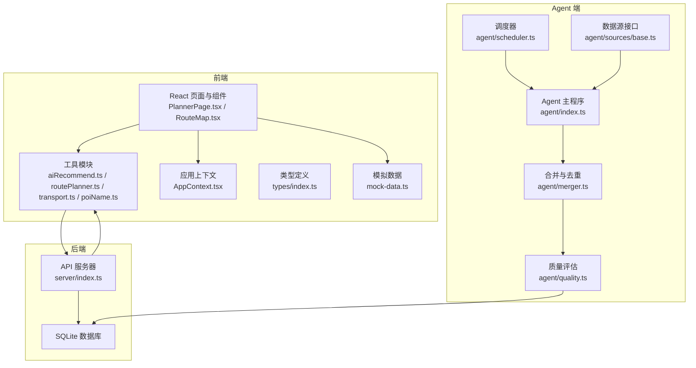
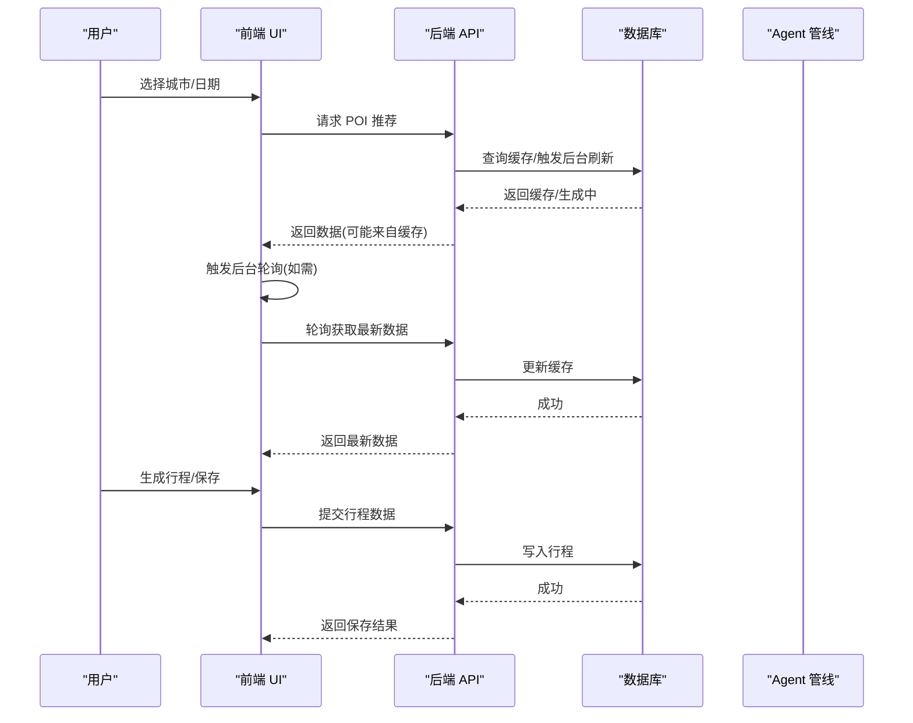
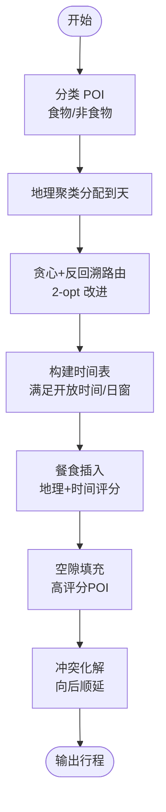
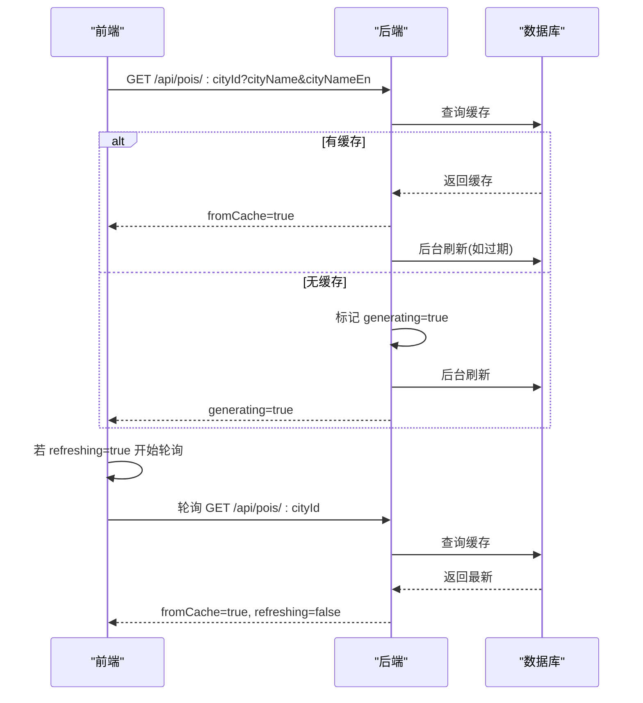
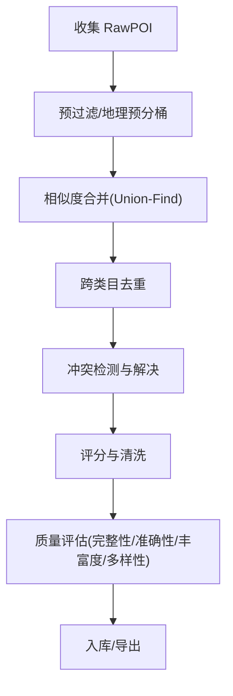
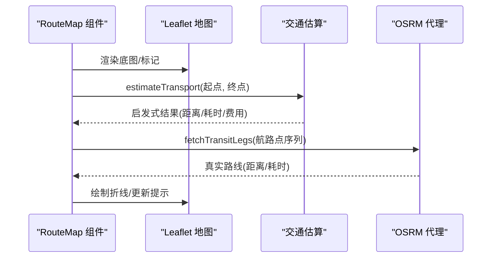
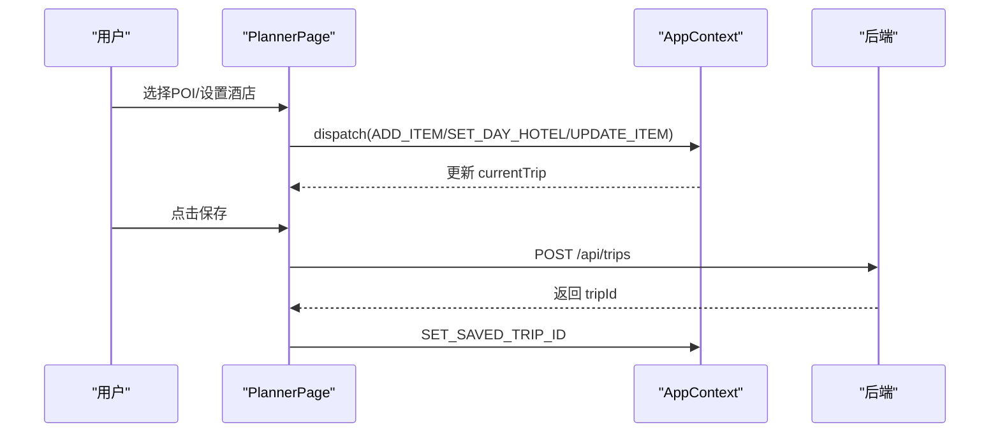
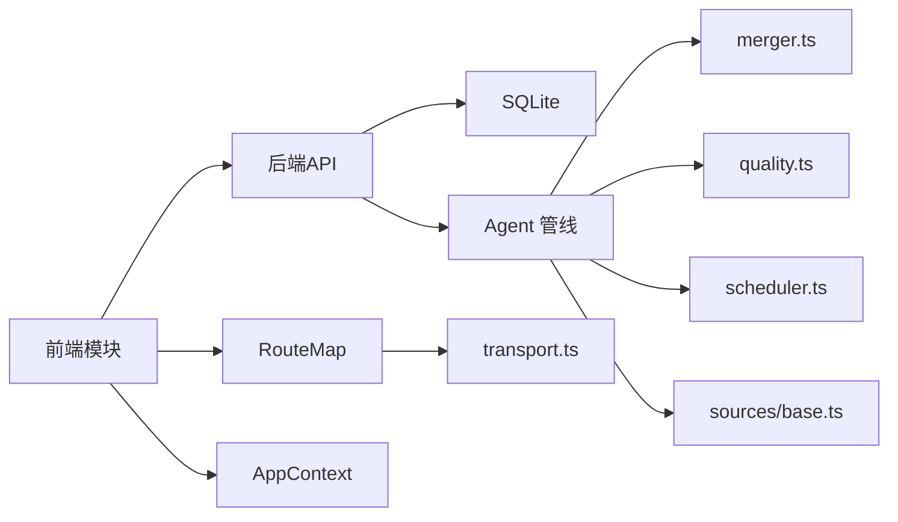

# 核心功能特性

<cite>
**本文引用的文件**
- [src/utils/aiRecommend.ts](file://src/utils/aiRecommend.ts)
- [src/utils/routePlanner.ts](file://src/utils/routePlanner.ts)
- [src/utils/transport.ts](file://src/utils/transport.ts)
- [src/utils/poiName.ts](file://src/utils/poiName.ts)
- [src/types/index.ts](file://src/types/index.ts)
- [server/index.ts](file://server/index.ts)
- [agent/index.ts](file://agent/index.ts)
- [agent/merger.ts](file://agent/merger.ts)
- [agent/quality.ts](file://agent/quality.ts)
- [agent/scheduler.ts](file://agent/scheduler.ts)
- [agent/sources/base.ts](file://agent/sources/base.ts)
- [src/components/RouteMap.tsx](file://src/components/RouteMap.tsx)
- [src/pages/PlannerPage.tsx](file://src/pages/PlannerPage.tsx)
- [src/data/mock-data.ts](file://src/data/mock-data.ts)
- [src/context/AppContext.tsx](file://src/context/AppContext.tsx)
</cite>

## 目录
1. [引言](#引言)
2. [项目结构](#项目结构)
3. [核心组件](#核心组件)
4. [架构总览](#架构总览)
5. [详细组件分析](#详细组件分析)
6. [依赖关系分析](#依赖关系分析)
7. [性能考量](#性能考量)
8. [故障排查指南](#故障排查指南)
9. [结论](#结论)
10. [附录](#附录)

## 引言
本文件面向旅行规划Demo项目，系统梳理并阐述核心功能特性，重点覆盖以下方面：
- 智能旅行规划引擎：基于AI推荐与地理聚类、时间窗约束、餐食插入策略的行程生成算法
- 多源数据采集与质量评估：Agent端多数据源采集、合并去重、质量评分与清洗
- 实时地图展示：POI标记、路线绘制、导航估算与真实OSRM路线
- 用户交互：行程创建、编辑、保存与分享、预算管理与时间安排
- 使用示例与调用方式：通过API与前端模块的参数配置与调用路径

## 项目结构
项目采用前后端分离架构，前端使用React + TypeScript，后端使用Express + SQLite，Agent端负责离线数据采集与处理。

**图表来源**
- [server/index.ts:1-790](file://server/index.ts#L1-L790)
- [agent/index.ts:1-1132](file://agent/index.ts#L1-L1132)
- [agent/merger.ts:1-1026](file://agent/merger.ts#L1-L1026)
- [agent/quality.ts:1-344](file://agent/quality.ts#L1-L344)
- [agent/scheduler.ts:1-98](file://agent/scheduler.ts#L1-L98)
- [agent/sources/base.ts:1-252](file://agent/sources/base.ts#L1-L252)
- [src/utils/aiRecommend.ts:1-251](file://src/utils/aiRecommend.ts#L1-L251)
- [src/utils/routePlanner.ts:1-1142](file://src/utils/routePlanner.ts#L1-L1142)
- [src/utils/transport.ts:1-181](file://src/utils/transport.ts#L1-L181)
- [src/components/RouteMap.tsx:1-180](file://src/components/RouteMap.tsx#L1-L180)
- [src/context/AppContext.tsx:1-234](file://src/context/AppContext.tsx#L1-L234)
- [src/data/mock-data.ts:1-810](file://src/data/mock-data.ts#L1-L810)

**章节来源**
- [server/index.ts:1-790](file://server/index.ts#L1-L790)
- [agent/index.ts:1-1132](file://agent/index.ts#L1-L1132)
- [src/utils/aiRecommend.ts:1-251](file://src/utils/aiRecommend.ts#L1-L251)
- [src/utils/routePlanner.ts:1-1142](file://src/utils/routePlanner.ts#L1-L1142)
- [src/utils/transport.ts:1-181](file://src/utils/transport.ts#L1-L181)
- [src/components/RouteMap.tsx:1-180](file://src/components/RouteMap.tsx#L1-L180)
- [src/context/AppContext.tsx:1-234](file://src/context/AppContext.tsx#L1-L234)
- [src/data/mock-data.ts:1-810](file://src/data/mock-data.ts#L1-L810)

## 核心组件
- 智能旅行规划引擎：基于地理聚类、反回溯贪心、2-opt改进、餐食插入与时间窗约束的多日行程生成
- AI推荐系统：前端通过API获取POI推荐，支持缓存策略与后台刷新
- 多源数据采集：Agent端统一接口、地理分桶、相似度合并、跨类目去重、质量评估
- 实时地图展示：Leaflet地图、POI标记、路线绘制、导航估算与真实OSRM路线
- 用户交互：行程创建/编辑/保存/分享、预算管理、时间安排
- 辅助工具：名称显示、交通估算、类型定义

**章节来源**
- [src/utils/routePlanner.ts:1-1142](file://src/utils/routePlanner.ts#L1-L1142)
- [src/utils/aiRecommend.ts:1-251](file://src/utils/aiRecommend.ts#L1-L251)
- [agent/index.ts:1-1132](file://agent/index.ts#L1-L1132)
- [agent/merger.ts:1-1026](file://agent/merger.ts#L1-L1026)
- [agent/quality.ts:1-344](file://agent/quality.ts#L1-L344)
- [src/components/RouteMap.tsx:1-180](file://src/components/RouteMap.tsx#L1-L180)
- [src/utils/transport.ts:1-181](file://src/utils/transport.ts#L1-L181)
- [src/utils/poiName.ts:1-37](file://src/utils/poiName.ts#L1-L37)
- [src/types/index.ts:1-239](file://src/types/index.ts#L1-L239)

## 架构总览
整体架构由“Agent端数据管线 + 后端API + 前端UI”构成，数据流如下：

**图表来源**
- [server/index.ts:108-160](file://server/index.ts#L108-L160)
- [src/utils/aiRecommend.ts:44-94](file://src/utils/aiRecommend.ts#L44-L94)
- [src/pages/PlannerPage.tsx:26-52](file://src/pages/PlannerPage.tsx#L26-L52)

**章节来源**
- [server/index.ts:108-160](file://server/index.ts#L108-L160)
- [src/utils/aiRecommend.ts:1-251](file://src/utils/aiRecommend.ts#L1-L251)
- [src/pages/PlannerPage.tsx:1-388](file://src/pages/PlannerPage.tsx#L1-L388)

## 详细组件分析

### 智能旅行规划引擎（行程生成）
- 地理聚类：按酒店位置初始化聚类中心，将POI分配到最近的天，保证每日活动地理紧凑
- 路线规划：贪心+反回溯偏置，结合起点/终点酒店，最小化折返；随后2-opt局部搜索优化
- 时间窗约束：考虑开放时间、每日窗口(08:00–21:00)，避免在非营业时段安排
- 餐食插入：按地理邻近与时间偏差综合评分，早餐靠近酒店/首游，午餐居中，晚餐靠近末游/酒店
- 空隙填充：检测空闲时间段，自动填充高评分POI，提升日程密度
- 冲突化解：相邻POI时间重叠时，向后顺延至最早可行时刻

**图表来源**
- [src/utils/routePlanner.ts:652-671](file://src/utils/routePlanner.ts#L652-L671)
- [src/utils/routePlanner.ts:682-764](file://src/utils/routePlanner.ts#L682-L764)
- [src/utils/routePlanner.ts:169-236](file://src/utils/routePlanner.ts#L169-L236)
- [src/utils/routePlanner.ts:245-289](file://src/utils/routePlanner.ts#L245-L289)
- [src/utils/routePlanner.ts:291-411](file://src/utils/routePlanner.ts#L291-L411)
- [src/utils/routePlanner.ts:521-617](file://src/utils/routePlanner.ts#L521-L617)
- [src/utils/routePlanner.ts:619-650](file://src/utils/routePlanner.ts#L619-L650)

**章节来源**
- [src/utils/routePlanner.ts:1-1142](file://src/utils/routePlanner.ts#L1-L1142)

### AI推荐系统与POI搜索
- 前端客户端：封装POI推荐请求，支持轮询后台刷新，自动处理缓存/生成中状态
- 后端API：三层缓存策略（新鲜/陈旧/过期），过期时触发后台从Qwen刷新，同时返回旧数据
- 数据来源：AI生成的POI（含seasonalIndex、mealType等），回退到模拟数据
- 顶部N筛选：按类别截取Top-N，便于展示与选择

**图表来源**
- [server/index.ts:108-144](file://server/index.ts#L108-L144)
- [src/utils/aiRecommend.ts:44-94](file://src/utils/aiRecommend.ts#L44-L94)
- [src/utils/aiRecommend.ts:170-205](file://src/utils/aiRecommend.ts#L170-L205)

**章节来源**
- [src/utils/aiRecommend.ts:1-251](file://src/utils/aiRecommend.ts#L1-L251)
- [server/index.ts:108-160](file://server/index.ts#L108-L160)
- [src/data/mock-data.ts:744-810](file://src/data/mock-data.ts#L744-L810)

### 多源数据采集与质量评估
- 统一接口：抽象数据源采集器，定义RawPOI与POI结构，支持三名系统、双语地址、月度指数、最佳季节
- 采集流程：过滤无效POI、地理预分桶、相似度合并、跨类目去重、冲突检测与解决、评分与清洗
- 质量评估：完整性、准确性、丰富度、多样性维度评分，自动修复与丢弃策略
- 调度策略：基于热度、新鲜度、质量缺口、季节相关度与失败补偿计算优先级

**图表来源**
- [agent/merger.ts:492-790](file://agent/merger.ts#L492-L790)
- [agent/quality.ts:189-293](file://agent/quality.ts#L189-L293)
- [agent/scheduler.ts:18-87](file://agent/scheduler.ts#L18-L87)
- [agent/sources/base.ts:40-177](file://agent/sources/base.ts#L40-L177)

**章节来源**
- [agent/index.ts:1-1132](file://agent/index.ts#L1-L1132)
- [agent/merger.ts:1-1026](file://agent/merger.ts#L1-L1026)
- [agent/quality.ts:1-344](file://agent/quality.ts#L1-L344)
- [agent/scheduler.ts:1-98](file://agent/scheduler.ts#L1-L98)
- [agent/sources/base.ts:1-252](file://agent/sources/base.ts#L1-L252)

### 实时地图展示与导航
- 地图组件：基于Leaflet，支持酒店与POI标记、弹窗、路线折线、自适应缩放与图例
- 交通估算：启发式估算（步行/地铁/公交/打车）与OSRM真实路线对比
- 路线构建：按酒店起止点与POI顺序构建航路点，支持实时OSRM查询

**图表来源**
- [src/components/RouteMap.tsx:79-179](file://src/components/RouteMap.tsx#L79-L179)
- [src/utils/transport.ts:56-131](file://src/utils/transport.ts#L56-L131)
- [src/utils/transport.ts:142-162](file://src/utils/transport.ts#L142-L162)
- [server/index.ts:287-308](file://server/index.ts#L287-L308)

**章节来源**
- [src/components/RouteMap.tsx:1-180](file://src/components/RouteMap.tsx#L1-L180)
- [src/utils/transport.ts:1-181](file://src/utils/transport.ts#L1-L181)
- [server/index.ts:287-308](file://server/index.ts#L287-L308)

### 用户交互与行程管理
- 行程创建/编辑：通过AppContext维护行程状态，支持增删改POI、设置酒店、排序、笔记
- 保存与分享：登录态下保存行程到后端，支持发布为游记
- 预算管理：自动汇总每日与总预算，支持移动端/桌面端面板切换
- 时间安排：按日选择、左右切换、移动端水平滚动

**图表来源**
- [src/pages/PlannerPage.tsx:26-52](file://src/pages/PlannerPage.tsx#L26-L52)
- [src/context/AppContext.tsx:83-213](file://src/context/AppContext.tsx#L83-L213)
- [server/index.ts:438-458](file://server/index.ts#L438-L458)

**章节来源**
- [src/pages/PlannerPage.tsx:1-388](file://src/pages/PlannerPage.tsx#L1-L388)
- [src/context/AppContext.tsx:1-234](file://src/context/AppContext.tsx#L1-L234)
- [server/index.ts:411-556](file://server/index.ts#L411-L556)

### 名称显示与类型工具
- 名称显示：中文名优先，若原名不同则附加原名；短名场景仅显示中文名
- 类型工具：提供类型标签与图标映射，辅助UI渲染

**章节来源**
- [src/utils/poiName.ts:1-37](file://src/utils/poiName.ts#L1-L37)
- [src/data/mock-data.ts:720-742](file://src/data/mock-data.ts#L720-L742)

## 依赖关系分析
- 前端依赖后端API提供POI与行程数据；地图组件依赖交通估算模块；行程页面依赖应用上下文
- 后端依赖SQLite存储POI/行程/用户信息；Agent端依赖多数据源API与本地数据库
- Agent端内部：采集器接口抽象、合并去重、质量评估、调度器相互协作

**图表来源**
- [src/components/RouteMap.tsx:1-180](file://src/components/RouteMap.tsx#L1-L180)
- [src/utils/transport.ts:1-181](file://src/utils/transport.ts#L1-L181)
- [src/context/AppContext.tsx:1-234](file://src/context/AppContext.tsx#L1-L234)
- [server/index.ts:1-790](file://server/index.ts#L1-L790)
- [agent/index.ts:1-1132](file://agent/index.ts#L1-L1132)
- [agent/merger.ts:1-1026](file://agent/merger.ts#L1-L1026)
- [agent/quality.ts:1-344](file://agent/quality.ts#L1-L344)
- [agent/scheduler.ts:1-98](file://agent/scheduler.ts#L1-L98)
- [agent/sources/base.ts:1-252](file://agent/sources/base.ts#L1-L252)

**章节来源**
- [src/types/index.ts:1-239](file://src/types/index.ts#L1-L239)
- [server/index.ts:1-790](file://server/index.ts#L1-L790)
- [agent/index.ts:1-1132](file://agent/index.ts#L1-L1132)

## 性能考量
- 前端缓存与轮询：后台刷新时返回旧数据并持续轮询，避免长时间等待
- 地图渲染：动态尺寸容器需先invalidateSize再fitBounds，减少首次渲染抖动
- 路线计算：贪心+2-opt在POI规模可控时可快速收敛；大规模场景建议分批或增量优化
- 数据采集：地理预分桶与相似度阈值降低比较次数；合并去重采用并查集与邻域桶优化
- API限流：后端对OSRM代理设置超时与错误兜底，避免阻塞

[本节为通用指导，无需特定文件引用]

## 故障排查指南
- POI推荐无数据或报错
  - 检查后端是否配置API Key与缓存状态
  - 前端检查轮询是否正常，错误信息是否返回
  - 参考：[server/index.ts:108-160](file://server/index.ts#L108-L160)、[src/utils/aiRecommend.ts:54-94](file://src/utils/aiRecommend.ts#L54-L94)
- 地图不显示或标记错位
  - 确认容器尺寸变化后调用invalidateSize
  - 检查坐标精度与边界计算
  - 参考：[src/components/RouteMap.tsx:45-57](file://src/components/RouteMap.tsx#L45-L57)
- 交通估算与OSRM不一致
  - 启发式估算用于即时渲染，真实路线通过OSRM代理获取
  - 参考：[src/utils/transport.ts:56-131](file://src/utils/transport.ts#L56-L131)、[server/index.ts:287-308](file://server/index.ts#L287-L308)
- 行程保存失败
  - 确认登录态与鉴权头，检查后端返回的错误码
  - 参考：[src/pages/PlannerPage.tsx:26-52](file://src/pages/PlannerPage.tsx#L26-L52)、[server/index.ts:438-458](file://server/index.ts#L438-L458)

**章节来源**
- [server/index.ts:108-160](file://server/index.ts#L108-L160)
- [src/utils/aiRecommend.ts:54-94](file://src/utils/aiRecommend.ts#L54-L94)
- [src/components/RouteMap.tsx:45-57](file://src/components/RouteMap.tsx#L45-L57)
- [src/utils/transport.ts:56-131](file://src/utils/transport.ts#L56-L131)
- [src/pages/PlannerPage.tsx:26-52](file://src/pages/PlannerPage.tsx#L26-L52)

## 结论
本项目通过“Agent端高质量数据管线 + 后端三层缓存API + 前端智能行程引擎”的组合，实现了从POI采集、质量评估到智能行程生成与可视化展示的完整闭环。AI推荐与地理聚类、时间窗约束、餐食与空隙策略共同提升了行程的合理性与用户体验；地图与导航模块提供了直观的可视化与实时路线能力；用户交互与预算管理确保了行程的可编辑性与可分享性。

[本节为总结性内容，无需特定文件引用]

## 附录

### 使用示例与调用方式
- 获取POI推荐
  - 前端调用：[src/utils/aiRecommend.ts:44-94](file://src/utils/aiRecommend.ts#L44-L94)
  - 后端接口：[server/index.ts:108-144](file://server/index.ts#L108-L144)
- 生成行程
  - 前端调用：[src/utils/routePlanner.ts:672-676](file://src/utils/routePlanner.ts#L672-L676)
- 保存行程
  - 前端调用：[src/pages/PlannerPage.tsx:26-52](file://src/pages/PlannerPage.tsx#L26-L52)
  - 后端接口：[server/index.ts:438-458](file://server/index.ts#L438-L458)
- 地图与导航
  - 地图组件：[src/components/RouteMap.tsx:79-179](file://src/components/RouteMap.tsx#L79-L179)
  - 交通估算：[src/utils/transport.ts:56-131](file://src/utils/transport.ts#L56-L131)
  - OSRM代理：[server/index.ts:287-308](file://server/index.ts#L287-L308)
- 名称显示
  - [src/utils/poiName.ts:20-36](file://src/utils/poiName.ts#L20-L36)

**章节来源**
- [src/utils/aiRecommend.ts:44-94](file://src/utils/aiRecommend.ts#L44-L94)
- [server/index.ts:108-144](file://server/index.ts#L108-L144)
- [src/utils/routePlanner.ts:672-676](file://src/utils/routePlanner.ts#L672-L676)
- [src/pages/PlannerPage.tsx:26-52](file://src/pages/PlannerPage.tsx#L26-L52)
- [src/components/RouteMap.tsx:79-179](file://src/components/RouteMap.tsx#L79-L179)
- [src/utils/transport.ts:56-131](file://src/utils/transport.ts#L56-L131)
- [src/utils/poiName.ts:20-36](file://src/utils/poiName.ts#L20-L36)