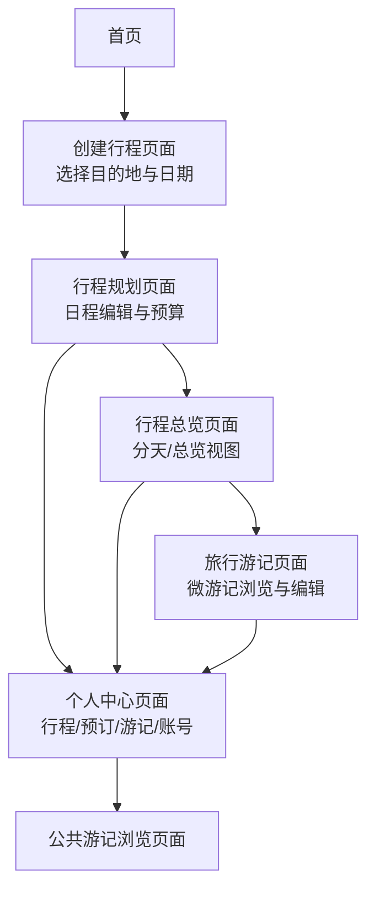
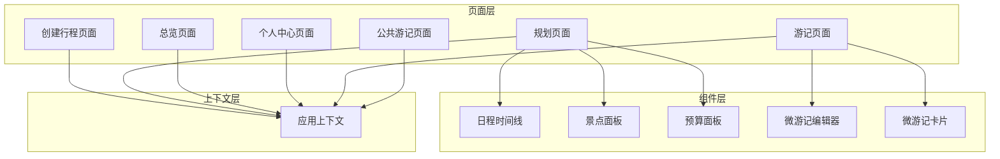
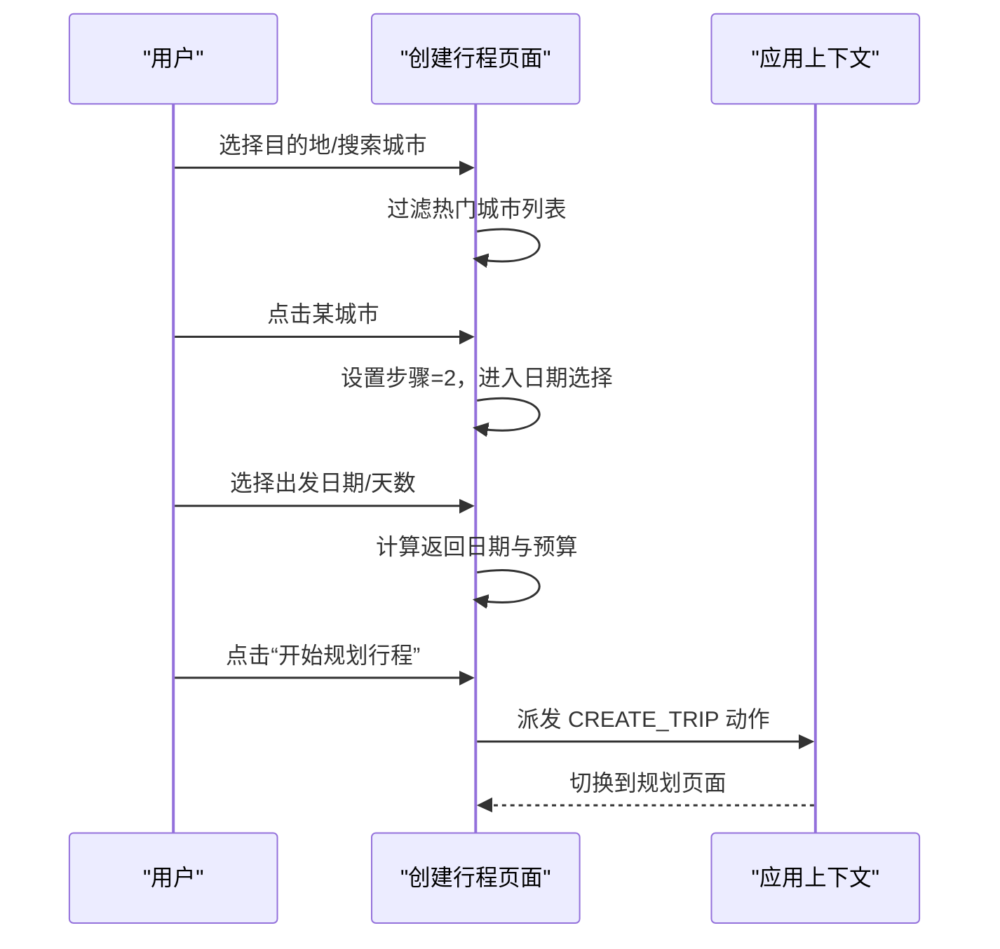
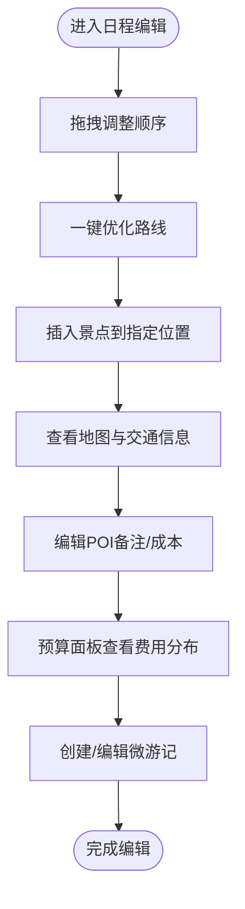
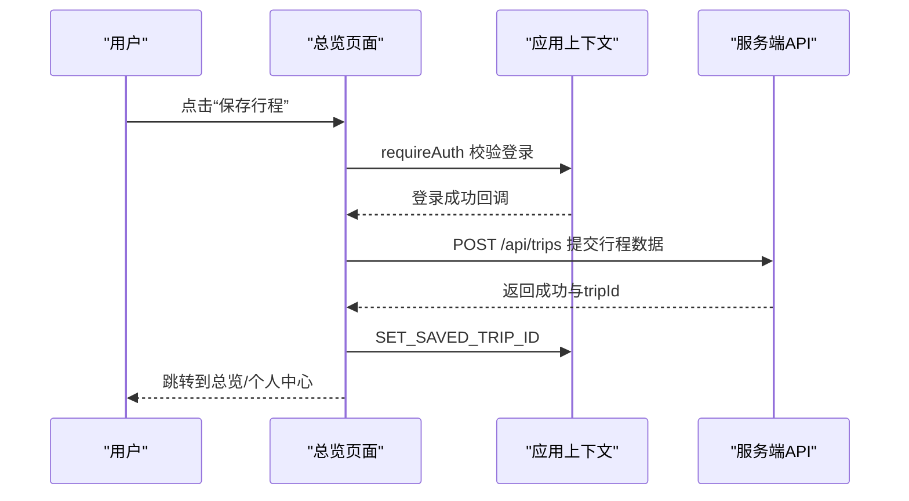
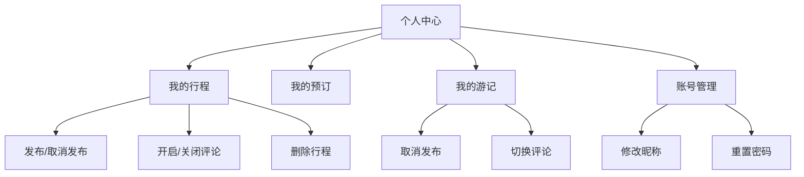
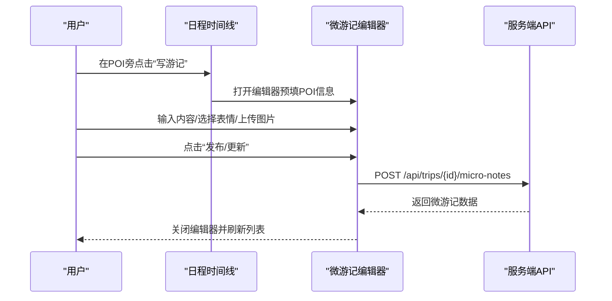
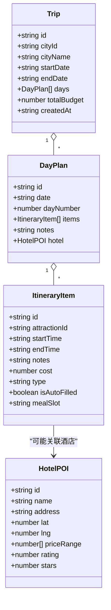
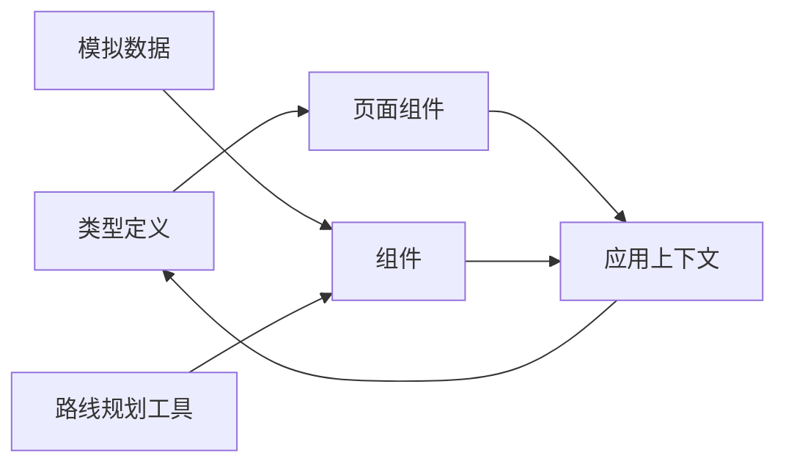

# 用户交互功能

<cite>
**本文档引用的文件**
- [src/pages/CreateTripPage.tsx](file://src/pages/CreateTripPage.tsx)
- [src/pages/PlannerPage.tsx](file://src/pages/PlannerPage.tsx)
- [src/pages/OverviewPage.tsx](file://src/pages/OverviewPage.tsx)
- [src/pages/ProfilePage.tsx](file://src/pages/ProfilePage.tsx)
- [src/pages/JournalPage.tsx](file://src/pages/JournalPage.tsx)
- [src/pages/TravelNotesPage.tsx](file://src/pages/TravelNotesPage.tsx)
- [src/context/AppContext.tsx](file://src/context/AppContext.tsx)
- [src/components/DayTimeline.tsx](file://src/components/DayTimeline.tsx)
- [src/components/AttractionsPanel.tsx](file://src/components/AttractionsPanel.tsx)
- [src/components/BudgetPanel.tsx](file://src/components/BudgetPanel.tsx)
- [src/components/NoteEditorModal.tsx](file://src/components/NoteEditorModal.tsx)
- [src/components/NoteCard.tsx](file://src/components/NoteCard.tsx)
- [src/types/index.ts](file://src/types/index.ts)
- [src/data/mock-data.ts](file://src/data/mock-data.ts)
- [src/utils/routePlanner.ts](file://src/utils/routePlanner.ts)
</cite>

## 目录
1. [简介](#简介)
2. [项目结构](#项目结构)
3. [核心组件](#核心组件)
4. [架构总览](#架构总览)
5. [详细组件分析](#详细组件分析)
6. [依赖关系分析](#依赖关系分析)
7. [性能考虑](#性能考虑)
8. [故障排除指南](#故障排除指南)
9. [结论](#结论)
10. [附录](#附录)

## 简介
本文件面向最终用户，系统性阐述旅行计划应用的用户交互功能，涵盖从目的地选择、日期设置、预算配置到行程编辑、保存与分享、个人资料管理以及游记编辑的完整使用流程。文档基于实际代码实现，提供清晰的步骤说明、界面示意与最佳实践，帮助用户高效完成旅行规划。

## 项目结构
应用采用前端单页应用架构，主要页面围绕“创建行程 → 规划日程 → 总览与编辑 → 保存与分享 → 个人中心”的主线展开；同时通过上下文状态管理统一驱动视图切换与数据更新。

**图表来源**
- [src/pages/CreateTripPage.tsx:1-582](file://src/pages/CreateTripPage.tsx#L1-L582)
- [src/pages/PlannerPage.tsx:1-388](file://src/pages/PlannerPage.tsx#L1-L388)
- [src/pages/OverviewPage.tsx:1-719](file://src/pages/OverviewPage.tsx#L1-L719)
- [src/pages/ProfilePage.tsx:1-734](file://src/pages/ProfilePage.tsx#L1-L734)
- [src/pages/JournalPage.tsx:1-340](file://src/pages/JournalPage.tsx#L1-L340)
- [src/pages/TravelNotesPage.tsx:1-139](file://src/pages/TravelNotesPage.tsx#L1-L139)

**章节来源**
- [src/pages/CreateTripPage.tsx:1-582](file://src/pages/CreateTripPage.tsx#L1-L582)
- [src/pages/PlannerPage.tsx:1-388](file://src/pages/PlannerPage.tsx#L1-L388)
- [src/pages/OverviewPage.tsx:1-719](file://src/pages/OverviewPage.tsx#L1-L719)
- [src/pages/ProfilePage.tsx:1-734](file://src/pages/ProfilePage.tsx#L1-L734)
- [src/pages/JournalPage.tsx:1-340](file://src/pages/JournalPage.tsx#L1-L340)
- [src/pages/TravelNotesPage.tsx:1-139](file://src/pages/TravelNotesPage.tsx#L1-L139)

## 核心组件
- 应用状态上下文：统一管理当前视图、选中日期、行程数据、保存的行程ID等，支持跨页面的状态共享与持久化。
- 行程编辑组件：日程时间线、景点面板、预算面板、微游记编辑器等，提供拖拽排序、一键优化、插入景点、预算统计等功能。
- 页面组件：创建行程、规划、总览、个人中心、游记浏览等页面，串联用户旅程。

**章节来源**
- [src/context/AppContext.tsx:1-234](file://src/context/AppContext.tsx#L1-L234)
- [src/components/DayTimeline.tsx:1-979](file://src/components/DayTimeline.tsx#L1-L979)
- [src/components/AttractionsPanel.tsx:1-298](file://src/components/AttractionsPanel.tsx#L1-L298)
- [src/components/BudgetPanel.tsx:1-134](file://src/components/BudgetPanel.tsx#L1-L134)
- [src/components/NoteEditorModal.tsx:1-287](file://src/components/NoteEditorModal.tsx#L1-L287)

## 架构总览
应用采用“页面 + 组件 + 上下文”的分层架构：
- 页面负责业务流程与导航，调用上下文派发动作。
- 组件封装交互与展示，复用通用UI与工具函数。
- 上下文集中管理全局状态与派发逻辑，保证数据一致性。

**图表来源**
- [src/pages/CreateTripPage.tsx:1-582](file://src/pages/CreateTripPage.tsx#L1-L582)
- [src/pages/PlannerPage.tsx:1-388](file://src/pages/PlannerPage.tsx#L1-L388)
- [src/pages/OverviewPage.tsx:1-719](file://src/pages/OverviewPage.tsx#L1-L719)
- [src/pages/ProfilePage.tsx:1-734](file://src/pages/ProfilePage.tsx#L1-L734)
- [src/pages/JournalPage.tsx:1-340](file://src/pages/JournalPage.tsx#L1-L340)
- [src/pages/TravelNotesPage.tsx:1-139](file://src/pages/TravelNotesPage.tsx#L1-L139)
- [src/context/AppContext.tsx:1-234](file://src/context/AppContext.tsx#L1-L234)

## 详细组件分析

### 创建行程流程（目的地选择、日期设置）
- 目的地选择：支持热门城市筛选与搜索，展示城市图片、标签、日均预算与描述，点击进入日期选择。
- 日期设置：默认出发日期为明天，支持快速选择天数或步进器调节，自动计算返回日期与预算估算，提供旅行小贴士与最佳季节提示。
- 创建行程：校验日期有效性后生成行程对象，进入规划页面。

**图表来源**
- [src/pages/CreateTripPage.tsx:1-582](file://src/pages/CreateTripPage.tsx#L1-L582)
- [src/context/AppContext.tsx:1-234](file://src/context/AppContext.tsx#L1-L234)

**章节来源**
- [src/pages/CreateTripPage.tsx:1-582](file://src/pages/CreateTripPage.tsx#L1-L582)

### 行程编辑功能（添加/删除景点、调整时间、修改交通、重新排序）
- 日程时间线：支持拖拽排序、一键优化路线、插入景点、查看地图、编辑备注与成本。
- 景点面板：按类型筛选、搜索、查看评分与推荐理由，一键添加到当前日程。
- 预算面板：按类型统计费用、日均预算、参考预算对比与每日明细。
- 微游记：在POI旁快速创建/编辑微游记，支持文字、表情与图片上传。

**图表来源**
- [src/components/DayTimeline.tsx:1-979](file://src/components/DayTimeline.tsx#L1-L979)
- [src/components/AttractionsPanel.tsx:1-298](file://src/components/AttractionsPanel.tsx#L1-L298)
- [src/components/BudgetPanel.tsx:1-134](file://src/components/BudgetPanel.tsx#L1-L134)
- [src/components/NoteEditorModal.tsx:1-287](file://src/components/NoteEditorModal.tsx#L1-L287)

**章节来源**
- [src/components/DayTimeline.tsx:1-979](file://src/components/DayTimeline.tsx#L1-L979)
- [src/components/AttractionsPanel.tsx:1-298](file://src/components/AttractionsPanel.tsx#L1-L298)
- [src/components/BudgetPanel.tsx:1-134](file://src/components/BudgetPanel.tsx#L1-L134)
- [src/components/NoteEditorModal.tsx:1-287](file://src/components/NoteEditorModal.tsx#L1-L287)

### 行程保存与分享（本地存储、云端同步、社交分享）
- 保存行程：登录态下提交当前行程到服务端，成功后记录服务端ID并跳转到总览页面。
- 删除行程：已保存的行程可在个人中心删除。
- 社交分享：总览页提供分享与下载入口（图标按钮），用于社交平台分享或导出。

**图表来源**
- [src/pages/OverviewPage.tsx:1-719](file://src/pages/OverviewPage.tsx#L1-L719)
- [src/context/AppContext.tsx:1-234](file://src/context/AppContext.tsx#L1-L234)

**章节来源**
- [src/pages/OverviewPage.tsx:1-719](file://src/pages/OverviewPage.tsx#L1-L719)

### 个人资料管理（偏好设置、历史记录、个人收藏）
- 我的行程：列出所有行程，支持发布为游记、开启/关闭评论、删除与查看详情。
- 我的预订：展示酒店预订状态与操作（取消）。
- 我的游记：展示已发布的游记，支持取消发布与评论开关。
- 账号管理：支持修改昵称、发送验证码与重置密码。

**图表来源**
- [src/pages/ProfilePage.tsx:1-734](file://src/pages/ProfilePage.tsx#L1-L734)

**章节来源**
- [src/pages/ProfilePage.tsx:1-734](file://src/pages/ProfilePage.tsx#L1-L734)

### 笔记编辑功能（行程日记、编辑与多媒体附件）
- 微游记编辑器：支持文本（280字符）、表情选择、图片上传（最多9张）、提交与更新。
- 微游记卡片：在日程POI旁显示，支持作者头像、时间、内容、图片与操作（编辑/删除）。
- 游记总览：按天分组展示微游记，支持筛选与跳转到编辑页面。

**图表来源**
- [src/components/DayTimeline.tsx:1-979](file://src/components/DayTimeline.tsx#L1-L979)
- [src/components/NoteEditorModal.tsx:1-287](file://src/components/NoteEditorModal.tsx#L1-L287)
- [src/pages/JournalPage.tsx:1-340](file://src/pages/JournalPage.tsx#L1-L340)

**章节来源**
- [src/components/NoteEditorModal.tsx:1-287](file://src/components/NoteEditorModal.tsx#L1-L287)
- [src/components/NoteCard.tsx:1-194](file://src/components/NoteCard.tsx#L1-L194)
- [src/pages/JournalPage.tsx:1-340](file://src/pages/JournalPage.tsx#L1-L340)

### 前后端数据同步与状态管理策略
- 状态模型：行程对象包含城市、日期、天数、日程项、总预算等字段；通过上下文派发动作更新状态。
- 同步策略：保存/删除/发布等操作通过HTTP请求与服务端同步；本地状态即时更新UI，服务端返回后修正ID与状态。
- 优化与容错：日程时间线支持一键优化与拖拽排序；微游记编辑器提供加载状态与错误提示；预算面板实时计算与可视化。

**图表来源**
- [src/types/index.ts:1-239](file://src/types/index.ts#L1-L239)

**章节来源**
- [src/types/index.ts:1-239](file://src/types/index.ts#L1-L239)
- [src/context/AppContext.tsx:1-234](file://src/context/AppContext.tsx#L1-L234)

## 依赖关系分析
- 页面依赖上下文：通过上下文派发动作实现跨页面状态同步。
- 组件依赖数据与工具：日程时间线依赖景点数据与路线规划工具；预算面板依赖类型分类与聚合计算。
- 类型定义：统一的数据结构确保组件与页面之间的契约稳定。

**图表来源**
- [src/types/index.ts:1-239](file://src/types/index.ts#L1-L239)
- [src/data/mock-data.ts:1-810](file://src/data/mock-data.ts#L1-L810)
- [src/utils/routePlanner.ts:1-1142](file://src/utils/routePlanner.ts#L1-L1142)
- [src/context/AppContext.tsx:1-234](file://src/context/AppContext.tsx#L1-L234)

**章节来源**
- [src/types/index.ts:1-239](file://src/types/index.ts#L1-L239)
- [src/data/mock-data.ts:1-810](file://src/data/mock-data.ts#L1-L810)
- [src/utils/routePlanner.ts:1-1142](file://src/utils/routePlanner.ts#L1-L1142)
- [src/context/AppContext.tsx:1-234](file://src/context/AppContext.tsx#L1-L234)

## 性能考虑
- 渲染优化：日程时间线按需渲染、懒加载图片；预算面板与游记列表支持虚拟滚动与分页。
- 计算优化：预算与路线规划在客户端执行，减少网络往返；AI推荐数据按需加载。
- 状态更新：批量更新与防抖处理，避免频繁重渲染。

## 故障排除指南
- 日期无效：返回日期不得早于出发日期；超过最大天数将被截断。
- 登录限制：保存/发布/编辑微游记需登录，弹窗提示并引导登录。
- 网络异常：保存/删除/发布接口失败时保持本地状态不变，稍后重试。
- 图片上传：限制数量与格式，上传失败时提示并允许重新选择。

**章节来源**
- [src/pages/CreateTripPage.tsx:1-582](file://src/pages/CreateTripPage.tsx#L1-L582)
- [src/pages/PlannerPage.tsx:1-388](file://src/pages/PlannerPage.tsx#L1-L388)
- [src/pages/JournalPage.tsx:1-340](file://src/pages/JournalPage.tsx#L1-L340)

## 结论
该应用通过清晰的页面流程与强大的组件体系，实现了从目的地选择到行程编辑、保存分享与个人管理的完整闭环。上下文状态管理确保了跨页面的一致性与可维护性，组件化的UI提升了开发效率与用户体验。建议在实际使用中充分利用一键优化、预算面板与微游记功能，以获得更智能、更便捷的旅行规划体验。

## 附录
- 使用示例与最佳实践
  - 目的地选择：优先使用热门城市与搜索功能，结合旅行小贴士选择最佳季节。
  - 日期设置：合理规划天数，利用预算估算控制总花费。
  - 日程编辑：使用“插入景点”与“一键优化”提升效率；拖拽排序时注意交通时间与POI开放时间。
  - 预算管理：关注分类费用与日均预算，及时调整消费结构。
  - 微游记：在每个POI旁记录即时感受，配合表情与图片增强回忆。
  - 保存与分享：定期保存行程，发布为游记并与他人分享旅行灵感。