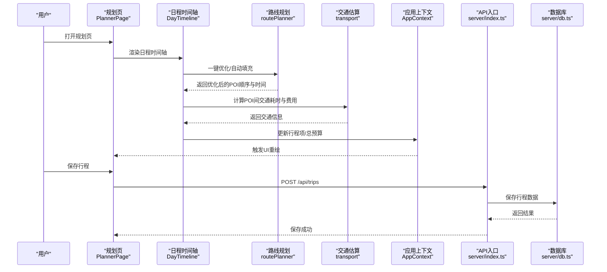
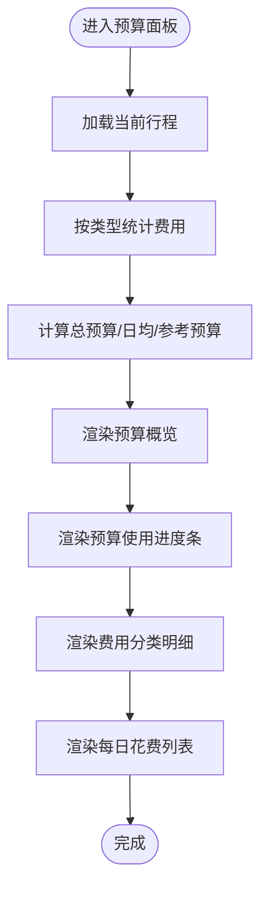
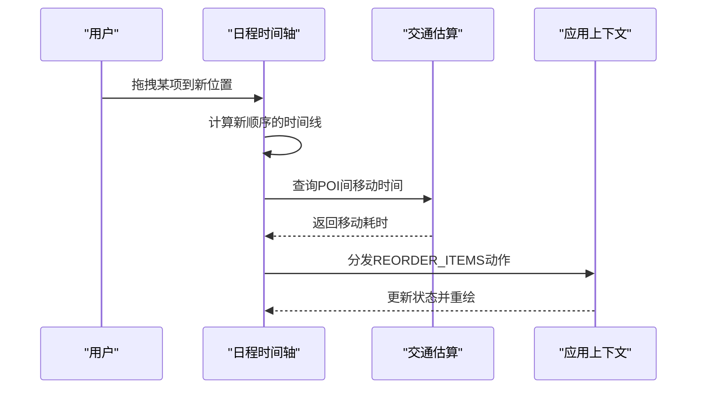
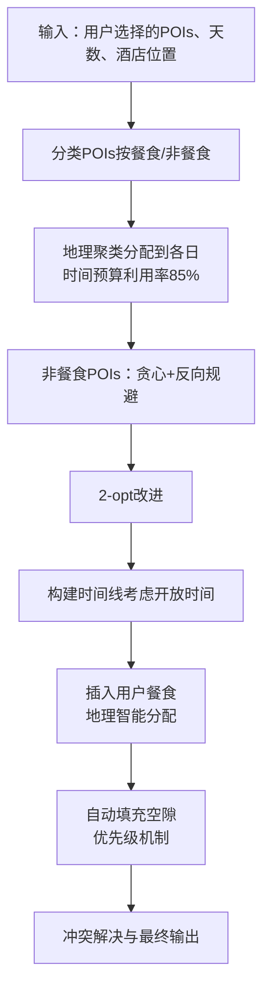
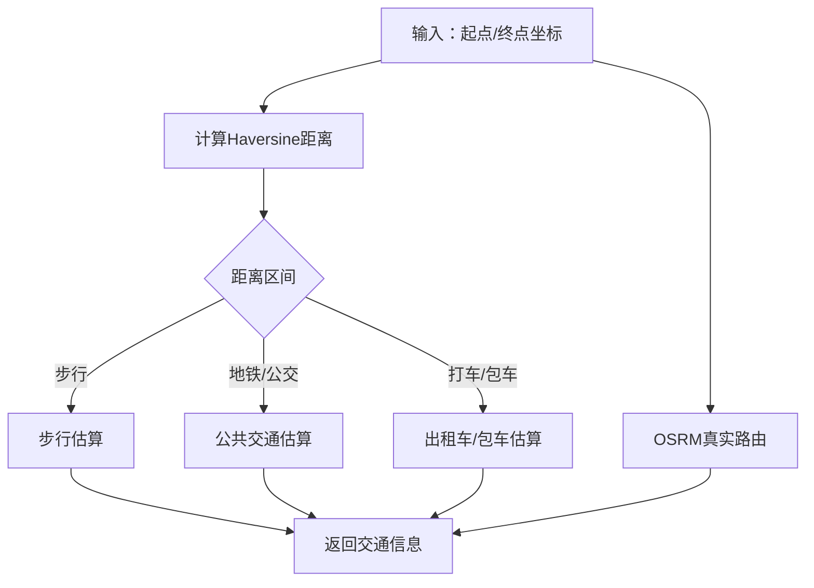
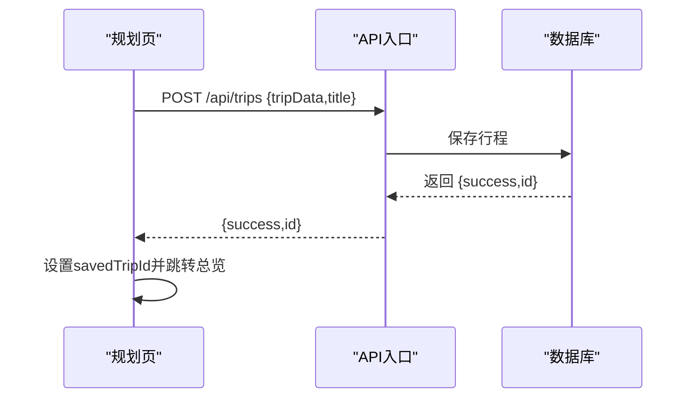
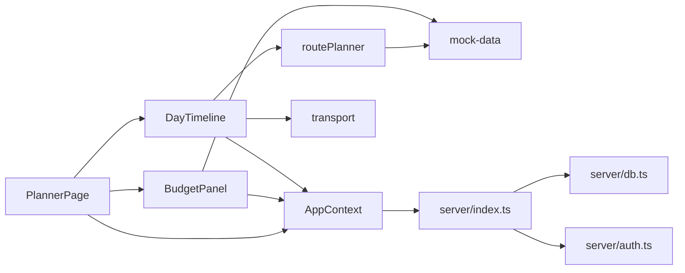

# 预算与时间管理

<cite>
**本文档引用的文件**
- [BudgetPanel.tsx](file://src/components/BudgetPanel.tsx)
- [DayTimeline.tsx](file://src/components/DayTimeline.tsx)
- [AppContext.tsx](file://src/context/AppContext.tsx)
- [routePlanner.ts](file://src/utils/routePlanner.ts)
- [transport.ts](file://src/utils/transport.ts)
- [mock-data.ts](file://src/data/mock-data.ts)
- [PlannerPage.tsx](file://src/pages/PlannerPage.tsx)
- [index.ts](file://server/index.ts)
- [db.ts](file://server/db.ts)
- [auth.ts](file://server/auth.ts)
</cite>

## 更新摘要
**所做更改**
- 更新路线规划部分以反映新的餐食分配策略（地理智能分配替代简单轮询）
- 更新时间预算利用率至85%，提升日程充实度
- 新增空隙填充算法优先级机制说明
- 新增购物作为首项的惩罚机制说明
- 完善路线规划算法的详细实现描述

## 目录
1. [简介](#简介)
2. [项目结构](#项目结构)
3. [核心组件](#核心组件)
4. [架构总览](#架构总览)
5. [详细组件分析](#详细组件分析)
6. [依赖关系分析](#依赖关系分析)
7. [性能考量](#性能考量)
8. [故障排查指南](#故障排查指南)
9. [结论](#结论)
10. [附录](#附录)

## 简介
本文件面向旅行规划系统中的"预算与时间管理"功能，系统性阐述预算面板的实现机制（预算设置、费用分类、实时计算、超支提醒）、时间安排功能（日程时间轴渲染、时间段分配算法、冲突检测）、成本估算算法（景点门票、交通费用、餐饮预算、住宿费用的自动计算）、时间优化策略（开放时间考虑、交通时间预估、最优路线规划），以及数据持久化机制（预算数据的存储、恢复与同步）。同时提供组件使用示例与API接口说明，帮助开发者在旅行规划中集成预算与时间管理能力。

## 项目结构
预算与时间管理功能主要由以下模块构成：
- 前端状态与UI
  - 预算面板：BudgetPanel.tsx
  - 日程时间轴：DayTimeline.tsx
  - 应用上下文：AppContext.tsx
  - 视图容器：PlannerPage.tsx
- 算法与工具
  - 路线规划：routePlanner.ts
  - 交通估算：transport.ts
  - 示例数据：mock-data.ts
- 后端服务与数据库
  - API入口：server/index.ts
  - 数据库与业务逻辑：server/db.ts
  - 认证与授权：server/auth.ts

```mermaid
graph TB
subgraph "前端"
BP["预算面板<br/>BudgetPanel.tsx"]
DT["日程时间轴<br/>DayTimeline.tsx"]
AC["应用上下文<br/>AppContext.tsx"]
PP["规划页<br/>PlannerPage.tsx"]
end
subgraph "算法与工具"
RP["路线规划<br/>routePlanner.ts"]
TR["交通估算<br/>transport.ts"]
MD["示例数据<br/>mock-data.ts"]
end
subgraph "后端"
API["API入口<br/>server/index.ts"]
DB["数据库与业务逻辑<br/>server/db.ts"]
AUTH["认证与授权<br/>server/auth.ts"]
end
PP --> BP
PP --> DT
DT --> RP
DT --> TR
DT --> MD
BP --> AC
DT --> AC
PP --> AC
AC --> API
API --> DB
API --> AUTH
```

**图表来源**
- [BudgetPanel.tsx:1-134](file://src/components/BudgetPanel.tsx#L1-L134)
- [DayTimeline.tsx:1-979](file://src/components/DayTimeline.tsx#L1-L979)
- [AppContext.tsx:1-234](file://src/context/AppContext.tsx#L1-L234)
- [routePlanner.ts:1-1252](file://src/utils/routePlanner.ts#L1-L1252)
- [transport.ts:1-181](file://src/utils/transport.ts#L1-L181)
- [mock-data.ts:1-810](file://src/data/mock-data.ts#L1-L810)
- [PlannerPage.tsx:1-388](file://src/pages/PlannerPage.tsx#L1-L388)
- [index.ts:1-774](file://server/index.ts#L1-L774)
- [db.ts:1-300](file://server/db.ts#L1-L300)
- [auth.ts:1-120](file://server/auth.ts#L1-L120)

**章节来源**
- [PlannerPage.tsx:1-388](file://src/pages/PlannerPage.tsx#L1-L388)
- [AppContext.tsx:1-234](file://src/context/AppContext.tsx#L1-L234)

## 核心组件
- 预算面板（BudgetPanel）
  - 功能：展示已规划总费用、日均费用、预算使用百分比、费用分类明细、每日花费列表。
  - 实时计算：基于当前行程的总预算与按类型统计的费用进行展示；支持参考城市平均日预算进行对比。
- 日程时间轴（DayTimeline）
  - 功能：渲染单日行程，支持拖拽重排、一键优化、插入景点、酒店推荐、微游记编辑、交通信息展示。
  - 时间段分配：根据POI时长与前后POI间的移动时间，自动推算开始/结束时间。
  - 冲突检测：通过最早可开放时间与相邻POI的结束时间进行校验，避免时间重叠。
- 应用上下文（AppContext）
  - 功能：集中管理行程状态（Trip）、当前选中日期、动作分发（dispatch）。
  - 预算更新：增删改行程项时，自动重新计算总预算。
- 路线规划（routePlanner）
  - 功能：多日行程POI分配、贪心+反向规避的路径规划、2-opt改进、餐食插入、空隙填充、开放时间约束、冲突解决。
  - **更新**：采用地理智能分配策略，购物作为首项的惩罚机制，时间预算利用率提升至85%。
- 交通估算（transport）
  - 功能：启发式估算与OSRM真实路由结合，提供步行、地铁/公交、出租车/包车的耗时与费用预估。
- 示例数据（mock-data）
  - 功能：提供城市、POI、酒店等示例数据，包含评分、时长、费用、开放时间等字段，用于演示与测试。

**章节来源**
- [BudgetPanel.tsx:1-134](file://src/components/BudgetPanel.tsx#L1-L134)
- [DayTimeline.tsx:1-979](file://src/components/DayTimeline.tsx#L1-L979)
- [AppContext.tsx:77-81](file://src/context/AppContext.tsx#L77-L81)
- [routePlanner.ts:1-1252](file://src/utils/routePlanner.ts#L1-L1252)
- [transport.ts:1-181](file://src/utils/transport.ts#L1-L181)
- [mock-data.ts:1-810](file://src/data/mock-data.ts#L1-L810)

## 架构总览
预算与时间管理采用"前端状态驱动 + 算法工具 + 后端API"的分层架构：
- 前端负责用户交互与可视化，通过AppContext统一管理行程状态。
- 算法工具负责时间与路径的智能规划，保证用户体验与效率。
- 后端提供认证、行程持久化、微游记、POI/酒店缓存等服务能力。

**图表来源**
- [PlannerPage.tsx:26-52](file://src/pages/PlannerPage.tsx#L26-L52)
- [DayTimeline.tsx:221-241](file://src/components/DayTimeline.tsx#L221-L241)
- [routePlanner.ts:652-671](file://src/utils/routePlanner.ts#L652-L671)
- [transport.ts:142-162](file://src/utils/transport.ts#L142-L162)
- [AppContext.tsx:101-142](file://src/context/AppContext.tsx#L101-L142)
- [index.ts:14-26](file://server/index.ts#L14-L26)
- [db.ts:1-300](file://server/db.ts#L1-L300)

## 详细组件分析

### 预算面板（BudgetPanel）
- 预算计算
  - 分类汇总：遍历所有天的行程项，按类型累加费用，得到分类明细。
  - 总预算：来自行程对象的累计值，随增删改操作实时更新。
  - 日均预算：总预算除以天数，保留整数。
  - 参考预算：基于城市平均日预算与天数计算，用于对比与提醒。
- 展示元素
  - 已规划总费用与日均费用。
  - 预算使用百分比进度条。
  - 费用分类明细（景点、餐饮、住宿、体验、购物、交通）。
  - 每日花费列表，支持点击切换选中日期。

**图表来源**
- [BudgetPanel.tsx:12-104](file://src/components/BudgetPanel.tsx#L12-L104)

**章节来源**
- [BudgetPanel.tsx:1-134](file://src/components/BudgetPanel.tsx#L1-L134)
- [AppContext.tsx:77-81](file://src/context/AppContext.tsx#L77-L81)

### 日程时间轴（DayTimeline）
- 时间段分配算法
  - 从固定起始时间（如09:00）开始，逐项累加POI时长与移动时间，推导每个POI的开始/结束时间。
  - 移动时间采用启发式估算或OSRM真实数据，确保时间连续性。
- 冲突检测机制
  - 对每个POI查找最早可开放时间（考虑开放时间窗口与前序结束时间），若无法满足则跳过该POI。
  - 相邻POI之间预留最小间隔（如30分钟），避免时间过于紧凑。
- 交互与可视化
  - 支持拖拽重排，自动重新计算时间并更新状态。
  - 提供"一键优化"按钮，调用路线规划算法进行全局优化。
  - 显示酒店起止信息、POI间交通信息、餐食标签与季节指数徽章。

**图表来源**
- [DayTimeline.tsx:243-277](file://src/components/DayTimeline.tsx#L243-L277)
- [transport.ts:142-162](file://src/utils/transport.ts#L142-L162)
- [AppContext.tsx:125-130](file://src/context/AppContext.tsx#L125-L130)

**章节来源**
- [DayTimeline.tsx:243-277](file://src/components/DayTimeline.tsx#L243-L277)
- [transport.ts:56-131](file://src/utils/transport.ts#L56-L131)

### 路线规划（routePlanner）
- 多日POI分配
  - 将全天候POI优先分配到对应日期，其余POI按地理聚类分配到各日，控制每日总时长不超过阈值。
  - **更新**：时间预算利用率提升至85%（约11.9小时/14小时），提高日程充实度。
- 路径优化
  - 使用贪心算法结合反向规避（避免往返同一地点），随后进行2-opt局部搜索改进。
- 餐食插入与空隙填充
  - **更新**：采用地理智能分配策略，按餐厅到某天路线的最短距离分配餐饮，而非简单轮询。
  - 自动填充空隙：在合理时间内寻找合适POI填补空档，提升日程充实度。
  - **新增**：空隙填充算法优先级机制，午餐后到晚饭前的大段空白优先级最高。
- 开放时间与冲突处理
  - 严格遵守POI开放时间窗口，必要时调整开始时间或跳过。
  - 解决相邻POI时间重叠问题，确保结束时间早于下一POI最早可开始时间。
- **新增**：购物作为首项的惩罚机制
  - 购物POI作为行程首个POI时，额外增加60分钟惩罚，优先安排景点类POI。

**图表来源**
- [routePlanner.ts:652-671](file://src/utils/routePlanner.ts#L652-L671)
- [routePlanner.ts:682-764](file://src/utils/routePlanner.ts#L682-L764)
- [routePlanner.ts:837-874](file://src/utils/routePlanner.ts#L837-L874)
- [routePlanner.ts:841-906](file://src/utils/routePlanner.ts#L841-L906)
- [routePlanner.ts:593-620](file://src/utils/routePlanner.ts#L593-L620)

**章节来源**
- [routePlanner.ts:1-1252](file://src/utils/routePlanner.ts#L1-L1252)

### 交通估算（transport）
- 启发式估算
  - 基于Haversine距离判断出行方式：步行（短距离）、地铁/公交（中距离）、出租车/包车（长距离）。
  - 提供预估耗时与费用，并给出出行建议。
- OSRM真实路由
  - 通过后端代理OSRM，返回驾车与公共交通的综合信息，用于精确展示与对比。

**图表来源**
- [transport.ts:39-131](file://src/utils/transport.ts#L39-L131)
- [transport.ts:142-162](file://src/utils/transport.ts#L142-L162)

**章节来源**
- [transport.ts:1-181](file://src/utils/transport.ts#L1-L181)

### 数据持久化机制
- 前端状态
  - AppContext集中维护行程状态与动作分发，所有预算与时间变更都会触发状态更新与UI重绘。
- 后端API
  - 保存行程：POST /api/trips，返回tripId并更新前端状态。
  - 微游记：支持查询/新增/修改/删除微游记，按tripId与POI维度组织数据。
- 数据库
  - trips表：存储行程基本信息与总预算。
  - micro_notes表：存储微游记内容、作者信息与关联POI。

**图表来源**
- [PlannerPage.tsx:26-52](file://src/pages/PlannerPage.tsx#L26-L52)
- [index.ts:14-26](file://server/index.ts#L14-L26)
- [db.ts:1-300](file://server/db.ts#L1-L300)

**章节来源**
- [PlannerPage.tsx:26-52](file://src/pages/PlannerPage.tsx#L26-L52)
- [index.ts:1-774](file://server/index.ts#L1-L774)
- [db.ts:151-218](file://server/db.ts#L151-L218)

## 依赖关系分析
- 组件耦合
  - DayTimeline依赖AppContext获取行程状态，依赖routePlanner与transport进行时间与路径计算。
  - BudgetPanel依赖AppContext与mock-data的城市平均预算进行对比展示。
- 算法依赖
  - routePlanner依赖mock-data中的POI与城市信息，依赖transport进行移动时间估算。
- 后端依赖
  - 前端通过server/index.ts提供的REST接口与后端交互，db.ts封装数据库操作，auth.ts提供认证能力。

**图表来源**
- [DayTimeline.tsx:1-979](file://src/components/DayTimeline.tsx#L1-L979)
- [BudgetPanel.tsx:1-134](file://src/components/BudgetPanel.tsx#L1-L134)
- [AppContext.tsx:1-234](file://src/context/AppContext.tsx#L1-L234)
- [routePlanner.ts:1-1252](file://src/utils/routePlanner.ts#L1-L1252)
- [transport.ts:1-181](file://src/utils/transport.ts#L1-L181)
- [mock-data.ts:1-810](file://src/data/mock-data.ts#L1-L810)
- [PlannerPage.tsx:1-388](file://src/pages/PlannerPage.tsx#L1-L388)
- [index.ts:1-774](file://server/index.ts#L1-L774)
- [db.ts:1-300](file://server/db.ts#L1-L300)
- [auth.ts:1-120](file://server/auth.ts#L1-L120)

**章节来源**
- [PlannerPage.tsx:1-388](file://src/pages/PlannerPage.tsx#L1-L388)
- [AppContext.tsx:1-234](file://src/context/AppContext.tsx#L1-L234)

## 性能考量
- 时间复杂度
  - 路线规划：贪心阶段近似O(N log N)，2-opt局部搜索在小规模POI集上高效；整体受POI数量与约束条件影响。
  - 交通估算：启发式估算为O(1)，OSRM请求为异步网络调用，需注意并发与失败重试。
- 内存与渲染
  - 日程时间轴采用虚拟滚动与懒加载图片，减少DOM节点数量。
  - 预算面板按需渲染分类明细，避免不必要的重绘。
- 网络与缓存
  - POI与酒店数据具备缓存策略，降低重复请求；微游记按tripId分页加载，避免一次性传输大量数据。

## 故障排查指南
- 预算显示异常
  - 检查AppContext中的recalcBudget是否正确执行，确认增删改动作后总预算字段已更新。
  - 若城市平均预算缺失，预算使用百分比可能无法显示。
- 时间冲突或越界
  - 检查routePlanner的findEarliestOpenSlot与resolveOverlaps逻辑，确保POI开放时间与相邻时间约束满足。
  - 若POI过多导致无法满足开放时间，考虑减少POI数量或延长停留时间。
- 交通估算不准确
  - 启发式估算适用于快速预览；若需要精确数据，启用OSRM真实路由并检查后端代理配置。
- 保存行程失败
  - 确认已登录并通过requireAuth流程；检查后端返回的错误码与消息，关注网络异常与鉴权失败。

**章节来源**
- [AppContext.tsx:77-81](file://src/context/AppContext.tsx#L77-L81)
- [routePlanner.ts:88-107](file://src/utils/routePlanner.ts#L88-L107)
- [routePlanner.ts:619-650](file://src/utils/routePlanner.ts#L619-L650)
- [transport.ts:142-162](file://src/utils/transport.ts#L142-L162)
- [PlannerPage.tsx:26-52](file://src/pages/PlannerPage.tsx#L26-L52)

## 结论
预算与时间管理功能通过"前端状态驱动 + 智能算法 + 后端服务"的协同，实现了从预算概览到日程优化的完整闭环。预算面板提供直观的费用视图与对比参考；日程时间轴结合启发式与真实路由，兼顾易用性与准确性；路线规划算法在开放时间、冲突检测与地理分布方面提供了稳健的解决方案；后端API与数据库保障了数据的持久化与同步。该体系既适合演示与测试，也可作为旅行规划产品化的坚实基础。

## 附录

### 组件使用示例
- 在规划页中集成预算面板与日程时间轴
  - 在规划页中渲染预算面板与日程时间轴，支持移动端与桌面端布局切换。
  - 通过AppContext的状态与动作，实现预算与时间的实时更新。
- 一键优化与拖拽重排
  - 点击"一键优化"按钮，调用路线规划算法进行全局优化。
  - 拖拽日程项到新位置，自动重新计算时间并更新状态。

**章节来源**
- [PlannerPage.tsx:250-286](file://src/pages/PlannerPage.tsx#L250-L286)
- [DayTimeline.tsx:221-241](file://src/components/DayTimeline.tsx#L221-L241)
- [DayTimeline.tsx:243-277](file://src/components/DayTimeline.tsx#L243-L277)

### API接口说明
- 保存行程
  - 方法：POST /api/trips
  - 请求体：{ tripData: Trip, title: string }
  - 成功响应：{ success: true, id: string }
- 获取微游记
  - 方法：GET /api/trips/{id}/micro-notes
  - 成功响应：{ success: true, data: MicroNote[] }
- 新增/更新微游记
  - 方法：POST /api/trips/{id}/micro-notes
  - 请求体：包含POI信息、日程号、内容、图片与心情
  - 成功响应：{ success: true, data: MicroNote }
- 删除微游记
  - 方法：DELETE /api/trips/{id}/micro-notes/{noteId}
  - 成功响应：{ success: true }

**章节来源**
- [PlannerPage.tsx:26-52](file://src/pages/PlannerPage.tsx#L26-L52)
- [index.ts:14-26](file://server/index.ts#L14-L26)
- [index.ts:728-751](file://server/index.ts#L728-L751)
- [db.ts:151-218](file://server/db.ts#L151-L218)