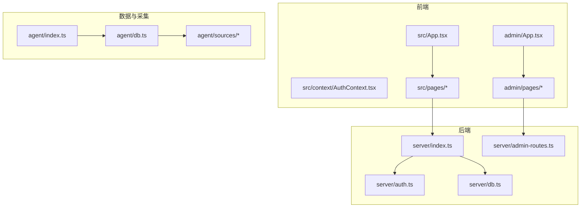
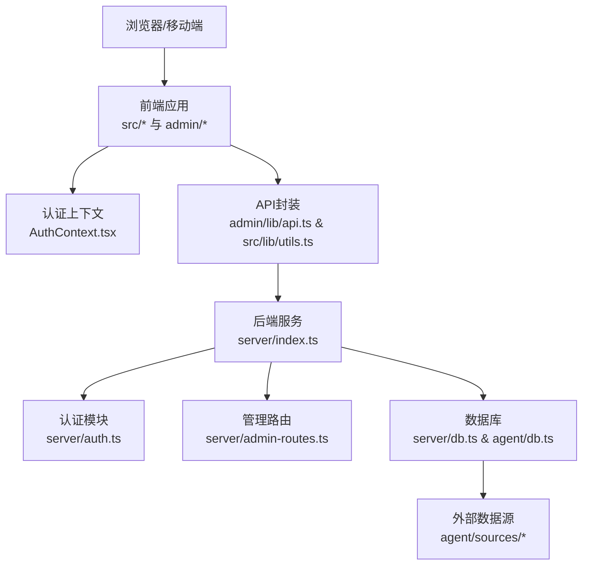
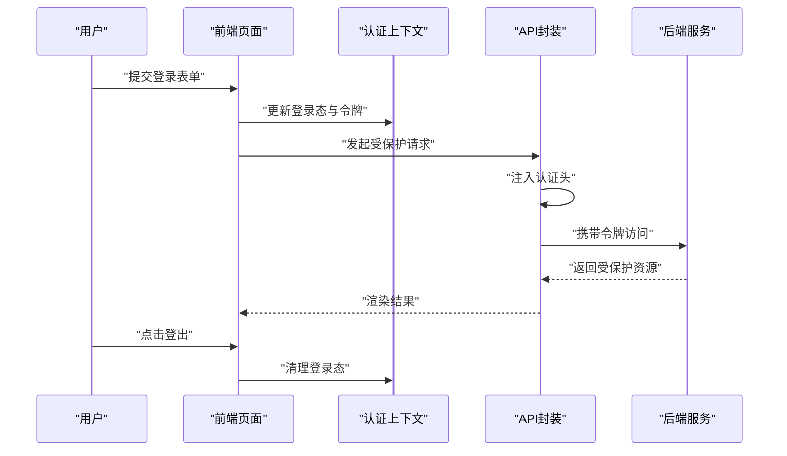
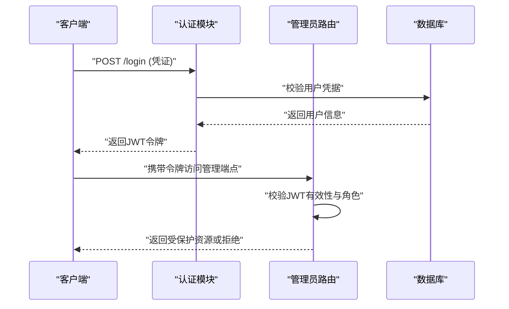
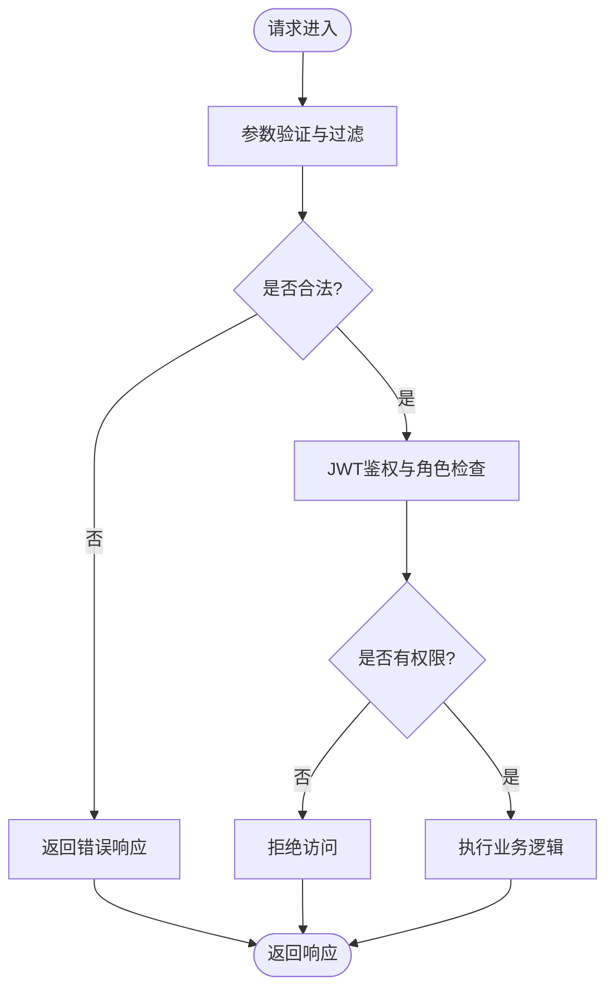
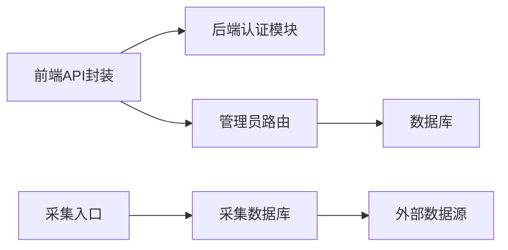

# 安全架构设计

<cite>
**本文档引用的文件**
- [server/auth.ts](file://server/auth.ts)
- [src/context/AuthContext.tsx](file://src/context/AuthContext.tsx)
- [server/admin-routes.ts](file://server/admin-routes.ts)
- [admin/lib/api.ts](file://admin/lib/api.ts)
- [src/lib/utils.ts](file://src/lib/utils.ts)
- [server/index.ts](file://server/index.ts)
- [src/pages/ProfilePage.tsx](file://src/pages/ProfilePage.tsx)
- [src/pages/OverviewPage.tsx](file://src/pages/OverviewPage.tsx)
- [src/pages/PlannerPage.tsx](file://src/pages/PlannerPage.tsx)
- [src/pages/JournalPage.tsx](file://src/pages/JournalPage.tsx)
- [src/pages/HotelStepPage.tsx](file://src/pages/HotelStepPage.tsx)
- [src/pages/NoteDetailPage.tsx](file://src/pages/NoteDetailPage.tsx)
- [src/pages/AttractionDetailPage.tsx](file://src/pages/AttractionDetailPage.tsx)
- [src/pages/PlaceSelectionPage.tsx](file://src/pages/PlaceSelectionPage.tsx)
- [src/pages/HomePage.tsx](file://src/pages/HomePage.tsx)
- [src/components/AuthModal.tsx](file://src/components/AuthModal.tsx)
- [src/components/ui/button.tsx](file://src/components/ui/button.tsx)
- [src/components/ui/card.tsx](file://src/components/ui/card.tsx)
- [src/components/ui/input.tsx](file://src/components/ui/input.tsx)
- [src/components/ui/table.tsx](file://src/components/ui/table.tsx)
- [src/components/ui/badge.tsx](file://src/components/ui/badge.tsx)
- [src/components/ui/progress.tsx](file://src/components/ui/progress.tsx)
- [src/components/ui/select.tsx](file://src/components/ui/select.tsx)
- [src/components/ui/skeleton.tsx](file://src/components/ui/skeleton.tsx)
- [src/components/ui/skeleton.tsx](file://src/components/ui/skeleton.tsx)
- [admin/components/layout/AdminLayout.tsx](file://admin/components/layout/AdminLayout.tsx)
- [admin/components/layout/Header.tsx](file://admin/components/layout/Header.tsx)
- [admin/components/layout/Sidebar.tsx](file://admin/components/layout/Sidebar.tsx)
- [admin/components/ui/button.tsx](file://admin/components/ui/button.tsx)
- [admin/components/ui/input.tsx](file://admin/components/ui/input.tsx)
- [admin/components/ui/table.tsx](file://admin/components/ui/table.tsx)
- [admin/components/ui/card.tsx](file://admin/components/ui/card.tsx)
- [admin/components/ui/badge.tsx](file://admin/components/ui/badge.tsx)
- [admin/components/ui/progress.tsx](file://admin/components/ui/progress.tsx)
- [admin/components/ui/select.tsx](file://admin/components/ui/select.tsx)
- [admin/components/ui/skeleton.tsx](file://admin/components/ui/skeleton.tsx)
- [admin/hooks/useDebounce.ts](file://admin/hooks/useDebounce.ts)
- [admin/types/index.ts](file://admin/types/index.ts)
- [admin/App.tsx](file://admin/App.tsx)
- [admin/main.tsx](file://admin/main.tsx)
- [agent/index.ts](file://agent/index.ts)
- [agent/db.ts](file://agent/db.ts)
- [agent/init-db.ts](file://agent/init-db.ts)
- [agent/data/city-coords.json](file://agent/data/city-coords.json)
- [agent/sources/base.ts](file://agent/sources/base.ts)
- [agent/sources/amap.ts](file://agent/sources/amap.ts)
- [agent/sources/google.ts](file://agent/sources/google.ts)
- [agent/sources/osm.ts](file://agent/sources/osm.ts)
- [agent/sources/foursquare.ts](file://agent/sources/foursquare.ts)
- [agent/sources/spark.ts](file://agent/sources/spark.ts)
- [agent/sources/doubao.ts](file://agent/sources/doubao.ts)
- [agent/sources/ai.ts](file://agent/sources/ai.ts)
- [agent/categories.ts](file://agent/categories.ts)
- [agent/classifier.ts](file://agent/classifier.ts)
- [agent/config.ts](file://agent/config.ts)
- [agent/exporter.ts](file://agent/exporter.ts)
- [agent/incremental.ts](file://agent/incremental.ts)
- [agent/merger.ts](file://agent/merger.ts)
- [agent/quality.ts](file://agent/quality.ts)
- [agent/rescore.ts](file://agent/rescore.ts)
- [agent/scheduler.ts](file://agent/scheduler.ts)
- [agent/similarity.ts](file://agent/similarity.ts)
- [agent/translate.ts](file://agent/translate.ts)
- [agent/utils.ts](file://agent/utils.ts)
- [server/db.ts](file://server/db.ts)
- [server/qwen.ts](file://server/qwen.ts)
- [server/qwen-hotels.ts](file://server/qwen-hotels.ts)
- [server/dedup.ts](file://server/dedup.ts)
- [server/test-dedup.ts](file://server/test-dedup.ts)
- [api/index.ts](file://api/index.ts)
- [package.json](file://package.json)
- [vite.config.ts](file://vite.config.ts)
- [tsconfig.json](file://tsconfig.json)
- [tailwind.config.ts](file://tailwind.config.ts)
- [vercel.json](file://vercel.json)
- [ecosystem.config.cjs](file://ecosystem.config.cjs)
- [render.yaml](file://render.yaml)
</cite>

## 目录
1. [引言](#引言)
2. [项目结构](#项目结构)
3. [核心组件](#核心组件)
4. [架构总览](#架构总览)
5. [详细组件分析](#详细组件分析)
6. [依赖关系分析](#依赖关系分析)
7. [性能考虑](#性能考虑)
8. [故障排查指南](#故障排查指南)
9. [结论](#结论)
10. [附录](#附录)

## 引言
本文件面向旅行规划Demo项目的“安全架构设计”，聚焦于多层安全防护机制的设计与实现，覆盖前端认证状态管理、后端API认证授权与数据访问控制、JWT令牌与会话管理、API安全策略（请求验证、参数过滤、访问限制）、数据安全（敏感信息保护与传输加密）以及威胁模型与最佳实践。文档以代码库实际实现为依据，结合可视化图表帮助读者理解系统在各层面的安全设计。

## 项目结构
该项目采用前后端分离架构：前端应用位于 src/ 与 admin/，后端服务位于 server/，数据处理与采集逻辑位于 agent/，API聚合位于 api/。安全相关的关键位置包括：
- 前端认证上下文与页面组件：src/context/AuthContext.tsx、src/components/AuthModal.tsx、src/pages/* 等
- 后端认证与鉴权：server/auth.ts、server/admin-routes.ts
- 前端与后端交互封装：admin/lib/api.ts、src/lib/utils.ts
- 数据库与数据源：server/db.ts、agent/db.ts、agent/sources/*
- 部署与配置：vercel.json、render.yaml、ecosystem.config.cjs、vite.config.ts

**图表来源**
- [server/index.ts](file://server/index.ts)
- [server/auth.ts](file://server/auth.ts)
- [server/admin-routes.ts](file://server/admin-routes.ts)
- [server/db.ts](file://server/db.ts)
- [src/context/AuthContext.tsx](file://src/context/AuthContext.tsx)
- [admin/App.tsx](file://admin/App.tsx)
- [agent/index.ts](file://agent/index.ts)
- [agent/db.ts](file://agent/db.ts)
- [agent/sources/base.ts](file://agent/sources/base.ts)

**章节来源**
- [server/index.ts](file://server/index.ts)
- [src/context/AuthContext.tsx](file://src/context/AuthContext.tsx)
- [admin/App.tsx](file://admin/App.tsx)
- [agent/index.ts](file://agent/index.ts)

## 核心组件
- 前端认证上下文：负责用户登录态存储、令牌传递、登出清理等，是前端安全的“第一道防线”
- 后端认证模块：提供登录接口、JWT签发与校验、管理员路由鉴权
- 管理后台路由：对管理员端页面进行访问控制
- 前端API封装：统一注入认证头、错误处理与重定向
- 数据层：数据库连接与查询、外部数据源接入与清洗

**章节来源**
- [src/context/AuthContext.tsx](file://src/context/AuthContext.tsx)
- [server/auth.ts](file://server/auth.ts)
- [server/admin-routes.ts](file://server/admin-routes.ts)
- [admin/lib/api.ts](file://admin/lib/api.ts)
- [server/db.ts](file://server/db.ts)
- [agent/db.ts](file://agent/db.ts)

## 架构总览
下图展示了从浏览器到后端与数据源的整体安全路径，强调认证、授权与数据访问控制的分层设计。

**图表来源**
- [src/context/AuthContext.tsx](file://src/context/AuthContext.tsx)
- [admin/lib/api.ts](file://admin/lib/api.ts)
- [src/lib/utils.ts](file://src/lib/utils.ts)
- [server/index.ts](file://server/index.ts)
- [server/auth.ts](file://server/auth.ts)
- [server/admin-routes.ts](file://server/admin-routes.ts)
- [server/db.ts](file://server/db.ts)
- [agent/db.ts](file://agent/db.ts)
- [agent/sources/base.ts](file://agent/sources/base.ts)

## 详细组件分析

### 前端认证上下文与状态管理
- 登录态存储：通过上下文保存用户信息与令牌，并在页面间共享
- 令牌注入：在API请求中自动附加认证头，确保后端可识别调用方身份
- 登出清理：清除上下文与本地存储，避免令牌泄露
- 页面级保护：受保护页面在未登录时重定向至登录页

**图表来源**
- [src/context/AuthContext.tsx](file://src/context/AuthContext.tsx)
- [src/lib/utils.ts](file://src/lib/utils.ts)
- [admin/lib/api.ts](file://admin/lib/api.ts)

**章节来源**
- [src/context/AuthContext.tsx](file://src/context/AuthContext.tsx)
- [src/lib/utils.ts](file://src/lib/utils.ts)
- [admin/lib/api.ts](file://admin/lib/api.ts)
- [src/pages/ProfilePage.tsx](file://src/pages/ProfilePage.tsx)
- [src/pages/OverviewPage.tsx](file://src/pages/OverviewPage.tsx)
- [src/pages/PlannerPage.tsx](file://src/pages/PlannerPage.tsx)
- [src/pages/JournalPage.tsx](file://src/pages/JournalPage.tsx)
- [src/pages/HotelStepPage.tsx](file://src/pages/HotelStepPage.tsx)
- [src/pages/NoteDetailPage.tsx](file://src/pages/NoteDetailPage.tsx)
- [src/pages/AttractionDetailPage.tsx](file://src/pages/AttractionDetailPage.tsx)
- [src/pages/PlaceSelectionPage.tsx](file://src/pages/PlaceSelectionPage.tsx)
- [src/pages/HomePage.tsx](file://src/pages/HomePage.tsx)

### 后端认证与JWT策略
- 登录流程：接收凭证，校验成功后签发JWT令牌；设置合理过期时间与安全属性
- JWT校验：中间件解析Authorization头，验证签名与有效期，失败则拒绝请求
- 管理员路由：对管理后台页面与接口进行角色校验，仅允许具备管理员权限的用户访问
- 会话管理：基于无状态JWT，避免服务端会话存储；如需撤销可在黑名单或短期令牌策略中实现

**图表来源**
- [server/auth.ts](file://server/auth.ts)
- [server/admin-routes.ts](file://server/admin-routes.ts)
- [server/db.ts](file://server/db.ts)

**章节来源**
- [server/auth.ts](file://server/auth.ts)
- [server/admin-routes.ts](file://server/admin-routes.ts)
- [server/db.ts](file://server/db.ts)

### API安全策略与请求处理
- 请求验证：对必填字段、格式与范围进行校验，拒绝非法输入
- 参数过滤：对查询参数与请求体进行白名单过滤，避免注入攻击
- 访问限制：结合JWT角色与业务规则限制操作范围（如仅能修改本人数据）
- 错误处理：统一封装错误响应，避免泄露内部细节

**图表来源**
- [server/auth.ts](file://server/auth.ts)
- [server/admin-routes.ts](file://server/admin-routes.ts)
- [src/lib/utils.ts](file://src/lib/utils.ts)
- [admin/lib/api.ts](file://admin/lib/api.ts)

**章节来源**
- [src/lib/utils.ts](file://src/lib/utils.ts)
- [admin/lib/api.ts](file://admin/lib/api.ts)
- [server/auth.ts](file://server/auth.ts)
- [server/admin-routes.ts](file://server/admin-routes.ts)

### 数据安全与传输加密
- 传输加密：生产环境启用HTTPS，强制TLS 1.2+；前端与后端均应配置安全头部
- 敏感信息保护：令牌、密钥与密码在传输与存储中加密；避免在日志中输出敏感字段
- 数据访问控制：最小权限原则，按用户隔离数据；对外部数据源访问进行限流与鉴权
- 存储安全：数据库连接使用强密码与网络隔离；定期轮换密钥与证书

**章节来源**
- [server/db.ts](file://server/db.ts)
- [agent/db.ts](file://agent/db.ts)
- [agent/sources/amap.ts](file://agent/sources/amap.ts)
- [agent/sources/google.ts](file://agent/sources/google.ts)
- [agent/sources/osm.ts](file://agent/sources/osm.ts)
- [agent/sources/foursquare.ts](file://agent/sources/foursquare.ts)
- [agent/sources/spark.ts](file://agent/sources/spark.ts)
- [agent/sources/doubao.ts](file://agent/sources/doubao.ts)
- [agent/sources/ai.ts](file://agent/sources/ai.ts)

### 威胁模型与风险缓解
- 身份冒用：通过JWT签名与有效期控制；建议引入短期令牌与刷新令牌机制
- 权限提升：管理员路由必须严格校验角色；对所有写操作进行RBAC检查
- 会话劫持：避免在URL中传递令牌；使用HttpOnly与Secure Cookie（如采用Cookie方案）；前端优先使用Bearer Token
- 注入攻击：对所有输入进行白名单过滤与长度限制；数据库查询使用参数化
- 暴力破解：登录接口增加速率限制与账户锁定策略
- 数据泄露：最小化日志输出敏感字段；对导出数据进行脱敏

[本节为概念性总结，不直接分析具体文件]

## 依赖关系分析
- 前端依赖后端提供的认证与业务接口；API封装统一处理认证头与错误
- 后端依赖数据库与外部数据源；管理员路由依赖认证模块完成鉴权
- 管理后台与普通前端共享部分UI组件，但访问控制由后端路由严格约束

**图表来源**
- [admin/lib/api.ts](file://admin/lib/api.ts)
- [src/lib/utils.ts](file://src/lib/utils.ts)
- [server/auth.ts](file://server/auth.ts)
- [server/admin-routes.ts](file://server/admin-routes.ts)
- [server/db.ts](file://server/db.ts)
- [agent/index.ts](file://agent/index.ts)
- [agent/db.ts](file://agent/db.ts)
- [agent/sources/base.ts](file://agent/sources/base.ts)

**章节来源**
- [admin/lib/api.ts](file://admin/lib/api.ts)
- [src/lib/utils.ts](file://src/lib/utils.ts)
- [server/auth.ts](file://server/auth.ts)
- [server/admin-routes.ts](file://server/admin-routes.ts)
- [server/db.ts](file://server/db.ts)
- [agent/index.ts](file://agent/index.ts)
- [agent/db.ts](file://agent/db.ts)
- [agent/sources/base.ts](file://agent/sources/base.ts)

## 性能考虑
- JWT校验开销：尽量减少不必要的鉴权检查；对静态资源与公开接口避免鉴权
- 缓存策略：对非敏感数据使用缓存降低数据库压力；注意缓存中的数据隔离
- 连接池与超时：数据库连接池大小与查询超时需根据负载调整
- 外部数据源限流：对第三方API设置合理的并发与速率限制，避免被封禁

[本节提供一般性指导，不直接分析具体文件]

## 故障排查指南
- 登录失败：检查凭证格式与后端校验逻辑；确认JWT签发与前端存储流程
- 401/403：核对请求头是否包含有效令牌；检查管理员路由的角色校验
- 跨域问题：确认CORS配置与预检请求处理
- 数据异常：核查数据库连接与查询参数；检查外部数据源的鉴权与限流

**章节来源**
- [server/auth.ts](file://server/auth.ts)
- [server/admin-routes.ts](file://server/admin-routes.ts)
- [src/lib/utils.ts](file://src/lib/utils.ts)
- [admin/lib/api.ts](file://admin/lib/api.ts)

## 结论
本项目在前端与后端分别实现了认证上下文与JWT鉴权，并通过管理员路由强化了访问控制。建议进一步完善令牌生命周期管理、速率限制、输入验证与错误处理策略，以形成更完整的安全闭环。同时，强化传输加密与数据脱敏，确保在生产环境中满足合规要求。

[本节为总结性内容，不直接分析具体文件]

## 附录
- 配置与部署要点：确保HTTPS开启、CORS白名单、环境变量安全存放
- 开发与测试：在开发环境启用严格模式与日志审计；测试覆盖认证与授权边界场景

**章节来源**
- [vercel.json](file://vercel.json)
- [render.yaml](file://render.yaml)
- [ecosystem.config.cjs](file://ecosystem.config.cjs)
- [vite.config.ts](file://vite.config.ts)
- [tsconfig.json](file://tsconfig.json)
- [tailwind.config.ts](file://tailwind.config.ts)